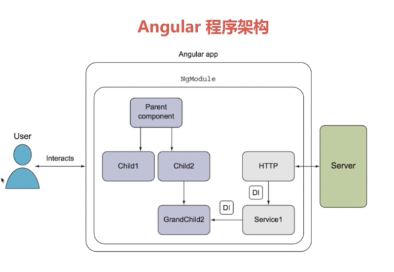
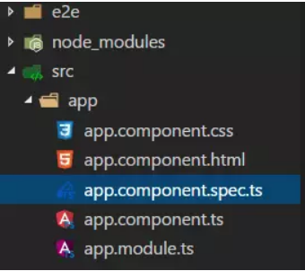

# Angular框架 #

* [1、Angular 简介](#1、Angular简介)
* [2、Angular 简单使用](#2、Angular简单使用)
* [3、Angular 框架](#3、Angular框架)
* [4、依赖注入【DI】](#4、依赖注入【DI】)
* [5、路由](#5、路由)
* [6、指令](#6、指令)
* [7、数据绑定和管道](#7、数据绑定和管道)
* [8、可观察对象（Observable)](#8、可观察对象（Observable))
* [9、组件间通信](#9、组件间通信)
* [10、Angular表单处理](#10、Angular表单处理)
* [11、与服务器通讯](#11、与服务器通讯)
* [12、多环境](#12、多环境)

### 1、Angular 简介 ###

	谷歌开发的。
	angularJS 2.X 及以后的版本都成为 angular，和angularjs是不同的语法框架。

	angular 使用了 TypeScripts 语法编写。

> Angular 功能

	模板功能强大丰富
	比较完善的前端 MVC 框架
	引入了java的一些概念

> Angular 新特性

	1. 全新的命令行工具 -- Angular CLI
	2. 服务器端渲染
	3. 移动和桌面兼容

### 2、Angular 简单使用 ###

[Angular速查表](https://www.angular.cn/guide/cheatsheet)
[Angular API](https://www.angular.cn/api)

> 全局安装 Angular CLI

	npm install -g @angular/cli

	安装完毕后可以使用命令行 ng
	ng --version

[cli 命令行API](https://www.angular.cn/cli)

[项目文件结构](https://www.angular.cn/guide/file-structure)
> 创建新项目

	ng new <project_name> 可以帮你开始项目。
	CLI 会在新建的工作空间（以 project_name 为根目录）中，安装必要的 Angular npm 包和其它依赖。 
	它还会创建如下的工作空间和最初的项目文件：
		一个初始的骨架应用项目，也叫 project_name（位于 src/ 子目录下）。

		一个端到端测试项目（位于 e2e/ 子目录下）。
		
		相关配置文件。

	生成一个新项目【my-app】以及默认的应用代码：
	ng new my-app

> 启动开发服务器

	进入项目目录，并启动服务器。
	
	cd my-app
	ng serve --open

	ng serve 命令会启动开发服务器，监听文件变化，并在修改这些文件时重新构建此应用。

	使用 --open（或 -o）参数可以自动打开浏览器并访问 http://localhost:4200/。

	cli 默认端口是 4200，也可以自定义端口，如下
	node_modules/@angular/cli/lib/config/schema.json

		"port": {
              "type": "number",
              "description": "Port to listen on.",
              "default": 4200
            },

### 3、Angular 框架 ###

> 框架要素

	1. 组件
		提供用于数据绑定的属性和方法。
		是Angular应用的基本构建块，可以把一个组件理解为一段带有业务逻辑和数据的 HTML 标签。
		
	2. 服务
		用来封装可重用的业务逻辑

	3. 指令
		允许向 html 元素添加自定义行为
	
	4. 模块
		用来将应用中不同的部分组成一个 Angular 框架可以理解的单元。
		即将 Angular 的功能【组件 + 服务 + 指令】进行打包，进行模块化处理。

#### 组件 Component ####

	整个angular 就是一个组件树。

	组件其实是 一个类，它定义了一系列 方法和属性，并且把 HTML模板 封装起来。
	你可以把它当做一个独立的隔离的盒子,并利用其中的方法和属性进行盒子内部的操作，以及和外界的父组件、兄弟组件交互。

	提供用于数据绑定的属性和方法，以便作为视图（由模板渲染）和应用逻辑（通常包含一些模型的概念）的中介者。

	组件不应该定义任何诸如从服务器获取数据、验证用户输入或直接往控制台中写日志等工作，而要把这些任务委托给各种服务。
	通过把各种处理任务定义到可注入的服务类中，你可以让它被任何组件使用。 

	组件必备元素：
		1. 装饰器 @Component()
			声明组件的元数据信息

		2. 模板 Template
		
		3. 控制器 Controller 【属性、方法】
			模板和控制器间进行数据绑定

	例子：
		import { Component } from '@angular/core';
	
		@Component({
		  selector: 'app-root',					// html 标签
		  templateUrl: './app.component.html',	// html 模板
		  styleUrls: ['./app.component.css']	// html 样式css
		})
		export class AppComponent {
		  title = 'alex';
		}

		在 html中使用组件 app-root，将组件作为 html标签使用
		// html
		

		  <app-root></app-root>//可以像原生标签一样添加属性，而且组件能接收的属性更丰富
		           //标签里面也可以放内容
		

	组件可以实现 OnInit, OnChanges 接口来监听初始化和组件变化时的操作。

	组件可选的可注入对象
		1. 输入属性 	-- @inputs()
		2. 提供器 	-- providers

	组件可选的输出对象
		1. 样式表 	-- styles
		2. 动画 		-- animations
		3. 输出属性 	-- @Outputs()

	命令行创建组件【g 表示 generate】
	ng g component <组件名称>

	比如：
		ng g component starts

	结果：
		CREATE src/app/starts/starts.component.html (25 bytes)
		CREATE src/app/starts/starts.component.spec.ts (628 bytes)
		CREATE src/app/starts/starts.component.ts (269 bytes)
		CREATE src/app/starts/starts.component.css (0 bytes)
		UPDATE src/app/app.module.ts (897 bytes)

	在文件中速度创建组件格式
	a-component 再按tab键

	文件就是典型的 模块 + 组件 的文件组成模式
	Angular2应用由模块和组件构成，每个模块命名都是：<name>.module.ts，组件则是<name>.component.ts。

	这几个文件的关系是从属关系：
	|--app.module.ts(模块)
	 |--app.component.ts(组件)
	  |--app.component.html(HTML模板)
	  |--app.component.css(CSS样式表)

	一个模块可以有多个组件，一个组件也可以有多个样式表,但只有一个HTML模板。

> 组件生命周期

	每个组件都有一个被 Angular 管理的生命周期。
	指令和组件的实例有一个生命周期：新建、更新和销毁。

	通过实现一个或多个 Angular core 库里定义的生命周期钩子接口，开发者可以介入该生命周期中的这些关键时刻。

	每个接口都有唯一的一个钩子方法，它们的名字是由接口名再加上 ng 前缀构成的。
	比如，OnInit 接口的钩子方法叫做 ngOnInit， Angular 在创建组件后立刻调用它

	export class NavbarComponent implements OnInit {

	  constructor() { }
	
	  ngOnInit() {
	  }
	
	}

> 生命周期的顺序

	当 Angular 使用构造函数新建一个组件或指令后，就会按下面的顺序在特定时刻调用这些生命周期钩子方法：

|钩子|用途|调用时间|
|:--|:--|:--|
|ngOnChanges()| 当 Angular（重新）设置数据绑定输入属性时响应。 该方法接受当前和上一属性值的 SimpleChanges 对象|当被绑定的输入属性的值发生变化时调用，首次调用一定会发生在 ngOnInit() 之前。|
|ngOnInit() | 在 Angular 第一次显示数据绑定和设置指令/组件的输入属性之后，初始化指令/组件。| 在第一轮 ngOnChanges() 完成之后调用，只调用一次。|
|ngDoCheck() | 检测，并在发生 Angular 无法或不愿意自己检测的变化时作出反应。|在每个 Angular 变更检测周期中调用，ngOnChanges() 和 ngOnInit() 之后。|
|ngAfterContentInit() | 当把内容投影进组件之后调用。| 第一次 ngDoCheck() 之后调用，只调用一次。|
|ngAfterContentChecked() | 每次完成被投影组件内容的变更检测之后调用。| ngAfterContentInit() 和每次 ngDoCheck() 之后调用|
|ngAfterViewInit() | 初始化完组件视图及其子视图之后调用。| 第一次 ngAfterContentChecked() 之后调用，只调用一次。|
|ngAfterViewChecked() | 每次做完组件视图和子视图的变更检测之后调用。| ngAfterViewInit() 和每次 ngAfterContentChecked() 之后调用。|
|ngOnDestroy() | 当 Angular 每次销毁指令/组件之前调用并清扫。 在这儿反订阅可观察对象和分离事件处理器，以防内存泄漏。| 在 Angular 销毁指令/组件之前调用。|

> 常用的声明周期钩子

	1. OnInit()钩子
		使用 ngOnInit() 有两个原因：
		
			1. 在构造函数之后马上执行复杂的初始化逻辑
			
			2. 在 Angular 设置完输入属性之后，对该组件进行准备。

		ngOnInit() 是组件获取初始数据的好地方，且ngOnInit() 只会被调用一次。

	2. OnChanges() 钩子

		一旦检测到该组件(或指令)的输入属性发生了变化，Angular 就会调用它的 ngOnChanges() 方法。

		当被绑定的输入属性的值发生变化时调用，首次调用一定会发生在 ngOnInit() 之前。

		ngOnChanges(changes: SimpleChanges): void {
		  for (let propName in changes) {
		    let chng = changes[propName];
		    let cur  = JSON.stringify(chng.currentValue);
		    let prev = JSON.stringify(chng.previousValue);
		    this.changeLog.push(`${propName}: currentValue = ${cur}, previousValue = ${prev}`);
		  }
		}
	
		ngOnChanges() 方法获取了一个对象，它把每个发生变化的属性名都映射到了一个SimpleChange对象， 该对象中有属性的 当前值【currentValue】和 前一个值【previousValue】。
		这个钩子会在这些发生了变化的属性上进行迭代，并记录它们。

	3. OnDestroy()钩子

		一些清理逻辑必须在 Angular 销毁指令之前运行，把它们放在 ngOnDestroy() 中。

	4. ngDoCheck()钩子

		变更检测，并在发生 Angular 无法或不愿意自己检测的变化时作出反应。
		用这个方法来检测那些被 Angular 忽略的更改。
		在每个 Angular 变更检测周期中调用，ngOnChanges() 和 ngOnInit() 之后。

		这个 ngDoCheck 钩子被非常频繁的调用 —— 在每次变更检测周期之后，发生了变化的每个地方都会调它。 
		大部分检查的第一次调用都是在 Angular 首次渲染该页面中其它不相关数据时触发的。 仅仅把鼠标移到其它 <input> 中就会触发一次调用。 
		性能开销是个问题。

#### 模块 ####

	1. 模块的含义

		模块就是将一系列的组件还有指令、服务整合封装到一起，提供一个完整的功能。
		模块可以被外部模块引用。

	2. 根模块

		每个应用会有一个根模块，按照约定，它的类名叫做AppModule，被放在app.module.ts文件中。
		应用启动时，就会加载这个模块。

		每个根模块会有一个根组件，默认就是app.component.ts，名字是app-root。

		查看项目目录中的index.html，会发现有<app-root>Loading...</app-root>这样的代码，就是在加载这个根模块。

	3. 模块详解

		// 每个在浏览器中运行的应用的根模块都需要引入BrowserModule
		import { BrowserModule } from '@angular/platform-browser';

		// 每个模块都需要引入的核心库中的NgModule
		import { NgModule } from '@angular/core';

		// 表单模块，在应用中使用表单时引入
		import { FormsModule } from '@angular/forms';

		// http模块，当需要进行http远程请求时引入
		import { HttpModule } from '@angular/http';
		
		// 自己创建的组件
		import { AppComponent } from './app.component';
		
		@NgModule({
		  declarations: [
		    AppComponent
		  ],
		  imports: [
		    BrowserModule,
		    FormsModule,
		    HttpModule
		  ],
		  providers: [],
		  bootstrap: [AppComponent]
		})
		export class AppModule { }

		Angular2用 TypeScript组织代码的方式大致就像这个文件一样。
	
		在顶部使用import语句，导入模块或者组件需要使用的外部模块。
		在模块中需要使用自己创建的组件或者其他服务、指令，也需要import。
	
		import语句之后，使用 @NgModule() 语句描述本模块的元数据。
	
		NgModule 用于描述应用的各个部分如何组织在一起。
		每个应用又至少一个 Angular 模块，根模块就是你用来启动此应用的模块。 
		按照惯例，它通常命名为 AppModule。

			1. declarations:	声明属于本模块的组件，每个组件必须在且仅在一个模块中声明。
			2. imports:			引入买本模块中用到的模块，该模块是处于import语句引入的模块中。
			3. providers:		声明模块中使用的服务的提供器，即依赖的自定义的服务类本身。
			4. bootstrap:		根模块中的引导组件，应用启动过程中，会创建这个数组中的组件并插入到HTML中，一般只有一个引导组件。
	
		最后，使用 export 语句，创建模块的类并暴露出去。
		模块、组件只有暴露出去，其他的模块才能引用。

	4. 组件详解

		// 所有组件必须引入
		import { Component } from '@angular/core';  
		
		@Component({
		  selector: 'app-root',
		  templateUrl: './app.component.html',
		  styleUrls: ['./app.component.css']
		})
		export class AppComponent {
		  title = 'app works! 你已经完成了第一步';
	
		  constructor() {
		      console.log('当前环境是：' + environment.env);
		  }
		}

		import语句导入需要的模块。
		使用 @Component() 来描述本组件的元数据。
			1. selector:	创建的组件的名字，就像HTML标签的名字一样
			2. templateUrl: HTML模板，使用相对路径，./ 表示这个组件文件所在的当前目录，
			3. styleUrls:	HTML模板使用的样式表，可以有多个，以数组的形式。
	
		在类中，可以创建 属性和方法。
		最后，使用 expor t创建组件的类并暴露出去。
		
		
	5. 应用启动过程
		
		整个应用的启动流程：加载根模块，加载所需的其他模块，创建引导组件，显示组件内容。

	6. 命令行创建模块
		ng g module <模块名>

#### 服务 ####

	服务是一个广义的概念，它包括应用所需的任何值、函数或特性。
	狭义的服务是一个明确定义了用途的类。它应该做一些具体的事，并做好。

	Angular 把组件和服务区分开，以提高模块性和复用性。
	通过服务获取业务数据，再通过DI将数据交给组件渲染给视图。

	在 Angular 中，要把一个类定义为服务，就要用 @Injectable 装饰器来提供元数据，以便让 Angular 可以把它作为依赖注入到组件中。

	命令行创建服务
		ng g service <服务名>

	比如：在service目录下创建 product.service.ts 服务
	ng g service service/product

	// 生成 product.service.ts
	import { Injectable } from '@angular/core';

	@Injectable({
	  providedIn: 'root'
	})
	export class ProductService {
	
	  constructor() { }
	}

> 例子

	// 1. 定义服务 product.service.ts
	import { Injectable } from '@angular/core';

	@Injectable({
	  providedIn: 'root'
	})
	export class ProductService {
	
	  constructor() { }
	
	  getProduct(): Product {
	    return new Product(0,"荣耀9", 1900,"很好");
	  }
	}
	
	export class Product {
	
	  constructor(
	    public id:number,
	    public title: string,
	    public price: number,
	    public desc: string
	  ) {}
	}

	// 2. 在 模块中加入 服务的提供器
	// app.module.ts
	providers: [ProductService]

	
	// 3. 创建组件 product.component.ts ，注入 ProductService 服务
	import { Component, OnInit } from '@angular/core';
	import {Product, ProductService} from "../service/product.service";
	
	@Component({
	  selector: 'app-product',
	  templateUrl: './product.component.html',
	  styleUrls: ['./product.component.css']
	})
	export class ProductComponent implements OnInit {

	  product: Product;
	
	  constructor(private productService: ProductService) {}
	
	  ngOnInit() {
	   
	    this.product = this.productService.getProduct();
	  }
	
	}

### 4、依赖注入【DI】 ###

	组件是服务的消费者，即你可以把一个服务注入到组件中，让组件类得以访问该服务类。
	依赖注入为新建的组件提供所需的服务或其它东西。

	类会从外部源中请求获取依赖，而不是自己创建它们。

	我们创建的类提供了一个服务。@Injectable() 装饰器把它标记为可供注入的服务。

> 注入器是主要的机制。
		
    你不用自己创建 Angular 注入器。
	Angular 会在启动过程中为你创建 全应用级注入器【根注入器】。
	该注入器维护一个包含它已创建的依赖实例的容器，并尽可能复用它们。
	会到 providers 中查找该服务提供器。

	在注入器范围内，服务是单例的。
	应用只有一个根注入器。在 root 或 AppModule 级提供 UserService 意味着它注册到了根注入器上。

> 提供商【providers】是一个创建依赖的列表。
	
	提供商会告诉注入器如何创建该服务。
	对于服务来说，它通常就是这个 服务类本身。因此注入器可以使用 new 来创建实例。
	你在应用中要用到的任何类都必须使用该应用的注入器注册一个提供器，以便注入器可以使用它来创建新实例。

	// app.module.ts
	providers: [HeroService]

	
> 三种方式设置元数据，以便在应用的不同层级使用提供商来配置各个注入器

	1. 在服务本身的 @Injectable() 装饰器中。
	
	2. 在 NgModule 的 @NgModule() 装饰器中。
	
	3. 在组件的 @Component() 装饰器中。

	@Injectable() 装饰器具有一个名叫 providedIn 的元数据选项，在那里你可以指定把被装饰类的提供商放到 root 注入器中，或某个特定 NgModule 的注入器中。

		@Injectable({
		  providedIn: 'root'
		})

		@Injectable({
		  providedIn: HeroModule	// 它能用于 HeroModule 包含的所有注入器中。
		})

	@NgModule() 和 @Component() 装饰器都有用一个 providers 元数据选项，在那里你可以配置 NgModule 级或组件级的注入器。
		
		@NgModule/@Component({
		  providers: [ProductService]
		})

> 注入服务

	通过构造函数注入服务来创建实例，而不是使用 new 。

	//构造函数中依赖了 HeroService服务，即注入了 HeroService服务
	constructor(private service: HeroService) { }

	【注】
	Angular 只有一种注入方式 -- 构造函数注入
	需要标注 @Injectable 才可以进行注入服务，标注了 @Component【内部使用了@Injectable】的话也可以进行注入。

### 5、路由 ###

	Angular 的路由器是一个可选的服务，它用来呈现指定的 URL 所对应的视图。

	import { RouterModule, Routes } from '@angular/router';

> 使用 CLI 生成路由项目

	ng new app --routing

	--routing 声明创建路由

> 使用 CLI 生成路由

	ng g module app-routing --flat --module=app

		--flat 把这个文件放进了 src/app 中，而不是单独的目录中。
		--module=app 告诉 CLI 把它注册到 AppModule 的 imports 数组中。

	生成的文件是这样的：

		// src/app/app-routing.module.ts
		
		import { NgModule } from '@angular/core';
		import { CommonModule } from '@angular/common';
		
		@NgModule({
		  imports: [
		    CommonModule
		  ],
		  declarations: []
		})
		export class AppRoutingModule { }

	通常不会在路由模块中声明组件，所以可以删除 @NgModule.declarations 并删除对 CommonModule 的引用。

	需要使用 RouterModule 中的 Routes 类来配置路由器，所以还要从 @angular/router 库中导入这两个类。

	添加一个 @NgModule.exports 数组，其中放上 RouterModule 。 
	导出 RouterModule 让路由器的相关指令可以在 AppModule 中的组件中使用。

	此刻的 AppRoutingModule 是这样的：
	
	// src/app/app-routing.module.ts

	import { NgModule }             from '@angular/core';
	import { RouterModule, Routes } from '@angular/router';
	
	const routes: Routes = [];

	@NgModule({
	  exports: [ RouterModule ]
	})
	export class AppRoutingModule {}

> 例子

	import { NgModule } from '@angular/core';
	import { RouterModule, Routes } from '@angular/router';
	import {ProductComponent} from "./product/product.component";
	import {NavbarComponent} from "./navbar/navbar.component";
	import {Code404Component} from "./code404/code404.component";
	
	const routes: Routes = [
	  { path: '', component: NavbarComponent },
	  { path: 'product', component: ProductComponent },
	  { path: '**', component: Code404Component }   
	];
	
	@NgModule({
	  imports: [ RouterModule.forRoot(routes) ],
	  exports: [ RouterModule ],
	  declarations: []
	})
	export class AppRoutingModule { }

> 添加路由定义

	路由定义 会告诉路由器，当用户点击某个链接或者在浏览器地址栏中输入某个 URL 时，要显示哪个组件。

	典型的 Angular 路由（Route）有两个属性：
		path：		一个用于匹配浏览器地址栏中 URL 的字符串。
		component：	当导航到此路由时，路由器应该创建哪个组件。

	将路径和组件路由在一起。
	每个 Route 都会把一个 URL 的 path 映射到一个组件。 

	// 当 URL 为 localhost:4200/product 时，就导航到 ProductComponent

	import {ProductComponent} from "./product/product.component";
	import {NavbarComponent} from "./navbar/navbar.component";
	import {Code404Component} from "./code404/code404.component";

	const routes: Routes = [
	  
      { path: 'product', component: ProductComponent },
	  { path: '', component: NavbarComponent },
      { path: '**', component: Code404Component }   	
	];

	【说明】
	path 不能以斜杠（/）开头。 
	路由器会为解析和构建最终的 URL，这样当你在应用的多个视图之间导航时，可以任意使用相对路径和绝对路径。

	空路径（''）表示应用的默认路径，当 URL 为空时就会访问那里，因此它通常会作为起点。
		当 URL 为 localhost:4200 时，就导航到 NavbarComponent
	路由器将会把 URL 匹配到 path: 'product'，并显示 ProductComponent
	path 为 '**'【通配符】 ，当所请求的 URL 不匹配前面定义的路由表中的任何路径时，路由器就会选择此路由。 
		这个特性可用于显示“404 - Not Found”页，或自动重定向到其它路由。

	路由顺序：
		带静态路径的路由
		空路径路由
		通配符路由
	

> RouterModule.forRoot()
		
	你必须首先初始化路由器，并让它开始监听浏览器中的地址变化。

	把 RouterModule 添加到 @NgModule.imports 数组中，并用 routes 来配置它。
	你只要调用 imports 数组中的 RouterModule.forRoot() 函数就行了。

	imports: [ RouterModule.forRoot(routes) ]

	这个方法之所以叫 forRoot()，是因为你要在应用的顶级配置这个路由器。 

	forRoot() 方法会提供路由所需的服务提供商和指令，还会基于浏览器的当前 URL 执行 首次导航。

> 添加路由出口 -- router-outlet
		
	<router-outlet> 占位符的角色
	<router-outlet> 会告诉路由器要在哪里显示路由到的组件。

	打开 AppComponent 的模板，把 <app-heroes> 元素替换为 <router-outlet> 元素。

	// src/app/app.component.html 

	<h1>{{title}}</h1>
	<router-outlet></router-outlet>
	<app-messages></app-messages>

> 添加路由链接 -- routerLink

	不应该让用户只能把路由的 URL 粘贴到地址栏中。他们还应该能通过点击链接进行导航。

	添加一个 <nav> 元素，并在其中放一个链接 <a> 元素，当点击它时，就会触发一个到 HeroesComponent 的导航。 
	修改过的 AppComponent 模板如下：
	
	// src/app/app.component.html (heroes RouterLink)

	<h1>{{title}}</h1>
	<nav>
	  <a routerLink="/heroes">Heroes</a>
	</nav>
	<router-outlet></router-outlet>
	<app-messages></app-messages>

	routerLink 属性的值为 "/heroes"，路由器会用它来匹配出指向 HeroesComponent 的路由。 
	routerLink 是 RouterLink 指令的选择器，它会把用户的点击转换为路由器的导航操作。 
	它是 RouterModule 中公开的另一个指令。
	
	刷新浏览器，显示出了应用的标题和指向英雄列表的链接，但并没有显示英雄列表。
	
	点击这个链接。地址栏变成了 /heroes，并且显示出了英雄列表。

	【注】
	用来添加路由导航参数

	<a routerLink="/detail/{{product.id}}"> 商品详情</a>

> 添加默认路由
	
	当应用启动时，浏览器的地址栏指向了网站的根路径。 
	它没有匹配到任何现存路由，因此路由器也不会导航到任何地方。 
	<router-outlet> 下方是空白的。

	要让应用自动导航到这个仪表盘，请把下列路由添加到 AppRoutingModule.Routes 数组中。
	
	{ path: '', redirectTo: '/dashboard', pathMatch: 'full' },
	这个路由会把一个与空路径“完全匹配”的 URL 重定向到路径为 '/dashboard' 的路由。

	浏览器刷新之后，路由器加载了 DashboardComponent，并且浏览器的地址栏会显示出 /dashboard 这个 URL。

|路由器部件|名称|说明|
|:--|:--|:--|
|Routes | 路由数组 | 定义了一个路由数组，每一个都会把一个 URL 路径映射到一个组件。|
|Route | 路由|定义路由器该如何根据 URL 模式（pattern）来导航到组件。大多数路由都由路径和组件类构成。|
|Router | 路由器 | 负责在运行时执行路由的对象，可以通过调用其 navigate() 和 navigateByUrl()方法来管理从一个组件导航到另一个组件|
|RouterOutlet | 路由出口 | 在 HTML 中标记路由内容呈现位置的占位符指令,该指令（<router-outlet>）用来标记出路由器该在哪里显示视图|
|RouterModule | |一个独立的 Angular 模块，用于提供所需的服务提供商，以及用来在应用视图之间进行导航的指令。|
|RouterLink | 路由链接 | 在 HTML 中声明路由导航用的指令，把可点击的 HTML 元素绑定到某个路由。点击带有 routerLink 指令（绑定到字符串或链接参数数组）的元素时就会触发一次导航。 |
|ActivatedRoute | 激活的路由 | 当前激活的路由对象，保存着当前路由的信息，如路由地址，路由参数、静态数据等|
|RouterLinkActive| 活动路由链接| 当 HTML 元素上或元素内的routerLink变为激活或非激活状态时，该指令为这个 HTML 元素添加或移除 CSS 类。|
|RouterState|路由器状态|路由器的当前状态包含了一棵由程序中激活的路由构成的树。它包含一些用于遍历路由树的快捷方法。|
|链接参数数组|[RouterLink]|这个数组会被路由器解释成一个路由操作指南。你可以把一个RouterLink绑定到该数组，或者把它作为参数传给 Router.navigate 方法。|
|路由组件||一个带有RouterOutlet的 Angular 组件，它根据路由器的导航来显示相应的视图。|

[更多路由信息](https://www.angular.cn/guide/router)

> 路由传递参数

	const routes: Routes = [
		{ path: 'product/:id', component: ProductComponent }
	]

	【说明】
		path 中的冒号（:）表示 :id 是一个占位符，它表示某个特定商品的 id。

	// 在 html 中添加 路由链接，并添加参数
	<a routerLink="/product/3"> 商品详情</a> 
	

	// URL 显示为
	http://localhost:4200/product/3

	// 将参数传递到 html 中
	// 将参数 id 绑定到 组件的 productId 属性
	export class ProductComponent implements OnInit {

	  private productId: number;
	  constructor(private routeInfo: ActivatedRoute) {}
	
	  ngOnInit() {

	    // 订阅路由中参数，当参数id 变更时，会自动变更订阅绑定的本地参数 productId
	    this.routeInfo.params.subscribe(
	      (params: Params) => this.productId = params['id']);
	  }
	
	}

	// product.component.html
	

	  商品id: {{ productId }}
	

[router API](https://www.angular.cn/api/router/)

> 路由重定向

	在用户访问一个特定的地址时，将其重定向到另一个指定的地址。

	const routes: Routes = [
	  { path: '', redirectTo: '/home', pathMatch: 'full' },
	  { path: 'home', component: HomeComponent }
	];

	【说明】
		redirectTo	重定向的路由path
		pathMatch	路径匹配，full 表示全匹配
			在完整的 URL等于 '' 时才选择 HomeComponent 组件

> 子路由

	语法：
		const routes: Routes = [
			...
		  { path: 'xxx' , component: 'xxx',
		    children: [
		      {
		        path: 'xxx',
		        component: 'xxx'
		      },
		      {
		        path: 'xxx',
		        component: 'xxx',
				children: [
			  {
		        path: 'xxx',
		        component: 'xxx'
		      }
				]
		      }
		    ]
		  }
		  
		];
	在路由组件中配置子路由，使用 children:[] 在父路由下添加，子路由还可以嵌套子路由。

	通过 父路由/子路由 来访问，同时显示 父路由和子路由所对应的组件。

	在 html 中配置子路由路径
		使用 相对路径，即相对于当前 父路由URL 的路径。

		./ 或 无前导斜线 形式是相对于当前级别的。
		../ 会回到当前路由路径的上一级。
	
> 例子

	const routes: Routes = [
		...
	  { path: 'product/:id', component: ProductComponent,
	    children: [
	      {
	        path: '',
	        component: ProductDescComponent
	      },
	      {
	        path: 'seller/:id',
	        component: SellerComponent
	      }
	    ]
	  }
	  
	];

	// product.component.html
	<a routerLink="./">商品描述信息</a> 
	<a routerLink="./seller/3">销售员信息</a>
	<router-outlet></router-outlet>

	访问子路由 seller
	http://localhost:4200/product/3/seller/3

> 辅助路由【第二路由】

> 路由守卫

	为了给路由添加安全性，需要路由配置中添加守卫。

	守卫返回一个值，以控制路由器的行为：

		如果它返回 true，导航过程会继续；
		如果它返回 false，导航过程会终止，且用户会留在原地。
		守卫还可以告诉路由器导航到别处，这样也取消当前的导航。

	路由器可以支持多种守卫接口：

		1. CanActivate 		处理导航到某路由的情况，要求认证
	
		2. CanActivateChild 处理导航到某子路由的情况
		
		3. CanDeactivate 	处理从当前路由离开的情况
		
		4. Resolve 			在路由激活之前获取路由数据
		
		5. CanLoad 			处理异步导航到某特性模块的情况

	在分层路由的每个级别上，你都可以设置多个守卫。 
	路由器会先按照从最深的子路由由下往上检查的顺序来检查 CanDeactivate() 和 CanActivateChild() 守卫。 然后它会按照从上到下的顺序检查 CanActivate() 守卫。 
	如果特性模块是异步加载的，在加载它之前还会检查 CanLoad() 守卫。 
	如果任何一个守卫返回 false，其它尚未完成的守卫会被取消，这样整个导航就被取消了。
	

### 6、指令 ###

#### 属性型指令####

> NgClass 指令

	添加或移除一组 CSS 类
	

> NgStyle 指令

	添加或移除一组 CSS 样式

> NgModel 指令

	双向绑定到 HTML 表单元素 [(x)]
	使用 ngModel 时需要导入 FormsModule ，并把它添加到 Angular 模块的 imports 列表中。

	<input [(ngModel)]="currentHero.name">

#### 结构型指令####

> NgForOf 指令
 
	使用 *ngFor 显示数组。

		<li *ngFor="let hero of heroes">
		  {{ hero }}
		</li>

	带索引的 *ngFor
		

			{{i + 1}} - {{hero.name}}
		

> NgIf 指令

	使用 *ngIf 进行条件显示

	
 3">There are many heroes!

	ngIf 指令通常会用来防范空指针错误。
		
Hello, {{nullHero.name}}

> NgSwitch 指令

	NgSwitch 指令类似于 JavaScript 的 switch 语句。
	它可以从多个可能的元素中根据switch 条件来显示某一个。 
	Angular 只会把选中的元素放进 DOM 中。

	NgSwitch 实际上包括三个相互协作的指令：
		NgSwitch、NgSwitchCase 和 NgSwitchDefault。
	
	//app.component.html
	

	  <app-happy-hero    *ngSwitchCase="'happy'"    [hero]="currentHero"></app-happy-hero>
	  <app-sad-hero      *ngSwitchCase="'sad'"      [hero]="currentHero"></app-sad-hero>
	  <app-confused-hero *ngSwitchCase="'confused'" [hero]="currentHero"></app-confused-hero>
	  <app-unknown-hero  *ngSwitchDefault           [hero]="currentHero"></app-unknown-hero>
	

### 7、数据绑定和管道 ###

> HTML attribute 与 DOM property 的对比

	就算名字相同，HTML attribute 和 DOM property 也不是同一样东西。

	attribute 是由 HTML 定义的;
	property 是由 DOM (Document Object Model) 定义的。

	DOM 属性的值表示当前值，可以改变；
	HTML属性的值表示初始值，不可改变，在初始化完成后就固定了。

	按钮的 disabled 这个 property 是 false，因为默认情况下按钮是可用的。 
	当你添加 disabled 这个 attribute 时，只要它出现了按钮的 disabled 这个 property 就初始化为 true，于是按钮就被禁用了。
	但 attribute 的值无关紧要，这就是你为什么没法通过 <button disabled="false">仍被禁用</button> 这种写法来启用按钮。
	
	模板绑定是通过 DOM属性【property】和事件来工作的，而不是HTML属性【attribute】。

	在 Angular 的世界中，attribute 唯一的作用是用来初始化元素和指令的状态。 
	当进行数据绑定时，只是在与元素和指令的 property 和事件打交道，而 attribute 就完全靠边站了。

> 数据绑定

	插值绑定 {{}}：

		<h1>{{ title }}</h1>
		使用 插值表达式  将一个表达式的值显示在模板上
	
	单向属性绑定 []：

		元素的 property
		组件的 property
		指令的 property

		
		使用方括号 将HTML 标签的一个属性【src】绑定到一个组件属性【imgUrl】上
		

	单向事件绑定 ()：

		<button (click)="toProductDetail()">商品详情</button>
		使用小括号 将组件控制器的一个方法绑定为模板上一个事件的处理器

		<input (input)="onInputEvent($event)">
	
		<input (事件名称)="事件发生时执行的表达式">
			onInputEvent 	组件方法名
			$event			浏览器事件对象
				绑定会通过名叫 $event 的事件对象传递关于此事件的信息（包括数据值）。
		
			如果目标事件是原生 DOM 元素事件， $event 就是 DOM 事件对象，它有像 target 和 target.value 这样的属性。
			<input [value]="currentHero.name" (input)="currentHero.name=$event.target.value" >
				可以通过 $event.target.value 来获取值。

> HTML 属性绑定
		
	1. 基本 HTML 属性绑定
	2. CSS 类绑定	
	
		
Special
	// isSpecial为true时，就添加 special CSS类

		属性名 由class前缀，一个点 (.)和 CSS 类的名字组成， 其中后两部分是可选的。形如：[class.class-name]。

		多CSS类名绑定
			
Special

		绑定到 NgClass，可以同时添加或移除多个类，通过 key:value 形式的控制对象，key 为CSS 类名，value 为boolean值。
			

	3. 样式绑定
	
		可以绑定多个 CSS 类名组成的样式
		属性名，而由style前缀，一个点 (.)和 CSS 样式的属性名组成。 形如：[style.style-property]。

		<button [style.color]="isSpecial ? 'red' : 'green'">
		<button [style.font-size]="isSpecial ? 'x-large' : 'smaller'" >

		有些样式绑定中的样式带有单位。在这里，以根据条件用 “em” 和 “%” 来设置字体大小的单位。
		<button [style.font-size.%]="!isSpecial ? 150 : 50" >Small</button>

		可以通过 NgStyle 绑定可以同时设置多个内联样式。
		NgStyle 需要绑定到一个 key:value 控制对象。 
		对象的每个 key 是样式名，它的 value 是能用于这个样式的任何值。

	4. Attribute 绑定【例外】
	
		可以通过attribute 绑定来直接设置 attribute 的值。
		当元素没有属性可绑的时候，就必须使用 attribute 绑定。
		<td> 元素没有 colspan 属性。 但是插值表达式和属性绑定只能设置属性，不能设置 attribute。
		<td [attr.colspan]="1 + 1">One-Two</td>

			属性名 由attr前缀，一个点 (.) 和 attribute 的名字组成。
	

> 双向数据绑定  [(...)] 

	在元素层面上，既要设置元素属性，又要监听元素事件变化。
	双向数据绑定语法：[(x)]。 [(x)] 语法结合了属性绑定的方括号 [x] 和事件绑定的圆括号 (x)。

	[(x)]="组件属性"

	同个组件内
		Angular 以 NgModel 指令为桥梁，允许在表单元素上使用双向数据绑定。
	
		<input [(ngModel)] = "name"> {{name}}
	
		设置表单name 的值时，页面上的name也被监听并相应修改。

	不同组件间

		// 子组件 
		export class SizerComponent {
		  @Input()  size: number | string;

			// 发射事件，让父级组件更新UI
		  @Output() sizeChange = new EventEmitter<number>();
		 
		  dec() { this.resize(-1); }
		  inc() { this.resize(+1); }
		 
		  resize(delta: number) {
		    this.size = Math.min(40, Math.max(8, +this.size + delta));
		    this.sizeChange.emit(this.size);
		  }
		}

		// 父组件 html
		<app-sizer [(size)]="fontSizePx"></app-sizer>

		【说明】
		当一个元素拥有可以设置的属性 x 和对应的事件 xChange 时，才可以使用 [(x)]="组件属性" 进行双向绑定
		即命名需要规定 输出的属性 = 输入属性 + Change
		@Input()  size @Output() sizeChange

		拆分
		<app-sizer [size]="fontSizePx" (sizeChange)="fontSizePx=$event"></app-sizer>

		$event 变量包含了 SizerComponent.sizeChange 事件的荷载。 
		当用户点击按钮时，Angular 将 $event 赋值给 AppComponent.fontSizePx。

> 管道

	管道操作符 | 
	管道是一个简单的函数，它接受一个输入值，并返回转换结果。

	作用：
		在绑定之前，表达式的结果可能需要一些转换。
		管道操作符会把它左侧的表达式结果传给它右侧的管道函数。

	比如：
		{{title | uppercase}}
		
生日：{{ birthday | date }}

	还可以通过多个管道串联表达式
		 {{title | uppercase | lowercase}}
		

	还能对它们使用参数：
		语法：右边函数:'参数/格式'

		pi: number = Math.PI;
		
生日：{{ birthday | date:'yyyy-MM-dd HH:mm:ss' }}

		
圆周率：{{ pi | number:'2.0-2'}}
	// 03.14

	date 管道格式化日期
	number 管道格式化数字，格式：整数个数.小数点个数，-表示小数点个数范围，不够会自动补0

	json 管道对调试绑定特别有用：
		
		// component.ts
		student: Object = {
		    id: 3,
		    name: 'alex',
		    age: '16'
		  };

		// html
		
{{ student| json}}
	// { "id": 3, "name": "alex", "age": "16" }

	
	命令行生成自定义管道 multiple
		ng g pipe pipe/multiple

	生成如下：
	
		import { Pipe, PipeTransform } from '@angular/core';
	
		@Pipe({
		  name: 'multiple'
		})
		export class MultiplePipe implements PipeTransform {
		
		  transform(value: any, args?: any): any {
		    return null;
		  }
		
		}

> 安全导航操作符 ( ?. ) 和空属性路径

	用来保护出现在属性路径中 null 和 undefined 值
	
	{{currentHero?.name}} // 当 currentHero 不为空时才显示name。

> 非空断言操作符（!）

	用来保护出现在属性路径中 null 和 undefined 值
	{{hero!.name}}

> 模板引用变量 ( #var )

	模板引用变量通常用来引用模板中的某个 DOM 元素，它还可以引用 Angular 组件或指令或Web Component。

	使用井号 (#) 来声明引用变量。
	 #phone 的意思就是声明一个名叫 phone 的变量来引用 <input> 元素。

	// src/app/app.component.html
	<input #phone placeholder="phone number">

### 8、可观察对象（Observable) ###

[可观察对象具体说明](https://www.angular.cn/guide/observables)

> 可观察对象介绍

	可观察对象支持在应用中的发布者和订阅者之间传递消息。 
	在需要进行事件处理、异步编程和处理多个值的时候，可观察对象相对其它技术有着显著的优点。

	可观察对象是声明式的。
	即虽然你定义了一个用于发布值的函数，但是在有消费者订阅它之前，这个函数并不会实际执行。 订阅之后，当这个函数执行完或取消订阅时，订阅者就会收到通知。

	可观察对象可以发送多个任意类型的值 —— 字面量、消息、事件。
	无论这些值是同步发送的还是异步发送的，接收这些值的 API 都是一样的。
	由于准备（setup）和清场（teardown）的逻辑都是由可观察对象自己处理的，因此你的应用代码只管订阅并消费这些值就可以了，做完之后，取消订阅。

> 基本用法和词汇

	要执行所创建的可观察对象，并开始从中接收通知，你就要调用它的 subscribe() 方法，并传入一个观察者（observer）。

	它定义了你收到的这些消息的处理器（handler）。 
	subscribe() 调用会返回一个 Subscription 对象，该对象具有一个 unsubscribe() 方法。 
	当调用该方法时，你就会停止接收通知。

> 定义观察者 Observer

	用于接收可观察对象通知的处理器要实现 Observer 接口。
	这个对象定义了3个回调函数来处理可观察对象可能会发来的三种通知：
		next:		必要。用来处理每个送达值。在开始执行后可能执行零次或多次。
		error:		可选。用来处理错误通知。错误会中断这个可观察对象实例的执行过程。
		complete:	可选。用来处理执行完毕（complete）通知。当执行完毕后，这些值就会继续传给下一个处理器。

	const myObserver = {
	  next: x => console.log('Observer got a next value: ' + x),
	  error: err => console.error('Observer got an error: ' + err),
	  complete: () => console.log('流处理完毕'),
	};

	【说明】
	1. next() 函数
		可以接受 消息字符串、事件对象、数字值或各种结构，具体类型取决于上下文。 
		为了更通用一点，我们把由可观察对象发布出来的数据统称为 流。
		任何类型的值都可以表示为可观察对象，而这些值会被发布为一个流。

	2. 错误处理 error
		由于可观察对象会异步生成值，所以用 try/catch 是无法捕获错误的。
		应该在观察者中指定一个 error 回调来处理错误。
		发生错误时还会导致可观察对象清理现有的订阅，并且停止生成值。
		
	可观察对象可以生成值（调用 next 回调），也可以调用 complete 或 error 回调来主动结束。

	error 和 complete 只会执行一次。

> 订阅 subscribe()

	只有当订阅 Observable 的实例时，它才会开始发布值。 
	订阅时要先调用该实例的 subscribe() 方法，并把一个观察者对象【Observer】传给它，用来接收通知。

	myObservable.subscribe(myObserver);

	可以调用 unsubscribe() 方法来取消订阅。

> 创建可观察对象 Observable

	它有一个构造函数可以用来创建新实例，但是为了更简明，也可以使用 Observable 上定义的一些静态方法来创建一些常用的简单可观察对象：

	1. of(...items) —— 返回一个 Observable 实例
		它用同步的方式把参数中提供的这些值发送出来。

	2. from(iterable) —— 把它的参数转换成一个 Observable 实例。 
		该方法通常用于把一个 数组 转换成一个（发送多个值的）可观察对象。

	const myObservable = of(1, 2, 3);

	myObservable.subscribe(
	  x => console.log('Observer got a next value: ' + x),
	  err => console.error('Observer got an error: ' + err),
	  () => console.log('流处理完毕')
	);

	// Observer got a next value: 1
	// Observer got a next value: 2
	// Observer got a next value: 3
	// 流处理完毕

> 使用构造函数创建可观察对象

	使用 Observable 构造函数可以创建 任何类型 的可观察流。 
	当执行可观察对象的 subscribe() 订阅方法时，这个构造函数就会把它接收到的参数作为订阅函数来运行。 否则什么也不做。
	订阅函数会接收一个 Observer 对象，并把值发布给观察者的 next() 方法。
	
	new Observable()

> 多播

### 响应式编程 RxJS库 ###

	响应式编程是一种 面向数据流和变更传播的异步编程范式。

	RxJS（响应式扩展的 JavaScript 版）是一个使用可观察对象进行响应式编程的库，它让组合异步代码和基于回调的代码变得更简单 (RxJS Docs)。

> RxJS 库的作用

	1. 用于 创建和使用 可观察对象
	2. 把现有的 异步代码 转换成 可观察对象
	3. 迭代 流中的各个值
	4. 把这些值 映射 成其它类型
	5. 对流进行 过滤
	6. 组合 多个流

> RxJS 库提供的常用操作符

	操作符是基于可观察对象构建的一些对集合进行复杂操作的函数。

	操作符接受一些配置项，然后返回一个以来源可观察对象为参数的函数。
	当执行这个返回的函数时，操作符会将可观察对象发出的值进行转换，并将转换后的值组合成可观察对象，进行返回。

	可以使用管道【 pipe() 】来把这些操作符链接起来。

	import { map } from 'rxjs/operators';
	...

	const squareOddVals = pipe(
	  filter((n: number) => n % 2 !== 0),
	  map(n => n * n)
	);

	pipe() 函数也同时是 RxJS 的 Observable 上的一个方法，所以你可以用下列简写形式来达到同样的效果：

	const squareOdd = of(1, 2, 3, 4, 5)
	  .pipe(
	    filter(n => n % 2 !== 0),
	    map(n => n * n)
	  );

|类别|操作|
|:--|:--|
|创建|	from, fromPromise,fromEvent, of|
|组合|	combineLatest, concat, merge, startWith , withLatestFrom, zip|
|过滤|	debounceTime, distinctUntilChanged, filter, take, takeUntil|
|转换|	bufferTime, concatMap, map, mergeMap, scan, switchMap|
|工具|	tap|
|多播|	share|

> 错误处理

	除了可以在订阅时提供 error() 处理器外，RxJS 还提供了 catchError 操作符，它允许你在管道中处理已知错误。

	catchError(err => of([]))

> 重试失败的可观察对象

	catchError 提供了一种简单的方式进行恢复，而 retry 操作符让你可以尝试失败的请求。

	可以在 catchError 之前使用 retry 操作符。
	它会订阅到原始的来源可观察对象，它可以重新运行导致结果出错的动作序列。
	如果其中包含 HTTP 请求，它就会重新发起那个 HTTP 请求。

	 retry(3)	// 重试3次

> 可观察对象的命名约定

	可观察对象的名字约定以"$"符号结尾。
	如果你希望用某个属性来存储来自可观察对象的最近一个值，它的命名惯例是与可观察对象同名，但不带“$”后缀。

	students: number;
	students$: Observable<number>;

> Angular 中的可观察对象

	Angular 使用可观察对象作为处理各种常用 异步操作 的接口。
	比如：

	1. EventEmitter 类派生自 Observable。

	2. HTTP 模块使用可观察对象来处理 AJAX 请求和响应。

	3. 路由器 和 表单模块 使用可观察对象来监听对用户输入事件的响应。

> 1. 事件发送器 EventEmitter

	Angular 提供了一个 EventEmitter 类，它用来从组件的 @Output() 属性中发布一些值。
	EventEmitter 扩展了 Observable，并添加了一个 emit() 方法，这样它就可以发送任意值了。
	当你调用 emit() 时，就会把所发送的值传给订阅上来的观察者的 next() 方法。

	@Output() open = new EventEmitter<any>();

> 2. HTTP

	Angular 的 HttpClient 从 HTTP 方法调用中返回了可观察对象。

	例如，http.get('/api') 就会返回可观察对象。
	相对于基于承诺（Promise）的 HTTP API，它有一系列优点：

		可观察对象不会修改服务器的响应（和在承诺上串联起来的 .then() 调用一样）。反之，你可以使用一系列操作符来按需转换这些值。

		HTTP 请求是可以通过 unsubscribe() 方法来取消的。

		请求可以进行配置，以获取进度事件的变化。

		失败的请求很容易重试。

> 3. Async 管道

	AsyncPipe 会订阅一个可观察对象或承诺，并返回其发出的最后一个值。
	当发出新值时，该管道就会把这个组件标记为需要进行变更检查的

	<ul *ngFor="let student of students$ | async">

> 路由器 (router)

	Router.events 以可观察对象的形式提供了其事件。 
	你可以使用 RxJS 中的 filter() 操作符来找到感兴趣的事件，并且订阅它们，以便根据浏览过程中产生的事件序列作出决定。

	navStart: Observable<NavigationStart>;
 
	constructor(private router: Router) {
	    // Create a new Observable the publishes only the NavigationStart event
	    this.navStart = router.events.pipe(
	      filter(evt => evt instanceof NavigationStart)
	    ) as Observable<NavigationStart>;
	}

	ngOnInit() {
	    this.navStart.subscribe(evt => console.log('Navigation Started!'));
	  }

	ActivatedRoute 是一个可注入的路由器服务，它使用可观察对象来获取关于路由路径和路由参数的信息。
	比如，ActivateRoute.url 包含一个用于汇报 路由路径 的可观察对象。

	constructor(private activatedRoute: ActivatedRoute) {}
	 
	  ngOnInit() {
	    this.activatedRoute.url
	      .subscribe(url => console.log('The URL changed to: ' + url));
	  }

	其他参数参考路由章节的 ActivatedRoute

### 9、组件间通信 ###

> 输入和输出属性 @Input()/@Output()

	概念：
		输入属性是一个带有 @Input 装饰器的可设置属性。
			当它通过 属性绑定 的形式被绑定时，值会“流入”这个属性。
	
		输出属性是一个带有 @Output 装饰器的 可观察对象型的属性。 
			这个属性几乎总是返回 Angular 的EventEmitter。 
			当它通过 事件绑定 的形式被绑定时，值会“流出”这个属性。
	
		输入属性通常接收数据值。 
		输出属性暴露事件生产者，如 EventEmitter 对象。
		【注】输入和输出是针对 模板 而言的。

		// iconUrl 和 onSave 是组件的成员
	
								// 输入
		<button (click)="onSave()">Save</button>	// 输出

	【注】
		在 同组件中进行属性和事件的绑定【输入和输出绑定】不需要使用装饰器，
		但在 绑定到其他组件时就只能 通过它的输入和输出属性将其绑定，否则编译出错。
			在其他组件中，Angular 编译器并不知道是否有这些属性、事件。
	
		// hero-detail.component.ts
		@Input()  hero: Hero;
		@Output() deleteRequest = new EventEmitter<Hero>();
	
		// 也可以在组件元数据中标记
		@Component({
		  inputs: ['hero'],
		  outputs: ['deleteRequest'],
		})

	给输入/输出属性起别名：
	
		把别名传进@Input/@Output 装饰器，就可以为属性指定别名，就像这样：

		// click.directive.ts

		@Output('myClick') clicks = new EventEmitter<string>(); 

		// 或者在元数据中
		outputs: ['clicks:myClick'] 

> 使用 EventEmitter 实现自定义事件  
> 父组件监听子组件的事件

	1. 子组件创建一个 EventEmitter 实例，并且把它作为属性暴露出来。
		子组件的 EventEmitter 属性是一个输出属性，通常带有@Output 装饰器
		
	2. 当事件发生时，子组件利用该属性方法 EventEmitter.emit(payload) 来【向上弹射】触发事件，可以传入任何东西作为消息载荷。 
	
	3. 父指令通过绑定到这个属性来监听事件，并通过 $event 对象来访问载荷。
	

	// 子组件 student.component.ts
	// 1. 创建 EventEmitter 实例
	@Output()
	studentEvent: EventEmitter<Student> = new EventEmitter();

	student: Student = new Student(1,'alex',23);
	
	ngOnInit() {

		// 2. 向父组件发送事件
		this.studentEvent.emit(this.student);
	}

	// 3. 在父组件绑定事件
	// app.component.html
	<app-student (studentEvent) = "studentHandler($event)"></app-student>
	

	  
这是组件外部

	  
student.age: {{ student.age }}

	

	
	// app.component.ts

	student: Student;

	// 捕获子组件发送过来的事件，并传入自己的属性中
	studentHandler(event: Student){
		this.student = event;
	}

	【说明】
	当子组件初始化时就触发事件，向父组件弹射事件，父组件通过事件绑定获取子组件发送过来的事件，并保存到自己的属性中。

> 中间人模式

	两个组件相互通信，为了解耦，使用中间人为这两个组件进行通信。

	1. 使用 共同父组件 作为两个子组件的中间人
	
		// student 组件
		@Output()
		studentEvent: EventEmitter<Student> = new EventEmitter();
	
		student: Student = new Student(1,'alex',23);
		
		ngOnInit() {
	
			// 向父组件发送事件
			this.studentEvent.emit(this.student);
		}
	
		// seller 组件，定义一个输入属性
		@Input()
	  	student:Student;
	
		// seller 组件 html
		销售员姓名：{{ student.name }}
	
		// 中间人组件
		// app.component.html
		<app-student (studentEvent) = "studentHandler($event)"></app-student>
		<app-seller [student]="student"></app-seller>
	
		// app.component.ts
		student: Student;
	
		studentHandler(event: Student){
		    console.log("student=",event);
		    this.student = event;
		  }
	
		【说明】
		中间人组件 app.component将 student组件向上弹射的事件进行接收，然后通过输入属性绑定，将接收到的数据输入到 seller组件中。
		student组件和 seller组件两者并不知道对方的存在。

	2. 使用 服务 作为两个子组件的中间人，两个子组件没有共同的父组件时使用。

		比如搜索服务例子，使用商品服务作为商品组件和搜索组件的中间人进行解耦。
		创建商品服务，商品组件，搜索组件。
		在商品服务中定义搜索方法，返回搜索到的商品。
		在搜索组件中定义发射事件【向商品服务发射】，用来发射搜索的商品参数；
		在商品组件中订阅商品服务，以获取发射的商品参数，再根据订阅获取的参数进行商品过滤，最后将过滤的商品进行赋值，以显示在html中。

		这样 两个组件间就实现了解耦。

> 使用 服务 作为两个子组件的中间人 例子	

	// 商品服务
	@Injectable({
	  providedIn: 'root'
	})
	export class ProductService {
	
	  constructor(private http: HttpClient) { }
	
	  private productSearchUrl = '/api/product/search';
	  // 事件发射，事件订阅
	  searchEvent: EventEmitter<Product> = new EventEmitter();
	
	  // params 需要传递数组形式的参数
	  searchProduct(productParams: Product): Observable<any> {
	    return this.http.get(this.productSearchUrl,{params:this.encodeParams(productParams)});
	  }
	
	  // 将参数格式化为数组
	  public encodeParams(params: Product) {
	    return Object.keys(params)
	      .filter(key => params[key])
	      .reduce((json: any, key: string) => {
	        json[key] = params[key];
	        return json;
	      }, []);
	  }
	
	}
	
	export class Product {
	
	  constructor(
	    public id:number,
	    public name: string,
	    public price: number,
	    public desc: string
	  ) {}
	}

	// 商品组件
	export class ProductComponent implements OnInit {
	
	  private products$: Observable<Product[]>;
	
	  constructor(private productService: ProductService) {}
	
	  ngOnInit() {

	    // 订阅商品服务获取的商品参数进行搜索商品
	    this.productService.searchEvent.subscribe(
	      params => this.products$ = this.productService.searchProduct(params)
	    );
	  }
	
	}

	// 商品HTML
	

	  
商品编号：{{ product.id}}

	  
商品名称：{{ product.name}}

	  
商品价格：{{ product.price}}

	  
商品描述：{{ product.desc}}

	

	// 搜索组件【使用响应式表单】
	formModel: FormGroup;
	constructor(private searchService: SearchService,
	          private productService: ProductService,
	          fb: FormBuilder) {
	this.formModel = fb.group({
	  name: ['']
	});
	}
	
	// 将搜索的商品参数发射给商品服务
	searchProduct() {
		// 将表单参数 this.formModel.value 进行发射
		this.productService.searchEvent.emit(this.formModel.value);
	}	

	// 搜索 HTML
	<form [formGroup]="formModel">
	    

	      按名称搜索:<input type="text" formControlName="name">
	    

	    <button type="button" (click)="searchProduct()">搜索</button>
	</form>

> 内容投影 【 ng-content 标签】

	内容投影是从组件外部导入 HTML 内容，并把它插入在组件模板中指定位置上的一种途径。

	<ng-content> 标签是外来HTML内容的占位符。 它告诉 Angular 在哪里插入这些外来内容。

	使用<ng-content>标签 将父组件html中任意片段投影到子组件的html 中。

	// 子组件
	

	  
home子组件

	  <ng-content select=".header"></ng-content>
	  
home主页信息

	  <ng-content select=".footer"></ng-content>
	

	// 父组件
	

	  
父组件

	  <app-home>
	    
这个是父组件投影到home子组件的页头，title是 {{ title}}

	    
这个是父组件投影到home子组件的页脚

	  </app-home>
	

	【说明】
	将父组件中定义的子组件模板<app-home>的html 信息投影到 home子组件中 <ng-content></ng-content> 标签中。

	
> 总结

	1. 父子组件之间应避免直接访问彼此的内部，而应该通过输入和输出属性来通讯；
	
	2. 组件可以通过输出属性弹射自定义事件，这些时间可以携带任何数据；
		
	3. 在没有父子关系的组件间，尽可能使用中间人模式进行通讯；
		
	4. 父组件可以在运行时投影一个或多个模板片段到子组件中。

### 10、Angular 表单处理 ###

> Angular API

	1. FormControl 实例用于追踪单个表单控件的值和验证状态。
		代表一个表单标签实例。
		username: FormControl = new FormControl('alex');

	2. FormGroup 实例用于追踪一个表单控件集的值和状态。
		代表整个表单或者一个表单标签
		表单控件分组，包含一组 FormControl集合。表单分组还可以嵌套表单分组。
		key:value格式，通过key 来访问元素
		
		key 表示 formControlName，value是 FormControl实例
		
		formModel:FormGroup = new FormGroup({
			dateRange: new FormGroup({
			  from: new FormControl(),
			  to: new FormControl()
			}),
			emails: new FormArray([
			  new FormControl("aaa"),
			  new FormControl("bbb")
			])
		});

	3. FormArray 实例用于追踪一个表单控件数组的值和状态。
		多个FormControl数组集合，代表可以增长的表单集合
		没有key，只能通过index 访问元素

		emails: new FormArray([
		  new FormControl("aaa"),
		  new FormControl("bbb")
		])
	
	4. AbstractControl

		所有三种表单控件类（FormControl、FormGroup 和 FormArray）的抽象基类。它提供了一些公共的行为和属性。

#### 模板式表单 ####

> 模板表单指令

	NgForm			创建		FormGroup 类
	NgModel			创建		FormControl	类
	NgModelGroup	创建		FormGroup	类
	
	【注】
	模板表单指令 只能在模板中使用，不能在代码中使用。

> 模板表单使用

	// 1. 需要导入 FormsModule

	import { FormsModule } from '@angular/forms';

	@NgModule({
	  imports: [
	    // other imports ...
	    FormsModule
	  ],
	})
	export class AppModule { }

	// 2. html
	<form #myForm="ngForm" (ngSubmit)="submit(myForm.value)">
	  
name:<input ngModel name="name" type="text">

	  
phone:<input ngModel name="phone" type="text">

	  

	    
password:<input ngModel name="password" type="password">

	    
confirm-password:<input ngModel name="confirmPasswd" type="password">

	  

	  <button type="submit">注册</button>
	</form>
	

	  {{ myForm.value | json }}
	

	// ts
	submit(value: any){
		console.log(value);
		// TODO
	}

	【说明】
	Angular 自动将 html  中的form 表单转换成 NgForm 进行处理。
	通过 ngSubmit 事件绑定将表单数据传送给组件进行处理。
	
> 使用模板引用变量

	在表单中添加 模板引用变量 #myForm="ngForm" 来引用整个ngForm表单。
	在html 的其他地方可以通过该变量来引用该表单

	标记双向数据绑定 ngModel，也可以使用 [(ngModel)]="<model.name>" 来进行表单数据的显示，监听和读取。
	当在表单中使用 [(ngModel)] 时，必须要定义 name 属性。

	ngModelGroup 表示多个 ngModel 组成一组进行处理。

> NgForm 指令

	Angular 会在 <form> 标签上自动创建并附加一个 NgForm 指令。

	NgForm 指令为 form 增补了一些额外特性。 
	它会控制那些带有 ngModel 指令和 name 属性的元素，监听他们的属性（包括其有效性）。 
	它还有自己的 valid 属性，这个属性只有在它包含的每个控件都有效时才是真。

> 通过 ngModel 跟踪修改状态与有效性验证

	NgModel 指令不仅仅跟踪状态。它还使用特定的 Angular CSS 类来更新控件，以反映当前状态。 可以利用这些 CSS 类来修改控件的外观，显示或隐藏消息。

|状态|为真时的 CSS 类|为假时的 CSS 类|
|:--|:--|:--|
|控件被访问过	| ng-touched | ng-untouched |
|控件的值变化了| ng-dirty | ng-pristine |
|控件的值有效| ng-valid | ng-invalid |

	

		name:<input ngModel #name="ngModel" name="name" type="text">
	

> 使用 ngSubmit 提交该表单

	通过 ngSubmit 事件绑定将表单数据传送给组件的方法进行处理。
	在表单中添加 模板引用变量 #myForm="ngForm" 来引用整个ngForm表单。

	<form #myForm="ngForm" (ngSubmit)="submit(myForm.value)">

> 命令行创建指令

	ng g directive directives/phoneValidator

	// phone-validator.directive
	import { Directive } from '@angular/core';
	
	@Directive({
	  selector: '[appPhoneValidator]'
	})
	export class PhoneValidatorDirective {
	
	  constructor() { }
	
	}

	指令就像没有模板【template】的组件

	指令当做属性来使用
	组件当做标签来使用

> 模板式表单校验

	

	// 引入验证指令
	import { Directive } from '@angular/core';
	import {NG_VALIDATORS} from "@angular/forms";
	import {phoneValidator} from "../validator/validator";
	
	@Directive({
	  selector: '[appPhoneValidator]',
	  providers: [{ provide: NG_VALIDATORS, useValue: phoneValidator, multi: true}]
	})
	export class PhoneValidatorDirective {
	
	  constructor() { }
	
	}

	// novalidate 表示不使用浏览器的校验，避免和angular 的校验混淆。
	<form #myForm="ngForm" (ngSubmit)="submit(myForm.value, myForm.valid)" novalidate>
	
	验证有点麻烦
		
phone:<input ngModel name="phone" appPhoneValidator type="text" (input)="inputPhoneValidator(myForm)">

	  

	    

	      {{myForm.form.getError('phone','phone')?.msg}}
	    

	  

> 例子

	// validator.ts 
	// 全局验证函数
	import {FormControl, FormGroup} from "@angular/forms";
	
	export function phoneValidator(control: FormControl): any {
	  const reg = /^1(?:3\d|4[4-9]|5[0-35-9]|6[67]|7[013-8]|8\d|9\d)\d{8}$/;
	  const valid = reg.test(control.value);
	  console.log("phone校验结果 ", valid);
	  return valid ? null : {phone: {msg:"用户手机号码不正确"}};
	}
	
	export function equalValidator(group: FormGroup): any {
	  const password: FormControl = group.get("password") as FormControl;
	  const confirmPasswd: FormControl = group.get("confirmPasswd") as FormControl;
	  const valid: boolean = (password.value === confirmPasswd.value);
	  console.log("密码校验结果 ", valid);
	  return valid ? null : {equal: true};
	}

	// html
	<form #myForm="ngForm" (ngSubmit)="submit(myForm.value, myForm.valid)" novalidate>
	  
name:<input ngModel #name="ngModel" required minlength="4" name="name" type="text"
	                   (input)="inputNameValidator(myForm)">

	  

	    

	      用户姓名是必填项
	    

	    

	      用户姓名最小长度是4
	    

	  

	  
phone:<input ngModel name="phone" appPhoneValidator type="text" (input)="inputPhoneValidator(myForm)">

	  

	    

	      {{myForm.form.getError('phone','phone')?.msg}}
	    

	  

	  

	    
password:<input ngModel required minlength="6" name="password" type="password">

	    

	      密码最小长度是6
	    

	    
confirm-password:<input ngModel name="confirmPasswd" type="password">

	    

	      密码和确认密码不一致
	    

	  

	  <button type="submit">注册</button>
	</form>

	// 组件

	submit(value: any,valid: boolean){
    console.log(valid);
    if (valid){
      console.log(value);
    }
	  }
	
	  nameValid: boolean = true;
	  nameUnTouched: boolean = true;
	  phoneValid: boolean = true;
	  phonePristine: boolean = true;
	
	  inputNameValidator(form: NgForm) {
	    if (form) {
	      this.nameValid = form.form.get("name").valid;
	      this.nameUnTouched = form.form.get("name").untouched;
	    }
	  }
	
	  inputPhoneValidator(form: NgForm) {
	      if (form){
	        this.phoneValid = form.form.get("phone").valid;
	        this.phonePristine = form.form.get("phone").pristine;
	      }
	  }

#### 响应式表单 ####

> 概念：

	响应式表单提供了一种模型驱动的方式来处理表单输入，其中的值会随时间而变化。
	响应式表单是围绕 Observable 的流构建的，表单的输入和值都是通过这些输入值组成的流来提供的，它可以同步访问。

	响应式表单不能使用 模板引用变量来引用表单。

> 使用：
		
	1. 要使用响应式表单，就要从 @angular/forms 包中导入 ReactiveFormsModule 并把它添加到你的 NgModule 的 imports 数组中。

	// app.module.ts
	import { ReactiveFormsModule } from '@angular/forms';
	
	@NgModule({
	  imports: [
	    // other imports ...
	    ReactiveFormsModule
	  ],
	})
	export class AppModule { }

	2. 生成并导入一个新的表单控件

		import { Component } from '@angular/core';
		import { FormControl } from '@angular/forms';
		
		@Component({
		  selector: 'app-name-editor',
		  templateUrl: './name-editor.component.html',
		  styleUrls: ['./name-editor.component.css']
		})
		export class NameEditorComponent {
		  name = new FormControl('alex');
		}

		可以用 FormControl 的构造函数设置初始值

	3. 在模板中注册该控件

		在组件类中创建了控件之后，你还要把它和模板中的一个表单控件关联起来。
		修改模板，通过 Name后缀的指令为表单控件添加组件的 formControl 绑定。

		// html
		<label>
		  Name:<input type="text" formControlName="name">
		</label>

> 响应式表单指令

	1. formGroup	创建		FormControl 类，代表一个表单标签

	2. formControl	创建		FormGroup 类，代表整个表单或者一个表单标签

	3. formGroupName	把一个内嵌的 FormGroup 实例绑定到一个 DOM 元素。

	4. formControlName	把一个现有 FormGroup 中的 FormControl 实例根据名字绑定到表单控件元素。

	5. formArrayName	把一个内嵌的 FormArray 实例绑定到一个 DOM 元素。

	【注】
	以name 为结尾的表单属性name，字符串格式，不使用属性绑定语法，只能在响应式表单指令范围下使用
	formGroup、formControl 使用属性绑定方式

> 例子

	// html
	<form [formGroup]="formModel" (submit)="onSubmit()" >
	  

	    Start Time:<input type="date" formControlName="from">
	    End Time:<input type="date" formControlName="to">
	  

	  

	    <ul formArrayName="emails">
	      <li *ngFor="let e of this.formModel.get('emails').controls; let i = index;">
	        <input type="text" [formControlName]="i">
	      </li>
	    </ul>
	    <button type="button" (click)="addEmail()">添加EMAIL</button>
	  

	  

	    <button type="submit">保存</button>
	  

	</form>

	// ts
	formModel:FormGroup = new FormGroup({
	    dateRange: new FormGroup({
	      from: new FormControl(),
	      to: new FormControl()
	    }),
	    emails: new FormArray([
	      new FormControl("aaa"),
	      new FormControl("bbb")
	    ])
	  });
	
	  onSubmit() {
	    console.log(this.formModel.value);
	  }
	  addEmail() {
	    const emails = this.formModel.get("emails") as FormArray; // 获取表单并转为 FormArray类
	    emails.push(new FormControl());
	  }

> 在模板中显示表单数组

	<ul formArrayName="emails">
      <li *ngFor="let e of this.formModel.get('emails').controls; let i = index;">
        <input type="text" [formControlName]="i">
      </li>
    </ul>

	*ngFor 指令对 FormArray 提供的每个 FormControl 进行迭代。
	因为 FormArray 中的元素是匿名的，所以你要把索引号赋值给 i 变量，并且把它传给每个控件的 formControlName 输入属性。

> 保存表单数据

	 FormGroup 指令会监听 form 元素发出的 submit 事件，并发出一个 ngSubmit 事件，让你可以绑定一个回调函数。

	把 onSubmit() 回调方法添加为 form 标签上的 ngSubmit 事件监听器。

	// html
	<form [formGroup]="formModel" (submit)="onSubmit()" >

	// 组件上的 onSubmit() 方法会捕获 formModel 的当前值
	onSubmit() {
		console.log(this.formModel.value);
	}

> 使用 FormBuilder 来生成表单控件

	用 FormBuilder 来代替手工创建这些 FormControl 和 FormGroup 实例。

	1. 从 @angular/forms 包中导入 FormBuilder 类。

		import { FormBuilder } from '@angular/forms';

	2. 注入 FormBuilder 服务

		FormBuilder 是一个可注入的服务提供商，它是由 ReactiveFormModule 提供的。
		只要把它添加到组件的构造函数中就可以注入这个依赖。

		constructor(private fb: FormBuilder) { }

	3. 生成表单控件
		
		FormBuilder 服务有三个方法：control()、group() 和 array()。
		这些方法都是工厂方法，用于在组件类中分别生成 FormControl、FormGroup 和 FormArray。

		formModel:FormGroup;

		constructor(fb: FormBuilder) {
		  this.formModel = fb.group({
		    name: [''],
		    phone: [''],
		    passwordsGroup: fb.group({
		      password: [''],
		      confirmPasswd: ['']
		    })
		  });
		}

		每个控件名对应的值都是一个数组，这个数组中的第一项是其初始值。
		在这个数组中的第二项和第三项提供 同步和异步验证器。

	4. 表单
	
		<form [formGroup]="formModel" (ngSubmit)="onSubmit()">
		  
name:<input type="text" formControlName="name">

		  
phone:<input type="text" formControlName="phone">

		  

		    
password:<input type="password" formControlName="password">

		    
confirm-password:<input type="password" formControlName="confirmPasswd">

		  

		  <button type="submit">注册</button>
		</form>

> 模板表单验证

	为了往模板驱动表单中添加验证机制，你要添加一些验证属性，就像原生的 HTML 表单验证器。
	Angular 会用指令来匹配这些具有验证功能的指令。
	每当表单控件中的值发生变化时，Angular 就会进行验证，并生成一个验证错误的列表（对应着 INVALID 状态）或者 null（对应着 VALID 状态）。

	把 ngModel 导出成局部模板变量来查看该控件的状态。#name="ngModel"

	// html
	<input id="name" name="name" class="form-control"
      required minlength="4" appForbiddenName="bob"
      [(ngModel)]="hero.name" #name="ngModel" >

	

	
	  

	    Name is required.
	  

	  

	    Name must be at least 4 characters long.
	  

	  

	    Name cannot be Bob.
	  

	
	

> 响应式表单的验证

	在响应式表单中，真正的源码都在 组件类中。
	不应该通过模板上的属性来添加验证器，而应该在组件类中直接把验证器函数添加到表单控件模型上（FormControl）。
	然后，一旦控件发生了变化，Angular 就会调用这些函数。

> 验证器函数

	有两种验证器函数：同步验证器和异步验证器。

	1. 同步验证器函数接受一个控件实例，然后返回一组验证错误或 null。
		你可以在实例化一个 FormControl 时把它作为构造函数的第二个参数传进去。

	2. 异步验证器函数接受一个控件实例，并返回一个承诺（Promise）或可观察对象（Observable），它们稍后会发出一组验证错误或者 null。
		你可以在实例化一个 FormControl 时把它作为构造函数的第三个参数传进去。

	【注意】
	出于性能方面的考虑，只有在所有同步验证器都通过之后，Angular 才会运行异步验证器。
	当每一个异步验证器都执行完之后，才会设置这些验证错误。

> 内置验证器

	你可以写自己的验证器，也可以使用一些 Angular 内置的验证器。

	模板驱动表单中可用的那些属性型验证器（如 required、minlength 等）对应于 Validators 类中的同名函数。
	Validators 提供一组内置验证器，可用于各种表单控件。

	class Validators {
	  static min(min: number): ValidatorFn
	  static max(max: number): ValidatorFn
	  static required(control: AbstractControl): ValidationErrors | null
	  static requiredTrue(control: AbstractControl): ValidationErrors | null
	  static email(control: AbstractControl): ValidationErrors | null
	  static minLength(minLength: number): ValidatorFn
	  static maxLength(maxLength: number): ValidatorFn
	  static pattern(pattern: string | RegExp): ValidatorFn
	  static nullValidator(control: AbstractControl): ValidationErrors | null
	  static compose(validators: (ValidatorFn | null | undefined)[] | null): ValidatorFn | null
	  static composeAsync(validators: (AsyncValidatorFn | null)[]): AsyncValidatorFn | null
	}

[Validators验证列表详解](https://www.angular.cn/api/forms/Validators)

	// reactive.component.ts
	constructor(fb: FormBuilder) {
      this.formModel = fb.group({
        name: ['alex',[Validators.required,Validators.minLength(4)]],
        phone: ['13714140929',Validators.required],
        passwordsGroup: fb.group({
          password: [''],
          confirmPasswd: ['']
        },{validator: Validators.required})
      });
	}

	onSubmit() {
	    const isValid: boolean = this.formModel.get("name").valid;
	    console.log("name校验结果：", isValid);
	    const errors: any = this.formModel.get("name").errors;
	    console.log("name校验错误信息:", JSON.stringify(errors));
	    console.log(this.formModel.value);
	  }

	// name校验结果: {"required":true}

> 自定义验证器

	由于内置验证器无法适用于所有应用场景，有时候你还是得创建自定义验证器。
	
	1.	定义验证器方法。在 自定义验证器中使用正则表达式进行验证。

	phoneValidator(control:FormControl): any {
	    const reg = /^1(?:3\d|4[4-9]|5[0-35-9]|6[67]|7[013-8]|8\d|9\d)\d{8}$/;
	    const valid = reg.test(control.value);
	    console.log("phone校验结果 ",valid);
	    return valid;
	  }

	equalValidator(group: FormGroup): any{
	    const password: FormControl = group.get("password") as FormControl;
	    const confirmPasswd: FormControl = group.get("confirmPasswd") as FormControl;
	    const valid: boolean = (password.value === confirmPasswd.value);
	    console.log("密码校验结果 ",valid);
	    return valid;
	}

	
	2. 在响应式表单组件中，添加自定义验证器相当简单。你所要做的一切就是直接把这个函数传给 FormControl 。

	constructor(fb: FormBuilder) {
	  this.formModel = fb.group({
	    name: ['alex',[Validators.required,Validators.minLength(4)]],
	    phone: ['13714140929',this.phoneValidator],
	    passwordsGroup: fb.group({
	      password: [''],
	      confirmPasswd: ['']
	    },{validator: this.equalValidator})
	  });
	}

	【说明】
	如果是实例化一个 FormControl，就把自定义验证器作为构造函数的第二个参数传进去[param1,param2,param3]。
	
	如果是实例化一个 FormGroup，就把自定义验证器作为K/V对象传进去，其中key为validator，value为自定义验证器。
	
> 将验证结果显示在 html上

	

		

		  用户姓名是必填项
		

		

		  用户姓名最小长度是4
		

	

	

		

			password:<input type="password" formControlName="password">
		

		

		  密码最小长度是6
		

		

			confirm-password:<input type="password" formControlName="confirmPasswd">
		

		

		  密码和确认密码不一致
		

	

	【说明】
	formModel.hasError('required','name')
		hasError的参数1表示 校验结果返回的对象的key;	
				参数2 表示验证的表单字段名字

		name校验结果: {"required":true}

	当在 formGroup 内验证时，参数2 为一个数组，数组内元素顺序就是父子结构的顺序
		!formModel.hasError('minlength',['passwordsGroup','password'])

> 异步验证器

	
> 表示控件状态的 CSS 类

	Angular 会自动把很多控件属性作为 CSS 类映射到控件所在的元素上。
	你可以使用这些类来根据表单状态给表单控件元素添加样式。
	目前支持下列类：

		.ng-valid / .ng-invalid			// 是否可用
		.ng-pending						// 正在校验中
		.ng-pristine / .ng-dirty		// 是否修改过
		.ng-untouched /.ng-touched  	// 是否触碰过，是否获取过焦点

	// css
	.ng-valid[required], .ng-valid.required  {
	  border-left: 5px solid #42A948; 
	}
	
	.ng-invalid:not(form)  {
	  border-left: 5px solid #a94442; 
	}

	.errorText {
	  color: red;
	}

	// html ，使用属性绑定CSS样式
	

      用户姓名是必填项
    

> 模板式表单和响应式表单

	模板式表单 适用于简单的表单
	响应式表单 适用于复杂的表单

### 11、与服务器通讯 ###

> tsconfig.json的作用：

	告诉angular编译器如何将 typescripts编译成javascripts

	{
	  "compileOnSave": false,
	  "compilerOptions": {		// 编译器配置
	    "baseUrl": "./",
	    "outDir": "./dist/out-tsc",
	    "sourceMap": true,			// 使用 sourceMap 调试工具
	    "declaration": false,
	    "module": "commonjs",		// 使用的规范
	    "moduleResolution": "node",
	    "emitDecoratorMetadata": true,
	    "experimentalDecorators": true,
	    "target": "es5",		// 编译成的语法脚本
	    "typeRoots": [
	      "node_modules/@types"
	    ],
	    "lib": [	// 声明编译时的语法
	      "es6",
	      "dom"
	    ]
	  },
	  "exclude": [
	    "node_modules"
	  ]
	}

	//tsconfig.json指定了用来编译这个项目的根文件和编译选项
	{
	    "compilerOptions": {             //compilerOptions:编译选项,可以被忽略，这时编译器会使用默认值
	    "allowSyntheticDefaultImports": true,//允许从没有设置默认导出的模块中默认导入。这并不影响代码的显示，仅为了类型检查。
	    "baseUrl": "./src",//解析非相对模块名的基准目录
	    "emitDecoratorMetadata": true, //给源码里的装饰器声明加上设计类型元数据
	    "experimentalDecorators": true,//启用实验性的ES装饰器
	        "module": "commonjs",        //指定生成哪个模块系统代码
	        "moduleResolution": "node",  //决定如何处理模块。或者是"Node"对于Node.js/io.js，或者是"Classic"（默认）
	        "noEmitHelpers": true,//不再输出文件中生成用户自定义的帮助函数代码，如__extends。
	                "noImplicitAny": false,     //在表达式和声明上有隐含的any类型时报错
	             "sourceMap": true,          //用于debug ,生成相应的.map文件
	             "strictNullChecks": false,//在严格的null检查模式下，null和undefined值不包含在任何类型里，只允许用它们自己和any来赋值（有个例外，undefined可以赋值到void）。
	        "target": "es5",             //目标代码类型
	    "paths": {  //模块名到基于baseUrl的路径映射的列表
	    },
	       "lib": [  //编译过程中需要引入的库文件的列表
	        "dom",
	        "es6"
	       ],
	    "types": [  //要包含的类型声明文件名列表；如果指定了types，只有被列出来的包才会被包含进来
	    "hammerjs",
	    "node",
	    "source-map",
	    "uglify-js",
	    "webpack"
	    ]},
	      "exclude": [  //如果"files"和"include"都没有被指定，编译器默认包含当前目录和子目录下所有的TypeScript文件（.ts, .d.ts 和 .tsx），排除在"exclude"里指定的文件。
	      "node_modules",
	      "dist"
	      ],
	  "awesomeTypescriptLoaderOptions": {  //Typescript加载选项
	  "forkChecker": true,
	  "useWebpackText": true
	  },
	  "compileOnSave": false,          
	  "buildOnSave": false,            
	  "atom": { "rewriteTsconfig": false }
	}

	可以使用 TypeScript 类型定义文件 —— .d.ts 文件——来告诉编译器要加载的库的类型定义。

> Angular 代理到后端服务器 

	通过代理路径获取后端服务器的数据。

	你可以使用 webpack 开发服务器中的代理支持来把特定的 URL 转发给后端服务器，只要传入 --proxy-config 选项就可以了。 
	比如，要把所有到 http://localhost:4200/api 的调用都转给运行在 http://localhost:8080/api 上的服务器，可采取如下步骤：

		1. 在项目的 src/ 目录下创建一个 proxy.conf.json 文件，紧挨着 package.json。

		2. 往这个新的代理配置文件中添加如下内容：

	
		// 1. proxy.config.json
		{
		  "/api":{
		    "target":"http://localhost:8080"
		  }
		}

		//2.  package.json 的脚本需要添加 --proxy-config 选项指定 proxy.conf.json 启动
		"scripts": {
			"start": "ng serve --proxy-config proxy.conf.json",
		}

		3. npm start 启动

	当访问angular 的 http://localhost:3000/api/list 时会自动跳转为后端服务器的 http://localhost:8080/api/list

	重写 URL 路径

		pathRewrite 代理配置项能让你在运行时重写 URL 路径。 
		比如，你可以在代理配置中指定如下的 pathRewrite 值，以移除路径末尾的 "api" 部分。

		{
		  "/api": {
		    "target": "http://localhost:8080",
		    "secure": false,
		    "pathRewrite": {
		      "^/api": ""
		    }
		  }
		}

		即http://localhost:3000/api/list -》 http://localhost:8080/list
	
	如果你要访问的后端不在 localhost 上，还要设置 changeOrigin 选项。
	比如：

		{
		  "/api": {
		    "target": "http://npmjs.org",
		    "secure": false,
		    "pathRewrite": {
		      "^/api": ""
		    },
		    "changeOrigin": true
		  }
		}
	
	
	添加日志选项，可以设置 logLevel 选项
	
		{
		  "/api": {
		    "target": "http://localhost:3000",
		    "secure": false,
		    "pathRewrite": {
		      "^/api": ""
		    },
		    "logLevel": "debug"
		  }
		}	
		
		代理的有效日志级别是 info（默认值）、debug、warn、error 和 silent。
	
		日志显示：
		[HPM] Rewriting path from "/api/list" to "/list"
		[HPM] GET /api/list ~> http://localhost:8080
		[HPM] Rewriting path from "/api" to ""
		[HPM] GET /api ~> http://localhost:8080

	代理多个前缀的URL

		1. 通过用 JavaScript 定义此配置，你还可以把多个条目代理到同一个目标。
		将代理配置文件设置为 proxy.conf.js（代替 proxy.conf.json），并指定如下例子中的配置文件。

		// proxy.conf.js
		const PROXY_CONFIG = [
		  {
		    context: [
		      "/api",
		      "/student"
		    ],
		    target: "http://localhost:8080",
		    secure: false,
		    logLevel: "debug"
		  }
		];
		
		module.exports = PROXY_CONFIG;

		2. 在 CLI 配置文件 angular.json 中，指向 JavaScript 配置文件：
			"scripts": {
				"start": "ng serve --proxy-config proxy.conf.js",
			}

> HTTP

	HttpClient 是 Angular 通过 HTTP 与远程服务器通讯的机制。

	import {HttpClient, HttpHeaders, HttpResponse} from "@angular/common/http";

	将获取数据的逻辑单独包装成一个服务，便于管理。再通过注入的方式将服务的数据提供给组件。

	HTTP 请求方式 -- 源码 client.d.ts

	// get源码 
	get(url: string, options?: {
        headers?: HttpHeaders | {
            [header: string]: string | string[];
        };
        observe?: 'body';
        params?: HttpParams | {
            [param: string]: string | string[];
        };
        reportProgress?: boolean;
        responseType?: 'json';
        withCredentials?: boolean;
    }): Observable<Object>;

> 请求 JSON 格式的数据

	从服务器上获取 JSON 数据

	// JSON 数据 assets/config.json

	{
	  "heroesUrl": "api/heroes",
	  "textfile": "assets/textfile.txt"
	}

	1. 定义一个获取数据的服务 ConfigService 
		1. 定义一个具有正确形态的接口：

			export interface Config {
			  heroesUrl: string;
			  textfile: string;
			}
		
		2. 服务中创建一个方法来获取数据
		ConfigService会通过 HttpClient 的 get() 方法取得这个文件，并指定具体的类型参数。

		getConfig() {
		  // now returns an Observable of Config
		  return this.http.get<Config>(this.configUrl);
		}

	2. 在 ConfigComponent 组件中注入 ConfigService服务，并调用其 getConfig 方法。

		config: Config;
		
		showConfig() {
		  this.configService.getConfig()
		    // clone the data object, using its known Config shape
		    .subscribe((data: Config) => this.config = { ...data });
		}
		
		这个服务方法返回配置数据的 Observable 对象，所以组件要订阅（subscribe） 该方法的返回值。 
		订阅时的回调函数会把这些数据字段复制到组件的 config 对象中，它会在组件的模板中绑定，以供显示。
		其回调函数中获取一个带类型的对象

	3. 在html 中显示数据
	
	<button (click)="clear(); showConfig()">get</button>
	
	    
Heroes API URL is "{{config.heroesUrl}}"

	    
Textfile URL is "{{config.textfile}}"

	

> 读取完整的响应体

	响应体可能并不包含你需要的全部信息。有时候服务器会返回一个特殊的响应头或状态码，以标记出特定的条件，因此读取它们可能是必要的。
	通过 observe 选项来告诉 HttpClient，你想要完整的响应信息，而不是只有响应体

	// 1. 服务 config.service.ts
	getConfigResponse(): Observable<HttpResponse<Config>> {
	  return this.http.get<Config>(
	    this.configUrl, { observe: 'response' });
	}

	现在 HttpClient.get() 会返回一个 HttpResponse 类型的 Observable，而不只是 JSON 数据。

	该组件的 showConfigResponse() 方法会像显示配置数据一样显示响应头：

	// 2. 组件 config.component.ts
	showConfigResponse() {
	  this.configService.getConfigResponse()
	    // resp is of type `HttpResponse<Config>`
	    .subscribe(resp => {
	      // display its headers
	      const keys = resp.headers.keys();
	      this.headers = keys.map(key =>
	        `${key}: ${resp.headers.get(key)}`);
	
	      // access the body directly, which is typed as `Config`.
	      this.config = { ... resp.body };
	    });
	}
	
	该响应对象具有一个带有正确类型的 body 属性。

	// 3. html
	<button (click)="clear(); showConfigResponse()">getResponse</button>
	

	  Response headers:
	  <ul>
	    <li *ngFor="let header of headers">{{header}}</li>
	  </ul>
	

> 错误处理

	通过在 .subscribe() 中添加第二个回调函数，你可以在组件中处理它：

	// config.component.ts
	showConfig() {
	  this.configService.getConfig()
	    .subscribe(
	      (data: Config) => this.config = { ...data }, // success path
	      error => this.error = error // error path
	    );
	}

	// html
	
{{error | json}}

> 获取错误详情

	可能发生的错误分为两种。
	1. 如果后端返回了一个失败的返回码（如 404、500 等），它会返回一个错误响应体。

	2. 如果在客户端这边出了错误（比如在 RxJS 操作符 (operator) 中抛出的异常或某些阻碍完成这个请求的网络错误），就会抛出一个 Error 类型的异常。
	
	HttpClient 会在 HttpErrorResponse 中捕获所有类型的错误信息，你可以查看这个响应体以了解到底发生了什么。
	
	错误的探查、解释和解决是你应该在服务中做的事情，而不是在组件中。

	首先要设计一个错误处理器

	// config.service.ts
	private handleError(error: HttpErrorResponse) {
	  if (error.error instanceof ErrorEvent) {
	    // A client-side or network error occurred. Handle it accordingly.
	    console.error('An error occurred:', error.error.message);
	  } else {
	    // The backend returned an unsuccessful response code.
	    // The response body may contain clues as to what went wrong,
	    console.error(
	      `Backend returned code ${error.status}, ` +
	      `body was: ${error.error}`);
	  }
	  // return an observable with a user-facing error message
	  return throwError(
	    'Something bad happened; please try again later.');
	};

	【注意】
	该处理器返回一个带有用户友好的错误信息的 RxJS ErrorObservable 对象。 
	该服务的消费者期望服务的方法返回某种形式的 Observable，就算是“错误的”也可以。

	现在，你获取了由 HttpClient 方法返回的 Observable，并把它们通过管道传给错误处理器。

	// config.service.ts 
	getConfig() {
	  return this.http.get<Config>(this.configUrl)
	    .pipe(
	      catchError(this.handleError)
	    );
	}

> retry()
	
	重试。它可以对失败的 Observable 自动重新订阅几次。
	对 HttpClient 方法调用的结果进行重新订阅会导致重新发起 HTTP 请求。

	把它插入到 HttpClient 方法结果的管道中，就放在错误处理器的紧前面。

	// config.service.ts
	getConfig() {
	  return this.http.get<Config>(this.configUrl)
	    .pipe(
	      retry(3), // retry a failed request up to 3 times
	      catchError(this.handleError) // then handle the error
	    );
	}

> 可观察对象 (Observable) 与操作符 (operator)

	RxJS 是一个库，用于把异步调用和基于回调的代码组合成函数式（functional）的、响应式（reactive）的风格。 很多 Angular API，包括 HttpClient 都会生成和消费 RxJS 的 Observable。

	import { Observable } from 'rxjs';

> 请求非 JSON 格式的数据

	// 服务service.ts
	getTextFile(filename: string) {
    //  HttpClient.get() 返回字符串而不是默认的 JSON 对象，因为它的 responseType 选项是 'text'。
    return this.http.get(filename,{responseType:'text'})
      .pipe(
        // RxJS 的 tap 操作符（可看做 wiretap - 窃听），让这段代码探查由可观察对象传过来的正确值和错误值，而不用打扰它们。
        tap(
          data => console.log(filename, data),
          error => console.error(filename, error)
        )
      );
    }

	// 组件 component.ts
	getText(){
	    this.configService.getTextFile('assets/config.txt')
	      .subscribe(result => this.content = result);
	  }

	// html
	<button (click)="getText()">getText</button>
	
		
文本信息：{{ content }}

	 添加请求头

	在 httpOptions 对象中就定义了一些这样的请求头，并把它传给每个 HttpClient 的保存型方法

	import { HttpHeaders } from '@angular/common/http';

	const httpOptions = {
	  headers: new HttpHeaders({
	    'Content-Type':  'application/json',
	    'Authorization': 'my-auth-token'
	  })
	};

> 发起 GET 请求

	this.http.get<Config>(this.configUrl,this.httpOptions)

	get 请求传递多个参数

	// params 需要传递数组形式的参数 
	searchProduct(productParams: Product): Observable<any> {
	    return this.http.get(this.productSearchUrl,{params:this.encodeParams(productParams)});
	  }
	
	  // 将参数格式化为数组
	  public encodeParams(params: Product) {
	    return Object.keys(params)
	      .filter(key => params[key])
	      .reduce((json: any, key: string) => {
	        json[key] = params[key];
	        return json;
	      }, []);
	  }

> 发起 POST 请求

	this.http.post<Hero>(this.heroesUrl, hero, this.httpOptions)
		param1：post 请求路径；
		param2: post 的请求体数据；
		param3：post 请求的指定了所需的请求头

> 发起 DELETE 请求

	通过 HttpClient.delete 方法的请求 URL 来删除对象

	deleteHero (id: number): Observable<{}> {
	  const url = `${this.heroesUrl}/${id}`; // DELETE api/heroes/42
	  return this.http.delete(url, this.httpOptions)
	    .pipe(
	      catchError(this.handleError('deleteHero'))
	    );
	}

	当 组件 订阅了该服务方法返回的 Observable 时，就会发起一次实际的 DELETE 操作。
	this.heroesService.deleteHero(hero.id).subscribe();

	仅仅调用 HeroesService.deleteHero() 是不会发起 DELETE 请求的。
	还必须调用 subscribe()，否则什么都不会发生，因为deleteHero()返回的是观察者对象。

> 发起 PUT 请求

	应用可以发送 PUT 请求，来使用修改后的数据完全替换掉一个资源。

	this.http.put<Hero>(this.heroesUrl, hero, httpOptions)

> 注意

	在调用方法返回的可观察对象的 subscribe() 方法之前，HttpClient 方法不会发起 HTTP 请求。
	这适用于 HttpClient 的所有方法。
	HttpClient 的所有方法返回的可观察对象都设计为冷的。 
	HTTP 请求的执行都是延期执行的，让你可以用 tap 和 catchError 这样的操作符来在实际执行什么之前，先对这个可观察对象进行扩展。
	调用 subscribe(...) 会触发这个可观察对象的执行，并导致 HttpClient 组合并把 HTTP 请求发给服务器。

	每个 subscribe() 都会初始化此可观察对象的一次单独的、独立的执行。

	配置请求
		待发送请求的其它方面可以通过传给 HttpClient 方法 最后一个参数 中的配置对象进行配置。
		比如请求头。
		this.http.get<Config>(this.configUrl, options)

> 提供商注册语句

	{ provide: HTTP_INTERCEPTORS, useClass: NoopInterceptor, multi: true },
	【注意】
	multi: true 选项。 
	这个必须的选项会告诉 Angular HTTP_INTERCEPTORS 是一个多重提供商的令牌，表示它会注入一个多值的数组，而不是单一的值。

> 请求的防抖搜索

	如果每次击键都发送一次请求就太昂贵了。 最好能等到用户停止输入时才发送请求。 
	使用 RxJS 的操作符就能轻易实现它，即使用可观察者对象进行处理。

	ngOnInit() 中的代码还通过下列三个操作符对这些搜索值进行管道处理：

	1. debounceTime(500) - 等待，直到用户停止输入。
	
	2. distinctUntilChanged() - 等待，直到搜索内容发生了变化。
	
	3. switchMap() - 把搜索请求发送给服务。
	
	this.students$ = this.searchTerms.pipe(
      debounceTime(300),
      distinctUntilChanged(),
      switchMap(
        (term: string) => this.searchService.searchStudents(term))
    );

	这些代码把 students$ 设置成了使用搜索结果组合出的 Observable 对象。 

	<li *ngFor="let student of students$ | async" >

	模板中使用 AsyncPipe 订阅了 students$，一旦搜索结果的值发回来了，就显示这些搜索结果。
	
	这样，只有当用户停止了输入且搜索值和以前不一样的时候，搜索值才会传给服务。

	switchMap()操作符有三个重要的特征：
	
		它的参数是一个返回 Observable 的函数。
		SearchService.search 会返回 Observable，其它数据服务也一样。
	
	如果以前的搜索结果仍然是在途状态（这会出现在慢速网络中），它会取消那个请求，并发起这个新的搜索。
	
	它会按照原始的请求顺序返回这些服务的响应，而不用关心服务器实际上是以乱序返回的它们。

	AsyncPipe 异步管道

		async 管道会自动订阅一个 Observable 或 Promise，并返回它发出的最近一个值。 
		当新值到来时，async 管道就会把该组件标记为需要进行变更检测。
		当组件被销毁时，async 管道就会自动取消订阅，以消除潜在的内存泄露问题。

		所以 HttpClient 的所有方法可以将订阅的操作交给 async 管道
		// html
		<li *ngFor="let student of students$ | async" >

		// 组件.ts
		students$: Observable<Student[]>;

		$ 是一个命名惯例，用来表明 heroes$ 是一个 Observable，而不是数组。
		*ngFor 不能直接使用 Observable。 不过，它后面还有一个管道字符（|），后面紧跟着一个 async，它表示 Angular 的 AsyncPipe。
		AsyncPipe 会自动订阅到 Observable，这样你就不用再在组件类中订阅了。

> 搜索例子

	// search.service.ts
	export class SearchService {
	
	  constructor(private http: HttpClient) { }
	
	  private studentsUrl = '/api/detail';
	
	  searchStudents(term: string): Observable<Student[]> {
	    if (!term.trim()) {
	      return of([]);
	    }
	    return this.http.get<Student[]>(`${this.studentsUrl}?name=${term}`)
	      .pipe(
	        tap(
	    		() => console.log(`found student matching "${term}"`)),
	          	catchError(this.handleError<Student[]>('searchHeroes', []))
	    );
	  }
	
	  private handleError<T> (operation = 'operation', result?: T) {
	    return (error: any): Observable<T> => {
	      console.error(error); // log to console instead
	      return of(result as T);
	    };
	  }
	}

	// search.component.ts
	export class SearchComponent implements OnInit {

	  students$: Observable<Student[]>;
	
	  // 一个序列，包含用户输入到搜索框中的所有值。
	  private searchTerms = new Subject<string>();
	
	  constructor(private searchService: SearchService) {}
	
	  // Push a search term into the observable stream.
	  search(term: string): void {
	    this.searchTerms.next(term);
	  }
	
	  ngOnInit(): void {
	    this.students$ = this.searchTerms.pipe(
	      debounceTime(300),
	      distinctUntilChanged(),
	      switchMap(
	        (term: string) => this.searchService.searchStudents(term))
	    );
	
	  }
	
	}

	// search.component.html
	<input #searchBox (keyup)="search(searchBox.value)" />
	
	  <ul *ngFor="let student of students$ | async">
	      <li>编号: {{ student.id }}</li>
	      <li>姓名: {{ student.name }}</li>
	      <li>年龄: {{ student.age }}</li>
	  </ul>

### 使用第三方库 ###

> angular.json

	工作区中所有项目的 CLI 配置，包括 CLI 使用的构建选项、运行选项、测试工具选项

	npm i jquery --save-dev
	npm i @types/jquery --save-dev	// 支持使用jquery 文件描述符

	npm i bootstrap --save-dev
	npm i @types/bootstrap --save-dev

	添加 jquery 和 bootstrap 支持
	
	"styles": [
		...
      "./node_modules/bootstrap/dist/css/bootstrap.css"
    ],
    "scripts": [
	  "./node_modules/jquery/dist/jquery.js",
      "./node_modules/bootstrap/dist/js/bootstrap.js"
      
    ]

### 12、多环境 ###

	1、在angular.json 中配置环境对象，使用环境覆盖
	
	"configurations": {
        "production": {
          "fileReplacements": [
            {
              "replace": "src/environments/environment.ts",
              "with": "src/environments/environment.prod.ts"
            }
          ],
          "optimization": true,
          "outputHashing": "all",
          "sourceMap": false,
          "extractCss": true,
          "namedChunks": false,
          "aot": true,
          "extractLicenses": true,
          "vendorChunk": false,
          "buildOptimizer": true
        }
      }

	2、在 environments 目录下创建对应环境的ts 文件：environment.环境.ts

	3、在package.json 的启动脚本命令中指定启动的环境
		--env=环境配置对象key

	"start": "ng serve --env=production --proxy-config proxy.conf.js",
