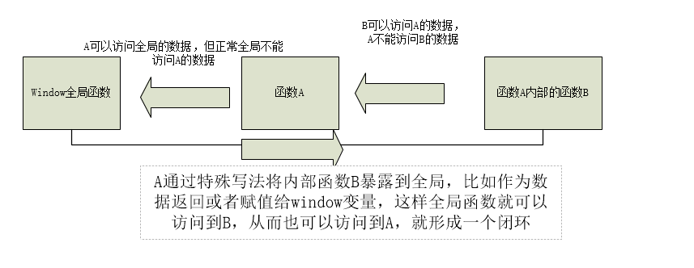

# Javascript #

* [1、变量](#1、变量)
* [2、对象](#2、对象)
* [3、数组](#3、数组)
* [4、函数](#4、函数)
* [5、类和模块](#5、类和模块)
* [6、正则表达式](#6、正则表达式)
* [7、Browser对象【BOM】](#7、Browser对象【BOM】)
* [8、DOM对象](#8、DOM对象)

>语句结束时可以加分号也可以不加。

### 1、变量 ###

> 按数据类型划分变量；
		
	Number String Boolean Undefined Null Array Function Object
	
> 按数据在内存的存储位置划分
		
	1. 基本类型【简单类型】：
		1. 储存在内存的栈里面，在赋值是直接将变量的值复制一份给另一个变量，两个变量互不影响。
		2. 包含 Number String Boolean Undefined Null

	2. 引用类型【复杂类型】：
		1. 储存在内存堆里面，在赋值是将变量指向的内存地址复制给另一个变量，两个变量指向同一个内存地址空间，相互会影响。
		2. 包含 Array Function Object

> 检测变量类型

	1. typeof:
		用于检测变量自身的类型【基本类型】，检测引用类型时都是返回object。

	2. instanceof:
		用于检测变量属性具体引用了哪种类型【引用类型】

> 函数的内置对象 arguments

	1. arguments介绍
		1. arguments 是函数的内置对象，只能在函数内部使用，不能在外部使用。
		2. 是一个对象，操作起来像一个数组，即伪数组。arguments[i]

	2. arguments的作用
		1. 获取函数的所有实参；
			arguments[i]	

			//获取对象所有参数信息
			console.log(arguments);

		2. 调用函数本身。
			arguments.callee()

			//获取对象本身信息
			console.log(arguments.callee.toString());

	3. 写法
		使用for/i遍历;
		foreach遍历；		

### 2、对象 ###

> 原型【重点】

	1. 什么是原型
		原型就是 prototype 属性。
		原型是一个对象，可以添加属性和方法，称为原型属性和原型方法。
		原型会被实例化出来的对象所引用。
	
		每一个JavaScript 对象【除null】都和另一个对象相关联，而“另一个”对象即原型，即每个实例化对象都从原型继承属性。
		对象的原型属性是一个链的形式【原型链】。
		读取属性时，如果在当前对象没有找到该属性，会向上读取原型的对应属性，直到找到该属性或者找到一个原型为null的对象为止。
	
		对象上的属性 __proto__实际上就是对类/构造函数的prototype属性进行引用。
	
	2. 原型的作用
		1. 解决方法过载的问题；
		2. 对已有的类进行扩展【内置类、自定义类】，充当这个类的父类。

	3. 添加原型属性/方法：

		原型对象.prototype.属性/方法
		由于一切对象都继承自Object,所以可以通过Object.prototype.属性/方法 获取对原型对象的引用。

		//写法一
		类名.prototype.方法名 = function(){
			...
		}

		//写法二,通过静态方法
		类名.prototype{
			constructor：类名,
			方法名1:function(){
				...
			},
			方法名2:function(){
				...
			}
		}

	4. 使用原型属性/方法

		var 对象 = new 类名();
		对象.方法名();

		所有实例化出来的对象都引用类的原型。
		

> HTMLElement对象

	新版的浏览器中，所有的DOM元素都继承自 HTMLElement构造器。
	通过访问 HTMLElement 的原型，可以提供扩展任意HTML 节点的能力。

	//给HTML节点添加获取文本长度的能力
	HTMLElement.prototype.getLength = function(){
		var strlen = this.innerText.length;
		return strlen;
	}

> 对象创建

	1. 通过使用对象直接量创建,使用多个键值对组成的映射表，整个表使用{}括起来；
		比如： 
			var empty = {};		//没有任何属性的对象
			var point = {x:1,y:2};

		【注】属性名中含有空格，特殊字符时需要使用引号。

	2. 通过new 创建对象
		new 运算符创建并初始化一个新对象。new 后面跟随一个构造函数。
		比如：
			var obj = new Object();	//创建一个空格对象，和{}一样
			var arr = new Array();

	3. 通过原型创建对象
		使用静态函数 Object.create(param1,param2);
			param1: 该对象的原型；
			param2：可选，对对象的属性进行描述。

		var obj = Object.create(null);				//不继承任何对象
		var obj = Object.create(Parent.prototype)	//创建继承Parent的对象obj

		var obj = Object.create(Object.prototype)

> 对象的内置类型

|类型|描述|
|:--|:--|
|Array	|数字索引值的有序列表|
|Date	|日期和时间|
|Error	|运行时错误|
|Function|用于表示所有函数实例的函数类型|
|Object	|用于表示所有函数实例的函数类型...|
|RegExp	|正则表达式|

	可以使用new来实例化每个内置引用类型

> 封装【重点】

	1. 使用get/set方法进行对象的变量封装，控制对象属性的读写权限；
	2. 使用闭包进行封装。

> 封装一个类的写法

	(function(){
		//构造函数
		function Person(name,age){
				this.name = name;
				this.age = age;
			}

		//原型方法
		类名.prototype={
			constructor: 类名,
			方法名: function(){
				}		
			}

		//静态方法
		类名.方法名=function(){
			}

		//暴露给window
		window.类名=类名;

	})();

> 继承	

	可以通过 instanceof() 判断是否是继承关系。

	1. inherit

		通过它传入指定原型对象来创建实例，返回一个新创建的对象。
	
		function Person(name,age){
			this.name = name;
			this.age = age;
		}
		var obj = inherit(Person);	//obj继承了Person和Object.prototype
	
		
	2. Object.create()
	
		//定义一个父类
		function Person(name,age){
			this.name = name;
			this.age = age;
		}
	
		//定义一个子类
		function Student(name,age,className){
			this.className;
			//通过arguments接收所有参数，此时子类的属性应当放在属性列表的最后。
			// 1. 让子类实例化出来的对象继承父类的所有属性
			Person.apply(this,arguments);	
		}
	
		// 2. 让子类实例化出来的对象拥有父类的所有方法
		// 实现：子类原型成为父类的原型的对象
		Student.prototype = Object.create(Person.prototype)

		//3. 继承后找回子类自己的原型构造函数
		Student.prototype.constructor = Student 

		var student = new Student("alex","23","66");
		console.log(Student.instanceof(Person));
	
	【注】ES6可以使用 extends关键字实现继承，使用super()调用父类属性。

> 属性操作

	添加：
		var obj = {x:1,y:2}

	读：
		obj.x		//只能读取已有的属性【固定】
		obj['x'] 	//可以读取已有的和动态加入的属性【灵活】

	写：obj.x = 3,obj['x'] = 4

	删除：
		delete obj.x , delete obj['x']
		【注】
			1. 不能删除属性为不可配置的属性；
			2. 不能删除全局变量；
			3. 不能删除全局函数;
			4. 删除成功返回true。
			
	检测：
		'属性' in 对象	//不仅检测自身对象，也检测原型链上的对象
		对象.hasOwnProperty('属性')	//只检测自身对象

> 属性特性

	value:		值
	writable:	可写性
	enumerable:	可枚举性
	configurable:	可配置性

	通过Object.definePeoperty()修改属性特性。
	Object.definePeoperty(obj,"x",{
						value:1,writable: true, enumerable: true,configurable:true})

> 获取对象自身的属性特性

	Object.getOwnPropertyDescriptor(obj,"x")

> 对象特性：

	1. prototype:	
		原型，用于继承属性，通过Object.getPrototypeOf获取原型。
		Parent.isPrototypeOf(obj)	检测Parent 是否是obj的原型。

	2. class：		
		类，用于表示对象的类型信息。
		通过使用 toString()方法获取对象的类。

	3. extensible：
		可扩展性，表示是否可以给对象添加新属性。
		Object.isExtensible 判断是否是可扩展的。

> 对象序列化/反序列化：
	
	通过内置函数JSON.stringify()、JSON.parse()还原对象

	var obj = {x:1,y:2}
	JSON.stringify(obj)	//{"x":1,"y":2}
	
	【注意】属性值为undefinded不会被序列化，为NaN、Infinity会序列化为null，日期会序列化为ISO格式的日期字符串。
	JSON.stringify() 底层调用 toJSON()方法实现序列化操作。

	//反序列化
	obj = JSON.parse('{"x":1,"y":2}')
	obj.x; //1

> 自定义序列化

	var persion = {
			x:1,
			y:2,
			z:{
				z1:1,
				z2:2,
				toJSON:function(){
					return this.z1 + this.z2
				}
			}}
	
	JSON.stringify(persion)	//{"x":1,"y":2,"z":3}

	【注】	toJSON是固定写法
	

### 3、数组 ###

- JavaScript 数组是无类型的，数组元素可以是任意类型。
- 数组索引范围 [0,2的32次方-1]
- 数组是动态的，创建时无需指定大小
- 由于数组元素的索引不一定是连续的，可能有空缺【稀疏数组】，所以属性length可能比所有元素的索引大。

JavaScript中创建数组有两种方式

	1. 使用 Array 构造函数：

		var arr1 = new Array(); 	//创建一个空数组
		var arr2 = new Array(20);	// 创建一个包含20项的数组
		var arr3 = new Array("lily","lucy","Tom"); // 创建一个包含3个字符串的数组
 
	2. 使用数组字面量表示法：

		var arr4 = [];		//创建一个空数组
		var arr5 = [20];	// 创建一个包含1项的数组
		var arr6 = ["lily","lucy","Tom"]; // 创建一个包含3个字符串的数组
 
遍历数组元素：

	由于for/in 会遍历原型链上的对象，所以需要进行进一步的判断
	for (x in obj) {
		if(obj.hasOwnProperties(x)){
			...
		}
	}

	//不会遍历原型链上的对象
	for (var i = 0; i < obj.length; i++) {
		obj[i]
	}

数组的方法有数组原型方法，也有从object对象继承来的方法，这里我们只介绍数组的原型方法，数组原型方法主要有以下这些：

	join()
	push()和pop()
	shift() 和 unshift()
	sort()
	reverse()
	concat()
	slice()
	splice()
	indexOf()和 lastIndexOf() （ES5新增）
	forEach() （ES5新增）
	map() （ES5新增）
	filter() （ES5新增）
	every() （ES5新增）
	some() （ES5新增）
	reduce()和 reduceRight() （ES5新增）

join()

	join(separator)
		将数组的元素组起一个字符串，以separator为分隔符，省略的话则用默认用逗号为分隔符，该方法只接收一个参数：即分隔符。

		var arr = [1,2,3];
		console.log(arr.join()); // 1,2,3
		console.log(arr.join("-")); // 1-2-3
		console.log(arr); // [1, 2, 3]（原数组不变）

	通过join()方法可以实现重复字符串，只需传入字符串以及重复的次数，就能返回重复后的字符串，函数如下：

	function repeatString(str, n) {
		return new Array(n + 1).join(str);
	}
	console.log(repeatString("abc", 3)); // abcabcabc
	console.log(repeatString("Hi", 5)); // HiHiHiHiHi

push()和pop()

	push()
		可以接收任意数量的参数，把它们逐个添加到数组末尾，并返回修改后数组的长度。 
	pop()
		数组末尾移除最后一项，减少数组的 length 值，然后返回移除的项。

	var arr = ["Lily","lucy","Tom"];
	var count = arr.push("Jack","Sean");
	console.log(count); // 5
	console.log(arr); // ["Lily", "lucy", "Tom", "Jack", "Sean"]
	var item = arr.pop();
	console.log(item); // Sean
	console.log(arr); // ["Lily", "lucy", "Tom", "Jack"]

shift() 和 unshift()

	shift()
		删除原数组第一项，并返回删除元素的值；如果数组为空则返回undefined 。 
	unshift
		将参数添加到原数组开头，并返回数组的长度 。

	这组方法和上面的 push()和pop() 方法正好对应，一个是操作数组的开头，一个是操作数组的结尾。

	var arr = ["Lily","lucy","Tom"];
	var count = arr.unshift("Jack","Sean");
	console.log(count); 	// 5
	console.log(arr); 		//["Jack", "Sean", "Lily", "lucy", "Tom"]
	var item = arr.shift();
	console.log(item); 		// Jack
	console.log(arr); 		// ["Sean", "Lily", "lucy", "Tom"]

sort()

	按升序排列数组项——即最小的值位于最前面，最大的值排在最后面。

	在排序时，sort()方法会调用每个数组项的 toString()转型方法，然后比较得到的字符串，以确定如何排序。
	即使数组中的每一项都是数值，sort()方法比较的也是字符串，因此会出现以下的这种情况：

	var arr1 = ["a", "d", "c", "b"];
	console.log(arr1.sort()); // ["a", "b", "c", "d"]

	var arr2 = [13, 24, 51, 3];
	console.log(arr2.sort()); 	// [13, 24, 3, 51]
	console.log(arr2); 			// [13, 24, 3, 51](元数组被改变)

	为了解决上述问题，sort()方法可以接收一个比较函数作为参数，以便我们指定哪个值位于哪个值的前面。
	比较函数接收两个参数，如果第一个参数应该位于第二个之前则返回一个负数，如果两个参数相等则返回 0，如果第一个参数应该位于第二个之后则返回一个正数。
	升序：param1-param2 < 0，不用变换
	降序：param2-param1 < 0，不用变换

	var arr = [13, 24, 51, 3];
	function compare(param1,param2){
		return param1 - param2;	//升序
	// return param2 - param1;	//降序
	}

	alert(arr.sort(compare))	//[3,13,24,51]

reverse()

	反转数组项的顺序。
	
	var arr = [13, 24, 51, 3];
	console.log(arr.reverse()); //[3, 51, 24, 13]
	console.log(arr); //[3, 51, 24, 13](原数组改变)

concat()

	将参数添加到原数组中。
	这个方法会先创建当前数组一个副本，然后将接收到的参数添加到这个副本的末尾，最后返回新构建的数组。
	在没有给 concat()方法传递参数的情况下，它只是复制当前数组并返回副本。

	var arr = [1,3,5,7];
	var arrCopy = arr.concat(9,[11,13]);
	console.log(arrCopy); //[1, 3, 5, 7, 9, 11, 13]
	console.log(arr); // [1, 3, 5, 7](原数组未被修改)

	concat方法只能将传入数组中的每一项添加到数组中，如果传入数组中有些项是数组，那么也会把这一数组项当作一项添加到arrCopy2中。

slice()

	切分数组，返回从原数组中指定开始下标到结束下标之间的项组成的新数组。
	slice()方法可以接受一或两个参数，即要返回项的起始和结束位置。
	在只有一个参数的情况下， slice()方法返回从该参数指定位置开始到当前数组末尾的所有项。
	如果有两个参数，该方法返回起始和结束位置之间的项——但不包括结束位置的项。

	var arr = [1,3,5,7,9,11];
	var arrCopy = arr.slice(1);
	var arrCopy2 = arr.slice(1,4);
	var arrCopy3 = arr.slice(1,-2);
	var arrCopy4 = arr.slice(-4,-1);
	console.log(arr); //[1, 3, 5, 7, 9, 11](原数组没变)
	console.log(arrCopy); //[3, 5, 7, 9, 11]
	console.log(arrCopy2); //[3, 5, 7]
	console.log(arrCopy3); //[3, 5, 7]
	console.log(arrCopy4); //[5, 7, 9]

	参数的索引边界为 [)，包括开始下标，不包括结束下标。

splice()

	很强大的数组方法，它有很多种用法，可以实现删除、插入和替换。

	删除：
		可以删除任意数量的项，只需指定 2 个参数：要删除的第一项的位置和要删除的项数。
		例如， splice(0,2)会删除数组中的前两项。

	插入：
		可以向指定位置插入任意数量的项，只需提供 3 个参数：起始位置、 0（要删除的项数）和 要插入的任意数量的项。
		例如，splice(2,0,4,6)会从当前数组的位置 2 开始插入4和6。

	替换
		可以向指定位置插入任意数量的项，且同时删除任意数量的项，只需指定 3 个参数：起始位置、要删除的项数和要插入的任意数量的项。
		插入的项数不必与删除的项数相等。
		例如，splice (2,1,4,6)会删除当前数组位置 2 的项，然后再从位置 2 开始插入4和6。

	splice()方法始终都会返回一个数组，该数组中包含从原始数组中删除的项，如果没有删除任何项，则返回一个空数组。

	var arr = [1,3,5,7,9,11];

	var arrRemoved = arr.splice(0,2);
	console.log(arr); //[5, 7, 9, 11]
	console.log(arrRemoved); //[1, 3]

	var arrRemoved2 = arr.splice(2,0,4,6);
	console.log(arr); // [5, 7, 4, 6, 9, 11]
	console.log(arrRemoved2); // []

	var arrRemoved3 = arr.splice(1,1,2,4);
	console.log(arr); // [1, 2, 4, 5, 7, 9, 11]
	console.log(arrRemoved3); //[3]

indexOf()和 lastIndexOf()

	indexOf()
		接收两个参数：要查找的项和（可选的）表示查找起点位置的索引。
		其中，从数组的开头（位置 0）开始向后查找。 

	lastIndexOf
		接收两个参数：要查找的项和（可选的）表示查找起点位置的索引。
		其中，从数组的末尾开始向前查找。

	这两个方法都返回要查找的项在数组中的位置，或者在没找到的情况下返回1。
	在比较第一个参数与数组中的每一项时，会使用全等操作符。

	var arr = [1,3,5,7,7,5,3,1];
	console.log(arr.indexOf(5)); //2
	console.log(arr.lastIndexOf(5)); //5
	console.log(arr.indexOf(5,2)); //2
	console.log(arr.lastIndexOf(5,4)); //2
	console.log(arr.indexOf("5")); //-1

forEach()

	对数组进行遍历循环，对数组中的每一项运行给定函数。
	这个方法没有返回值，参数都是function类型，默认有传参，参数分别为：遍历的数组内容；对应的数组索引，数组本身。

	var arr = [1, 2, 3, 4, 5];
	arr.forEach(function(x, index, a){
		console.log(x + '|' + index + '|' + (a === arr));
	});

map()

	指“映射”，对数组中的每一项运行给定函数，返回每次函数调用的结果组成的数组。

	利用map方法实现数组中每个数求平方。

	var arr = [1, 2, 3, 4, 5];
	var arr2 = arr.map(function(item){	//item为arr中的项
					return item*item;
				});
	console.log(arr2); //[1, 4, 9, 16, 25]

filter()

	“过滤”功能，数组中的每一项运行给定函数，返回满足过滤条件组成的数组。

	var arr = [1, 2, 3, 4, 5, 6, 7, 8, 9, 10];
	var arr2 = arr.filter(function(x, index) {
					return index % 3 === 0 || x >= 8;
				}); 
	console.log(arr2); //[1, 4, 7, 8, 9, 10]

every()

	判断数组中每一项都是否满足条件，只有所有项都满足条件，才会返回true。

	var arr = [1, 2, 3, 4, 5];
	var arr2 = arr.every(function(x) {
				return x < 10;
			}); 
	console.log(arr2); //true

	var arr3 = arr.every(function(x) {
				return x < 3;
			}); 
	console.log(arr3); // false

some()

	判断数组中是否存在满足条件的项，只要有一项满足条件，就会返回true。

	var arr = [1, 2, 3, 4, 5];
	var arr2 = arr.some(function(x) {
				return x < 3;
			}); 
	console.log(arr2); //true

	var arr3 = arr.some(function(x) {
				return x < 1;
			}); 
	console.log(arr3); // false

reduce()和 reduceRight()

	这两个方法都会实现迭代数组的所有项，然后构建一个最终返回的值。
	reduce()方法从数组的第一项开始，逐个遍历到最后；
	reduceRight()则从数组的最后一项开始，向前遍历到第一项。

	都接收两个参数：一个在每一项上调用的函数和（可选的）作为归并基础的初始值。

	传给 reduce()和 reduceRight()的函数接收 4 个参数：
		前一个值、当前值、项的索引和数组对象。
	这个函数返回的任何值都会作为第一个参数自动传给下一项。
	第一次迭代发生在数组的第二项上，因此第一个参数是数组的第一项，第二个参数就是数组的第二项。

	用reduce()实现数组求和，数组一开始加了一个初始值10。

	var values = [1,2,3,4,5];
	var sum = values.reduceRight(function(prev, cur, index, array){
				return prev + cur;
			},10);
	console.log(sum); //25

	【备】迭代法也称辗转法，是一种不断用变量的旧值递推新值的过程。

### 稀疏数组 ###

	稀疏数组是包含从0开始的不连续索引的数值，属性length比所有元素的索引大。
	通过显示的指定数组的索引值大于当前数组长度来创建稀疏数组。

### 4、函数 ###

函数的基本概念

	1. 函数声明：function fnName () {…}
	使用function关键字声明一个函数，再指定一个函数名，叫函数声明。

	2. 函数表达式 var fnName = function () {…}
	使用function关键字声明一个函数，但未给函数命名，最后将匿名函数赋予一个变量，叫函数表达式，这是最常见的函数表达式语法形式。

	3. 匿名函数表达式：function () {}
	使用function关键字声明一个函数，但未给函数命名，所以叫匿名函数，匿名函数属于函数表达式。
	匿名函数有很多作用，赋予一个变量则创建函数，赋予一个事件则成为事件处理程序或创建闭包等等。

	【注】函数声明和函数表达式不同之处在于
	1. Javascript引擎在解析javascript代码时会‘函数声明提升’当前执行环境（作用域）上的函数声明，而函数表达式必须等到Javascirtp引擎执行到它所在行时，才会从上而下一行一行地解析函数表达式；
	2. 函数表达式后面可以加括号表示立即调用该函数，函数声明不可以，只能以fnName()形式调用 。

	比如：
	fnName();
	function fnName(){
	    ...
	}
	//正常，因为‘提升’了函数声明，函数调用可在函数声明之前
	 
	fnName();
	var fnName=function(){
	    ...
	}
	//报错，变量fnName还未保存对函数的引用，函数调用必须在函数表达式之后

作用域

	根据上下文环境【函数会产生独立的运行环境】，作用域可以划分为：
		1. 全局作用域
			函数外定义的所有内容【函数、变量】都是全局作用域，在任何地方都可以使用。
			都属于window对象的属性/方法。
			对于全局变量而已，非严格模式下，可以不用加var关键字声明，即默认是window的。
			严格模式下变量不加关键字将报错。

		2. 局部作用域
			函数内定义的所有内容【函数、变量】都是局部作用域，只能在函数内部使用。

		3. 块级作用域
			在ES5没有块级作用域的概念。
			由于没有块级作用域时，在代码块中函数外的变量就会变为一个全局变量，产生全局污染。
				for(var i=0;i<100;i++) 
			可以使用立即执行函数表达式实现块级作用域。
			在ES6中可以使用 let 实现块级作用域,避免全局污染。
				for(let i=0;i<100;i++)

立即执行函数表达式【IIFE，重点】

	函数表达式
		var fnName = function(){...}
		
		手动调用时函数才执行:	fnName()
		修改为自动执行函数： function(){...}()	//利用fnName = function(){...}
	
	IIFE作用：
		1. 用于解决运算过程中产生的全局污染问题；
		2. 在ES5中实现块级作用域的方式。

	IIFE特点：
		1. 将所有运算代码都放在匿名函数中运行；
		2. 函数必须是函数表达式，不能是函数声明，在函数体后面加括号就能立即执行一次；
		3. 执行一次后由于没有函数名，无法再次调用，函数就会消失，将所有产生的数据和变量一起销毁，不会造成全局污染。
		4. 一旦加载马上执行该函数，而不用手动调用。

	IIFE写法：
		常见写法【无参】：
			( function(){
				…
			})()
			和
			( function (){
				…
			}())

		常见写法【有参】：
			function括号的参数是形参，function体外的参数是形参
			(function(a){…} )(1) 和 ( function (a){…} (1) )

		其他写法
			!function(){
				…
			}()

	例子：
	
		var fnName=function(a){
		    return "a" + 1;
		}(1);
		//函数表达式后面加括号，当javascript引擎解析到此处时能立即调用函数
	
		function(){
		    console.log('Hello World');    
		}();
		//语法错误，虽然匿名函数属于函数表达式，但是未进行赋值操作，
		//所以javascript引擎将开头的function关键字当做函数声明，报错：要求需要一个函数名

	【注】
	在function前面加（）、！、+、-、=等运算符，都将函数声明转换成函数表达式，告诉javascript引擎这是一个函数表达式，不是函数声明，可以在后面加括号，成为立即执行函数表达式。
	加括号是最安全的做法，因为！、+、-等运算符还会和函数的返回值进行运算，有时造成不必要的麻烦。

递归函数

	递归函数是指函数内部调用自身。
	【注】
		1. 递归的入口：什么情况下调用自身；
		2. 递归的出口：什么情况下结束调用自身，避免死循环。

	递归匿名函数：由于没有函数名，在函数内部可以使用 arguments.callee()调用函数自身。

惰性加载

	处理不同浏览器绑定事件的操作	

	<button id='btn'>button</button>

    

闭包【重点】

	1. 什么是闭包
		1. 闭包是一种作用域的体现，函数内部可以访问函数外部的数据，而函数外部正常情况下不能访问函数内部的数据。
		2. 通过闭包写法，将函数A内的子函数B暴露到全局上，就可以在函数外部调用且可以访问函数内部的数据。
		3. 这样全局就可以访问函数内B的数据，也可以访问到函数A的数据，从而形成一个闭环。

	2. 闭包的作用
		实现外部可以访问函数内部的数据。
		
	3. 闭包的特性
		1. 闭包一定是函数嵌套函数；
		2. 闭包是一种作用域的体现，函数内部可以访问函数外部的数据，而函数外部正常情况下不能访问函数内部的数据。
		3. 闭包可以实现外部访问内部函数，内部函数可以访问上一级函数的数据，从而实现全局都可以访问函数内部数据。
		4. 闭包是IIFE的写法，由于内部数据被全局调用，延缓资源回收。

	4. 闭包写法
		//第一种写法：将子函数B赋值给全局变量
		(function(){
			var i = 1;
			show = function(){
				console.log(i++);
			}
		})();

		show();

		//第二种写法：将子函数B作为参数进行返回
		var count =(function(){
			var i = 1;
			return function(){
				console.log(i++);
			}
		})();

		count();

		或者
		function foo() {
		    var tmp = 3;
		    return function (y) {
		        alert( y + (++tmp));
		    }
		}
		var bar = foo(); // 将foo函数赋值给bar,bar 现在是一个闭包
		bar(10);

this关键字【重点】

	1. 全局的this
		就是window对象
		this === window

	2. 函数中的this
		this === 调用函数的实例对象
		若开启严格模式【"use strict"】，this将不会指向window对象。

	3. 对象方法中的this
		this === 调用对象方法的对象
	
	4. 构造函数中的this
		指向new 的实例化对象
		
	所有的函数都拥有3个原型方法【call/apply/bind】，可以实现将函数中的this指向新的对象（修改函数中this的指向）。
		call: 主动式将函数中的this指向新对象，调用一次立即执行一次。
		apply:同上。
		bind: 被动式的改变this的指向，调用时不会执行，通常用于回调函数。

函数的间接调用

	call() 和 apply() 
		第一个实参是要调用函数的对象,其他参数是要传入函数方法的值。

	语法：
		调用对象 obj 的函数方法 add()
		add.call(obj)
		add.apply(obj)

		函数方法add(params)
		add.call(obj,**params)
		add.apply(obj,[**params])

	区别：
		add.call(obj,1,2)	
		add.apply(obj,[1,2])	//入参是数组形式

bind()方法
		
	作用：将函数绑定到某个对象，通常用于回调函数。
	语法：函数.bind(obj,param1,param2);

### 5、类和模块 ###

类
	
	构造函数
	原型函数
	静态函数

原型对象是类的唯一标识

	当且仅当两个对象继承统一原型对象时，它们才是属于同一类的实例。

### 6、正则表达式 ###

JavaScript正则表达式格式

	/正则表达式/

使用正则表达式

	正则表达式对象的方法
		reg.test(str)	//返回是否有匹配
		reg.exex(str)	//获取正则表达式匹配到的值

	字符串对象的方法
		str.match(reg);		//获取匹配到的值
		str.search(reg);	//获取匹配到的值
		str.split(reg);		//按正则表达式进行切分
		...

### 7、Browser对象【BOM】 ###

> 浏览器中的JavaScript是单线程的。  
> 每个WEB浏览器窗口、标签页和框架有一个Window对象所表示。

	1. Window对象
		表示浏览器中打开的窗口。
		frames[], 返回窗口中所有命名的框架。

	2. Navigator对象
		包含有关浏览器的信息

	3. Screen对象
		包含有关客户端显示屏幕的信息。

	4. History对象
		包含用户（在浏览器窗口中）访问过的 URL。
		History 对象是 window 对象的一部分，可通过 window.history 属性对其进行访问。
		可进行前进、后退、跳转操作。

	5. Location对象
		Location 对象表示该窗口中当前显示的文档的URL。
		Location 对象是 Window 对象的一个部分，可通过 window.location 属性来访问。
		Document对象的location属性引用的也是Location对象。
			window.location === document.location
		
		Location对象的href属性是一个字符串，包含URL完整文本。
		window.location.href = "https://www.baidu.com/"
		可以利用href进行浏览页面的跳转。

		location.search 可以获取URL的查询字符串 “?a=12&b=34”

定时器

	setTimeout() 和 setInterval() 可以用来注册在指定的时间之后单次或者重复调用的函数。
	最小执行时间为15ms,如果delay设置为0，系统就会默认设置为最小执行时间。

	setTimeout(start,delay);	//delay毫秒后调用start函数，只调用一次
	setInterval(start,delay);	//每隔delay毫秒调用一次start函数，循环调用

### 8、DOM对象 ###

- 每个载入浏览器的 HTML 文档都会成为 Document 对象。
- Document 对象使我们可以从脚本中对 HTML 页面中的所有元素进行访问。
- 每个Window对象有一个document属性引用了Document对象
- Document对象也称为文档对象模型【Document Object Model,DOM】,是表示和操作HTML和XML文档内容的基础API。
- DOM树对象的根节点是Document对象，代表整个文档。

> 生成文档元素

	var img = document.createElement('img');
	
	//添加元素
	img.setAttribute("src","src/images/001.png");

> 选取文档元素

	1. 用指定的id属性；
		document.getElementsById('id')
	2. 用指定的name属性
	3. 用指定的标签名；
		document.getElementsByTagName('div')
	4. 用指定的CSS类；
		document.getElementsByClassName('class')

	5. 匹配自动的CSS选择器。

> HTML 属性和 DOM 属性的关系

	HTML嵌套在DOM树对象中。
	
	DOM属性的值表示当前值，可以改变；
	HTML属性的值表示初始值，不可改变。
		