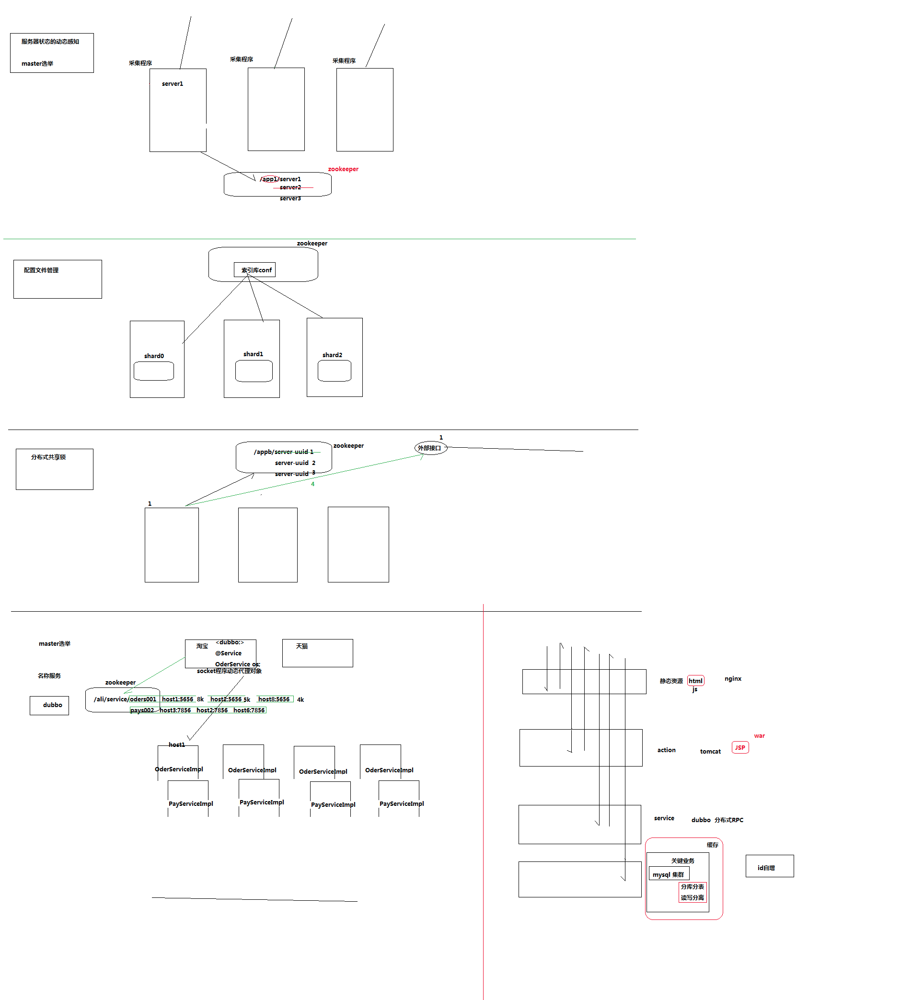
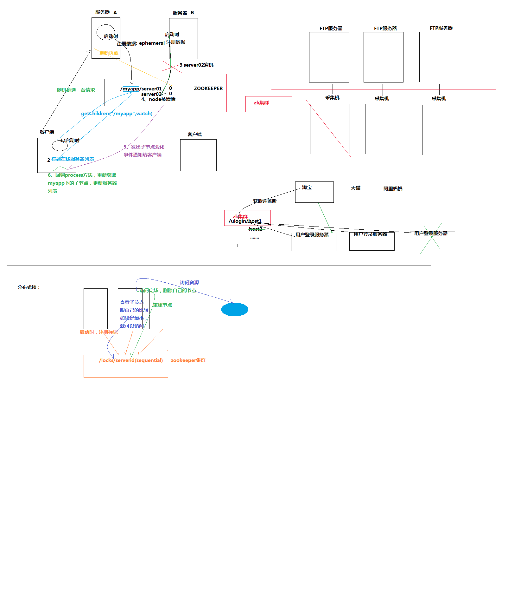
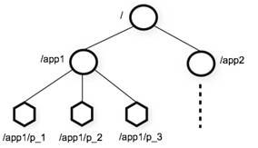
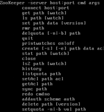
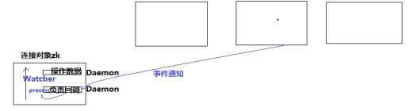
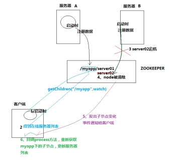

# 1. **Zookeeper概念简介：**

Zookeeper是一个**分布式协调**服务；就是为用户的分布式应用程序提供协调服务

A、zookeeper是为别的分布式程序服务的

B、Zookeeper**本身就是一个分布式程序**（只要有半数以上节点存活，zk就能正常服务）

C、Zookeeper所提供的服务涵盖：主从协调、服务器节点动态上下线、统一配置管理、分布式共享锁、统一名称服务……

D、虽然说可以提供各种服务，但是zookeeper在底层其实只提供了两个功能：

**管理(存储，读取)用户程序提交的数据；**

**并为用户程序提供数据节点监听服务；**

 

Zookeeper常用应用场景：

《见图》

zookeeper的应用场景




zookeeper动态感知示意图



 

Zookeeper集群的角色：  Leader 和  follower  （Observer）

**只要集群中有半数以上节点存活，集群就能提供服务**

# 2. **zookeeper集群机制**

**半数机制：集群中半数以上机器存活，集群可用。**

zookeeper适合装在奇数台机器上！！！

# 3. **安装**

## 3.1. **安装**

### 3.1.1. **机器部署**

安装到3台虚拟机上

安装好JDK

 

 

### 3.1.2. **上传**

上传用工具。

### 3.1.3. **解压**

```shell
su – hadoop（切换到hadoop用户）

tar -zxvf zookeeper-3.4.5.tar.gz（解压）
```


### 3.1.4. **重命名**

```shell
mv zookeeper-3.4.5 zookeeper（重命名文件夹zookeeper-3.4.5为zookeeper）
```


### 3.1.5. **修改环境变量**

1、su – root(切换用户到root)

2、vi /etc/profile(修改文件)

3、添加内容：

```shell
export ZOOKEEPER_HOME=/search/hadoop/zookeeper
export PATH=$PATH:$ZOOKEEPER_HOME/bin:$PATH
```

4、重新编译文件：

```shell
source /etc/profile
```

5、注意：3台zookeeper都需要修改

6、修改完成后切换回hadoop用户：

```shell
su hadoop
```


### 3.1.6. **修改配置文件**

1、用hadoop用户操作

```
cd zookeeper/conf
cp zoo_sample.cfg zoo.cfg
vi zoo.cfg
```

3、添加内容：

```properties
dataDir=/search/hadoop/zookeeper/data
dataLogDir=/search/hadoop/zookeeper/log
server.1=slave1:2888:3888 (主机名, 心跳端口、数据端口)
server.2=slave2:2888:3888
server.3=slave3:2888:3888
```

4、创建文件夹：

```shell
cd /search/hadoop/zookeeper/
mkdir -m 755 data
mkdir -m 755 log
```

5、在data文件夹下新建myid文件，myid的文件内容为：

```shell
cd data
vi myid
```

添加内容：（代表当前是sever1） 

```shell
1
```

### 3.1.7. **将集群下发到其他机器上**

```
scp -r /home/hadoop/zookeeper hadoop@slave2:/home/hadoop/
scp -r /home/hadoop/zookeeper hadoop@slave3:/home/hadoop/
```

### 3.1.8. **修改其他机器的配置文件**

到slave2上：修改myid为：2

到slave3上：修改myid为：3

### 3.1.9. **启动（****每台机器****）**

```
zkServer.sh start
```


### 3.1.10. **查看集群状态**

1、 jps（查看进程）

2、 zkServer.sh status（查看集群状态，主从信息）

# 4. **zookeeper结构和命令**

## 4.1. **zookeeper特性**

1、Zookeeper：一个leader，多个follower组成的集群

2、全局数据一致：每个server保存一份相同的数据副本，client无论连接到哪个server，数据都是一致的

3、分布式读写，更新请求转发，由leader实施

4、更新请求顺序进行，来自同一个client的更新请求按其发送顺序依次执行

5、数据更新原子性，一次数据更新要么成功，要么失败

6、实时性，在一定时间范围内，client能读到最新数据

 

## 4.2. **zookeeper数据结构**

1、层次化的目录结构，命名符合常规文件系统规范(见下图)

2、每个节点在zookeeper中叫做znode,并且其有一个唯一的路径标识

3、节点Znode可以包含数据和子节点（但是EPHEMERAL类型的节点不能有子节点，下一页详细讲解）

4、客户端应用可以在节点上设置监视器（后续详细讲解）	

## 4.3. **数据结构的图**



 

 

 

## 4.4. **节点类型**

1、Znode有两种类型：

短暂（ephemeral）（断开连接自己删除）

持久（persistent）（断开连接不删除）

2、Znode有四种形式的目录节点（默认是persistent ）

PERSISTENT

PERSISTENT_SEQUENTIAL（持久序列/test0000000019 ）

EPHEMERAL

EPHEMERAL_SEQUENTIAL

3、创建znode时设置顺序标识，znode名称后会附加一个值，顺序号是一个单调递增的计数器，由父节点维护

4、在分布式系统中，顺序号可以被用于为所有的事件进行全局排序，这样客户端可以通过顺序号推断事件的顺序

## 4.5. **zookeeper命令行操作**

运行 zkCli.sh –server <ip>进入命令行工具

 

1、使用 ls 命令来查看当前 ZooKeeper 中所包含的内容：

```shell
ls /
```

2、创建一个新的 znode ，使用 create /zk myData 。这个命令创建了一个新的 znode 节点“ zk ”以及与它关联的字符串：

```shell
create /zk "myData“
```

3、我们运行 get 命令来确认 znode 是否包含我们所创建的字符串：

```shell
 get /zk
```

\#监听这个节点的变化,当另外一个客户端改变/zk时,它会打出下面的

```verilog
WATCHER::
WatchedEvent state:SyncConnected type:NodeDataChanged path:/zk
```

```shell
get /zk watch
```

获取/zk下面子节点变化的事件

```shell
ls /zk watch
```

4、下面我们通过 set 命令来对 zk 所关联的字符串进行设置：

```shell
set /zk "zsl“
```

5、下面我们将刚才创建的 znode 删除：

```
delete /zk
```

6、删除节点：rmr

```
rmr /zk
```

 

## 4.6.  **zookeeper-api应用**

### 4.6.1. **基本使用**

 org.apache.zookeeper.Zookeeper是客户端入口主类，负责建立与server的会话

它提供了表 1 所示几类主要方法  ：

| 功能         |         参数         | 描述                                |
| ------------ | :------------------: | :---------------------------------- |
| create       | -e短暂的，-s带序号的 | 在本地目录树中创建一个节点          |
| delete       |                      | 删除一个节点                        |
| exists       |                      | 测试本地是否存在目标节点            |
| get/set data |                      | 从目标节点上读取 / 写数据           |
| get/set ACL  |                      | 获取 / 设置目标节点访问控制列表信息 |
| get children |                      | 检索一个子节点上的列表              |
| sync         |                      | 等待要被传送的数据                  |

### 4.6.2. **demo增删改查**

 

```java
public class SimpleDemo {
	// 会话超时时间，设置为与系统默认时间一致
	private static final int SESSION_TIMEOUT = 30000;
	// 创建 ZooKeeper 实例
	ZooKeeper zk;
	// 创建 Watcher 实例
	Watcher wh = new Watcher() {
		public void process(org.apache.zookeeper.WatchedEvent event)
		{
			System.out.println(event.toString());
		}
	};
	// 初始化 ZooKeeper 实例
	private void createZKInstance() throws IOException
	{
		zk = new ZooKeeper("weekend01:2181", SimpleDemo.SESSION_TIMEOUT, this.wh);
	}
	private void ZKOperations() throws IOException, InterruptedException, KeeperException
	{
		System.out.println("/n1. 创建 ZooKeeper 节点 (znode ： zoo2, 数据： myData2 ，权限： OPEN_ACL_UNSAFE ，节点类型： Persistent");
		zk.create("/zoo2", "myData2".getBytes(), Ids.OPEN_ACL_UNSAFE, CreateMode.PERSISTENT);
		System.out.println("/n2. 查看是否创建成功： ");
		System.out.println(new String(zk.getData("/zoo2", false, null)));
		System.out.println("/n3. 修改节点数据 ");
		zk.setData("/zoo2", "shenlan211314".getBytes(), -1);
		System.out.println("/n4. 查看是否修改成功： ");
		System.out.println(new String(zk.getData("/zoo2", false, null)));
		System.out.println("/n5. 删除节点 ");
		zk.delete("/zoo2", -1);
		System.out.println("/n6. 查看节点是否被删除： ");
		System.out.println(" 节点状态： [" + zk.exists("/zoo2", false) + "]");
	}
	private void ZKClose() throws InterruptedException
	{
		zk.close();
	}
	public static void main(String[] args) throws IOException, InterruptedException, KeeperException {
		SimpleDemo dm = new SimpleDemo();
		dm.createZKInstance();
		dm.ZKOperations();
		dm.ZKClose();
	}
}
```

 

 

Zookeeper的监听器工作机制

 

 

监听器是一个接口，我们的代码中可以实现Wather这个接口，实现其中的process方法，方法中即我们自己的业务逻辑

 

监听器的注册是在获取数据的操作中实现： 

getData(path,watch?)监听的事件是：节点数据变化事件

getChildren(path,watch?)监听的事件是：节点下的子节点增减变化事件

 

 

 

## 4.7. zookeeper应用案例（分布式应用HA||分布式锁）

#### **3.7.1** **实现分布式应用的**(主节点HA)客户端动态更新主节点状态

某分布式系统中，主节点可以有多台，可以动态上下线

任意一台客户端都能实时感知到主节点服务器的上下线

 

 


A、客户端实现

```java
package hadoop.zookeeper.ha;

import org.apache.zookeeper.WatchedEvent;
import org.apache.zookeeper.Watcher;
import org.apache.zookeeper.ZooKeeper;
import org.apache.zookeeper.data.Stat;

import java.util.ArrayList;
import java.util.List;

/**
 * zookeeper 实现高可用
 * @Author: YangKun
 * @Date: 19-5-22
 */
public class AppClient {
    private String groupNode = "sgroup";
    private ZooKeeper zk;
    private Stat stat = new Stat();
    private volatile List<String> serverList;

    /**
     * 连接zookeeper
     */
    public void connectZookeeper() throws Exception {
        zk = new ZooKeeper("127.0.0.1:2181", 5000, new Watcher() {
            public void process(WatchedEvent event) {
                // 如果发生了"/sgroup"节点下的子节点变化事件, 更新server列表, 并重新注册监听
                if (event.getType() == Watcher.Event.EventType.NodeChildrenChanged && ("/" + groupNode).equals(event.getPath())) {
                    try {
                        updateServerList();
                    } catch (Exception e) {
                        e.printStackTrace();
                    }
                }
            }
        });

        updateServerList();
    }

    /**
     * 更新server列表
     */
    private void updateServerList() throws Exception {
        List<String> newServerList = new ArrayList<String>();

        // 获取并监听groupNode的子节点变化
        // watch参数为true, 表示监听子节点变化事件.
        // 每次都需要重新注册监听, 因为一次注册, 只能监听一次事件, 如果还想继续保持监听, 必须重新注册
        List<String> subList = zk.getChildren("/" + groupNode, true);
        for (String subNode : subList) {
            // 获取每个子节点下关联的server地址
            byte[] data = zk.getData("/" + groupNode + "/" + subNode, false, stat);
            newServerList.add(new String(data, "utf-8"));
        }

        // 替换server列表
        serverList = newServerList;

        System.out.println("server list updated: " + serverList);
    }

    /**
     * client的工作逻辑写在这个方法中
     * 此处不做任何处理, 只让client sleep
     */
    public void handle() throws InterruptedException {
        Thread.sleep(Long.MAX_VALUE);
    }

    public static void main(String[] args) throws Exception {
        AppClient ac = new AppClient();
        ac.connectZookeeper();

        ac.handle();
    }
}
```

B、服务器端实现

```java
package hadoop.zookeeper.ha;

import org.apache.zookeeper.*;
/**
 * 某分布式系统中，主节点可以有多台，可以动态上下线
 * 任意一台客户端都能实时感知到主节点服务器的上下线
 *
 */

/**
 * zookeeper实现高可用
 *
 * @Author: YangKun
 * @Date: 19-5-22
 */
public class AppServer {
    private String groupNode = "sgroup";
    private String subNode = "sub";

    /**
     * 连接zookeeper
     *
     * @param address server的地址
     */
    public void connectZookeeper(String address) throws Exception {
        ZooKeeper zk = new ZooKeeper("127.0.0.1:2181", 5000, new Watcher() {
            public void process(WatchedEvent event) {
                // 不做处理
            }
        });
        // 在"/sgroup"下创建子节点
        // 子节点的类型设置为EPHEMERAL_SEQUENTIAL, 表明这是一个临时节点, 且在子节点的名称后面加上一串数字后缀
        // 将server的地址数据关联到新创建的子节点上
        String createdPath = zk.create("/" + groupNode + "/" + subNode, address.getBytes("utf-8"),
                ZooDefs.Ids.OPEN_ACL_UNSAFE, CreateMode.EPHEMERAL_SEQUENTIAL);
        System.out.println("create: " + createdPath);
    }

    /**
     * server的工作逻辑写在这个方法中
     * 此处不做任何处理, 只让server sleep
     */
    public void handle() throws InterruptedException {
        Thread.sleep(Long.MAX_VALUE);
    }

    public static void main(String[] args) throws Exception {
        AppServer as = new AppServer();
        as.connectZookeeper("127.0.0.2");

        as.handle();
    }
}
```

#### 3.7.2分布式共享锁的简单实现

####  客户端A

 分布式多进程模式实现：

| public class DistributedClientMy {	 	// 超时时间	private static final int SESSION_TIMEOUT = 5000;	// zookeeper server列表	private String hosts = "spark01:2181,spark02:2181,spark03:2181";	private String groupNode = "locks";	private String subNode = "sub";	private boolean haveLock = false; 	private ZooKeeper zk;	// 当前client创建的子节点	private volatile String thisPath; 	/**	 * 连接zookeeper	 */	public void connectZookeeper() throws Exception {		zk = new ZooKeeper("spark01:2181", SESSION_TIMEOUT, new Watcher() {			public void process(WatchedEvent event) {				try { 					// 子节点发生变化					if (event.getType() == EventType.NodeChildrenChanged && event.getPath().equals("/" + groupNode)) {						// thisPath是否是列表中的最小节点						List<String> childrenNodes = zk.getChildren("/" + groupNode, true);						String thisNode = thisPath.substring(("/" + groupNode + "/").length());						// 排序						Collections.sort(childrenNodes);						if (childrenNodes.indexOf(thisNode) == 0) {							doSomething();							thisPath = zk.create("/" + groupNode + "/" + subNode, null, Ids.OPEN_ACL_UNSAFE,									CreateMode.EPHEMERAL_SEQUENTIAL);						}					}				} catch (Exception e) {					e.printStackTrace();				}			}		}); 		// 创建子节点		thisPath = zk.create("/" + groupNode + "/" + subNode, null, Ids.OPEN_ACL_UNSAFE,				CreateMode.EPHEMERAL_SEQUENTIAL); 		// wait一小会, 让结果更清晰一些		Thread.sleep(new Random().nextInt(1000)); 		// 监听子节点的变化		List<String> childrenNodes = zk.getChildren("/" + groupNode, true); 		// 列表中只有一个子节点, 那肯定就是thisPath, 说明client获得锁		if (childrenNodes.size() == 1) {			doSomething();			thisPath = zk.create("/" + groupNode + "/" + subNode, null, Ids.OPEN_ACL_UNSAFE,					CreateMode.EPHEMERAL_SEQUENTIAL);		}	} 	/**	 * 共享资源的访问逻辑写在这个方法中	 */	private void doSomething() throws Exception {		try {			System.out.println("gain lock: " + thisPath);			Thread.sleep(2000);			// do something		} finally {			System.out.println("finished: " + thisPath);			// 将thisPath删除, 监听thisPath的client将获得通知			// 相当于释放锁			zk.delete(this.thisPath, -1);		}	} 	public static void main(String[] args) throws Exception {		DistributedClientMy dl = new DistributedClientMy();		dl.connectZookeeper();		Thread.sleep(Long.MAX_VALUE);	} 	} |      |
| ------------------------------------------------------------ | ---- |
|                                                              |      |

 

 

动手练习

 

 

# 5. **zookeeper原理**

Zookeeper虽然在配置文件中并没有指定master和slave

但是，zookeeper工作时，是有一个节点为leader，其他则为follower

Leader是通过内部的选举机制临时产生的

 

 

 

## 5.1. **zookeeper的选举机制（全新集群****paxos****）**

以一个简单的例子来说明整个选举的过程.
假设有五台服务器组成的zookeeper集群,它们的id从1-5,同时它们都是最新启动的,也就是没有历史数据,在存放数据量这一点上,都是一样的.假设这些服务器依序启动,来看看会发生什么.
1) 服务器1启动,此时只有它一台服务器启动了,它发出去的报没有任何响应,所以它的选举状态一直是LOOKING状态
2) 服务器2启动,它与最开始启动的服务器1进行通信,互相交换自己的选举结果,由于两者都没有历史数据,所以id值较大的服务器2胜出,但是由于没有达到超过半数以上的服务器都同意选举它(这个例子中的半数以上是3),所以服务器1,2还是继续保持LOOKING状态.
3) 服务器3启动,根据前面的理论分析,服务器3成为服务器1,2,3中的老大,而与上面不同的是,此时有三台服务器选举了它,所以它成为了这次选举的leader.
4) 服务器4启动,根据前面的分析,理论上服务器4应该是服务器1,2,3,4中最大的,但是由于前面已经有半数以上的服务器选举了服务器3,所以它只能接收当小弟的命了.
5) 服务器5启动,同4一样,当小弟.

## 5.2. **非全新集群的选举机制(数据恢复)**

那么，初始化的时候，是按照上述的说明进行选举的，但是当zookeeper运行了一段时间之后，有机器down掉，重新选举时，选举过程就相对复杂了。

需要加入数据id、leader id和逻辑时钟。

数据id：数据新的id就大，数据每次更新都会更新id。

Leader id：就是我们配置的myid中的值，每个机器一个。

逻辑时钟：这个值从0开始递增,每次选举对应一个值,也就是说:  如果在同一次选举中,那么这个值应该是一致的 ;  逻辑时钟值越大,说明这一次选举leader的进程更新.

选举的标准就变成：

​		1、逻辑时钟小的选举结果被忽略，重新投票

​		2、统一逻辑时钟后，数据id大的胜出

​		3、数据id相同的情况下，leader id大的胜出

根据这个规则选出leader。