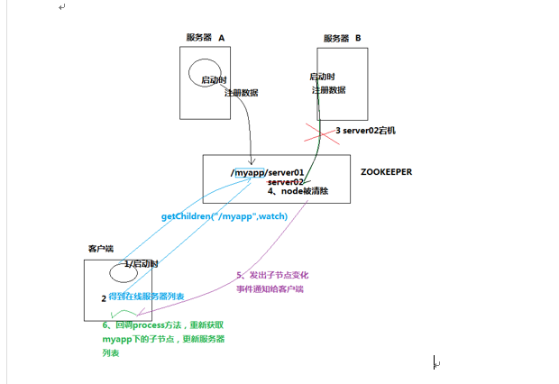

### zookeeper应用案例（分布式应用HA||分布式锁）

### 1. 实现分布式应用的(主节点HA)及客户端动态更新主节点状态

> - 某分布式系统中，主节点可以有多台，可以动态上下线
> - 任意一台客户端都能实时感知到主节点服务器的上下线 [](https://github.com/jiachao23/StudyNote/blob/master/src/img/zk1.png)
> - A、客户端实现

```java
public class AppClient {
    private String groupNode = "sgroup";
    private ZooKeeper zk;
    private Stat stat = new Stat();
    private volatile List serverList;
    /**
     * 连接zookeeper
     */
    public void connectZookeeper() throws Exception {
        zk = new ZooKeeper("localhost:4180,localhost:4181,localhost:4182", 5000, new Watcher() {
            public void process(WatchedEvent event) {
                // 如果发生了"/sgroup"节点下的子节点变化事件, 更新server列表, 并重新注册监听
                if (event.getType() == EventType.NodeChildrenChanged 
                    && ("/" + groupNode).equals(event.getPath())) {
                    try {
                        updateServerList();
                    } catch (Exception e) {
                        e.printStackTrace();
                    }
                }
            }
        });

        updateServerList();
    }
    /**
     * 更新server列表
     */
    private void updateServerList() throws Exception {
        List newServerList = new ArrayList();

        // 获取并监听groupNode的子节点变化
        // watch参数为true, 表示监听子节点变化事件. 
        // 每次都需要重新注册监听, 因为一次注册, 只能监听一次事件, 如果还想继续保持监听, 必须重新注册
        List subList = zk.getChildren("/" + groupNode, true);
        for (String subNode : subList) {
            // 获取每个子节点下关联的server地址
            byte[] data = zk.getData("/" + groupNode + "/" + subNode, false, stat);
            newServerList.add(new String(data, "utf-8"));
        }

        // 替换server列表
        serverList = newServerList;

        System.out.println("server list updated: " + serverList);
    }

    /**
     * client的工作逻辑写在这个方法中
     * 此处不做任何处理, 只让client sleep
     */
    public void handle() throws InterruptedException {
        Thread.sleep(Long.MAX_VALUE);
    }

    public static void main(String[] args) throws Exception {
        AppClient ac = new AppClient();
        ac.connectZookeeper();

        ac.handle();
    }
}
```

> - B、服务器端实现

```java
public class AppServer {
private String groupNode = "sgroup";
private String subNode = "sub";
/**
 * 连接zookeeper
 * @param address server的地址
 */
public void connectZookeeper(String address) throws Exception {
    ZooKeeper zk = new ZooKeeper(
"localhost:4180,localhost:4181,localhost:4182", 
5000, new Watcher() {
        public void process(WatchedEvent event) {
            // 不做处理
        }
    });
    // 在"/sgroup"下创建子节点
    // 子节点的类型设置为EPHEMERAL_SEQUENTIAL, 表明这是一个临时节点, 且在    子节点的名称后面加上一串数字后缀
    // 将server的地址数据关联到新创建的子节点上
    String createdPath = zk.create("/" + groupNode + "/" + subNode, address.getBytes("utf-8"), 
        Ids.OPEN_ACL_UNSAFE, CreateMode.EPHEMERAL_SEQUENTIAL);
    System.out.println("create: " + createdPath);
}
/**
 * server的工作逻辑写在这个方法中
 * 此处不做任何处理, 只让server sleep
 */
public void handle() throws InterruptedException {
    Thread.sleep(Long.MAX_VALUE);
}
public static void main(String[] args) throws Exception {
    // 在参数中指定server的地址
    if (args.length == 0) {
        System.err.println("The first argument must be server             address");
        System.exit(1);
    }
    AppServer as = new AppServer();
    as.connectZookeeper(args[0]);
    as.handle();
}
```

}

#### 2.分布式共享锁的简单实现

> - 客户端A

```java
public class DistributedClient {
    // 超时时间
    private static final int SESSION_TIMEOUT = 5000;
    // zookeeper server列表
    private String hosts = "localhost:4180,localhost:4181,localhost:4182";
    private String groupNode = "locks";
    private String subNode = "sub";
    private ZooKeeper zk;
    // 当前client创建的子节点
    private String thisPath;
    // 当前client等待的子节点
    private String waitPath;
    private CountDownLatch latch = new CountDownLatch(1);
    /**
     * 连接zookeeper
     */
    public void connectZookeeper() throws Exception {
        zk = new ZooKeeper(hosts, SESSION_TIMEOUT, new Watcher() {
            public void process(WatchedEvent event) {
                try {
                    // 连接建立时, 打开latch, 唤醒wait在该latch上的线程
                    if (event.getState() == KeeperState.SyncConnected) {
                        latch.countDown();
                    }

                    // 发生了waitPath的删除事件
                    if (event.getType() == EventType.NodeDeleted && event.getPath().equals(waitPath)) {
                        doSomething();
                    }
                } catch (Exception e) {
                    e.printStackTrace();
                }
            }
        });

        // 等待连接建立
        latch.await();

        // 创建子节点
        thisPath = zk.create("/" + groupNode + "/" + subNode, null, Ids.OPEN_ACL_UNSAFE,
                CreateMode.EPHEMERAL_SEQUENTIAL);

        // wait一小会, 让结果更清晰一些
        Thread.sleep(10);

        // 注意, 没有必要监听"/locks"的子节点的变化情况
        List childrenNodes = zk.getChildren("/" + groupNode, false);

        // 列表中只有一个子节点, 那肯定就是thisPath, 说明client获得锁
        if (childrenNodes.size() == 1) {
            doSomething();
        } else {
            String thisNode = thisPath.substring(("/" + groupNode + "/").length());
            // 排序
            Collections.sort(childrenNodes);
            int index = childrenNodes.indexOf(thisNode);
            if (index == -1) {
                // never happened
            } else if (index == 0) {
                // inddx == 0, 说明thisNode在列表中最小, 当前client获得锁
                doSomething();
            } else {
                // 获得排名比thisPath前1位的节点
                this.waitPath = "/" + groupNode + "/" + childrenNodes.get(index - 1);
                // 在waitPath上注册监听器, 当waitPath被删除时, zookeeper会回调监听器的process方法
                zk.getData(waitPath, true, new Stat());
            }
        }
    }

    private void doSomething() throws Exception {
        try {
            System.out.println("gain lock: " + thisPath);
            Thread.sleep(2000);
            // do something
        } finally {
            System.out.println("finished: " + thisPath);
            // 将thisPath删除, 监听thisPath的client将获得通知
            // 相当于释放锁
            zk.delete(this.thisPath, -1);
        }
    }

    public static void main(String[] args) throws Exception {
        for (int i = 0; i < 10; i++) {
            new Thread() {
                public void run() {
                    try {
                        DistributedClient dl = new DistributedClient();
                        dl.connectZookeeper();
                    } catch (Exception e) {
                        e.printStackTrace();
                    }
                }
            }.start();
        }

        Thread.sleep(Long.MAX_VALUE);
    }
}
```

> - 分布式多进程模式实现：

```java
public class DistributedClientMy {
// 超时时间
private static final int SESSION_TIMEOUT = 5000;
// zookeeper server列表
private String hosts = "spark01:2181,spark02:2181,spark03:2181";
private String groupNode = "locks";
private String subNode = "sub";
private boolean haveLock = false;

private ZooKeeper zk;
// 当前client创建的子节点
private volatile String thisPath;

/**
 * 连接zookeeper
 */
public void connectZookeeper() throws Exception {
    zk = new ZooKeeper("spark01:2181", SESSION_TIMEOUT, new Watcher() {
        public void process(WatchedEvent event) {
            try {

                // 子节点发生变化
                if (event.getType() == EventType.NodeChildrenChanged && event.getPath().equals("/" + groupNode)) {
                    // thisPath是否是列表中的最小节点
                    List childrenNodes = zk.getChildren("/" + groupNode, true);
                    String thisNode = thisPath.substring(("/" + groupNode + "/").length());
                    // 排序
                    Collections.sort(childrenNodes);
                    if (childrenNodes.indexOf(thisNode) == 0) {
                        doSomething();
                        thisPath = zk.create("/" + groupNode + "/" + subNode, null, Ids.OPEN_ACL_UNSAFE,
                                CreateMode.EPHEMERAL_SEQUENTIAL);
                    }
                }
            } catch (Exception e) {
                e.printStackTrace();
            }
        }
    });

    // 创建子节点
    thisPath = zk.create("/" + groupNode + "/" + subNode, null, Ids.OPEN_ACL_UNSAFE,
            CreateMode.EPHEMERAL_SEQUENTIAL);

    // wait一小会, 让结果更清晰一些
    Thread.sleep(new Random().nextInt(1000));

    // 监听子节点的变化
    List childrenNodes = zk.getChildren("/" + groupNode, true);

    // 列表中只有一个子节点, 那肯定就是thisPath, 说明client获得锁
    if (childrenNodes.size() == 1) {
        doSomething();
        thisPath = zk.create("/" + groupNode + "/" + subNode, null, Ids.OPEN_ACL_UNSAFE,
                CreateMode.EPHEMERAL_SEQUENTIAL);
    }
}

/**
 * 共享资源的访问逻辑写在这个方法中
 */
private void doSomething() throws Exception {
    try {
        System.out.println("gain lock: " + thisPath);
        Thread.sleep(2000);
        // do something
    } finally {
        System.out.println("finished: " + thisPath);
        // 将thisPath删除, 监听thisPath的client将获得通知
        // 相当于释放锁
        zk.delete(this.thisPath, -1);
    }
}

public static void main(String[] args) throws Exception {
    DistributedClientMy dl = new DistributedClientMy();
    dl.connectZookeeper();
    Thread.sleep(Long.MAX_VALUE);
}
} 
```