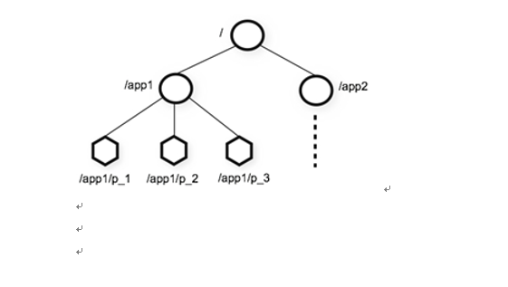
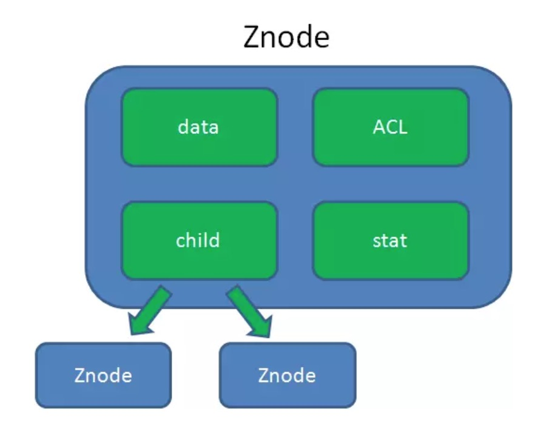
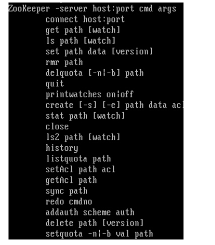
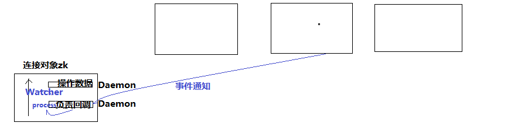

# zookeeper结构和命令

### 1. zookeeper特性

> ###### 1、Zookeeper：一个leader，多个follower组成的集群
>
> ###### 2、全局数据一致：每个server保存一份相同的数据副本，client无论连接到哪个server，数据都是一致的
>
> ###### 3、分布式读写，更新请求转发，由leader实施
>
> ###### 4、更新请求顺序进行，来自同一个client的更新请求按其发送顺序依次执行
>
> ###### 5、数据更新原子性，一次数据更新要么成功，要么失败
>
> ###### 6、实时性，在一定时间范围内，client能读到最新数据

### 2. zookeeper数据结构

> ###### 1、层次化的目录结构，命名符合常规文件系统规范(见下图)
>
> ###### 2、每个节点在zookeeper中叫做znode,并且其有一个唯一的路径标识
>
> ###### 3、节点Znode可以包含数据和子节点（但是EPHEMERAL类型的节点不能有子节点，下一页详细讲解）
>
> ###### 4、客户端应用可以在节点上设置监视器（后续详细讲解）

### 3. 数据结构的图

[](https://github.com/jiachao23/StudyNote/blob/master/src/img/zks.png)

### 4. 节点类型

> ###### 1、Znode有两种类型：

```
短暂（ephemeral）（断开连接自己删除）
持久（persistent）（断开连接不删除）
```

> ###### 2、Znode有四种形式的目录节点（默认是persistent ）

```
PERSISTENT
PERSISTENT_SEQUENTIAL（持久序列/test0000000019 ）
EPHEMERAL
EPHEMERAL_SEQUENTIAL
```

> ###### 3、创建znode时设置顺序标识，znode名称后会附加一个值，顺序号是一个单调递增的计数器，由父节点维护
>
> ###### 4、在分布式系统中，顺序号可以被用于为所有的事件进行全局排序，这样客户端可以通过顺序号推断事件的顺序

## Znode

Znode 包含了数据, 子节点引用, 访问权限等等

[](https://camo.githubusercontent.com/64e7a67a93d6883ceb89b66b4796ad4dbc9db6a1/687474703a2f2f7777772e6d69616f6d69616f71692e636e2f696d616765732f626967646174612f7a6f6f6b65657065722f322e706e67)

**data:** Znode存储的数据信息。

**ACL:** 记录Znode的访问权限，即哪些人或哪些IP可以访问本节点。

**stat:** 包含Znode的各种元数据，比如事务ID、版本号、时间戳、大小等等。

**child:** 当前节点的子节点引用，类似于二叉树的左孩子右孩子。

这里需要注意一点，Zookeeper是为读多写少的场景所设计。Znode并不是用来存储大规模业务数据，而是用于存储少量的状态和配置信息，**每个节点的数据最大不能超过1MB**。

### 5. zookeeper命令行操作

运行 zkCli.sh –server 进入命令行工具 [](https://github.com/jiachao23/StudyNote/blob/master/src/img/zkc.png)

> ###### 1、使用 ls 命令来查看当前 ZooKeeper 中所包含的内容：

```
[zk: 202.115.36.251:2181(CONNECTED) 1] ls /
```

> ###### 2、创建一个新的 znode ，使用 create /zk myData 。这个命令创建了一个新的 znode 节点“ zk ”以及与它关联的字符串：

```
[zk: 202.115.36.251:2181(CONNECTED) 2] create /zk "myData“
```

> ###### 3、我们运行 get 命令来确认 znode 是否包含我们所创建的字符串：

```
[zk: 202.115.36.251:2181(CONNECTED) 3] get /zk
```

> 监听这个节点的变化,当另外一个客户端改变/zk时,它会打出下面的

```
WATCHER::
WatchedEvent state:SyncConnected type:NodeDataChanged path:/zk
[zk: localhost:2181(CONNECTED) 4] get /zk watch
```

> ###### 4、下面我们通过 set 命令来对 zk 所关联的字符串进行设置：

```
[zk: 202.115.36.251:2181(CONNECTED) 4] set /zk "zsl“
```

> ###### 5、下面我们将刚才创建的 znode 删除：

```
[zk: 202.115.36.251:2181(CONNECTED) 5] delete /zk
```

> ###### 6、删除节点：rmr

```
[zk: 202.115.36.251:2181(CONNECTED) 5] rmr /zk
```

create [-s][-e] path data acl

在某个节点下创建节点, 默认是持久节点

```
  create /app1 "This is app1 server parent"
  
  create /app1/server01 "192.168.1.1,100"
```

-e是短暂节点, 客户端断开连接节点销毁

```
  create -e /app-e "aaaa"
```

-s是顺序节点, 会自动给节点加上序号

```
  [zk: 127.0.0.1:2220(CONNECTED) 5] create -s /test/aa 999
  Created /test/aa0000000000
  [zk: 127.0.0.1:2220(CONNECTED) 6] create -s /test/bb 999
  Created /test/bb0000000001
  [zk: 127.0.0.1:2220(CONNECTED) 7] create -s /test/aa 999
  Created /test/aa0000000002
  [zk: 127.0.0.1:2220(CONNECTED) 8] ls /test
  [aa0000000000, aa0000000002, bb0000000001]
```

-s和-e结合使用就是临时顺序节点

- get path [watch]

  获取节点内容

  ```
    get /app1/server01
  ```

  开启watch功能

  ```
    get /app1 watch
  ```

  当其他机器修改/app1节点的内容时, 监听会收到通知, 但是只能监听一次, 监听器也分类型

  ```
    WATCHER::
    
    WatchedEvent state:SyncConnected type:NodeDataChanged path:/app1
  ```

- quit

  客户端断开连接

- set

  更新节点内容

  ```
    set /app1 "xxx"
  ```

  会同步到其他机器上, 如果节点过多, 会有短暂延迟

- delete

  删除节点

  ```
  delete /app1
  ```

- exists

  判断节点是否存在

- getData

  获得一个节点的数据

- setData

  设置一个节点的数据

- getChildren

  获取节点下的所有子节点

这其中，exists，getData，getChildren属于读操作。Zookeeper客户端在请求读操作的时候，可以选择是否设置**Watch**。

我们可以理解成是注册在特定Znode上的触发器。当这个Znode发生改变，也就是调用了create，delete，setData方法的时候，将会触发Znode上注册的对应事件，请求Watch的客户端会接收到**异步通知**。

## 6. zookeeper-api应用

> ###### 1. 基本使用
>
> ###### org.apache.zookeeper.Zookeeper是客户端入口主类，负责建立与server的会话
>
> ###### 它提供了表 1 所示几类主要方法 ：

```
功能    描述
create    在本地目录树中创建一个节点
delete    删除一个节点
exists    测试本地是否存在目标节点
get/set data    从目标节点上读取 / 写数据
get/set ACL    获取 / 设置目标节点访问控制列表信息
get children    检索一个子节点上的列表
sync    等待要被传送的数据
```

> ###### 2. demo增删改查

```
public class SimpleDemo {
    // 会话超时时间，设置为与系统默认时间一致
    private static final int SESSION_TIMEOUT = 30000;
    // 创建 ZooKeeper 实例
    ZooKeeper zk;
    // 创建 Watcher 实例
    Watcher wh = new Watcher() {
        public void process(org.apache.zookeeper.WatchedEvent event)
        {
            System.out.println(event.toString());
        }
    };
    // 初始化 ZooKeeper 实例
    private void createZKInstance() throws IOException
    {
        zk = new ZooKeeper("weekend01:2181", SimpleDemo.SESSION_TIMEOUT, this.wh);
    }
    private void ZKOperations() throws IOException, InterruptedException, KeeperException
    {
        System.out.println("/n1. 创建 ZooKeeper 节点 (znode ： zoo2, 数据： myData2 ，权限： OPEN_ACL_UNSAFE ，节点类型： Persistent");
        zk.create("/zoo2", "myData2".getBytes(), Ids.OPEN_ACL_UNSAFE, CreateMode.PERSISTENT);
        System.out.println("/n2. 查看是否创建成功： ");
        System.out.println(new String(zk.getData("/zoo2", false, null)));
        System.out.println("/n3. 修改节点数据 ");
        zk.setData("/zoo2", "shenlan211314".getBytes(), -1);
        System.out.println("/n4. 查看是否修改成功： ");
        System.out.println(new String(zk.getData("/zoo2", false, null)));
        System.out.println("/n5. 删除节点 ");
        zk.delete("/zoo2", -1);
        System.out.println("/n6. 查看节点是否被删除： ");
        System.out.println(" 节点状态： [" + zk.exists("/zoo2", false) + "]");
    }
    private void ZKClose() throws InterruptedException
    {
        zk.close();
    }
    public static void main(String[] args) throws IOException, InterruptedException, KeeperException {
        SimpleDemo dm = new SimpleDemo();
        dm.createZKInstance();
        dm.ZKOperations();
        dm.ZKClose();
    }
}
```

> ###### 3.Zookeeper的监听器工作机制

[](https://github.com/jiachao23/StudyNote/blob/master/src/img/zkworg.png)

> 监听器是一个接口，我们的代码中可以实现Wather这个接口，实现其中的process方法，方法中即我们自己的业务逻辑

> 监听器的注册是在获取数据的操作中实现：

```
getData(path,watch?)监听的事件是：节点数据变化事件
getChildren(path,watch?)监听的事件是：节点下的子节点增减变化事件
```