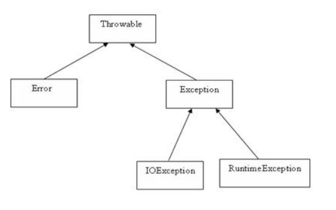
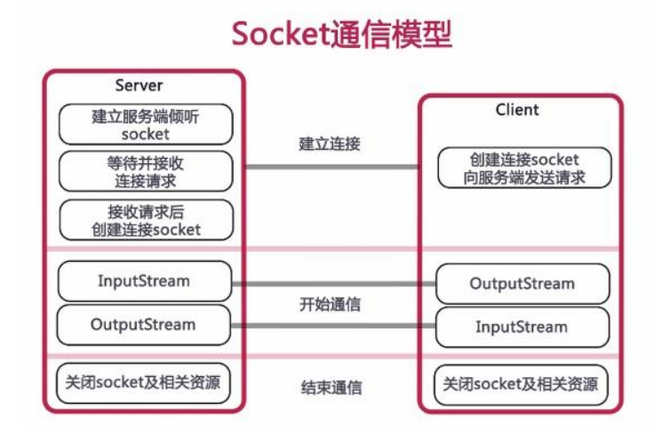

# Java SE #

* [1、开发环境配置](#1、开发环境配置)
* [2、基本语法](#2、基本语法)
* [3、面向对象](#3、面向对象)
* [4、运算符和结构](#4、运算符和结构)
* [5、数据结构](#5、数据结构)
* [6、泛型、序列化/反序列化](#6、泛型、序列化/反序列化)
* [7、字符编码和字符串](#7、字符编码和字符串)
* [8、正则表达式](#8、正则表达式)
* [9、IO流和文件](#9、IO流和文件)
* [10、日期时间和数字](#10、日期时间和数字)
* [11、异常处理](#11、异常处理)
* [12、Scanner类和系统属性](#12、Scanner类和系统属性)
* [13、网络编程](#13、网络编程)
* [14、连接MYSQL](#14、连接MYSQL)

### 1、开发环境配置 ###

	jdk环境变量配置（在电脑的环境变量的系统变量里添加）
	变量名：JAVA_HOME	变量值：D:\Program Files\Java\jdk1.8.0_131
	变量名：Path		变量名：D:\Program Files\Java\jdk1.8.0_131\bin
	变量名：CLASSPATH	变量名：.

### 2、基本语法 ###

	1. 由字母、数字、下划线、$组成，不能以数字开头，大小写敏感。
	2. 类名：对于所有的类来说，类名的首字母应该大写。
	3. 方法名：所有的方法名都应该以小写字母开头。
	4. 源文件名：源文件名必须和类名相同。
	5. 主方法入口：所有的Java 程序由public static void main(String []args)方法开始执行。
	6. 每条语句以分号（；）结尾。
	7. 变量需要先声明，再调用。

> 常用的转义字符

	"\b" (退格)
	"\f" (换页)
	"\n" (换行，newline 向下移动一行，并不移动左右)
	"\r" (回车，return 到当前行的最左边)
	"\t" (水平制表符(到下一个tab位置))
	"\' " (单引号)
	"\" " (双引号) 
	"\\" (反斜杠)
	Linux中\n表示：回车+换行；
	Windows中\r\n表示：回车+换行。
	Mac中\r表示：回车+换行

> Java的八种基本类型 

|基本类型|描述|默认值|
|:--|:--|:--|
|boolean| 布尔型 1个字节 8bit（8位）|默认值是 false|
|byte | 字节类型 1个字节 byte 数据类型是8位、有符号的，以二进制补码表示的整数|默认值是 0|
|char |字符类型 2个字节 char类型是一个单一的 16 位 Unicode 字符|char 数据类型可以储存任何字符|
|short |短整型  2个字节 short 数据类型是 16 位、有符号的以二进制补码表示的整数|默认值是 0|
|int |整型 4个字节 int 数据类型是32位、有符号的以二进制补码表示的整数|默认值是 0|
|float | 浮点型（单精度）4个字节 float 数据类型是单精度、32位、符合IEEE 754标准的浮点数|默认值是 0.0f|
|long |长整型 8个字节 long 数据类型是 64 位、有符号的以二进制补码表示的整数|默认值是 0L|
|double |双精度类型  8个字节 double 数据类型是双精度、64 位、符合IEEE 754标准的浮点数|默认值是 0.0d|

	一个英文字母或者阿拉伯数字占一个字节，一个汉字占2个字节【GBK】
	类型转换
		自动类型转换
			必须满足转换前的数据类型的位数要低于转换后的数据类型。

		强制类型转换
			1. 条件是转换的数据类型必须是兼容的。
			2. 格式：(type)value type是要强制类型转换后的数据类型 。
			
	自动装箱拆箱
		自动装箱是Java编译器在基本数据类型和对应的对象包装类型之间做的一个转化。
		比如：把int转化成Integer。反之就是自动拆箱。

> Java修饰符

	访问控制修饰符

		default【缺省的】
			默认级别
			在同一包内可见，不使用任何修饰符。使用对象：类、接口、变量、方法。
		protected
			受保护级别
			对同一包内的类和所有子类可见。使用对象：变量、方法。 注意：不能修饰类（外部类）。
		public
			公开级别
			对所有类可见。使用对象：类、接口、变量、方法。
		private
			私有级别
			在同一类内可见。使用对象：变量、方法。 注意：不能修饰类（外部类）。

	非访问控制修饰符

		abstract
			用来创建抽象类和抽象方法，抽象类不能用来实例化对象，声明抽象类的唯一目的是为了将来对该类进行扩充
			抽象方法不能被声明成 final 和 static
			抽象方法的声明以分号结尾【没有实体】，例如：public abstract sample();
		final
			final 变量能被显式地初始化并且只能初始化一次。被声明为 final 的对象的引用不能指向不同的对象。
			但是 final 对象里的数据可以被改变。也就是说 final 对象的引用不能改变，但是可以改变引用对象的值。
		static
			用来修饰类方法和类变量
			静态变量
				无论一个类实例化多少对象，它的静态变量只有一份拷贝。 静态变量也被称为类变量。
				局部变量不能被声明为 static 变量。
			静态方法
				静态方法不能使用类的非静态变量
		final 修饰符通常和 static 修饰符一起使用来创建类常量。
		synchronized
			主要用于线程的编程。

> Java变量

	局部变量
		在方法、构造方法或者语句块中定义的变量被称为局部变量。变量声明和初始化都是在方法中，方法结束后，变量就会自动销毁。

	类变量（静态变量）
		静态变量不属于某个实例对象，而是属于类，类变量也声明在类中，方法体之外，但必须声明为static类型
		公共的属性。
		可以通过【类名.类变量名】直接访问，不能访问非静态变量。
		在类加载的时候产生。

	成员变量（非静态变量）
		成员变量是定义在类中，方法体之外的变量。这种变量在创建对象的时候实例化。成员变量可以被类中方法、构造方法和特定类的语句块访问。
		属于每个对象个体的属性。
		通过【实例名.实例变量名】 访问，可以访问static静态变量。
		在new的时候才产生。

	类变量与实例变量区别：
		加上static称为类变量或静态变量，否则称为实例变量。
		类变量是与类相关的，公共的属性；实例变量属于每个对象个体的属性。
		类变量可以通过 【类名.类变量名】 直接访问；实例变量通过【实例名.实例变量名】 访问。

> Java枚举

	Java 5.0引入了枚举，枚举限制变量只能是预先设定好的值。使用枚举可以减少代码中的bug。
	枚举可以单独声明或者声明在类里面。方法、变量、构造函数也可以在枚举中定义。
	使用枚举可以在编译的时候检测实参是否合法，其他类型无法控制实参的取值。
	枚举值必须在第一行。
	枚举类的属性不可修改，final，枚举不能被继承，不需要set方法，可以有get方法。
	枚举类需要私有的构造函数。
	enum 声明的类默认继承了 java.lang.Enum 类，所以不能再继承其他的类。

	方法：
		ordinal	枚举的索引，从0开始
		name	枚举的名字

> Java关键字

	这些保留字不能用于常量、变量、和任何标识符的名称。

	访问控制：
		private		私有的
		protected	受保护的
		public		公共的

	类、方法和变量修饰符：
		abstract	声明抽象
		class		类
		extends		扩允,继承
		final		最终值,不可改变的
		implements	实现（接口）
		interface	接口
		native		本地，原生方法（非Java实现）
		new			新,创建
		static		静态
		strictfp	严格,精准
		synchronized	线程,同步
		transient	短暂
		volatile	易失

	程序控制语句：
		break		跳出循环
		case		定义一个值以供switch选择
		continue	继续
		default		默认
		do 			运行
		else 		否则
		for 		循环
		if 			如果
		instanceof 	实例
		return		返回
		switch		根据值选择执行
		while		循环

	错误处理：
		assert	断言表达式是否为真
		catch	捕捉异常
		finally	有没有异常都执行
		throw	抛出一个异常对象
		throws	声明一个异常可能被抛出
		try		捕获异常

	包相关：
		import	引入
		package	包

	基本类型：
		boolean	布尔型
		byte	字节型
		char	字符型
		double	双精度浮点
		float	单精度浮点
		int 	整型
		long	长整型
		short	短整型
		null 	空

	变量引用：
		super	父类，超类
		this 	本类
		void	无返回值

	保留关键字：
		goto	是关键字，但不能使用
		const	是关键字，但不能使用

> Java注释

	1. //
	2. /*...*/
	3. /**...*/

### 3、面向对象 ###

> 类
	
	类是一个模板，它描述一类对象的行为和状态。可以看成是创建Java对象的模板。
	
> 对象
	
	对象是类的一个实例，有状态和行为。万物皆对象。
	使用关键字new来创建一个对象。
	由new生成的变量都是产生新的变量，即内存地址不同。
	
> 方法
		
	构造方法：
		无参构造函数【默认】
		有参构造函数

> 3.1、继承
	
	语法：class 子类 extends 父类		

	继承可以解决代码复用，当多个类存在相同的属性(变量)和方法时，可以从这些类中抽象出父类。
	在父类中定义这些相同的属性和方法，所有的子类不需要重新定义这些属性和方法，只需要通过extends语句来声明继承父类，子类就会自动拥有父类定义的某些属性和方法。
	但并不是父类的所有属性、方法都可以被子类继承。
		可以被继承：
			父类的public修饰符的属性和方法；
			protected修饰符的属性和方法；
			默认修饰符属性和方法。

		不能被子类继承：
			父类的private修饰符的属性和方法。

	特性：
		java所有类都是Object类的子类。
		子类可以拥有自己的属性和方法，即子类可以对父类进行扩展。
		子类可以用自己的方式实现父类的方法。
		Java的继承是单继承，一个类只能继承一个父类，所有的子类都可以逐级继承，例:爷->父->子->孙。

	继承关键字：
		1. extends关键字
			类的继承是单一继承，extends 只能继承一个类。
			public class Penguin  extends  Animal{ ...}

		2. implements关键字
			使用 implements 关键字可以变相的使java具有多继承的特性，使用范围为类继承接口的情况，可以同时继承多个接口（接口跟接口之间采用逗号分隔）【接口多实现】。
			public interface A {
			    public void eat();
			    public void sleep();
			}
			 
			public interface B {
			    public void show();
			}
			 
			public class C implements A,B {
			}

		3. super 关键字
			通过super(params)继承父类的构造方法，实现对父类成员的访问，用来引用当前对象的父类。
			super 语句必须是子类构造方法的第一条语句。
			调用父类的方法：
				super.方法名(参数列表)

			调用父类的构造方法：
				super();  
				或   
				super(参数列表);

			
		4. this 关键字
			this(params)本类自定义的其他构造方法,指向自己的引用。
			this 关键字表示当前对象。
			this(); 调用默认构造方法。
			this(参数); 调用带参构造方法。
			限定当前对象的数据域变量。解决实例变量（private String name）和局部变量（setName(String name)中的name变量）之间发生的同名的冲突。
			如 this.num = num。this.num 表示当前对象的数据域变量 num，而 num 表示方法中的局部变量。
					
		5. final 关键字
			声明类可以把类定义为不能继承的，即最终类；或者用于修饰方法，该方法不能被子类重写。
			声明类：
				final class 类名 {//类体}

			声明方法：
				修饰符 final 返回值类型 方法名(){ //主体}
			实例变量也可以被定义为 final，被定义为 final 的变量不能被修改。

		构造器：
			子类不能继承父类的构造器（构造方法或者构造函数），但是父类的构造器带有参数的，则必须在子类的构造器中显式地通过super关键字调用父类的构造器并配以适当的参数列表。
			如果父类有无参构造器，则在子类的构造器中用super调用父类构造器不是必须的，如果没有使用super关键字，系统会自动调用父类的无参构造器。

> 3.2、封装
			
	封装就是把抽象出来的数据和对数据的操作封装在一起，数据被保护在内部，程序的其它部分只有通过被授权的操作(成员方法)，才能对数据进行操作。
	封装可以被认为是一个保护屏障，防止该类的代码和数据被外部类定义的代码随机访问。
	要访问该类的代码和数据，必须通过严格的接口控制。
	封装最主要的功能在于我们能修改自己的实现代码，而不用修改那些调用我们代码的程序片段。

	实现Java封装的步骤：
		1. 修改属性的可见性来限制对属性的访问（一般限制为private）
			设置为私有的，只能本类才能访问，其他类都访问不了，如此就对信息进行了隐藏。
		2. 对每个值属性提供对外的公共方法访问，也就是创建一对赋取值方法，用于对私有属性的访问
			任何要访问类中私有成员变量的类都要通过这些public 的getter和setter方法来访问。

> 3.3、多态
			
	多态就是同一个接口，使用不同的实例而执行不同操作，就是指一个引用(类型)在不同情况下的多种状态。
	也可以理解成：多态是指通过指向父类的指针，来调用在不同子类中实现的方法。
	如 Animal a1 = new Dog()；指定父类的属性，调用子类Dog的方法。a1是Animal状态，也是Dog属性状态。
	多态就是一种类型(都是Animal类型)表现出多种状态（Dog的cry状态;Cat的cry状态）。
			
	实现多态有两种方式：
		1. 继承
		2. 接口
		
> 3.4、 抽象
		
	定义一个类时候，实际上就是把一类事物的共有的属性和行为提取出来，形成一个物理模型(模版)。这种研究问题的方法称为抽象。
			
	抽象类：
		由关键字 abstract 声明。
		抽象类不能实例化，作为接口使用；主体在子类中添加，子类可以实例化。
		由于抽象类不能实例化对象，所以抽象类必须被继承，才能被使用。也是因为这个原因，通常在设计阶段决定要不要设计抽象类。
		抽象类除了不能实例化对象之外，类的其它功能依然存在，成员变量、成员方法和构造方法的访问方式和普通类一样。

	例子：
		/* 文件名 : Employee.java */
		public abstract class Employee
		{
		   private String name;
		   private String address;
		   private int number;
		   public Employee(String name, String address, int number)
		   {
		      System.out.println("Constructing an Employee");
		      this.name = name;
		      this.address = address;
		      this.number = number;
		   }
		   public double computePay()
		   {
		     System.out.println("Inside Employee computePay");
		     return 0.0;
		   }
		   public void mailCheck()
		   {
		      System.out.println("Mailing a check to " + this.name
		       + " " + this.address);
		   }
		   public String toString()
		   {
		      return name + " " + address + " " + number;
		   }
		   public String getName()
		   {
		      return name;
		   }
		   public String getAddress()
		   {
		      return address;
		   }
		   public void setAddress(String newAddress)
		   {
		      address = newAddress;
		   }
		   public int getNumber()
		   {
		     return number;
		   }
		}
			
	抽象方法：
		如果你想设计这样一个类，该类包含一个特别的成员方法，该方法的具体实现由它的子类确定，那么你可以在父类中声明该方法为抽象方法。
		由关键字abstract声明，抽象方法只包含一个方法名，而没有方法体。
				
		public abstract class Employee
		{
		   private String name;
		   private String address;
		   private int number;
		   
		   public abstract double computePay();
		   
		   //其余代码
		}
				
		如果一个类包含抽象方法，那么该类必须是抽象类。
		任何子类必须重写父类的抽象方法，或者声明自身为抽象类。

> 重写、重载
		
	覆盖/重写(Override):
		重写是子类对父类的允许访问的方法的实现过程进行重新编写, 返回值和形参都不能改变。即外壳不变，核心重写！
		子类方法不能缩小父类方法的访问权限。例如：如果父类的一个方法被声明为public，那么在子类中重写该方法就不能声明为protected。
		
	重载(Overload):
		重载(overloading) 是在一个类里面，方法名字相同，只有它们的参数列表不同,返回类型可以相同也可以不同。
		由于方法名称相同，即根据参数类型和参数数量来决定要调用哪个方法。
		不同的参数列表：
			参数类型不同;
			参数数量不同;
			参数次序不同。

		与控制访问修饰符和返回类型无关(public static int)
		被重载的方法可以改变返回类型；
		被重载的方法可以改变访问修饰符；
		被重载的方法可以声明新的或更广的检查异常；
		
	方法的重写和重载是java多态性的不同表现，重写是父类与子类之间多态性的一种表现，重载可以理解成多态的具体表现形式。
	
> 接口
		
	是一个抽象类型，是抽象方法的集合，接口通常以 interface 来声明。
	接口并不是类，编写接口的方式和类很相似，但是它们属于不同的概念。
	类描述对象的属性和方法；接口则包含类要实现的方法。
	接口无法被实例化，但是可以被实现。
	一个实现接口的类，必须实现接口内所描述的所有方法，否则就必须声明为抽象类。
		
	【访问修饰符】 interface 接口名称 【extends 其他的类名】 {
	    // 声明变量
	    // 抽象方法
	}

> 接口与类相似点
			
	一个接口可以有多个方法。
	接口文件保存在 .java 结尾的文件中，文件名使用接口名。
	接口的字节码文件保存在 .class 结尾的文件中。
	接口相应的字节码文件必须在与包名称相匹配的目录结构中。
	
> 接口与类的区别

	接口不能用于实例化对象，但是可以被实现类创建。
	接口没有构造方法。
	接口中所有的方法必须是抽象方法。即便不写默认也是 public abstract 
	接口不能包含成员变量，除了 static 和 final 变量。
	接口不是被类继承了，而是要被类实现。
	接口支持多继承。
		public interface Hockey extends Sports, Event
	
	一个类可以同时实现多个接口。
	一个类只能继承一个类，但是能实现多个接口。
	一个接口能继承另一个接口，这和类之间的继承比较相似。
	...implements 接口名称【, 其他接口, 其他接口..., ...】 ...
	class HAVEL implements Car

> 接口 VS 继承类

	1. 抽象类中的方法可以有方法体，能实现方法的具体功能，但是接口中的方法没有方法体。
	
	2. 抽象类中的成员变量可以是各种类型的，而接口中的成员变量只能是 public static final 类型的。
	
	3. 接口中不能含有静态代码块以及静态方法，而抽象类是可以有静态代码块和静态方法。

	4. 一个类只能继承一个抽象类，而一个类却可以实现多个接口。
	
> 源文件声明规则

	一个源文件中只能有一个public类。
	一个源文件可以有多个非public类。

> 内存划分

	Java把内存划分成两种：一种是栈内存，一种是堆内存。
	栈内存，堆内存：
	Stu s1=new Stu() 由两部分组成：Stu s1;s1=new Stu()。
	Stu s1是位于栈内存，new Stu()位于堆内存。
	
	栈内存用于分配一些基本类型的变量和对象的引用变量；
	堆内存用于存放由new创建的对象和数组。
	在堆中产生了一个数组或者对象后，还可以在栈中定义一个特殊的变量，这个变量的取值等于数组或者对象在堆内存中的首地址，在栈中的这个特殊的变量就变成了数组或者对象的引用变量，
	以后就可以在程序中使用栈内存中的引用变量来访问堆中的数组或者对象，引用变量相当于为数组或者对象起的一个别名，或者代号。
	引用变量是普通变量，定义时在栈中分配内存，引用变量在程序运行到作用域外释放。
	而数组＆对象本身在堆中分配，即使程序运行到使用new产生数组和对象的语句所在地代码块之外，数组和对象本身占用的堆内存也不会被释放，
	数组和对象在没有引用变量指向它的时候，才变成垃圾，不能再被使用，但是仍然占着内存，在随后的一个不确定的时间被垃圾回收器释放掉。
	这个也是java比较占内存的主要原因，实际上，栈中的变量指向堆内存中的变量，这就是 Java 中的指针!
	堆主要用来存放对象的，栈主要是用来执行程序的。 

### 4、运算符和结构 ###

> 4.1、运算符  
> 4.1.1、算术运算符
		
|算术运算符|描述|例子|
|:---|:--|:--|
|+	|加法，相加运算符两侧的值|	A + B 等于 30|
|-	|减法，左操作数减去右操作数|	A – B 等于 -10|
|* |乘法，相乘操作符两侧的值|	A * B等于200|
|/	|除法，左操作数除以右操作数|	B / A等于2|
|％	|取模，左操作数除以右操作数的余数|	B%A等于0|
|++	|自增，操作数的值增加1	|B++ 或 ++B 等于 21|
|--	|自减，操作数的值减少1	|B-- 或 --B 等于 19|
	前缀自增自减法(++a,--a): 先进行自增或者自减运算，再进行表达式赋值。
	后缀自增自减法(a++,a--): 先进行表达式赋值，再进行自增或者自减运算。
	int b = ++a; 拆分运算过程为: a=a+1=4; b=a=4, 最后结果为b=4,a=4
	int b = a++; 拆分运算过程为: b=a=3; a=a+1=4, 最后结果为b=3,a=4
	
> 4.1.2、关系运算符
		
	==	检查如果两个操作数的值是否相等，如果相等则条件为真。	（A == B）为假(非真)。
	!=	检查如果两个操作数的值是否相等，如果值不相等则条件为真。	(A != B) 为真。
	> 	检查左操作数的值是否大于右操作数的值，如果是那么条件为真。	（A> B）非真。
	< 	检查左操作数的值是否小于右操作数的值，如果是那么条件为真。	（A <B）为真。
	> =	检查左操作数的值是否大于或等于右操作数的值，如果是那么条件为真。	（A> = B）为假。
	<=	检查左操作数的值是否小于或等于右操作数的值，如果是那么条件为真。	（A <= B）为真。
	
> 4.1.3、位运算符
		
		A = 0011 1100,B = 0000 1101
	＆	按位与。	如果相对应位都是1，则结果为1，否则为0	（A＆B），得到12，即0000 1100
	|	按位或。	如果相对应位都是0，则结果为0，否则为1	（A | B）得到61，即 0011 1101
	^	按位异或。如果相对应位值相同，则结果为0，否则为1	（A ^ B）得到49，即 0011 0001
	〜	按位取反，即0变成1，1变成0。	（〜A）得到-61，即1100 0011
	<< 	按位左移运算符。左操作数按位左移右操作数指定的位数，右边补0。	A << 2得到240，即 1111 0000
	>> 	按位右移运算符。左操作数按位右移右操作数指定的位数。	A >> 2得到15即 1111
	>>> 按位右移补零操作符。左操作数的值按右操作数指定的位数右移，移动得到的空位以零填充。	A>>>2得到15即0000 1111
		
	二进制--原码、反码、补码（二进制数在内存中是以补码的形式存放的，显示出来的是原码）
	对于有符号的而言：
		1、二进制的最高位是符号位：0表示正数，1表示负数
		2、正数的原码、反码、补码都一样
		3、负数的反码=它的原码符号位不变，其它位取反
		4、负数的补码=它的反码+1
		5、0的反码，补码都是0
		6、java没有无符号数，换言之，java中的数都是有符号的
		7、在计算机运算的时候，都是以补码的方式来运算的。

> 4.1.4、二进制--原码、反码、补码
		
	二进制数在内存中是以补码的形式存放的，显示出来的是原码
		对于有符号的而言
			1、二进制的最高位是符号位：0表示正数，1表示负数
			2、正数的原码、反码、补码都一样
			3、负数的反码=它的原码符号位不变，其它位取反
			4、负数的补码=它的反码+1
			5、0的反码，补码都是0
			6、java没有无符号数，换言之，java中的数都是有符号的
			7、在计算机运算的时候，都是以补码的方式来运算的。

> 4.1.5、逻辑运算符
		
	布尔变量A为真，变量B为假
	&&	称为逻辑与运算符。当且仅当两个操作数都为真，条件才为真。	（A && B）为假。
	||	称为逻辑或操作符。如果任何两个操作数任何一个为真，条件为真。	（A | | B）为真。
	!	称为逻辑非运算符。用来反转操作数的逻辑状态。如果条件为true，则逻辑非运算符将得到false。	！（A && B）为真。
	
> 4.1.6、赋值运算符
		
	=	简单的赋值运算符，将右操作数的值赋给左侧操作数	C = A + B将把A + B得到的值赋给C
	+ =	加和赋值操作符，它把左操作数和右操作数相加赋值给左操作数	C + = A等价于C = C + A
	- =	减和赋值操作符，它把左操作数和右操作数相减赋值给左操作数	C - = A等价于C = C - A
	* =	乘和赋值操作符，它把左操作数和右操作数相乘赋值给左操作数	C * = A等价于C = C * A
	/ =	除和赋值操作符，它把左操作数和右操作数相除赋值给左操作数	C / = A等价于C = C / A
	(%)=	取模和赋值操作符，它把左操作数和右操作数取模后赋值给左操作数	C％= A等价于C = C％A
	<< =	左移位赋值运算符	C << = 2等价于C = C << 2
	>> =	右移位赋值运算符	C >> = 2等价于C = C >> 2
	＆=	按位与赋值运算符	C＆= 2等价于C = C＆2
	^ =	按位异或赋值操作符	C ^ = 2等价于C = C ^ 2
	| =	按位或赋值操作符	C | = 2等价于C = C | 2
	
> 4.1.7、条件运算符（?:）
		
	三元运算符
		variable x = (expression) ? A : B
		表达式成立则值x = A,不成立则x = B

	instanceof 运算符
		用于操作对象实例，检查该对象是否是一个特定类型（类类型或接口类型）
		instanceof  (class/interface type)

> 4.1.8、运算符优先级(从高到低)
		
	后缀		() [] . 		左到右
	一元		+ + - ！〜		右到左
	乘性 	* /％			左到右
	加性 	+ -				左到右
	移位 	>> >>>  << 		左到右
	关系 	>> = << = 		左到右
	相等 	==  !=			左到右
	按位与	＆				左到右
	按位异或	^			左到右
	按位或	|				左到右
	逻辑与	&&				左到右
	逻辑或	| |				左到右
	条件		？：				右到左
	赋值		= + = - = * = / =％= >> = << =＆= ^ = | =	右到左
	逗号		，				左到右

> 4.2、循环结构  
> 4.2.1、while 循环
		
	while( 布尔表达式 ) {
	  //循环内容
	}
	只要布尔表达式为 true，循环体会一直执行下去。

> 4.2.2、do…while 循环
		
	do {
	       //代码语句
	}while(布尔表达式);

	do…while 循环和 while 循环相似，不同的是，do…while 循环至少会执行一次。
	布尔表达式在循环体的后面，所以语句块在检测布尔表达式之前已经执行了。 
	如果布尔表达式的值为 true，则语句块一直执行，直到布尔表达式的值为 false。
	
> 4.2.3、for 循环
		
	for(初始化; 布尔表达式; 更新) {
	    //代码语句
	}
		
	增强 for 循环
	for(声明语句 : 表达式){
		   //代码句子
		}
		
	声明语句：声明新的局部变量，该变量的类型必须和数组元素的类型匹配。其作用域限定在循环语句块，其值与此时数组元素的值相等。
	表达式：表达式是要访问的数组名，或者是返回值为数组的方法。
	for( String name : names ) {
	 	System.out.print( name );
	}

> 4.2.4、break 关键字
		
	break 主要用在循环语句或者 switch 语句中，用来跳出整个语句块。

> 4.2.5、continue 关键字
		
	continue 适用于任何循环控制结构中。
	作用是让程序立刻跳出本次循环转到下一次循环的迭代。
	针对链表遍历。

> 4.3、分支结构  
> 4.3.1、if 语句
		
	if...
		if(布尔表达式)
		{
		   //如果布尔表达式为true将执行的语句
		}
		
	if...else
		if(布尔表达式){
		   //如果布尔表达式的值为true
		}else{
		   //如果布尔表达式的值为false
		}

	if...else if...else
		if(布尔表达式 1){
		   //如果布尔表达式 1的值为true执行代码
		}else if(布尔表达式 2){
		   //如果布尔表达式 2的值为true执行代码
		}
		
	嵌套的 if…else
		if(布尔表达式 1){
		   //如果布尔表达式 1的值为true执行代码
		   if(布尔表达式 2){
		      //如果布尔表达式 2的值为true执行代码
		   }
		}

> 4.3.2、switch 语句
		
	switch 语句判断一个变量与一系列值中某个值是否相等，每个值称为一个分支。

	switch(expression){
	    case value :
	       //语句
	       break; //可选
	    case value :
	       //语句
	       break; //可选
	    //你可以有任意数量的case语句
	    default : //可选
	       //语句
	}
		
	switch 语句可以拥有多个 case 语句。每个 case 后面跟一个要比较的值和冒号。
	case 语句中的值的数据类型必须与变量的数据类型相同，而且只能是常量或者字面常量。
	当变量的值与 case 语句的值相等时，那么 case 语句之后的语句开始执行，直到 break 语句出现才会跳出 switch 语句。
	当遇到 break 语句时，switch 语句终止。程序跳转到 switch 语句后面的语句执行。case 语句不必须要包含 break 语句。
	如果没有 break 语句出现，程序会继续执行下一条 case 语句，直到出现 break 语句。
	switch 语句可以包含一个 default 分支，该分支必须是 switch 语句的最后一个分支。
	当case 语句的值和变量值都没有匹配时执行。default 分支不需要 break 语句。

### 5、数据结构 ###
> 5.1、数组
	
	数组是用来存储固定大小的同类型元素。
	首先必须声明数组变量，才能在程序中使用数组。
		dataType[] arrayRefVar;   // 首选的方法
		dataType arrayRefVar[];  // 效果相同，但不是首选方法
	数组的元素是通过索引访问的。数组索引从 0 开始，所以索引值从 0 到 arrayRefVar.length-1。
	
	多维数组：
		多维数组可以看成是数组的数组，比如二维数组就是一个特殊的一维数组，其每一个元素都是一个一维数组。
		String str[][] = new String[3][4]
	
	Arrays 类：
		java.util.Arrays 类能方便地操作数组，它提供的所有方法都是静态的。
		给数组赋值：通过 fill 方法。
			public static void fill(int[] a, int val)
			将指定的 int 值分配给指定 int 型数组指定范围中的每个元素。

		比较数组：通过 equals 方法比较数组中元素值是否相等。
			public static boolean equals(long[] a, long[] a2)
			如果两个指定的 long 型数组彼此相等，则返回 true。

		对数组排序：通过 sort 方法,按升序。
			public static void sort(Object[] a)
			对指定对象数组根据其元素的自然顺序进行升序排列。

		查找数组元素：通过 binarySearch 方法能对排序好的数组进行二分查找法操作。
			public static int binarySearch(Object[] a, Object key)
			用二分查找算法在给定数组中搜索给定值的对象(Byte,Int,double等)。数组在调用前必须排序好的，如果查找值包含在数组中，则返回搜索键的索引。

#### 排序 ####
> 冒泡排序:  

	public class Buble{
		public void sort(int arr[]){
			int temp=0;
			//比较次数i
			for(int i=0;i<arr.length-1;i++){
				//第i次比较的循环次数
				for(int j=0;j<arr.length-1-i;j++){
					if(arr[j+1]<arr[j]){
						temp=arr[j];
						arr[j]=arr[j+1];
						arr[j+1]=temp;
					}
				}
			}
		}
	}

> 快速排序法:
		
	快速排序(QuickSorting)是对冒泡排序的一种改进。
	通过一趟排序将要排序的数据分割成独立的两部分，其中一部分的所有数据都比另外一部分的所有数据都要小，然后再按此方法对这两部数据分别进行快速排序，整个排序过程可以递归进行，以此达到整个数据变成有序序列。

	import java.util.Calendar;   

	public class Test {
		public static void main(String args[]){
			//int arr[]={23,15,-13,62,5,-23,0,17};
			int len=8;
			int arr[]=new int[len];
			for(int j=0;j<len;j++)
			{
				//程序随机产生一个1-100的随机数
				int t=(int)(Math.random()*100);
				arr[j]=t;
			}
	
			Quickselect qs=new Quickselect();
			
			//排序前打印系统时间
			Calendar cal=Calendar.getInstance();
			System.out.println("排序前"+cal.getTime());
	
			qs.sort(0, arr.length-1, arr);
			//重新得到实例
			cal=Calendar.getInstance();
			System.out.println("排序后"+cal.getTime());
			
			for(int i=0;i<arr.length;i++){
				System.out.println(arr[i]+"\t");
			}
		}
	}

> 选择排序法:  

	选择式排序也属于内部排序法，是从欲排序的数据中，按指定的规则选出某一元素，经过和其他元素重整，再依原则交换位置后达到排序的目的。
	选择式排序又可分为两种：
	1、选择排序法(Selection Sorting)
	2、堆排序法(Heap Sorting)

	public class Test {
		public static void main(String args[]){
			int arr[]={8,3,2,1,7,4,6,5};
			int temp=0;
			for(int i=0;i<arr.length-1;i++){
				//假定第一个数就是最小数
				int min=arr[i];
				int min_index=i;
				for(int j=i+1;j<arr.length;j++){	//最后一位数也参与比较
					if(min>arr[j]){
						//修改最小值
						min=arr[j];
						min_index=j;
					}
				}
				//当退出for循环时就找到这次的最小值
				temp=arr[i];
				arr[i]=arr[min_index];
				arr[min_index]=temp;
			}
			//输出最后结果
			for(int i=0;i<arr.length;i++){
				System.out.println(arr[i]+"\t");
			}
		}
	}

> 插入排序法:  

	插入式排序属于内部排序法，是对于欲排序的元素以插入的方式找寻该元素的适当位置，以达到排序的目的。
	插入式排序法又可分为3种：
		1、插入排序法(Insertion Sorting)
		2、谢耳排序法(Shell Sorting)(欧洲人员喜欢使用)
		3、二叉树排序法(Binary-tree Sorting

	public class Test {
		public static void main(String args[]){
			int arr[]={23,15,-13,62,5,-23,0,17};
			for(int i=1;i<arr.length;i++){
				int insert_val=arr[i];		//插入的数值与前一个数值比较
				int index=i-1;
				while(index>=0&&insert_val<arr[index])
				{
					arr[index+1]=arr[index];	//前一个数值大则向后移动一位
					index--;					//下标向前移动一位，继续比较
				}
				arr[index+1]=insert_val;	//将insertVal插入到适当位置
			}
			for(int i=0;i<arr.length;i++){
				System.out.println(arr[i]+"\t");
			}
		}
	}

### 6、泛型、序列化/反序列化 ###

> 6.1、泛型
	
	编译的时候检查类型安全，不需要使用强制类型转换【可以接收不同类型的参数】，当类型不确定时可自定义类型，提高代码重用率。
	JDK1.5版本引进的特性。

	类型通配符：
		类型通配符一般是使用 ? 代替任何具体的类型参数。
		例如 List<?> 在逻辑上是List<String>,List<Integer> 等所有List<具体类型实参>的父类。
		class test<? extends Test>  对泛型类型的限制，只能使用Test的类型。
		class test<T>   			T传入什么类型，test类就是什么什么类型。
		<T,PK extends Serializable>	其中 T 是指任意类，而PK是指一个继承了Serializable接口的接口或者实了Serializable的实现类【比如主键】。

> 定义泛型方法的规则
		
	所有泛型方法声明都有一个类型参数声明部分（由尖括号分隔），该类型参数声明部分在方法返回类型之前。
	类型参数能被用来声明返回值类型，并且能作为泛型方法得到的实际参数类型的占位符。

	1. 泛型的类型参数可以是泛型类
	2. 泛型类可以同时设置多个类型参数，逗号隔开
	3. 泛型类可以继承泛型类
	4. 泛型类可以实现泛型接口
	5. 泛型默认继承 Object ,所有任何类型都可以作为泛型的参数类型
	
> 例子
		
	public class Test {
		public static void main(String args[]){
			Gen<String> t=new Gen<String>("c");		//<>可以放任意类型
			t.show_typename();
			Bird b=new Bird();
			Gen<Bird>  b1=new Gen<Bird>(new Bird());	//<>也可以放入定义好的类
			b1.show_typename();
			b.method1();		
		}
	}

	//定义泛型类,T表示类型,该类型不定,可以是String或者int,提高代码重用率
	class Gen<T>{	//T传入什么类型，Gen类就是什么什么类型
		private T a;
		
		public Gen(T q) {
			a=q;
		}
	
		public void show_typename(){
			System.out.println("类型是："+a.getClass().getName());
		}
	}
	//定义Bird类
	class Bird{
		public void method1(){
			System.out.println("test");
		}
	}

> 6.2、Java 序列化/反序列化
	
	一个对象可以被表示为一个字节序列，该字节序列包括该对象的数据、有关对象的类型的信息和存储在对象中数据的类型。
	整个过程都是 Java 虚拟机（JVM）独立的，也就是说，在一个平台上序列化的对象可以在另一个完全不同的平台上反序列化该对象。
	一个类的对象要想序列化成功，必须满足两个条件：
		1. 该类必须实现 java.io.Serializable 对象；
		2. 该类的所有属性必须是可序列化的。
	
	将序列化对象写入文件之后，可以从文件中读取出来，并且对它进行反序列化。
	也就是说，对象的类型信息、对象的数据，还有对象中的数据类型可以用来在内存中新建对象。

	将对象和字节数组进行互换，储存对象时使用字节数组在JVM储存，使用时将字节数组换成对象使用。

### 7、字符编码和字符串 ###

> 7.1、字符编码

	ASCII 码 
		ISO-8859-1 西欧字符
		ISO-8859-1 是单字节编码，它总共能表示 256 个字符。 

	GB2312
		双字节编码，总的编码范围是 A1-F7，其中从 A1-A9 是符号区，总共包含 682 个符号，从 B0-F7 是汉字区，包含 6763 个汉字。

	GBK
		它的出现是为了扩展 GB2312，加入更多的汉字，它的编码范围是 8140~FEFE（去掉 XX7F）总共有 23940 个码位，它能表示 21003 个汉字，它的编码是和 GB2312 兼容的。

	GB18030
		全称是《信息交换用汉字编码字符集》，是我国的强制标准，它可能是单字节、双字节或者四字节编码，它的编码与 GB2312 编码兼容，这个虽然是国家标准，但是实际应用系统中使用的并不广泛。

	UTF-8
		采用了一种变长技术，每个编码区域有不同的字码长度。不同类型的字符可以是由 1~6 个字节组成。

	UTF-16
		用两个字节来表示 Unicode 转化格式，这个是定长的表示方法，不论什么字符都可以用两个字节表示，两个字节是 16 个 bit，所以叫 UTF-16。

	URLEncode和URLDecode
		用于完成普通字符串和 application/x-www-from-urlencoded MIME字符串之间的相互转化。
		如果传递的字符串中包含非西欧字符的字符串，会被转化成%XX%XX   【XX为十六进制的数字】

		URLEncoder.encode("你好", "GBK")。
		将普通字符创转换成application/x-www-from-urlencoded字符串，输出%C4%E3%BA%C3。

		URLDecoder.decode("%C4%E3%BA%C3", "GBK")
		将application/x-www-from-urlencoded字符串转换成普通字符串，输出你好。

> 7.2、Character 类
	
	Character 类用于对单个字符进行操作。
	Character 类在对象中包装一个基本类型 char 的值。

|Character方法|描述|
|:--|:--|
|isLetter()|是否是一个字母|
|isDigit()|是否是一个数字字符|
|isWhitespace()|是否是一个空格|
|isUpperCase()|是否是大写字母|
|isLowerCase()|是否是小写字母|
|toUpperCase()|指定字母的大写形式|
|toLowerCase()|指定字母的小写形式|
|toString()|返回字符的字符串形式，字符串的长度仅为1|

> 7.3、字符串String

	String 类是不可改变的【final】，所以你一旦创建了 String 对象，那它的值【堆的对象】就无法改变了，但它的引用【栈的对象】可以改变。
	
|String方法|描述|
|:--|:--|
|char charAt(int index) |返回指定索引处的 char 值|
|int compareTo(Object o) |把这个字符串和另一个对象比较|
|int compareTo(String anotherString)| 按字典顺序比较两个字符串|
|int compareToIgnoreCase(String str) |按字典顺序比较两个字符串，不考虑大小写|
|String concat(String str) |将指定字符串连接到此字符串的结尾|
|boolean contentEquals(StringBuffer sb)|当且仅当字符串与指定的StringButter有相同顺序的字符时候返回真|
|static String copyValueOf(char[] data)|返回指定数组中表示该字符序列的 String|
|static String copyValueOf(char[] data, int offset, int count)|返回指定数组中表示该字符序列的 String|
|boolean endsWith(String suffix)|测试此字符串是否以指定的后缀结束|
|boolean startsWith(String prefix)|测试此字符串是否以指定的前缀开始|
|boolean startsWith(String prefix, int toffset)|测试此字符串从指定索引开始的子字符串是否以指定前缀开始|
|boolean equals(Object anObject)|将此字符串与指定的对象比较|
|boolean equalsIgnoreCase(String anotherString)|将此 String 与另一个 String 比较，不考虑大小写|
|byte[] getBytes()|使用平台的默认字符集将此 String 编码为 byte 序列，并将结果存储到一个新的 byte 数组中|
|byte[] getBytes(String charsetName)|使用指定的字符集将此 String 编码为 byte 序列，并将结果存储到一个新的 byte 数组中|
|void getChars(int srcBegin, int srcEnd, char[] dst, int dstBegin)|将字符从此字符串复制到目标字符数组|
|int hashCode()|返回此字符串的哈希码|
|int indexOf(int ch)|返回指定字符在此字符串中第一次出现处的索引|
|int indexOf(int ch, int fromIndex)|返回在此字符串中第一次出现指定字符处的索引，从指定的索引开始搜索|
|int indexOf(String str)|返回指定子字符串在此字符串中第一次出现处的索引|
|int indexOf(String str, int fromIndex)|返回指定子字符串在此字符串中第一次出现处的索引，从指定的索引开始|
|String intern()| 返回字符串对象的规范化表示形式|
|int lastIndexOf(int ch)|返回指定字符在此字符串中最后一次出现处的索引|
|int lastIndexOf(int ch, int fromIndex)|返回指定字符在此字符串中最后一次出现处的索引，从指定的索引处开始进行反向搜索|
|int lastIndexOf(String str)|返回指定子字符串在此字符串中最右边出现处的索引|
|int lastIndexOf(String str, int fromIndex)|返回指定子字符串在此字符串中最后一次出现处的索引，从指定的索引开始反向搜索|
|int length()|返回此字符串的长度|
|boolean matches(String regex)|告知此字符串是否匹配给定的正则表达式|
|boolean regionMatches(boolean ignoreCase, int toffset, String other, int ooffset, int len)|测试两个字符串区域是否相等|
|boolean regionMatches(int toffset, String other, int ooffset, int len)|测试两个字符串区域是否相等|
|String replace(char oldChar, char newChar)|返回一个新的字符串，它是通过用 newChar 替换此字符串中出现的所有 oldChar 得到的|
|String replaceAll(String regex, String replacement|使用给定的 replacement 替换此字符串所有匹配给定的正则表达式的子字符串|
|String replaceFirst(String regex, String replacement)|使用给定的 replacement 替换此字符串匹配给定的正则表达式的第一个子字符串|
|String[] split(String regex)|根据给定正则表达式的匹配拆分此字符串|
|String[] split(String regex, int limit)|根据匹配给定的正则表达式来拆分此字符串|
|CharSequence subSequence(int beginIndex, int endIndex)| 返回一个新的字符序列，它是此序列的一个子序列|
|String substring(int beginIndex)|返回一个新的字符串，它是此字符串的一个子字符串|
|String substring(int beginIndex, int endIndex)|返回一个新字符串，它是此字符串的一个子字符串|
|char[] toCharArray()|将此字符串转换为一个新的字符数组|
|String toLowerCase()|使用默认语言环境的规则将此 String 中的所有字符都转换为小写|
|String toLowerCase(Locale locale)|使用给定 Locale 的规则将此 String 中的所有字符都转换为小写|
|String toUpperCase()|使用默认语言环境的规则将此 String 中的所有字符都转换为大写|
|String toUpperCase(Locale locale)|使用给定 Locale 的规则将此 String 中的所有字符都转换为大写|
|String trim()|返回字符串的副本，忽略前导空白和尾部空白|
|static String valueOf(primitive data type x)|返回给定data type类型x参数的字符串表示形式|

> StringBuilder/StringBuffer

	可变的String, 使用 append(string)/remove(string) ，添加删除字符串字段。
	StringBuilder 	是非线程安全的，效率高。
	StringBuffer 	是线程安全的，效率受影响。

> == 、 equals

	== 		它比较的是对象的地址【即是否是同一个对象】
	equlas 	比较的是对象的内容，针对引用类型的对象，需要重写

### 8、正则表达式 ###

	可以用来搜索、编辑或处理文本。
	
> java.util.regex 包主要包括以下三个类  
> Pattern 类
			
	pattern 对象是一个正则表达式的编译表示。Pattern 类没有公共构造方法。
	要创建一个 Pattern 对象，你必须首先调用其公共静态编译方法，它返回一个 Pattern 对象。该方法接受一个正则表达式作为它的第一个参数。
			
	// 创建 Pattern 对象
    Pattern pattern = Pattern.compile("正则表达式");
			
	方法：
		compile(String regex) 
			将给定的正则表达式编译到模式中
			regex：要编译的表达式
			Throws	PatternSyntaxException:   如果表达式的语法无效

		compile(String regex, int flags)
			将给定的正则表达式编译到具有给定标志的模式中
			regex 要编译的表达式
			flags 匹配标志
				CASE_INSENSITIVE  		启用不区分大小写的匹配
				COMMENTS  				模式中允许空白和注释
			PatternSyntaxException:   	如果表达式的语法无效
		
> Matcher 类
			
	Matcher 对象是对输入字符串进行解释和匹配操作的引擎。
	与Pattern 类一样，Matcher 也没有公共构造方法。你需要调用 Pattern 对象的 matcher 方法来获得一个 Matcher 对象。

	// 现在创建 matcher 对象
    Matcher matcher = pattern.matcher(“匹配对象”);
			
	Matcher的方法：

		boolean matches()
			将整个区域与模式匹配，要求整个序列都匹配

		boolean lookingAt()
			将从区域开头开始的输入序列与该模式匹配【从第一个字符开始匹配，不要求整个序列都匹配】

		boolean find()
			查找符合规则的子串

		boolean find(int start)
			从给定的索引位置开始查找符合规则的子串

		public int start() 
			返回匹配到的字符串初始索引

		public int start(int group)
			 返回在以前的匹配操作期间，由给定组所捕获的子序列的初始索引

		public int end()
			返回匹配到的字符串的后一位的索引，即最后一个匹配字符的索引加 1

		public int end(int group)
			返回在以前的匹配操作期间，由给定组所捕获子序列的最后字符之后的偏移量

		public String replaceAll(String replacement) 
			 替换模式与给定替换字符串相匹配的输入序列的每个子序列【替换所有匹配】

		public String replaceFirst(String replacement)
			 替换模式与给定替换字符串匹配的输入序列的第一个子序列【只替换首个匹配】
			
> 例子
				
	package com.hdc.javase;
	import java.util.regex.Matcher;
	import java.util.regex.Pattern;
	import static java.util.regex.Pattern.CASE_INSENSITIVE;
	
	public class Regex {
	    public static void main(String[] args) {
	
	        String string = "qabc123abcpl";
	        String regex = "abc";
	        //Pattern pattern = Pattern.compile(regex,CASE_INSENSITIVE);
	        Pattern pattern = Pattern.compile(regex);
	        Matcher matcher = pattern.matcher(string);
	        int end=0 ;
	        if(matcher.find()){
	            System.out.println("找到了");
	            System.out.println("匹配到的开始位置="+matcher.start());
	            System.out.println("匹配到的结束位置+1="+matcher.end());
	            end = matcher.end();
	            String string2 = matcher.replaceFirst("hdc");
	            System.out.println("替换后="+string2);
	            String string3 = matcher.replaceAll("hdc");
	            System.out.println("替换后="+string3);
	        }
	        if(matcher.find(end)){
	            System.out.println("找到了");
	            System.out.println("匹配到的开始位置="+matcher.start());
	            System.out.println("匹配到的结束位置+1="+matcher.end());
	            String string2 = matcher.replaceFirst("hdc");
	            System.out.println("替换后="+string2);
	            String string3 = matcher.replaceAll("hdc");
	            System.out.println("替换后="+string3);
	        }
	        if(matcher.matches()){
	            System.out.println("找到了");
	        }else {
	            System.out.println("找不到");
	        }
	        if(matcher.lookingAt()){
	            System.out.println("找到了");
	        }else {
	            System.out.println("找不到");
	        }
	    }
	
	}

	找到了
	匹配到的开始位置=1
	匹配到的结束位置+1=4
	替换后=qhdc123abcpl
	替换后=qhdc123hdcpl
	找到了
	匹配到的开始位置=7
	匹配到的结束位置+1=10
	替换后=qhdc123abcpl
	替换后=qhdc123hdcpl
	找不到
	找不到
		
> PatternSyntaxException

	PatternSyntaxException 是一个非强制异常类，它表示一个正则表达式模式中的语法错误。
	
> 正则表达式语法
		
	\
		将下一字符标记为特殊字符、文本、反向引用或八进制转义符。例如，"n"匹配字符"n"。"\n"匹配换行符。序列"\\\\"匹配"\"，"\\("匹配"("。
	^
		匹配输入字符串开始的位置。如果设置了 RegExp 对象的 Multiline 属性，^ 还会与"\n"或"\r"之后的位置匹配。
	$
		匹配输入字符串结尾的位置。如果设置了 RegExp 对象的 Multiline 属性，$ 还会与"\n"或"\r"之前的位置匹配。
	*
		零次或多次匹配前面的字符或子表达式。例如，zo* 匹配"z"和"zoo"。* 等效于 {0,}。
	+
		一次或多次匹配前面的字符或子表达式。例如，"zo+"与"zo"和"zoo"匹配，但与"z"不匹配。+ 等效于 {1,}。
	?
		零次或一次匹配前面的字符或子表达式。例如，"do(es)?"匹配"do"或"does"中的"do"。? 等效于 {0,1}。
	{n}
		n 是非负整数。正好匹配 n 次。例如，"o{2}"与"Bob"中的"o"不匹配，但与"food"中的两个"o"匹配。
	{n,}
		n 是非负整数。至少匹配 n 次。例如，"o{2,}"不匹配"Bob"中的"o"，而匹配"foooood"中的所有 o。"o{1,}"等效于"o+"。"o{0,}"等效于"o*"。
	{n,m}
		M 和 n 是非负整数，其中 n <= m。匹配至少 n 次，至多 m 次。例如，"o{1,3}"匹配"fooooood"中的头三个 o。'o{0,1}' 等效于 'o?'。注意：您不能将空格插入逗号和数字之间。
	?
		当此字符紧随任何其他限定符（*、+、?、{n}、{n,}、{n,m}）之后时，匹配模式是"非贪心的"。"非贪心的"模式匹配搜索到的、尽可能短的字符串，而默认的"贪心的"模式匹配搜索到的、尽可能长的字符串。例如，在字符串"oooo"中，"o+?"只匹配单个"o"，而"o+"匹配所有"o"。
	.
		匹配除"\r\n"之外的任何单个字符。若要匹配包括"\r\n"在内的任意字符，请使用诸如"[\s\S]"之类的模式。
	(pattern)
		匹配 pattern 并捕获该匹配的子表达式。可以使用 $0…$9 属性从结果"匹配"集合中检索捕获的匹配。若要匹配括号字符 ( )，请使用"\("或者"\)"。
	(?:pattern)
		匹配 pattern 但不捕获该匹配的子表达式，即它是一个非捕获匹配，不存储供以后使用的匹配。这对于用"or"字符 (|) 组合模式部件的情况很有用。例如，'industr(?:y|ies) 是比 'industry|industries' 更经济的表达式。
	(?=pattern)
		执行正向预测先行搜索的子表达式，该表达式匹配处于匹配 pattern 的字符串的起始点的字符串。它是一个非捕获匹配，即不能捕获供以后使用的匹配。例如，'Windows (?=95|98|NT|2000)' 匹配"Windows 2000"中的"Windows"，但不匹配"Windows 3.1"中的"Windows"。预测先行不占用字符，即发生匹配后，下一匹配的搜索紧随上一匹配之后，而不是在组成预测先行的字符后。
	(?!pattern)
		执行反向预测先行搜索的子表达式，该表达式匹配不处于匹配 pattern 的字符串的起始点的搜索字符串。它是一个非捕获匹配，即不能捕获供以后使用的匹配。例如，'Windows (?!95|98|NT|2000)' 匹配"Windows 3.1"中的 "Windows"，但不匹配"Windows 2000"中的"Windows"。预测先行不占用字符，即发生匹配后，下一匹配的搜索紧随上一匹配之后，而不是在组成预测先行的字符后。
	x|y
		匹配 x 或 y。例如，'z|food' 匹配"z"或"food"。'(z|f)ood' 匹配"zood"或"food"。
	[xyz]
		字符集。匹配包含的任一字符。例如，"[abc]"匹配"plain"中的"a"。
	[^xyz]
		反向字符集。匹配未包含的任何字符。例如，"[^abc]"匹配"plain"中"p"，"l"，"i"，"n"。
	[a-z]
		字符范围。匹配指定范围内的任何字符。例如，"[a-z]"匹配"a"到"z"范围内的任何小写字母。
	[^a-z]
		反向范围字符。匹配不在指定的范围内的任何字符。例如，"[^a-z]"匹配任何不在"a"到"z"范围内的任何字符。
	\b
		匹配一个字边界，即字与空格间的位置。例如，"er\b"匹配"never"中的"er"，但不匹配"verb"中的"er"。
	\B
		非字边界匹配。"er\B"匹配"verb"中的"er"，但不匹配"never"中的"er"。
	\cx
		匹配 x 指示的控制字符。例如，\cM 匹配 Control-M 或回车符。x 的值必须在 A-Z 或 a-z 之间。如果不是这样，则假定 c 就是"c"字符本身。
	\d
		数字字符匹配。等效于 [0-9]。
	\D
		非数字字符匹配。等效于 [^0-9]。
	\f
		换页符匹配。等效于 \x0c 和 \cL。
	\n
		换行符匹配。等效于 \x0a 和 \cJ。
	\r
		匹配一个回车符。等效于 \x0d 和 \cM。
	\s
		匹配任何空白字符，包括空格、制表符、换页符等。与 [ \f\n\r\t\v] 等效。
	\S
		匹配任何非空白字符。与 [^ \f\n\r\t\v] 等效。
	\t
		制表符匹配。与 \x09 和 \cI 等效。
	\v
		垂直制表符匹配。与 \x0b 和 \cK 等效。
	\w
		匹配任何字类字符，包括下划线。与"[A-Za-z0-9_]"等效。
	\W
		与任何非单词字符匹配。与"[^A-Za-z0-9_]"等效。
	\xn
		匹配 n，此处的 n 是一个十六进制转义码。十六进制转义码必须正好是两位数长。例如，"\x41"匹配"A"。"\x041"与"\x04"&"1"等效。允许在正则表达式中使用 ASCII 代码。
	\num
		匹配 num，此处的 num 是一个正整数。到捕获匹配的反向引用。例如，"(.)\1"匹配两个连续的相同字符。
	\n
		标识一个八进制转义码或反向引用。如果 \n 前面至少有 n 个捕获子表达式，那么 n 是反向引用。否则，如果 n 是八进制数 (0-7)，那么 n 是八进制转义码。
	\nm
		标识一个八进制转义码或反向引用。如果 \nm 前面至少有 nm 个捕获子表达式，那么 nm 是反向引用。如果 \nm 前面至少有 n 个捕获，则 n 是反向引用，后面跟有字符 m。如果两种前面的情况都不存在，则 \nm 匹配八进制值 nm，其中 n 和 m 是八进制数字 (0-7)。
	\nml
		当 n 是八进制数 (0-3)，m 和 l 是八进制数 (0-7) 时，匹配八进制转义码 nml。
	\un
		匹配 n，其中 n 是以四位十六进制数表示的 Unicode 字符。例如，\u00A9 匹配版权符号 (©)。
	
> 常用正则表达式
		
	Unicode编码中的汉字范围  
		^[\u2E80-\u9FFF]+$
		^[\u0391-\uFFE5]+$ 

	邮政编码	
		^[1-9]\d{5}$

	QQ号码	 
		^[1-9]\d{4,10}$

	手机号码	 
		^((17[0-9])|(14[0-9])|(13[0-9])|(15[^4,\D])|(18[0,5-9]))\d{8}$

	18位身份证号

	用户名  
		^[a-zA-Z0-9_-]{3,16}$

	密码 
		 ^[a-z0-9_-]{6,18}$

	十六进制值 
		^#?([a-f0-9]{6}|[a-f0-9]{3})$

	电子邮箱 
		^[a-z\d]+(\.[a-z\d]+)*@([\da-z](-[\da-z])?)+(\.{1,2}[a-z]+)+$
		^([a-z0-9_\.-]+)@([\da-z\.-]+)\.([a-z\.]{2,6})$

	URL 
		^(https?:\/\/)?([\da-z\.-]+)\.([a-z\.]{2,6})([\/\w \.-]*)*\/?$

	IP 地址 
		((2[0-4]\d|25[0-5]|[01]?\d\d?)\.){3}(2[0-4]\d|25[0-5]|[01]?\d\d?)
		^(?:(?:25[0-5]|2[0-4][0-9]|[01]?[0-9][0-9]?)\.){3}(?:25[0-5]|2[0-4][0-9]|[01]?[0-9][0-9]?)$

	删除代码\\注释  
		(?<!http:|\S)//.*$

### 9、IO流和文件 ###

> 流
		
	数据在数据源（文件）和程序（内存）之间经历的路径。
	输入流
		内存（程序）数据 <-- 磁盘文件 （读入，输入）
	输出流
		内存（程序）数据 --> 磁盘文件 （写出、输出）
	都是相对程序【内存】而言。

> 字节流
		
	可以用于读写二进制文件及任何类型文件byte（纯文本，音频，视频，图片等）。
	输入流  InputStream，FileInputStream
			
		该流用于从文件读取数据，它的对象可以用关键字 new 来创建。
			InputStream out = new FileInputStream("C:/java/hello");

		也可以使用一个文件对象来创建一个输入流对象来读取文件。
			File file = new File("C:/java/hello");
			InputStream out = new FileInputStream(file);

		操作方法：
			public void close() throws IOException{}
				关闭此文件输入流并释放与此流有关的所有系统资源。
				抛出IOException异常

			protected void finalize()throws IOException {}
				清除与该文件的连接。确保在不再引用文件输入流时调用其 close 方法。
				抛出IOException异常。

			public int read(int r)throws IOException{}
				从 InputStream 对象读取指定字节的数据。
				如果已经到结尾则返回 -1。

			public int read(byte[] r) throws IOException{}
				从输入流读取 r.length 长度的字节。
				如果是文件结尾则返回 -1 。

			public int available() throws IOException{}
				返回下一次对此输入流调用的方法可以不受阻塞地从此输入流读取的字节数。
			
		流程：
			read(字节数组)
			中间容器 byte[] bytes=new byte[长度]
			接收长度 int len=0
			循环读取 while((len=bytes.next())!=-1)
			操作输出、拷贝
			流的关闭 close()

		使用 字节数组 作为输入流数据的缓存区，当缓存区满时，再一次性将缓存区长度的数据写出到输出流，直到输入流读取结束。

	输出流  OutputStream，FileOutputStream

		该流用来创建一个文件并向文件中写数据。
		如果该流在打开文件进行输出前，目标文件不存在，那么该流会创建该文件。
			OutputStream out = new FileOutputStream("C:/java/hello")
			OutputStream out = new FileOutputStream(new File("C:/java/hello"));
		
		操作方法：
			public void close() throws IOException{}
				关闭此文件输入流并释放与此流有关的所有系统资源。抛出IOException异常。

			protected void finalize()throws IOException {}
				清除与该文件的连接。确保在不再引用文件输入流时调用其 close 方法。抛出IOException异常

			public void write(int w)throws IOException{}
				把指定的字节写到输出流中

			public void write(byte[] w)
				把指定数组中w.length长度的字节写到OutputStream中。

			public void write(byte[] w,int off,int len)
				把指定数组w中从off索引开始的长度为len的字节写到OutputStream中。
				write(字节数组，0，长度)

> 字符流
		
	可以用于读写文本文件，不能操作二进制文件，按字符写入、读取流中数据。底层还是使用字节流。

		输入流：Reader
					
			BufferedReader
				缓冲字符流
	
			InputStreamReader
				字节流通向字符流的桥梁【适配器模式】
	
			FileReader
				文件输入流
	
			StringReader

		操作：
			public int read() throws IOException
				读取单个字符，返回一个int型变量代表读取到的字符。

			public int read(char [] c, int offset, int len)
				读取字符到c数组，返回读取到字符的个数。

		流程：
			read(字符数组)
			中间容器 char[] ch=new char[长度]
			接收长度：int len=0
			循环读取：while((len=ch.next())!=-1)
			操作输出、拷贝
			流的关闭 close()

		使用 字符数组 作为接收数据的缓存区，当缓存区满时，再讲缓存区的数据一次性写入到输出流中，直到输入流读取数据结束。

		输出流：Writer

			BufferedWriter
				缓冲字符流

			OutputStreamWriter
				字符流通向字节流的桥梁

			FileWriter
				文件输出流

			StringWriter

		操作:
			public void write(int c) throws IOException
				写入单个字符c

			public void write(char [] c, int offset, int len)
				写入字符数组中开始为offset长度为len的某一部分
				Writer(字符数组,0,len) 输出

			public void write(String s, int offset, int len)
				写入字符串中开始为offset长度为len的某一部分
				

> 缓存字符流

	为了提高效率引入了缓冲字符流，缓冲字符流是套在文件字符流外面，用于提高读取字符的效率。
	可以直接整行读取字符【readLine】，而不用一个个的读取【read】。

	BufferedReader(Reader reader)
		创建一个使用默认大小输入缓冲区的缓冲字符输入流。

	BufferedReader(Reader reader,int size)
		创建一个使用指定大小输入缓冲区的缓冲字符输入流

	方法：
		read
			public int read()  throws IOException
				读取单个字符
				如果已到达流末尾，则返回 -1 

			public int read(char[] c,int off,int len)
				将字符读入数组的某一部分
				如果已到达流末尾，则返回 -1 
		readLine
			public String readLine()
				读取一个文本行
				包含该行内容的字符串，不包含任何行终止符，如果已到达流末尾，则返回 null 
		skip
			public long skip(long n)
				实际跳过的字符数 
		ready
			public boolean ready()
				判断此流是否已准备好被读取。如果缓冲区不为空，或者底层字符流已准备就绪，则缓冲的字符流准备就绪。
				如果保证下一个 read() 不阻塞输入，则返回 True，否则返回 false。注意，返回 false 并不保证阻塞下一次读取
		reset
			public void reset()
				将流重置到最新的标记
		close
		
	BufferedWriter(Writer out)
		创建一个使用默认大小输出缓冲区的缓冲字符输出流。

	BufferedWriter(Writer out, int sz) 
		创建一个使用给定大小输出缓冲区的新缓冲字符输出流
		
		方法：
			write
				public void write(int c)
					写入单个字符

				public void write(char[] ch,int off,int len)
					写入字符数组的某一部分

				public void write(String s,int off,int len)
					写入字符串的某一部分
			newLine
				public void newLine()
					写入一个行分隔符。行分隔符字符串由系统属性 line.separator 定义，并且不一定是单个新行 ('\n') 符。
			flush
				public void flush()
					刷新该流的缓冲
			close
				关闭此流，但要先刷新它。在关闭该流之后，再调用 write() 或 flush() 将导致抛出 IOException。关闭以前关闭的流无效。 

> 打印流

	printerStream()
	为其他输出流添加了功能，使它们能够方便地打印各种数据值表示形式。

	PrintWriter(OutputStream,true)
		向文本输出流打印对象
		根据现有的 OutputStream 创建带自动刷新的新 PrintWriter。
		true：即时刷新。
	方法：
		append(char c) --> 将指定字符添加到此 writer。
		println() --> 通过写入行分隔符字符串终止当前行

	关闭流：先开的后关，后开的先关。

> 文件 File

	File对象代表磁盘中实际存在的文件和目录。
	分隔符：
		separator 
			与系统有关的默认名称分隔符，为了方便，它被表示为一个字符串
			File.separator  -->  /
		separatorChar 
			与系统有关的默认名称分隔符
			File.separatorChar -->  /
		pathSeparator 
			与系统有关的路径分隔符，为了方便，它被表示为一个字符串。
			File.pathSeparator -->  ;
		pathSeparatorChar 
			与系统有关的路径分隔符。
			File.pathSeparatorChar -->  ;

	构造方法：
		File(File parent, String child);
			通过给定的父抽象路径名和子路径名字符串创建一个新的File实例。

		File(String pathname) 
			通过将给定路径名字符串转换成抽象路径名来创建一个新 File 实例。

		File(String parent, String filename)
			根据 parent 路径名字符串【上层路径】和 文件名字符串创建一个新 File 实例。
			File file = new File("src/file","test.txt");

		File(URI uri)
			通过将给定的 file: URI 转换成一个抽象路径名来创建一个新的 File 实例。

	操作文件：
		public String getName()
			返回由此抽象路径名表示的文件或目录的名称。

		public String getParent()
			 返回此抽象路径名的父路径名的路径名字符串，如果此路径名没有指定父目录，则返回 null。

		public File getParentFile()
			返回此抽象路径名的父路径名的抽象路径名，如果此路径名没有指定父目录，则返回 null。

		public String getPath()
			将此抽象路径名转换为一个路径名字符串。

		public boolean isAbsolute()
			测试此抽象路径名是否为绝对路径名。

		public String getAbsolutePath()
			返回抽象路径名的绝对路径名字符串。

		public boolean canRead()
			测试应用程序是否可以读取此抽象路径名表示的文件。

		public boolean canWrite()
			测试应用程序是否可以修改此抽象路径名表示的文件。

		public boolean exists()
			测试此抽象路径名表示的文件或目录是否存在。

		public boolean isDirectory()
			测试此抽象路径名表示的文件是否是一个目录。

		public boolean isFile()
			测试此抽象路径名表示的文件是否是一个标准文件。

		public long lastModified()
			返回此抽象路径名表示的文件最后一次被修改的时间。

		public long length()
			返回由此抽象路径名表示的文件的长度。

		public boolean createNewFile() throws IOException
			当且仅当不存在具有此抽象路径名指定的名称的文件时，原子地创建由此抽象路径名指定的一个新的空文件。

		public boolean delete()
			 删除此抽象路径名表示的文件或目录。

		public void deleteOnExit()
			在虚拟机终止时，请求删除此抽象路径名表示的文件或目录。

		public String[] list()
			返回由此抽象路径名所表示的目录中的文件和目录的名称所组成字符串数组。

		public String[] list(FilenameFilter filter)
			返回由包含在目录中的文件和目录的名称所组成的字符串数组，这一目录是通过满足指定过滤器的抽象路径名来表示的。

		public File[] listFiles()
			  返回一个抽象路径名数组，这些路径名表示此抽象路径名所表示目录中的文件。

		public File[] listFiles(FileFilter filter)
			返回表示此抽象路径名所表示目录中的文件和目录的抽象路径名数组，这些路径名满足特定过滤器。

		public boolean mkdir()
			创建此抽象路径名指定的目录。

		public boolean mkdirs()
			创建此抽象路径名指定的目录，包括创建必需但不存在的父目录。

		public boolean renameTo(File dest)
			 重新命名此抽象路径名表示的文件。

		public boolean setLastModified(long time)
			设置由此抽象路径名所指定的文件或目录的最后一次修改时间。

		public boolean setReadOnly()
			标记此抽象路径名指定的文件或目录，以便只可对其进行读操作。

		public static File createTempFile(String prefix, String suffix, File directory) throws IOException
			在指定目录中创建一个新的空文件，使用给定的前缀和后缀字符串生成其名称。

		public static File createTempFile(String prefix, String suffix) throws IOException
			在默认临时文件目录中创建一个空文件，使用给定前缀和后缀生成其名称。

		public int compareTo(File pathname)
			按字母顺序比较两个抽象路径名。

		public int compareTo(Object o)
			按字母顺序比较抽象路径名与给定对象。

		public boolean equals(Object obj)
			测试此抽象路径名与给定对象是否相等。

		public String toString()
			 返回此抽象路径名的路径名字符串。

> 例子  
> 读取文件，复制文件
			
	/*
	 * 读取文件，复制文件
	 * IO流--文件字节流
	 * FileInputStream 类和 FileOutputStream 类的使用
	 */
	
	import java.io.*;
	
	public class Test {
		public static void main(String[] args) {
			FileInputStream fi=null;
			FileOutputStream fo=null;
			try {
				fi=new FileInputStream("e:\\a.txt");
				fo=new FileOutputStream("e:\\测试.txt");	//如果该文件不存在，系统会自动创建
				
				//定义一个数组用于缓存数据，设定可以存储1024个字节
				byte b[]=new byte[1024];
				//实际读取到的字节数
				int n=0;
				//读取到的字节数为-1则说明读完了
				while((n=fi.read(b))!=-1){
					fo.write(b);
					//转换成String用于终端显示
					String s=new String(b,0,n);	
					System.out.println(s);			
				}
			} catch (Exception e) {
				e.printStackTrace();
			}finally{	//关闭文件流必需放在finally语句块中
				try {
					fi.close();
					fo.close();
				} catch (IOException e) {
					e.printStackTrace();
				}
			}
		}
	}

> 图片拷贝

	/*
	 * 图片拷贝--FileInputStream类与 FileOutputStream类
	 * 先将图片读入到内存，再将内存中的图片写入到某个文件
	 * 因为二进制文件只能使用字节流来处理
	 */
	
	import java.io.*;
	
	public class Test {
		public static void main(String args[]){
			//输入流
			InputStream fi=null;
			//输出流
			OutputStream fo=null;
			try{
				fi=new FileInputStream("e:\\download\\桌面.jpg");
				fo=new FileOutputStream("e:\\download\\1.jpg");
				byte buff[]=new byte[1024];
				int n=0;
				while((n=fi.read(buff))!=-1){
					fo.write(buff);
				}
			}catch(Exception e){
				e.printStackTrace();
			}finally{
				try{
					fi.close();
					fo.close();
				}catch(Exception e1){
					e1.printStackTrace();
				}
			}
		}
	}
		
> 写入文件
			
	import java.io.*;
	
	public class Test {
		public static void main(String args[]){
			File f=new File("e:\\a.txt");
			FileOutputStream fp=null;
			if(f.exists()){
				System.out.println("文件已存在");
			}else{
				try{
					fp=new FileOutputStream(f);
					String s="hello world";
					String s1="你好";
					fp.write(s.getBytes());
					fp.write(s1.getBytes());
				}catch(Exception e){
					e.printStackTrace();
				}finally{
					try{
						fp.close();
					}catch(Exception e1){
						e1.printStackTrace();
					}
				}
			}
		}
	}
		
> 使用缓冲字符流

	/*
	 * 缓存流BufferedReader,BufferedWriter
	 */
	import java.io.*;
	
	public class Test {
		public static void main(String[] args) {
			BufferedReader fi=null;
			BufferedWriter fw=null;
			
			try {
				fi=new BufferedReader(new FileReader("e:\\a.txt"));
				fw=new BufferedWriter(new FileWriter("e:\\测试.txt"));
				
				//实际读取到的字符串行，返回值不包含任何行终止符，如果已到达流末尾，则返回 null
				String s="";
				while((s=fi.readLine())!=null){
					fw.write(s+"\r\n");
					System.out.println(s);
				}
			} catch (Exception e) {
				e.printStackTrace();
			}finally{
				try {
					fw.close();
					fi.close();
				} catch (IOException e) {
					e.printStackTrace();
				}
			}
			
		}
	}
		
> 递归查看文件夹的文件

	public class FileTool {
	
	    private static List<String> file_list = new ArrayList<>();
	    public static List<String> readFiles(String file_path){
	        File files = new File(file_path);
	        if(files.exists()){
	            File[] fileList = files.listFiles();
	            if(fileList.length == 0){
	                System.out.println("该路径下没有文件");
	                }else{
	                    for (File file:fileList
	                        ) {
	                        if(file.isDirectory()){
	                            //System.out.println("文件夹："+file.getName());
	                            //递归查看文件
	                            readFiles(file.getAbsolutePath());
	
	                        }else{
	                            //System.out.println("文件名："+file.getName());
	                            file_list.add(file.getName());
	                    }
	                }
	            }
	            return file_list;
	        }else{
	            System.out.println("文件路径不存在");
	            return null;
	        }
	    }
	
	}
	

### 10、日期时间和数字 ###
	
> 10.1、Data类
		
	java.util 包提供了 Date 类来封装当前的日期和时间。
	提供两个构造函数来实例化 Date 对象:
		1. 使用当前日期和时间来初始化对象
			new Date( )
		2. 接收一个参数，该参数是从1970年1月1日起的毫秒数
			new Date(long millisec)
		
	方法:
		boolean after(Date date)
			若当调用此方法的Date对象在指定日期之后返回true,否则返回false。

		boolean before(Date date)
			若当调用此方法的Date对象在指定日期之前返回true,否则返回false。

		int compareTo(Date date)
			比较当调用此方法的Date对象和指定日期。两者相等时候返回0。调用对象在指定日期之前则返回负数。调用对象在指定日期之后则返回正数。

		boolean equals(Object date)
			当调用此方法的Date对象和指定日期相等时候返回true,否则返回false

		long getTime( )
			返回自 1970 年 1 月 1 日 00:00:00 GMT 以来此 Date 对象表示的毫秒数

		int hashCode( )
			 返回此对象的哈希码值。

		void setTime(long time)
			用自1970年1月1日00:00:00 GMT以后time毫秒数设置时间和日期

		String toString( )
			把此 Date 对象转换为以下形式的 String： dow mon dd hh:mm:ss zzz yyyy 其中： dow 是一周中的某一天 (Sun, Mon, Tue, Wed, Thu, Fri, Sat)

> 自定义日期时间格式
			
	DateFormat simpleDateFormat = new SimpleDateFormat("E Y-MM-dd HH:mm:ss");
	String str = simpleDateFormat.format(new Date());
	日期和时间的格式化编码:
		G	纪元标记		AD、公元
		y	四位年份		2017
		yy	两位年份		17
		M	月份			July or 07
		d	一个月的日期	10
		h	 A.M./P.M. (1~12)格式小时	12
		H	一天中的小时 (0~23)			22
		m	分钟数		30
		s	秒数			55
		S	毫秒数		234
		E	星期几		Tuesday
		D	一年中的日子	360
		F	一个月中第几周的周几			2 (second Wed. in July)
		w	一年中第几周	40
		W	一个月中第几周				1
		a	A.M./P.M. 标记				PM
		k	一天中的小时(1~24)			24
		K	 A.M./P.M. (0~11)格式小时	10
		z	时区			Eastern Standard Time
		'	文字定界符	Delimiter
		"	单引号		`

	解析字符串为时间
		Date date = simpleDateFormat.parse("2017-02-02");

> 10.2、Calendar类
		
	可以设置和获取日期数据的特定部分
	创建一个代表系统当前日期的Calendar对象
		Calendar c = Calendar.getInstance();//默认是当前日期

	创建一个指定日期的Calendar对象
		//创建一个代表2009年6月12日的Calendar对象
		Calendar c1 = Calendar.getInstance();
		c1.set(2009, 6 - 1, 12);
		
	Calendar类对象字段类型
		Calendar.YEAR			年份
		Calendar.MONTH			月份，从0开始
		Calendar.DATE			日期
		Calendar.DAY_OF_MONTH	日期，和上面的字段意义完全相同
		Calendar.HOUR			12小时制的小时
		Calendar.HOUR_OF_DAY	24小时制的小时
		Calendar.MINUTE			分钟
		Calendar.SECOND			秒
		Calendar.DAY_OF_WEEK	星期几，以周日开始，为1
		WEEK_OF_YEAR   			一年中的第几周
				
	西方的一周指的是：星期日-星期六
		使用 calendar.get(Calendar.WEEK_OF_YEAR) 时应该注意一周的开始应该是哪一天
		一年有52个周，calendar.get(Calendar.WEEK_OF_YEAR);的取值范围是：“1-52”，所以当一年中最后的几天超过52周，进入第53周时，将以下一年的第一周来计算。
		跨年的那个星期获取 “WEEK_OF_YEAR” 得到的结果总是“1”。

	方法：
		void add(int field, int amount) 
			根据日历规则，将指定的（有符号的）时间量添加到给定的日历字段中

		protected void computeFields() 
			转换UTC毫秒值为时间域值

		protected void computeTime() 
			覆盖Calendar ，转换时间域值为UTC毫秒值

		int get(int field) 
			获取指定字段的时间值

		int getActualMaximum(int field) 
			返回当前日期，给定字段的最大值

		int getActualMinimum(int field) 
			返回当前日期，给定字段的最小值

		Date getTime()
			获取日历当前时间

		long getTimeInMillis() 
			获取用长整型表示的日历的当前时间

		TimeZone getTimeZone() 
			获取时区

		int getMinimum(int field) 
			返回给定字段的最小值

		boolean isLeapYear(int year)
			确定给定的年份是否为闰年

		void roll(int field, boolean up) 
			在给定的时间字段上添加或减去（上/下）单个时间单元，不更改更大的字段

		void set(int field, int value) 
			用给定的值设置时间字段

		void set(int year, int month, int date) 
			设置年、月、日的值

		void set(int year, int month, int date, int hour, int minute) 
			设置年、月、日、小时、分钟的值

		void setTime(Date date) 
			用给定的日期设置Calendar的当前时间

		void setTimeInMillis(long millis) 
			用给定的long型毫秒数设置Calendar的当前时间

		void setTimeZone(TimeZone value) 
			用给定时区值设置当前时区

		String toString() 
			返回代表日历的字符串

		setFirstDayOfWeek(Calendar.MONDAY);  
			 设置一周的第一天是星期几
		
> 例子
			
	public class Test {
	    public static void main(String[] args) {
	        Calendar calendar = Calendar.getInstance();
	
	        //获取年份
	        int year = calendar.getWeekYear();
	
	        int year1 = calendar.get(Calendar.YEAR);
	        // 获得月份
	        int month = calendar.get(Calendar.MONTH)+1;
	        // 获得日期
	        int day = calendar.get(Calendar.DATE);
	        int day1 = calendar.get(Calendar.DAY_OF_MONTH);
	        //设置小时为一个小时前的
	        calendar.roll(Calendar.HOUR_OF_DAY,-1);
	        // 获得小时，24小时制
	        int hour = calendar.get(Calendar.HOUR_OF_DAY);
	        //12小时制
	        int hour1 = calendar.get(Calendar.HOUR);
	        // 获得分钟
	        int minute = calendar.get(Calendar.MINUTE);
	        // 获得秒
	        int second = calendar.get(Calendar.SECOND);
	        // 获得星期几，星期天开始为1
	        int week = calendar.get(Calendar.DAY_OF_WEEK)-1;
	        System.out.println(year+"-"+month+"-"+day+" "+hour+":"+minute+":"+second+" "+"星期"+week);
	        System.out.println(year+"-"+month+"-"+day1+" "+hour1+":"+minute+":"+second+" "+"星期"+week);
	
	    }
	}

> 10.3、LocalDate
		
	这是jdk8中新增的日期处理类，方便于Date和Calendar。
	LocalDate和LocalTime和最基本的String一样，是不变类型，不但线程安全，而且不能修改。
	月份和星期都改成了enum，只包含日期。
		
	使用
		// 取当前日期：
		LocalDate today = LocalDate.now(); //2014-12-24

		// 根据年月日取日期，12月就是12：
		LocalDate crischristmas = LocalDate.of(2014, 12, 25); // 2014-12-25

		// 根据字符串取：
		LocalDate endOfFeb = LocalDate.parse("2014-02-28"); // 严格按照ISO yyyy-MM-dd验证，02写成2都不行，当然也有一个重载方法允许自己定义格式

		LocalDate.parse("2014-02-29"); // 无效日期无法通过：DateTimeParseException: Invalid date

		// 取本月第1天：
		LocalDate firstDayOfThisMonth = today.with(TemporalAdjusters.firstDayOfMonth()); // 2014-12-01

		// 取本月第2天：
		LocalDate secondDayOfThisMonth = today.withDayOfMonth(2); // 2014-12-02

		// 取本月最后一天，再也不用计算是28，29，30还是31：
		LocalDate lastDayOfThisMonth = today.with(TemporalAdjusters.lastDayOfMonth()); // 2014-12-31

		// 取下一天：
		LocalDate firstDayOf2015 = lastDayOfThisMonth.plusDays(1); // 变成了2015-01-01

		// 取2015年1月第一个周一，这个计算用Calendar要死掉很多脑细胞：
		LocalDate firstMondayOf2015 = LocalDate.parse("2015-01-01").with(TemporalAdjusters.firstInMonth(DayOfWeek.MONDAY)); // 2015-01-05

		LocalTime
			只包含时间

		LocalDateTime
			同时包含时间和日期

> 10.5、Number & Math 类
	
	所有的包装类（Integer、Long、Byte、Double、Float、Short）都是抽象类 Number 的子类。
	xxxValue()
		将 Number 对象转换为xxx数据类型的值并返回。
	compareTo()
		将number对象与参数比较
	equals()
		判断number对象是否与参数相等
	valueOf()
		返回一个 Number 对象指定的内置数据类型
	toString()
		以字符串形式返回值
	parseInt()
		将字符串解析为int类型
	abs()
		返回参数的绝对值
	ceil()
		对整形变量向上取整，返回类型为double型
		即它总是将数值向上舍入为最接近的整数【Math.ceil(12.2)//返回13】
	floor()
		对整型变量向下取整。返回类型为double类型
		即它总是将数值向下舍入为最接近的整数【Math.floor(12.7)//返回12】
	round()
		返回一个最接近的int、long型值
		即它总是将数值四舍五入为最接近的整数
	min()
		返回两个参数中的最小值
	max()
		返回两个参数中的最大值
	exp()
		返回自然数底数e的参数次方
	log()
		返回参数的自然数底数的对数值
	pow()
		返回第一个参数的第二个参数次方
	sqrt()
		求参数的算术平方根
	sin()
		求指定double类型参数的正弦值
	cos()
		求指定double类型参数的余弦值
	tan()
		求指定double类型参数的正切值
	asin()
		求指定double类型参数的反正弦值
	acos()
		求指定double类型参数的反余弦值
	atan()
		求指定double类型参数的反正切值
	atan2()
		将笛卡尔坐标转换为极坐标，并返回极坐标的角度值
	toDegrees()
		将参数转化为角度
	toRadians()
		将角度转换为弧度。
	random()
		返回一个[0,1)的随机数

### 11、异常处理 ###

> java中用2种方法处理异常：
	
	1. 在发生异常的地方直接处理；
	2. 将异常抛给调用者，让调用者处理。
	
> 异常分类
		
	1. 检查性异常：java.lang.Exception
		程序正确，但因为外在的环境条件不满足引发。
		java编译器强制要求处理这类异常，如果不捕获这类异常，程序将不能被编译。

	2. 运行期异常：java.lang.RuntimeException
		这意味着程序存在bug，如数组越界、0被除、入参不满足规范...
		这类异常需要更改程序来避免，java编译器强制要求处理这类异常

	3. 错误：java.lang.Error
		一般很少见，也很难通过程序解决，它可能源于程序的bug，但一般更可能源于环境问题，如内存耗尽。错误在程序中无需处理，而由运行环境处理。

> Exception 类的层次
		
	所有的异常类是从 java.lang.Exception 类继承的子类
	Exception 类是 Throwable 类的子类。除了Exception类外，Throwable还有一个子类Error 。
	Java 程序通常不捕获错误。错误一般发生在严重故障时，它们在Java程序处理的范畴之外。
	Error 用来指示运行时环境发生的错误。
	异常类有两个主要的子类
		IOException 类
		RuntimeException 类
		
> 结构

			
> 非检查性异常 RuntimeException

	ArithmeticException	当出现异常的运算条件时，抛出此异常。例如，一个整数"除以零"时，抛出此类的一个实例。
	ArrayIndexOutOfBoundsException	用非法索引访问数组时抛出的异常。如果索引为负或大于等于数组大小，则该索引为非法索引。
	ArrayStoreException	试图将错误类型的对象存储到一个对象数组时抛出的异常。
	ClassCastException	当试图将对象强制转换为不是实例的子类时，抛出该异常。
	IllegalArgumentException	抛出的异常表明向方法传递了一个不合法或不正确的参数。
	IllegalMonitorStateException	抛出的异常表明某一线程已经试图等待对象的监视器，或者试图通知其他正在等待对象的监视器而本身没有指定监视器的线程。
	IllegalStateException	在非法或不适当的时间调用方法时产生的信号。换句话说，即 Java 环境或 Java 应用程序没有处于请求操作所要求的适当状态下。
	IllegalThreadStateException	线程没有处于请求操作所要求的适当状态时抛出的异常。
	IndexOutOfBoundsException	指示某排序索引（例如对数组、字符串或向量的排序）超出范围时抛出。
	NegativeArraySizeException	如果应用程序试图创建大小为负的数组，则抛出该异常。
	NullPointerException	当应用程序试图在需要对象的地方使用 null 时，抛出该异常
	NumberFormatException	当应用程序试图将字符串转换成一种数值类型，但该字符串不能转换为适当格式时，抛出该异常。
	SecurityException	由安全管理器抛出的异常，指示存在安全侵犯。
	StringIndexOutOfBoundsException	此异常由 String 方法抛出，指示索引或者为负，或者超出字符串的大小。
	UnsupportedOperationException	当不支持请求的操作时，抛出该异常。
	
> 检查性异常类
		
	ClassNotFoundException	应用程序试图加载类时，找不到相应的类，抛出该异常。
	CloneNotSupportedException	当调用 Object 类中的 clone 方法克隆对象，但该对象的类无法实现 Cloneable 接口时，抛出该异常。
	IllegalAccessException		拒绝访问一个类的时候，抛出该异常。
	InstantiationException	当试图使用 Class 类中的 newInstance 方法创建一个类的实例，而指定的类对象因为是一个接口或是一个抽象类而无法实例化时，抛出该异常。
	InterruptedException	一个线程被另一个线程中断，抛出该异常。
	NoSuchFieldException	请求的变量不存在
	NoSuchMethodException	请求的方法不存在
	
	方法:
		public String getMessage()
			返回关于发生的异常的详细信息。这个消息在Throwable 类的构造函数中初始化了。

		public Throwable getCause()
			返回一个Throwable 对象代表异常原因

		public String toString()
			使用getMessage()的结果返回类的串级名字。

		public void printStackTrace()
			打印toString()结果和栈层次到System.err，即错误输出流

		public StackTraceElement [] getStackTrace()
			返回一个包含堆栈层次的数组。下标为0的元素代表栈顶，最后一个元素代表方法调用堆栈的栈底

		public Throwable fillInStackTrace()
			用当前的调用栈层次填充Throwable 对象栈层次，添加到栈层次任何先前信息中。

> 异常捕获、处理1：

	使用 try 和 catch 关键字。
	try/catch 代码块放在异常可能发生的地方，try/catch代码块中的代码称为保护代码。
	当try的语句出现异常时则直接跳到catch，执行catch的语句，try错误后面的语句则不会被执行。
	try语句块只能有一个，而catch可以有多个，catch必须紧跟try语句块后，中间不能有其他的任何代码，catch里面还可以嵌套try...catch。try后面必须接catch或者finally,否则报错。
		
	try
	{
	   // 程序代码
	}catch(ExceptionName e1)
	{
	   //Catch 块
	}
			
	try{
	   // 程序代码
	}catch(异常类型1 异常的变量名1){
	  // 程序代码
	}catch(异常类型2 异常的变量名2){
	  // 程序代码
	}catch(异常类型2 异常的变量名2){
	  // 程序代码
	}
			
> 例子
				
	import java.io.*;
	
	public class Test {
		public static void main(String args[]){
			int x=1;
			int y=5;
			int z[]={1,5,6,3};
			//String str=null;
			int str_length=0;
			FileReader fp=null;
			try{
				System.out.println("y/x="+(y/x));
				System.out.println("z="+z[2]);
				//str_length=str.length();
				System.out.println("字符串长度："+str_length);
				fp=new FileReader("e:\\t.txt");
			}
			catch(ArithmeticException e){ //分步捕获算术运算异常信息
				System.out.println("算术运算异常");
				e.printStackTrace();	//获取异常信息
			}
			catch(ArrayIndexOutOfBoundsException e){ //分步捕获数据越界异常信息
				System.out.println("数组越界异常");
				e.printStackTrace();
			}
			catch(NullPointerException e){
				System.out.println("空指针异常");
				e.printStackTrace();
			}
			catch(IOException e){
				System.out.println("文件不存在");
				e.printStackTrace();
			}
			catch(Exception e){
				System.out.println("捕获所有异常");
				e.printStackTrace();
			}
			finally{
				System.out.println("进入finnal语句块");
				if(fp!=null){
					try{
						fp.close();
					}catch(Exception e){
						e.printStackTrace();
					}
				}
			}
			System.out.println("OK");
		}	
	}
		
> finally 关键字

	如果把finally块置try...catch...语句后，finally块一般都会得到执行，它相当于一个万能的保险，即使前面的try块发生异常，而又没有对应异常的catch块，finally块将马上执行。
	无论是否出现异常，一些必须执行的操作都要进行，比如关闭数据库连接，关闭文件。
	【注】在一个try-catch中只能有一个finally语句块。
	以下情形，finally块将不会被执行
		1. finally块中发生了异常；
		2. 程序所在的线程死亡；
		3. 在前面的代码中用了System.exit()；
		4. 关闭CPU

> 异常捕获、处理2：

	将异常抛给调用者，让调用者处理异常thorws。thorws声明异常，throw抛出异常。
	对于非检查型异常，在方法抛出时可以不用thorws声明，在调用的时候可以不放在try-catch语句块中，所有RuntimeException的派生类都是非检查型异常，如：NullPointerException，ArithmeticException等；
	而检查型异常则必须在thorws声明后才可以进行thorws抛出异常，在调用的时候必须放在try-catch语句块中，在JDK代码中大量的异常属于检查型异常，包括IOException，SQLException，ClassNotFoundException等。
	一个方法可以声明抛出多个异常，多个异常之间用逗号隔开。

	public class Test {

	/*	static void method() throws IllegalAccessException{
			System.out.println("方法内抛出异常");
			throw new IllegalAccessException();
		}
		public static void main(String args[]){
			try {
				method();
			} catch (IllegalAccessException e) {
				// TODO Auto-generated catch block
				e.printStackTrace();
				System.out.println("捕获到异常");
			}
		}*/
		static int method(int a,int b){
			if(b==0){
				System.out.println("方法内抛出异常");
				throw new ArithmeticException("算术异常");
			}else
				return a/b;
		}
		public static void main(String args[]){
		int i=(int)(Math.random()*3);
			System.out.println("被除数是："+i);
			System.out.println(method(2,i));
		}
		/*public static void main(String args[]){
			Test m=new Test();
			try {
				m.method();
			} catch (Exception e) {
				// TODO Auto-generated catch block
				e.printStackTrace();
			}
		}
		public void method() throws Exception{
			throw new Exception("手动抛出异常");
		}*/
	}

> throws/throw 关键字

	如果一个方法没有捕获一个检查性异常，将异常抛给调用者，让调用者处理异常thorws。
	那么该方法必须使用 throws 关键字来声明。throws 关键字放在方法签名的尾部。
	
	static void test() throws ArithmeticException,NullPointerException{
		String str=null;
		int str_len=0;
		str_len=str.length();
		System.out.println("长度："+str_len);
	}

	也可以使用 throw 关键字抛出一个异常，无论它是新实例化的还是刚捕获到的
	static int test(int a,int b){ //throws ArithmeticException,NullPointerException{
	if(b==0)
		throw new ArithmeticException();
	else
		return a/b;
	}
	

> 自定义异常
	
	所有异常都必须是 Throwable 的子类。
	如果希望写一个检查性异常类，则需要继承 Exception 类。
	如果你想写一个运行时异常类，则需要继承 RuntimeException 类。

	//自定义异常类IllegalScoreException
	public class IllegalScoreException extends Exception{
		IllegalScoreException(String msg){
			super(msg);	
		}
	}
	//使用自定义异常
	public class Score {
		static String score_level(int score) throws IllegalScoreException{
			if(score>=85&&score<=100)
				return "A";
			else if(score>=75&&score<85)
				return "B";
			else if(score>=60&&score<75)
				return "C";
			else if(score<60&&score>0)
				return "D";
			else 
				throw new IllegalScoreException("非法的数字"+score);
		}
	}
	//main方法
	import java.util.Scanner;
	
	public class Test {
		public static void main(String args[]){
			Score s=new Score();
			try{
				String level=null;
				Scanner sc=new Scanner(System.in);
				System.out.println("请输入学生成绩：");
				int score = sc.nextInt();
				level=s.score_level(score);
				System.out.println("分数为："+score+"\t成绩等级为："+level);
			}catch(IllegalScoreException e){
				e.printStackTrace();
			}
		}
	}

### 12、Scanner类和系统属性 ###

> 12.1、Scanner类
	
	通过 Scanner 类来获取用户的输入。
	Scanner s = new Scanner(System.in);
	使用 hasXxx 判断是否存在数据，再用 nextXxx 读取数据。

	方法【参考API】：
		nextLine() 
			此扫描器执行当前行，并返回跳过的输入信息

		nextInt() 
			将输入信息的下一个标记扫描为一个 int

		next() 
			查找并返回来自此扫描器的下一个完整标记

		hasNext() 
			如果此扫描器的输入中有另一个标记，则返回 true。

		hasNextLine
			如果在此扫描器的输入中存在另一行，则返回 true

		delimiter() 
			返回此 Scanner 当前正在用于匹配分隔符的 Pattern

	next() 与 nextLine() 区别
		next():
			1、一定要读取到有效字符后才可以结束输入。
			2、对输入有效字符之前遇到的空白，next() 方法会自动将其去掉。
			3、只有输入有效字符后才将其后面输入的空白作为分隔符或者结束符。
			next() 不能得到带有空格的字符串

		nextLine()：
			1、以Enter为结束符，也就是说 nextLine()方法返回的是输入回车之前的所有字符。
			2、可以获得空白。

> 12.2、Java获取系统属性及环境变量
	
	Java提供了System类的静态方法getenv()和getProperty()用于返回系统相关的变量与属性，getenv方法返回的变量大多于系统相关，getProperty方法返回的变量大多与java程序有关。

	1. 环境变量getenv()：用于获取当前系统环境的字符串映射视图
	
		private static void getEnv(){
	        Map<String,String> map = System.getenv();
	        for (Iterator<String> iterator = map.keySet().iterator(); iterator.hasNext(); ) {
	            String key = iterator.next();
	            System.out.println(key+"="+map.get(key));
	        }
	    }

	2. 系统属性getProperty()   ：当前的系统属性
	
		private static void getProps() {
	        Properties props = System.getProperties();
	        //输出所有属性
	        props.list(System.out);
	        //输出单一属性
	        System.out.println(props.getProperty("user.name"));
	    }

### 13、网络编程 ###

> 13.1、两种常见的网络协议
		
	TCP
		TCP 是传输控制协议的缩写，它保障了两个应用程序之间的可靠通信。
		通常用于互联网协议，被称 TCP / IP。

	UDP
		UDP 是用户数据报协议的缩写，一个无连接的协议。
		提供了应用程序之间要发送的数据的数据包
	
> 13.2、Socket 编程
		
	Socket套接字，用于描述IP地址和端口，是一个通信链的句柄，它使用TCP提供了两台计算机之间的通信机制。
	Socket 是连接运行在网络上的两个程序键的双向通讯的端点。
	网络通讯其实指的就是 Socket间的通讯，应用程序通过Socket 向网络发出请求或者应答网络请求。
	通讯的两端都有Socket ，数据在两个 Socket间通过IO来进行传输。 客户端程序创建一个套接字，并尝试连接服务器的套接字。
		
	使用套接字建立TCP连接：
		在服务器端，accept() 方法返回服务器上一个新的 socket 引用，该 socket 连接到客户端的 socket。

	服务端流程
		1. 服务器实例化一个 带端口的ServerSocket 对象，表示通过服务端的该端口通信；
		2. 服务器调用 ServerSocket 类的 accept() 方法，该方法将一直等待，直到客户端连接到服务器上给定的端口；
		3. 通过Socket 对象获取输入流，读取 客户端socket 中传递的数据；
		4. 通过Socket 对象获取输出流，使用打印流给客户端发送信息；
		5. 关闭资源链接。
		
	客户端流程
		1. 服务器正在等待时，一个客户端实例化一个 Socket 对象，指定服务器名称和端口号来请求连接，通过Socket对象与服务端进行通信；
		2. 通过Socket 对象获取输出流，给服务端传递信息，然后关闭客户端socket 的输出流，通知服务端已经输入完毕；
		3. 通过Socket 对象获取输入流，接收来自服务端的信息；
		4. 关闭资源链接。
			
> 客户端例子
	
	/**
	 * 客户端Socket 网络通信
	 *
	 * @Author: HDC
	 * @Date: Create in 2018/1/4 17:22
	 */
	public class ClientSocketDemo {
	
	    private static Logger logger = LoggerFactory.getLogger(ClientSocketDemo.class);
	
	    private static Socket socket = null;
	
	    public static void main(String[] args) {
	
	        PrintWriter printWriter = null;
	        InputStreamReader inputStreamReader = null;
	        BufferedReader bufferedReader = null;
	        try {
	            //1.向服务器的端口发送连接请求
	            socket = new Socket("127.0.0.1", 8888);
	            logger.info("客户端启动，输入信息");
	
	            //2.获取输出流，向服务器发送数据
	            printWriter = new PrintWriter(socket.getOutputStream());
	//            BufferedReader bufferedout = new BufferedReader(new InputStreamReader(System.in));
	//            while (true){
	//                String info = bufferedout.readLine();
	//                if (info.equals("end")){
	//                    break;
	//                }
	//                printWriter.write(info);
	//                //刷新流
	//                printWriter.flush();
	//            }
	            printWriter.write("username:admin passwd:123456");
	            printWriter.flush();
	
	            //关闭客户端socket 的输出流，通知服务端已经输入完毕
	            socket.shutdownOutput();
	
	            //3.读取来自服务器的数据【socket中携带的数据】
	            inputStreamReader = new InputStreamReader(socket.getInputStream());
	            bufferedReader = new BufferedReader(inputStreamReader);
	            String serverInfo = null;
	            while ((serverInfo=bufferedReader.readLine()) != null){
	                logger.info("收到来自服务器的数据：" + serverInfo);
	            }
	
	        } catch (IOException e) {
	            logger.error(e.getMessage());
	        }finally {
	            //4.关闭资源
	            try {
	                socket.close();
	                bufferedReader.close();
	                inputStreamReader.close();
	                printWriter.close();
	            } catch (IOException e) {
	                logger.error(e.getMessage());
	            }
	        }
	    }
	}

			
> 服务端例子

	/**
	 * 网络端Socket网络通信
	 *
	 * @Author: HDC
	 * @Date: Create in 2018/1/4 17:12
	 */
	public class ServerSocketDemo {
	
	    private static Logger logger = LoggerFactory.getLogger(ServerSocketDemo.class);
	    private static Socket socket = null;
	
	    public static void main(String[] args) {
	
	        InputStreamReader inputStreamReader = null ;
	        BufferedReader bufferedReader= null;
	        PrintWriter printWriter = null;
	        try {
	            //1.创建ServerSocket实例，在 8888号端口监听
	            ServerSocket serverSocket = new ServerSocket(8888);
	            logger.info("8888端口监听");
	
	            //2.等待某个客户端来连接【会阻塞】，该方法会返回一个socket连接
	            socket = serverSocket.accept();
	
	            //显示客户端的信息
	            String ip = socket.getInetAddress().getHostAddress();
	            String hostName = socket.getInetAddress().getHostName();
	            logger.info("接收到来自名称为：" + hostName + " ip为：" + ip + " 的连接");
	
	            //3.获取输入流，读取 socket 中传递的数据
	            inputStreamReader = new InputStreamReader(socket.getInputStream());
	            bufferedReader = new BufferedReader(inputStreamReader);
	
	             String clientInfo = null;
	            while ((clientInfo=bufferedReader.readLine()) != null){
	                logger.info("服务器收到的信息：{}", clientInfo);
	            }
	
	            //关闭输入流
	            socket.shutdownInput();
	
	            //4.获取输出流，向 socket 写入数据（给客户端回送信息）
	            printWriter = new PrintWriter(socket.getOutputStream());
	            printWriter.println("我是服务器，已经收到你发送的信息");
	            printWriter.flush();
	
	        } catch (IOException e) {
	            e.printStackTrace();
	        }finally {
	            //5.关闭资源
	            try {
	                socket.close();
	                printWriter.close();
	                bufferedReader.close();
	                inputStreamReader.close();
	            } catch (IOException e) {
	                e.printStackTrace();
	            }
	        }
	    }
	}

			
> 一个服务端--多个客户端
				
	使用线程，让服务端循环的监听连接请求，有请求则返回Socket对象
				
> 服务端
					
	package com.hdc.network;
	
	import org.slf4j.Logger;
	import org.slf4j.LoggerFactory;
	import java.io.BufferedReader;
	import java.io.IOException;
	import java.io.InputStreamReader;
	import java.io.PrintWriter;
	import java.net.ServerSocket;
	import java.net.Socket;
	
	
	/**
	 * 网络端Socket网络通信
	 *
	 * @Author: HDC
	 * @Date: Create in 2018/1/4 17:12
	 */
	public class ServerSocketDemo {
	
	    private static Logger logger = LoggerFactory.getLogger(ServerSocketDemo.class);
	    private static Socket socket = null;
	
	    public static void main(String[] args) {
	
	        ServerSocket serverSocket = null;
	        try {
	            //1.创建ServerSocket实例，在 8888号端口监听
	            serverSocket = new ServerSocket(8888);
	            logger.info("8888端口监听");
	
	            //2.等待某个客户端来连接【会阻塞】，该方法会返回一个socket连接
	            while (true){
	                socket = serverSocket.accept();
	                ServerThread serverThread = new ServerThread(socket);
	                serverThread.start();
	            }
	
	        } catch (IOException e) {
	            logger.error(e.getMessage());
	        }
	    }
	}
				
> 线程
	
	public class ServerThread extends Thread {
	
	    private static Logger logger = LoggerFactory.getLogger(ServerSocketDemo.class);
	    private Socket socket = null;
	
	    InputStreamReader inputStreamReader = null;
	    BufferedReader bufferedReader = null;
	    PrintWriter printWriter = null;
	    ServerSocket serverSocket = null;
	
	    public ServerThread(Socket socket){
	        this.socket = socket;
	    }
	
	    @Override
	    public void run() {
	
	        try {
	            //显示客户端的信息
	            String ip = socket.getInetAddress().getHostAddress();
	            String hostName = socket.getInetAddress().getHostName();
	            logger.info("接收到来自名称为：" + hostName + " ip为：" + ip + " 的连接");
	
	            //3.获取输入流，读取 socket 中传递的数据
	            inputStreamReader = new InputStreamReader(socket.getInputStream());
	            bufferedReader = new BufferedReader(inputStreamReader);
	
	            String clientInfo = null;
	            while ((clientInfo=bufferedReader.readLine()) != null){
	                logger.info("服务器收到的信息：{}", clientInfo);
	            }
	
	            //4.获取输出流，向 socket 写入数据（给客户端回送信息）
	            printWriter = new PrintWriter(socket.getOutputStream());
	            printWriter.println("我是服务器，已经收到你发送的信息");
	            printWriter.flush();
	
	        } catch (IOException e) {
	            logger.error(e.getMessage());
	        }finally {
	            //5.关闭资源
	            try {
	                socket.close();
	                printWriter.close();
	                bufferedReader.close();
	                inputStreamReader.close();
	            } catch (IOException e) {
	                logger.error(e.getMessage());
	            }
	        }
	    }
	}

	Socket 类的构造函数试图将客户端连接到指定的服务器和端口号。如果通信被建立，则在客户端创建一个 Socket 对象能够与服务器进行通信。
	连接建立后，通过使用 I/O 流在进行通信，每一个socket都有一个输出流和一个输入流，客户端的输出流连接到服务器端的输入流，而客户端的输入流连接到服务器端的输出流。
		
> 结构图

			
> URL 
		
	URL（Uniform Resource Locator）中文名为统一资源定位符，有时也被俗称为网页地址。表示为互联网上的资源，如网页或者FTP地址。
	protocol://host:port/path?params#fragment
		协议为(protocol)：http
		主机为(host:port)：www.runoob.com
		端口号为(port): 80 ，以上URL实例并未指定端口，因为 HTTP 协议默认的端口号为 80。
		文件路径为(path)：/index.html
		请求参数(params)：language=cn
		定位位置(fragment)：j2se，定位到网页中 id 属性为 j2se 的 HTML 元素位置 。

	方法
		public URL(String protocol, String host, int port, String file) throws MalformedURLException
			通过给定的参数(协议、主机名、端口号、文件名)创建URL

		public URL(String protocol, String host, String file)
			使用指定的协议、主机名、文件名创建URL，端口使用协议的默认端口

		public URL(String url)
			通过给定的URL字符串创建URL

		public URL(URL context, String url) 
			使用基地址和相对URL创建

		public String getPath()
			返回URL路径部分

		public String getQuery()
			返回URL查询部分

		public String getAuthority()
			获取此 URL 的授权部分

		public int getPort()
			返回URL端口部分

		public int getDefaultPort()
			返回协议的默认端口号

		public String getProtocol()
			返回URL的协议

		public String getHost()
			返回URL的主机

		public String getFile()
			返回URL文件名部分

		public String getRef()
			获取此 URL 的锚点（也称为"引用"）

		public URLConnection openConnection() throws IOException
			打开一个URL连接，并运行客户端访问资源

	InetAdddress 类
		用于标识网络上的硬件资源，表示互联网协议(IP)地址，没有构造方法。

		static InetAddress getLocalHost() 
			返回本机的 InetAddress 实例

		String getHostName()  
			获取此 IP 地址的主机名

		 String getHostAddress() 
			返回 IP 地址字符串

		byte[] getAddress()  
			返回此 InetAddress 对象的原始 IP 地址

		......参考API

### 14、连接MYSQL ###

- 需要jar包：mysql-connector-java-5.1.42-bin.jar
	
> 步骤
		
	1. 加载驱动(把需要的驱动程序加入内存)；
		Class.forName(jdbc_driver);

	2. 得到连接(指定连接到哪个数据源、数据库的用户名和密码)
		DriverManager.getConnection(jdbc_url, mysql_user, mysql_password);

	3. 创建Statement（不安全）或者PreparedStatement(安全)，主要用于发送SQL语句到数据库；
	
	4. 执行操作【查询就用executeQuery()，增加、删除、修改就用executeUpdate()】；
	
	5. 关闭数据库连接，关闭顺序先创建后关闭，后创建先关闭（关闭前判断是否已关，避免重复关闭）。
	
> Statement和PreparedStatement
		
	都可以用于把sql语句从java程序中发送到指定数据库，并执行sql语句。
	区别：
		直接使用Statement，驱动程序一般不会对sql语句作处理而直接交给数据库；
		使用PreparedStamen，形成预编译的过程，并且会对语句作字符集的转换。
		对于多次重复执行的语句，使用PreparedStament效率会更高一点，并且在这种情况下也比较适合使用batch；
		可以比较好地解决系统的本地化问题。
		PreparedStatement还能有效的防止危险字符的注入，也就是sql注入的问题，但是要求用?赋值的方式才可以。
	
> SQL语句条件赋值

	使用 ? 赋值(可防止SQL注入漏洞问题)，不要直接使用拼接的方式, ? 相当于参数占位符。
		PreparedStetement ps=ct.prepareStatement("insert into dept values(?,?,?)");
		ps.setInt(1, 60);
		ps.setString(2, "安全部");
		ps.setString(3, "上海");

> executeUpdate可以执行CUD操作
		
	CUD 是 Create(创建)、 Update(更新)和 Delete(删除) 
		int num=ps.executeUpdate();
		返回想数据库成功的执行了 num 条记录
	
> executeQuery执行操作-->查询
		
	ResultSet rs = ps.executeQuery();
	查询得到ResultSet结果集
	可以把ResultSet理解成返回一张表行的结果集，循环取出查询所得值。
	如果取值是按编号取，则需一一对应；如果按字段列名取值，则可以灵活取值。

	//循环取出结果集
	while(rs.next()){
	
		//对应的列号可以取出数据
		int a=rs.getInt(1);
		String b=rs.getString(2);
		String c=rs.getString(3);
		System.out.println(a+"\t"+b+"\t"+c);	
	}

	//循环取出,使用字段名也可以取出数据
	while(rs.next()){
		String ename=rs.getString("ename");
		float sal=rs.getFloat("sal");
		String dname=rs.getString("dname");
		System.out.println(ename+"\t"+sal+"\t"+dname);
	}

	
> 例子
		
	/*
	 * jdbc驱动连接数据库
	 * 导入数据包
	 * 引入mysql-connector-java-5.1.42-bin.jar包
	 * 执行增删改查
	 */
	package sql2;
	
	import java.sql.*;
	public class Test {
		public static void main(String[] args)
		{
			String jdbc_driver="com.mysql.jdbc.Driver";
			String jdbc_url="jdbc:mysql://192.168.1.30:3306/test";
			String mysql_user="root";
			String mysql_password="miss2003";
			
			Connection ct=null;
			PreparedStatement sm=null;
			ResultSet rs=null;
			
			try {
				//加载驱动
				Class.forName(jdbc_driver);
				//创建连接
				ct=DriverManager.getConnection(jdbc_url, mysql_user, mysql_password);
				//创建prepareStatement(安全)：主要用于发送SQL语句到数据库
				sm=ct.prepareStatement("select id,name,age from t3");
			     
			   //执行查询
			    rs=sm.executeQuery();
			    while(rs.next()){
			    	
			    	int a=rs.getInt(1);
			    	String b=rs.getString(2);
			    	String c=rs.getString(3);
			    	System.out.println(a+"\t"+b+"\t"+c);
			    }
			    
			    //执行添加数据
			    /*sm=ct.prepareStatement("insert into t3 values(null,'alix',24),(null,'allen',27)");
			    
			   int ri=sm.executeUpdate();
			   if(ri==2)
			   {
				   System.out.println("添加数据成功");
			   }else
			   {
				   System.out.println("添加数据失败");
			   }*/
			   
			    //执行删除
			   /*sm=ct.prepareStatement("delete from t3 where name=?");
			   sm.setString(1, "alix");
			    
			   int ri=sm.executeUpdate();
			   if(ri==1)
			   {
				   System.out.println("删除数据成功");
			   }else
			   {
				   System.out.println("删除数据失败");
			   }*/
			   
			   //执行修改
			  /* sm=ct.prepareStatement("update t3 set age=? where name=?");
			   sm.setString(1, "30");
			   sm.setString(2, "kevin");
			   
			   int ri=sm.executeUpdate();
			   if(ri==1)
			   {
				   System.out.println("修改数据成功");
			   }else
			   {
				   System.out.println("修改数据失败");
			   }*/
			   
			} catch (Exception e) {
				// TODO: handle exception
				e.printStackTrace();
			}finally{
				try {
					//避免重复关闭
					if(sm!=null){
						sm.close();
					}
					if(ct!=null){
						ct.close();
					}
				} catch (SQLException e2) {
					// TODO: handle exception
					e2.printStackTrace();
				}
			}
		}
	}

> 将JDBC ResultSet结果集转成List

	private List<Map<String, Object>> list = new ArrayList<Map<String,Object>>();  
	  
	public String queryAll() {  
	    Connection conn = null;  
	    Statement sta = null;  
	    ResultSet rs = null;  
	    try {  
	        Class.forName("com.mysql.jdbc.Driver");  
	        conn = DriverManager.getConnection("jdbc:mysql://localhost:3306/easyui", "root", "root");  
	        sta = conn.createStatement();  
	        rs = sta.executeQuery("select * from e_user");  
	        ResultSetMetaData md = rs.getMetaData(); //获得结果集结构信息，元数据  
	        int columnCount = md.getColumnCount();   //获得列数   
	        while (rs.next()) {  
	            Map<String,Object> rowData = new HashMap<String,Object>();  
	            for (int i = 1; i <= columnCount; i++) {  
	                rowData.put(md.getColumnName(i), rs.getObject(i));  
	            }  
	            list.add(rowData);  
	  
	        }  
	    } catch (ClassNotFoundException e) {  
	        e.printStackTrace();  
	    } catch (SQLException e) {  
	        e.printStackTrace();  
	    }  
	    return "success";  
	}  

> ResultSet简介：

	ResultSet包含符合SQL语句中条件的所有行，并且它通过一套get方法(这些get方法可以访问当前行中的不同列)提供了对这些行中数据的访问。

	ResultSet.next方法用于移动到ResultSet中的下一行，使下一行成为当前行。

	上面的rs.getObject(i) 即是获得这一行的数据值。

> ResultSetMetaData简介：

	利用ResultSet的 getMetaData 的方法可以获得 ResultSetMeta 对象，而ResultSetMetaData存储了ResultSet的 MetaData。

	所谓的 MetaData 在英文中的解释为"Data about Data"，直译成中文则为"有关数据的数据"或者"描述数据的数据" ，实际上就是描述及解释含义的数据。

	以Result的MetaData为例，ResultSet是以表格的形式存在，所以getMetaData 就包括了数据的 字段名称、类型以及数目等表格所必须具备的信息。

	在ResultSetMetaData类中主要有一下几个方法。

	ResultSetMetaData rsmd = rs.getMetaData();

		1、getColumCount()方法

			返回所有字段的数目

		2、getColumName()方法

			根据字段的索引值取得字段的名称。

		3、getColumType()方法

			根据字段的索引值取得字段的类型

