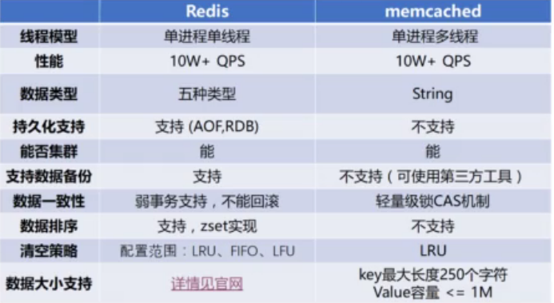

# Redis

* [1、Redis简介](#1、Redis简介)
* [2、Redis简单使用](#2、Redis简单使用)
* [3、方法【参考API】](#3、方法【参考API】)
* [4、Redis整合Spring](#4、Redis整合Spring)
* [5、mybatis使用redis做二级缓存](#5、mybatis使用redis做二级缓存)
* [6、mybatis使用redis做二级缓存【集群下】](#6、mybatis使用redis做二级缓存【集群下】)
* [7、使用redisTemplate](#7、使用redisTemplate)

### 1、Redis简介 ###

> redis 是什么

	Redis 是一个开源的K/V ，内存存储的数据结构的服务器，可用作数据库、高速缓存和消息队列代理。  
	采用的是单线程模型，并发能力强大，是当前互联网架构中主流的分布式缓存工具。
	支持多种数据格式，数据可以持久化。

	并发高：
		1. 基于内存存储数据【内存中操作，速度快】；
		2. 采用IO多路复用技术【epoll，可以让单个线程高效的处理多个连接请求，减少网络IO的时间消耗】；
		3. 采用单线程，避免了不必要的上下文切换和竞争条件的性能损耗。

	IO多路复用技术

		I/O多路复用，I/O就是指的我们网络I/O，多路指多个TCP连接(或多个Channel)，复用指复用一个或少量线程。
		简单理解就是很多个网络I/O复用一个或少量的线程来处理多个连接。

		大量的连接统统都可以过来直接注册到Selector复用器上面，同时只要单个或者少量的线程来循环处理这些连接事件就可以了，一旦达到“就绪”的条件，就可以立即执行真正的I/O操作，不就绪的不处理。
		这个使得我们就可以用极少量的线程去HOLD住大量的连接。

	默认情况下，网络IO是阻塞模式，即服务器线程在数据到来之前处于【阻塞】状态，等到数据到达，会自动唤醒服务器线程，着手进行处理。
	阻塞模式下，一个线程只能处理一个流的IO事件 。

	非阻塞【相对内核而言】：
		指的是从内核的角度出发，复制数据时，内核不用等待，当有就绪条件满足的时候，它直接复制，其余时间在处理别的就绪的条件。
		实际上指的这个地方的非阻塞。

		从内核的角度等待Selector上面的网络事件就绪，是阻塞的，如果没有任何一个网络事件就绪则一直等待直到有一个或者多个网络事件就绪。

> 通信流程：

	1、客户端向 redis 发送请求；
	2、请求命令在redis中的队列排队；
	3、redis执行队列中最前面的命令；
	4、返回操作结果给客户端。

> jedis 与 redis 通讯

	官方推出的面向 Java 的redis连接客户端工具 Jedis，提供了很多接口和方法，可以让 Java 操作使用 Redis。
	jedis 连接 redis时的连接是通过 Socket 组件获取的，可以理解为一个 TCP 连接，即redis端为一个socket 服务端。  
	jedis 和 redis 的通讯协议是通过 RESP协议进行数据交互，简单易读。  

> RESP【Redis Serializer Prototal】 协议，序列化保存到内存中，格式如下：

	*3	//3个命令字段
	$3	//字段长度
	SET	//字段
	$5
	HELLO
	$5
	WORLD
	
	命令：SET HELLO WORLD

> jedis 的批量操作根据类 -- pipeline  
> 将数据库的数据批量导入redis中

	mysql -utest -ptest <数据库名> --default-character-set=utf8 --skip-column-names --raw < test.sql | redis-cli -h 192.168.1.30 -p 7000 --pipe

> hash 一致性算法

	在分布式redis 中使用 hash一致性算法将key/value 均匀的缓存到多台redis服务器中。

	当我们在部署redis节点时，用户链接redis存储数据会通过hash算法来定位具体链接那个redis节点，在redis节点数量没有改变的前提下，之前的用户通过hash算法会固定的链接某一台redis节点，但是若此时我们增加了redis节点，用户再次hash时，能会hash到别的redis机器上，导致用户在redis节点上读取不到对应的数据，这就是redis命中的问题。

	redis一致性hash算法：
	
	将用户和redis节点的hash值对应到一个32位的环形数据结构上，环形结构首尾封闭，用户通过hash算法来定位在环形结构上，redis节点也通过hash算法来定位到环形结构上，此时的命中问题就变成了，用户节点通过顺时针旋转，在旋转的过程中若碰到redis节点，就在该节点上读取数据，若此时在环形结构上增加新的redis节点，由于是顺时针寻找对应的redis节点，所以用户此时的redis命中率还是很高的，不会因为增加了一台redis节点就导致大量的用户命中失败的情况出现。
	
> hash倾斜：
	
	上述情况是发生在redis节点均匀分布在环形结构上的情况下，但是若redis节点分布密集，并且集中在环形结构上一侧，那么就会出现，大量的用户节点请求同一台redis服务器，而其余redis服务器处于低请求的情况，若此时再加入一个redis节点，那么同样会导致命中率失败变高。这种情况叫做 hash倾斜。
	
> hash倾斜的解决办法：
	
	增加虚拟节点，假如有1 ，2两台redis节点分布在32位环形结构上，那么我们可以增加大量的虚拟的 1，2节点在环形结构上。
	用户命中到虚拟节点之后，再 hash到真实的redis机器上。
	
	虽然增加虚拟节点可以解决此问题，但是依然存在hash倾斜的问题，但是随着虚拟节点的大量增加，就会使得出现hash命中失败的现象降到最低。
	一致性hash算法公式：1-n/(n + m) * 100%  
		n表示真实的redis节点，m表示增加的虚拟节点，可以看到随着虚拟节点的增加，命中失败越来越低。

### 2、Redis简单使用 ###

> 需要jar包
		
	操作Redis需要  jedis-2.9.0.jar
	需要使用Redis连接池的话，还需commons-pool2-2.4.2.jar
	Jedis是redis的java版本的客户端实现，使用jedis操作redis。

> redis 初始化

	package com.hdc.redis;

	import redis.clients.jedis.Jedis;
	import redis.clients.jedis.JedisPool;
	import redis.clients.jedis.JedisPoolConfig;
	
	public class RedisUtil {
	
	    //连接redis的初始化参数
	    private static String ADDR = "192.168.1.30";
	    private static int PORT = 7003;
	    private static int MAX_ACTIVE = 1024;
	    private static int MAX_IDLE = 200;
	    private static int MAX_WAIT = 10000;
	    private static int TIMEOUT = 10000;
	    private static boolean TEST_ON_BORROW = true;
	
	    private static JedisPool jedisPool = null;
	
	    /**
	     * 初始化 Redis 连接池
	     */
	    static {
	        JedisPoolConfig jedisPoolConfig = new JedisPoolConfig();
	        jedisPoolConfig.setMaxTotal(MAX_ACTIVE);
	        jedisPoolConfig.setMaxIdle(MAX_IDLE);
	        jedisPoolConfig.setMaxWaitMillis(MAX_WAIT);
	        jedisPoolConfig.setTestOnBorrow(TEST_ON_BORROW);
	        jedisPool = new JedisPool(jedisPoolConfig,ADDR,PORT,TIMEOUT);
	    }
	
	    /**
	     * 获取jedis 实例
	     * @return
	     */
	    public synchronized static Jedis getJedis(){
	        if (jedisPool != null){
	            Jedis reource = jedisPool.getResource();
	            return reource;
	        }else{
	            return null;
	        }
	    }
	
	    /**
	     * 释放 jedis 资源
	     * @param jedis
	     */
	    public static void closeResourse(Jedis jedis){
	        if (jedis != null){
	            jedisPool.close();
	        }
	    }
	}

> redis使用

	package com.hdc.redis;

	import redis.clients.jedis.Jedis;
	import java.util.HashMap;
	import java.util.Iterator;
	import java.util.List;
	import java.util.Map;
	
	public class RedisDemo {
	
	    //使用redis 连接池
	    private static Jedis jedis = RedisUtil.getJedis();
	
	    public static void main(String[] args) {
	//        testString();
	//        testMap();
	        testList();
	    }
	
	    /**
	     * jedis 储存字符串
	     */
	    public static void testString(){
	        jedis.set("username","alex");
	        System.out.println(jedis.get("username"));
	        jedis.append("username"," is My Love");
	        System.out.println(jedis.get("username"));
	        jedis.mset("name","kevin","age","23",
	                "job","java","salary","12000");
	        System.out.println(jedis.get("name")+"-"+jedis.get("age")+ "-"+jedis.get("salary"));
	    }
	
	    /**
	     * jedis 操作 Map
	     */
	    public static void testMap(){
	
	        Map<String,String> map = new HashMap<String,String>();
	        map.put("name","hdc");
	        map.put("age","25");
	        map.put("salary","12000");
	        jedis.hmset("user",map);
	
	        //第一个参数是存入redis中map对象的key，后面跟的是放入map中的对象的key，后面的key可以跟多个，是可变参数
	        List<String> rsmap = jedis.hmget("user","name","age","salary");
	        System.out.println(rsmap);
	
	        //删除map中的某个键值
	        jedis.hdel("user","age");
	
	        Iterator<String> iterator = jedis.hkeys("user").iterator();
	        while (iterator.hasNext()){
	            String key = iterator.next();
	            System.out.println(key+":"+jedis.hmget("user",key));
	        }
	    }
	
	    /**
	     * jedis操作List
	     */
	    public static void testList(){
	
	        jedis.lpush("java framework","spring");
	        jedis.lpush("java framework","struts");
	        jedis.lpush("java framework","hibernate");
	        System.out.println(jedis.lrange("java framework",0,-1));
	    }
	
	    /**
	     * jedis操作 Set
	     */
	    public static void testSet(){
	
	    }
	}

### 3、方法【参考API】 ###
> 连接操作相关的命令
			
	Redis Auth 命令	验证密码是否正确
	Redis Echo 命令	打印字符串
	Redis Ping 命令	查看服务是否运行
	Redis Quit 命令	关闭当前连接
	Redis Select 命令	切换到指定的数据库

>　持久化
			
	save：		将数据同步保存到磁盘
	bgsave：		将数据异步保存到磁盘
	lastsave：	返回上次成功将数据保存到磁盘的Unix时戳
	shundown：	将数据同步保存到磁盘，然后关闭服务

> 远程服务控制

	info：		提供服务器的信息和统计
	monitor：	实时转储收到的请求
	slaveof：	改变复制策略设置
	config：		在运行时配置Redis服务器

> 对key操作的命令
			
	exists(key)：	确认一个key是否存在
	del(key)：		删除一个key
	type(key)：		返回值的类型
	keys(pattern)：	返回满足给定pattern的所有key
	randomkey：		随机返回key空间的一个
	keyrename(oldname, newname)：重命名key
	dbsize：			返回当前数据库中key的数目
	expire：			设定一个key的活动时间（s）
	ttl：			获得一个key的活动时间
	select(index)：	按索引查询
	move(key, dbindex)：移动当前数据库中的key到dbindex数据库
	flushdb：		删除当前选择数据库中的所有key
	flushall：		删除所有数据库中的所有key
	Dump 命令		序列化给定 key ，并返回被序列化的值。
	Rename 命令		修改 key 的名称
		
> 对String操作的命令

	set(key, value)：		给数据库中名称为key的string赋予值value
	get(key)：				返回数据库中名称为key的string的value
	getset(key, value)：		将给定 key 的值设为 value ，并返回 key 的旧值
	mget(key1, key2,…, key N)：返回库中多个string的value
	setnx(key, value)：		当且仅当key 不存在时，才会将添加key/value，若key已存在，则什么都不做
	setex(key, time, value)：向库中添加string，设定过期时间time
	mset(key N, value N)：	批量设置多个string的值
	msetnx(key N, value N)：如果所有名称为key i的string都不存在
	incr(key)：				名称为key的string增1操作
	incrby(key, integer)：	名称为key的string增加integer
	decr(key)：				名称为key的string减1操作
	decrby(key, integer)：	名称为key的string减少integer
	append(key, value)：		名称为key的string的值附加value
	substr(key, start, end)：返回名称为key的string的value的子串

> 对List操作的命令

	rpush(key, value)：			在名称为key的list尾添加一个值为value的元素
	lpush(key, value)：			在名称为key的list头添加一个值为value的 元素
	llen(key)：					返回名称为key的list的长度
	lrange(key, start, end)：	返回名称为key的list中start至end之间的元素
	ltrim(key, start, end)：		截取名称为key的list
	lindex(key, index)：			返回名称为key的list中index位置的元素
	lset(key, index, value)：	给名称为key的list中index位置的元素赋值
	lrem(key, count, value)：	删除count个key的list中值为value的元素
	lpop(key)：					返回并删除名称为key的list中的首元素
	rpop(key)：					返回并删除名称为key的list中的尾元素
	blpop(key1, key2,… key N, timeout)：lpop命令的block版本。
	brpop(key1, key2,… key N, timeout)：rpop的block版本。
	rpoplpush(srckey, dstkey)：	返回并删除名称为srckey的list的尾元素，并将该元素添加到名称为dstkey的list的头部

> 对Set操作的命令
			
	sadd(key, member)：			向名称为key的set中添加元素member
	srem(key, member) ：			删除名称为key的set中的元素member
	spop(key) ：					随机返回并删除名称为key的set中一个元素
	smove(srckey, dstkey, member) ：移到集合元素
	scard(key) ：				返回名称为key的set的基数
	sismember(key, member) ：member是否是名称为key的set的元素
	sinter(key1, key2,…key N) ：求交集
	sinterstore(dstkey, (keys)) ：求交集并将交集保存到dstkey的集合
	sunion(key1, (keys)) ：		求并集
	sunionstore(dstkey, (keys)) ：求并集并将并集保存到dstkey的集合
	sdiff(key1, (keys)) ：		求差集
	sdiffstore(dstkey, (keys)) ：求差集并将差集保存到dstkey的集合
	smembers(key) ：				返回名称为key的set的所有元素
	srandmember(key) ：			随机返回名称为key的set的一个元素

> 有序集合(sorted set) 命令
			
	ZADD
		将一个或多个 member 元素及其 score 值加入到有序集 key 当中
	ZCARD
		返回有序集 key 的基数
	ZCOUNT
		返回有序集 key 中， score 值在 min 和 max 之间(默认包括 score 值等于 min 或 max )的成员的数量
	ZINCRBY
		为有序集 key 的成员 member 的 score 值加上增量 increment 
	ZRANGE
		返回有序集 key 中，指定区间内的成员
	ZRANGEBYSCORE
		返回有序集 key 中，所有 score 值介于 min 和 max 之间(包括等于 min 或 max )的成员
	ZRANK
		返回有序集 key 中成员 member 的排名。其中有序集成员按 score 值递增(从小到大)顺序排列
	ZREM
		移除有序集 key 中的一个或多个成员，不存在的成员将被忽略
	ZREMRANGEBYRANK
		移除有序集 key 中，指定排名(rank)区间内的所有成员
	ZREMRANGEBYSCORE
		移除有序集 key 中，所有 score 值介于 min 和 max 之间(包括等于 min 或 max )的成员
	ZREVRANGE
		返回有序集 key 中，指定区间内的成员
	ZREVRANGEBYSCORE
		返回有序集 key 中， score 值介于 max 和 min 之间(默认包括等于 max 或 min )的所有的成员。有序集成员按 score 值递减(从大到小)的次序排列
	ZREVRANK
		返回有序集 key 中成员 member 的排名。其中有序集成员按 score 值递减(从大到小)排序
	ZSCORE
		返回有序集 key 中，成员 member 的 score 值
	ZUNIONSTORE
		计算给定的一个或多个有序集的并集，其中给定 key 的数量必须以 numkeys 参数指定，并将该并集(结果集)储存到 destination
	ZINTERSTORE
		计算给定的一个或多个有序集的交集，其中给定 key 的数量必须以 numkeys 参数指定，并将该交集(结果集)储存到 destination
	ZSCAN
		迭代有序集合中的元素（包括元素成员和元素分值）

> 对Hash操作的命令

	hset(key, field, value)：	向名称为key的hash中添加元素field
	hget(key, field)：			返回名称为key的hash中field对应的value
	hmget(key, (fields))：		返回名称为key的hash中field i对应的value
	hmset(key, (fields))：		向名称为key的hash中添加元素field 
	hincrby(key, field, integer)：将名称为key的hash中field的value增加integer
	hexists(key, field)：		名称为key的hash中是否存在键为field的域
	hdel(key, field)：			删除名称为key的hash中键为field的域
	hlen(key)：					返回名称为key的hash中元素个数
	hkeys(key)：					返回名称为key的hash中所有键名
	hvals(key)：					返回名称为key的hash中所有键对应的value
	hgetall(key)：				返回名称为key的hash中所有的键（field）及其对应的value

> Redis 发布订阅 命令
			
	Redis Psubscribe 	订阅一个或多个符合给定模式的频道。
	Redis Pubsub 		查看订阅与发布系统状态。
	Redis Publish 		将信息发送到指定的频道。
	Redis Punsubscribe 	退订所有给定模式的频道。
	Redis Subscribe 	订阅给定的一个或多个频道的信息。
	Redis Unsubscribe 	指退订给定的频道。

> 事务 命令
			
	Redis Discard 	取消事务，放弃执行事务块内的所有命令。
	Redis Exec 		执行所有事务块内的命令。
	Redis Multi 	标记一个事务块的开始。
	Redis Unwatch 	取消 WATCH 命令对所有 key 的监视。
	Redis Watch 	监视一个(或多个) key ，如果在事务执行之前这个(或这些) key 被其他命令所改动，那么事务将被打断。

> Redis 脚本 命令
			
	Redis Eval 				执行 Lua 脚本。
	Redis Evalsha 			执行 Lua 脚本。
	Redis Script Exists 	查看指定的脚本是否已经被保存在缓存当中。
	Redis Script Flush 		从脚本缓存中移除所有脚本。
	Redis Script kill 		杀死当前正在运行的 Lua 脚本。
	Redis Script Load 		将脚本 script 添加到脚本缓存中，但并不立即执行这个脚本。

> Redis 服务器 命令
			
	Redis Bgrewriteaof 		异步执行一个 AOF（AppendOnly File） 文件重写操作
	Redis Bgsave 			在后台异步保存当前数据库的数据到磁盘
	Redis Client Kill 		关闭客户端连接
	Redis Client List 		获取连接到服务器的客户端连接列表
	Redis Client Getname 	获取连接的名称
	Redis Client Pause 		在指定时间内终止运行来自客户端的命令
	Redis Client Setname 	设置当前连接的名称
	Redis Cluster Slots 	获取集群节点的映射数组
	Redis Command 			获取 Redis 命令详情数组
	Redis Command Count 	获取 Redis 命令总数
	Redis Command Getkeys 	获取给定命令的所有键
	Redis Time 				返回当前服务器时间
	Redis Command Info 		获取指定 Redis 命令描述的数组
	Redis Config Get 		获取指定配置参数的值
	Redis Config rewrite 	对启动 Redis 服务器时所指定的 redis.conf 配置文件进行改写
	Redis Config Set 		修改 redis 配置参数，无需重启
	Redis Config Resetstat 	重置 INFO 命令中的某些统计数据
	Redis Dbsize 			返回当前数据库的 key 的数量
	Redis Debug Object 		获取 key 的调试信息
	Redis Debug Segfault 	让 Redis 服务崩溃
	Redis Flushall 			删除所有数据库的所有key
	Redis Flushdb 			删除当前数据库的所有key
	Redis Info 				获取 Redis 服务器的各种信息和统计数值
	Redis Lastsave 			返回最近一次 Redis 成功将数据保存到磁盘上的时间，以 UNIX 时间戳格式表示
	Redis Monitor 			实时打印出 Redis 服务器接收到的命令，调试用
	Redis Role 				返回主从实例所属的角色
	Redis Save 				异步保存数据到硬盘
	Redis Shutdown 			异步保存数据到硬盘，并关闭服务器
	Redis Slaveof 			将当前服务器转变为指定服务器的从属服务器(slave server)
	Redis Showlog 			管理 redis 的慢日志
	Redis Sync 				用于复制功能(replication)的内部命令

### 4、Redis整合Spring ###

> pom.xml

	<dependency>
      <groupId>org.springframework.session</groupId>
      <artifactId>spring-session-data-redis</artifactId>
      <version>1.2.1.RELEASE</version>
    </dependency>
    <dependency>
      <groupId>redis.clients</groupId>
      <artifactId>jedis</artifactId>
      <version>2.9.0</version>
    </dependency>

> redis.properties

	spring.redis.cluster.nodes=192.168.1.30:7000,192.168.1.30:7001,192.168.1.30:7002
	spring.redis.cluster.max-redirects=5

	redis.minIdle=5
	redis.maxIdle=100
	redis.maxTotal=300
	redis.maxWait=1000
	redis.testOnBorrow=true

	【redis配置说明】

	# 节点，多个节点用逗号分隔
	spring.redis.cluster.nodes=192.168.1.30:7000,192.168.1.30:7001,192.168.1.30:7002
	# 集群间redis最大跳转次数
	spring.redis.cluster.max-redirects=5

	# 最大连接数, 默认8个【一些低版本的包是maxActive】，如果超过此数量将抛出异常。设为-1表示无限制。
	redis.maxTotal=100
	# 控制一个pool最多有多少个状态为idle(空闲的)的jedis实例。
	# 最大空闲数【默认为8】，最大等待连接中的数量,设 0 为没有限制。超过空闲时间，数据库连接将被标记为不可用，然后被释放。
	redis.maxIdle=20
	# 控制一个pool最少有多少个状态为idle(空闲的)的jedis实例【默认为0】。
	redis.minIdle=2
	# 等待可用连接的最大时间【毫秒数】，默认值为-1，表示永不超时。如果超过等待时间，则直接抛出JedisConnectionException；
	redis.maxWait=10000
	# 在借用一个jedis实例时，是否对jedis实例进行验证操作；
	# 如果为true，则对jedis实例进行验证操作，这样得到的jedis实例均是可用的。默认为false
	redis.testOnBorrow=true

	# 在归还一个jedis实例时，是否对jedis实例进行验证操作；
	# 如果为true，则对jedis实例进行验证操作，这样归还的jedis实例均是可用的。默认为false
	redis.testOnReturn=true

	# 读取超时【默认是2000s】
	

> spring-redis.xml
		
	<?xml version="1.0" encoding="UTF-8"?>
	<beans xmlns="http://www.springframework.org/schema/beans"
	       xmlns:xsi="http://www.w3.org/2001/XMLSchema-instance"
	       xmlns:context="http://www.springframework.org/schema/context"
	       xsi:schemaLocation="http://www.springframework.org/schema/beans
	       http://www.springframework.org/schema/beans/spring-beans.xsd
	       http://www.springframework.org/schema/context
	       http://www.springframework.org/schema/context/spring-context.xsd">
	
	
	    <!-- 加载数据库属性文件 -->
	    <context:property-placeholder
	            location="classpath:redis.properties" ignore-unresolvable="true" />
	
	    <bean id="redisPropertySource"
	          class="org.springframework.core.io.support.ResourcePropertySource">
	        <constructor-arg name="resource" value="classpath:redis.properties"/>
	    </bean>
	
	    <bean id="redisClusterConfiguration"
	          class="org.springframework.data.redis.connection.RedisClusterConfiguration">
	        <constructor-arg name="propertySource" ref="redisPropertySource"/>
	    </bean>
	
	    <!--配置 JedisPoolConfig 实例-->
	    <bean id="jedisPoolConfig" class="redis.clients.jedis.JedisPoolConfig">
	        <property name="maxIdle" value="${redis.maxIdle}"/>
	        <property name="minIdle" value="${redis.minIdle}"/>
	        <property name="maxTotal" value="${redis.maxTotal}"/>
	        <property name="maxWaitMillis" value="${redis.maxWait}"/>
	        <property name="testOnBorrow" value="${redis.testOnBorrow}"/>
	    </bean>
	
	    <!--配置 JedisConnectionFactory -->
	    <bean id="jedisConnectionFactory"
	          class="org.springframework.data.redis.connection.jedis.JedisConnectionFactory">
	        <constructor-arg ref="redisClusterConfiguration"/>
	        <constructor-arg ref="jedisPoolConfig"/>
	    </bean>
	
		<!--
	     spring-data-redis的RedisTemplate<K, V>模板类在操作redis时默认使用JdkSerializationRedisSerializer来进行序列化,
	     会使key添加序列化前缀，造成key不一致 ["\xac\xed\x00\x05t\x00\x04name"],
		所以需要添加序列化策略：键采用String 序列化，值采用 jackson
	     -->
	    <bean id="redisTemplate" class="org.springframework.data.redis.core.RedisTemplate">
	        <property name="connectionFactory" ref="jedisConnectionFactory"/>
	        <property name="keySerializer">
	            <bean class="org.springframework.data.redis.serializer.StringRedisSerializer"/>
	        </property>
	        <property name="valueSerializer">
	            <bean class="org.springframework.data.redis.serializer.StringRedisSerializer"/>
	        </property>
	        <property name="hashKeySerializer">
	            <bean class="org.springframework.data.redis.serializer.StringRedisSerializer"/>
	        </property>
	        <property name="hashValueSerializer">
	            <bean class="org.springframework.data.redis.serializer.StringRedisSerializer"/>
	        </property>
	    </bean>
	    

		<!-- StringRedisTemplate 默认使用 StringRedisSerializer进行序列化 -->
	    <bean id="stringRedisTemplate"
	          class="org.springframework.data.redis.core.StringRedisTemplate">
	        <property name="connectionFactory" ref="jedisConnectionFactory"/>
	    </bean>
	
	</beans>
	
> redis工具类 RedisCache【可用可不用，在方法中可以直接使用redisTemplate】
		
	package com.ssm.tool;

	import org.slf4j.Logger;
	import org.slf4j.LoggerFactory;
	import org.springframework.beans.factory.annotation.Autowired;
	import org.springframework.cache.Cache;
	import org.springframework.cache.support.SimpleValueWrapper;
	import org.springframework.dao.DataAccessException;
	import org.springframework.data.redis.connection.RedisConnection;
	import org.springframework.data.redis.core.RedisCallback;
	import org.springframework.data.redis.core.RedisTemplate;
	import org.springframework.util.DigestUtils;
	
	import java.io.*;
	import java.util.concurrent.Callable;
	import java.util.concurrent.TimeUnit;
	
	/**
	 * @Author: HDC
	 * @Date: Create in 2018/1/5 15:02
	 */
	public class RedisCache implements Cache {
	
	    private static final Logger logger = LoggerFactory.getLogger(RedisCache.class);
	
	    private static RedisTemplate redisTemplate;
	    private static long expiration;
	
	    @Autowired
	    public void setRedisTemplate(RedisTemplate redisTemplate) {
	        this.redisTemplate = redisTemplate;
	    }
	
	    @Autowired
	    public void setExpiration(long expiration) {
	        this.expiration = expiration;
	    }
	
	    /**
	     * 自定义 redis key的生成策略
	     * @return
	     */
	    public String getKey(Object key){
	        StringBuilder stringBuilder = new StringBuilder();
	        stringBuilder.append(DigestUtils.md5DigestAsHex(String.valueOf(key).getBytes()));
	        return stringBuilder.toString();
	    }
	
	    @Override
	    public String getName() {
	        return null;
	    }
	
	    @Override
	    public Object getNativeCache() {
	        return null;
	    }
	
	    @Override
	    public ValueWrapper get(Object key) {
	        return null;
	    }
	
	    @Override
	    public <T> T get(Object key, Class<T> type) {
	        key = getKey(key);
	        logger.info("get键是 {}",key);
	        Object result = redisTemplate.opsForValue().get(key);
	        return (T) result;
	    }
	
	    @Override
	    public <T> T get(Object key, Callable<T> valueLoader) {
	        return null;
	    }
	
	    @Override
	    public void put(Object key, Object value) {
	
	        key = getKey(key);
	        logger.info("put键是 {}",key);
	        redisTemplate.opsForValue().set(key,value,expiration, TimeUnit.SECONDS);
	        logger.info("有效时间：{}",String.valueOf(redisTemplate.getExpire(key)));
	    }
	
	    @Override
	    public ValueWrapper putIfAbsent(Object key, Object value) {
	        return null;
	    }
	
	    @Override
	    public void evict(Object key) {
	        redisTemplate.delete(key);
	    }
	
	    @Override
	    public void clear() {
	
	    }
	
	}
	
> 测试类
		
	package com.ssm.service;
	
	import com.ssm.dao.EmployeeMapper;
	import com.ssm.entity.Employee;
	import com.ssm.tool.RedisCache;
	import org.junit.Test;
	import org.junit.runner.RunWith;
	import org.springframework.beans.factory.annotation.Autowired;
	import org.springframework.cache.annotation.Cacheable;
	import org.springframework.data.redis.core.RedisTemplate;
	import org.springframework.test.context.ContextConfiguration;
	import org.springframework.test.context.junit4.SpringJUnit4ClassRunner;
	import java.util.concurrent.TimeUnit;
	import static org.junit.Assert.*;
	
	/**
	 * redis 缓存数据库中的数据
	 * @Author: HDC
	 * @Date: Create in 2018/1/5 15:31
	 */
	@RunWith(SpringJUnit4ClassRunner.class)
	@ContextConfiguration(locations = {"classpath:config/spring-mybatis.xml","classpath:config/spring-redis.xml"})
	public class EmployeeServiceTest {
	
	    @Autowired
	    private EmployeeMapper employeeMapper;
	
	    @Autowired
	    private RedisCache redisCache;
	
	    @Test
	    public void selectByPrimaryKeyWithDept() throws Exception {
	        int empId = 23;
	        String key = "employee"+empId;
	        Employee employee = redisCache.get(key,Employee.class);
	
	        if (employee == null){
	            System.out.println("从数据库查找");
	            employee = employeeMapper.selectByPrimaryKeyWithDept(empId);
	            System.out.println("员工信息："+employee);
	            System.out.println("员工信息缓存进redis");
	            redisCache.put(key,employee);
	
	        }else{
	            System.out.println("redis中有缓存数据");
	            System.out.println("员工信息："+employee);
	        }
	    }
	}

### 5、mybatis使用redis做二级缓存 ###

- 配置redis.xml 设置redis服务连接各参数;
- 在配置文件中使用 <setting> 标签，设置开启二级缓存;
- 在mapper.xml 中使用<cache type="com.hdc.redisUtil.RedisCache"/> 将cache映射到指定的RedisCacheClass类中；
- 映射类RedisCacheClass 实现 MyBatis包中的Cache类，并重写其中各方法；
- 在重写各方法体中，使用redisFactory和redis服务建立连接，将缓存的数据加载到指定的redis内存中(putObject方法)或将redis服务中的数据从缓存中读取出来(getObject方法)；
- 在redis服务中写入和加载数据时需要借用spring-data-redis.jar中JdkSerializationRedisSerializer.class中的序列化(serialize)和反序列化方法(deserialize),此为包中封装的redis默认的序列化方法；
- 映射类中的各方法重写完成后即可实现mybatis数据二级缓存到redis服务中。

> RedisCache
	
	package com.hdc.redisUtil;

	import org.apache.ibatis.cache.Cache;
	import org.slf4j.Logger;
	import org.slf4j.LoggerFactory;
	import org.springframework.data.redis.connection.jedis.JedisConnection;
	import org.springframework.data.redis.connection.jedis.JedisConnectionFactory;
	import org.springframework.data.redis.serializer.JdkSerializationRedisSerializer;
	import org.springframework.data.redis.serializer.RedisSerializer;
	import org.springframework.util.DigestUtils;
	import redis.clients.jedis.exceptions.JedisConnectionException;
	import java.util.concurrent.locks.ReadWriteLock;
	import java.util.concurrent.locks.ReentrantReadWriteLock;
	
	/**
	 * 使用第三方内存数据库Redis作为二级缓存
	 * @Author: HDC
	 * @Date: Create in 2018/1/2 15:37
	 */
	public class RedisCache implements Cache{
	
	    private static final Logger logger = LoggerFactory.getLogger(RedisCache.class);
	
	    private static JedisConnectionFactory jedisConnectionFactory;
	    private static long expiration;
	    private String id;
	    private final ReadWriteLock readWriteLock = new ReentrantReadWriteLock();
	
	    public RedisCache(){}
	
	    public RedisCache(String id){
	        if (id == null){
	            throw new IllegalArgumentException("Cache instances require an ID");
	        }
	        logger.debug("MybatisRedisCache:id={}",id);
	        this.id = id;
	    }
	
	   @Autowired
	    public void setJedisConnectionFactory(JedisConnectionFactory jedisConnectionFactory) {
	        this.jedisConnectionFactory = jedisConnectionFactory;
	    }
	
	    @Autowired
	    public void setExpiration(long expiration) {
	        this.expiration = expiration;
	    }
	
	    /**
	     * 自定义 redis key的生成策略
	     * @return
	     */
	    public String getKey(Object key){
	        StringBuilder stringBuilder = new StringBuilder();
	        stringBuilder.append(this.id).append(":");
	        stringBuilder.append(DigestUtils.md5DigestAsHex(String.valueOf(key).getBytes()));
	
	        return stringBuilder.toString();
	    }
	
	    @Override
	    public String getId() {
	        return this.id;
	    }
	
	    @Override
	    public void putObject(Object key, Object value) {
	        JedisConnection connection = null;
	        try
	        {
	            connection = (JedisConnection) jedisConnectionFactory.getConnection();
	            key = getKey(key);
	            logger.info("put键是 {}",key);
	            //借用spring_data_redis.jar中的JdkSerializationRedisSerializer.class
	            RedisSerializer<Object> serializer = new JdkSerializationRedisSerializer();
	            //利用其序列化方法将数据写入redis服务的缓存中，并设置有效时间
	            connection.setEx(serializer.serialize(key),expiration, serializer.serialize(value));
	        }
	        catch (JedisConnectionException e)
	        {
	            e.printStackTrace();
	        }
	        finally
	        {
	            if (connection != null) {
	                connection.close();
	            }
	        }
	    }
	
	    @Override
	    public Object getObject(Object key) {
	        Object result = null;
	        JedisConnection connection = null;
	        try
	        {
	            connection = (JedisConnection) jedisConnectionFactory.getConnection();
	            //借用spring_data_redis.jar中的JdkSerializationRedisSerializer.class
	            RedisSerializer<Object> serializer = new JdkSerializationRedisSerializer();
	            //利用其反序列化方法获取值
	            key = getKey(key);
	            logger.info("get键是 {}",key);
	            result = serializer.deserialize(connection.get(serializer.serialize(key)));
	        }
	        catch (JedisConnectionException e)
	        {
	            e.printStackTrace();
	        }
	        finally
	        {
	            if (connection != null) {
	                connection.close();
	            }
	        }
	        return result;
	    }
	
	    @Override
	    public Object removeObject(Object key) {
	        JedisConnection connection = null;
	        Object result = null;
	        try
	        {
	            connection = (JedisConnection) jedisConnectionFactory.getConnection();
	            RedisSerializer<Object> serializer = new JdkSerializationRedisSerializer();
	            result =connection.expire(serializer.serialize(key), 0);
	        }
	        catch (JedisConnectionException e)
	        {
	            e.printStackTrace();
	        }
	        finally
	        {
	            if (connection != null) {
	                connection.close();
	            }
	        }
	        return result;
	    }
	
	    @Override
	    public void clear() {
	
	        JedisConnection connection = null;
	        try
	        {
	            connection = (JedisConnection) jedisConnectionFactory.getConnection();
	            connection.flushDb();
	            connection.flushAll();
	        }
	        catch (JedisConnectionException e)
	        {
	            e.printStackTrace();
	        }
	        finally
	        {
	            if (connection != null) {
	                connection.close();
	            }
	        }
	    }
	
	    @Override
	    public int getSize() {
	        int result = 0;
	        JedisConnection connection = null;
	        try
	        {
	            connection = (JedisConnection) jedisConnectionFactory.getConnection();
	            result = Integer.valueOf(connection.dbSize().toString());
	        }
	        catch (JedisConnectionException e)
	        {
	            e.printStackTrace();
	        }
	        finally
	        {
	            if (connection != null) {
	                connection.close();
	            }
	        }
	        return result;
	    }
	
	    @Override
	    public ReadWriteLock getReadWriteLock() {
	        return this.readWriteLock;
	    }
	}

> spring-redis.xml

	<!--加载 redis 属性配置文件-->
    <context:property-placeholder location="classpath:redis.properties"/>

    <!--配置 JedisPoolConfig 实例-->
    <bean id="poolConfig" class="redis.clients.jedis.JedisPoolConfig">
        <property name="maxIdle" value="${redis.maxIdle}"/>
        <property name="maxTotal" value="${redis.maxActive}"/>
        <property name="maxWaitMillis" value="${redis.maxWait}"/>
        <property name="testOnBorrow" value="${redis.testOnBorrow}"/>
    </bean>

    <!-- 配置JedisConnectionFactory -->
    <bean id="jedisConnectionFactory" class="org.springframework.data.redis.connection.jedis.JedisConnectionFactory">
        <property name="hostName" value="${redis.host}"/>
        <property name="port" value="${redis.port}"/>
        <property name="database" value="${redis.database}"/>
        <property name="poolConfig" ref="poolConfig"/>
    </bean>

    <bean class="com.hdc.redisUtil.RedisCache">
        <property name="jedisConnectionFactory" ref="jedisConnectionFactory"/>
        <property name="expiration" value="${redis.expiration}"/>
    </bean>

### 6、mybatis使用redis做二级缓存【集群下】 ###

> spring-redis.xml
		
	<!--配置 JedisPoolConfig 实例-->
    <bean id="poolConfig" class="redis.clients.jedis.JedisPoolConfig">
        <property name="maxIdle" value="${redis.maxIdle}"/>
        <property name="maxTotal" value="${redis.maxActive}"/>
        <property name="maxWaitMillis" value="${redis.maxWait}"/>
        <property name="testOnBorrow" value="${redis.testOnBorrow}"/>
    </bean>

    <!-- 3主3从redis 集群-->
    <bean id="redisNode" class="org.springframework.data.redis.connection.RedisNode">
        <constructor-arg name="host" value="${redis.host}"/>
        <constructor-arg name="port" value="${redis.port}"/>
    </bean>
    <bean id="redisNode1" class="org.springframework.data.redis.connection.RedisNode">
        <constructor-arg name="host" value="${redis.host}"/>
        <constructor-arg name="port" value="${redis.port1}"/>
    </bean>
    <bean id="redisNode2"  class="org.springframework.data.redis.connection.RedisNode">
        <constructor-arg name="host" value="${redis.host}"/>
        <constructor-arg name="port" value="${redis.port2}"/>
    </bean>

    <!--redis 集群使用-->
    <bean id="redisClusterConfiguration" class="org.springframework.data.redis.connection.RedisClusterConfiguration">
        <property name="clusterNodes">
            <set>
                <ref bean="redisNode"/>
                <ref bean="redisNode1"/>
                <ref bean="redisNode2"/>
            </set>
        </property>
        <!--最大跳转次数-->
        <property name="maxRedirects" value="${redis.maxRedirects}"/>
    </bean>

    <bean id="jedisConnectionFactory" class="org.springframework.data.redis.connection.jedis.JedisConnectionFactory">
        <constructor-arg name="clusterConfig">
            <ref bean="redisClusterConfiguration"/>
        </constructor-arg>
        <property name="poolConfig" ref="poolConfig"/>
    </bean>

    <!-- 配置JedisConnectionFactory 【单机使用】-->
    <!--<bean id="jedisConnectionFactory" class="org.springframework.data.redis.connection.jedis.JedisConnectionFactory">
        <property name="hostName" value="${redis.host}"/>
        <property name="port" value="${redis.port}"/>
        <property name="database" value="${redis.database}"/>
        <property name="poolConfig" ref="poolConfig"/>
    </bean>-->

    <!-- MyBatis实现第三方缓存 -->
    <bean class="com.hdc.redisUtil.RedisCache">
        <property name="jedisConnectionFactory" ref="jedisConnectionFactory"/>
        <property name="expiration" value="${redis.expiration}"/>
    </bean>

> RedisCache
		
	package com.hdc.redisUtil;

	import org.apache.ibatis.cache.Cache;
	import org.slf4j.Logger;
	import org.slf4j.LoggerFactory;
	import org.springframework.beans.factory.annotation.Autowired;
	import org.springframework.data.redis.connection.jedis.JedisClusterConnection;
	import org.springframework.data.redis.connection.jedis.JedisConnection;
	import org.springframework.data.redis.connection.jedis.JedisConnectionFactory;
	import org.springframework.data.redis.core.RedisTemplate;
	import org.springframework.data.redis.serializer.JdkSerializationRedisSerializer;
	import org.springframework.data.redis.serializer.RedisSerializer;
	import org.springframework.util.DigestUtils;
	import redis.clients.jedis.exceptions.JedisConnectionException;
	
	import javax.annotation.Resource;
	import java.util.concurrent.locks.ReadWriteLock;
	import java.util.concurrent.locks.ReentrantReadWriteLock;
	
	/**
	 * 使用第三方内存数据库Redis作为二级缓存
	 * @Author: HDC
	 * @Date: Create in 2018/1/2 15:37
	 */
	public class RedisCache implements Cache{
	
	    private static final Logger logger = LoggerFactory.getLogger(RedisCache.class);
	
	    private static JedisConnectionFactory jedisConnectionFactory;
	    private static long expiration;
	    private String id;
	    private final ReadWriteLock readWriteLock = new ReentrantReadWriteLock();
	
	    public RedisCache(){}
	
	    //作为mybatis 的二级缓存，id 为对应的namespace
	    public RedisCache(String id){
	        if (id == null){
	            throw new IllegalArgumentException("Cache instances require an ID");
	        }
	        logger.debug("MybatisRedisCache:id={}",id);
	        this.id = id;
	    }
	
	    @Autowired
	    public void setJedisConnectionFactory(JedisConnectionFactory jedisConnectionFactory) {
	        this.jedisConnectionFactory = jedisConnectionFactory;
	    }
	
	    @Autowired
	    public void setExpiration(long expiration) {
	        this.expiration = expiration;
	    }
	
	    /**
	     * 自定义 redis key的生成策略
	     * @return
	     */
	    public String getKey(Object key){
	        StringBuilder stringBuilder = new StringBuilder();
	        stringBuilder.append(this.id).append(":");
	        stringBuilder.append(DigestUtils.md5DigestAsHex(String.valueOf(key).getBytes()));
	        return stringBuilder.toString();
	    }
	
	    @Override
	    public String getId() {
	        return this.id;
	    }
	
	    @Override
	    public void putObject(Object key, Object value) {
	
	        //单机连接
	//        JedisConnection connection = null;
	
	        //客户端集群连接
	        JedisClusterConnection connection = null;
	
	        try
	        {
	//          connection = (JedisConnection) jedisConnectionFactory.getConnection();
	            //获取集群连接
	            connection = (JedisClusterConnection) jedisConnectionFactory.getClusterConnection();
	            key = getKey(key);
	            logger.info("put键是 {}",key);
	            //借用spring_data_redis.jar中的JdkSerializationRedisSerializer.class
	            RedisSerializer<Object> serializer = new JdkSerializationRedisSerializer();
	            //利用其序列化方法将数据写入redis服务的缓存中，并设置有效时间
	            connection.setEx(serializer.serialize(key),expiration, serializer.serialize(value));
	        }
	        catch (JedisConnectionException e)
	        {
	            e.printStackTrace();
	        }
	        finally
	        {
	            if (connection != null) {
	                connection.close();
	            }
	        }
	    }
	
	    @Override
	    public Object getObject(Object key) {
	        Object result = null;
	//      JedisConnection connection = null;
	        JedisClusterConnection connection = null;
	        try
	        {
	//          connection = (JedisConnection) jedisConnectionFactory.getConnection();
	            connection = (JedisClusterConnection) jedisConnectionFactory.getClusterConnection();
	            //借用spring_data_redis.jar中的JdkSerializationRedisSerializer.class
	            RedisSerializer<Object> serializer = new JdkSerializationRedisSerializer();
	            //利用其反序列化方法获取值
	            key = getKey(key);
	            logger.info("get键是 {}",key);
	            result = serializer.deserialize(connection.get(serializer.serialize(key)));
	        }
	        catch (JedisConnectionException e)
	        {
	            e.printStackTrace();
	        }
	        finally
	        {
	            if (connection != null) {
	                connection.close();
	            }
	        }
	        return result;
	    }
	
	    @Override
	    public Object removeObject(Object key) {
	//      JedisConnection connection = null;
	        Object result = null;
	        JedisClusterConnection connection = null;
	        try
	        {
	//          connection = (JedisConnection) jedisConnectionFactory.getConnection();
	            connection = (JedisClusterConnection) jedisConnectionFactory.getClusterConnection();
	            RedisSerializer<Object> serializer = new JdkSerializationRedisSerializer();
	            result =connection.expire(serializer.serialize(key), 0);
	        }
	        catch (JedisConnectionException e)
	        {
	            e.printStackTrace();
	        }
	        finally
	        {
	            if (connection != null) {
	                connection.close();
	            }
	        }
	        return result;
	    }
	
	    @Override
	    public void clear() {
	
	//      JedisConnection connection = null;
	        JedisClusterConnection connection = null;
	        try
	        {
	//          connection = (JedisConnection) jedisConnectionFactory.getConnection();
	            connection = (JedisClusterConnection) jedisConnectionFactory.getClusterConnection();
	            connection.flushDb();
	            connection.flushAll();
	        }
	        catch (JedisConnectionException e)
	        {
	            e.printStackTrace();
	        }
	        finally
	        {
	            if (connection != null) {
	                connection.close();
	            }
	        }
	    }
	
	    @Override
	    public int getSize() {
	        int result = 0;
	//      JedisConnection connection = null;
	        JedisClusterConnection connection = null;
	        try
	        {
	//          connection = (JedisConnection) jedisConnectionFactory.getConnection();
	            connection = (JedisClusterConnection) jedisConnectionFactory.getClusterConnection();
	            result = Integer.valueOf(connection.dbSize().toString());
	        }
	        catch (JedisConnectionException e)
	        {
	            e.printStackTrace();
	        }
	        finally
	        {
	            if (connection != null) {
	                connection.close();
	            }
	        }
	        return result;
	    }
	
	    @Override
	    public ReadWriteLock getReadWriteLock() {
	        return this.readWriteLock;
	    }
	}

### 7、使用redisTemplate ###
	
> spring-redis.xml
		
	<bean id="redisPropertySource"
          class="org.springframework.core.io.support.ResourcePropertySource">
        <constructor-arg name="resource" value="classpath:redis.properties"/>
    </bean>

    <bean id="redisClusterConfiguration"
          class="org.springframework.data.redis.connection.RedisClusterConfiguration">
        <constructor-arg name="propertySource" ref="redisPropertySource"/>
    </bean>

	<!--配置 JedisPoolConfig 实例-->
    <bean id="poolConfig" class="redis.clients.jedis.JedisPoolConfig">
        <property name="maxIdle" value="${redis.maxIdle}"/>
        <property name="maxTotal" value="${redis.maxActive}"/>
        <property name="maxWaitMillis" value="${redis.maxWait}"/>
        <property name="testOnBorrow" value="${redis.testOnBorrow}"/>
    </bean>

    <!--配置 JedisConnectionFactory 【集群】-->
    <!--<bean id="jedisConnectionFactory"
          class="org.springframework.data.redis.connection.jedis.JedisConnectionFactory">
        <constructor-arg ref="redisClusterConfiguration"/>
        <constructor-arg ref="jedisPoolConfig"/>
    </bean>-->

    <bean class="com.hdc.redisUtil.RedisCacheTemplate">
        <property name="redisTemplate" ref="redisTemplate"/>
        <property name="expiration" value="${redis.expiration}"/>
    </bean>

    <!--
    如果不指定defaultSerializer，在redisTemplate中的key前面会自动加上序列化字符串，会导致和命令行的key不一致
    配置RedisTemplate,添加序列化策略：键采用String 序列化，值采用 jackson
    -->
    <bean id="redisTemplate" class="org.springframework.data.redis.core.RedisTemplate">
        <property name="connectionFactory" ref="jedisConnectionFactory"/>
        <property name="keySerializer">
            <bean class="org.springframework.data.redis.serializer.StringRedisSerializer"/>
        </property>
        <property name="valueSerializer">
            <bean class="org.springframework.data.redis.serializer.GenericJackson2JsonRedisSerializer"/>
        </property>
        <property name="hashKeySerializer">
            <bean class="org.springframework.data.redis.serializer.StringRedisSerializer"/>
        </property>
        <property name="hashValueSerializer">
            <bean class="org.springframework.data.redis.serializer.GenericJackson2JsonRedisSerializer"/>
        </property>
    </bean>
	
> RedisCacheTemplate
		
	package com.hdc.redisUtil;

	import org.apache.ibatis.cache.Cache;
	import org.slf4j.Logger;
	import org.slf4j.LoggerFactory;
	import org.springframework.beans.factory.annotation.Autowired;
	import org.springframework.data.redis.core.RedisTemplate;
	import org.springframework.util.DigestUtils;
	
	import java.util.concurrent.TimeUnit;
	import java.util.concurrent.locks.ReadWriteLock;
	import java.util.concurrent.locks.ReentrantReadWriteLock;
	
	/**
	 * 使用第三方内存数据库Redis作为二级缓存
	 * @Author: HDC
	 * @Date: Create in 2018/1/2 15:37
	 */
	public class RedisCacheTemplate implements Cache{
	
	    private static final Logger logger = LoggerFactory.getLogger(RedisCacheTemplate.class);
	
	    private static RedisTemplate redisTemplate;
	    private static long expiration;
	    private String id;
	    private final ReadWriteLock readWriteLock = new ReentrantReadWriteLock();
	
	    public RedisCacheTemplate(){}
	
	    //作为mybatis 的二级缓存，id 为对应的namespace
	    public RedisCacheTemplate(String id){
	        if (id == null){
	            throw new IllegalArgumentException("Cache instances require an ID");
	        }
	        logger.debug("MybatisRedisCache:id={}",id);
	        this.id = id;
	    }
	
	    @Autowired
	    public void setRedisTemplate(RedisTemplate redisTemplate) {
	        this.redisTemplate = redisTemplate;
	    }
	
	    @Autowired
	    public void setExpiration(long expiration) {
	        this.expiration = expiration;
	    }
	
	    /**
	     * 自定义 redis key的生成策略
	     * @return
	     */
	    public String getKey(Object key){
	        StringBuilder stringBuilder = new StringBuilder();
	        stringBuilder.append(this.id).append(":");
	        stringBuilder.append(DigestUtils.md5DigestAsHex(String.valueOf(key).getBytes()));
	
	        return stringBuilder.toString();
	    }
	
	    @Override
	    public String getId() {
	        return this.id;
	    }
	
	    @Override
	    public void putObject(Object key, Object value) {
	
	        key = getKey(key);
	        logger.info("put键是 {}",key);
	        redisTemplate.opsForValue().set(key,value,expiration, TimeUnit.SECONDS);
	
	    }
	
	    @Override
	    public Object getObject(Object key) {
	
	        key = getKey(key);
	        logger.info("get键是 {}",key);
	        Object result = redisTemplate.opsForValue().get(key);
	        return result;
	    }
	
	    @Override
	    public Object removeObject(Object key) {
	        Object result = redisTemplate.expire(key,0,TimeUnit.SECONDS);
	        return result;
	    }
	
	    @Override
	    public void clear() {
	
	    }
	
	    @Override
	    public int getSize() {
	        int result = 0;
	        return result;
	    }
	
	    @Override
	    public ReadWriteLock getReadWriteLock() {
	        return this.readWriteLock;
	    }
	}

### java存取redis采用RuntimeSchema序列化工具类高效转化 ###

	高效序列化第三方工具类，比自带的序列化速度快，内存更省。

	存的时候是通过序列化工具类把对象序列化成一个字节数组，再把这个数据存到redis中。
	
		private final LinkedBuffer BUFFER = LinkedBuffer.allocate();
		byte[] bytes = ProtostuffIOUtil.toByteArray(record, schema, BUFFER);

	LinkedBuffer.allocate(LinkedBuffer.DEFAULT_BUFFER_SIZE)的作用就是外加一个缓冲区，加快序列化速度。

	取得时候先获取出字节数组，再通过反序列化到对象中。
	【注意】先通过序列化生成一个空对象，然后再进行字节数组反向赋值。
		T temp = schema.newMessage();
	    ProtostuffIOUtil.mergeFrom(bytes, temp, schema);

> pom.xml

	<!--jedis依赖-->
    <dependency>
        <groupId>redis.clients</groupId>
        <artifactId>jedis</artifactId>
        <version>2.7.3</version>
    </dependency>

    <!-- 序列换依赖 -->
    <dependency>
        <groupId>com.dyuproject.protostuff</groupId>
        <artifactId>protostuff-core</artifactId>
        <version>1.0.8</version>
    </dependency>
    <dependency>
        <groupId>com.dyuproject.protostuff</groupId>
        <artifactId>protostuff-runtime</artifactId>
        <version>1.0.8</version>
    </dependency>

> 例子 -- 对象序列化／反序列化工具类【泛型】

	import io.protostuff.LinkedBuffer;
	import io.protostuff.ProtobufIOUtil;
	import io.protostuff.Schema;
	import io.protostuff.runtime.RuntimeSchema;
	
	import java.io.ByteArrayOutputStream;
	
	/**
	 * 对象序列化／反序列化工具类,
	 *  1、将 T 对象序列化成 byte[]
	 *  2、将 byte[] 数组反序列化成 T 对象
	 */
	
	public class RedisRuntimeSchema<T> {
	
	    private final LinkedBuffer BUFFER = LinkedBuffer.allocate();
	
	    private final Schema<T> SCHEMA;
	
	    public RedisRuntimeSchema(Class<T> cls) {
	        SCHEMA = RuntimeSchema.getSchema(cls);
	    }
	
	    public byte[] serialize(T user) throws java.io.IOException {
	
	        BUFFER.clear();
	        return ProtobufIOUtil.toByteArray(user, SCHEMA, BUFFER);
	    }
	
	    public T deserialize(byte[] bytes) {
	
	        T tmp = SCHEMA.newMessage();
	        ProtobufIOUtil.mergeFrom(bytes, tmp, SCHEMA);
	        return tmp;
	    }
	}

