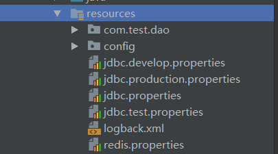
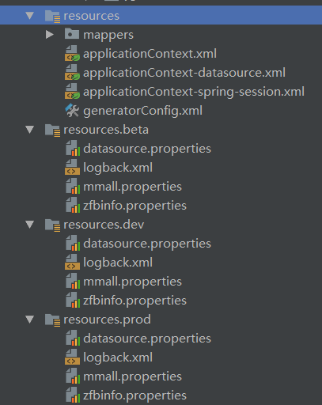

# Maven #

* [1、Maven简介](#1、Maven简介)
* [2、Maven下载安装](#2、Maven下载安装)
* [3、安装的Maven插件](#3、安装的Maven插件)
* [4、Maven的常用命令](#4、Maven的常用命令)
* [5、Maven的标准工程结构](#5、Maven的标准工程结构)
* [6、仓库配置](#6、仓库配置)
* [7、在Maven中添加外部依赖jar包](#7、在Maven中添加外部依赖jar包)
* [8、使用Maven插件(Plugin)](#8、使用Maven插件(Plugin))
* [9、maven生命周期](#9、maven生命周期)
* [10、maven环境隔离](#10、maven环境隔离)

     
- Maven 官网：http://maven.apache.org/
	

### 1、Maven简介 ###

	Maven项目对象模型(POM)，可以通过一小段描述信息来管理项目的构建，报告和文档的软件项目管理工具。
	Maven是一个项目管理工具，它包含了一个项目对象模型 (Project Object Model)，
	一组标准集合，一个项目生命周期(Project Lifecycle)，一个依赖管理系统(Dependency Management System)，
	和用来运行定义在生命周期阶段(phase)中插件(plugin)目标(goal)的逻辑。
	当你使用Maven的时候，你用一个明确定义的项目对象模型来描述你的项目，然后Maven可以应用横切的逻辑，这些逻辑来自一组共享的（或者自定义的）插件。
	

### 2、Maven下载安装 ###

	下载 apache-maven-3.5.2
	window安装：将该下载文件的bin目录【G:\Java\apache-maven-3.5.2\bin】添加到环境变量Path
	配置maven环境变量
		系统变量：MAVEN_HOME = G:\Java\apache-maven-3.5.2
		用户变量：path = %MAVEN_HOME%\bin
		
	在CMD 中输入 mvn -v

	C:\Users\hdc>mvn -v
	Apache Maven 3.5.0 (ff8f5e7444045639af65f6095c62210b5713f426; 2017-04-04T03:39:06+08:00)
	Maven home: G:\Java\apache-maven-3.5.0\bin\..
	Java version: 1.8.0_131, vendor: Oracle Corporation
	Java home: D:\Program Files\Java\jdk1.8.0_131\jre
	Default locale: zh_CN, platform encoding: GBK
	OS name: "windows 10", version: "10.0", arch: "amd64", family: "windows"

	即安装成功。

### 3、安装的Maven插件 ###

> MyEclipse中安装的Maven插件

	为了使得MyEclipse中安装的Maven插件，同windows中安装的那个相同，
	需要让MyEclipse中的maven重新定位一下，点击Window -> Preference -> Maven -> Installations -> Add进行设置。
	Ctrl+N->输入maven->选择maven project->next->next->目录选择"maven-archetype-webapp"--> next输入项目信息-->finish就可以新建一个maven项目了。
	
	右键工程--> Properties --> Java Build Path -->Libraries -->Add Library --> MyEclipse Server Library 
	--> Tomcat v8.0【选择自己安装的Tomcat】 --> Finish
	--> Add Library --> JRE System Library--> 选择自己的jdk --Finish
	--> Order and Export --> 将Tomcat和上面选的JDK、maven依赖勾上 --> OK
	
	这样一下目录就会创建好了，pom.xml的错误也消失了
	src/main/java   src/test/java      

> Intelij IDEA中安装的Maven插件

	Intelij IDEA 创建Maven的Web项目：
		默认只有src/main/resource, 需要创建正式的Java类目录 src/main/java ，
		创建后需要标记为源码根路径【文件右键 --> Mark Directory as --> Sources Root】
		src/test/java 创建后需要标记为测试源码根路径。
						
	【注意】如果是第一次创建maven项目，maven会自动下载所需jar包到本地仓库，所以需要等待一段时间。

	archetypeCatalog表示插件使用的archetype元数据，不加这个参数时默认为remote，local，即中央仓库archetype元数据，由于中央仓库的archetype太多了，所以导致很慢，指定internal来表示仅使用内部元数据。

> 创建Maven 工程时

	Add Maven Property
	archetypeCatalog = internal

	maven构建慢的话
	直接修改maven配置参数，在使用mvn archetype:generate命令时，加上-DarchetypeCatalog=local

### 4、Maven的常用命令 ###

> Maven常用命令： 
	
	1. 创建Maven的普通java项目： 
		mvn archetype:create -DgroupId=packageName -DartifactId=projectName 
		
	2. 创建Maven的Web项目： 
		mvn archetype:create -DgroupId=packageName -DartifactId=webappName-DarchetypeArtifactId=maven-archetype-webapp 
		
	3. 编译源代码： 		mvn compile 
	4. 编译测试代码：		mvn test-compile 
	5. 运行测试：		mvn test 
	6. 产生site：		mvn site 
	7. 打包：			mvn package -P <环境>
	8. 在本地Repository中安装jar：	mvn install 
	9. 清除产生的项目：				mvn clean 
	10. 生成eclipse项目：			mvn eclipse:eclipse 
	11. 生成idea项目：				mvn idea:idea 
	12. 组合使用goal命令，如只打包不测试：mvn -Dtest package 
	13. 编译测试的内容：		mvn test-compile 
	14. 只打jar包: 			mvn jar:jar 
	15. 只测试而不编译，也不测试编译：mvn test -skipping compile -skipping test-compile 
	( -skipping 的灵活运用，当然也可以用于其他组合命令) 

### 5、Maven的标准工程结构 ###

> 如下：

	|-- pom.xml(maven的核心配置文件) 【项目对象管理】
	
	|-- src
	
		|-- main
	
		|   `-- java(java源代码目录)
	
		|   `-- resources(资源文件目录)【即存放以前放在src下的资源】
	
		|-- test
	
				`-- java(单元测试代码目录)
	
	|-- target(输出目录，所有的输出物都存放在这个目录下)
	
	    |--classes(编译后的class文件存放处)
	
	
	使用Maven构建的普通Java项目，对源代码、单元测试代码、资源乃至后续需要的文件都有专门的目录规划

> Maven的版本规范  
> maven使用如下几个要素来唯一定位某一个输出物：
	
	groudId	
		团体、组织的标识符。团体标识的约定是，它以创建这个项目的组织名称的逆向域名(reverse domain name)开头。一般对应着JAVA的包的结构。例如org.apache
	
	artifactId 
		单独项目的唯一标识符。比如我们的tomcat, commons等。不要在artifactId中包含点号(.)。
	
	version 
		一个项目的特定版本。
	
	packaging 
		项目的类型，默认是jar，描述了项目打包后的输出。
		类型为jar的项目产生一个JAR文件，类型为war的项目产生一个web应用。

	maven有自己的版本规范，一般是如下定义 <major version>.<minor version>.<incremental version>-<qualifier> ，比如1.2.3-beta-01。
	要说明的是，maven自己判断版本的算法是major,minor,incremental部分用数字比较，qualifier部分用字符串比较，所以要小心 alpha-2和alpha-15的比较关系，最好用 alpha-02的格式。

> maven在版本管理时候可以使用几个特殊的字符串 SNAPSHOT，LATEST，RELEASE。比如"1.0-SNAPSHOT"。各个部分的含义和处理逻辑如下说明：

	SNAPSHOT
		这个版本一般用于开发过程中，表示不稳定的版本。
	
	LATEST
		指某个特定构件的最新发布，这个发布可能是一个发布版，也可能是一个snapshot版，具体看哪个时间最后。
	
	RELEASE
		指最后一个发布版。
		

### 6、仓库配置 ###

> 本地仓库配置

	从中央仓库下载的jar包，都会统一存放到本地仓库中。我们需要配置本地仓库的位置。
	打开maven安装目录，打开conf目录下的setting.xml文件。
	<localRepository>G:\Java\Maven\repository</localRepository>
	
> 中央仓库：http://repo1.maven.org/maven2/ ， http://mvnrepository.com/ 

	<!-- 中央仓库1 -->
	<mirror>
		<id>repo1</id>
		<mirrorOf>central</mirrorOf>
		<name>Human Readable Name for this Mirror.</name>
		<url>http://repo1.maven.org/maven2/</url>
	</mirror>
		
> 国内中央仓库：

	//国内阿里云提供的镜像
	<mirrors>
	    <mirror>
	      <id>alimaven</id>
	      <name>aliyun maven</name>
	      <url>http://maven.aliyun.com/nexus/content/groups/public/</url>
	      <mirrorOf>central</mirrorOf>        //
	    </mirror>
	  </mirrors>
	
	  <mirror>
	
	//其他
	<mirror>  
	  <id>net-cn</id>  
	  <mirrorOf>central</mirrorOf>  
	  <name>Human Readable Name for this Mirror.</name>  
	  <url>http://maven.net.cn/content/groups/public/</url>   
	</mirror>  
	
	mirrorOf：被镜像的服务器的id。
	例如，如果我们要设置了一个Maven中央仓库（http:// repo1.maven.org/maven2）的镜像，就需要将该元素设置成central。
	这必须和 中央仓库的id central完全一致。

	【注意】 <mirrorOf>*</mirrorOf>  //使用通配符就可以不限定镜像

### 7、在Maven中添加外部依赖jar包 ###

> 配置pom.xml

	<dependency>
	    <groupId>mysql</groupId>
	    <artifactId>mysql-connector-java</artifactId>
	    <version>6.0.6</version>
	</dependency>
	<dependency>  
	    <groupId>org.springframework</groupId>  
	    <artifactId>spring-webmvc</artifactId>  
	    <version>4.1.4.RELEASE</version>  
	</dependency>  
	<dependency>  
	    <groupId>javax.servlet</groupId>  
	    <artifactId>jstl</artifactId>  
	    <version>1.2</version>  
	</dependency>  
	    <dependency>  
	    <groupId>taglibs</groupId>  
	    <artifactId>standard</artifactId>  
	    <version>1.1.2</version>  
	</dependency> 
	
	保存后maven会把该jar包下载到本地仓库。
	即只需要在pom.xml文件中添加所需的jar包，不用再在lib下放入jar包。
	
> dependency标签最常用的四个属性标签：

	groupId：	项目组织唯一的标识符，实际对应JAVA的包的结构。

	artifactId：	项目唯一的标识符，实际对应项目的名称，就是项目根目录的名称。

	version：	jar包的版本号。可以直接填版本数字，也可以在properties标签中设置属性值。
	
	scope：		jar包的作用范围。可以填写compile【默认】、runtime、test、system和provided。
				用来在编译、测试等场景下选择对应的classpath。
	
	optional:	设置依赖是否可选
	
	exclusions:	排除传递的依赖

> 寻找jar包

	可以在http://mvnrepository.com/站点搜寻你想要的jar包版本

	例如，想要使用log4j，可以找到需要的版本号，然后拷贝对应的maven标签信息，将其添加到pom.xml文件中。
	
	maven首先在本地仓库中查找，没有的话再去中央仓库查找，再没有就会报错。

### 8、使用Maven插件(Plugin) ###

> 要添加Maven插件，可以在pom.xml文件中添加<plugin>标签

	<build>
	  <plugins>
	    <plugin>
	      <groupId>org.apache.maven.plugins</groupId>
	      <artifactId>maven-compiler-plugin</artifactId>
	      <version>3.3</version>
	      <configuration>
	        <source>1.8</source>
	        <target>1.8</target>
	      </configuration>
	    </plugin>
	  </plugins>
	</build>

	<configuration>标签用来配置插件的一些使用参数。

> 使用maven profile实现多环境可移植构建

	在开发过程中，我们的软件会面对不同的运行环境，比如开发环境、测试环境、生产环境,不同的环境表示配置文件的不同。
	使用maven来实现多环境的构建可移植性，需要借助maven提供的profile功能，通过不同的环境激活不同的profile来达到构建的可移植性。

	1. 首先是profile配置，在pom.xml中添加如下profile的配置：
		<profiles>
	        <profile>
	            <id>develop</id>
	            <activation>
	                <activeByDefault>true</activeByDefault>
	            </activation>
	            <properties>
	                <env>develop</env>
	            </properties>
	        </profile>
	        <profile>
	            <id>test</id>
	            <properties>
	                <env>test</env>
	            </properties>
	        </profile>
	        <profile>
	            <id>production</id>
	            <properties>
	                <env>production</env>
	            </properties>
	        </profile>
	    </profiles>

	这里定义了三个环境，分别是development（开发环境）、test（测试环境）、production（生产环境），其中开发环境是默认激活的【activeByDefault为true】，这样如果在不指定profile时默认是开发环境。
	定义属性 env 指定环境变量。

	2. 配置文件

		针对不同的环境，我们定义不同的配置文件，而这些配置文件都做为资源文件放到maven工程的resources目录下，即src/main/resources目录下。
		开发环境、测试环境、生产环境的配置文件分别对应src/main/resources目录下的develop、test、production属性文件。

	3. maven资源插件配置
		在pom中的build节点下，配置资源文件的位置:

		<finalName>${project.artifactId}</finalName>
	    <defaultGoal>compile</defaultGoal>
	    <resources>
	        <resource>
	            <directory>src/main/resources</directory>
	            <filtering>false</filtering>
	            <excludes>

					<!-- 资源根目录排除各环境的配置 -->
	                <exclude>**/*.production.*</exclude>
	                <exclude>**/*.develop.*</exclude>
	                <exclude>**/*.test.*</exclude>
	            </excludes>
	        </resource>
	    </resources>
	    <plugins>

		<!--该插件提供从Maven内运行Ant任务的功能。同一个文件，根据不同的环境，打包不同的配置文件-->
		<plugin>
            <groupId>org.apache.maven.plugins</groupId>
            <artifactId>maven-antrun-plugin</artifactId>
            <version>1.7</version>
            <executions>
                <execution>
                    <id>develop,test</id>
					<!-- 设定该ant任务的生命周期 -->
                    <phase>process-resources</phase>
                    <goals>
                        <goal>run</goal>
                    </goals>
                    <configuration>
						 <!-- 将任务Ant任务放在这里 -->
                        <target>
                            <delete file="${project.build.outputDirectory}/jdbc.properties"/>
                            <copy file="src/main/resources/jdbc.${env}.properties"
                                  tofile="${project.build.outputDirectory}/jdbc.properties"/>
                        </target>
                    </configuration>
                </execution>
            </executions>
        </plugin>

	<phase>process-resources</phase> 表示插件要在Maven 的 process-resources 时执行
	<goal>run</goal> 这时插件内部的一个执行目标
	<target>...</target> 之间可以写任何Ant支持的task

> war打包插件

    <plugin>
        <groupId>org.apache.maven.plugins</groupId>
        <artifactId>maven-war-plugin</artifactId>
        <version>2.6</version>
        <configuration>
            <warName>${project.artifactId}</warName>
            <webResources>
                <resource>
                    <directory>${basedir}/src/main/webapp/WEB-INF</directory>
                    <filtering>true</filtering>
                    <targetPath>WEB-INF</targetPath>
                    <includes>
                        <include>**/web.xml</include>
                    </includes>
                </resource>
            </webResources>
        </configuration>
    </plugin>

	【说明】 
	warName ：指定了打好包的名字； 
	webResources 下 resource 下 directory ：配置真正使用的资源文件存放的位置，通常这个位置不是一个标准 Web 项目应该存放资源文件的位置； 
	webResources 下 resource 下 targetPath：将上一步 directory 中配置的文件目录下的文件都拷贝到这个目录下；
	webResources 下 resource 下 filtering：开启打包之前将 directory 下的文件拷贝（覆盖）到 targetPath 下这种配置。

> 例子

	<properties>
	    <project.build.sourceEncoding>UTF-8</project.build.sourceEncoding>
	    <maven.compiler.source>1.7</maven.compiler.source>
	    <maven.compiler.target>1.7</maven.compiler.target>
		<project.build.sourceVersion>1.8</project.build.sourceVersion>
	    <project.build.targetVersion>1.8</project.build.targetVersion>
	    <project.build.sourceEncoding>UTF-8</project.build.sourceEncoding>
	</properties>

	<build>
	    <finalName>${project.artifactId}</finalName>
	    <defaultGoal>compile</defaultGoal>
	    <resources>
	        <resource>
	            <directory>src/main/resources</directory>
	            <filtering>false</filtering>
	            <excludes>
	                <exclude>**/*.production.*</exclude>
	                <exclude>**/*.develop.*</exclude>
	                <exclude>**/*.test.*</exclude>
	            </excludes>
	        </resource>
	    </resources>
	    <plugins>
	        <!-- compiler插件, 设定JDK版本、文件编码 -->
	        <plugin>
	            <groupId>org.apache.maven.plugins</groupId>
	            <artifactId>maven-compiler-plugin</artifactId>
	            <version>3.3</version>
	            <configuration>
	                <source>${project.build.sourceVersion}</source>
	                <target>${project.build.targetVersion}</target>
	                <encoding>${project.build.sourceEncoding}</encoding>
	                <showWarnings>true</showWarnings>
	            </configuration>
	        </plugin>
	
	        <!-- war打包插件, 设定war包名称不带版本号 -->
	        <plugin>
	            <groupId>org.apache.maven.plugins</groupId>
	            <artifactId>maven-war-plugin</artifactId>
	            <version>2.6</version>
	            <configuration>
	                <warName>${project.artifactId}</warName>
	                <webResources>
	                    <resource>
	                        <directory>${basedir}/src/main/webapp/WEB-INF</directory>
	                        <filtering>true</filtering>
	                        <targetPath>WEB-INF</targetPath>
	                        <includes>
	                            <include>**/web.xml</include>
	                        </includes>
	                    </resource>
	                </webResources>
	            </configuration>
	        </plugin>
	        <plugin>
	            <groupId>org.apache.maven.plugins</groupId>
	            <artifactId>maven-antrun-plugin</artifactId>
	            <version>1.7</version>
	            <executions>
	                <execution>
	                    <id>develop,test</id>
	                    <phase>process-resources</phase>
	                    <goals>
	                        <goal>run</goal>
	                    </goals>
	                    <configuration>
	                        <target>
	                            <delete file="${project.build.outputDirectory}/jdbc.properties"/>
	                            <copy file="src/main/resources/jdbc.${env}.properties"
	                                  tofile="${project.build.outputDirectory}/jdbc.properties"/>
	                        </target>
	                    </configuration>
	                </execution>
	            </executions>
	        </plugin>
	
	        <!-- 解决资源文件的编码问题 -->
	        <plugin>
	            <groupId>org.apache.maven.plugins</groupId>
	            <artifactId>maven-resources-plugin</artifactId>
	            <version>2.7</version>
	            <configuration>
	                <encoding>${project.build.sourceEncoding}</encoding>
	            </configuration>
	        </plugin>
	
	        <!-- install插件 -->
	        <plugin>
	            <groupId>org.apache.maven.plugins</groupId>
	            <artifactId>maven-install-plugin</artifactId>
	            <version>2.5.2</version>
	        </plugin>
	
	        <!-- clean插件 -->
	        <plugin>
	            <groupId>org.apache.maven.plugins</groupId>
	            <artifactId>maven-clean-plugin</artifactId>
	            <version>2.6.1</version>
	        </plugin>
	
	        <plugin>
	            <groupId>org.apache.maven.plugins</groupId>
	            <artifactId>maven-surefire-plugin</artifactId>
	            <version>2.19.1</version>
	            <configuration>
	                <skipTests>true</skipTests>
	            </configuration>
	        </plugin>
	
	    </plugins>
	</build>

### 9、maven 生命周期 ###
	
> 一个完整的项目构建过程：
		
	清理、编译、测试、打包、集成测试、验证、部署

> maven生命周期有3种：

	1. clean :清理项目,在进行真正的构建之前进行一些清理工作，包含三个阶段：
		  1）pre-clean 	执行一些清理前需要完成的工作
		  2）clean 		清理上一次构建生成的文件
		  3）post-clean 	执行一些清理后需要完成的工作
		
	
	2. default:构建项目(最核心),执行编译，测试，打包，部署等真正构建时所需要执行的所有步骤
	
	3. site	:生成项目报告，站点，发布站点。该生命周期包含如下阶段：
		  1）pre-site 		执行一些在生成项目站点之前需要完成的工作
		  2）site 			生成项目站点文档
		  3）post-site 		执行一些在生成项目站点之后需要完成的工作
		  4）site-deploy 	将生成的项目站点发布到服务器上
			  
	用户在mvn命令后可以指定三个生命周期中的任何阶段，则Maven会按以下逻辑执行：
	首先会得到该阶段所属生命周期，从该生命周期中的第一个阶段开始按顺序执行，直至该阶段本身。
	例如执行mvn clean命令会依次执行clean生命周期中的pre-clean阶段及clean阶段。
			  
> pom.xml

	<properties>
		<project.build.sourceEncoding>UTF-8</project.build.sourceEncoding>
		<maven.compiler.source>1.7</maven.compiler.source>
		<maven.compiler.target>1.7</maven.compiler.target>
		<spring.version>4.3.11.RELEASE</spring.version>
	</properties>
	
	<dependencies>
		<dependency>
		  <groupId>junit</groupId>
		  <artifactId>junit</artifactId>
		  <version>4.12</version>
		  <scope>test</scope>
		</dependency>
	
		<!--spring-->
		<dependency>
		  <groupId>org.springframework</groupId>
		  <artifactId>spring-beans</artifactId>
		  <version>${spring.version}</version>
		</dependency>
		<dependency>
		  <groupId>org.springframework</groupId>
		  <artifactId>spring-context</artifactId>
		  <version>${spring.version}</version>
		</dependency>
		<dependency>
		  <groupId>org.springframework</groupId>
		  <artifactId>spring-core</artifactId>
		  <version>${spring.version}</version>
			<exclusions>
                <exclusion>
                    <groupId>commons-logging</groupId>
                    <artifactId>commons-logging</artifactId>
                </exclusion>
            </exclusions>
		</dependency>
		<dependency>
		  <groupId>org.springframework</groupId>
		  <artifactId>spring-expression</artifactId>
		  <version>${spring.version}</version>
		</dependency>
		<dependency>
		  <groupId>org.springframework</groupId>
		  <artifactId>spring-jdbc</artifactId>
		  <version>${spring.version}</version>
		</dependency>
		<dependency>
		  <groupId>org.springframework</groupId>
		  <artifactId>spring-web</artifactId>
		  <version>${spring.version}</version>
		</dependency>
		<dependency>
		  <groupId>org.springframework</groupId>
		  <artifactId>spring-test</artifactId>
		  <version>${spring.version}</version>
		</dependency>
		<dependency>
		  <groupId>org.springframework</groupId>
		  <artifactId>spring-webmvc</artifactId>
		  <version>${spring.version}</version>
		</dependency>
		
		<!--mybatis-->
		<dependency>
		  <groupId>org.mybatis</groupId>
		  <artifactId>mybatis</artifactId>
		  <version>3.4.2</version>
		</dependency>
		<dependency>
		  <groupId>org.mybatis</groupId>
		  <artifactId>mybatis-spring</artifactId>
		  <version>1.3.0</version>
		</dependency>
		<!-- dbcp 数据库连接池-->
		<dependency>
		  <groupId>commons-dbcp</groupId>
		  <artifactId>commons-dbcp</artifactId>
		  <version>1.4</version>
		</dependency>
		<dependency>
		  <groupId>mysql</groupId>
		  <artifactId>mysql-connector-java</artifactId>
		  <version>5.1.38</version>
		</dependency>
		<!--redis-->
		<dependency>
		  <groupId>org.springframework.data</groupId>
		  <artifactId>spring-data-redis</artifactId>
		  <version>1.8.6.RELEASE</version>
		</dependency>
		<dependency>
		  <groupId>redis.clients</groupId>
		  <artifactId>jedis</artifactId>
		  <version>2.9.0</version>
		</dependency>
		
		<!--日志-->
		<dependency>
		  <groupId>org.slf4j</groupId>
		  <artifactId>slf4j-api</artifactId>
		  <version>1.7.25</version>
		</dependency>
		<dependency>
		  <groupId>ch.qos.logback</groupId>
		  <artifactId>logback-core</artifactId>
		  <version>1.2.3</version>
		</dependency>
		<dependency>
		  <groupId>ch.qos.logback</groupId>
		  <artifactId>logback-classic</artifactId>
		  <version>1.2.3</version>
		  <scope>test</scope>
		</dependency>
		
		<dependency>
		  <groupId>javax.servlet</groupId>
		  <artifactId>javax.servlet-api</artifactId>
		  <version>3.0.1</version>
		  <scope>provided</scope>
		</dependency>
		<dependency>
		  <groupId>javax.servlet.jsp</groupId>
		  <artifactId>jsp-api</artifactId>
		  <version>2.1</version>
		  <scope>provided</scope>
		</dependency>
		<dependency>
		  <groupId>jstl</groupId>
		  <artifactId>jstl</artifactId>
		  <version>1.2</version>
		</dependency>
		
		<dependency>
		  <groupId>com.alibaba</groupId>
		  <artifactId>fastjson</artifactId>
		  <version>1.2.7</version>
		</dependency>
		
		<dependency>
		  <groupId>org.apache.commons</groupId>
		  <artifactId>commons-lang3</artifactId>
		  <version>3.4</version>
		</dependency>

	  </dependencies>  			  
			  

### 10、maven环境隔离 ###

> 项目环境

	本地开发环境		local
	开发环境			develop
	测试环境			beta
	线上环境			production

	根据环境进行分别打包部署

> 环境隔离配置  

> pom.xml中添加 build 节点

	<resources>
      <resource>
        <directory>src/main/resources.${deploy.type}</directory>
        <excludes>
          <exclude>*.jsp</exclude>
        </excludes>
      </resource>
      <resource>
		<!--环境公共资源地址-->
        <directory>src/main/resources</directory>
      </resource>
    </resources>

	【注】 deploy.type即profile 节点的 properties的子节点名

> pom.xml中添加 prfiles 节点

	<profiles>
		<profile>
		  <id>dev</id>
		  <activation>
		    <activeByDefault>true</activeByDefault>
		  </activation>
		  <properties>
		    <deploy.type>dev</deploy.type>
		  </properties>
		</profile>
		<profile>
		  <id>beta</id>
		  <properties>
		    <deploy.type>beta</deploy.type>
		  </properties>
		</profile>
		<profile>
		  <id>prod</id>
		  <properties>
		    <deploy.type>prod</deploy.type>
		  </properties>
		</profile>
	</profiles>

	【注】 
	deploy.type 为自定义节点，和build 节点的变量名相对应。
	activeByDefault 表示没有指定环境时的默认环境

> 配置文件

	针对不同的环境，我们定义不同的配置文件，而这些配置文件都做为资源文件放到maven工程的resources目录下。
	
	1. 公共资源文件放在 src/main/resources目录下。
	2. 开发环境、测试环境、生产环境的配置文件分别对应src/main/resources目录下的 develop、beta、production 属性目录下。
		1. 一般是涉及服务器地址及账号等信息

> 打包时在 maven projects中选择 profiles下的环境进行区分打包

