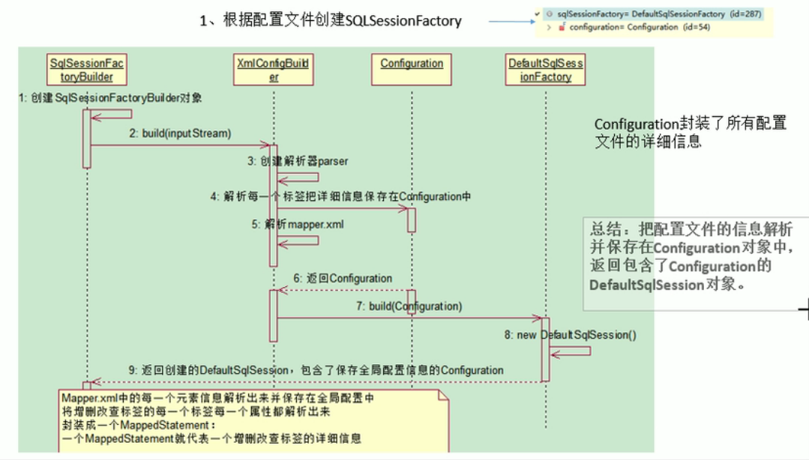
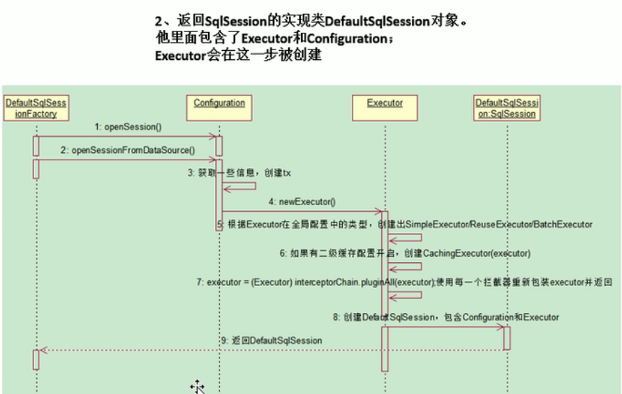
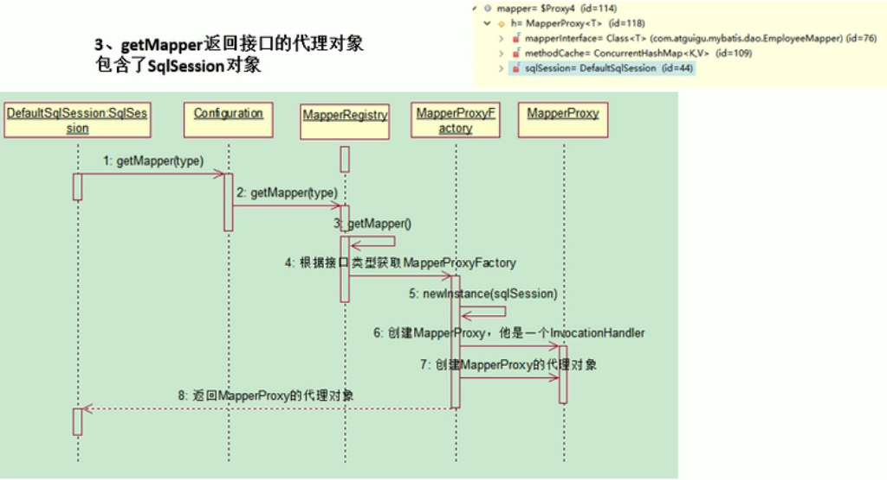
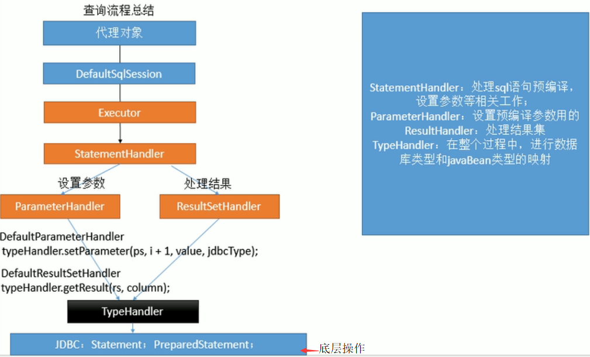
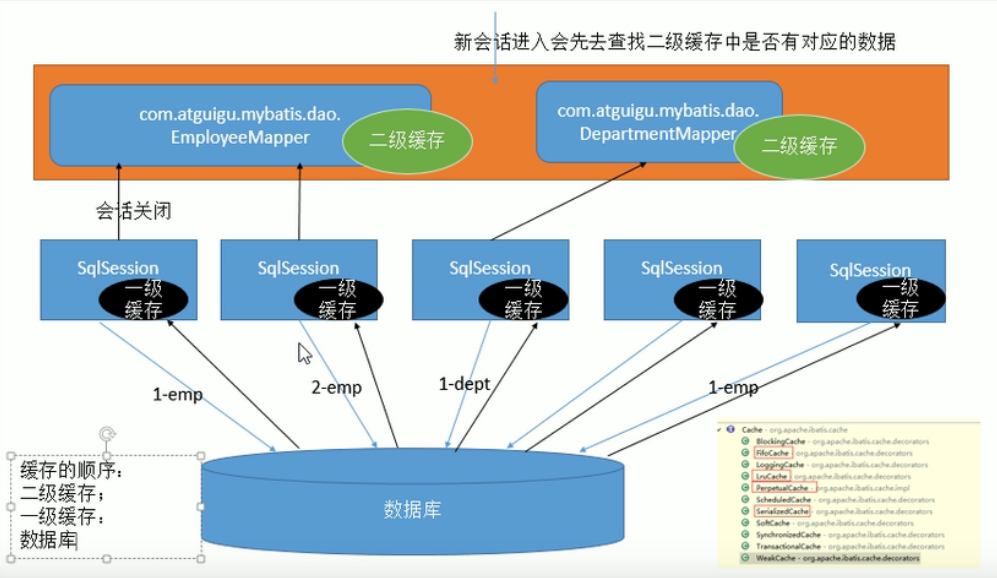

# Mybatis #

* [1、Mybatis简介](#1、Mybatis简介)
* [2、Mybatis开发步骤与流程](#2、Mybatis开发步骤与流程)
* [3、MyBatis核心部件与插件](#3、MyBatis核心部件与插件)
* [4、配置文件的配置项](#4、配置文件的配置项)
* [5、Mybatis使用](#5、Mybatis使用)
* [6、Mybatis请求参数和返回值类型处理](#6、Mybatis请求参数和返回值类型处理)           
* [7、Mybatis三剑客](#7、Mybatis三剑客)
* [8、关联表查询](#8、关联表查询)
* [9、Mybatis缓存](#9、Mybatis缓存)
* [10、动态sql标签](#10、动态sql标签)
* [11、Mybatis整合Spring](#11、Mybatis整合Spring)
* [12、数据库连接池C3P0和DBCP](#12、数据库连接池C3P0和DBCP)

### 1、Mybatis简介 ###

- Mybatis 前身是ibatis。
- 是一个半自动ORM框架【Object Relational Mapping，对象关系映射框架】，是一个支持普通SQL查询，存储过程和高级映射的优秀持久层框架。
- Mybatis这个框架的核心价值：**根据用户提供的查询参数对象，动态执行SQL语句，并将结果封装为Java对象**。
- 将对象模型中的数据映射到关系模型中。
- Mybatis 中的SQL语句和java编码分离，做到业务和数据分离，将SQL的编写优化交给xml配置【由开发人员控制】，所以是半自动的ORM。
- MyBatis可以使用简单的XML或注解用于配置和原始映射，将接口和Java的POJO（普通的Java对象）映射成数据库中的记录，这样就可以通过操作接口、POJO来操作数据库的记录。
- [mybatis3 官方文档](http://www.mybatis.org/mybatis-3/zh/configuration.html)

### 2、Mybatis开发步骤与流程 ###

#### 2.1、具体开发步骤  ####

	1. 引入jar包
	2. 在src下创建Mybatis 配置文件 Mybatis-config.xml【名字任意取】;  
	3. 在数据库中建库建表;  
	4. 建立与数据库中表的映射文件，POJO类;  
	5. 创建操作表的sql映射文件 XxxMapper.xml 【重点】;
	6. 创建mybatis 的通用类【作用：加载配置文件 conf.xml，提供 SqlSessionFactory 及 SqlSession 对象】；
	7. 编写测试类【或者使用Dao接口】，执行CRUD 操作。
	
> 配置文件 Mybatis-config.xml 作用：
	
	配置数据库连接信息，注册sql映射文件或映射接口。

> XxxMapper.xml  作用：

	作用：定义对数据库的操作。
	在MyBatis中，XxxMapper.xml 中的 namespace 用于绑定Dao接口的，即面向接口编程。
	好处在于当使用了namespace之后就可以不用写Dao接口实现类，业务逻辑会直接通过这个绑定寻找到相对应的SQL语句进行对应的数据处理。

	使用 [namespace].[id] 的方式指定使用哪条SQL标签语句，id为SQL标签语句的id。
	如果 xml 文件中需要不能识别的特殊字符，可以使用  <![CDATA[特殊字符]]>包裹起来，这样xml就不会解析被包裹的字符，比如：<![CDATA[<=]]。

	选项：
		<mapper namespace=" ">	为这个mapper指定一个唯一的namespace,值为Dao接口。
		select、insert、delete、update标签：

		在标签中编写需要执行的SQL语句，属性id值必须是唯一的，
		parameterType属性 指明执行时使用的参数类型，
		resultType属性 指明查询返回的结果集类型，
		'#{...}' 中的属性 为POJO的属性，不是字段名。

> Dao接口的工作原理：

	Mybatis 运行时会使用JDK动态代理为Dao接口生成代理对象，代理对象【MapperProxy】 会拦截接口方法，由于Dao接口方法和 Mapper 的id是绑定在一起的，所以可以根据接口方法获取Mapper中的方法，从而执行 MappedStatement 对象【mapper的sql标签】，最后将执行的结果返回。

> '#{}'和'${}'的区别是什么？
	
	'#{}','${}' 都可以获取map 中的值或者POJO 对象属性的值；

	'#{}'是经过预编译的，是安全的，可防止SQL注入；将参数按序设置到SQL语句中；

	'#{}' 是sql的参数占位符，预编译时 Mybatis会先将sql中的 #{} 替换为 ? ，在sql执行前会使用 PreparedStatement 的参数设置方法，按序给sql的 ? 占位符设置参数值。比如ps.setInt(0, parameterValue)，#{item.name} 的取值方式为使用反射从参数对象中获取 item对象的name属性值，相当于 param.getItem().getName()。

	${}是未经过预编译的，仅仅是取变量的值，是非安全的，存在SQL注入。取出的值直接拼装在SQL语句中；

	${}是Properties文件中的变量占位符，它可以用于标签属性值和sql内部，属于静态文本替换，比如${driver}会被静态替换为com.mysql.jdbc.Driver。

> 2.2、执行流程：

	1、创建 sqlSessionFactory 对象  
		SqlSessionFactory ssf=new SqlSessionFactoryBuilder().build(Resources.getResourceAsStream("mybatis-config.xml"));
	
		使用了建造者模式(Builder)

	2、通过 sqlSessionFactory 对象 解析配置文件 获取 sqlSession 对象
		SqlSession sqlSession=ssf.openSession();

    
	3、通过 sqlSession 对象 为 Mapper接口生成代理对象（MapperProxy）

		该代理对象中包含了 DefaultSqlSession 中的 Executor ;
    	UsersMapper mapper = sqlSession.getMapper(UsersMapper.class);

		getMapper 使用 MapperProxyFactory 创建一个 MapperProxy 的代理对象；
		MapperProxy<T> mapperProxy = mapperProxyFactory.newInstance(sqlSession);

    		
	4、通过代理对象执行CRUD 操作。

> 2.3、流程总结：

	1. 根据配置文件（全局配置、sql 映射）创建 SqlSessionFactory对象，通过该对象解析了 xml 配置文件后返回一个 DefaultSqlSession 对象【包含了保存配置文件的 Configuration 对象，该对象封装了所有配置文件的消息信息】；
		使用了工厂模式

	2. DefaultSqlSession 对象是 SqlSession 的实现类，该对象包含 Configuration 以及 Executor【根据全局配置文件中的 defaultExecutorType 创建出对应的 Executor 】，SqlSession 将对	SQL 的处理委托给了 Executor ，它才是真正的处理SQL 语句的对象；
		使用了委托模式

	3. DefaultSqlSession.getMapper() : 获取 Mapper 接口对应的 代理对象【MapperProxy】，MapperProxy 里面包含了 DefaultSqlSession ；
		使用了代理模式

	4. 执行 CRUD 方法：

		4.1. DefaultSqlSession根据 id 在 Configuration 中找到 MappedStatement对象【要执行的语句】
			MappedStatement ms = configuration.getMappedStatement(id);

		4.2. Executor调用 MappedStatement对象的 getBoundSql得到可执行的sql和参数列表；

		4.3. StatementHandler 根据SQL生成一个Statement 对象【预编译参数】；

		4.4. ParameterHandler为 Statement 设置相应的参数；
 
		4.5. Executor执行sql语句；

		4.6. 如果是更新(update/insert/delete)语句，sql的执行工作得此结束。

		4.7. 如果是查询语句，ResultSetHandler再根据执行结果生成 ResultMap 相应的对象返回。

### 3、MyBatis主要的核心部件与插件 ###

> 核心部件有以下几个：

	1. Configuration【抽象类】：MyBatis所有的配置信息都保存在Configuration对象之中，配置文件中的大部分配置都会存储到该类中。

	2. SqlSession【接口】：作为MyBatis工作的主要顶层API，表示和数据库交互时的会话。
			通过这个接口来执行命令，获取映射器和管理事务【真正的执行者是 Executor】。

	3. Executor【接口】：MyBatis执行器，是MyBatis 调度的核心，负责SQL语句的执行和查询缓存的维护。

			public interface Executor {
			
			    void execute(Runnable command);
			}

	4. StatementHandler【接口】：根据SQL语句封装了JDBC Statement操作，负责对JDBC statement 的操作，如预编译参数以及设置参数值等。JDBC: Java DataBase Connectivity,java数据库连接。
			
			public interface StatementHandler {
			    Statement prepare(Connection var1) throws SQLException;
			
			    void parameterize(Statement var1) throws SQLException;
			
			    void batch(Statement var1) throws SQLException;
			
			    int update(Statement var1) throws SQLException;
			
			    <E> List<E> query(Statement var1, ResultHandler var2) throws SQLException;
			
			    BoundSql getBoundSql();
			
			    ParameterHandler getParameterHandler();
			}

	5. ParameterHandler【接口】：负责将用户传递的参数【POJO】转换成JDBC Statement 所对应的数据类型。

			public interface ParameterHandler {
			    Object getParameterObject();
			
			    void setParameters(PreparedStatement var1) throws SQLException;
			}

	6. ResultSetHandler【接口】：负责将JDBC返回的 ResultSet 结果集对象转换成 List 类型的集合。
						
			public interface ResultSetHandler {
			    <E> List<E> handleResultSets(Statement var1) throws SQLException;
			
			    void handleOutputParameters(CallableStatement var1) throws SQLException;
			}

	7. TypeHandler 【接口】：负责JAVA数据类型和JDBC数据类型(也可以说是数据表列类型)之间的映射和转换。
	
			public interface TypeHandler<T> {

			  void setParameter(PreparedStatement ps, int i, T parameter, JdbcType jdbcType) throws SQLException;
			
			  T getResult(ResultSet rs, String columnName) throws SQLException;
			
			  T getResult(ResultSet rs, int columnIndex) throws SQLException;
			
			  T getResult(CallableStatement cs, int columnIndex) throws SQLException;
			
			}

	8. MappedStatement【final类】：表示 mapper.xml 文件中的一个SQL标签节点，即一个<select|update|delete|insert>标签。
		
		MappedStatement也是Mybatis一个底层封装对象，它封装了 mybatis配置信息及SQL映射信息等。
		mapper.xml文件中一个SQL标签节点对应一个 MappedStatement 对象，SQL的id即 Mapped statement的id。

		MappedStatement接受用户的查询参数对象，动态计算出要执行的SQL语句，在数据库中执行SQL语句后，再将取得的数据封装为JavaBean对象返回给用户。

		MappedStatement对象的这些功能，也体现出了Mybatis这个框架的核心价值：根据用户提供的查询参数对象，动态执行SQL语句，并将结果封装为Java对象。

		将 id 和 MappedStatement 对象映射成 map，提供 get(id) 就可以获取对应的 MappedStatement 对象。
		Map<String, MappedStatement> mappedStatements

		Executor调用 MappedStatement对象的 getBoundSql() 方法得到可执行的SQL和参数列表；

		public BoundSql getBoundSql(Object parameterObject) {
		    BoundSql boundSql = sqlSource.getBoundSql(parameterObject);
		    List<ParameterMapping> parameterMappings = boundSql.getParameterMappings();
		    if (parameterMappings == null || parameterMappings.size() <= 0) {
		      boundSql = new BoundSql(configuration, boundSql.getSql(), parameterMap.getParameterMappings(), parameterObject);
		    }
		
		    // check for nested result maps in parameter mappings (issue #30)
		    for (ParameterMapping pm : boundSql.getParameterMappings()) {
		      String rmId = pm.getResultMapId();
		      if (rmId != null) {
		        ResultMap rm = configuration.getResultMap(rmId);
		        if (rm != null) {
		          hasNestedResultMaps |= rm.hasNestedResultMaps();
		        }
		      }
		    }
		
		    return boundSql;
		  }

	9. SqlSource【接口】：
	
		表示从XML文件或注释读取的映射语句的内容。
		它负责根据用户传递的输入参数【parameterObject】，动态地创建SQL语句。
		将生成的数据封装到 BoundSql 对象中，并返回。

			public interface SqlSource {
			
			  BoundSql getBoundSql(Object parameterObject);
			
			}

	10. BoundSql【类】：表示动态获取的SQL语句以及相应的参数信息。
		
		此时的SQL可能有SQL占位符“？” 。
		参数信息：参数的有序列表映射、每个参数的附加信息。
		
		public class BoundSql {
		
		  private String sql;
		  private List<ParameterMapping> parameterMappings;
		  private Object parameterObject;
		  private Map<String, Object> additionalParameters;
		  private MetaObject metaParameters;

> SqlSessionFactory接口

	每个数据库对应一个 SqlSessionFactory 实例，SqlSessionFactory 的实例可以通过 SqlSessionFactoryBuilder 获得。
	SqlSessionFactory 的目的就是创建 SqlSession实例。

	//SqlSessionFactory 源码
	public interface SqlSessionFactory {

	  SqlSession openSession();
	
	  SqlSession openSession(boolean autoCommit);
	  SqlSession openSession(Connection connection);
	  SqlSession openSession(TransactionIsolationLevel level);
	
	  SqlSession openSession(ExecutorType execType);
	  SqlSession openSession(ExecutorType execType, boolean autoCommit);
	  SqlSession openSession(ExecutorType execType, TransactionIsolationLevel level);
	  SqlSession openSession(ExecutorType execType, Connection connection);
	
	  Configuration getConfiguration();
	
	}

	方法:
		SqlSession openSession();
			会开启一个事务(也就是不自动提交)
			连接对象会从由活动环境配置的数据源实例中得到。
			事务隔离级别将会使用驱动或数据源的默认设置。
			预处理语句不会被复用,也不会批量处理更新

		SqlSession openSession(boolean autoCommit);
			开启自动提交, “true” 传递 给可选的 autoCommit 参数

		SqlSession openSession(Connection connection);
			提供自定义的连接,传递一个 Connection 实例给 connection 参数

		SqlSession openSession(TransactionIsolationLevel level);
			MyBatis 为事务隔离级别调用使用一个 Java 枚举包装器, 称为 TransactionIsolationLevel
			JDBC 支持的 5 级 ( NONE,READ_UNCOMMITTED,READ_COMMITTED,REPEA TABLE_READ,SERIALIZA BLE)

		SqlSession openSession(ExecutorType execType,TransactionIsolationLevel level);
		SqlSession openSession(ExecutorType execType);
			ExecutorType.BATCH 即创建批量操作的SqlSession

		SqlSession openSession(ExecutorType execType, boolean autoCommit);
		SqlSession openSession(ExecutorType execType, Connection connection);
		Configuration getConfiguration();
	
> 创建 SqlSessionFactory 的实例
		
	//Mybatis 配置文件路径
	String resource = "config/Mybatis-config.xml";

	//加载成输入流
	InputStream inputStream = Resources.getResourceAsStream(resource);
	
	//创建 SqlSessionFactory
	SqlSessionFactory sqlSessionFactory = new SqlSessionFactoryBuilder().build(inputStream);
	
	//为了指定创建哪种环境，只要将它作为可选的参数传递给 SqlSessionFactoryBuilder 即可
	SqlSessionFactory factory = new SqlSessionFactoryBuilder().build(reader, environment);
	SqlSessionFactory factory = new SqlSessionFactoryBuilder().build(reader, environment,properties);
		
	//如果忽略了环境参数，那么默认环境将会被加载
	SqlSessionFactory factory = new SqlSessionFactoryBuilder().build(reader);
	SqlSessionFactory factory = new SqlSessionFactoryBuilder().build(reader,properties);

> SqlSession接口

	Sqlsession操作数据库，真正完成交互的是Executor，Sqlsession对数据库的操作都是通过Executor来完成的。

	通过SqlSessionFactory 来获得SqlSession
		SqlSession sqlSession = getSqlSessionFactory().openSession();
	
	语句执行方法
		参数可以 是原生类型(自动装箱或包装类) ，JavaBean，POJO 或 Map。

		<T> T selectOne(String statement, Object parameter)
			必须返回一个对象。 如果多余一个, 或者 没有返回 (或返回了 null) 那么就会抛出异常
		<E> List<E> selectList(String statement, Object parameter)
		<K,V> Map<K,V> selectMap(String statement, Object parameter, String mapKey)
		int insert(String statement, Object parameter)
			查看是否执行成功，返回统计数(0 或 1) 
		int update(String statement, Object parameter)
		int delete(String statement, Object parameter)
		<T> T selectOne(String statement)
		<E> List<E> selectList(String statement)
		<K,V> Map<K,V> selectMap(String statement, String mapKey)
		int insert(String statement)
		int update(String statement)
		int delete(String statement)
		查询方法的高级版本,它们允许你限制返回行数的范围,或者提供自定 义结果控制逻辑,这通常用于大量的数据集合。
		<E> List<E> selectList (String statement, Object parameter, RowBounds rowBounds)
		<K,V> Map<K,V> selectMap(String statement, Object parameter, String mapKey, RowBounds rowbounds)
		void select (String statement, Object parameter, ResultHandler handler)
		void select (String statement, Object parameter, RowBounds rowBounds, ResultHandler handler)
	
> RowBounds 
		
	RowBounds 参数告诉 MyBatis 获取指定数量的记录，还有限制返回结果的数量。
	RowBounds 类只能通过构造方法来接收 offset 和 limit，因为没有setter()方法，只有getter()方法。

		int offset = 100;
		int limit = 25;
		RowBounds rowBounds = new RowBounds(offset, limit);

> 批量立即更新方法(Flush Method)

	可以刷新（执行）存储在JDBC驱动类中的批量更新语句
	当你将 ExecutorType.BATCH 作为 ExecutorType 使用时可以采用此方法。
	List<BatchResult> flushStatements()

> 事务控制方法
		
	如果你已经选择了自动提交或你正在使用外部事务管理器，这就没有任何效果了。
	如果你正在使用 JDBC 事务管理，由 Connection 实例来控制，那么这四个方法就会派上用场。

	void commit()
	void commit(boolean force)
	void rollback()
	void rollback(boolean force)

> 清理 Session 级的缓存
		
	void clearCache()

> 关闭 SqlSession 
		
	void close()

> 使用映射器
		
	一个映射器类就是一个简单 的接口

	<T> T getMapper(Class<T> type)
	
	Configuration getConfiguration();
	Connection getConnection();

> 插件原理

	Mybatis 的插件利用的是拦截器的原理，即实现了插件的拦截器接口 Interceptors。
	在四大对象【Executor、StatementHandler、ParameterHandler、ResultSetHandler】创建的时候:

	1. 每个创建出来的对象都不是直接返回的，而是 interceptorChain.pluginAll(paramterHandler);

	2. 获取到所有的 Interceptor（拦截器），即插件需要实现的接口;
		调用 interceptor.plugin(target); 返回target 包装后的对象;

	3. 插件机制：可以使用插件为目标对象创建一个代理对象【类型AOP】
		插件可以为四大对象创建出代理对象；
		代理对象就可以拦截到四大对象的每一个执行方法。

	其中 ParameterHandler、ResultSetHandler 都需要使用 typeHandler 进行类型转换处理。

### 4、配置文件的配置项 ###
	
[更多配置项说明](http://www.mybatis.org/mybatis-3/zh/configuration.html)

	必须按照以下顺序配置，否则报错
	properties、settings、typeAliases、typeHandlers、plugins、environments、mappers

|配置选项|选项说明|
|:--|:--|
|properties | 用于配置属性信息|
|settings 	| MyBatis的全局配置|
|typeAliases | 配置类型别名，可以在xml中用别名取代全限定名|
|typeHandlers | 配置类型处理器|
|plugins 	| 配置拦截器，用于拦截sql语句的执行|
|environments | 配置数据源信息、连接池、事务属性等|
|mappers | 配置SQL映射文件|

	<settings>
		<!--指定MyBatis应该使用哪个日志记录实现 -->
		<setting name="logImpl" value="LOG4J" />

		<!--全局启用延迟加载 -->
		<setting name="lazyLoadingEnabled" value="true" />

		<!--当启用时，有延迟加载属性的对象在被调用时将会完全加载任意属性。否则，每种属性将会按需要加载-->
		<setting name="aggressiveLazyLoading" value="false" />

		<!--全局的映射器启用缓存 -->
		<setting name="cacheEnabled" value="true" />
	</settings>

	<plugins>
		<plugin interceptor="com.github.pagehelper.PageHelper">
			<property name="dialect" value="mysql" />

			<!-- 设置为true时，如果pageSize=0或者RowBounds.limit = 0就会查询出全部的结果 -->
			<property name="pageSizeZero" value="true" />

			<!--启用分页参数合理化 -->
			<property name="reasonable" value="true" />
		</plugin>
	</plugins>

	<environments default="development">
	  <environment id="development">
	    <transactionManager type="JDBC">
	      <property name="..." value="..."/>
	    </transactionManager>
	    <dataSource type="POOLED">
	      <property name="driver" value="${driver}"/>
	      <property name="url" value="${url}"/>
	      <property name="username" value="${username}"/>
	      <property name="password" value="${password}"/>
	    </dataSource>
	  </environment>
	</environments>

	默认的环境 ID（比如:default=”development”）。
	每个 environment 元素定义的环境 ID（比如:id=”development”）。

	事务管理器的配置（ type=”[JDBC|MANAGED]”）
		1. JDBC – 这个配置就是直接使用了 JDBC 的提交和回滚设置，它依赖于从数据源得到的连接来管理事务作用域。
		2. MANAGED – 这个配置几乎没做什么。它从来不提交或回滚一个连接，而是让容器来管理事务的整个生命周期（比如 JEE 应用服务器的上下文）。 默认情况下它会关闭连接。
		
	数据源的配置（type=”[UNPOOLED|POOLED|JNDI]”）
		1. UNPOOLED– 这个数据源的实现只是每次被请求时打开和关闭连接；
		2. POOLED– 这种数据源的实现利用“池”的概念将 JDBC 连接对象组织起来，避免了创建新的连接实例时所必需的初始化和认证时间。 这是一种使得并发 Web 应用快速响应请求的流行处理方式；
		3. JNDI– 这个数据源的实现是为了能在如 EJB 或应用服务器这类容器中使用，容器可以集中或在外部配置数据源，然后放置一个 JNDI 上下文的引用。
		
> 为实体类定义别名
	
	简化sql映射xml文件中的引用

	1. 单独为某一个实体类设置别名
		<typeAliases>
			<typeAlias type="com.hdc.mybatis.domain.Users" alias="Users"/>
		</typeAliases>

		为实体类 "com.hdc.mybatis.domain.Users" 定义一个别名为"Users"
		parameterType="com.hdc.mybatis.domain.Users"  可以简化为 parameterType="Users"
		Users就代表了com.hdc.mybatis.domain.Users类，达到简化的目的。

	2. 批量为某个包下的所有实体类设置别名
		<package name="com.hdc.mybatis.domain"/>

		表示为这个包下面的所有实体类设置别名
		MyBatis默认的设置别名的方式就是去除类所在的包后的简单的类名，比如com.hdc.mybatis.domain.Users这个实体类的别名就会被设置成Users。

### 5、Mybatis使用 ###

#### 5.1、使用MyBatis查询表中的数据 ####
> 5.1.1、pom.xml

	<!-- mybatis -->
    <dependency>
      <groupId>org.mybatis</groupId>
      <artifactId>mybatis</artifactId>
      <version>3.4.2</version>
    </dependency>
	<!-- 数据库连接驱动 -->
	<dependency>
      <groupId>mysql</groupId>
      <artifactId>mysql-connector-java</artifactId>
      <version>5.1.42</version>
      <scope>runtime</scope>
    </dependency>

	<!-- 数据库连接池 -->
	<!-- <dependency>
		<groupId>com.mchange</groupId>
		<artifactId>c3p0</artifactId>
		<version>0.9.5.2</version>
	</dependency> -->
	<!-- dbcp 数据库连接池-->
	<dependency>
		<groupId>commons-dbcp</groupId>
		<artifactId>commons-dbcp</artifactId>
		<version>1.4</version>
	</dependency>
	<dependency>
		<groupId>commons-logging</groupId>
		<artifactId>commons-logging</artifactId>
		<version>1.1.1</version>
	</dependency>

> 5.1.2、添加Mybatis的配置文件conf.xml【名字任意】，在src目录下创建一个conf.xml文件

	<?xml version="1.0" encoding="UTF-8"?>
	<!DOCTYPE configuration PUBLIC "-//mybatis.org//DTD Config 3.0//EN" "http://mybatis.org/dtd/mybatis-3-config.dtd">
	<configuration>
		<properties resource="com/hdc/mybatis/configure/jdbc.properties"/>
		<environments default="development">
			<!-- 配置环境 -->
			<environment id="development">
				<!-- 
					事务管理器,直接使用了 JDBC 的提交和回滚设置，它依赖于从数据源得到的连接来管理事务作用域
				-->
				<transactionManager type="JDBC"/>
				<!-- 配置数据库连接信息 ,数据库类型是 POOLED-->
				<dataSource type="POOLED">
					<property name="driver" value="${driverName}"/>
					<property name="url" value="${url}"/>
					<property name="username" value="${username}"/>
					<property name="password" value="${password}"/>
				</dataSource>
			</environment>
		</environments>
		
		<!-- 注册userMapper.xml文件 -->
		<mappers>
			<mapper resource="com/hdc/mybatis/mapping/userMapper.xml"/>
		</mappers>
	</configuration>

> 5.1.3、新建POJO类，映射数据库的表

	package com.hdc.mybatis.domain;

> 5.1.4、定义操作users表的sql映射文件 UseMapper.xml

	<!DOCTYPE mapper PUBLIC "-//mybatis.org//DTD Mapper 3.0//EN" "http://mybatis.org/dtd/mybatis-3-mapper.dtd">

		<mapper namespace="com.hdc.mybatis.dao.userMapper">
		 
		 <!-- 
		 在select标签中编写查询的SQL语句， 设置select标签的id属性为getUser，id属性值必须是唯一的，
		 使用parameterType属性指明查询时使用的参数类型，即userid的类型，resultType属性指明查询返回的结果集类型,
		 "com.hdc.mybatis.domain.Users" 表示将查询结果封装成一个Users类的对象返回
		   #{userid} 的 userid 为POJO的属性，不是字段名
		 -->
		 
	 	<!-- 根据useid返回一个Users对象 -->
	 	<select id="getUser" parameterType="int" 
	 		resultType="com.hdc.mybatis.domain.Users">
	 		select * from users where userid=#{userid}
	 	</select>
	 	
	 	<!-- 创建用户 【Create】-->
	 	<insert id="addUser" parameterType="com.hdc.mybatis.domain.Users">
	 		insert into users(userid,name,passwd) values(#{userid},#{name},#{passwd})
	 	</insert>
	 	
	 	<!-- 删除用户【Remove】 -->
	 	<delete id="deleteUser" parameterType="int">
	 		delete from users where userid=#{userid}
	 	</delete>
	 	
	 	<!-- 修改用户 【Update】 -->
	 	<update id="updateUser" parameterType="com.hdc.mybatis.domain.Users">
	 		update users set name=#{name},passwd=#{passwd} where userid=#{userid}
	 	</update>
	 	
	 	<!-- 查询全部用户 -->
	 	<select id="getALLUser" parameterType="com.hdc.mybatis.domain.Users"
	 	 resultType="com.hdc.mybatis.domain.Users">
	 		select * from users
	 	</select>
	 	
	 </mapper>

> 5.1.5、创建mybatis 的通用类

	/**
	 * 加载配置文件 conf.xml，提供返回sqlsession、SqlSessionFactory的方法
	 */
	package com.hdc.mybatis.util;
	
	import java.io.InputStream;
	
	import org.apache.ibatis.session.SqlSession;
	import org.apache.ibatis.session.SqlSessionFactory;
	import org.apache.ibatis.session.SqlSessionFactoryBuilder;
	
	import com.hdc.mybatis.view.test;
	
	public class MybatisUtil {
		
		public static SqlSessionFactory getSqlSessionFactory(){
			
			//mybatis的配置文件
			String resource="config/Mybatis-config.xml";
			
			//使用Resources工具加载mybatis 的配置文件（同时加载关联的映射文件）
			InputStream is=Resources.getResourceAsStream(resource);
			
			//构建sqlsession的工厂
			SqlSessionFactory ssf=new SqlSessionFactoryBuilder().build(is);
			
			return ssf;
		}
	
		public static SqlSession getSqlSession(){
			
			//创建能执行映射文件中sql的sqlsession
			SqlSession ss=getSqlSessionFactory().openSession();
			
			return ss;
		}
	}

> 5.1.6、执行CRUD操作【面向接口编程和非面向接口编程方式】

	package com.hdc.mybatis.view;
	
	import java.util.List;
	import org.apache.ibatis.session.SqlSession;
	import com.hdc.mybatis.domain.Users;
	import com.hdc.mybatis.util.MybatisUtil;
	
	public class test {
	
		// 获取DAO接口的代理对象（getmapper）来操作
		public static void getStudent() {
		    //获取 SqlSession
		    SqlSession sqlSession = MybatisUtil.getSqlSession();
		
		    //获取Dao接口的代理对象，即面向接口编程
		    StudentMapper studentMapper = sqlSession.getMapper(StudentMapper.class);
		    Student student = studentMapper.selectByPrimaryKey(5);
		
		    System.out.println(student);
		}

		// 非面向接口编程方式
		private static void selectone() {
			SqlSession ss = MybatisUtil.getSqlSession();
			
			//com.hdc.mybatis.userMapper是userMapper.xml文件中mapper标签的namespace属性的值
			//getUser是select标签的id属性值，通过select标签的id属性值就可以找到要执行的SQL
			//映射sql的标识字符串 [namespace].[id]
			String statement = "com.hdc.mybatis.mapping.userMapper.getUser";
			
			//执行查询，返回一个唯一users对象的sql，2为参数id
			Users user = ss.selectOne(statement, 2);
			
			System.out.println(user);
		}
	
		public static void addUser(){
			 
			SqlSession ss = MybatisUtil.getSqlSession();
			String statement = "com.hdc.mybatis.mapping.userMapper.addUser";
			
			Users user = new Users();
			user.setUserid(4);
			user.setName("ken");
			user.setPasswd("123456");
			
			//执行插入操作
			int retResult = ss.insert(statement, user);
			if(retResult == 1){
				//提交事务
				ss.commit();
			}else{
				//事务回滚
				ss.rollback();
			}

			//使用SqlSession执行完SQL之后需要关闭SqlSession
			ss.close();
			
		}
		
		public static void deleteUser(){
			SqlSession ss=MybatisUtil.getSqlSession();
			String statement = "com.hdc.mybatis.mapping.userMapper.deleteUser";
			
			//执行删除操作
			int result = ss.delete(statement,4);
			if(result==1){
				ss.commit();
			}else{
				ss.rollback();
			}
			ss.close();
			
		}
		
		public static void updateUser(){
			
			SqlSession ss=MybatisUtil.getSqlSession();
			String statement = "com.hdc.mybatis.mapping.userMapper.updateUser";		
			Users user = new Users();
			user.setUserid(3);
			user.setName("sam");
			user.setPasswd("123");
			//执行修改操作
			int result = ss.update(statement, user);
			if(result==1){
				ss.commit();
			}else{
				ss.rollback();
			}
			ss.close();
			
			System.out.println(user);	
		}
		
		public static void getAllUser(){
			SqlSession ss=MybatisUtil.getSqlSession();
			String statement = "com.hdc.mybatis.mapping.userMapper.getALLUser";

			//使用集合存放查询到的所有用户
			List<Users> users = ss.selectList(statement);
			if(users!=null){
				ss.commit();
			}else{
				ss.rollback();
			}
			ss.close();
		
			System.out.println(users);
		}
	}
	
> SqlSession 代表和数据库的一次会话，用完必须关闭；  
> SqlSession 和 Connection 一样是非线程安全的，所以每次使用都应该去获取新的对象；  
> Mapper 接口没有实现类，但 Mybatis 会为这个接口生成了一个代理对象；  
	
	将接口和XML 进行绑定：UsersMapper mapper = sqlSession.getMapper(UsersMapper.class);

#### 5.2、使用MyBatis对表执行CRUD操作——基于注解的实现 ####

> 5.2.1、定义sql映射的接口
	
	/*
	 * 定义sql映射的接口，使用注解指明方法要执行的SQL
	 */
	package com.hdc.mybatis.mapping;
	
	import java.util.List;
	import org.apache.ibatis.annotations.*;
	import com.hdc.mybatis.domain.Users;
	
	public interface UserMapperInter {
	
		//使用@Insert注解指明add方法要执行的SQL
		@Insert("insert into users(userid,name,passwd) values(#{userid},#{name},#{passwd})")	
		public int add(Users user);
		
		//使用@Delete注解指明deleteById方法要执行的SQL
		@Delete("delete from users where userid=#{userid}")	
		public int deletById(int userid);
		
		//使用@Update注解指明update方法要执行的SQL
		@Update("update users set name=#{name} where userid=#{userid}")	
		public int update(Users user);
		
		 //使用@Select注解指明getById方法要执行的SQL
		@Select("select * from users where userid=#{userid}")	
		public Users getById(int userid);
		
		//使用@Select注解指明getAll方法要执行的SQL
		@Select("select * from users")	
		public List<Users> getAll();
		
	}

> 5.2.2、 在conf.xml中注册接口

	<?xml version="1.0" encoding="UTF-8"?>
	<!DOCTYPE configuration PUBLIC "-//mybatis.org//DTD Config 3.0//EN" "http://mybatis.org/dtd/mybatis-3-config.dtd">
	<configuration>
		<properties resource="com/hdc/mybatis/configure/jdbc.properties"/>

		<environments default="development">
		<!-- 配置环境 -->
			<environment id="development">
				<transactionManager type="JDBC"/>
				<!-- 配置数据库连接信息 ,数据库类型是 POOLED-->
				<dataSource type="POOLED">
					<property name="driver" value="${driverName}"/>
					<property name="url" value="${url}"/>
					<property name="username" value="${username}"/>
					<property name="password" value="${password}"/>
				</dataSource>
			</environment>
		</environments>
		
		<mappers>
			<!-- 注册userMapper.xml文件 -->
			<mapper resource="com/hdc/mybatis/mapping/userMapper.xml"/>
			
			<!-- 注册 userMapper 映射接口-->
			<mapper class="com.hdc.mybatis.mapping.UserMapperInter"/>
		</mappers>
		
	</configuration>

> 5.2.3、测试类

	package com.hdc.mybatis.view;
	
	import java.util.List;
	import org.apache.ibatis.session.SqlSession;
	import com.hdc.mybatis.domain.Users;
	import com.hdc.mybatis.mapping.UserMapperInter;
	import com.hdc.mybatis.util.MybatisUtil;
	
	public class TestByInter {
	
		public static void addUser(){
			SqlSession ss=MybatisUtil.getSqlSession();
			
			//得到 UserMapperInter 接口的实现类对象
			//UserMapperInter 接口的实现类对象由ss.getMapper(UserMapperInter.class)动态构建出来
			UserMapperInter umi=ss.getMapper(UserMapperInter.class);
			
			Users user = new Users();
			user.setUserid(5);
			user.setName("ken");
			user.setPasswd("123456");
			
			//执行添加操作
			int result=umi.add(user);
			
			if(result==1){
				ss.commit();
				System.out.println("提交成功");
			}else{
				ss.rollback();
				System.out.println("提交失败");
			}
			
			ss.close();
		}
		
		public static void updateUser(){
			SqlSession ss=MybatisUtil.getSqlSession();
			UserMapperInter umi=ss.getMapper(UserMapperInter.class);
			
			Users user = new Users();
			user.setUserid(3);
			user.setName("allen");
			user.setPasswd("123456");
			
			int result=umi.update(user);
			
			if(result==1){
				ss.commit();
				System.out.println("修改成功");
			}else{
				ss.rollback();
				System.out.println("修改失败");
			}
			
			ss.close();
		}
		
		public static void deleteUser(){
			SqlSession ss=MybatisUtil.getSqlSession();
			UserMapperInter umi=ss.getMapper(UserMapperInter.class);
			
			int result = umi.deletById(5);
			
			if(result==1){
				ss.commit();
				System.out.println("删除成功");
			}else{
				ss.rollback();
				System.out.println("删除失败");
			}
			
			ss.close();
		}
		
	}
	
	【注意】我们不需要针对 UserMapperInter 接口去编写具体的实现类代码，
			这个具体的实现类由 MyBatis 帮我们动态构建出来，我们只需要直接拿来使用即可。

> 批量操作1： 
	
	//对应的接口:
	public void addEmps(List<Employee> emps);  

	//实现批量插入(删除)数据
	<insert id="addEmps">  
		INSERT INTO tb1_emplyee(last_name,email,gender,d_id)  
		VALUES   
		<foreach collection="list" item="emp" separator=",">  
			(#{emp.lastName},#{emp.email},#{emp.gender},#{emp.dept.id})  
		</foreach>  
	</insert>  

	相当于：
	INSERT INTO tb1_emplyee(last_name,email,gender,d_id)  
	VALUES
	(#{emp.lastName},#{emp.email},#{emp.gender},#{emp.dept.id})，
	(#{emp.lastName},#{emp.email},#{emp.gender},#{emp.dept.id})...

> 批量操作2：真正的批量操作

	public static void testBatch(){
    	SqlSessionFactory sqlSessionFactory = MybatisUtil.getSqlSessionFactory();
    	
    	//可以执行批量操作的 sqlSession
    	SqlSession sqlSession = sqlSessionFactory.openSession(ExecutorType.BATCH);
    
    	try {
    		UserMapper usermap = sqlSession.getMapper(UserMapper.class);
    		Long start = System.currentTimeMillis();
    		//批量插入1000个用户
    		for(int i=0;i<1000;i++){
    			usermap.insertSelective(new User(UUID.randomUUID().toString().substring(0, 5),"hdc"));
    		}
    		sqlSession.commit();
    		//结束时间
    		Long end = System.currentTimeMillis();
    		
    		System.out.println("使用时长："+(end-start));
		} catch(Exception e){
			sqlSession.rollback();
			e.printStackTrace();
		}
    	
    	finally {
			sqlSession.close();
		}
    }
	
> 解决字段名与实体类属性名不相同的冲突
	
	办法一:
		通过在查询的sql语句中定义字段名的别名，让字段名的别名和实体类的属性名一致，这样就可以表的字段名和实体类的属性名一一对应上了，这种方式是通过在sql语句中定义别名来解决字段名和属性名的映射关系的。
		select order_id id, order_no orderNo,order_price price from orders where order_id=#{id}

	办法二:
		通过<resultMap>来映射字段名和实体类属性名的一一对应关系。这种方式是使用MyBatis提供的解决方式来解决字段名和属性名的映射关系的。

		<!--通过<resultMap>映射实体类属性名和表的字段名对应关系 -->
		<resultMap type="com.hdc.mybatis.domain.Order" id="orderResultMap">
			 <!-- 用id属性来映射主键字段 -->
			 <id property="id" column="order_id"/>
			 <!-- 用result属性来映射非主键字段 -->
			 <result property="orderNo" column="order_no"/>
			 <result property="price" column="order_price"/>
		</resultMap>

> 故障

	Mapped Statements collection does not contain value for...
	错误原因有几种： 
		1. mapper.xml中没有加入namespace ;
		2. mapper.xml中的id 和 mapper的接口名不对应 ;
		3. mapper.xml没有加入到mybatis-config.xml中(即总的配置文件)，例外：配置了mapper文件的包路径的除外 ;
		4. mapper.xml文件名和所写的mapper名称不相同.

### 6、Mybatis请求参数和返回值类型处理 ###

> Mybatis 内置参数:
	
	_parameter：代表整个参数
		单个参数：_parameter 就是这个参数；
		多个参数：参数会被封装为一个 map , _parameter 就是代表这个 map 。

	_databaseId：
		如果配置了 databaseIdProvider 标签，则它代表当前数据库的别名。

> 多个请求参数处理：

	mybatis 会将对个请求参数封装为 Map，为了避免混乱，在Dao接口中使用 @Param 来指定封装时使用的 key;
	在Mapper.xml 中使用 #{key} 就可以取出 map 中的值。
	
	(@Param("id")Integer id, @Param("userName")String userName);
	userMap : {0=id,1=userName}; 就封装好了。

	mybatis 获取每个标注了 @param的参数的@Param值id,userName 赋给了 userMap;
	map 中保存的信息： {key: 参数名，value: userMap的参数值}

- 1. 如果传入的是单参数且参数类型是一个List，collection属性值为 list；
- 2. 如果传入的是单参数且参数类型是一个array数组，collection的属性值为 array；
- 3. 如果传入的参数是多个，我们就需要把它们封装成一个Map了，当然单参数也可以封装成map；
- 4. 实际上如果你在传入参数的时候，在MyBatis里面也是会把它封装成一个Map，Map的key就是参数名，所以这个时候collection属性值就是传入的List或Array对象在自己封装的Map里面的key。

> Dao接口传递 map类型的参数：

	// dao接口
	public List<User> dynamicForeach3Test(Map<String, Object> params); 
	
	// map.xml
	<select id="dynamicForeach3Test" resultType="User"  parameterType="map">
	    select * 
	    from t_user 
	    where username like '%${username}%' 
	    and age=#{age}
	    and id in
	    <foreach collection="ids" item="item" open="(" separator="," close=")">
	        #{item}
	    </foreach>
	</select>
	
	
	// 测试：
	@Test
	public void dynamicForeach3Test() {
	
	    List<Integer> ids = new ArrayList<Integer>();
	    ids.add(1);
	    ids.add(2);
	    ids.add(6);
	    Map map =new HashMap();
	    map.put("username", "小");
	    map.put("ids", ids);
	    map.put("age",30);
	    List<User> userList = mapper.dynamicForeach3Test(map);
	    System.out.println("------------------------");
	    for (User user : userList){
	        System.out.println(user);
	    }
	
	}

> Dao接口传递 List、Set 类型的参数：

	方式一：
	 	// dao接口
		int batchDelProduct(@Param("productIdList")List<Integer> productIdList);
	
		<delete id="batchDelProduct"  parameterType="java.util.List">
		    DELETE FROM product
		    WHERE
		    product_id IN
			    <foreach collection="productIdList" item="productId" open="(" close=")" separator=",">
			      #{categoryId}
			    </foreach>
		  </delete>
	
	方式二：
		// dao接口
		public List<ServicePort> selectByIps(List<String> ips);
	
		<select id="selectByIps" resultType="ServicePort">
			Select *
			from port_service_info 
			where ip in
			<foreach collection="list" item="item"  open="(" separator="," close=")">
				#{item}
			</foreach>
		</select>

	 
> 返回自动生成的最新的主键

	方法一：
		将 <selectKey>标签放在<insert>标签中使用，即通过 LAST_INSERT_ID() 将获得刚插入的自动增长的 id 的值返回最新的主键到POJO 对象（对象中必须有相应的属性），然后使用 get(id) 取出。
		keyProperty 对应的字段在POJO中必须有相应的setter方法，setter的参数类型还要一致，否则会报错。
		order 执行selectKey 语句的顺序：AFTER 即该语句是在 外层SQL 语句执行完成之后才执行的。
	
		<insert id="insertUser" parameterType="User"> 
			insert into user (name,password)  values (#{id},#{name},#{password}) 
			
			<selectKey resultType="java.lang.Integer" order="AFTER" keyProperty="orderId">
			 	SELECT LAST_INSERT_ID()  
			</selectKey>  
		</insert> 

	方法二：
		使用 useGeneratedKeys属性，前提是可以主键自增长的数据库。
		useGeneratedKeys ，取值范围true|false(默认值)，设置是否使用JDBC的getGenereatedKeys方法获取主键并赋值到keyProperty设置的领域模型属性中。

		<insert id="insertUser" parameterType="User" keyProperty="orderId" useGeneratedKeys="true"> 
			insert into user (name,password)  values (#{id},#{name},#{password})  
		</insert> 

> 返回值为 Map 类型

	返回一条记录的 Map类型，key是列名，value是对应的值；
	public Map<String,Object> getUser(Integer id);

	<select id="getUser" parameterType="int"  resultType="map">
		select * from users where userid=#{userid}
	</select>

	多记录封装为一个Map : Map<Integer,Users>;
	key 是这条记录的主键，value 是对应的记录封装后的POJO对象。

	@MapKey 告诉Mybatis 封装map的时候使用哪个属性作为map的key。

	@MapKey("id")
	public Map<Integer,User> getUser(Integer id);

	<select id="getUser" parameterType="int"  resultType="Users">
		select * from users where userid=#{userid}
	</select>

> 将JDBC ResultSet结果集转成 List

	private List<Map<String, Object>> list = new ArrayList<Map<String,Object>>();  
  
	public String queryAll() {  
	    Connection conn = null;  
	    Statement sta = null;  
	    ResultSet rs = null;  
	    try {  
	        Class.forName("com.mysql.jdbc.Driver");  
	        conn = DriverManager.getConnection("jdbc:mysql://localhost:3306/easyui", "root", "root");  
	        sta = conn.createStatement();  
	        rs = sta.executeQuery("select * from e_user");  
	        ResultSetMetaData md = rs.getMetaData(); //获得结果集结构信息,元数据  
	        int columnCount = md.getColumnCount();   //获得列数   
	        while (rs.next()) {  
	            Map<String,Object> rowData = new HashMap<String,Object>();  
	            for (int i = 1; i <= columnCount; i++) {  
	                rowData.put(md.getColumnName(i), rs.getObject(i));  
	            }  
	            list.add(rowData);  
	  
	        }  
	    } catch (ClassNotFoundException e) {  
	        e.printStackTrace();  
	    } catch (SQLException e) {  
	        e.printStackTrace();  
	    }  
	    return "success";  
	}  

> ResultSet简介：

	ResultSet包含符合SQL语句中条件的所有行，并且它通过一套get方法(这些get方法可以访问当前行中的不同列)

	提供了对这些行中数据的访问。ResultSet.next方法用于移动到ResultSet中的下一行，使下一行成为当前行。

	上面的rs.getObject(i) 即是获得这一行的数据值。

> ResultSetMetaData简介：

	利用ResultSet的getMetaData的方法可以获得ResultSetMeta对象，而ResultSetMetaData存储了ResultSet的 MetaData。

	以Result的MetaData为例，ResultSet是以表格的形式存在，所以getMetaData 就包括了数据的 字段名称、类型以及数目等表格所必须具备的信息。

	在ResultSetMetaData类中主要有一下几个方法：

	ResultSetMetaData rsmd=rs.getMetaData();

		1. getColumCount()方法: 返回所有字段的数目
		2. getColumName()方法: 根据字段的索引值取得字段的名称。
		3. getColumType()方法: 根据字段的索引值取得字段的类型

### 7、Mybatis三剑客 ###

> 7.1、generator【生成器】
		
	根据我们的数据库逆向生成 POJO、DAO和 Mapper.xml文件。
	说明文档：http://www.mybatis.org/generator/running/runningWithMaven.html

> 7.1.1. pom.xml引入jar包,及加载配置文件
	
	<dependency>
	    <groupId>org.mybatis</groupId>
	    <artifactId>mybatis</artifactId>
	    <version>3.4.2</version>
	</dependency>
	<dependency>
	    <groupId>org.mybatis.generator</groupId>
	    <artifactId>mybatis-generator</artifactId>
	    <version>1.3.5</version>
	</dependency>

	<build>
	    <finalName>Mybatis</finalName>
	    <plugins>
	      <plugin>
	        <groupId>org.mybatis.generator</groupId>
	        <artifactId>mybatis-generator-maven-plugin</artifactId>
	        <version>1.3.5</version>
	        <configuration>
	          <verbose>true</verbose>
	          <overwrite>true</overwrite>
	          <configurationFile>src/main/resources/config/generatorConfig.xml</configurationFile>
	        </configuration>
	        <executions>
	          <execution>
	            <id>Generate MyBatis Artifacts</id>
	            <goals>
	              <goal>generate</goal>
	            </goals>
	          </execution>
	        </executions>
	        <dependencies>
	          <dependency>
	            <groupId>org.mybatis.generator</groupId>
	            <artifactId>mybatis-generator-core</artifactId>
	            <version>1.3.5</version>
	          </dependency>
	          <dependency>
	            <groupId>mysql</groupId>
	            <artifactId>mysql-connector-java</artifactId>
	            <version>5.1.42</version>
	            <scope>runtime</scope>
	          </dependency>
	        </dependencies>
	      </plugin>
	    </plugins>
	  </build>

	Idea在pom.xml中添加了mybatis-generator插件后，右侧的maven projects中并未显示这个插件?
	解决方法: 新建一个plugins标签和pluginManager同级，然后把generator插件配置放进去

> 7.1.2. 创建配置文件 generatorConfig.xml 【名字任取】

	<?xml version="1.0" encoding="UTF-8"?>
	<!DOCTYPE generatorConfiguration
	  PUBLIC "-//mybatis.org//DTD MyBatis Generator Configuration 1.0//EN"
	  "http://mybatis.org/dtd/mybatis-generator-config_1_0.dtd">
	<generatorConfiguration>
	
		<!-- 引入属性文件 -->
		<properties resource="config/jdbc.properties"/>
	
	 <!-- 一个数据库一个context -->  
	  <context id="DB2Tables" targetRuntime="MyBatis3">
	  	<!-- 注释 -->
	  	<commentGenerator>
	  		<property name="suppressAllComments" value="true"/> <!-- 是否取消注释 -->
	  		<property name="suppressDate" value="true"/> <!-- 是否生成注释时间戳 -->
	  	</commentGenerator>
	  
	  	<!-- jdbc连接 -->
	    <jdbcConnection driverClass="${jdbc.driverClass}"
	        connectionURL="${jdbc.jdbcUrl}"
	        userId="${jdbc.user}"
	        password="${jdbc.password}">
	    </jdbcConnection>
	
		<!-- 类型转换 -->
	    <javaTypeResolver >
	    <!-- 是否使用bigDecimal， false可自动转化以下类型（Long, Integer, Short, etc.） -->
	      <property name="forceBigDecimals" value="false" />
	    </javaTypeResolver>
	
		<!-- 生成实体类 entity 地址 ,targetProject:生成PO类的位置--> 
	    <javaModelGenerator targetPackage="com.hdc.entity" targetProject="./src/main/java">
	      <property name="enableSubPackages" value="false" />
	      <!-- 是否针对string类型的字段在set的时候进行trim调用 -->  
	      <property name="trimStrings" value="true" />
	    </javaModelGenerator>
	
		<!-- 生成 map.xml文件 -->  
	    <sqlMapGenerator targetPackage="com.hdc.dao"  targetProject="./src/main/resources">
	      <property name="enableSubPackages" value="false" />
	    </sqlMapGenerator>
	
		<!-- 生成mapxml对应client，也就是接口dao --> 
	    <javaClientGenerator type="XMLMAPPER" targetPackage="com.hdc.dao"  targetProject="./src/main/java">
	      <property name="enableSubPackages" value="false" />
	    </javaClientGenerator>
	
		<!-- 配置表信息 --> 
		<!-- schema即为数据库名 ,tableName为对应的数据库表, domainObjectName是要生成的实体类 ,
			enable*ByExample 是否生成 example类，默认为true
		--> 
		
	    <table tableName="smbms_address" domainObjectName="Address"/>
		<table tableName="smbms_role" domainObjectName="Role"/>
	
	  </context>
	</generatorConfiguration>
			
> 7.1.3. 创建属性配置文件 jdbc.properties
				
	jdbc.driverClass=com.mysql.jdbc.Driver
	jdbc.jdbcUrl=jdbc:mysql://101.200.35.198:3306/smbms?useUnicode=true&amp;characterEncoding=utf8
	jdbc.user=alex
	jdbc.password=chang918
	jdbc.maxPoolSize=20
	jdbc.maxIdleTime=1000
	jdbc.minPoolSize=5
	jdbc.initialPoolSize=10

> 7.1.4. 生成 POJO、DAO和 Mapper.xml文件
				
	Maven Projects-->Plugins-->mybatis-generator-->双击 mybatis-generator:generator

	也可以使用工具类生成代码
	package com.hdc.tool;
	
	import java.io.File;
	import java.util.ArrayList;
	import java.util.List;
	
	import org.mybatis.generator.api.MyBatisGenerator;
	import org.mybatis.generator.config.Configuration;
	import org.mybatis.generator.config.xml.ConfigurationParser;
	import org.mybatis.generator.internal.DefaultShellCallback;
	
	public class GeneratorExecution {
	
		public static void main(String[] args) {
			GeneratorExecution.generator();
			System.out.println("生成完成，F5刷新显示");
		}
		
		public static void generator(){
			
			List<String> warnings = new ArrayList<String>();    
		        	boolean overwrite = true;    
		        	File configFile = new File("src/config/generatorConfig.xml");       
		        	ConfigurationParser cp = new ConfigurationParser(warnings);    
		       	 Configuration config;
			try {
				config = cp.parseConfiguration(configFile);
				DefaultShellCallback callback = new DefaultShellCallback(overwrite);    
		        		MyBatisGenerator myBatisGenerator = new MyBatisGenerator(config, callback, warnings);    
		        		myBatisGenerator.generate(null);
			} catch (Exception e) {
				// TODO Auto-generated catch block
				e.printStackTrace();
			}    
	         
		}
	}

		
> 7.1.5. 配置文件详解
			
	<!--
		可以用于加载配置项或者配置文件，在整个配置文件中就可以使用${propertyKey}的方式来引用配置项
		resource：配置资源加载地址，使用resource，MBG从classpath开始找，比如com/myproject/generatorConfig.properties
		url：配置资源加载地质，使用URL的方式，比如file:///C:/myfolder/generatorConfig.properties
		【注意】两个属性只能选一个。
	-->
	<properties resource=""  url="" />

	<!--
		在MBG【配置文件】工作的时候，需要额外加载mysql驱动的依赖包
		location属性指明加载jar的全路径，也可以不用在MBG中写死mysql驱动，只需要在Plugin中加载配置mysql的jar包，与mybatis-generator-maven-plugin 同级。
	-->
	<classPathEntry location="xxx.jar"/>
		
    <!--
		context:	生成一组对象的环境，一个数据库一个context
	    id:		必选，上下文id，用于在生成错误时提示
	    targetRuntime:
	        1. MyBatis3：	默认的值，生成基于MyBatis3.x以上版本的内容，包括XXXBySample；
	        2. MyBatis3Simple：类似MyBatis3，只是不生成XXXBySample；
    -->
	<context id="context" targetRuntime="MyBatis3">

	<!-- 注释 -->
	<property name="suppressAllComments" value="true"/> <!-- 是否取消注释 -->
	<property name="suppressDate" value="true"/> 		<!-- 是否生成注释时间戳 -->
	
	<!-- 配置链接数据库 -->
	<jdbcConnection driverClass="com.mysql.jdbc.Driver" connectionURL="jdbc:mysql:..." userId="root" password="admin">
		
	<!-- java类型处理器 -->
	<javaTypeResolver>
		
		<!-- 是否使用bigDecimal， false可自动转化以下类型（Long, Integer, Short, etc.）-->
		<property name="forceBigDecimals" value="false"/>
    </javaTypeResolver>
	
	<!-- POJO创建器，是必须要的元素
        targetPackage：指定存放POJO类的真实目录；
        targetProject：生成POJO类的的包【Idea会自动创建】
     -->
    <javaModelGenerator targetPackage="com.hdc.entity" targetProject="src/main/java">
		<!-- 
			在targetPackage的基础上，根据数据库的schema再生成一层package，最终生成的类放在这个package下，默认为false 
		-->
		<property name="enableSubPackages" value="false" />
			
        <!-- 设置是否在getter方法中，对String类型字段调用trim()方法 -->
        <property name="trimStrings" value="true"/>
    </javaModelGenerator>

	<!--生成 XxxMapper.xml文件-->
	<sqlMapGenerator targetPackage="com.hdc.mapper" targetProject="src/main/resources">
		<property name="enableSubPackages" value="false" />
	</sqlMapGenerator>

	<javaClientGenerator targetPackage="com.hdc.dao" type="XMLMAPPER" targetProject="src/main/java">
		<!-- 生成 XxxMapper.xml 对应client，也就是Mapper接口-->
		<property name="enableSubPackages" value="false" />
	</javaClientGenerator>

	<!-- 
		配置表信息。schema即为数据库名 ,tableName为对应的数据库表, domainObjectName是要生成的实体类 ,enable*ByExample 是否生成 example条件类【指定是否生成动态语句】
	-->
	<table schema="hdc_db" tableName="student" domainObjectName="student" enableCountByExample="true" enableDeleteByExample="true"  enableSelectByExample="true" enableUpdateByExample="true"/>
		
	<!-- 选择一个table来生成相关文件，可以有一个或多个table，必须要有table元素

        tableName（必要）：要生成对象的表名【大小写敏感问题】；

        可选：
        1. schema：数据库的schema；
        2. catalog：数据库的catalog；
        3. alias：为数据表设置的别名，如果设置了alias，那么生成的所有的SELECT SQL语句中，列名会变成：alias_actualColumnName；
        4. domainObjectName：生成的domain类的名字，如果不设置，直接使用表名作为domain类的名字；可以设置为somepck.domainName，那么会自动把domainName类再放到somepck包里面；
        5. enableInsert（默认true）：指定是否生成insert语句；
        6. enableSelectByPrimaryKey（默认true）：指定是否生成按照主键查询对象的语句（就是getById或get）；
        7. enableSelectByExample（默认true）：MyBatis3Simple为false，指定是否生成动态查询语句；
        8. enableUpdateByPrimaryKey（默认true）：指定是否生成按照主键修改对象的语句（即update)；
        9. enableDeleteByPrimaryKey（默认true）：指定是否生成按照主键删除对象的语句（即delete）；
        10. enableDeleteByExample（默认true）：MyBatis3Simple为false，指定是否生成动态删除语句；
        11. enableCountByExample（默认true）：MyBatis3Simple为false，指定是否生成动态查询总条数语句（用于分页的总条数查询）；
        12. enableUpdateByExample（默认true）：MyBatis3Simple为false，指定是否生成动态修改语句（只修改对象中不为空的属性）；
        13. modelType：参考context元素的defaultModelType，相当于覆盖；
        14. delimitIdentifiers：参考tableName的解释，注意，默认的delimitIdentifiers是双引号，如果类似MYSQL这样的数据库，使用的是`（反引号，那么还需要设置context的beginningDelimiter和endingDelimiter属性）；
        15. delimitAllColumns：设置是否所有生成的SQL中的列名都使用标识符引起来。默认为false，delimitIdentifiers参考context的属性；

        注意，table里面很多参数都是对javaModelGenerator，context等元素的默认属性的一个复写；
     -->
    <table tableName="userinfo" >

        <!-- 
			generatedKey用于生成生成主键的方法，
            如果设置了该元素，MBG会在生成的<insert>元素中生成一条正确的<selectKey>元素，该元素可选
            column:主键的列名；
            sqlStatement：要生成的selectKey语句，有以下可选项：
                Cloudscape:相当于selectKey的SQL为： VALUES IDENTITY_VAL_LOCAL()
                DB2       :相当于selectKey的SQL为： VALUES IDENTITY_VAL_LOCAL()
                DB2_MF    :相当于selectKey的SQL为：SELECT IDENTITY_VAL_LOCAL() FROM SYSIBM.SYSDUMMY1
                Derby      :相当于selectKey的SQL为：VALUES IDENTITY_VAL_LOCAL()
                HSQLDB      :相当于selectKey的SQL为：CALL IDENTITY()
                Informix  :相当于selectKey的SQL为：select dbinfo('sqlca.sqlerrd1') from systables where tabid=1
                MySql      :相当于selectKey的SQL为：SELECT LAST_INSERT_ID()
                SqlServer :相当于selectKey的SQL为：SELECT SCOPE_IDENTITY()
                SYBASE      :相当于selectKey的SQL为：SELECT @@IDENTITY
                JDBC      :相当于在生成的insert元素上添加useGeneratedKeys="true"和keyProperty属性
        <generatedKey column="" sqlStatement=""/>
         
		-->

     <!-- 
		ignoreColumn设置一个MGB忽略的列，如果设置了改列，那么在生成的domain中，生成的SQL中，都不会有该列出现 
        column:指定要忽略的列的名字；
        delimitedColumnName：参考table元素的delimitAllColumns配置，默认为false

        注意，一个table元素中可以有多个ignoreColumn元素
     <ignoreColumn column="deptId" delimitedColumnName="false"/>
     -->

    </table>

> 7.2、Pagehelper【分页插件】

- [插件文档](https://github.com/pagehelper/Mybatis-PageHelper/blob/master/wikis/zh/HowToUse.md)

> 7.2.1、需要的jar包
			
	<!--mybatis分页插件-->
	<dependency>
	  <groupId>com.github.pagehelper</groupId>
	  <artifactId>pagehelper</artifactId>
	  <version>5.0.0</version>
	</dependency>

	<!-- 提供高效sql 解析工具 -->
	<dependency>
	  <groupId>com.github.jsqlparser</groupId>
	  <artifactId>jsqlparser</artifactId>
	  <version>0.9.5</version>
	</dependency>

> 7.2.2、在配置文件中配置分页拦截器插件
			
	<!--配置pagehlper分页拦截器插件-->
	<plugins>
	    <plugin interceptor="com.github.pagehelper.PageInterceptor">
	        <property name="pageSizeZero" value="true"/>
	        <!-- 分页参数合理化 -->
	        <property name="reasonable" value="true"/>
	    </plugin>
	</plugins>

> 7.2.3、在代码中使用
	
	1、设置分页信息：
	
		//获取第1页，10条内容，默认查询总数count
		PageHelper.startPage(1, 10);

		//紧跟着的第一个select方法会被分页
		List<Country> list = countryMapper.selectIf(1);
	
	2、取分页信息
	
		//获取第1页，10条内容，默认查询总数count
		PageHelper.startPage(1, 10);
		List<Country> list = countryMapper.selectAll();
		
		//用PageInfo对结果进行包装
		PageInfo<Country> page = new PageInfo<Country>(list);
		
		//PageInfo包含了非常全面的分页属性
		assertEquals(1, page.getPageNum());	
		assertEquals(10, page.getPageSize());
		assertEquals(1, page.getStartRow());
		......

|分页属性|说明|
|:-     |:- |
|int pageNum | 当前页|
|int pageSize | 每页的数量|
|int size | 当前页的数量|
|String orderBy | 排序|
|int startRow | 当前页面第一个元素在数据库中的行号|
|int endRow | 当前页面最后一个元素在数据库中的行号|
|long total | 总记录数|
|int pages | 总页数|
|List<T> list | 结果集|
|int firstPage | 第一页|
|int prePage | 前一页|
|int nextPage | 下一页|
|int lastPage | 最后一页|
|boolean isFirstPage | 是否为第一页|
|boolean isLastPage | 是否为最后一页|
|boolean hasPreviousPage | 是否有前一页|
|boolean hasNextPage | 是否有下一页|
|int navigatePages | 导航页码数|
|int[] navigatepageNums | 所有导航页号|
		
		
> 例子

	public static void page(){
		SqlSession sqlSession = MybatisUtil.getSqlSession();
		try {
			UserMapper userMap = sqlSession.getMapper(UserMapper.class);
			//使用插件分页，查询第2页，每页3个记录
			PageHelper.startPage(2, 3);
			//查询所有用户
			List<User> users = userMap.selectAllUser();

			//PageInfo<User> page = new PageInfo<User>(users);
			//导航条连续显示2个页码，默认是5个
			PageInfo<User> page = new PageInfo<User>(users,2);
			
			System.out.println("分页的数据："+page.list());
			System.out.println("当前页："+page.getPageNum());
			System.out.println("每页的记录数："+page.getPageSize());
			System.out.println("总记录数："+page.getTotal());
			System.out.println("总页数："+page.getPages());
			System.out.println("是否有上一页:"+page.isHasPreviousPage());
			System.out.println("是否有下一页:"+page.isHasNextPage());
			System.out.println("是否是首页:"+page.isIsFirstPage());
			System.out.println("是否是尾页:"+page.isIsLastPage());
			System.out.println("连续显示多少页:"+page.getNavigatePages());
			System.out.println("连续显示的页码:");
			int [] num = page.getNavigatepageNums();
			for(int i=0;i<num.length;i++){
				System.out.println(num[i]);
			}
		} finally {
			sqlSession.close();
		}
	}

> 7.3、mybatis-plugin

	一个能够追踪dao接口和mapper文件里xml的一个插件，点击dao的蓝色倒三角标签可以跳转到响应mapper文件的xml,在xml中点击正三角的标签可以跳转到dao的响应位置。
	
	提供Mapper接口与配置文件中对应SQL的导航
	提供Mapper接口与配置文件中对应SQL的导航
	编辑XML文件时自动补全
	根据Mapper接口, 使用快捷键生成xml文件及SQL标签
	ResultMap中的property支持自动补全，支持级联(属性A.属性B.属性C)
	快捷键生成@Param注解【用于处理多参数sql】
	XML中编辑SQL时, 括号自动补全
	XML中编辑SQL时, 支持参数自动补全(基于@Param注解识别参数)
	自动检查Mapper XML文件中ID冲突
	自动检查Mapper XML文件中错误的属性值
	支持Find Usage
	支持重构从命名
	支持别名
	自动生成ResultMap属性
	快捷键: Option + Enter(Mac) | Alt + Enter(Windows)

### 8、关联表查询 ###

> 8.1、一对一关联查询
		
	使用association标签来解决一对一的关联查询。
	association标签可用的属性
		property:  对象属性的名称
		javaType:  对象属性的类型
		column:  所对应的外键字段名称
		select:  使用另一个查询封装的结果

	方式一：嵌套结果
		
		<select id="getClasses" parameterType="int" resultMap="ClassResultMap">
			select * from class c,teacher t where c.teacher_id=t.t_id and c.c_id=#{id}
		</select>
		
		<!-- 使用 resultMap 映射实体类和字段之间的一一对应关系 -->
		<resultMap type="com.hdc.mybatis.domain.Classes" id="ClassResultMap">
			<!-- 主键映射 -->
			<id property="id" column="c_id"/>
			<!-- 非主键映射 -->
			<result property="name" column="c_name"/>
			<!-- 关联 -->
			<association property="teacher" javaType="com.hdc.mybatis.domain.Teacher">
				<id property="id" column="t_id"/>
				<result property="name" column="t_name"/>	    
			</association>
		</resultMap>

	方式二：嵌套查询
			
		<!-- 通过执行另外一个SQL映射语句来返回预期的复杂类型 -->
		<select id="getClasses2" parameterType="int" resultMap="ClassResultMap2">
			select * from class where c_id=#{id}
		</select>
		
		<resultMap type="com.hdc.mybatis.domain.Classes" id="ClassResultMap2">
			<id property="id" column="c_id"/>
			<result property="name" column="c_name"/>
			<association property="teacher" column="teacher_id" select="getTeacher"/>
		</resultMap>
			
		<select id="getTeacher" parameterType="int" resultType="com.hdc.mybatis.domain.Teacher">
			<!-- 映射实体类和字段之间一一对应关系 -->
			select t_id id,t_name name from teacher where t_id=#{id}
		</select>

> 8.2、一对多关联查询

	使用collection 标签来解决一对多的关联查询，ofType属性指定集合中元素的对象类型
	方式一：嵌套结果
		<!-- 使用嵌套结果映射来处理重复的联合结果的子集 -->
		<!-- 
		select * from class c,teacher t,stu s where c.teacher_id=t.t_id and c.c_id=s.class_id and c.c_id=1
		 -->
		<select id="getClasses3" parameterType="int" resultMap="ClassResultMap3">
			select * from class c,teacher t,stu s where c.teacher_id=t.t_id and 
				c.c_id=s.class_id and c.c_id=#{id}
		</select>

		<resultMap type="com.hdc.mybatis.domain.Classes" id="ClassResultMap3">
			<id property="id" column="c_id"/>
			<result property="name" column="c_name"/>
			<association property="teacher" column="teacher_id" javaType="com.hdc.mybatis.domain.Teacher">
				<id property="id" column="t_id"/>
				<result property="name" column="t_name"/>
			</association>
			
			<!-- ofType指定student集合中的对象类型 -->
			<collection property="student" ofType="com.hdc.mybatis.domain.Student">
				<id property="id" column="s_id"/>
				<result property="name" column="s_name"/>
			</collection>
		</resultMap>

	方式二：嵌套查询
		
	<!-- 嵌套查询：通过执行另外一个SQL映射语句来返回预期的复杂类型 -->
	<!-- 
		 SELECT * FROM class WHERE c_id=1;
		 SELECT * FROM teacher WHERE t_id=1   		//1 是上一个查询得到的teacher_id的值
		 SELECT * FROM student WHERE class_id=1  	//1是第一个查询得到的c_id字段的值 
	 -->
	<select id="getClasses4" parameterType="int" resultMap="ClassResultMap4">
		select * from class where c_id=#{id}
	</select>
	
	<resultMap type="com.hdc.mybatis.domain.Classes" id="ClassResultMap4">
		<id property="id" column="c_id"/>
		<result property="name" column="c_name"/>
		<association property="teacher" column="teacher_id" javaType="com.hdc.mybatis.domain.Teacher" select="getTeacher2"/>
		<collection property="student" column="c_id" ofType="com.hdc.mybatis.domain.Student" select="getStudent" />
	</resultMap>

	<select id="getTeacher2" parameterType="int" resultType="com.hdc.mybatis.domain.Teacher">
		<!-- 映射实体类和字段之间一一对应关系 -->
		select t_id id,t_name name from teacher where t_id=#{id}
	</select>

	<select id="getStudent" parameterType="int" resultType="com.hdc.mybatis.domain.Student">
		select s_id id,s_name name from stu where class_id=#{id}
	</select>

> 关联查询懒加载：

	//全局配置中设置懒加载
	<setting name="lazyLoadingEnabled" value="true"/>

	开启懒加载后，如果没有使用到关联的结果，mybatis就不会查询关联的数据，只有用到的时候才会去查询。

> 8.3、带 Example 即时带条件的操作【复杂查询】  

	Criterion是最基本、最底层的Where条件，用于字段级的筛选，可以理解为每一个字段的where条件查询sql 片段，要进行有条件的操作时，Criterion 就是创造条件。  
	Criteria类 —-可以把它当成 where 条件的集合 。  
	Criteria包含一个Criterion的集合,每一个Criteria对象内包含的Criterion之间是由AND连接的,是逻辑与的关系。  
	
	//example 封装用户查询的条件
	UserExample example = new UserExample();
	//Criteria 拼装查询条件
	Criteria criteria = example.createCriteria();

	//模糊查询
	criteria.andUsernameLike("孙%");
	criteria.andAddressLike("%昌平区%");
	//准确查询
	criteria.andGenderEqualTo(2);

	//Example类的distinct字段用于指定DISTINCT查询。
	studentExample.setDistinct(true);   //设置去重
	Boolean flag = studentExample.isDistinct();  //检查是否设置了去重
	
	//orderByClause字段用于指定ORDER BY条件,这个条件没有构造方法,直接通过传递字符串值指定。
	studentExample.setOrderByClause("s_id desc");
	等效于
	select s_id, s_name, class_id from student order by s_id desc;
	studentExample.setOrderByClause("s_id ");
	等效于
	select s_id, s_name, class_id from student order by s_id;
		
	//XXXExample 就是封装查询条件，如果不带条件则放null。
	List<User> user = umap.selectByExample(null);		#即查找全部用户
	List<User> user2 = umap.selectByExample(example);	#带条件的查询
	
	//两个条件 or
	example.or(criteria2);
		
		SqlSession sqlSession = MybatisUtil.getSqlSession();
		StudentExample studentExample = new StudentExample();
		StudentExample.Criteria criteria = studentExample.createCriteria();
		criteria.andSIdEqualTo(2);
		criteria.andSNameEqualTo("stu2");
		StudentExample.Criteria criteria2 = studentExample.createCriteria();
		criteria2.andSNameEqualTo("stu3");
		
		//两个criteria相 or
		studentExample.or(criteria2);
		
		StudentMapper studentMapper = sqlSession.getMapper(StudentMapper.class);
		
		List<Student> student = studentMapper.selectByExample(studentExample);
		for (Student stu:student
		     ) {
		    System.out.println(stu);
		}

> 总结：

	resultType：
	
	　　作用：将查询结果按sql列名、POJO属性名一致性映射到POJO中。
	　　场合：
	　　　　常见一些明细记录的展示，比如用户购买商品明细，将关联查询信息全部展示在页面时，此时可直接使用resultType将每一条记录映射到POJO中，在前端页面遍历list（list中是POJO）即可。
	
	resultMap：
	　　使用 association和collection 完成一对一和一对多高级映射（对结果有特殊的映射要求）。
	
	association：
	　　作用：将关联查询信息映射到一个POJO对象中。
	　　场合：
			为了方便查询关联信息可以使用association将关联订单信息映射为用户对象的POJO属性中，比如：查询订单及关联用户信息。
			使用resultType无法将查询结果映射到POJO对象的POJO属性中，根据对结果集查询遍历的需要选择使用resultType还是resultMap。
	
	collection：
	　　作用：将关联查询信息映射到一个list集合中。
	　　场合：
			为了方便查询遍历关联信息可以使用collection将关联信息映射到list集合中。
			比如：查询用户权限范围模块及模块下的菜单，可使用collection将模块映射到模块list中，将菜单列表映射到模块对象的菜单list属性中，这样的作的目的也是方便对查询结果集进行遍历查询。
	　　如果使用resultType无法将查询结果映射到list集合中。

### 9、MyBatis缓存 ###
	
- 正如大多数持久层框架一样，MyBatis 同样提供了一级缓存和二级缓存的支持。
- Mybatis 的内部缓存使用一个 HashMap，key 为 hashcode+statementId+sql 语句，value 为查询出来的结果集映射成的 POJO 对象。

> 9.1、一级缓存
		
	SqlSession缓存，其存储作用域为 SqlSession，默认开启一级缓存。
	当 SqlSession clearCache() 或 close() 之后，该 SqlSession中的所有 Cache 就将清空。
	在同一个SqlSession中，执行相同的查询SQL，第一次会去查询数据库，并写到缓存中，第二次直接从缓存中取。
	当执行SQL时两次查询中间发生了增删改操作，则SqlSession的缓存清空，会到数据库去查询数据。

> 9.1.1、使用

	1. 必须是同一个Session,如果session对象已经close()过了就不可能用了 ；
	2. 查询条件是一样的；
	3. 没有执行过Sqlsession.clearCache()清理缓存；
	4. 没有执行过增删改的操作(这些操作都会清理缓存，都含有默认属性 flushCache="true")。
	
> 9.2、二级缓存
		
	基于 namespace级别的缓存，一个namespace 对应一个二级缓存。需要手动设置启动二级缓存。
	二级缓存的作用域是同一个namespace下的mapper映射文件内容，多个SqlSession共享。
	在同一个namespace下的mapper文件中，执行相同的查询SQL，第一次会去查询数据库，并写到一级缓存中，当关闭一级缓存时，缓存会保存到二级缓存中。
	当执行SQL时两次查询中间发生了增删改操作，则二级缓存清空。

> 9.2.1、工作机制
	
	1. 一个会话，查询一条记录，这条记录就会被放在当前会话的缓存中；
	2. 若会话关闭，一级缓存的数据就会被保存到二级缓存中，新的会话查询信息，就会查找二级缓存；
	3. 不同 namespace 查出的数据会放在自己对应的缓存中（mapper）。

> 9.2.2、使用

	1. (显式的指定)开启全局二级缓存配置：<setting name="cacheEnabled" value="true" />
	2. 在mapper.xml 中开启二级缓存 <cache />
		cache标签常用属性:
			eviction="FIFO"    		缓存回收策略为先进先出
			flushInterval="60000"  【缓存多长时间清空一次】自动刷新时间60s
			size="512"     			最多缓存512个引用对象
			readOnly="false"    	非只读【默认】
				true:只读
					所有从缓存中获取数据的操作都是只读操作，不会修改数据
					mybatis为了加快获取速度，直接就会将数据在缓存中的引用交给用户，不安全，速度快。
				false:非只读
					mybatis 认为获取的数据有可能被修改
					会利用序列化&反序列化的技术克隆一份新的数据给用户，安全，速度慢。
	3. 对操作的POJO类实现序列化接口 Serializable
		由于二级缓存的数据不一定都是存储到内存中，它的存储介质多种多样。

> 9.2.3、禁用二级缓存：
			该statement中设置 userCache=false 可以禁用当前select语句的二级缓存，即每次查询都是去数据库中查询，默认情况下是true，即该statement使用二级缓存。

> 和缓存有关的设置/属性
		
	1. cacheEnabled = false 时，关闭缓存（二级缓存关闭，一级缓存仍可用）；
	2. 每个select 标签都有： useCache="true" 【默认】
		false：不使用缓存【二级缓存不使用，一级缓存仍可用】
	3. 每个增删改标签都有：flushCache="true"【默认】
		增删改执行完成后就会自动清空缓存【一级缓存和二级缓存都会被清空】
		false：不清空缓存
		select 标签中默认：flushCache="false"
	4. Sqlsession.clearCache(); 
		只能清空当前 session的一级缓存。
	5. localCacheScope: 本地缓存作用域，值：SESSION/STATEMENT。
		一级缓存 SESSION ：当前会话的所有数据都会被保存在会话中。
		STATEMENT: 可以禁用一级缓存。

> 查找数据的顺序 ： 
		
	二级缓存 --> 一级缓存 --> 查询数据库

> 原理结构

> 9.3、自定义缓存：

	Mybatis 提供了一个缓存接口 Cache ，可以使用 redis / ehcache 来实现这个接口，然后在映射文件中配置第三方缓存，从而实现自定义缓存。

	ehcache：public final class EhcacheCache implements Cache
	redis ：public class RedisCache implements Cache  

> 9.4、使用log4j.properties日志查看操作状态

	log4j.rootLogger=DEBUG, Console,FILE
	  
	#Console  
	log4j.appender.Console=org.apache.log4j.ConsoleAppender  
	log4j.appender.Console.layout=org.apache.log4j.PatternLayout  
	log4j.appender.Console.layout.ConversionPattern=%d [%t] %-5p [%c] - %m%n  
	
	#FILE
	#log4j.appender.FILE=org.apache.log4j.RollingFileAppender  
	#log4j.appender.FILE.Append=true  
	#log4j.appender.FILE.File=e:/log4jtest.log  
	#log4j.appender.FILE.Threshold=DEBUG  
	#log4j.appender.FILE.layout=org.apache.log4j.PatternLayout  
	#log4j.appender.FILE.layout.ConversionPattern=%d{yyyy-MM-dd HH:mm:ss} [%5p] - %c -%F(%L) -%m%n  
	#log4j.appender.FILE.MaxFileSize=10MB
	  
	log4j.logger.com.hdc.mybatis.mapping.userMapper=DEBUG  
	log4j.logger.com.hdc.mybatis.mapping.classMapper=DEBUG  
	
	log4j.logger.org.apache=INFO
	#sql
	log4j.logger.java.sql.Connection=DEBUG  
	log4j.logger.java.sql.Statement=DEBUG  
	log4j.logger.java.sql.PreparedStatement=DEBUG  
	log4j.logger.java.sql.ResultSet=INFO  

> 例子：一级缓存的使用	

	package com.hdc.mybatis.view;
	
	import org.apache.ibatis.session.SqlSession;
	import org.apache.log4j.PropertyConfigurator;
	import com.hdc.mybatis.domain.Users;
	import com.hdc.mybatis.util.MybatisUtil;
	
	public class TestCache {
	
		public static void main(String[] args) {
			// TODO Auto-generated method stub
	
			//初始化log4j.properties
			PropertyConfigurator.configure("src/com/hdc/mybatis/configure/log4j.properties");
			
			cache1();
		}
		
		//一级缓存： SqlSession级缓存（默认开启）
		public static void cache1(){
			
			SqlSession ss=MybatisUtil.getSqlSession();		
			String statement="com.hdc.mybatis.mapping.userMapper.getUser";
			
			Users user=ss.selectOne(statement, 2);
			System.out.println(user);
			
			//一级缓存默认会被使用
	//		user = ss.selectOne(statement,2);
	//		System.out.println(user);
	//		ss.close();
			
			//不同的sqlsession，无法从缓存取数据
	//		ss=MybatisUtil.getSqlSession();
	//		user = ss.selectOne(statement,2);
	//		System.out.println(user);
			
			//执行CUD操作
			String statement1 = "com.hdc.mybatis.mapping.userMapper.addUser";
			Users users = new Users();
			users.setUserid(8);
			users.setName("tom");
			users.setPasswd("123");
			int result = ss.insert(statement1,users);
			ss.commit();
			if(result==1){
				System.out.println("创建成功");
			}else{
				ss.rollback();
				System.out.println("创建失败");
			}
			
			//清除缓存数据
			//ss.clearCache();
			
			//第二次查询
			user = ss.selectOne(statement,2);
			System.out.println(user);
		}
	}
	
	输出日志：
	2017-09-08 16:05:32,340 [main] DEBUG [com.hdc.mybatis.mapping.userMapper] - Cache Hit Ratio [com.hdc.mybatis.mapping.userMapper]: 0.0
	  2017-09-08 16:05:32,675 [main] DEBUG [com.hdc.mybatis.mapping.userMapper.getUser] - ==>  Preparing: select * from users where userid=? 
	  2017-09-08 16:05:32,704 [main] DEBUG [com.hdc.mybatis.mapping.userMapper.getUser] - ==> Parameters: 2(Integer)
	  2017-09-08 16:05:32,740 [main] DEBUG [com.hdc.mybatis.mapping.userMapper.getUser] - <==      Total: 1
	  Users [userid=2, name=kevin, passwd=123456]
	2017-09-08 16:05:32,740 [main] DEBUG [com.hdc.mybatis.mapping.userMapper] - Cache Hit Ratio [com.hdc.mybatis.mapping.userMapper]: 0.5
	  Users [userid=2, name=kevin, passwd=123456]
	
	总结：由日志可以看出是否使用缓存取数据 ，Cache Hit Ratio :0.5  表示已经命中缓存
		

### 10、动态sql标签 ###
	
- 和JSTL类似，特殊字符使用 ：<![CDATA[ 特殊字符]] ，避免被转义。
> if标签

	<if test="">...</if>	// test="OGNL表达式" 【参考EL表达式】

	<if test="userId != null">
    	#{userId,jdbcType=BIGINT},
	</if>

> choose标签【带break的 switch-case】

	<choose>							
		<when test="">...</when>
		<otherwise>...</otherwise>
	</choose>

> foreach标签【批量CUD操作的标签】

	<foreach collection="" item="" open="" close="" separator="">#{变量名}</foreach>

	collection：指定要遍历的集合，List 类型的参数会特殊处理封装在Map中，Map的key 就是 "list"  ；
	item： 		将当前遍历出的元素赋值给指定的变量；
	separator： 	每个元素之间的分隔符；
	open： 		遍历出所有结果拼装时的一个开始字符；
	close： 		遍历出所有结果拼装时的一个结束字符；
	index:		遍历 List 类型的时候它就是索引，item 就是当前值；
	 			遍历 Map 的时候它就是Map的key，item 就是Map 的 value；
	#{变量名}： 	当前遍历出的元素；

	 <foreach collection="productIdList" item="productId" open="(" close=")" separator=",">
      	#{categoryId}
    </foreach>

	 //Dao接口
	int batchDelProduct(@Param("productIdList")List<Integer> productIdList);

	<delete id="batchDelProduct" parameterType="java.util.List">
	    DELETE FROM product
	    WHERE
	    product_id IN
		    <foreach collection="productIdList" item="productId" open="(" close=")" separator=",">
		      #{categoryId}
		    </foreach>
	  </delete>

	或者
	
	int batchDelProduct(List<Integer> productIdList);

	<delete id="batchDelProduct" parameterType="java.util.List">
	    DELETE FROM product
	    WHERE
	    product_id IN
		    <foreach collection="list" item="productId" open="(" close=")" separator=",">
		      #{categoryId}
		    </foreach>
	  </delete>

	
> where标签【设置查询条件】

	<where>...</where>
	等效于
	select * from table where ...

> set标签【设置操作条件】
	
	<set>...</set>
	等效于
	update table set ...
	
> trim标签【自定义sql 语句截取】

	<trim prefix="" prefixOverrides="" suffix="" suffixOverrides="">...</trim>	

	主要功能是可以在自己包含的内容前加上某些前缀，也可以在其后加上某些后缀，与之对应的属性是prefix和suffix;
	可以把包含内容的首部/尾部某些内容覆盖，即忽略，对应的属性是prefixOverrides和suffixOverrides；
	正因为trim有这样的功能，所以我们也可以非常简单的利用trim来代替where元素的功能。

	prefixOverrides【前缀覆盖】和 prefix 分两步骤:
		1. 如果prefixOverrides有元素，拿元素去匹配第一个子标签sql语句，若匹配上，就删掉sql语句的匹配部分，跳到2
		2. 如果prefix有值，就在第一个子标签sql语句 的最前面加上 prefix的值。
		
	suffixOverrides【后缀覆盖】和 suffix 分两步骤:
		1. 如果 suffixOverrides 有元素，拿元素去匹配最后一个子标签sql语句，若匹配上，就删掉sql语句的匹配部分，跳到2
		2. 如果 suffix 有值，就在最后一个子标签sql语句 的最后加上 suffix的值。
		
	insert into student <trim prefix="(" suffix=")" suffixOverrides=",">    //最后的一个逗号删除掉
	等效于
	insert into student(...,...) values (...,...)；

> sql 标签：
	
	1、抽取可重用的SQL字段/语句，使用id标记，方便后面引用； 

		<sql id=" "> sql字段</sql>

	2、引用已经抽取的SQL字段/语句	

		<include refid="Base_Column_List" />

	  //例子：

		<sql id="Base_Column_List">
		    address_id, user_id, user_name, address_tag, telephone, province_id, province_name, 
		    city_id, city_name, district_id, district_name, address_detail, postcode, create_time, 
		    update_time
	  	</sql>

		<select id="getAllUser" parameter="Interger">
		  	select 
		    	<include refid="Base_Column_List" />
			from address
		 	where address_id = #{addressId,jdbcType=INTEGER}
		</select>

### 11、Mybatis整合Spring ###

> 整合的配置文件：spring-mybatis.xml

	<?xml version="1.0" encoding="UTF-8"?>
	<beans xmlns="http://www.springframework.org/schema/beans"
	       xmlns:xsi="http://www.w3.org/2001/XMLSchema-instance"
	       xmlns:p="http://www.springframework.org/schema/p"
	       xmlns:context="http://www.springframework.org/schema/context"
	       xmlns:tx="http://www.springframework.org/schema/tx"
	       xsi:schemaLocation="
	        http://www.springframework.org/schema/beans
	        http://www.springframework.org/schema/beans/spring-beans.xsd
	        http://www.springframework.org/schema/context
	        http://www.springframework.org/schema/context/spring-context.xsd
	        http://www.springframework.org/schema/tx
	        http://www.springframework.org/schema/tx/spring-tx.xsd">
	
	    <!--加载属性配置文件-->
	    <context:property-placeholder location="classpath:jdbc.properties,redis.properties"/>
	
	    <!--数据源配置-->
	    <bean id="dataSource" class="org.apache.commons.dbcp.BasicDataSource" destroy-method="close">
	        <property name="driverClassName" value="${jdbc.driver}"/>
	        <property name="url" value="${jdbc.url}"/>
	        <property name="username" value="${jdbc.username}"/>
	        <property name="password" value="${jdbc.password}"/>
	    </bean>
	
	    <!--spring 整合 mybatis【数据源，配置文件，映射文件】-->
	    <bean id="sqlSessionFactory" class="org.mybatis.spring.SqlSessionFactoryBean">
	        <property name="dataSource" ref="dataSource"/>
	        <property name="configLocation" value="classpath:config/Mybatis-config.xml"/>

			<!-- 当Dao接口的路径和Mapper.xml的路径一致时，可以忽略mapper.xml文件的加载。 -->
	        <property name="mapperLocations" value="classpath:com/hdc/mapper/*.xml"/>
	    </bean>
	
	    <!--mybatis自动扫描加载Sql映射文件/dao接口-->
	    <bean class="org.mybatis.spring.mapper.MapperScannerConfigurer">
	        <property name="basePackage" value="com.hdc.dao"/>
	        <property name="sqlSessionFactoryBeanName" value="sqlSessionFactory"/>
	    </bean>
	
	    <!--数据源事务管理-->
	    <bean id="transactionManager" class="org.springframework.jdbc.datasource.DataSourceTransactionManager">
	        <property name="dataSource" ref="dataSource"/>
	    </bean>
	
	    <!--开启声明式事务管理-->
	    <tx:annotation-driven transaction-manager="transactionManager"/>
	
	</beans>

> mybatis 整合 Spring 的时候的 SqlSessionFactoryBean 配置：

	<bean id="sqlSessionFactory" class="org.mybatis.spring.SqlSessionFactoryBean">  
       <property name="dataSource" ref="dataSource" />  
       <property name="mapperLocations"  
              value="classpath:com/tiantian/ckeditor/mybatis/mappers/*Mapper.xml" />  
       <property name="typeAliasesPackage" value="com.hdc.model" />  
	</bean>  

	配置可选属性：

	1. dataSource属性是必须指定的，它表示用于连接数据库的数据源。

	2. mapperLocations：它表示我们的Mapper文件存放的位置，当我们的Mapper文件跟对应的Mapper接口处于同一位置【即路径名相同】的时候可以不用指定该属性的值。

	3. configLocation：用于指定Mybatis的配置文件位置。如果指定了该属性，那么会以该配置文件的内容作为配置信息构建对应的SqlSessionFactoryBuilder，但是后续属性指定的内容会覆盖该配置文件里面指定的对应内容。

	4. typeAliasesPackage：它一般对应我们的实体类所在的包，这个时候会自动取对应包中不包括包名的简单类名作为包括包名的别名。多个package之间可以用逗号或者分号等来进行分隔。(value的值一定要是包的全名)

	5. typeAliases：数组类型，用来指定别名的。指定了这个属性后，Mybatis会把这个类型的短名称作为这个类型的别名，前提是该类上没有标注@Alias注解，否则将使用该注解对应的值作为此种类型的别名。(value的值一定要是类的完全限定名)

#### Spring配置多数据源 ####

- 使用 Atomikos 配置数据源 - com.atomikos.jdbc.AtomikosDataSourceBean
> service.xml【配置多个数据源类型】

	<?xml version="1.0" encoding="UTF-8"?>
	<beans xmlns="http://www.springframework.org/schema/beans"
	       xmlns:xsi="http://www.w3.org/2001/XMLSchema-instance"
	       xsi:schemaLocation="http://www.springframework.org/schema/beans
	       http://www.springframework.org/schema/beans/spring-beans.xsd">
	
	    <!-- MyBatis multi-db vendor support -->
	    <bean id="databaseIdProvider" class="org.apache.ibatis.mapping.VendorDatabaseIdProvider">
	        <property name="properties">
	            <props>
	                <prop key="MySQL">mysql</prop>
	                <prop key="Oracle">oracle</prop>
	                <prop key="SQL Server">sqlserver</prop>
	                <prop key="DB2">db2</prop>
	            </props>
	        </property>
	    </bean>

	    <import resource="resources.xml"/>
	
	</beans>
	
> resources.xml【加载数据源】

	<?xml version="1.0" encoding="UTF-8"?>
	<beans xmlns="http://www.springframework.org/schema/beans"
	       xmlns:xsi="http://www.w3.org/2001/XMLSchema-instance"
	       xmlns:context="http://www.springframework.org/schema/context"
	       xsi:schemaLocation="http://www.springframework.org/schema/beans
	    http://www.springframework.org/schema/beans/spring-beans.xsd
	    http://www.springframework.org/schema/context
	    http://www.springframework.org/schema/context/spring-context.xsd">
	
	    <!-- 加载数据库属性文件 -->
	    <context:property-placeholder
	        location="classpath:conf/db.properties" ignore-unresolvable="true" />
	
	    <bean id="dataDataSource" class="com.atomikos.jdbc.AtomikosDataSourceBean"
	          init-method="init" destroy-method="close">
	        <property name="uniqueResourceName" value="db_ilearning_data"/>
	        <property name="xaDataSourceClassName"
	                  value="com.mysql.jdbc.jdbc2.optional.MysqlXADataSource"/>
	        <property name="xaProperties">
	            <props>
	                <prop key="url">${data.jdbc.url}</prop>
	                <prop key="user">${data.jdbc.username}</prop>
	                <prop key="password">${data.jdbc.password}</prop>
	            </props>
	        </property>
	        <property name="minPoolSize" value="5" />
	        <property name="maxPoolSize" value="100" />
	        <property name="borrowConnectionTimeout" value="30" />
	        <property name="testQuery" value="select 1" />
	        <property name="maintenanceInterval" value="60" />
	    </bean>
	
	    <!-- define the SqlSessionFactory -->
	    <bean id="dataSqlSessionFactory" class="org.mybatis.spring.SqlSessionFactoryBean">
	        <property name="configLocation" value="classpath:conf/mybatis-configuration.xml"/>
	        <property name="dataSource" ref="dataDataSource" />
	        <property name="databaseIdProvider" ref="databaseIdProvider"/>
	        <property name="typeAliasesPackage"
	                  value="com.taihaoli.platform.context.data.model" />
	    </bean>
	
	    <!-- scan for mappers and let them be autowired -->
	    <bean class="org.mybatis.spring.mapper.MapperScannerConfigurer">
	        <property name="basePackage"
	                  value="com.taihaoli.platform.context.data.dao" />
	        <property name="sqlSessionFactoryBeanName" value="dataSqlSessionFactory"/>
	    </bean>
	</beans>

> 批量操作: 整合spring

	1、spring-dao.xml 中配置一个可以执行批量的sqlSession 

		   <bean id="sqlSession" class="org.mybatis.spring.SqlSessionTemplate">
			   	<constructor-arg name="sqlSessionFactory" ref="sqlSessionFactory"/>
			   	<constructor-arg name="executorType" value="BATCH" />
		   </bean>
	
	2、测试
	@RunWith(SpringJUnit4ClassRunner.class)
	@ContextConfiguration(locations={"classpath:config/spring-mybatis.xml"})
	public class MapperTest {

		@Autowired
		private EmployeeMapper employeeMapper;
		@Autowired
		private DepartmentMapper deptMapper;
		
		@Autowired
		private SqlSession sqlSession;
		
		@Test
		public void testCRUD(){
			//1、插入部门
			deptMapper.insertSelective(new Department(null,"开发部"));
			deptMapper.insertSelective(new Department(null,"测试部"));
			deptMapper.insertSelective(new Department(null,"运维部"));
			
			//2、插入员工，带部门信息
			//employeeMapper.insertSelective(new Employee(null,"alex","M","@163.com",1));
			
			//批量插入
			EmployeeMapper eMapper = sqlSession.getMapper(EmployeeMapper.class);
			for(int i=0;i<1000;i++)
			{
				String username = UUID.randomUUID().toString().substring(0,5)+i;
				String gender = i%2==0? "M":"F";
				eMapper.insertSelective(new Employee(null,username,gender,username+"@163.com",1));
			}
			System.out.println("插入完成");
		}
	}

### 12、数据库连接池C3P0和DBCP ###
	
> pom.xml
		
	<!--DHCP-->
    <dependency>
      <groupId>commons-dbcp</groupId>
      <artifactId>commons-dbcp</artifactId>
      <version>1.4</version>
    </dependency>

    <!--c3p0-->
    <dependency>
      <groupId>com.mchange</groupId>
      <artifactId>c3p0</artifactId>
      <version>0.9.5.2</version>
    </dependency>

> DBCP连接池配置
		
	<bean id="dataSource" destroy-method="close" class="org.apache.commons.dbcp.BasicDataSource">
		<property name="driverClassName" value="${jdbc.driverClassName}"/>
		<property name="url" value="${jdbc.url}"/>
		<property name="username" value="${jdbc.username}"/>
		<property name="password" value="${jdbc.password}"/>
		
		<!--DHCP 私有属性-->
		<!-- 池启动时创建的连接数量 ，默认为0-->
		<property name="initialSize" value="5"/>
		
		<!-- 同一时间可以从池分配的最多连接数量。设置为0时表示无限制。默认为8 -->
		<property name="maxActive" value="30"/>
		
		<!-- 池里不会被释放的最多空闲连接数量。设置为0时表示无限制。默认为8 -->
		<property name="maxIdle" value="20"/>
		
		<!-- 在不新建连接的条件下，池中保持空闲的最少连接数。默认为0 -->
		<property name="minIdle" value="3"/>
		
		<!-- 设置自动回收超时连接，默认为false -->  
		<property name="removeAbandoned" value="true" />
		
		<!-- 自动回收超时时间(以秒数为单位) ，默认为300-->  
		<property name="removeAbandonedTimeout" value="200"/>
		
		<!-- 设置在自动回收超时连接的时候打印连接的超时错误  --> 
		<property name="logAbandoned" value="true"/>
		<!-- 等待超时以毫秒为单位，在抛出异常之前，池等待连接被回收的最长时间（当没有可用连接时）。设置为-1表示无限等待。默认为-1  -->  
		<property name="maxWait" value="100"/>  
	</bean>

> C3P0连接池配置

	<bean id="dataSource" class="com.mchange.v2.c3p0.ComboPooledDataSource" destroy-method="close">
		<property name="jdbcUrl" value="${jdbc.url}" />
		<property name="driverClass" value="${jdbc.driverClassName}" />
		<property name="user" value="${jdbc.username}" />
		<property name="password" value="${jdbc.password}" />
		
		<!--c3p0私有属性 -->
		
		<!--连接池中保留的最大连接数。Default: 15 -->
		<property name="maxPoolSize" value="100" />
		
		<!--连接池中保留的最小连接数 Default: 3 -->
		<property name="minPoolSize" value="1" />
		
		<!--初始化时获取的连接数，取值应在minPoolSize与maxPoolSize之间。Default: 3 -->
		<property name="initialPoolSize" value="10" />
		
		<!--最大空闲时间,60秒内未使用则连接被丢弃。若为0则永不丢弃。Default: 0 -->
		<property name="maxIdleTime" value="30" />
		
		<!--当连接池中的连接耗尽的时候c3p0一次同时获取的连接数。Default: 3 -->
		<property name="acquireIncrement" value="5" />
		
		<!--每60秒检查所有连接池中的空闲连接。Default: 0 -->
		<property name="idleConnectionTestPeriod" value="60" />
		
		<!--定义在从数据库获取新连接失败后重复尝试的次数。Default: 30 -->
		<property name="acquireRetryAttempts" value="30" />
		
	</bean>
	
> C3P0私有属性默认配置
		
	initialPoolSize
		始化时创建的连接数，应在minPoolSize与maxPoolSize之间取值，默认为3
	maxPoolSize
		连接池中保留的最大连接数，默认为15
	minPoolSize
		连接池中保留的最大连接数，默认为3
	acquireIncrement
		当连接池中的连接用完时，C3P0一次性创建新连接的数目 ，默认为3 个
	acquireRetryAttempts
		从数据库获取新连接失败后重复尝试获取的次数，默认为30次
	acquireRetryDelay
		两次连接中间隔时间，单位毫秒，默认为1000
	autoCommitOnClose
		连接关闭时默认将所有未提交的操作回滚，默认为false
	maxIdleTime
		最大空闲时间，超过空闲时间的连接将被丢弃。为0或负数则永不丢弃。默认为0
	checkoutTimeout
		当连接池用完时客户端调用getConnection()后等待获取新连接的时间，超时后将抛出SQLException，如设为0则无限期等待。单位毫秒，默认为0
	maxStatements
		用以控制数据源内加载的PreparedStatements数量，默认为0
	breakAfterAcquireFailure
		获取连接失败将会引起所有等待获取连接的线程抛出异常。但是数据源仍有效保留，并在下次调用getConnection()的时候继续尝试获取连接。如果设为true，那么在尝试获取连接失败后该数据源将申明已断开并永久关闭。默认为false
	idleConnectionTestPeriod
		隔多久检查所有连接池中的空闲连接。Default: 0
	numHelperThreads
		通过多线程实现多个操作同时被执行。默认为3
	propertyCycle
		用户修改系统配置参数执行前最多等待的秒数。默认为300
	testConnectionOnCheckout
		因性能消耗大请只在需要的时候使用它。如果设为true那么在每个connection提交的时候都将校验其有效性。Default: false
	
> C3PO 和 DBCP 比较

	hibernate开发组推荐使用C3P0。
	spring开发组推荐使用DBCP(dbcp连接池有weblogic连接池同样的问题，就是强行关闭连接或数据库重启后，无法reconnect，告诉连接被重置，这个设置可以解决)。
	C3P0是一个开源的JDBC连接池，它实现了数据源和JNDI绑定，支持JDBC3规范和JDBC2的标准扩展。
	DBCP(DataBase connection pool),是 apache 上的一个 java 连接池项目，也是 tomcat 使用的连接池组件。
	单独使用dbcp需要3个包：common-dbcp.jar,common-pool.jar,common-collections.jar由于建立数据库连接是一个非常耗时耗资源的行为，所以通过连接池预先同数据库建立一些连接，放在内存中，应用程序需要建立数据库连接时直接到连接池中申请一个就行，用完后再放回去。
	DBCP 没有自动的去回收空闲连接的功能；
	C3P0 有自动回收空闲连接功能 。
	两者主要是对数据连接的处理方式不同：C3P0提供最大空闲时间，DBCP提供最大连接数。 
	C3P0 当连接超过最大空闲连接时间时，当前连接就会被断掉。
	DBCP 当连接数超过最大连接数时，所有连接都会被断开。