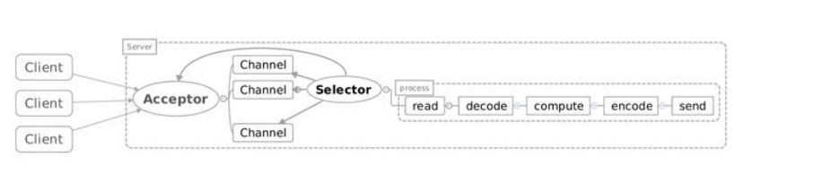

# Netty #

### NIO 模式 ###

> NIO组件

	1、select线程模型：一个线程 + 多路复用注册器【客户端请求注册到Selector】，单线程;
	2、高效的双向通道 channel，读写效率高，减少服务器创建另一种对应IO的时间；
	3、byteBuffer 缓冲区：使用缓存区进行数据传输，而不是使用字节流或者字符流传输，效率高，实现零拷贝。
	4、SelectionKey,IO事件状态。

> NIO模型：

	Acceptor注册Selector，监听accept事件；
	当客户端连接后，触发accept事件；
	服务器构建对应的Channel，并在其上注册Selector，监听读写事件；
	当发生读写事件后，进行相应的读写处理。

> NIO客户端代码(连接注册)

	//获取socket通道
	SocketChannel channel = SocketChannel.open();        
	channel.configureBlocking(false);

	//获得通道管理器
	selector=Selector.open();        
	channel.connect(new InetSocketAddress(serverIp, port));

	//为该通道注册SelectionKey.OP_CONNECT事件
	channel.register(selector, SelectionKey.OP_CONNECT);

> NIO客户端代码(监听)

	while(true){
	    //选择注册过的IO操作的事件(第一次为SelectionKey.OP_CONNECT)
	   selector.select();
	   while(SelectionKey key : selector.selectedKeys()){
	       if(key.isConnectable()){
	           SocketChannel channel=(SocketChannel)key.channel();
	           if(channel.isConnectionPending()){
	               channel.finishConnect();	//如果正在连接，则完成连接
	           }
	           channel.register(selector, SelectionKey.OP_READ);

	       }else if(key.isReadable()){ //有可读数据事件。
	           SocketChannel channel = (SocketChannel)key.channel();
	           ByteBuffer buffer = ByteBuffer.allocate(10);
	           channel.read(buffer);
	           byte[] data = buffer.array();
	           String message = new String(data);
	           System.out.println("recevie message from server:, size:"
	               + buffer.position() + " msg: " + message);
	       }
	   }
	}

> NIO服务端代码(连接注册)

	//获取一个ServerSocket通道
	ServerSocketChannel serverChannel = ServerSocketChannel.open();
	serverChannel.configureBlocking(false);
	serverChannel.socket().bind(new InetSocketAddress(port));

	//获取通道管理器
	selector = Selector.open();

	//将通道管理器与通道绑定，并为该通道注册SelectionKey.OP_ACCEPT事件，
	serverChannel.register(selector, SelectionKey.OP_ACCEPT);

> NIO服务端代码(监听)

	while(true){
	    //当有注册的事件到达时，方法返回，否则阻塞。
	   selector.select();
	   for(SelectionKey key : selector.selectedKeys()){
	       if(key.isAcceptable()){
	           ServerSocketChannel server = (ServerSocketChannel)key.channel();
	           SocketChannel channel = server.accept();
	           channel.write(ByteBuffer.wrap(
	            new String("send message to client").getBytes()));

	           //在与客户端连接成功后，为客户端通道注册SelectionKey.OP_READ事件。
	           channel.register(selector, SelectionKey.OP_READ);

	       }else if(key.isReadable()){	//有可读数据事件
	           SocketChannel channel = (SocketChannel)key.channel();
	           ByteBuffer buffer = ByteBuffer.allocate(10);
	           int read = channel.read(buffer);
	           byte[] data = buffer.array();
	           String message = new String(data);
	           System.out.println("receive message from client, size:"
	               + buffer.position() + " msg: " + message);
	       }
	   }
	}

### Reactor 线程模型 ###

> 将请求处理和IO处理分离，Reactor主线程处理客户端请求，Handler 以非阻塞方式处理IO。  

> Reactor中的组件

	Reactor:Reactor是IO事件的派发者。
	Acceptor:Acceptor接受client连接，建立对应client的Handler，并向Reactor注册此Handler。
	Handler:和一个client通讯的实体，处理具体的IO操作。
	一般在基本的Handler基础上还会有更进一步的层次划分， 用来抽象诸如decode，process和encoder这些过程。
	比如对Web Server而言，decode通常是HTTP请求的解析， process的过程会进一步涉及到Listener和Servlet的调用。业务逻辑的处理在Reactor模式里被分散的IO事件所打破， 所以Handler需要有适当的机制在所需的信息还不全（读到一半）的时候保存上下文，并在下一次IO事件到来的时候（另一半可读了）能继续中断的处理。为了简化设计，Handler通常被设计成状态机，按GoF的state pattern来实现。

	对应NIO代码来看:

		Reactor：相当于有分发功能的Selector
		Acceptor：NIO中建立连接的那个判断分支
		Handler：消息读写处理等操作类

	原生的NIO 过于复杂，使用reactor 进行NIO 的优化。

> Reactor从线程池和Reactor的选择上可以细分为如下几种：  
> 1、Reactor单线程模型

	这个模型和NIO流程很类似，只是将消息相关处理独立到了Handler中去了。
	如果这个客户端多次进行请求，如果在Handler中的处理速度较慢，那么后续的客户端请求都会被积压，导致响应变慢！所以引入了Reactor多线程模型!

> 2、Reactor多线程模型

	Reactor多线程模型就是将Handler中的IO操作和非IO操作分开，操作IO的线程称为IO线程，非IO操作的线程称为工作线程!这样的话，客户端的请求会直接被丢到线程池中，客户端发送请求就不会堵塞！
	但是当用户进一步增加的时候，Reactor会出现瓶颈！因为Reactor既要处理IO操作请求，又要响应连接请求！为了分担Reactor的负担，所以引入了主从Reactor模型!

> 3、主从Reactor模型

	主Reactor用于响应连接请求【bossGroup】，从Reactor用于处理IO操作请求【workGroup】！

### RPC简介 ###

- RPC(Remote Procedure Call，远程过程调用) 是一种进程间的通讯方式。    
- 它允许程序调用另一个地址空间,而不需要显式的编写底层网络技术的协议。  
- RPC采用客户机/服务器模式。请求程序就是一个客户机，而服务提供程序就是一个服务器。首先，客户机调用进程发送一个有进程参数的调用信息到服务进程，然后等待应答信息。在服务器端，进程保持睡眠状态直到调用信息到达为止。当一个调用信息到达，服务器获得进程参数，计算结果，发送答复信息，然后等待下一个调用信息，最后，客户端调用进程接收答复信息，获得进程结果，然后调用执行继续进行。

### Netty简介 ###

- 是一个高性能、异步事件驱动的NIO框架，它提供了对TCP、UDP和文件传输的支持，作为一个异步NIO框架，Netty的所有IO操作都是异步非阻塞的，通过Future-Listener机制，用户可以方便的主动获取或者通过通知机制获得IO操作结果。  
- Netty基于NIO,实现了对NIO的封装及优化，从而Netty的通信模式为异步非阻塞通信 。 
- 是对Reactor模型的一个实现。

### Netty框架 ###

- 优化了NIO，不再使用select线程模型，而引入了Reactor 模型，它会根据启动参数改变线程模型。  
> 流程：

	1、初始化线程组，网络层，Reactor 模型处理线程池组

		BOSS 线程组，主要来接受客户端请求；
		Work 线程组，用来处理IO业务；

		// 主reactor，处理客户端请求
        EventLoopGroup bossGroup = new NioEventLoopGroup();
        // 从reactor，处理IO业务
        EventLoopGroup workerGroup = new NioEventLoopGroup();

	2、初始化 Bootstrap链路

		Bootstrap 链路将启动参数链在一起启动。

		// ServerBootstrap 对象，Netty 用来启动NIO 服务端的辅助启动类
        ServerBootstrap serverBootstrap = new ServerBootstrap();
        serverBootstrap.group(bossGroup, workerGroup)
                .channel(NioServerSocketChannel.class)
                .option(ChannelOption.SO_BACKLOG, 1024)
                .childOption(ChannelOption.SO_KEEPALIVE, true)
                .childHandler(new ChildChannelHandler());   // 绑定IO事件处理Handler

	3、初始化一个职责链来调度handler,引入职责链模式

		使用职责链添加各种类型的业务处理Handler【work】，实现业务分类处理

		private class ChildChannelHandler extends ChannelInitializer<SocketChannel>{
	        @Override
	        protected void initChannel(SocketChannel socketChannel) throws Exception {
	            //添加时间处理handler
	            socketChannel.pipeline().addLast(new TimeServerHandler());
	        }
	    }

	4、编写具体的各种业务处理handler：读，写，编码，解码...
	
		public class TimeServerHandler extends ChannelInboundHandlerAdapter

- 测试用例--客户端上线时间  
> 服务端启动

	package com.netty.server;

	import io.netty.bootstrap.ServerBootstrap;
	import io.netty.channel.ChannelFuture;
	import io.netty.channel.ChannelInitializer;
	import io.netty.channel.ChannelOption;
	import io.netty.channel.EventLoopGroup;
	import io.netty.channel.nio.NioEventLoopGroup;
	import io.netty.channel.socket.SocketChannel;
	import io.netty.channel.socket.nio.NioServerSocketChannel;
	
	/**
	 * Create By HuangDongChang In 2018/7/9
	 */
	public class ServerMain {
	
	    // 构建模式启动
	    public void bind(int port) throws InterruptedException {
	
	        // 主reactor，处理客户端请求
	        EventLoopGroup bossGroup = new NioEventLoopGroup();
	        // 从reactor，处理IO业务
	        EventLoopGroup workerGroup = new NioEventLoopGroup();
	        try {
	            // ServerBootstrap 对象，Netty 用来启动NIO 服务端的辅助启动类
	            ServerBootstrap serverBootstrap = new ServerBootstrap();
	            serverBootstrap.group(bossGroup, workerGroup)
	                    .channel(NioServerSocketChannel.class)
	                    .option(ChannelOption.SO_BACKLOG, 1024)
	                    .childOption(ChannelOption.SO_KEEPALIVE, true)
	                    .childHandler(new ChildChannelHandler());   // 绑定IO事件处理Handler
	
	            /**
	             * 绑定端口，同步等待绑定成功
	             * 调用bind 方法绑定监听端口，再调用同步阻塞方法 sync 等待绑定操作完成
	             * 绑定完成 Netty 后会返回一个结果ChannelFuture，用于异步操作的通知回调
	             */
	            ChannelFuture channelFuture = serverBootstrap.bind(port).sync();
	            /**
	             * 等待服务端监听端口关闭
	             * 使用阻塞方法进行阻塞关闭，等待服务端无异常关闭后主线程才退出
	             */
	            channelFuture.channel().closeFuture().sync();
	
	        } finally {
	            // 释放线程组
	            workerGroup.shutdownGracefully();
	            bossGroup.shutdownGracefully();
	        }
	    }
	
	    /**
	     * work 处理
	     * 拦截链,职责链模式，Channel 初始化的一个职责链
	     *  给拦截链添加多种类型处理handler：读，写，编码，解码
	     */
	    private class ChildChannelHandler extends ChannelInitializer<SocketChannel>{
	
	        @Override
	        protected void initChannel(SocketChannel socketChannel) throws Exception {

				socketChannel.pipeline().addLast(new StringDecoder()); //增加解码器
	            //添加时间处理handler
	            socketChannel.pipeline().addLast(new TimeServerHandler());
	        }
	    }
	
	    public static void main(String[] args) {
	
	        int port = 8888;
	        try {
	            new ServerMain().bind(port);
	        } catch (InterruptedException e) {
	            e.printStackTrace();
	        }
	    }
	}

> 服务端的时间处理handler

	package com.netty.server;

	import io.netty.buffer.ByteBuf;
	import io.netty.buffer.Unpooled;
	import io.netty.channel.ChannelHandlerContext;
	import io.netty.channel.ChannelInboundHandlerAdapter;
	import java.io.UnsupportedEncodingException;
	import java.text.SimpleDateFormat;
	import java.util.Date;
	
	/**
	 * 实际业务处理
	 * ChannelInboundHandlerAdapter 为逻辑控制设置了3个方法
	 */
	public class TimeServerHandler extends ChannelInboundHandlerAdapter {
	
	    /**
	     * 读取接收到的客户端数据，并返回数据给客户端
	     */
	    @Override
	    public void channelRead(ChannelHandlerContext ctx, Object msg) {
	
	        byte[] clientMessage = null;
	        if (msg instanceof ByteBuf){
	            ByteBuf byteBuf = (ByteBuf) msg;
	            clientMessage = new byte[byteBuf.readableBytes()];
	            byteBuf.readBytes(clientMessage);
	
	        }else if (msg instanceof String) {
	            clientMessage = msg.toString().getBytes();
	        }
	
	        try {
	            //解码
	            String body = new String(clientMessage, "UTF-8");
	            System.out.println("服务器接受到客户端的命令：" + body);
	            SimpleDateFormat dateFormat = new SimpleDateFormat("yyyy-MM-dd HH:mm:ss");
	            String currentTimeMillis = "QUERY TIME ORDER".equalsIgnoreCase(body) ?
	                    dateFormat.format(new Date()) : "BED ORDER";
	
	            //使用 Unpooled 缓冲池的方式拿到 byteBuf【一个发送缓冲池】
	            ByteBuf buffer = Unpooled.copiedBuffer(currentTimeMillis.getBytes());
	            // ChannelHandlerContext 将缓冲池里面的内容写到客户端
	            ctx.writeAndFlush(buffer);
	
	        } catch (UnsupportedEncodingException e) {
	            e.printStackTrace();
	        } finally {
	            ctx.close();
	            byteBuf.release();
	        }
	    }
	
	    @Override
	    public void exceptionCaught(ChannelHandlerContext ctx, Throwable cause) {
	        cause.printStackTrace();
	        ctx.close();
	    }
	}

> 客户端启动  

	package com.netty.client;

	import io.netty.bootstrap.Bootstrap;
	import io.netty.channel.ChannelFuture;
	import io.netty.channel.ChannelInitializer;
	import io.netty.channel.ChannelOption;
	import io.netty.channel.EventLoopGroup;
	import io.netty.channel.nio.NioEventLoopGroup;
	import io.netty.channel.socket.SocketChannel;
	import io.netty.channel.socket.nio.NioSocketChannel;
	
	/**
	 * Create By HuangDongChang In 2018/7/9
	 */
	public class ClientMain {
	
	    public void connect(String host,int port) throws InterruptedException {
	
	        // 处理IO 的线程组
	        EventLoopGroup workerGroup = new NioEventLoopGroup();
	        try {
	            Bootstrap bootstrap = new Bootstrap();
	            bootstrap.group(workerGroup)    // 线程组模型
	                    .channel(NioSocketChannel.class)    //通道模型
	                    .option(ChannelOption.SO_KEEPALIVE, true)
	                    .handler(new ChildChannelHandler());    // 处理器handler
	
	            ChannelFuture channelFuture = bootstrap.connect(host, port).sync();
	            channelFuture.channel().closeFuture().sync();
	
	        } finally {
	            workerGroup.shutdownGracefully();
	        }
	    }
	
	    /**
	     * 拦截器链
	     */
	    private class ChildChannelHandler extends ChannelInitializer<SocketChannel>{
	
	        @Override
	        public void initChannel(SocketChannel socketChannel) throws Exception {

				socketChannel.pipeline().addLast(new StringDecoder()); //增加解码器
	            // 给拦截器链添加各种类型的处理handler
	            socketChannel.pipeline().addLast(new TimeClientHandler());
	        }
	    }
	
	    public static void main(String[] args) {
	
	        String host = "localhost";
	        int port = 8888;
	        try {
	            new ClientMain().connect(host,port);
	        } catch (InterruptedException e) {
	            e.printStackTrace();
	        }
	    }
	}

> 客户端的时间处理handler  

	package com.netty.client;

	import io.netty.buffer.ByteBuf;
	import io.netty.buffer.Unpooled;
	import io.netty.channel.ChannelHandlerContext;
	import io.netty.channel.ChannelInboundHandlerAdapter;
	import java.io.UnsupportedEncodingException;
	
	
	/**
	 *
	 * 实际业务处理
	 * Create By HuangDongChang In 2018/7/9
	 */
	public class TimeClientHandler extends ChannelInboundHandlerAdapter {
	
	    private final ByteBuf message;
	
	    public TimeClientHandler(){
	        byte[] reqBuffer = "QUERY TIME ORDER".getBytes();
	        // 构建缓冲区
	        message = Unpooled.buffer(reqBuffer.length);
	        message.writeBytes(reqBuffer);
	    }
	
	    /**
	     * 发送数据给服务端
	     */
	    @Override
	    public void channelActive(ChannelHandlerContext ctx) throws Exception {
	        ctx.writeAndFlush(message);
	    }
	
	    /**
	     * 读取服务端返回的数据
	     * @param ctx   通道
	     * @param msg   数据
	     */
	    @Override
	    public void channelRead(ChannelHandlerContext ctx, Object msg) {
	        byte[] clientMessage = null;
	        if (msg instanceof ByteBuf){
	            ByteBuf byteBuf = (ByteBuf) msg;
	            clientMessage = new byte[byteBuf.readableBytes()];
	            byteBuf.readBytes(clientMessage);
	
	        }else if (msg instanceof String) {
	            clientMessage = msg.toString().getBytes();
	        }

	        try {
	            String body = new String(serverMessage, "UTF-8");
	            System.out.println("上线时间：" + body);
	
	        } catch (UnsupportedEncodingException e) {
	            e.printStackTrace();
	        } finally {
	            ctx.close();
	            byteBuf.release();
	        }
	    }
	
	
	    @Override
	    public void exceptionCaught(ChannelHandlerContext ctx, Throwable cause) {
	        cause.printStackTrace();
	        ctx.close();
	    }
	}

> Netty ：高性能的网络通信框架，是一种RPC调用框架。
		
		1、通信模型：NIO 的配套专用通信通道；
		2、协议支持：soap协议，优化携带的字节数量；
		3、线程模型：Reactor 线程模型将对NIO读写性能进行优化。

> Listener机制【异步监听回调机制】实现Event，主动推送结果。【继承 ChannelInboundHandlerAdapter】
	
	ChannelInitializer: Channel 初始化的一个职责链
	ChannelHandler: 通道处理器
	ChannelFuture:	回调的结果

	在双向职责链中进行数据传输并加解码。

### Netty 粘包和拆包 ###

> 拆包：完整的数据流，被分成多个网络包进行传输；  
> 粘包：多个数据流合并为一个网络包进行传输。  
> 什么是TCP粘包与拆包

	首先TCP是一个"流"协议，犹如河中水一样连成一片，没有严格的分界线。当我们在发送数据的时候就会出现多发送与少发送问题，也就是TCP粘包与拆包。得不到我们想要的效果。

	粘包：当你把A，B两个数据从甲发送到乙，本想A与B单独发送，但是你却把AB一起发送了，此时AB粘在一起，就是粘包了。

	拆包: 如果发送数据的时候，你把A、B拆成了几份发，就是拆包了。当然数据不是你主动拆的，是TCP流自动拆的。

> netty 普通解决方法

	在职责链中添加2个handler：

	socketChannel.pipeline().addLast(new LineBasedFrameDecoder(1024));
    socketChannel.pipeline().addLast(new StringDecoder()); //增加解码器

	LineBasedFrameDecoder的原理是它依次遍历ByteBuf中的可读字节，判断是否有"\n"或"\r\n",如果有就以此为结束。它是以换行符为结束标志的解码器。
	
	StringDecoder的原理就是将接收到的对象转换为字符串，然后接着调用后面的handler。
	
	LineBasedFrameDecoder+StringDecoder组合就是设计按行切换的文本解码器，被设计来支持TCP的粘包与拆包。

### Netty源码分析 ###

