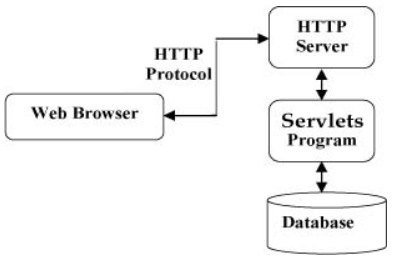

# Servlet #

* [1、Servlet简介](#1、Servlet简介)
* [2、servlet相关接口](#2、servlet相关接口)
* [3、Servlet开发流程](#3、Servlet开发流程)
* [4、HTTP协议](#4、HTTP协议 )
* [5、过滤器和监听器](#5、过滤器和监听器)
* [6、Servlet数据管理](#6、Servlet数据管理)
* [7、请求的转发/重定向](#7、请求的转发/重定向)
* [8、文件上传下载](#8、文件上传下载)
* [9、注解](#9、注解)
     

### 1、Servlet简介 ###

> 动态网页技术，运行在 Web 服务器或应用服务器上的程序，它是作为来自 Web 浏览器或其他 HTTP 客户端的请求和 HTTP 服务器上的数据库或应用程序之间的中间层。  
> 作用：

	可以收集来自网页表单的用户输入，呈现来自数据库或者其他源的记录，还可以动态创建网页。

> 特点：

	1. 由服务器调用和执行;
	2. java语言编写;
	3. 安装servlet规范开发;
	4. 相比于 CGI，功能强大，可以完成几乎所有的网站功能。
	
> 架构，servlet 在Web应用程序中的位置
	
	

> 工作模式

	1. 读取客户端（浏览器）发送的显式的数据。
		这包括网页上的 HTML 表单，或者也可以是来自 applet 或自定义的 HTTP 客户端程序的表单。

	2. 读取客户端（浏览器）发送的隐式的 HTTP 请求数据。
		这包括 cookies、媒体类型和浏览器能理解的压缩格式等。

	3. 处理数据并生成结果。
		这个过程可能需要访问数据库，执行 RMI 或 CORBA 调用，调用 Web 服务，或者直接计算得出对应的响应。

	4. 发送显式的数据（即文档）到客户端（浏览器）。
		该文档的格式可以是多种多样的，包括文本文件（HTML 或 XML）、二进制文件（GIF 图像）、Excel 等。

	5. 发送隐式的 HTTP 响应到客户端（浏览器）。
		这包括告诉浏览器或其他客户端被返回的文档类型（例如 HTML），设置 cookies 和缓存参数，以及其他类似的任务。

> 生命周期
	
	装载servlet，由相应的容器来完成，创建一个servlet实例。

	1. 调用 init() 方法进行初始化
		该方法用于初始化该Serlvet(类似于类的构造函数)，只会被调用一次（当用户第一次访问该Serlvet时被调用）。
		public void init() throws ServletException {
  			// 初始化代码...
		}

	2、调用 service() 方法来处理客户端的请求
		该方法用于处理业务逻辑【处理来自客户端（浏览器）的请求，并把格式化的响应写回给客户端】。
		当用户每访问Serlvet时，都会被调用。（多次调用）
		service() 方法检查 HTTP 请求类型（GET、POST、PUT、DELETE 等），并在适当的时候调用 doGet、doPost、doPut，doDelete 等方法。

		public void service(ServletRequest request, 
                    ServletResponse response) throws ServletException, IOException{

			// 业务逻辑代码...
		}
			
		request 用于获得客户端（浏览器）的请求信息。
		response 用于向客户端（浏览器）返回信息。
		使用 PriterStream【打印流】向浏览器显示数据。
		不需要对server()方法做任何动作，只需要根据来自客户端的请求类型来重写 doGet() 或 doPost() 即可。
			
		doGet() 方法：
			GET 请求来自于一个 URL 的正常请求，或者来自于一个未指定 METHOD 的 HTML 表单，它由 doGet() 方法处理。
			public void doGet(HttpServletRequest request,
			                  HttpServletResponse response)
						    throws ServletException, IOException {
			    // Servlet 代码
			}
			
		doPost() 方法：
			POST 请求来自于一个特别指定了 METHOD 为 POST 的 HTML 表单，它由 doPost() 方法处理。
			public void doPost(HttpServletRequest request,
			                   HttpServletResponse response)
			    			throws ServletException, IOException {
			    // Servlet 代码
			}
			
		合二为一：
			doGet() 、doPost()一起使用,在doPost()方法下引用doGet()即可，不需要考虑应该使用哪个
				public void doGet(HttpServletRequest request,
				                  HttpServletResponse response)
				    			throws ServletException, IOException {
				    // Servlet 代码
				}                                                                                                                       public void doPost(HttpServletRequest request,
				                   HttpServletResponse response)
				    			throws ServletException, IOException {
				    doGet(request,response);
				}

		get 、post请求比较
			1、从安全性看get<post。get提交的数据会在浏览器的地址栏显示。
			2、从提交的内容大小看get<post。get提交的数据不能大于2K，而post提交的数据理论上不受限制，但是实际编程中建议不要大于64K。
			3、从请求响应速度看get>post。get请求服务器立即处理请求，而post请求可能形成一个队列请求。

	3. 调用 destroy() 方法终止（结束）
		用于注销Serlvet实例，调用reload()释放内存。只会执行一次。
		什么时候被调用:
			容器重启【Tomcat】
			重启电脑
		调用 destroy() 方法之后，Servlet 会关闭数据库连接、停止后台线程、把 Cookie 列表或点击计数器写入到磁盘，并执行其他类似的清理活动。
		public void destroy() {
		    // 终止化代码...
		  }

		调用 destroy() 方法之后，servlet 对象被标记为垃圾回收Servlet 是由 JVM 的垃圾回收器进行垃圾回收的。

> Servlet的三大域对象:
  
	Request对象 -- 一次请求
	Session对象 -- 一次会话
	ServletContext对象 -- Tomcat从启动到关闭
	 
> JSP的四大域对象:

	page对象 -- 当前页面
	Request对象
	Session对象
	ServletContext对象

### 2、servlet 相关接口 ###

> 2.1、ServletConfig 接口
		
	这个接口定义了一个对象，通过这个对象，Servlet引擎配置一个Servlet并且允许Servlet获得一个有关它的ServletContext接口的说明。
	代表：当前Servlet的配置信息，每一个Servlet都有其唯一对应的ServletConfig。

	<servlet>
		<servlet-name>AServlet</servlet-name>
		<servlet-class>com.hdc.servlet.AServlet</servlet-class>
		<init-param>
			<param-name>user</param-name>
			<param-value>root</param-value>
		</init-param>
		<init-param>
			<param-name>password</param-name>
			<param-value>123123</param-value>
		</init-param>
	</servlet>

	获取：
		由Tomcat服务器创建，最终作为参数传递到init()方法中，我们可以在init()方法直接使用。
		当我们通过继承HttpServlet创建Servlet时，由于父类已经实现ServletConfig接口，所以我们可以在Servlet中直接调用ServletConfig的方法。
		
	功能
		1. 获取Servlet的别名
		2. 获取当前Servlet的初始化参数。
				
			2.1. getInitParameter
				这个方法返回一个包含Servlet指定的初始化参数的String。如果这个参数不存在，返加空值。
			2.2. getInitParameterNames
				这个方法返回一个枚举对象，该对象包括Servlet的所有初始化参数名。
				如果Servlet没有初始化参数，getInitParameterNames返回一个空的列表。
				<init-param>
					<param-name>user</param-name>
					<param-value>root</param-value>
				</init-param>
				<init-param>
					<param-name>password</param-name>
					<param-value>123123</param-value>
				</init-param>

		3. 获取当前WEB应用的ServletContext对象。
			getServletContext，返回这个Servlet的ServletContext对象。
	
> 2.2、ServletContext 接口
		
	定义了一个Servlet的环境对象，通过这个对象，Servlet引擎向Servlet提供环境信息。
	表示当前的WEB应用，一个WEB应用对应一个唯一的ServletContext对象，ServletContext对象生命周期从创建开始，到服务器关闭而结束。
		
	获取：
		通过 ServletConfig 的 this.getServletContext() 方法获取。

	功能：
		1. 可以获取整个WEB应用的初始化参数。
			<context-param>
				<param-name>phone</param-name>
				<param-value>1388888888</param-value>
			</context-param>

		2. 可以获取资源的真实路径（物理路径），主要在文件的上传和下载时使用。
		3. 可以作为一个域对象在不同的web资源之间共享数据。它的范围是最大的，存储的数据可以被所有用户使用，只要服务器不关闭，数据就会一直都存在。
		
|方法|说明|
|:--|:--|
|Object getAttribute(String name);|返回Servlet环境对象中指定的属性对象。如果该属性对象不存在，返回空值。这个方法允许访问有关这个Servlet引擎的在该接口的其他方法中尚未提供的附加信息。|
|Enumeration getAttributeNames();|返回一个Servlet环境对象中可用的属性名的枚举列表|
|ServletContext getContext(String uripath);|返回一个Servlet环境对象，这个对象包括了特定URI路径的Servlets和资源，如果该路径不存在，则返回一个空值。URI路径格式是/dir/dir/filename.ext|
|int getMajorVersion();|返回Servlet引擎支持的Servlet API的主版本号。例如对于2.1版，这个方法会返回一个整数2。|
|int getMinorVersion();|返回Servlet引擎支持的Servlet API的次版本号|
|String getMimeType(String file);|返回指定文件的MIME类型，如果这种MIME类型未知，则返回一个空值。MIME类型是由Servlet引擎的配置决定的|
|String getRealPath(String path);|一个符合URL路径格式的指定的虚拟路径的格式是：/dir/dir/filename.ext。用这个方法，可以返回与一个符合该格式的虚拟路径相对应的真实路径的String。|
|URL getResource(String uripath);|返回一个URL对象，该对象反映位于给定的URL地址（格式：/dir/dir/filename.ext）的Servlet环境对象已知的资源|
|InputStream getResourceAsStream(String uripath);|返回一个InputStream对象，该对象引用指定的URL的Servlet环境对象的内容。如果没找到Servlet环境变量，就会返回空值，URL路径应该具有这种格式：/dir/dir/filename.ext|
|RequestDispatcher getRequestDispatcher(String uripath);|如果这个指定的路径下能够找到活动的资源(例如一个Servlet，JSP页面，CGI等等)就返回一个特定URL的RequestDispatcher对象，否则，就返回一个空值|
|String getServerInfo();|返回一个String对象，该对象至少包括Servlet引擎的名字和版本号|
|void log(String msg);|写指定的信息到一个Servlet环境对象的log文件中|
|void setAttribute(String name, Object o);|给予Servlet环境对象中你所指定的对象一个名称。|
|void removeAttribute(String name);|从指定的Servlet环境对象中删除一个属性|

	使用:

		可以看做是一张表，这个和session非常相似，每一行就是一个属性。
		添加属性		setAttribute(String name, Object obj);
		获取属性值	getAttribute(String name); 	--返回Object类型
		删除属性		removeAttribute(String name);
			
	例子：
		//1.获得ServletContext实例
		ServletContext sc=this.getServletContext();
		
		//2.获取属性值
		String scVal=(String) sc.getAttribute("color");
		String scVal2=(String) sc.getAttribute("name");
		
		out.println("color:"+scVal+" ");
		out.println("name:"+scVal2);

		使用ServletContext实例
			如果是涉及到不同用户共享数据，而这些数据量不大，同时又不希望写入数据库中，我们就可以考虑使用ServletContext来实现。
			1.网站计数器
				计数器的次数在init里初始化（读出文件的数据），
				增加的计算在ServletContext，把实时的次数显示在web,
				在destory调用的时候把总数写入文件/数据库。
			2.网站在线用户显示
			3.简单的聊天系统
	
> 2.3、ServletRequest接口

	public interface ServletRequest
	定义一个Servlet引擎产生的对象，通过这个对象，Servlet可以获得客户端请求的数据。
	这个对象通过读取请求体的数据提供包括参数的名称、值和属性以及输入流的所有数据。

|方法|说明|
|:--|:--|
| Object getAttribute(String name);|返回请求中指定属性的值，如果这个属性不存在，就返回一个空值|
|Enumeration getAttributeNames();|返回包含在这个请求中的所有属性名的列表。|
|String getCharacterEncoding();|返回请求中输入内容的字符编码类型，如果没有定义字符编码类型就返回空|
|int getContentLength();|请求内容的长度，如果长度未知就返回-1|
|String getContentType();|返回请求数据体的MIME类型，如果类型未知返回空值。|
|ServletInputStream getInputStream() throws IOException;|返回一个输入流用来从请求体读取二进制数据|
|String getParameter(String name);|以一个String返回指定的参数的值，如果这个参数不存在返回空值。|
|Enumeration getParameterNames();|返回所有参数名的String对象列表，如果没有输入参数，该方法返回一个空值。|
|String[] getParameterValues(String name);|通过一个String对象的数组返回指定参数的值，如果这个参数不存在，该方法返回一个空值。|
|String getProtocol();|返回这个请求所用的协议，其形式是协议/主版本号.次版本号。例如对于一个HTTP1.0的请求，该方法返回HTTP/1.0。|
|BufferedReader getReader() throws IOException;|返回一个buffered reader用来读取请求体的实体，其编码方式依照请求数据的编码方式|
|String getRemoteAddr();|返回发送请求者的IP地址|
|String getRemoteHost();|返回发送请求者的主机名称。如果引擎不能或者选择不解析主机名（为了改善性能），这个方法会直接返回IP地址。|
| String getScheme();|返回请求所使用的URL的模式。例如，对于一个HTTP请求，这个模式就是http|
|String getServerName();|返回接收请求的服务器的主机名|
|int getServerPort();|返回接收请求的端口号|
|void setAttribute(String name, Object object);|在请求中添加一个属性，这个属性可以被其他可以访问这个请求对象的对象（例如一个嵌套的Servlet）使用。|

> getAttribute与getParameter的区别

　　1. 从获取到数据的来源来说：

	　　getAttribtue获取到的是web容器中的值，比如：
	　　我们在Servlet中通过setAttribute设定某个值，这个值存在于容器中，就可以通过getAttribute方法获取；

		getParameter获取到的是通过http传来的值，比如这样一个http请求：
		http:localhost:8080/test/test.html?username=xingoo
			
		还有其他的GET和POST方式，都可以通过getParameter来获取。

　　2. 从获取到的数据类型来说：

	　　getAttribute返回的是一个对象，Object。

	　　getParameter返回的是，前面页面中某个表单或者http后面参数传递的值，是个字符串。

	
> 2.4、ServletResponse接口

	public interface ServletResponse
	定义一个Servlet引擎产生的对象，通过这个对象，Servlet对客户端的请求作出响应。
	这个响应应该是一个MIME实体，可能是一个HTML页、图象数据或其他MIME的格式。

|方法|说明|
|:--|:--|
|String getCharacterEncoding()|返回MIME实体的字符编码|
|ServletOutputStream getOutputStream() throws IOException;|返回一个记录二进制的响应数据的输出流。如果这个响应对象已经调用getWriter，将会抛出IllegalStateException。|
|PrintWriter getWriter throws IOException;|这个方法返回一个PringWriter对象用来记录格式化的响应实体。如果这个响应对象已调用getOutputStream，会抛出一个getOutputStream|
|void setContentLength(int length);|设置响应的内容的长度，这个方法会覆盖以前对内容长度的设定|
|void setContentType(String type);|这个方法用来设定响应的content类型。|

> 2.5、HttpSession接口

	public interface HttpSession

|方法|说明|
|:--|:--|
|Object getAttribute(String name)|该方法返回在该 session 会话中具有指定名称的对象，如果没有指定名称的对象，则返回 null。|
| Enumeration getAttributeNames()|该方法返回 String 对象的枚举，String 对象包含所有绑定到该 session 会话的对象的名称。|
|long getCreationTime()|该方法返回该 session 会话被创建的时间，自格林尼治标准时间 1970 年 1 月 1 日午夜算起，以毫秒为单位。|
|String getId()|该方法返回一个包含分配给该 session 会话的唯一标识符的字符串。|
|long getLastAccessedTime()|该方法返回客户端最后一次发送与该 session 会话相关的请求的时间自格林尼治标准时间 1970 年 1 月 1 日午夜算起，以毫秒为单位。|
|int getMaxInactiveInterval()|该方法返回 Servlet 容器在客户端访问时保持 session 会话打开的最大时间间隔，以秒为单位。|
|void invalidate()|该方法指示该 session 会话无效，并解除绑定到它上面的任何对象。|
|boolean isNew()|如果客户端还不知道该 session 会话，或者如果客户选择不参入该 session 会话，则该方法返回 true。|
|void removeAttribute(String name)|该方法将从该 session 会话移除指定名称的对象。|
|void setAttribute(String name, Object value) |该方法使用指定的名称绑定一个对象到该 session 会话。|
|void setMaxInactiveInterval(int interval)|该方法在 Servlet 容器指示该 session 会话无效之前，指定客户端请求之间的时间，以秒为单位。|

> 2.6、HttpServletRequest 接口

	public interface HttpServletRequest extends ServletRequest;
	
	代表：
		浏览器发送给服务器的请求报文。用来处理一个对Servlet的HTTP格式的请求信息。
	
	获取：
		该对象由Tomcat服务器创建，最终作为参数传递到doGet或doPost方法中，我们可以在这两个方法中直接使用。

	功能：

		1. 获取用户发送的请求参数
			request.getParameter("username");
		2. 获取项目的名字(用来设置绝对路径)
			request.getContextPath();
			request.getSession().getServletContext().getRealPath("/upload");
		3. 作为一个域对象，在不同的WEB资源之间共享数据。
			请求的转发
			request.getRequestDispatcher("target.jsp").forward(request, response);
|方法|说明|
|:--|:--|
|String getAuthType();|返回这个请求的身份验证模式。|
|Cookie[] getCookies();|返回一个数组，该数组包含这个请求中当前的所有cookie。如果这个请求中没有cookie，返回一个空数组。|
|long getDateHeader(String name);|如果头域不能转换，抛出一个IllegalArgumentException。如果这个请求头域不存在，这个方法返回-1。返回指定的请求头域的值，这个值被转换成一个反映自1970-1-1日（GMT）以来的精确到毫秒的长整数。|
|String getHeader(String name);|返回一个请求头域的值。（译者注：与上一个方法不同的是，该方法返回一个字符串）。如果这个请求头域不存在，这个方法返回-1。|
|Enumeration getHeaderNames();|该方法返回一个String对象的列表，该列表反映请求的所有头域名。有的引擎可能不允许通过这种方法访问头域，在这种情况下，这个方法返回一个空的列表。|
|int getIntHeader(String name);|返回指定的请求头域的值，这个值被转换成一个整数。如果头域不能转换，抛出一个IllegalArgumentException。如果这个请求头域不存在，这个方法返回-1。|
|String getMethod();|返回这个请求使用的HTTP方法（例如：GET、POST、PUT）|
|String getPathInfo();|返回在这个请求的URL的Servlet路径之后的请求URL的额外的路径信息。如果这个请求URL包括一个查询字符串，在返回值内将不包括这个查询字符串。这个路径在返回之前必须经过URL解码。如果在这个请求的URL的Servlet路径之后没有路径信息。这个方法返回空值。|
|String getPathTranslated();|获得这个请求的URL的Servlet路径之后的额外的路径信息，并将它转换成一个真实的路径。在进行转换前，这个请求的URL必须经过URL解码。如果在这个URL的Servlet路径之后没有附加路径信息。这个方法返回空值。|
|String getQueryString();|返回这个请求URL所包含的查询字符串。一个查询字串符在一个URL中由一个“？”引出。如果没有查询字符串，这个方法返回空值。|
|String getRemoteUser|返回作了请求的用户名，这个信息用来作HTTP用户论证。如果在请求中没有用户名信息，这个方法返回空值。|
|String getRequestedSessionId();|返回这个请求相应的session id。如果由于某种原因客户端提供的session id是无效的，这个session id将与在当前session中的session id不同，与此同时，将建立一个新的session。 如果这个请求没与一个session关联，这个方法返回空值。|
|String getRequestURI();|从HTTP请求的第一行返回请求的URL中定义被请求的资源的部分。如果有一个查询字符串存在，这个查询字符串将不包括在返回值当中。例如，一个请求通过/catalog/books?id=1这样的URL路径访问，这个方法将返回/catalog/books。这个方法的返回值包括了Servlet路径和路径信息。如果这个URL路径中的的一部分经过了URL编码，这个方法的返回值在返回之前必须经过解码。|
|String getServletPath();|返回请求URL反映调用Servlet的部分。例如，一个Servlet被映射到/catalog/summer这个URL路径，而一个请求使用了/catalog/summer/casual这样的路径。所谓的反映调用Servlet的部分就是指/catalog/summer。如果这个Servlet不是通过路径匹配来调用。这个方法将返回一个空值。|
|HttpSession getSession();HttpSession getSession(boolean create);|返回与这个请求关联的当前的有效的session。如果调用这个方法时没带参数，那么在没有session与这个请求关联的情况下，将会新建一个session。如果调用这个方法时带入了一个布尔型的参数，只有当这个参数为真时，session才会被建立。为了确保session能够被完全维持。Servlet开发者必须在响应被提交之前调用该方法。 如果带入的参数为假，而且没有session与这个请求关联。这个方法会返回空值。|
|boolean isRequestedSessionIdValid();|检查与此请求关联的session当前是不是有效。如果当前请求中使用的session无效，它将不能通过getSession方法返回。|

> 2.7、HttpServletResponse 接口

	public interface HttpServletResponse extends ServletResponse

	代表：
		服务器发送给浏览器的响应报文。

	获取：
		该对象由Tomcat服务器创建，最终作为参数传递到doGet或doPost方法中，我们可以在这两个方法中直接使用。

	功能：
		1. 响应给浏览器一个网页或者是网页片段(设置的是响应报文的响应体)
			response.getWriter("");
		2. 请求的重定向
			response.sendRedirect("target.jsp");
		
	如果传递的是中文，那你将得到乱码，所有响应需要处理一下response.setContentType(“text/html,charset=gbk”);

|方法|说明|
|:--|:--|
|void addCookie(Cookie cookie);|在响应中增加一个指定的cookie。可多次调用该方法以定义多个cookie。|
|boolean containsHeader(String name);|检查是否设置了指定的响应头。|
|String encodeRedirectURL(String url);|对sendRedirect方法使用的指定URL进行编码。如果不需要编码，就直接返回这个URL|
|String encodeURL(String url);|对包含session ID的URL进行编码。如果不需要编码，就直接返回这个URL|
|sendError(int statusCode) throws IOException;sendError(int statusCode, String message) throws IOException;|用给定的状态码发给客户端一个错误响应。如果提供了一个message参数，这将作为响应体的一部分被发出，否则，服务器会返回错误代码所对应的标准信息。|
|void sendRedirect(String location) throws IOException;|使用给定的路径，给客户端发出一个临时转向的响应（SC_MOVED_TEMPORARILY）。给定的路径必须是绝对URL。相对URL将不能被接收，会抛出一个IllegalArgumentException。|
|void setDateHeader(String name, long date);|用一个给定的名称和日期值设置响应头，这里的日期值应该是反映自1970-1-1日（GMT）以来的精确到毫秒的长整数。如果响应头已经被设置，新的值将覆盖当前的值。|
|void setHeader(String name, String value);|用一个给定的名称和域设置响应头。如果响应头已经被设置，新的值将覆盖当前的值。|
|void setIntHeader(String name, int value);|用一个给定的名称和整形值设置响应头。如果响应头已经被设置，新的值将覆盖当前的值。|
|void setStatus(int statusCode);|设置了响应的状态码，如果状态码已经被设置，新的值将覆盖当前的值。|

> 2.8、HttpServlet类
	
	public class HttpServlet extends GenericServlet implements Serializable
	这是一个抽象类，用来简化HTTP Servlet写作的过程。
	它是GenericServlet类的扩充，提供了一个处理HTTP协议的框架。
	在这个类中的service方法支持例如GET、POST这样的标准的HTTP方法。这一支持过程是通过分配他们到适当的方法（例如doGet、doPost）来实现的。

> HttpServlet重写service()方法：	

	1. 在该方法中先将ServletRequest和ServletResponse强转为了HttpServletRequest和HttpServletResponse。	
		
	2. 调用重载的service()方法，并将刚刚强转得到对象传递到重载的方法中。
		
> 重载service(HttpServletRequest request , HttpServletResponse response)方法

	1. 在方法中获取请求的方式（get或post）
	2. 在根据不同的请求方式去调用不同的方法：
		如果是GET请求，则调用doGet(HttpServletRequest request , HttpServletResponse response)
		如果是post请求，则调用doPost(HttpServletRequest request , HttpServletResponse response)
		也可以合二为一，在post()中调用get()--this.doGet(request, response);。
			
> 结论：
		
	当通过继承HttpServlet来创建一个Servlet时，我们只需要根据要处理的请求的类型，来重写不同的方法。
	处理get请求，则重写doGet()。
	处理post请求，则重写doPost()。

|方法|说明|
|:--|:--|
|doDelete(HttpServletRequest request,HttpServletResponse response) throws ServletException,IOException;|被这个类的service方法调用，用来处理一个HTTP DELETE操作。这个操作允许客户端请求从服务器上删除URL|
|void doGet(HttpServletRequest request,HttpServletResponse response) throws ServletException,IOException;|被这个类的service方法调用，用来处理一个HTTP GET操作。这个操作允许客户端简单地从一个HTTP服务器“获得”资源|
|void doHead(HttpServletRequest request,HttpServletResponse response) throws ServletException|被这个类的service方法调用，用来处理一个HTTP HEAD操作。默认的情况是，这个操作会按照一个无条件的GET方法来执行，该操作不向客户端返回任何数据，而仅仅是返回包含内容长度的头信息。|
|void doOptions(HttpServletRequest request,HttpServletResponse response) throws ServletException|被这个类的service方法调用，用来处理一个HTTP OPTION操作。这个操作自动地决定支持哪一种HTTP方法。|
|void doPost(HttpServletRequest request,HttpServletResponse response) throws ServletException|被这个类的service方法调用，用来处理一个HTTP POST操作。|
|doPut||
|doTrace||
|long getLastModified(HttpServletRequest request);|返回这个请求实体的最后修改时间。|
|service||

### 3、Servlet开发流程 ###

> 3.1、在站点目录的WEB-INF下编辑web.xml
		
	编辑 web.xml,目的是配置和映射Servlet
	servlet 浏览器访问路径配置
		<servlet>
			<!--serlvet的名字，任意取 -->
			<servlet-name>hello1</servlet-name>
			<!--指明serlvet的路径（包名+类名） -->
			<servlet-class>Demo1.hello1</servlet-class>
		</servlet>

		<servlet-mapping>
			<!--serlvet的名字，与上面名称相同 -->
			<servlet-name>hello1</servlet-name>
			<!--在浏览器中输入的访问该serlvet的url 任意取-->
			<url-pattern>/test</url-pattern>
		</servlet-mapping>

	在 Serlvet 类上使用注解的方式, @WebServlet("/test") 对应浏览器路径
			【注意】这两种使用其中一种即可，不然路径重名的话反而会让tomcat启动不了。
		url = http://localhost:8080/hello/test

> 3.2、继承HttpSerlvet,需要重写doGet 、doPost方法
		
	import java.io.*;
	import javax.servlet.*;
	import javax.servlet.http.*;
	
	// 继承 HttpServlet 类
	public class HelloWorld extends HttpServlet {
	 
	  private String message;
	
	  public void init() throws ServletException
	  {
	      // 执行必需的初始化
	
	  }
	
	  public void doGet(HttpServletRequest request,
	                    HttpServletResponse response)
	            throws ServletException, IOException
	  {
	      // 设置响应内容类型
	      response.setContentType("text/html");
	      response.setCharacterEncoding("gbk");
	      PrintWriter out = response.getWriter();
	
	      // 实际的逻辑是在这里
	      //1.获得ServletContext实例
			ServletContext sc=this.getServletContext();
			
			//2.添加ServletContext属性
			sc.setAttribute("color", "蓝色");
			sc.setAttribute("name", "kevin");
			
			//3.获取属性值
			String scVal=(String) sc.getAttribute("color");
			String scVal2=(String) sc.getAttribute("name");
			
			out.println("删除前name:"+scVal2+" ");
			
			//3.删除属性
			sc.removeAttribute("name");
			
			String scVal3=(String) sc.getAttribute("name");
			
			out.println("color:"+scVal+" ");
			out.println("删除后name:"+scVal3);	
	  }
	  public void doGet(HttpServletRequest request,
	                    HttpServletResponse response)
	            throws ServletException, IOException
	  { doGet(request,response);}
	  public void destroy()
	  {
	      //执行注销任务
	  }
	}

> Servlet 表单数据处理
	
	1. GET 方法
		GET 方法向页面请求发送参数。页面和参数中间用 ? 字符分隔，多个参数之间使用&隔开。
		http://www.test.com/hello?key1=value1&key2=value2
	
	2. POST 方法
		不是把信息作为 URL 中 ? 字符后的文本字符串进行发送，而是把这些信息作为一个单独的消息。
	
	3. 读取表单数据
		getParameter()：			调用 request.getParameter() 方法来获取表单参数的值。
		getParameterValues()：	如果参数出现一次以上，则调用该方法，并返回多个值，例如复选框
		getParameterNames()：	如果您想要得到当前请求中的所有参数的完整列表，则调用该方法。该方法返回一个枚举，其中包含未指定顺序的参数名。

		一旦我们有一个枚举，我们可以以标准方式循环枚举，使用 hasMoreElements() 方法来确定何时停止，使用 nextElement() 方法来获取每个参数的名称。

> 避免表单重复提交

	基本思想：
		在表单中做一个标记，提交到servlet时，检查标记是否存在且和预定的标记一致，若一致，则受理请求，并销毁标记；若不一致或没有标记，则直接响应提示信息：“重复提交”。

	实现方式：
	
	使用session存放标记
		1、在原表单页面，生成一个随机值token；
		2、在原表单页面，把token值放入session属性中；
			String tokenVal=new Date().getTime()+"";
    		session.setAttribute("token", tokenVal); 
					
		3、在原表单页面，把token值放入隐藏域中。
			<input type="hidden" name="tokenVal" value=<%=tokenVal%>>
			
		4、在目标的servlet中，获得session和隐藏域的token值；
		比较token值是否为空且两个值是否一致，若一致，则受理请求，且把session中的token属性清除；
		若不一致，则直接响应提示页面：“重复提交”。
		
		//获取session
		HttpSession session=request.getSession();
		Object token=session.getAttribute("token");
		
		//获得隐藏域的值
		String tokenVal=request.getParameter("tokenVal");
		//System.out.println(tokenVal);
		
		if(token!=null&&token.equals(tokenVal)){
			//销毁标记
			session.removeAttribute("token");
		}else{
			//已经提交过了
			//跳转
			request.getRequestDispatcher("token.jsp").forward(request, response);
			return;
		}
		
		
		String name=request.getParameter("name");
		System.out.println("name:"+name);
		
		//跳转
		request.getRequestDispatcher("ok.jsp").forward(request, response);
		
> 使用HttpSession 实现验证码

	基本原理：和表单重复提交一致。
	
		1、在原表单页面，生成一个验证码的图片，同时把该图片中的字符串放入session中；
		2、在原表单页面，定义一个文本域，用于输入验证码；
		
		3、在目标的servlet中，获得session和文本域的验证码的值；
		比较token值是否为空且两个值是否一致，若一致，则受理请求，且把session中的验证码属性清除；
		若不一致，则直接响应提示页面：“重复提交”。

> 解决中文乱码问题
	
	1. 重新转码
		request 请求处理
			String u="是中文"; u=new String(u.getBytes("ISO8859_1"),"gb2312");【先解码，再编码】

		response 响应处理
			指定服务器的编码格式
				response.setCharacterEncoding("utf-8");	
			设置响应内容类型告诉浏览器编码格式
				response.setContentType(“text/html,charset=gbk”);

	2. 使用过滤器来解决
	
	3. 通过修改Tomcat配置servlet.xml文件[不太稳定]
		<Connector port="8080" protocol="HTTP/1.1"  maxThreads="150" connectionTimeout="20000"  redirectPort="8443" URIEncoding=”gbk”/>

### 4、HTTP协议 ###

- HTTP（HyperText Transfer Protocol，超文本传输协议）是一个客户端和服务器端请求和应答的标准（TCP）。
- HTTP是一个基于TCP/IP通信协议来传递数据（HTML 文件, 图片文件, 查询结果等WWW方式的）。
- HTTP协议采用了**请求/响应模型**。客户端向服务器发送一个请求，请求头包含请求的方法、URL、协议版本、以及包含请求修饰符、客户信息和内容的类似于MIME的消息结构。服务器以一个状态行作为响应，响应的内容包括消息协议的版本，成功或者错误编码加上包含服务器信息、实体元信息以及可能的实体内容。

> 客户端 HTTP 请求

	当浏览器请求网页时，它会向 Web 服务器发送特定信息，这些信息不能被直接读取，因为这些信息是作为 HTTP 请求的头的一部分进行传输的。

|请求头信息|说明|
|:--|:--|
|Accept|	指定浏览器或其他客户端可以处理的MIME类型。它的值通常为 image/png 或 image/jpeg|
|Accept-Charset|	指定浏览器要使用的字符集。比如 ISO-8859-1|
|Accept-Encoding|	指定编码类型。它的值通常为 gzip 或compress|
|Accept-Language|	指定客户端首选语言，servlet会优先返回以当前语言构成的结果集，如果servlet支持这种语言的话。比如 en，en-us，ru等等|
|Authorization|	在访问受密码保护的网页时识别不同的用户|
|Connection|	表明客户端是否可以处理HTTP持久连接。持久连接允许客户端或浏览器在一个请求中获取多个文件。Keep-Alive 表示启用持久连接|
|Content-Length|	仅适用于POST请求，表示 POST 数据的字节数|
|Cookie|	返回先前发送给浏览器的cookies至服务器|
|Host|	指出原始URL中的主机名和端口号|
|If-Modified-Since|	表明只有当网页在指定的日期被修改后客户端才需要这个网页。 服务器发送304码给客户端，表示没有更新的资源|
|If-Unmodified-Since|与If-Modified-Since相反， 只有文档在指定日期后仍未被修改过，操作才会成功|
|Referer|标志着所引用页面的URL。比如，如果你在页面1，然后点了个链接至页面2，那么页面1的URL就会包含在浏览器请求页面2的信息头中|
|User-Agent|用来区分不同浏览器或客户端发送的请求，并对不同类型的浏览器返回不同的内容|

> request 对象是javax.servlet.http.HttpServletRequest类的实例

|浏览器端请求方法|说明|
|:--	|:--	|
|Cookie[] getCookies()|返回客户端所有的Cookie的数组|
|Enumeration getAttributeNames()|返回request对象的所有属性名称的集合|
|Enumeration getHeaderNames()|返回所有HTTP头的名称集合|
|Enumeration getParameterNames()|返回请求中所有参数的集合|
|HttpSession getSession()|返回request对应的session对象，如果没有，则创建一个|
|HttpSession getSession(boolean create)|返回request对应的session对象，如果没有并且参数create为true，则返回一个新的session对象|
|Locale getLocale()|返回当前页的Locale对象，可以在response中设置|
|Object getAttribute(String name)|返回名称为name的属性值，如果不存在则返回null。|
|ServletInputStream getInputStream()|返回请求的输入流|
|String getAuthType()|返回认证方案的名称，用来保护servlet，比如 "BASIC" 或者 "SSL" 或 null 如果 JSP没设置保护措施|
|String getCharacterEncoding()|返回request的字符编码集名称|
|String getContentType()|返回request主体的MIME类型，若未知则返回null|
|String getContextPath()|返回request URI中指明的上下文路径|
|String getHeader(String name)|返回name指定的信息头|
|String getMethod()|返回此request中的HTTP方法，比如 GET,，POST，或PUT|
|String getParameter(String name)|返回此request中name指定的参数，若不存在则返回null|
|String getPathInfo()|返回任何额外的与此request URL相关的路径|
|String getProtocol()|返回此request所使用的协议名和版本|
|String getQueryString()|返回此 request URL包含的查询字符串|
|String getRemoteAddr()|返回客户端的IP地址|
|String getRemoteHost()|返回客户端的完整名称|
|String getRemoteUser()|返回客户端通过登录认证的用户，若用户未认证则返回null|
|String getRequestURI()|返回request的URI|
|String getRequestedSessionId()|返回request指定的session ID|
|String getServletPath()|返回所请求的servlet路径|
|String[] getParameterValues(String name)|返回指定名称的参数的所有值，若不存在则返回null|
|boolean isSecure()|返回request是否使用了加密通道，比如HTTPS|
|int getContentLength()|返回request主体所包含的字节数，若未知的返回-1|
|int getIntHeader(String name)|返回指定名称的request信息头的值|
|int getServerPort()|返回服务器端口号|
|int getParameterMap()|将参数封装成 Map 类型。|

> 服务器 HTTP 响应

	当一个 Web 服务器响应一个 HTTP 请求时，响应通常包括一个状态行、一些响应报头、一个空行和文档
	响应头信息。

|服务器响应头|说明|
|:--|:--|
|Allow	|指定服务器支持的request方法（GET，POST等等）|
|Cache-Control|	指定响应文档能够被安全缓存的情况。通常取值为 public，private 或no-cache 等等。 Public意味着文档可缓存，Private意味着文档只为单用户服务并且只能使用私有缓存。No-cache 意味着文档不被缓存。|
|Connection|	命令浏览器是否要使用持久的HTTP连接。close值 命令浏览器不使用持久HTTP连接，而keep-alive 意味着使用持久化连接。|
|Content-Disposition|	让浏览器要求用户将响应以给定的名称存储在磁盘中|
|Content-Encoding|	指定传输时页面的编码规则|
|Content-Language|	表述文档所使用的语言，比如en， en-us,，ru等等|
|Content-Length|	表明响应的字节数。只有在浏览器使用持久化 (keep-alive) HTTP 连接时才有用|
|Content-Type	|表明文档使用的MIME类型|
|Expires|指明啥时候过期并从缓存中移除|
|Last-Modified|	指明文档最后修改时间。客户端可以 缓存文档并且在后续的请求中提供一个 If-Modified-Since请求头|
|Location|在300秒内，包含所有的有一个状态码的响应地址，浏览器会自动重连然后检索新文档|
|Refresh|	指明浏览器每隔多久请求更新一次页面。|
|Retry-After|	与503 (Service Unavailable)一起使用来告诉用户多久后请求将会得到响应|
|Set-Cookie|	指明当前页面对应的cookie|
	

> response 对象是 javax.servlet.http.HttpServletResponse 类的实例

|服务器响应方法|说明|
|:--|:--|
|String encodeRedirectURL(String url)|对sendRedirect()方法使用的URL进行编码|
|String encodeURL(String url)|将URL编码，回传包含Session ID的URL|
|boolean containsHeader(String name)|返回指定的响应头是否存在|
|boolean isCommitted()|返回响应是否已经提交到客户端|
|void addCookie(Cookie cookie)|添加指定的cookie至响应中|
|void addDateHeader(String name, long date)|添加指定名称的响应头和日期值|
|void addHeader(String name, String value)|添加指定名称的响应头和值|
|void addIntHeader(String name, int value)|添加指定名称的响应头和int值|
|void flushBuffer()|将任何缓存中的内容写入客户端|
|void reset()|清除任何缓存中的任何数据，包括状态码和各种响应头|
|void resetBuffer()|清除基本的缓存数据，不包括响应头和状态码|
|void sendError(int sc)|使用指定的状态码向客户端发送一个出错响应，然后清除缓存|
|void sendError(int sc, String msg)|使用指定的状态码和消息向客户端发送一个出错响应|
|void sendRedirect(String location)|使用指定的URL向客户端发送一个临时的间接响应|
|void setBufferSize(int size)|设置响应体的缓存区大小|
|void setCharacterEncoding(String charset)|指定响应的编码集（MIME字符集），例如UTF-8|
|void setContentLength(int len)|指定HTTP servlets中响应的内容的长度，此方法用来设置 HTTP Content-Length 信息头|
|void setContentType(String type)|设置响应的内容的类型，如果响应还未被提交的话|
|void setDateHeader(String name, long date)|使用指定名称和值设置响应头的名称和内容|
|void setHeader(String name, String value)|使用指定名称和值设置响应头的名称和内容|
|void setIntHeader(String name, int value)|使用指定名称和值设置响应头的名称和内容|
|void setLocale(Locale loc)|设置响应的语言环境，如果响应尚未被提交的话|
|void setStatus(int sc)|设置响应的状态码|

> 服务器返回的 HTTP 状态码

	1. 消息码
		代表请求已被接受，需要继续处理
		100	Continue			只有请求的一部分已经被服务器接收，但只要它没有被拒绝，客户端应继续该请求。
		101	Switching Protocols	服务器切换协议。

	2. 成功码
		代表请求已成功被服务器接收、理解、并接受
		200	OK					请求成功。
		201	Created	  			该请求是完整的，并创建一个新的资源。
		202	Accepted			该请求被接受处理，但是该处理是不完整的。
		203	Non-authoritative Information	 
		204	No Content	 
		205	Reset Content	 	服务器成功处理了请求，且没有返回任何内容,要求请求者重置文档视图
		206	Partial Content	 	服务器已经成功处理了部分 GET 请求
	
	3. 重定向码
		300	Multiple Choices	链接列表。用户可以选择一个链接，进入到该位置。最多五个地址。
		301	Moved Permanently	所请求的页面已经永久转移到一个新的 URL。永久重定向
		302	Found				所请求的页面已经临时转移到一个新的 URL。临时重定向
		303	See Other			所请求的页面可以在另一个不同的 URL 下被找到。
		304	Not Modified	 	请求没有发生变化
		305	Use Proxy	 		被请求的资源必须通过指定的代理才能被访问
		306	Unused				在以前的版本中使用该代码。现在已不再使用它，但代码仍被保留。
		307	Temporary Redirect	所请求的页面已经临时转移到一个新的 URL。

	4. 请求错误码
		400	Bad Request			服务器识别不了该请求。
		401	Unauthorized		所请求的页面需要用户名和密码。
		402	Payment Required	您还不能使用该代码。
		403	Forbidden			禁止访问所请求的页面。
		404	Not Found			服务器无法找到所请求的页面。.
		405	Method Not Allowed	在请求中指定的方法是不允许的。
		406	Not Acceptable		服务器只生成一个不被客户端接受的响应。
		407	Proxy Authentication Required	在请求送达之前，您必须使用代理服务器的验证。
		408	Request Timeout		请求需要的时间比服务器能够等待的时间长，超时。
		409	Conflict			请求因为冲突无法完成。
		410	Gone				所请求的页面不再可用。
		411	Length Required	"Content-Length" 未定义。服务器无法处理客户端发送的不带 Content-Length 的请求信息。
		412	Precondition Failed			请求中给出的先决条件被服务器评估为 false。
		413	Request Entity Too Large	服务器不接受该请求，因为请求实体过大。
		414	Request-url Too Long		服务器不接受该请求，因为 URL 太长。当您转换一个 "post" 请求为一个带有长的查询信息的 "get" 请求时发生。
		415	Unsupported Media Type		服务器不接受该请求，因为媒体类型不被支持。
		417	Expectation Failed
	 
	5. 服务器错误码
		500	Internal Server Error	未完成的请求。服务器遇到了一个意外的情况。
		501	Not Implemented			未完成的请求。服务器不支持所需的功能。
		502	Bad Gateway				未完成的请求。服务器从上游服务器收到无效响应。
		503	Service Unavailable		未完成的请求。服务器暂时超载或死机。
		504	Gateway Timeout			网关超时。
		505	HTTP Version Not Supported	服务器不支持"HTTP协议"版本。

> 设置 HTTP 状态代码的方法

	通过 HttpServletResponse 对象可用
	public void setStatus ( int statusCode )   			该方法设置一个任意的状态码
	public void sendRedirect(String url)    			该方法生成一个 302 响应，连同一个带有新文档 URL 的 Location 头
	public void sendError(int code, String message)    	该方法发送一个状态码（通常为 404），连同一个在 HTML 文档内部自动格式化并发送到客户端的短消息

> 自动刷新网页
	
	刷新网页的最简单的方式是使用响应对象的方法 setIntHeader()

	void setIntHeader(String header, int headerValue)
	此方法把头信息 "Refresh" 连同一个表示时间间隔的整数值（以秒为单位）发送回浏览器。

		// 设置刷新自动加载的事件间隔为 5 秒
        response.setIntHeader("Refresh", 5);

### 5、过滤器和监听器 ###

- 在web.xml中配置多个过滤器，过滤器的执行顺序与 filter-mapping 的顺序一致。
- 在过滤链中，服务器会按照web.xml中过滤器定义的先后顺序组成一条链，然后执行过滤器1的dofilter()方法，执行chain.dofilter()前的代码，代码合法即放行，执行chain.dofilter()方法，将程序传递给下一个过滤器或者jsp。
- 过滤链的好处是，执行过程中任何时候都可以打断，只要不执行chain.doFilter()就不会再执行后面的过滤器和请求的内容。而在实际使用时，就要特别注意过滤链的执行顺序问题，像 EncodingFilter 就一定要放在所有Filter 之前，这样才能确保在使用请求中的数据前设置正确的编码。

> 作用：
	
	在客户端的请求访问后端资源之前，拦截这些请求，比如将加密的请求进行解密处理。
	在服务器的响应发送回客户端之前，处理这些响应，比如将响应进行加密处理后返回。
	
> 配置:
	
	过滤器通过 Web 部署描述符（web.xml）中的 XML 标签来声明，然后映射到您的应用程序的部署描述符中的 Servlet 名称或 URL 模式
	当 Web 容器启动 Web 应用程序时，它会为您在部署描述符中声明的每一个过滤器创建一个实例。
	Filter的执行顺序与在web.xml配置文件中的配置顺序一致，一般把Filter配置在所有的Servlet之前。
	
> 过滤器方法

	过滤器是一个实现了 javax.servlet.Filter 接口的 Java 类。
		
	public void init(FilterConfig filterConfig)
		web 应用程序启动时，web 服务器将创建Filter 的实例对象，并调用其init方法，读取web.xml配置，完成对象的初始化功能，从而为后续的用户请求作好拦截的准备工作（filter对象只会创建一次，init方法也只会执行一次）。
		开发人员通过init方法的参数，可获得代表当前filter配置信息的FilterConfig对象
		
	public void doFilter (ServletRequest, ServletResponse, FilterChain)
		该方法完成实际的过滤操作，当客户端请求方法与过滤器设置匹配的URL时，Servlet容器将先调用过滤器的doFilter方法。
		chain.doFilter(request, response);	// 继续访问后续过滤器【没有过滤器则访问JSP】。
		
	public void destroy()
		Servlet容器在销毁过滤器实例前调用该方法，在该方法中释放Servlet过滤器占用的资源。

> 实例

	import javax.servlet.*;
	import java.util.*;
	
	//实现 Filter 类
	public class LogFilter implements Filter  {

	    public void  init(FilterConfig config) throws ServletException {
	        // 获取初始化参数
	        String site = config.getInitParameter("Site"); 
	
	        // 输出初始化参数
	        System.out.println("网站名称: " + site); 
	    }

	    public void  doFilter(ServletRequest request, ServletResponse response, FilterChain chain) throws java.io.IOException, ServletException {
	
	        // 输出站点名称
	        System.out.println("站点网址：http://www.runoob.com");
	
	        // 把请求传回过滤链
	        chain.doFilter(request,response);
	    }

	    public void destroy( ){
	        /* 在 Filter 实例被 Web 容器从服务移除之前调用 */
	    }
	}

> web.xml配置各节点说明
		
	<filter>		指定一个过滤器。
		<filter-name>	用于为过滤器指定一个名字，该元素的内容不能为空。
		<filter-class>	元素用于指定过滤器的完整的限定类名。
		<init-param>	元素用于为过滤器指定初始化参数
				<param-name>	指定参数的名字，
				<param-value>	指定参数的值。

	<filter-mapping>
		<filter-name>
		<url-pattern>
		<dispatcher>

> <filter-mapping>元素用于设置一个 Filter 负责拦截的资源。

	一个Filter拦截的资源可通过两种方式来指定：
		1. Servlet 名称
		2. 资源访问的请求路径。

	子元素
		1. <filter-name>	用于设置filter的注册名称。
			该值必须是在<filter>元素中声明过的过滤器的名字。

		2. <url-pattern>	设置 filter 所拦截的请求路径(过滤器关联的URL样式) ，拦截所有路径使用： /*

		3. <dispatcher>		指定过滤器所拦截的资源被 Servlet 容器调用的方式，可以是REQUEST,INCLUDE,FORWARD和ERROR之一，默认REQUEST。
	
	用户可以设置多个<dispatcher>子元素用来指定 Filter 对资源的多种调用方式进行拦截。

	<dispatcher>子元素可以设置的值及其意义
		
		1. REQUEST【默认】：当用户直接访问页面时，Web容器将会调用过滤器。
			如果目标资源是通过RequestDispatcher的include()或forward()方法访问时，那么该过滤器就不会被调用。

		2. INCLUDE：如果目标资源是通过RequestDispatcher的 include() 方法访问时，那么该过滤器将被调用。除此之外，该过滤器不会被调用。
		
		3. FORWARD：如果目标资源是通过RequestDispatcher的 forward() 方法访问时，那么该过滤器将被调用，除此之外，该过滤器不会被调用。

		4. ERROR：如果目标资源是通过声明式异常处理机制调用时，那么该过滤器将被调用。除此之外，过滤器不会被调用。

> Filter 默认下只拦截外部直接提交的请求， forward 和 include这些内部转发都不会被过滤，但是有时候我们需要 forward 的时候也用到Filter，这样就需要配置
		
	<filter>
		<filter-name>TestFilter</filtername>
		<filter-class>com.hdc.TestFilter</filter-class>
	</filter>
	<filter-mapping>
		<filter-name>TestFilter</filtername>
		<url-pattern>/*</url-pattern>
		<dispatcher>REQUEST</dispatcher>
		<dispatcher>FORWARD</dispatcher>
		<dispatcher>INCLUDE</dispatcher>
		<dispatcher>EXCEPTION</dispatcher>
	</filter-mapping>

	这样 TestFilter 就会过滤所有状态下的请求。如果我们没有进行设置，默认使用的就是 REQUEST。
	配置上这个以后再进行 forward、include、exception 的时候也会触发过滤器了。

### url-pattern匹配规则 ###

	url-pattern映射匹配过程是有优先顺序的。
	而且当有一个servlet匹配成功以后，就不会去理会剩下的servlet了 。

> 四种匹配规则

	1. 精确匹配

		<url-pattern>中配置的项必须与 url 完全精确匹配。

		<url-pattern>/index.html</url-pattern>

	2. 路径匹配

		以 "/" 字符开头，并以 "/*" 结尾的字符串用于路径匹配。

		路径以/user/开始，后面的路径可以任意。
		<url-pattern>/user/*</url-pattern>
		
		路径以 / 开始
		<url-pattern>/*</url-pattern>

	3. 扩展名匹配

		以 "*." 开头的字符串被用于扩展名匹配。

		任何扩展名为jsp或action的url请求都会匹配
		<url-pattern>*.jsp</url-pattern>
		<url-pattern>*.action</url-pattern>

	4. 缺省匹配

		<url-pattern>/</url-pattern>

> 匹配顺序

	1. 精确匹配
		servlet-mapping1：<url-pattern>/user/users.html</url-pattern>
		servlet-mapping2：<url-pattern>/*</url-pattern>

		当一个请求http://localhost:8080/appDemo/user/users.html来的时候，servlet-mapping1匹配到，不再用servlet-mapping2匹配。

	2. 路径匹配。先最长路径匹配，再最短路径匹配。
		servlet-mapping1：<url-pattern>/user/*</url-pattern>
		servlet-mapping2：<url-pattern>/*</url-pattern>

		当一个请求http://localhost:8080/appDemo/user/users.html来的时候，servlet-mapping1匹配到，不再用servlet-mapping2匹配。

	3. 扩展名匹配。
		servlet-mapping1：<url-pattern>/user/*</url-pattern>
		servlet-mapping2：<url-pattern>*.action</url-pattern>

		当一个请求http://localhost:8080/appDemo/user/addUser.action来的时候，servlet-mapping1匹配到，不再用servlet-mapping2匹配。

	4. 缺省匹配，以上都找不到servlet，就用默认的servlet，配置为<url-pattern>/</url-pattern>

> 需要注意的问题

	1. 路径匹配和扩展名匹配无法同时设置
		
		匹配方法只有三种，要么是路径匹配（以 "/" 字符开头，并以 "/*" 结尾），要么是扩展名匹配（以 "*." 开头），要么是精确匹配，三种匹配方法不能进行组合，不要想当然使用通配符或正则规则。

		如<url-pattern>/user/*.action</url-pattern>是非法的,包含路径匹配和扩展名匹配

		另外注意：<url-pattern>/aa/*/bb</url-pattern>是精确匹配，合法，这里的*不是通配的含义

	2. "/*"和"/"含义并不相同

		"/*" 属于路径匹配，并且可以匹配所有 request，由于路径匹配的优先级仅次于精确匹配，所以 "/*" 会覆盖所有的扩展名匹配和缺省匹配，很多404错误均由此引起，所以这是一种特别恶劣的匹配模式，一般只用于filter的 url-pattern。
		
		"/" 是servlet中特殊的匹配模式，该模式有且仅有一个实例，优先级最低，不会覆盖其他任何url-pattern，只是会替换servlet容器的内建default servlet ，该模式同样会匹配所有 request。

		"/*" 和 "/" 均会拦截静态资源的加载，需要特别注意。

### Web监听器 ###

- web监听器是一种Servlet中的特殊的类，它们能帮助开发者监听web中的特定事件，比如 ServletContext,HttpSession,ServletRequest 的创建和销毁；变量的创建、销毁和修改等。可以在某些动作前后增加处理，实现监控。

> 监听器常用的用途

	统计在线人数，利用HttpSessionLisener
	加载初始化信息：利用ServletContextListener
	统计网站访问量
	实现访问监控
	
> 监听器的创建以及执行过程
	
	首先需要创建一个监听器，实现某种接口，例如我想实现一个对在线人数的监控
	1.可以创建如下的监听器
		
		public class MyListener implements HttpSessionListener{
		    private int userNumber = 0;
		    public void sessionCreated(HttpSessionEvent arg0) {
		        userNumber++;
		        arg0.getSession().setAttribute("userNumber", userNumber);
		    }
		    public void sessionDestroyed(HttpSessionEvent arg0) {
		        userNumber--;
		        arg0.getSession().setAttribute("userNumber", userNumber);
		    }
		}
		
	2.然后在web.xml中配置该监听器
			
		<listener>
			<listener-class>com.hdc.listener.MyListener</listener-class>
		</listener>
		
	3.在JSP中添加访问人数：
			
		<body>
			在线人数：<%=session.getAttribute("userNumber") %> 
		</body>
		
> 模拟执行
	
	由于打开另一个浏览器访问，相当于另一个会话，因此在线人数会增加。
	
> 监听器的分类
		
	1、按照监听的对象划分
		1. ServletContext监控：对应监控application内置对象的创建和销毁。
			当web容器开启时，执行contextInitialized方法；当容器关闭或重启时，执行contextDestroyed方法。
			实现方式：直接实现ServletContextListener接口

		2. HttpSession监控：对应监控session内置对象的创建和销毁。
			当打开一个新的页面时，开启一个session会话，执行sessionCreated方法；
			当页面关闭session过期时，或者容器关闭销毁时，执行sessionDestroyed方法。
			实现方式：直接实现HttpSessionListener接口

		3. ServletRequest监控：对应监控request内置对象的创建和销毁。
			当访问某个页面时，出发一个request请求，执行requestInitialized方法；
			当页面关闭时，执行requestDestroyed方法。
			实现方式，直接实现ServletRequestListener接口

	2、按照监听事件划分
		1. 监听事件自身的创建和销毁：同上面的按对象划分
		2. 监听属性的新增、删除和修改
			1. ServletContext，实现ServletContextAttributeListener接口
				通过调用ServletContextAttribtueEvent的getName方法可以得到属性的名称
			2. HttpSession，实现HttpSessionAttributeListener接口
			3. ServletRequest，实现ServletRequestAttributeListener接口

### 6、Servlet数据管理 ###

> 6.1、session
	
	一种会话数据管理技术，该技术把session数据保存在服务器端。
	浏览器和web服务器之间的HTTP状态信息的传递机制。
	当用户打开浏览器，访问某个网站时，服务器就会在服务器内存为该浏览器分配一个空间，该空间被这个浏览器独占，这个空间就是session空间。同时分配一个唯一的session id【JSESSIONID】，并以此来区分不同的浏览器（即客户端）。
	session数据默认有效时间为30min（30min指的是持续无操作时间，不是总时间），可以修改(在Tomcat conf—>web.xml中修改)。

> 生命周期
		
	session并非在有客户端访问时就被创建，而是在 HttpServletRequest.getSession()被调用时才被创建。同时这也是读取 session的方法。
	由于Session是放置在服务器端的对象。所以当客户端关闭浏览器，并不意味着Session对象的销毁。所以到一定时间，一定要对Session对象进行销毁，以释放服务器内存资源。
	Session生成后，只要用户继续访问，服务器就会更新Session的最后访问时间，并维护该Session。用户每访问服务器一次，无论是否读写Session，服务器都认为该用户的Session"活跃（active）"了一次
	
	session什么时候失效？
		服务器会把超过有效时间的Session从服务器内存中清除，此时Session便失效
			设置有效时间（单位为s） request.getSession().setMaxInactiveInterval(20);
			如果设置为0或者负数，意味着永远有效
		调用Session的invalidate方法
			会话注销：request.getSession().invalidate(); 【可用于用户登出】
			session.removeAttribute()移除session中的某项属性

> session 使用
		
	可以把session看做一张set表，这张表有两列，而表有多少行理论上没有限制，每一行就是session的一个属性，每个属性包含有两个部分，一个是该属性的名字String，另外一个是它的值Object。
		
	1.得到session【对象信息】
		HttpSession hs=request.getSession(true);

	2.向session添加属性，值是对象类型
		hs.setAttribute(String name,Object value);

	3.从session得到某个属性
		String name=(String)hs.getAttribute(String name);

	4.从session中删除掉某个属性
		hs.removeAttribute(String name);

	5.注销session中的内容
		直接注销session
			hs.invalidate();
		设置session有效时间为1s，是比较安全的一种方式
			hs.setMaxInactiveInterval(1);

	6.设置session的有效时间，单位为S
		hs.setMaxInactiveInterval(20);
		
例子
	/*
	* session功能
	*/
	
	package com.hdc.servlet;
	
	import java.io.IOException;
	import java.io.PrintWriter;
	
	import javax.servlet.ServletException;
	import javax.servlet.http.HttpServlet;
	import javax.servlet.http.HttpServletRequest;
	import javax.servlet.http.HttpServletResponse;
	import javax.servlet.http.HttpSession;
	
	public class session extends HttpServlet {
	
	
		private static final long serialVersionUID = 1L;
	
		
		public void doGet(HttpServletRequest request, HttpServletResponse response)
				throws ServletException, IOException {
	
			response.setContentType("text/html");
			response.setCharacterEncoding("utf-8");
			PrintWriter out = response.getWriter();
			
			//获得session信息
			HttpSession hs=request.getSession();
			
			//session添加属性
			hs.setAttribute("name", "kevin");
			
			//session得到属性
			String sessionVal=(String) hs.getAttribute("name");
			
			//获得session的ID
			String sessionId=hs.getId();
			
			//注销session的内容
			hs.setMaxInactiveInterval(1);
			//hs.invalidate();
			
			out.println("session对象:"+hs+" "+"sessionVal:"+sessionVal+" ");
			out.println("sessionID："+sessionId+" ");
			out.println("有效时间："+hs.getMaxInactiveInterval()+" ");
			out.println("session值:"+sessionVal+" ");		
		}
		
		public void doPost(HttpServletRequest request, HttpServletResponse response)
				throws ServletException, IOException {
	
			this.doGet(request, response);
		}
	}
		
|方法|说明|
|:-|:-|
|Object getAttribute(String name)|返回在该 session 会话中具有指定名称的对象，如果没有指定名称的对象，则返回 null。|
|Enumeration getAttributeNames()|返回 String 对象的枚举，String 对象包含所有绑定到该 session 会话的对象的名称。|
|long getCreationTime()|返回该 session 会话被创建的时间，自格林尼治标准时间 1970 年 1 月 1 日午夜算起，以毫秒为单位。|
|String getId()|返回一个包含分配给该 session 会话的唯一标识符的字符串。|
|long getLastAccessedTime()|返回客户端最后一次发送与该 session 会话相关的请求的时间自格林尼治标准时间 1970 年 1 月 1 日午夜算起，以毫秒为单位。|
|int getMaxInactiveInterval()|返回 Servlet 容器在客户端访问时保持 session 会话打开的最大时间间隔，以秒为单位。|
|void invalidate()|指示该 session 会话无效，并解除绑定到它上面的任何对象。|
|boolean isNew()|如果客户端还不知道该 session 会话，或者如果客户选择不参入该 session 会话，则该方法返回 true。|
|void removeAttribute(String name)|该方法将从该 session 会话移除指定名称的对象。|
|void setAttribute(String name, Object value) |使用指定的名称绑定一个对象到该 session 会话。|
| void setMaxInactiveInterval(int interval)|在 Servlet 容器指示该 session 会话无效之前，指定客户端请求之间的时间，以秒为单位。|
	
> 当关闭浏览器时怎么就会有session干掉的假象呢？
		
	由于session是基于Cookie【会话cookie】的。浏览器发起请求会携带sessionId --> JSESSIONID到服务器，服务器根据这个id来判读当前访问的是哪个session。
	然而浏览器被关闭后由于浏览器的Cookie文件还未设置MaxAge值，所以在此时浏览器的Cookie是会话级别的，是存在浏览器的内存中，当浏览器被关闭浏览器的内存被释放，临时文件被清除，这时的Cookie也随之销毁，则当前这个请求中被没有之前的那个sessionId值，服务器就当时第一次访问，给浏览器创建一个新的session值并返回一个null；
	但是之前的那个session并没有被干掉，只是浏览器找不到这个sessionId了。这样一来，此时服务器器就存在了两个session了，之前的session 则会过期自动销毁。
	
	解决这个假象的方案
		我们可以创建一个新的Cookie，该Cookie的名字为 JSESSIONID，并设置setMaxAge()的时间值，让Cookie保存在客户端的硬盘中，这时即使多次对浏览器进行关开操作是不会清除客户端硬盘文件的。所以，Cookie就不丢失了，SessionId也不会随浏览器关闭而丢失
		session.setAttribute("name","alex");
        Cookie cookie = new Cookie("JSESSIONID",session.getId());
        cookie.setMaxAge(3600*24); //1天
        response.addCookie(cookie);

> Session数据的钝化与活化

	由于session中保存大量访问网站相关的重要信息，因此过多的session数据就会服务器性能的下降，占用过多的内存。因此类似数据库对象的持久化，web容器也会把不常使用的session数据持久化到本地文件或者数据中。这些都是有web容器自己完成，不需要用户设定。
	不用的session数据序列化到本地文件中的过程，就是钝化；
	当再次访问需要到该session的内容时，就会读取本地文件，再次放入内存中，这个过程就是活化。
	只要实现 HttpSeesionActivationListener 接口就是实现钝化与活化事件的监听
		创建JavaBean实现了HttpSessionActivationListener接口,并且重写该接口提供的所有方法.
		该JavaBean实现了 Serializable(序列化)接口,Session的钝化与活化是基于Session的序列化实现的

> Session的序列化

	当Tomcat服务器正常关闭后，Session会自动被保存到本地硬盘中。
		在Tomcat服务器的安装目录:%Catalina_HOME%\work\Catalina\localhost\Web工程名目录中。
	当Tomcat服务器正常启动后，Session会自动从本地硬盘中读取到内存中。
		保存在本地硬盘中的序列化文件，自动销毁。

> 6.2、cookie

	一种会话数据管理技术，该技术把会话数据保存在浏览器客户端。
	浏览器和web服务器之间的HTTP状态信息的传递机制。

> Cookie的工作流程
		
	1. 首先浏览器向服务器发出请求。
	2. 服务器就会根据需要生成一个Cookie对象，并且把数据保存在该对象内。
	3. 然后把该Cookie对象放在响应头，一并发送回浏览器。
	4. 浏览器接收服务器响应后，提取出该Cookie保存在浏览器端。
	5. 当下一次浏览器再次访问那个服务器，就会把这个Cookie放在请求头内一并发给服务器。
	6. 服务器从请求头提取出该Cookie，判别里面的数据，然后作出相应的动作。
	
> Cookie的使用

	Cookie的构造方法接收两个参数，第一个参数是要传递的数据的名字，第二个是该数据的值，数据类型都是String
	通过请求方法 request.getCookies() 访问 Cookie，该方法将返回一个 Cookie 对象的数组。

	1.创建一个cookie（在服务器端创建的）
		Cookie c=new Cookie(String name, String value);
	2.将一个cookie写回到客户端【发送cookie信息到浏览器的响应头里】
		response.addCookie(c);
	3.接收浏览器发送的cookie信息，调用request.getCookies()方法，返回一个Cookie数组，然后遍历它把里面的内容取出来。
		//从客户端读取所有的cookie，返回一个数组
		Cookie[] cookies=request.getCookies();
			
		if(cookies!=null){
			//循环读取cookie的信息
			for(Cookie s:cookies)
			{
				String cName=s.getName();
				String cValue=s.getValue();	
				out.println("cookie名字："+cName+" ");
				out.println("cookie值："+cValue);				
			}		
			}else{
				out.println("没有cookie或者已经过期");
		}
		
|Cookie方法|说明|
|:--|:--|
|void setDomain(String pattern)|设置 cookie 适用的域，例如 w3cschool.cc。|
|String getDomain()|获取 cookie 适用的域，例如 w3cschool.cc。|
|void setMaxAge(int expiry)|设置 cookie 过期的时间（以秒为单位），为负则该cookie不会存储【作用域仅为当前的浏览器】，为0则删除该cookie。如果不设置，cookie 只会在当前 session 会话中持续有效。|
|int getMaxAge()|返回 cookie 的最大生存周期（以秒为单位），默认情况下，-1 表示 cookie 将持续下去，直到浏览器关闭。|
|String getName()|返回 cookie 的名称。名称在创建后不能改变。|
|void setValue(String newValue)|设置与 cookie 关联的值。|
|String getValue()|获取与 cookie 关联的值。|
| void setPath(String uri)|设置 cookie 适用的路径。如果您不指定路径，与当前页面相同目录下的（包括子目录下的）所有 URL 都会返回 cookie。即作用仅限于同目录及其子目录|
|String getPath()|获取 cookie 适用的路径。|
|void setSecure(boolean flag)|设置布尔值，表示 cookie 是否应该只在加密的（即 SSL）连接上发送。|
|void setComment(String purpose)|设置cookie的注释。该注释在浏览器向用户呈现 cookie 时非常有用。|
|String getComment()|获取 cookie 的注释，如果 cookie 没有注释则返回 null。|
		
	【注意】
		1. 把cookie设置到某个路径下，那么浏览器在该路径下访问服务器时就会带着cookie信息到服务器；否则，就不会带着Cooke信息到服务器。
		2. cookie保存的会话数据类型必须是字符串的。浏览器一般只允许存放300个Cookie，每个站点最多存放20个Cookie，每个Cookie的大小限制为4KB。
		
> 6.3、cookie VS session
	
	1. 存在的位置
		cookie保存在客户端，session保存在服务器端
	2. 安全性
		比较而言，cookie的安全性比session要弱
	3. 网络传输量
		cookie通过网络在客户端与服务器端传输，而session保存在服务器端，不需要传输
	4. 生命周期
		cookie的有效时间是总的时间，从创建开始就计时；
		session的有效时间的间隔的，指的是持续时间，不是总时间。
	5. 默认有效时间
		cookie 不设置有效时间则不会被保存；
		session 默认有效时间为 30min

> web.xml中

	init 	单个Serlvet的初始化参数
	context 所有Serlvet的初始化参数

> 6.4、ServletContext 

	它代表了servlet环境的上下文，相当于一个全局变量，即只要某个web应用在启动中，这个对象就一直都是有效的存在，所以它的范围是最大的，存储的数据可以被所有用户使用，只要服务器不关闭，数据就会一直都存在。

	使用ServletContext

		1. 如何得到ServletContext实例
			this.getServletContext();
			
		2. 你可以把它想象成一张表，这个和session非常相似，每一行就是一个属性：
			添加属性		setAttribute(String name, Object obj);
			获取属性值	getAttribute(String name); 	--返回Object类型
			删除属性		removeAttribute(String name);
			
		3. 生命周期
			ServletContext中的生命周期从创建开始，到服务器关闭而结束。
	
	ServletContext为共享空间：
	
	A：添加ServletContext属性
	
		response.setContentType("text/html");
		response.setCharacterEncoding("gbk");
		PrintWriter out = response.getWriter();
		
		//1.获得ServletContext实例
		ServletContext sc=this.getServletContext();
		
		//2.添加ServletContext属性
		sc.setAttribute("color", "蓝色");
		sc.setAttribute("name", "kevin");
		
		//3.获取属性值
		String scVal=(String) sc.getAttribute("color");
		String scVal2=(String) sc.getAttribute("name");
		
		out.println("删除前name:"+scVal2+" ");
		
		//3.删除属性
		sc.removeAttribute("name");
		
		String scVal3=(String) sc.getAttribute("name");
		
		out.println("color:"+scVal+" ");
		out.println("删除后name:"+scVal3);
		
	B：可以访问到ServletContext属性
	
		//1.获得ServletContext实例
		ServletContext sc=this.getServletContext();
		
		//2.获取属性值
		String scVal=(String) sc.getAttribute("color");
		String scVal2=(String) sc.getAttribute("name");
		
		out.println("color:"+scVal+" ");
		out.println("name:"+scVal2);

	使用ServletContext实例：
	在网站开发中，有很多功能需要使用ServletContext，比如：
		1.网站计数器
		2.网站在线用户显示
		3.简单的聊天系统
		
	如果是涉及到不同用户共享数据，而这些数据量不大，同时又不希望写入数据库中，我们就可以考虑使用ServletContext来实现
	
	计数器的次数在init里初始化（读出文件的数据），
	增加的计算在ServletContext，把实时的次数显示在web,
	在destory调用的时候把总数写入文件。
	
	该网页被访问了"+this.getServletContext().getAttribute("visitTimes").toString()+"次"
	您的ip="+req.getRemoteAddr()
	您的机器名="+req.getRemoteHost()

> 6.5、Session VS ServletContext
	
	session 		为单个客户端所属空间【相当于一个局部变量】，占用内存。
	ServletContext 	可以作为多个客户共享的空间【相当于一个全局变量】，会长时间保存在服务器，占用内存。可减少重复在内存中存储数据造成的开销。

> 6.6、Servlet的三大域对象
	
	Request对象 -- 一次请求
	Session对象 -- 一次会话
	ServletContext对象 --容器【 Tomcat】从启动到关闭

### 7、请求的转发/重定向 ###

> 7.1、转发
		
	request.getRequestDispatcher("Welcome.jsp").forward(request, response);
		
	这种转发方法比sendRedirect()效率高，同时request中的对象还可以在下一页使用。
	可以通过在request设置值【作为域对象】来在两个页面间传递值。
		request.setAttribute("result","a")  A页面设置请求值
		request.getAttribute("result")		B页面获得请求值
	
> 7.2、重定向
		
	response.sendRedirect(url_path)方法【url_path: 重定向的地址】
	
	通过该方法可以将一个页面的信息传送给另外的页面，比如：response.sendRedirect("welcome?uname=aaa");
		优点：传送信息的速度比较快
		缺点：它只能传送字符串，而不能传送一个对象
	
	【注意】
		1. welcome代表你要跳转的那个servlet的url
		2. servlet url名和变量之间有个？
		3. 如要传递两个以上的值，它们之间要用符号&分开，比如response.sendRedirect("welcome?uname=aaa&passwd=123");
		4. 如果传递的是中文，那你将得到乱码，需要处理一下response.setContentType("text/html,charset=gbk");

> 7.3、区别

	地址栏:
		转发：	地址栏是初次发出请求的地址；
		重定向：	地址栏是最后响应的URL地址。

	request对象:
		转发：	在最终的serlvet中，request对象和中转的那个request是同一个对象；
		重定向：	在最终的serlvet中，request对象和中转的那个request不是同一个对象。

	资源:
		转发：	只能转发给当前的WEB应用的资源
		重定向：	可以重定向到任何资源

	根目录'/':
		转发：	/ 代表的是当前WEB应用的根目录；http://localhost:8080/net(项目名称)
		重定向：	/ 代表的是当前WEB站点的根目录；http://localhost:8080/

	本质区别:
		请求的转发只发出了一次请求；
		重定向则发出了两次请求。

	访问路径:
		转发的路径由服务器解析，即 /  代表的是当前WEB应用的根目录，所以设置绝对路径时不需要加项目名
		重定向的路径由浏览器解析，即 / 代表的是当前WEB站点的根目录，所以设置绝对路径时需要加上项目名

> 使客户端不能直接访问某一页面

	对于Tomcat而言，WEB-INF下的文件是不能通过在浏览器上来访问的，但通过请求的转发/重定向是可以的。

> URI和URL
	
	URL是URI的一种实现，也是URI最常见的实现方式。所以URL和URI实际上可以理解为一个意思。

	URL地址的格式
		http://主机名:端口号/项目名/资源路径/资源名
			
	request.getRequestURL() 	返回全路径
	request.getRequestURI() 	返回除去host（域名或者ip）部分的路径
	request.getContextPath() 	返回工程名部分【当前的项目名 】，如果工程映射为/，此处返回则为空
	request.getServletPath() 	返回除去host和工程名部分的路径

	例如：
	
		request.getRequestURL() 	http://localhost:8080/jqueryLearn/resources
	
		request.getRequestURI() 	/jqueryLearn/resources
	
		request.getContextPath()	/jqueryLearn 
		
		request.getServletPath()	/resources
	
	【注】 resources为 WebContext 下的目录名 ，jqueryLearn 为工程名

	或者：
	
		request.getRequestURL()		// URI=/modalView
	
		request.getRequestURI()		// URL=http://localhost:8080/modalView
	
		request.getContextPath()	// ContextPath=
	
		request.getServletPath()	// ServletPath=/modalView
	
	【注】没有带上工程名

> 相对路径和绝对路径
	
	1. 相对路径
		之前我们使用的路径全都是相对路径：
		所谓的相对路径指相对于当前资源所在路径：
			http://主机名:端口号/项目名/资源路径/
				
		由于转发的出现，相对路径会经常发生变化，容易出现错误的链接，所以在开发中我们一般不使用相对路径，而是使用绝对路径。

	2. 绝对路径
		绝对路径使用/开头。
		由浏览器解析的绝对路径中的/代表的是服务器的根目录：
			http://主机名:端口号/
			注意：需要加上项目名

		由服务器解析的绝对路径中的/代表的项目的根目录：
			http://主机名:端口号/项目名/
			注意：不要加项目名
			
	总结：
		转发的路径由服务器解析，设置绝对路径时不需要加项目名。
		重定向的路径由浏览器解析，设置绝对路径时需要加上项目名。

> 常见的路径：

	url-pattern：
	转发的路径：
		url-pattern和转发中的路径都是由服务器解析的，根目录是项目的根目录：
				http://主机名:端口号/项目名/
		所以这两个路径不需要加项目名。

	重定向的路径：
		重定向和页面中的路径（HTML标签中的路径），由浏览器解析的，根目录是服务器的根目录：
				http://主机名:端口号/
		所以这个两个路径必须加上项目名。

### 8、文件上传下载 ###

> 操作文件

	servlet本来就是一个.java文件，因此，servlet中操作文件和普通Java操作文件是一样的。

	输入输出是针对程序而言的
		内存（程序）数据 --> 磁盘文件 （写出、输出）
		内存（程序）数据 <-- 磁盘文件 （读入，输入）
	
> 例子

	/*
	 * 操作文件
	 */
	
	package com.hdc.servlet;
	
	import java.io.BufferedReader;
	import java.io.BufferedWriter;
	import java.io.File;
	import java.io.FileReader;
	import java.io.FileWriter;
	import java.io.IOException;
	import java.io.PrintWriter;
	import java.util.Iterator;
	
	import javax.servlet.ServletException;
	import javax.servlet.http.HttpServlet;
	import javax.servlet.http.HttpServletRequest;
	import javax.servlet.http.HttpServletResponse;
	
	public class operateFile extends HttpServlet {
	
		private static final long serialVersionUID = 1L;
	
		
		public void doGet(HttpServletRequest request, HttpServletResponse response)
				throws ServletException, IOException {
	
			response.setContentType("text/html");
			response.setCharacterEncoding("utf-8");
			PrintWriter out = response.getWriter();
			
			//写入数据
			File file=new File("e:\\t.txt");
			
			if(!file.exists()){
				
				try {
					//文件不存在，新建文件
					file.createNewFile();
					System.out.println("创建t.txt");
				} catch (Exception e) {
					// TODO: handle exception
					e.printStackTrace();
				}		
			}
			
			//true表示数据是追加进去的，不覆盖原有数据
			FileWriter fw=new FileWriter(file,true);
			BufferedWriter bw=new BufferedWriter(fw);
			
			bw.write("这是一个servlet写入测试");
			
			//先开后关
			bw.close();
			fw.close();
			
			//读取数据
			FileReader fr=new FileReader(file);
			BufferedReader br=new BufferedReader(fr);
			
			while(br.ready()){		
				
				//整行读取
				String line=br.readLine();
				out.println(line+"\n");
			}
	
			br.close();
			fr.close();		
		}

	public void doPost(HttpServletRequest request, HttpServletResponse response)
				throws ServletException, IOException {
			this.doGet(request, response);
		}
	}

> 文件上传：  
> 表单形式
	
	<form action="" method="POST" enctype="multipart/form-data">
	  file:<input type="file" name="file"/> 
	  <input type="submit"/>
	</form>

> 创建一个文件上传表单，以下几点需要注意：
		
	1. 表单 method 属性应该设置为 POST 方法，不能使用 GET 方法。
	2. 表单 enctype 属性【编码类型】应该设置为 multipart/form-data 【表示表单以二进制传输数据】
		<form action="uploadServlet" method="post" enctype="multipart/form-data">
	
	3. 使用file的表单域 <input type="file" name="file">
	
		上传单个文件，您应该使用单个带有属性type="file" 的 <input .../>标签。
		为了允许多个文件上传，请包含多个 name 属性值不同的 input标签。
		输入标签具有不同的名称属性的值。
		浏览器会为每个 input 标签关联一个浏览按钮。
		
> 服务端：

	由于改变了编码方式，所以不能再使用request.getParameter()等的方式获得请求信息，multipart/form-data 是以二进制的方式来提交请求信息。
	
	使用commons-fileupload工具类来实现上传操作
	需要 commons-fileupload-1.3.3.jar、commons-io-2.5.jar 这两个jar包。
	API：file:///G:/Java/commons-fileupload-1.3.3-bin/site/apidocs/index.html

> 基本思想：

	commons-fileupload 可以解析请求，得到一个FileItem对象组成的List。
	commons-fileupload 把所有的请求信息都解析为FileItem对象，无论是一般的文本域还是文件域。
	可以调用FileItem的IsFormField()方法来判断是一个表单域或是一个文件域。
	
	可以为文件的上传加入一些限制条件和其他的属性
	DiskFileItemFactory factory=new DiskFileItemFactory();
	
	//设置内存中最多可以存放的上传文件的大小，若超出则把文件写到一个临时文件夹中，以byte为单位
	factory.setSizeThreshold(3*1024*1024); //3M
	
	//设置临时文件夹
	File temfile=new File("E:\\temp\\");
	factory.setRepository(temfile);
	
	ServletFileUpload upload=new ServletFileUpload(factory);
	
	//设置上传文件的总的大小
	upload.setSizeMax(5*1024*1024);
	
	//也可以设置单个文件的大小
	upload.setFileSizeMax(2*1024*1024);
		
		
> 文件上传实例

	package com.hdc.servlet;
	
	import java.io.*;
	import java.util.List;
	
	import javax.servlet.ServletException;
	import javax.servlet.http.HttpServlet;
	import javax.servlet.http.HttpServletRequest;
	import javax.servlet.http.HttpServletResponse;
	
	import org.apache.commons.fileupload.FileItem;
	import org.apache.commons.fileupload.disk.DiskFileItemFactory;
	import org.apache.commons.fileupload.servlet.ServletFileUpload;
	
	public class uploadServlet extends HttpServlet {
	
		private static final long serialVersionUID = 1L;
	
	
		public void doGet(HttpServletRequest request, HttpServletResponse response)
				throws ServletException, IOException {
	
			response.setContentType("text/html");
			//PrintWriter out = response.getWriter();
			
			
			
			//构造文件项工厂对象
			DiskFileItemFactory factory=new DiskFileItemFactory();
			
			//设置内存中最多可以存放的上传文件的大小，若超出则把文件写到一个临时文件夹中，以byte为单位
			factory.setSizeThreshold(3*1024*1024); //3M
			
			//设置临时文件夹
			File temfile=new File("E:\\temp\\");
			factory.setRepository(temfile);
			
			//创建request解析器，它会将数据封装到FileItem对象中
			ServletFileUpload upload=new ServletFileUpload(factory);
			
			//设置上传文件的总的大小
			upload.setSizeMax(5*1024*1024);
			
			//也可以设置单个文件的大小
			upload.setFileSizeMax(2*1024*1024);
			
			try {
				//解析保存在request中的数据并返回list集合
				//1、得到FileItem的集合items
				List<FileItem> items=upload.parseRequest(request);
				
				//2、遍历items：若是一个一般的表单域，则打印信息
				
				for(FileItem item:items)
				{
					if(item.isFormField()){
						String name=item.getFieldName();     //域名
						String value=item.getString();		//文本信息
						
						System.out.println(name+":"+value);
					}else{
						//若是文件域则把文件保存到E:\\file目录下
						
						String fieldName=item.getFieldName();
						String fileName=item.getName();
						String contentType=item.getContentType();
						long sizeInByte=item.getSize();
						
	//					System.out.println(fieldName);
	//					System.out.println(fileName);
	//					System.out.println(contentType);
	//					System.out.println(sizeInByte);
						
						//文件项使用输入流读取文件
						InputStream in=item.getInputStream();
						byte [] buffer=new byte[1024];
						int len=0;
						
						fileName="E:\\file\\"+fileName;
						System.out.println(fileName);
						//使用输出流写入文件
						OutputStream out=new FileOutputStream(fileName);
						
						//循环写入
						while((len=in.read(buffer))!=-1){
							out.write(buffer, 0, len);
						}
						
						out.close();
						in.close();
					}
				}
				
			} catch (Exception e) {
				// TODO Auto-generated catch block
				e.printStackTrace();
			}
		}
	
		
		public void doPost(HttpServletRequest request, HttpServletResponse response)
				throws ServletException, IOException {
	
			this.doGet(request, response);
		}
	
	}
	
	upload.jsp
	
	 <form action="uploadServlet" method="post" enctype="multipart/form-data">
		 文件<input type="file" name="file" /> 
		 文本<input type="text" name="desc" />
		<input type="submit" value="提交" />
	</form>
	
> 上传：

	在upload.jsp页面上使用jQuery实现“新增一个附件” “删除附件”【但至少要保留一个】，
	
	对文件的扩展名和文件的大小进行验证
		文件扩展名必须是docx、doc、txt
		单个文件不能超过1M
		总的文件不能超过5M
		
	若验证失败，则在upload.jsp页面上显示错误信息
		扩展名不符合
		文件大小超过了限制
		
	若验证通过，则进行文件上传，并给一个不能和其他文件重复的名字，但扩展名不变。
		
	得到文件的后缀【熟悉String，查API】
	String str="chang.zip";
	//substring(index)删除从首字符到index的字符，得到剩下的字符串
	String result =str.substring(str.lastIndexOf(".")+1);
	System.out.println(result);
		
		
> 设置页面不缓存

	response.setHeader("Pragma", "No-cache");
	response.setHeader("Cache-Control", "no-cache");
	response.setDateHeader("Expires", 0);

### 9、注解 ###

> 注解的定义 -- 元注解

	@Documented: 注解是否包含在 JavaDoc 中；

	@Retention: 注解的生命期，即注解可以保留多久

		SOURCE: 注解只保留在源文件，当Java 文件编译成class 文件的时候，注解将被遗弃；

		CLASS: 注解将会被保留在Class文件中，在JVM 加载class 文件时被遗弃。这是默认行为；

		RUNTIME: 保存在class 文件中，保留至运行期，所以我们可以通过反射去获取注解信息。

	@Target: 注解的使用区域

		TYPE: 可以修饰类、接口、注解类型或枚举类型；

		METHOD: 可以用来修饰方法；

		PARAMETER: 可以用来修饰参数；

		FIELD: 可以用来修饰属性（包括枚举常量）；

		PACKAGE: 可以用来修饰包；

		ANNOTATION_TYPE: 可以用来修饰注解类型；

		CONSTRUTOR:	可以用来修饰构造器；

		LOCAL_VARLABEL:	可以修饰局部变量；

	@Inherited: 允许子类继承该注解。

	@Target(ElementType.TYPE)
	@Retention(RetentionPolicy.RUNTIME)
	@Documented
	public @interface Component 

> 注解的解析：
	
	要获取类方法和字段的注解信息，必须通过 java 的反射技术来获取 Annotation 对象 。

	先获取类对象clazz和注解类对象anno，再判断类中是否使用了注解 [ clazz.isAnnotationPresent(anno)]，再获取注解信息 【clazz.getAnnotation()】 。

	@Retention(RetentionPolicy.RUNTIME)
	@Target({ElementType.TYPE,ElementType.METHOD})
	public @interface MyAnno {
	     String key();
	     String value();
	}
	
	public class Test {
	
	    @MyAnno(key="alex",value="123456")
	    public void nameToUpper(String name){
	        System.out.println(name.toUpperCase());
	    }
	}

	public class Aspect {
	
	    public static void main(String[] args) {
	        try {
	            Class<?> clazz = Class.forName("com.hdc.Interceptor.MyAnno");
	            Class test = Class.forName("com.hdc.Interceptor.Test");
	
	            if (test.isAnnotationPresent(clazz)){
	                MyAnno myAnno = (MyAnno) test.getAnnotation(clazz);
	                System.out.println("class:" + myAnno.value());
	            }
	            for (Method method:test.getMethods()
	                 ) {
	                if (method.isAnnotationPresent(MyAnno.class)) {
	                    MyAnno myAnno = method.getAnnotation(MyAnno.class);
	                    System.out.println("method:" + myAnno.value());
	                    method.invoke(new Test(), myAnno.key());
	                }
	            }
	        } catch (ClassNotFoundException e) {
	            e.printStackTrace();
	        } catch (IllegalAccessException e) {
	            e.printStackTrace();
	        } catch (InvocationTargetException e) {
	            e.printStackTrace();
	        }
	
	    }
	}
