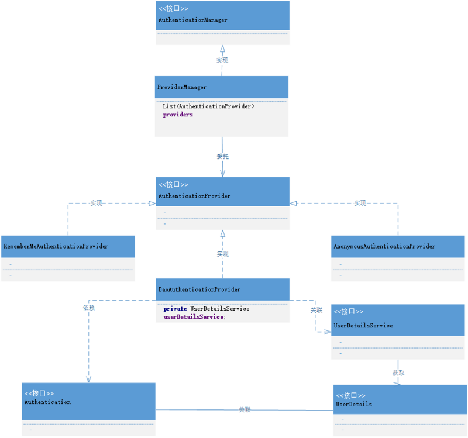
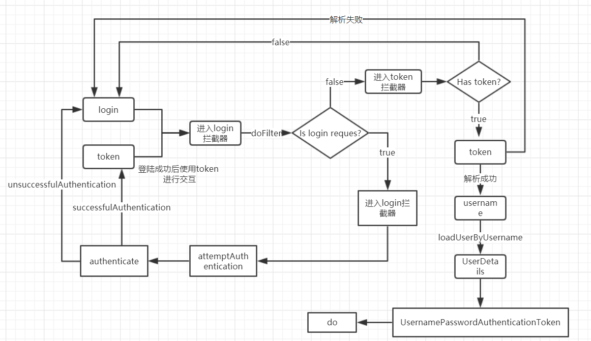

# Spring Security

* [1、Spring Security简介](#1、Spring-Security简介)
* [2、Spring Security核心组件](#2、Spring-Security核心组件)
* [3、Spring Security身份认证](#3、Spring-Security身份认证)
* [4、Spring Security环境配置](#4、Spring-Security环境配置)
* [5、http标签属性](#5、http标签属性)
* [6、Spring Security标签库](#6、Spring-Security标签库)
* [7、Remember-Me](#7、Remember-Me)
* [8、Security token](#8、Security-token)

### 1、Spring Security简介 ###

	Spring Security是基于spring的应用程序提供声明式安全保护的安全性框架，它提供了完整的安全性解决方案，能够在web请求中处理身份证验证和授权。
	使用servlet过滤器(Filter)保护web请求并限制URL级别的访问。

	Spring Security 的作用：
		
		1. 认证(Authentication)

			认证就是判断用户身份是否合法，例如用户名密码登录就是认证，如果一个用户拥有正确的密码，即可通过认证； 

		2. 授权(Authorization)
 
			用户认证通过了，但是每个用户的权限不同，判断用户有哪些权限以及是否有权限访问某些资源，就是授权。

### 常用权限拦截器 ###

> SecurityContextPersistenceFilter

	Spring-Security 的顶级权限拦截器。	

	SecurityContextPersistenceFilter 两个主要职责：

		1. 请求到来时，通过HttpSessionSecurityContextRepository接口从Session中读取SecurityContext，如果读取结果为null，则创建之。

			SecurityContext contextBeforeChainExecution = repo.loadContext(holder);

			// 获得SecurityContext之后，将安全上下文的信息保存到 SecurityContextHolder
			// SecurityContextHolder默认是ThreadLocalSecurityContextHolderStrategy实例
			SecurityContextHolder.setContext(contextBeforeChainExecution);

			// 未读取到SecurityContext则新建一个SecurityContext
			context = generateNewContext();

			// ThreadLocalSecurityContextHolderStrategy中的ContextHolder定义是一个ThreadLocal变量，线程局部变量。
			private static final ThreadLocal<SecurityContext> contextHolder = new ThreadLocal<SecurityContext>();

		2. 请求结束时清空 SecurityContextHolder 上下文信息，并将SecurityContext保存到 HttpSession 中。

			SecurityContext contextAfterChainExecution = SecurityContextHolder
					.getContext();
			SecurityContextHolder.clearContext();
			repo.saveContext(contextAfterChainExecution, holder.getRequest(), holder.getResponse());

> HeaderWriterFilter

	用来给http response添加一些Header，比如X-Frame-Options、X-XSS-Protection*、X-Content-Type-Options。

> LogoutFilter  

	处理退出登录的Filter，如果请求的url为/logout则会执行退出登录操作。

> AbstractAuthenticationProcessingFilter  

	抽象验证处理过滤器。
	基于浏览器的基于HTTP的身份验证请求的抽象处理器类，主要的功能是身份认证。

	该过滤器要求设置 authenticationManager 属性。 
	需要 AuthenticationManager 来处理通过实现类创建的身份验证请求令牌。

	身份验证由 attemptAuthentication(HttpServletRequest,HttpServletResponse) 的 attemptAuthentication 方法执行，该方法必须由子类实现，返回一个具体的 Authentication认证对象。

	如果验证成功，则生成的Authentication对象将被放入当前线程的SecurityContext中，该对象保证已由早期过滤器创建。

	唯一子类 UsernamePasswordAuthenticationFilter

> BasicAuthenticationFilter

	public class BasicAuthenticationFilter extends OncePerRequestFilter

	BasicAuthenticationFilter负责处理HTTP标头中显示的基本身份验证凭据。

	<bean id="basicAuthenticationFilter"
	class="org.springframework.security.web.authentication.www.BasicAuthenticationFilter">
	<property name="authenticationManager" ref="authenticationManager"/>
	<property name="authenticationEntryPoint" ref="authenticationEntryPoint"/>
	</bean>
	
	<bean id="authenticationEntryPoint"
	class="org.springframework.security.web.authentication.www.BasicAuthenticationEntryPoint">
	<property name="realmName" value="Name Of Your Realm"/>
	</bean>

	配置的AuthenticationManager处理每个身份验证请求。 
	如果身份验证失败，将使用配置的AuthenticationEntryPoint重试身份验证过程。 
	通常，您将过滤器与BasicAuthenticationEntryPoint结合使用，后者返回带有合适标头的401响应，以重试HTTP基本身份验证。 
	如果身份验证成功，生成的身份验证对象将照常放入SecurityContextHolder。

	如果身份验证事件成功，或者未尝试进行身份验证，因为HTTP标头不包含受支持的身份验证请求，则过滤器链将正常继续。 
	过滤器链中断的唯一时间是在验证失败时并且调用AuthenticationEntryPoint。

> OncePerRequestFilter  

	过滤基类。多数Filter 都继承它。
	目的：
		保证在任何servlet容器上每次请求调度都执行一次，而不需要重复执行。

	它提供了一个带有 HttpServletRequest和HttpServletResponse参数的 doFilterInternal方法。
	与doFilter 方法作用相同，但保证在单个请求线程中每个请求只调用一次【异步中每个请求会被调用多次】。 
	提供 HttpServletRequest 和 HttpServletResponse 参数，而不是默认的ServletRequest和ServletResponse参数。
	
	protected abstract void doFilterInternal(
			HttpServletRequest request, HttpServletResponse response, FilterChain filterChain)
			throws ServletException, IOException;

	比如：
	RequestAuthenticationFilter 继承 OncePerRequestFilter ，并实现doFilterInternal 方法来拦截请求中的用户名和密码，并将用户信息保存到SecurityContextHolder【保证在单个请求线程中每个请求只调用一次】

	也可用来拦截请求获取是否拥有访问权限。

	protected void doFilterInternal(HttpServletRequest request, HttpServletResponse response, FilterChain filterChain) throws ServletException, IOException, AccessDeniedException {
        Authentication authentication = SecurityContextHolder.getContext().getAuthentication();
        if (authentication != null && authentication.isAuthenticated()) {
            ManageUserDetails manageUserDetails = (ManageUserDetails)authentication.getPrincipal();
            String requestPath = this.getRequestPathNoSuffix(request);
            log.debug("check permission requestPath=" + requestPath);
            if (!manageUserDetails.hasPermission(this.moduleTree.getCommand(requestPath))) {
                throw new AccessDeniedException("Has no permission.");
            }
        }

        filterChain.doFilter(request, response);
    }

> AbstractPreAuthenticatedProcessingFilter【预先认证拦截器】

	用于处理预先认证的身份验证请求的过滤器的基类，其中假定主体已由外部系统进行身份验证。
	目的: 
		从传入的请求中提取关于验证主体的必要信息，而不是对它们进行身份验证。
		外部认证系统可以通过预认证系统提取的诸如报头或cookie之类的请求数据来提供该信息。

	子类必须实现 getPreAuthenticatedPrincipal(httpServletRequest) 和 getPreAuthenticatedCredentials(httpServletRequest) 方法。 
	此过滤器的子类通常与 PreAuthenticatedAuthenticationProvider 结合使用，后者用于为用户加载其他数据。 
	此提供程序将拒绝空凭据，因此 getPreAuthenticatedCredentials方法不应为有效主体返回null。

	如果安全上下文已包含Authentication对象（来自调用过滤器或由于某些其他身份验证机制），则默认情况下过滤器将不执行任何操作。

> UsernamePasswordAuthenticationFilter

	继承自AbstractAuthenticationProcessingFilter

	UsernamePasswordAuthenticationFilter用于处理来自表单提交的认证。
	该表单必须提供对应的用户名和密码，对应的参数名默认为j_username和j_password。
	如果不想使用默认的参数名，可以通过UsernamePasswordAuthenticationFilter的usernameParameter和passwordParameter进行指定。
	表单的提交路径默认是“j_spring_security_check”，也可以通过UsernamePasswordAuthenticationFilter的filterProcessesUrl进行指定。
	通过属性postOnly可以指定只允许登录表单进行post请求，默认是true。
	其内部还有登录成功或失败后进行处理的AuthenticationSuccessHandler和AuthenticationFailureHandler，这些都可以根据需求做相关改变。

	<bean id="authenticationFilter"
	
	  class="org.springframework.security.web.authentication.UsernamePasswordAuthenticationFilter">
	
	      <property name="authenticationManager" ref="authenticationManager" />
	
	      <property name="usernameParameter" value="username"/>
	
	      <property name="passwordParameter" value="password"/>
	
	      <property name="filterProcessesUrl" value="/login.do" />
	
	</bean>

> RequestCacheAwareFilter

	将request存到session中，用于缓存request请求，可以用于恢复被登录而打断的请求。

	public void doFilter(ServletRequest request, ServletResponse response,
			FilterChain chain) throws IOException, ServletException {

		// 从session中获取与当前request匹配的缓存request，并将缓存request从session删除
		HttpServletRequest wrappedSavedRequest = requestCache.getMatchingRequest(
				(HttpServletRequest) request, (HttpServletResponse) response);

		// 如果requestCache中缓存了request，则使用缓存的request
		chain.doFilter(wrappedSavedRequest == null ? request : wrappedSavedRequest,
				response);
	}

> SessionManagementFilter

	和session相关的过滤器，内部维护了一个SessionAuthenticationStrategy，两者组合使用，常用来防止session-fixation protection attack，以及限制同一用户开启多个会话的数量

与登录认证拦截时作用一样，持久化用户登录信息，可以保存到session中，也可以保存到cookie或者redis中。

### 2、Spring Security核心组件 ###

> 2.1、SecurityContextHolder

	SecurityContextHolder它持有的是安全上下文（security context）的信息。
	当前操作的用户是谁，该用户是否已经被认证，他拥有哪些角色权等等，这些都被保存在SecurityContextHolder中。
	SecurityContextHolder默认使用 ThreadLocal 策略来存储认证信息。
	在web环境下，Spring Security 在用户登录时自动绑定认证信息到当前线程，在用户退出时，自动清除当前线程的认证信息。

	获得当前用户的信息，获得已认证用户的名字：

		Object principal = SecurityContextHolder.getContext().getAuthentication().getPrincipal();

		if (principal instanceof UserDetails) {
		  String username = ((UserDetails)principal).getUsername();
		} else {
		  String username = principal.toString();
		}

	getAuthentication()返回了认证信息，getPrincipal()返回了身份信息，UserDetails便是 Spring 对身份信息封装的一个接口。
	可以从 Authentication 对象中获得安全主体，这个安全主体就是一个对象。大多数情况下，可以强制转换成UserDetails对象。

> 2.2、SecurityContext

	安全上下文，主要持有Authentication对象，如果用户未鉴权，那Authentication对象将会是空的。

	public interface SecurityContext extends Serializable { 
		Authentication getAuthentication();
		void setAuthentication(Authentication authentication);
	 }

> 2.3、Authentication

	鉴权、认证对象。
	该对象主要包含了用户的详细信息（UserDetails）和用户鉴权时所需要的信息，如用户提交的用户名密码、Remember-me Token，或者digest hash值等，按不同鉴权方式使用不同的Authentication实现。

	public interface Authentication extends Principal, Serializable {

		 Collection<? extends GrantedAuthority> getAuthorities();

		 Object getCredentials(); 

		 Object getDetails();

		 Object  (); 

		 boolean isAuthenticated();

		 void setAuthenticated(boolean isAuthenticated) throws IllegalArgumentException;
	    }

	Authentication是Spring Security包中的接口，直接继承自Principal类，而Principal是位于java.security包中的。
		
	可以见得，Authentication在spring security中是最高级别的身份/认证的抽象。

	由这个顶级接口，我们可以得到用户拥有的权限信息列表，密码，用户细节信息，用户身份信息，认证信息。

	1. getAuthorities()：
		权限信息列表，默认是GrantedAuthority接口的一些实现类，通常是代表权限信息的一系列字符串。

	2. getCredentials()：
		密码信息，用户输入的密码字符串，在认证过后通常会被移除，用于保障安全。

	3. getDetails()：
		细节信息，web应用中的实现接口通常为 WebAuthenticationDetails，它记录了访问者的 ip 地址和 sessionId 的值。

	4. getPrincipal()：
		最重要的身份信息，大部分情况下返回的是 UserDetails接口的实现类，也是框架中的常用接口之一。

> 2.4、GrantedAuthority

	public interface GrantedAuthority extends Serializable {

	    String getAuthority();
	}

	该接口表示了当前用户所拥有的权限（或者角色）信息。
	这些信息由授权负责对象 AccessDecisionManager 来使用，并决定最终用户是否可以访问某资源（URL或方法调用或域对象）。
	鉴权时并不会使用到该对象。

> 2.5、UserDetails

	这个接口规范了用户详细信息所拥有的字段，譬如用户名、密码、账号是否过期、是否锁定等。
	在Spring Security中，获取当前登录的用户的信息,一般情况是需要在这个接口上面进行扩展，用来对接自己系统的用户。

	public interface UserDetails extends Serializable { 

		Collection<? extends GrantedAuthority> getAuthorities();

		String getPassword(); 

		String getUsername(); 

		boolean isAccountNonExpired();

		 boolean isAccountNonLocked(); 

		 boolean isCredentialsNonExpired(); 

		 boolean isEnabled();
	 }

	 Authentication 的 getCredentials() 与 UserDetails 中的 getPassword()需要被区分对待，前者是用户提交的密码凭证，后者是用户正确的密码，认证器其实就是对这两者的比对。

	 Authentication中的 getAuthorities() 实际是由 UserDetails 的 getAuthorities()传递而形成的。
	 还记得Authentication接口中的 getUserDetails() 方法吗？其中的 UserDetails 用户详细信息便是经过了AuthenticationProvider之后被填充的。

> 2.6、UserDetailsService

	该接口只提供一个方法 loadUserByUsername(String username)。
	一般情况我们都是通过扩展这个接口来显式获取我们的用户信息，用户登陆时传递的用户名和密码也是通过这里这查找出来的用户名和密码进行校验，但是真正的校验不在这里，而是由 AuthenticationManager 以及 AuthenticationProvider 负责验证【两个都是接口】。
	需要强调的是，如果用户不存在，不应返回NULL，而要抛出异常UsernameNotFoundException。

	public interface UserDetailsService {
	 	UserDetails loadUserByUsername(String username) throws UsernameNotFoundException;
	 }

	UserDetailsService 只负责从特定的地方加载用户信息，可以是数据库、redis缓存、接口等，不负责校验密码和权限。

> 2.7、DaoAuthenticationProvider

	Spring Security中实现最简单的 AuthenticationProvider 是DaoAuthenticationProvider，也是最早支持的框架。
	它利用了UserDetailsService（作为DAO）去查找用户名和密码。
	它的用户进行身份验证通过 userdetailsservice 加载 usernamepasswordauthenticationtoken 提交密码进行一对一的比较。

	<authentication-manager id="manageAuthenticationManager" alias="manageAuthenticationManager">
		<authentication-provider ref="daoAuthenticationProvider"/>
	</authentication-manager>

    <bean id="userDetailsService" class="com.sungness.manage.support.security.ManageUserDetailsService">
        <property name="adminUsername" value="${admin.username}"/>
        <property name="adminPassword" value="${admin.password}"/>
    </bean>

    <bean id="daoAuthenticationProvider"
        class="org.springframework.security.authentication.dao.DaoAuthenticationProvider">
        <property name="userDetailsService" ref="userDetailsService"/>
        <property name="passwordEncoder" ref="bcryptEncoder"/>
    </bean>

    <bean id="bcryptEncoder"
      class="org.springframework.security.crypto.bcrypt.BCryptPasswordEncoder">
    </bean>

### 3、Spring Security身份认证 ###

#### 认证步骤 ####

> 1、用户名和密码被过滤器获取到，封装成Authentication，通常情况下是 UsernamePasswordAuthenticationToken 这个实现类；  
> 2、AuthenticationManager【认证入口】身份管理器负责验证这个 Authentication；
	
	ProviderManager 是 AuthenticationManager 接口的实现类。
	ProviderManager 遍历查找支持 UsernamepasswordAuthenticationToken 的 AuthenticationProvider 接口的实现类 provider ，并且调用该 provider.authenticate(authentication); 方法来进行验证。

> 3、认证成功后，AuthenticationManager身份管理器返回一个被填充满了信息的（包括上面提到的权限信息，身份信息，细节信息，但密码通常会被移除）Authentication 对象；
	
	return new UsernamePasswordAuthenticationToken(userDetails, userDetails.getPassword(), token.getAuthorities());

> 4、SecurityContextHolder 安全上下文容器将第3步填充了信息的 Authentication，通过 SecurityContextHolder.getContext().setAuthentication() 方法，保存在 SecurityContextHolder 里。
	
	无论你用什么 UserDetailsService 返回的数据都可以通过SecurityContextHolder获得，用户验证时，SecurityContextHolder包含一个完全填充的Authentication对象的用户进行身份验证。

- AuthenticationManager【接口】是认证相关的核心接口，也是发起认证的出发点，因为在实际需求中，我们可能会允许用户使用用户名+密码登录，同时允许用户使用邮箱+密码，手机号码+密码登录，甚至，可能允许用户使用指纹登录，所以说AuthenticationManager一般不直接认证，AuthenticationManager 接口的常用实现类 ProviderManager 内部会维护一个 List<AuthenticationProvider> providers 列表，存放多种认证方式，实际上这是委托者模式的应用（Delegate）。
- 核心的认证入口始终只有一个：AuthenticationManager，不同的认证方式：用户名+密码（UsernamePasswordAuthenticationToken），邮箱+密码，手机号码+密码登录则对应了三个 AuthenticationProvider 【接口】。

> 内部认证过程：
	
	ProviderManager 实现了AuthenticationManager 接口，ProviderManager 内部有List<AuthenticationProvider> providers 属性，然后委托 AuthenticationProvider 接口 ，遍历该接口的实现类，找到可以支持 认证方式的实现类 provider，然后该实现类调用 provider.authenticate(authentication) 方法来进行数据验证。

	AuthenticationProvider provider = (AuthenticationProvider)var6.next();
    if (provider.supports(toTest)) {
        if (debug) {
            logger.debug("Authentication attempt using " + provider.getClass().getName());
        }

        try {
            result = provider.authenticate(authentication);
            if (result != null) {
                this.copyDetails(authentication, result);
                break;
            }

> 流程图

	Authentication提供的重要方法是getAuthorities()。 这个方法提供了GrantedAuthority对象数组。
	GrantedAuthority是赋予到主体的权限。 这些权限通常使用角色表示，比如ROLE_ADMINISTRATOR 或 ROLE_HR_SUPERVISOR。
	通常情况下，GrantedAuthority对象是应用程序范围下的授权。

#### 认证方式 ####

> 1、内存认证
	
	如果你建立一个原型应用或只是开始集成Spring Security的时候，当我们不是真的需要耗费时间配置数据库或者写 UserDetailsService实现。
	为了这些情况，一个简单的选择是使用安全命名空间中的 user-service元素：

	<user-service id="userDetailsService">
		<user name="jimi" password="jimispassword" authorities="ROLE_USER, ROLE_ADMIN" />
		<user name="bob" password="bobspassword" authorities="ROLE_USER" />
	</user-service>

> 2、JdbcDaoImpl 数据库验证

	Spring Security也包含了一个UserDetailsService， 它包含从一个JDBC数据源中获得认证信息。
	内部使用了Spring JDBC，所以它避免了负责的功能完全的对象关系映射（ORM）只用来保存用户细节。
	如果你的应用使用了一个ORM工具， 你应该写一个自己的UserDetailsService 重用你已经创建了的映射文件。返回到JdbcDaoImpl， 一个配置的例子如下所示：

	<bean id="userDetailsService" class="org.springframework.security.core.userdetails.jdbc.JdbcDaoImpl">
	  	<property name="dataSource" ref="dataSource"/>
	</bean>        

	通过以下几个属性来定义我们自己查询用户信息、用户权限和用户组权限的 SQL。

	users-by-username-query				指定查询用户信息的 SQL
	authorities-by-username-query		指定查询用户权限的 SQL
	group-authorities-by-username-query 指定查询用户组权限的 SQL
	
	<authentication-manager>
		<authentication-provider>
			<jdbc-user-service data-source-ref="dataSource"
                   users-by-username-query="select username,password, enabled from users where username = ?"
                   authorities-by-username-query="select username, authority from authorities where username = ?"/>
		</authentication-provider>
	</authentication-manager>
	
	jdbc-user-service 还有一个属性 role-prefix 可以用来指定角色的前缀。
	当 role-prefix 的值为 “none” 时表示没有前缀，当然默认也是没有的。

> 3、验证的方式有很多种【验证码，用户名和密码等】，自定义验证方式类 Provider，需要实现 AuthenticationProvider。

	@Component
	public class SecurityProvider implements AuthenticationProvider {
	
	    @Resource
	    private MyUserDetailService myUserDetailService;
	
	    /*
	     通过 UserDetailsService和UserDetail来返回一个
	     以UsernamePasswordAuthenticationToken实现的带用户名和密码以及权限的 Authentication
	     */
	    @Override
	    public Authentication authenticate(Authentication authentication) throws AuthenticationException {
	        //前端页面中的用户名和密码【Authentication】使用 UsernamePasswordAuthenticationToken验证
	        UsernamePasswordAuthenticationToken token = (UsernamePasswordAuthenticationToken) authentication;
	
	        //通过查询获取真实的用户对象
	        UserDetails userDetails = myUserDetailService.loadUserByUsername(token.getName());
	
	        //验证
	        if (userDetails == null) {
	            throw new UsernameNotFoundException("用户名不存在");
	        }
	        //前者是用户正确的密码，后者是前端页面提交的密码凭证
	        if (!userDetails.getPassword().equals(token.getCredentials().toString())) {
	            throw new BadCredentialsException("密码错误");
	        }
	        //返回一个正确的用户信息以及用户拥有的权限
	        return new UsernamePasswordAuthenticationToken(userDetails, userDetails.getPassword(), userDetails.getAuthorities());
	    }
	
	    @Override
	    public boolean supports(Class<?> authentication) {
	        return UsernamePasswordAuthenticationToken.class.equals(authentication);
	    }
	}
	
	
	xml:
	<!-- 配置权限拦截，访问所有url，都需要用户登录，且拥有ROLE_USER权限，只能通过 https 访问 -->  
	<intercept-url pattern="/**" access="ROLE_USER" requires-channel="https" />    
	
	<!-- 配置默认用户，用户名：admin 密码：123456 拥有权限：ROLE_USER -->  
	<user-service>
	    <user name="alex" password="123456" authorities="ROLE_USER,ROLE_ADMIN" />
	    <user name="kevin" password="123456" authorities="ROLE_USER" />
	</user-service>

### 4、Spring Security 整体配置 ###

> pom.xml

	<!--spring security  -->
	<dependency>
	  <groupId>org.springframework.security</groupId>
	  <artifactId>spring-security-core</artifactId>
	  <version>4.2.2.RELEASE</version>
	</dependency>
	<dependency>
	  <groupId>org.springframework.security</groupId>
	  <artifactId>spring-security-web</artifactId>
	  <version>4.2.2.RELEASE</version>
	</dependency>
	<dependency>
	  <groupId>org.springframework.security</groupId>
	  <artifactId>spring-security-config</artifactId>
	  <version>4.2.2.RELEASE</version>
	</dependency>

> 配置spring-security命名空间【两种方式】：

	方式一：
	<beans xmlns="http://www.springframework.org/schema/beans"
	  xmlns:security="http://www.springframework.org/schema/security"
	  xmlns:xsi="http://www.w3.org/2001/XMLSchema-instance"
	  xsi:schemaLocation="http://www.springframework.org/schema/beans
	          http://www.springframework.org/schema/beans/spring-beans-3.0.xsd
	          http://www.springframework.org/schema/security
	          http://www.springframework.org/schema/security/spring-security-3.1.xsd">

	    <security:http 
	    ...
	</beans>
  
	使用"security"作为默认的命名空间，而不是"beans"，这意味着我们可以省略所有security命名空间元素的前缀，使上下文更容易阅读。

	方式二：
	如果你把应用上下文分割成单独的文件，让你的安全配置都放到其中一个文件里，这样更容易使用这种配置方法。 
	你的安全应用上下文应该像这样开头

	<beans:beans xmlns="http://www.springframework.org/schema/security"
	  xmlns:beans="http://www.springframework.org/schema/beans"
	  xmlns:xsi="http://www.w3.org/2001/XMLSchema-instance"
	  xsi:schemaLocation="http://www.springframework.org/schema/beans
	           http://www.springframework.org/schema/beans/spring-beans-3.0.xsd
	           http://www.springframework.org/schema/security
	           http://www.springframework.org/schema/security/spring-security-3.1.xsd">

	     <http 
	    ...
	</beans:beans>

> DelegatingFilterProxy 委托过滤器代理

	当使用Servlet过滤器时，需要声明他们的web.xml，否则将被servlet容器忽略。
	在Spring Security，过滤器类也都在Spring bean中定义应用上下文，从而能够利用Spring的丰富的依赖注入和生命周期接口的优势。
	Spring 的 DelegatingFilterProxy 提供web.xml和应用程序上下文之间的链接。

	DelegatingFilterProxy 是标准Servlet过滤器的代理，委托给实现Filter接口的Spring管理的bean。 支持web.xml中的“targetBeanName”过滤器init-param，在Spring应用程序上下文中指定目标bean的名称。
	web.xml 中通常包含一个 DelegatingFilterProxy 定义，其指定的filter-name对应于Spring的根应用程序上下文中的bean名称。
	然后，将对Spring上下文中的所有bean调用委托给该bean，这是实现标准Servlet所必需的过滤界面。
	在这种情况下，bean被命名为“springSecurityFilterChain”，它是由命名空间创建的内部基础结构bean，用于处理Web安全性。
	

	DelegatingFilterProxy 这个类位于spring-web-x.x.x.RELEASE.jar这个jar下面, 说明这个类本身是和SpringSecurity无关。
	这个类的作用其实是把过滤这个动作代理给 springSecurityFilterChain 所对应的类【 FilterChainProxy】来处理。
	主要作用就是一个代理模式的应用,可以把servlet 容器中的filter同spring容器中的bean关联起来。

> 配置 web.xml
	
	我们要做的第一件事是把下面的filter声明添加到 web.xml 文件中：

	<filter>
	  <filter-name>springSecurityFilterChain</filter-name>
	  <filter-class>org.springframework.web.filter.DelegatingFilterProxy</filter-class>
	</filter>

	<filter-mapping>
	  <filter-name>springSecurityFilterChain</filter-name>
	  <url-pattern>/*</url-pattern>
	</filter-mapping>

> 配置 applicationContext-security.xml

	1. 配置一些不需要安全验证的资源:
	
		<http pattern="/bootstrap/**" security="none"/>
	    <http pattern="/js/**" security="none"/>
	    <http pattern="/manage/login" security="none"/>
	    <http pattern="/manage/loginFailed" security="none"/>
	    <http pattern="/manage/sessionOut" security="none"/>

	2. 配置AuthenticationManager
	
		<authentication-manager id="manageAuthenticationManager"
	                            alias="manageAuthenticationManager">
	
	        <authentication-provider ref="daoAuthenticationProvider"/>
	    </authentication-manager>
	
		<bean id="userDetailsService"
	          class="com.sungness.manage.support.security.ManageUserDetailsService">
	        <property name="adminUsername" value="${admin.username}"/>
	        <property name="adminPassword" value="${admin.password}"/>
	    </bean>
	
		<bean id="bcryptEncoder"
	          class="org.springframework.security.crypto.bcrypt.BCryptPasswordEncoder">
	    </bean>
	
	    <bean id="daoAuthenticationProvider"
	          class="org.springframework.security.authentication.dao.DaoAuthenticationProvider">
	        <property name="userDetailsService" ref="userDetailsService"/>
	        <property name="passwordEncoder" ref="bcryptEncoder"/>
	    </bean>

		【说明】
		在Spring Security 3.0之前，AuthenticationManager会被自动创建。 但在3.0之后, 我们需要手动配置 <authentication-manager> 标签。
		这个标签会创建一个ProviderManager实例，ProviderManager可以提供一个或多个AuthenticationProvider(如: dao,ldap,cas等等) 认证提供器。
		创建 AuthenticationProvider 具体实例，其中提供了获取用户数据【UserDetails】的服务层类。
		服务层类可以自定义也可以使用 Spring Security 提供的。
		
		如果我们把权限信息都存在数据库里, 那这里就需要配置一个DaoAuthenticationProvider实例。
		DaoAuthenticationProvider里需要配置一个实现了UserDetailsService接口的实例，重写loadUserByUsername(String username) 方法来获取用户信息【UserDetails】。这其实就是我们经常要在业务层里写的东西。

	3. 配置收到HTTP请求时的安全验证配置:
	
		<http authentication-manager-ref="manageAuthenticationManager" entry-point-ref="ajaxEntyPoint">
	        <intercept-url pattern="/manage/**" access="isAuthenticated()"/>
	        <custom-filter ref="commandAccessDecisionFilter" after="LAST"/>
	        <expression-handler ref="expressionHandler"/>
	        <form-login login-page="/manage/login"
	                    authentication-success-handler-ref="manageAuthenticationSuccessHandler"
	                    authentication-failure-url="/manage/loginFailed"/>
	        <logout logout-url="/manage/logout" delete-cookies="JSESSIONID"
	                logout-success-url="/manage/logoutSuccess"/>
	        <session-management session-authentication-error-url="/manage/sessionOut"/>
	        <access-denied-handler error-page="/manage/noPermission"/>
	        <csrf disabled="true" />
	        <anonymous enabled="false"/>
	    </http>

### 5、http标签属性 ###

> auto-config="true" 

	会自动创建登录页面 。

> authentication-manager-ref

	指定了默认的authentication-manager 权限认证管理器。

	当配置了多个 authentication-manager 来管理来自不同方向的认证管理时，就需要告诉 security 默认使用哪个 authentication-manager。

	<authentication-manager id="manageAuthenticationManager"
                            alias="manageAuthenticationManager">
        <authentication-provider ref="daoAuthenticationProvider"/>
    </authentication-manager>

    <authentication-manager id="internalAuthenticationManager"
                            alias="internalAuthenticationManager">
        <authentication-provider>
            <user-service>
                <user name="app211" password="rut2okie" authorities="ROLE_APP211" />
            </user-service>
        </authentication-provider>
    </authentication-manager>

	<http authentication-manager-ref="manageAuthenticationManager" ...

> use-expressions="true" 

	需要使用Spring 表达式语言配置访问权限 。

> expression-handler

	指定基于表达式的权限控制器
	
	<expression-handler ref="expressionHandler"/>

	<!-- sec标签中 模块、命令权限校验 hasPermission -->
    <bean id="managePermissionEvaluator"
          class="com.sungness.manage.support.security.ManagePermissionEvaluator"/>

    <bean id="expressionHandler"
          class= "org.springframework.security.web.access.expression.DefaultWebSecurityExpressionHandler">
        <property name="permissionEvaluator" ref="managePermissionEvaluator"/>
    </bean>

> entry-point-ref = ""

	配置一个 AuthenticationEntryPoint【入口拦截器】 的实现类。
	作用: 当一个未授权的用户请求非公有资源时, 这个类的 commence 【开始】方法将会被调用, 定义如何处理这个请求，比如登录跳转。
	常用的有 LoginUrlAuthenticationEntryPoint 实现类, 把请求重定向到登录页面。
	也可以自定义一个实现类, 处理具体的操作, 如记录日志, 返回到自定义的403页面等等。

	比如：
	<bean id="ajaxEntyPoint"
          class="com.sungness.manage.support.security.authentication.HttpStatusWithBodyEntryPoint">
        <constructor-arg name="httpStatus"
                         value="#{T(org.springframework.http.HttpStatus).UNAUTHORIZED}"/>
        <constructor-arg name="redirectURI" value="/manage/sessionOut"/>
    </bean>

	public final class HttpStatusWithBodyEntryPoint implements AuthenticationEntryPoint {
	    private final HttpStatus httpStatus;
	    private final String redirectURI;
	
	    public HttpStatusWithBodyEntryPoint(HttpStatus httpStatus, String redirectURI) {
	        Assert.notNull(httpStatus, "httpStatus cannot be null");
	        this.httpStatus = httpStatus;
	        this.redirectURI = redirectURI;
	    }
	
	    public void commence(HttpServletRequest request, HttpServletResponse response, AuthenticationException authException) throws IOException, ServletException {
	        response.sendRedirect(this.redirectURI);
	    }
	}

> intercept-url

	拦截的URL

	<http>
		<intercept-url pattern="/**" access="hasRole('USER')" />
		...
	</http>

	access 表示需要的权限
	这说明我们希望应用程序中的所有URL都是安全的，需要角色ROLE_USER来访问它们，
	您可以使用多个<intercept-url>元素为不同的URL 定义不同的访问要求，但它们将按列出的顺序进行判断，并将使用第一个匹配项。

> access-denied-handler=""

	配置一个AccessDeniedHandler的实现类。
	作用:  当一个已授权(或已登陆)的用户请求访问他权限之外的资源时, 这个类的handle方法将会被调用, 定义如何处理这个请求。

	AccessDeniedHandler与AuthenticationEntryPoint的区别:
		AccessDeniedHandler: 		已授权的用户请求权限之外的资源时会交给这个类处理
		AuthenticationEntryPoint: 	未授权的用户请求非公共资源时会交给这个类处理

> custom-filter 【重点】

	配置自定义的过滤器, 一般要自己配置 UsernamePasswordAuthenticationFilter 和 FilterSecurityInterceptor。
		
	<http>
		<custom-filter position="FORM_LOGIN_FILTER" ref="myFilter" />
	</http>

	你也可以使用after和before属性来让你的过滤器插入到列表中的其他过滤器的前面和后面。
	FIRST 和 LAST 可以用在 position 属性来设置你希望将你的过滤器插入到整个列表的前面或者后面。

> FilterSecurityInterceptor

	它负责处理对所有非公有资源请求的安全验证。

> session-management

	Spring Security 通过http元素下的子元素 session-management 提供了对 Http Session 管理的支持。
	invalid-session-url 指定使用已经超时的 sessionId 进行请求需要重定向的页面 ；

	<session-management session-authentication-error-url="/manage/sessionOut" invalid-session-url="login.jsp"/>

> 基于表达式的权限控制

	使用 hasPermission 表达式

	Spring Security为我们定义了 hasPermission 的两种使用方式，它们分别对应着PermissionEvaluator 接口的两个不同的 hasPermission()方法。

	Spring Security 默认处理 Web、方法的表达式处理器分别为DefaultWebSecurityExpressionHandler 和 DefaultMethodSecurityExpressionHandler，它们都继承自 AbstractSecurityExpressionHandler，其所持有的 PermissionEvaluator是DenyAllPermissionEvaluator，其对于所有的 hasPermission表达式都将返回false。

	所以当我们要使用表达式hasPermission时，我们需要自已手动定义 SecurityExpressionHandler对应的bean定义，然后指定其PermissionEvaluator为我们自己实现的PermissionEvaluator，然后通过 global-method-security元素或http元素下的expression-handler元素指定使用的SecurityExpressionHandler为我们自己手动定义的那个bean。

	自定义SecurityExpressionHandler实现类，然后实现 PermissionEvaluator 方法。
	这里我们选择配置一个针对于方法调用使用的表达式处理器，DefaultMethodSecurityExpressionHandler，具体如下所示。

	<bean id="expressionHandler"
  	class="org.springframework.security.access.expression.method.DefaultMethodSecurityExpressionHandler">

      <property name="permissionEvaluator" ref="myPermissionEvaluator" />

	</bean>

	<!-- 自定义的PermissionEvaluator实现 -->

	<bean id="myPermissionEvaluator" class="com.xxx.MyPermissionEvaluator"/>

	有了SecurityExpressionHandler之后，我们还要告诉Spring Security，在使用SecurityExpressionHandler时应该使用我们显示配置的那个，这样我们自定义的PermissionEvaluator才能起作用。
	因为我们上面定义的是针对于方法的SecurityExpressionHandler，所以我们要指定在进行方法权限控制时应该使用它来进行处理，同时注意设置pre-post-annotations="true"以启用对支持使用表达式的@PreAuthorize等注解的支持。

	<security:global-method-security pre-post-annotations="enabled">

      <security:expression-handler ref="expressionHandler" />

	</security:global-method-security>

 
	之后我们就可以在需要进行权限控制的方法上使用 @PreAuthorize以及 hasPermission()表达式进行权限控制了。
	@PreAuthorize("hasPermission('user', 'ROLE_ADMIN')")
	public void add(User user) {
		// TODO
	}

> Pre-Authentication【预先认证】

	概念：
		预先认证是指用户在进入系统之前，就已经通过某种机制进行过身份认证，请求中已经附带了身份认证的信息。
		这时我们只需要从获得这些身份认证信息，并对用户进行授权即可。
		CAS, X509等都属于这种情况。

	目的：
		Spring Security框架提供了认证和授权的功能，但是有可能只希望使用Spring Security的授权功能，而不使用它提供的认证功能，比如使用一些其他认证方式，那么就可以使用Pre-Authentication。

	<http  create-session="never">
	    <!-- 省略其他配置 -->
	    <security:custom-filter position="PRE_AUTH_FILTER" ref="preauthFilter" />
	</http>

	配置：
		需要添加一个position="PRE_AUTH_FILTER"的Filter，这个Filter继承抽象类AbstractPreAuthenticatedProcessingFilter：

	比如：
	public class PreauthFilter extends AbstractPreAuthenticatedProcessingFilter {
	
	    /**
	    * 重写，返回用户名，这个用户名是经过其他方式认证过
	    */
	    @Override
	    protected Object getPreAuthenticatedPrincipal(HttpServletRequest request) {
	        if (authenticated) {
	            // 可以通过request获取当前认证过的用户名，比如通过参数、HTTP请求头或者Cookie获取token，再通过token调用第三方接口获取用户名
	            return "your_username";
	        } else {
	            // 如果认证失败，可以抛出异常
	            throw new PreAuthenticatedCredentialsNotFoundException("认证失败");
	        }
	    }
	
	    /**
	    * 这个方法一般情况下不需要重写，直接返回空字符串即可
	    */
	    @Override
	    protected Object getPreAuthenticatedCredentials(HttpServletRequest request) {
	        return "";
	    }
	}

	另外还有个重点配置 UserDetailsService，这个是用于用户认证后的授权。
	这里需要一个UserDetailsService的实现类，来获取用户的所有信息 UserDetails。

	也可以实现 AuthenticationUserDetailsService 接口的 loadUserDetails(Authentication authentication) 获取用户的所有信息 UserDetails。

> 使用场景

	如果是普通的浏览器访问的Web，以上完成配置后，用户在浏览器上首次访问会调用AbstractPreAuthenticatedProcessingFilter 的 getPreAuthenticatedPrincipal 方法以及UserDetailsService 的 loadUserByUsername 方法来获取认证用户和授权，并将相关信息保存到Session中，后续的请求直接通过Session获取用户信息，不再重复调用这些方法。

	对于API接口来说，一般情况下不会使用Session来做会话控制，例如可能会通过token的方式。

> Spring Security中无Session和无状态stateless

	1. Spring Security默认的行为是每个登录成功的用户会新建一个Session。

		<http create-session="ifRequired">...</http>

	2. Spring Security禁用Session

		<http create-session="never">
	    	<!-- 省略其他配置 -->
		</http>

		Spring Security对登录成功的用户不会创建Session了，但你的application还新建了session，那么Spring Security会用它的。

	3. 无状态的web调用的stateless authentication
		
		<http  create-session="stateless">
		    <!-- 省略其他配置 -->
		</http>

		Spring Security对登录成功的用户不会创建Session了，你的application也不会允许新建session，而且Spring Security会跳过所有的 filter chain：HttpSessionSecurityContextRepository, SessionManagementFilter, RequestCacheFilter. 

		对于API接口来说，一般情况下不会使用Session来做会话控制，例如可能会通过token的方式。
		
		API接口相对来说每次接口访问都是无状态的，所以针对每次请求都需要重新认证和授权。

> 获取 userDetails

	方法1：
		实现接口AuthenticationUserDetailsService 的 loadUserDetails(Authentication authentication) 方法

	方法2：
		实现了UserDetailsService接口的实例，重写loadUserByUsername(String username) 方法来获取用户信息【UserDetails】

#### 会话管理 ####

> 1、检测超时
	
	你可以配置Spring Security检测失效的session ID， 并把用户转发到对应的URL。这可以通过 session-management 元素配置：

	<http>
		...
		<session-management invalid-session-url="/invalidSession.htm" />
	</http>

	【注意】如果你使用了检测会话超时的机制，它可能在用户注销后没有关闭浏览器又再次登录时发出错误报告。
	需要在注销时特别删除JSESSIONID cookie，比如使用下面所示的注销处理器语法：

	  <http>
	    <logout delete-cookies="JSESSIONID" />
	  </http>

> 2、同步会话控制 -- concurrency-control

	通常情况下，在你的应用中你可能只希望同一用户在同时登录多次时只能有一个是成功登入你的系统的，通常对应的行为是后一次登录将使前一次登录失效，或者直接限制后一次登录。
	Spring Security的 session-management 为我们提供了这种限制。

	首先需要我们在web.xml中定义如下监听器。

	<listener>
   		<listener-class>org.springframework.security.web.session.HttpSessionEventPublisher</listener-class>
	</listener>

	用来限制同一用户在应用中同时允许存在的已经通过认证的session数量。这个值默认是1，可以通过 concurrency-control 元素的 max-sessions 属性来指定。

	   <http auto-config="true">
	      ...
	      <session-management>
	         <concurrency-control max-sessions="1"/>
	      </session-management>
	      ...
	   </http>

	当同一用户同时存在的已经通过认证的session数量超过了max-sessions所指定的值时，Spring Security的默认策略是将先前的设为无效。
	如果要限制用户再次登录可以设置 concurrency-control 的 error-if-maximum-exceeded 的值为 true。

	<http auto-config="true">
      ...
      <session-management>
         <concurrency-control max-sessions="1" error-if-maximum-exceeded="true"/>
      </session-management>
      ...
	</http>

	设置 error-if-maximum-exceeded为 true 后，如果你之前已经登录了，然后想再次登录，那么系统将会拒绝你的登录，同时将重定向到由form-login 指定的 authentication-failure-url 。
	如果你的再次登录是通过 Remember-Me 来完成的，那么将不会转到 authentication-failure-url，而是返回未授权的错误码401【unauthorized】给客户端。
	如果你还是想重定向一个指定的页面，那么你可以通过 session-management 的 session-authentication-error-url 属性来指定，同时需要指定该url为不受Spring Security管理，即通过http元素设置其 security=”none”。

	<http security="none" pattern="/none/**" />

	<http>
		<form-login/>
		<logout/>
		<intercept-url pattern="/**" access="ROLE_USER"/>
		
		<!-- session-authentication-error-url 必须是不受Spring Security管理的 -->
		<session-management session-authentication-error-url="/none/session_authentication_error.jsp">
		 	<concurrency-control max-sessions="1" error-if-maximum-exceeded="true"/>
		</session-management>
		<Remember-Me />
	</http>

	在上述配置中我们配置了  session-authentication-error-url 为"/none/session_authentication_error.jsp"，同时我们通过<http security="none" pattern="/none/**" />指定了以“/none”开始的所有URL都不受Spring Security控制，这样当用户进行登录以后，再次通过 Remember-Me 进行自动登录时就会重定向到“/none/session_authentication_error.jsp”了。

	【注】
	在上述配置中为什么我们需要通过<http security="none" pattern="/none/**" />指定我们的session-authentication-error-url不受Spring Security控制呢？把它换成<intercept-url pattern="/none/**"access="IS_AUTHENTICATED_ANONYMOUSLY"/>不行吗？这就涉及到之前所介绍的它们两者之间的区别了。

	前者表示不使用任何Spring Security过滤器，自然也就不需要通过Spring Security的认证了，而后者是会被 Spring Security 的 FilterChain 进行过滤的，只是其对应的URL可以匿名访问，即不需要登录就可访问。
	使用后者时，REMEMBER_ME_FILTER检测到用户没有登录，同时其又提供了Remember-Me的相关信息，这将使得REMEMBER_ME_FILTER进行自动登录，那么在自动登录时由于我们限制了同一用户同一时间只能登录一次，后来者将被拒绝登录，这个时候将重定向到session-authentication-error-url，重定向访问 session-authentication-error-url 时，经过REMEMBER_ME_FILTER时又会自动登录，这样就形成了一个死循环。
	所以 session-authentication-error-url 应当使用 <http security="none" pattern="/none/**" /> 设置为不受Spring Security控制，而不是使用<intercept-url pattern="/none/**"access="IS_AUTHENTICATED_ANONYMOUSLY"/>。

	此外，可以通过 expired-url 属性指定当用户尝试使用一个由于其再次登录导致 session超时的 session时所要跳转的页面。同时需要注意设置该URL为不需要进行认证。

	<http auto-config="true">
      <form-login/>
      <logout/>
      <intercept-url pattern="/expired.jsp" access="IS_AUTHENTICATED_ANONYMOUSLY"/>
      <intercept-url pattern="/**" access="ROLE_USER"/>
      <session-management>
         <concurrency-control max-sessions="1" expired-url="/expired.jsp" />
      </session-management>
	</http>

> 3、session 固定攻击保护

	session固定是指服务器在给客户端创建session后，在该session过期之前，它们都将通过该session进行通信。
	session 固定攻击是指恶意攻击者先通过访问应用来创建一个session，然后再让其他用户使用相同的session进行登录（比如通过发送一个包含该sessionId参数的链接），待其他用户成功登录后，攻击者利用原来的sessionId访问系统将和原用户获得同样的权限。
	Spring Security默认是对session固定攻击采取了保护措施的，它会在用户登录的时候重新为其生成一个新的session。
	如果你的应用不需要这种保护或者该保护措施与你的某些需求相冲突，你可以通过session-management的session-fixation-protection属性来改变其保护策略。

	该属性的可选值有如下三个：

		migrateSession：这是默认值。其表示在用户登录后将新建一个session，同时将原session中的attribute都copy到新的session中。
	
		none：表示继续使用原来的session。
	
		newSession：表示重新创建一个新的session，但是不copy原session拥有的attribute。

### 验证登录页面 ###

> 登录相关的过滤器：

	spring security 3.x 默认的登录拦截 URL 是  /j_spring_security_check，而spring security 4.x默认拦截的 URL是 /login。
	在spring security中，具体处理表单登录验证的是 UsernamePasswordAuthenticationFilter ,另外一个过滤器 DefaultLoginPageGeneratingFilter 用于在没有指定登录页时动态生成一个默认登录页。

> form-login 是spring security命名空间配置登录相关信息的标签，属性如下:

	1. login-page 自定义登录页url，默认为/login ；

	2. login-processing-url 登录请求拦截的url，也就是form表单提交时指定的action ；

	3. default-target-url 默认登录成功后跳转的url ；

	4. always-use-default-target 是否总是使用默认的登录成功后跳转url ；

	5. authentication-failure-url 登录失败后跳转的url ；

	6. username-parameter 用户名的请求字段，默认为userName ；

	7. password-parameter 密码的请求字段，默认为password ；

	8. authentication-success-handler-ref 指向一个AuthenticationSuccessHandler用于处理认证成功的请求,不能和default-target-url还有always-use-default-target同时使用 ；

	9. authentication-success-forward-url 用于authentication-success-handler-ref ；

	10. authentication-failure-handler-ref 指向一个AuthenticationFailureHandler用于处理失败的认证请求 ；

	11. authentication-failure-forward-url 用于authentication-failure-handler-ref ；

	12. authentication-details-source-ref 指向一个AuthenticationDetailsSource,在认证过滤器中使用；

> 认证成功后如何处理请求的处理器：

	如果配置了authentication-success-handler-ref，则首先使用该配置的；
	如果配置了authentication-success-forward-url，则使用该配置的；
	如果都没有配置则采用的 SavedRequestAwareAuthenticationSuccessHandler 进行处理。

- URL在跳转前进行请求数据的缓存，是缓存到session中，认证成功后会从缓存中提取请求，从而可以恢复之前请求的数据。
- spring security 默认情况下csrf 保护是开启的,由于我们的登录页没有配置csrf的相关信息，因此spring security内置的过滤器将此链接置为无效链接。

> 自定义登录页面 需要配置 csrf
	
	<input type="hidden" name="${_csrf.parameterName}" value="${_csrf.token}" />

> 如果不开启 csrf，可以在 xml 配置文件中设置  

	<csrf disabled="true"/>。

> 默认登陆页面

	<http pattern="/css/**" security="none"/>
	<http pattern="/login.jsp*" security="none"/>
	
	<http auto-config='true'>
		<intercept-url pattern="/**" access="ROLE_USER" />
		<form-login login-page='/login.jsp'/>
	</http>
  
	如果一个http 没有配置pattern属性，它就会过滤所有请求。 
	如果你希望使用基本认证，代替表单登录，可以把配置改为：

	<http auto-config='true'>
    	<intercept-url pattern="/**" access="ROLE_USER" />
    	<http-basic />
	</http>

> access-success-handler="" 

	认证成功处理器
	作用:  处理认证成功的请求。

	<bean id="manageAuthenticationSuccessHandler"
          class="com.sungness.manage.support.security.handler.ManageAuthenticationSuccessHandler">
        <property name="defaultTargetUrl" value="/manage/index"/>
        <property name="defaultJsonSuccessURL" value="/manage/loginSuccessJson"/>
    </bean>

### 6、Spring Security标签库 ###

> 标签库：

	<%@ taglib prefix="sec" uri="http://www.springframework.org/security/tags" %>

	<sec:authorize access="hasRole('supervisor')">
		此内容只对具有"supervisor"权限的用户可见。
	</sec:authorize>

	<sec:authorize access="hasPermission(#domain,'read') or hasPermission(#domain,'write')">
		对于名为"domain"的请求属性，只有具有读取或写入权限的用户才能看到该内容。
	</sec:authorize>

	<sec:authorize url="/admin">
		此内容仅对有权将请求发送到"/ admin"链接的用户可见。
	</sec:authorize>

	<sec:accesscontrollist hasPermission="1,2" domainObject="${someObject}">
		如果用户具有给定对象上的值"1"或"2"表示的所有权限，则会显示此信息。
	</sec:accesscontrollist>

	<http>
			...
			<remember-me key="myAppKey"/>
	</http>

### 7、Remember Me ###

> 概述

	Remember-me or persistent-login authentication 是指网站能够记住会话之间的主体身份。 
	这通常通过向浏览器发送cookie来实现，在将来的会话期间检测到cookie并导致自动登录。 
	Spring Security为这些操作提供了必要的钩子，并且有两个具体的 Remember-me实现：一个使用散列来保护基于cookie的令牌的安全性，另一个使用数据库或其他持久存储机制来存储生成的令牌。
	【注】这两个实现都需要 UserDetailsService。 
	如果您使用的身份验证提供程序不使用 UserDetailsService（例如，LDAP提供程序），那么除非您的应用程序上下文中还有UserDetailsService bean，否则它将无效。

> 实现1 -- 简单的基于哈希的token方法

	这种方法使用散列来实现有用的记住策略。 
	本质上，在成功进行交互式身份验证后，cookie将被发送到浏览器，其中cookie的组成如下：

		base64(username + ":" + expirationTime + ":" +
		md5Hex(username + ":" + expirationTime + ":" password + ":" + key))
		
		username:          As identifiable to the UserDetailsService
		password:          That matches the one in the retrieved UserDetails
		expirationTime:    The date and time when the remember-me token expires, expressed in milliseconds
		key:               A private key to prevent modification of the remember-me token

	启用remember-me身份验证，只需要添加元素 remember-me

		<http>
		...
		<remember-me key="myAppKey"/>
		</http>

	通常会自动选择UserDetailsService。 
	如果应用程序上下文中有多个，则需要指定与user-service-ref属性一起使用的属性，其中值是UserDetailsService bean的名称。

> 实现2 -- 持久令token方法

	需要提供 数据源参考

	<http>
	...
	<remember-me data-source-ref="someDataSource"/>
	</http>

	数据库应包含使用以下SQL（或等效的）创建的persistent_logins表：

	create table persistent_logins (username varchar(64) not null,
								series varchar(64) primary key,
								token varchar(64) not null,
								last_used timestamp not null)

> Remember-Me 的接口和实现

	Remember-Me 与 UsernamePasswordAuthenticationFilter 一起使用，并通过 AbstractAuthenticationProcessingFilter 超类中的钩子实现。 
	它也在BasicAuthenticationFilter中使用。 
	钩子将在适当的时间调用具体的 RememberMeServices。 

	public interface RememberMeServices {

		Authentication autoLogin(HttpServletRequest request, HttpServletResponse response);
		
		void loginFail(HttpServletRequest request, HttpServletResponse response);
		
		void loginSuccess(HttpServletRequest request, HttpServletResponse response,
			Authentication successfulAuthentication);
	}

	AbstractAuthenticationProcessingFilter仅调用loginFail（）和loginSuccess（）方法。
	每当SecurityContextHolder不包含身份验证时，RememberMeAuthenticationFilter都会调用autoLogin（）方法。
	
	public abstract class AbstractRememberMeServices implements RememberMeServices

> TokenBasedRememberMeServices

	public class TokenBasedRememberMeServices extends AbstractRememberMeServices

	支持 简单的基于哈希的token方法。
	TokenBasedRememberMeServices 生成 RememberMeAuthenticationToken，交给 RememberMeAuthenticationProvider 处理。
	密钥key 在 authentication provider 和 TokenBasedRememberMeServices之间共享。
	此外，TokenBasedRememberMeServices需要一个UserDetailsService，它可以从中检索用户名和密码以进行签名比较，并生成RememberMeAuthenticationToken【包含正确GrantedAuthority的一个UserDetailsService】。
	应用程序应提供某种logout命令，如果用户请求，则会使cookie无效。 
	TokenBasedRememberMeServices还实现了Spring Security的LogoutHandler接口，因此可以与LogoutFilter一起使用以自动清除cookie。

	添加 remember-me services

	<bean id="rememberMeFilter" class=
	"org.springframework.security.web.authentication.rememberme.RememberMeAuthenticationFilter">
		<property name="rememberMeServices" ref="rememberMeServices"/>
		<property name="authenticationManager" ref="theAuthenticationManager" />
	</bean>
	
	<bean id="rememberMeServices" class=
	"org.springframework.security.web.authentication.rememberme.TokenBasedRememberMeServices">
		<property name="userDetailsService" ref="myUserDetailsService"/>
		<property name="key" value="springRocks"/>
	</bean>
	
	<bean id="rememberMeAuthenticationProvider" class=
	"org.springframework.security.authentication.RememberMeAuthenticationProvider">
		<property name="key" value="springRocks"/>
	</bean>

> PersistentTokenBasedRememberMeServices

	public class PersistentTokenBasedRememberMeServices extends AbstractRememberMeServices

	支持 基于数据库的持久令token方法

> remember-me属性是spring security命名空间中实现自动登录的专属配置项,它有如下属性:

	1. key：用来辨别分辨不同项目的cookie ；
	2. authentication-success-handler-ref ：指向一个AuthenticationSuccessHandler ；
	3. data-source-ref：指向一个DataSource数据源 ；
	4. remember-me-cookie：cookie存放的名称，默认为’remember-me’；
	5. remember-me-parameter：触发自动登录的请求参数名称.默认为’remember-me’； 
	6. services-alias：声明一个内部定义的RememberMeServices的bean的别名,提供给程序的其他bean使用 ；
	7. services-ref：指向一个RememberMeServices,可以自定义实现自己的自动登录逻辑 ；
	8. token-repository-ref：指向一个PersistentTokenRepository bean,用来实现持久化令牌的自动登录； 
	9. token-validity-seconds：cookie存在的时间周期,单位为秒 ；
	10. use-secure-cookie：是否设置"secure"标志,具体使用不详 ；
	11. user-service-ref：指向一个UserDetailsService的bean；

### 8、Security token ###
	

> security TokenService 接口

	package org.springframework.security.core.token;

	public interface TokenService {

		// 根据扩展信息生成新的token ，可以被 verifyToken 识别
		Token allocateToken(String extendedInformation);
	
		// 根据token的getKey() 获取的key来 验证token
		Token verifyToken(String key);
	}

> security token 接口

	package org.springframework.security.core.token;
	
	public interface Token {

		String getKey();					// 获取token的键
	
		long getKeyCreationTime();
		
		String getExtendedInformation();	// 获取token的 扩展信息
	}

> token 构成

	String tokenString = 终端id + 分隔符 + 用户id + 分隔符 + 客户端密钥 + 分隔符 + 服务端密钥

	使用AES 加密

	/**
     * 根据用户名和扩展信息创建用户会话token
     * @param ctype int 终端类型id
     * @param uid String 用户uid
     * @param clientSecret String 客户端密钥，不能带下划线"_"
     * @param encryptKey String 服务器端生成的加密、解密密钥
     * @return Token token对象
     */
	public Token create(int ctype, String uid, String clientSecret, String encryptKey) {
        String sb = String.valueOf(ctype) +
                EXTENDED_DELIMITER + uid +
                EXTENDED_DELIMITER + clientSecret +
                EXTENDED_DELIMITER + encryptKey;
        return create(sb);
    }

	public Token create(String extendedInformation){
        return tokenService.allocateToken(extendedInformation);
    }

> 操作 token

	public class KeyBasedPersistenceTokenService implements TokenService, InitializingBean {

	通过 TokenService 的实现类 KeyBasedPersistenceTokenService 类来管理 token 服务。

> 验证token有效性

	private KeyBasedPersistenceTokenService tokenService;

	public Token verify(String key) {
        return tokenService.verifyToken(key);
    }

> 验证token有效性，并从中解析出扩展信息对象

    public ExtendedInfo getExtendedInfo(String key) {
        try {
            Token token = verify(key);
            if (token != null) {
                String[] ext = splitExtendedInformation(token.getExtendedInformation());
                if (ext.length == EXTENDED_PART_COUNT) {
                    return new ExtendedInfo(ext);
                } else {
                    log.error("token中解析出来的扩展信息长度不正确：" + token.getExtendedInformation());
                }
            } else {
                log.warn("token key无效：" + key);
            }
        } catch (Exception e) {
            log.warn("token key验证失败：" + e.getMessage() + "," + key);
            e.printStackTrace();
        }
        return null;
    }

	
> 保存 token中的扩展信息【ExtendedInfo】，包括ctype、uid、clientSecret、aesKey

	 /** 终端类型 */
    private int ctype;

    /** 用户uid */
    private String uid;

    /** 客户端密钥（deviceId） */
    private String clientSecret;

    /** AES加、解密密钥 */
    private String encryptKey;

> BaseUser 抽象类

	用户信息组合数据模型基类，由UserInfo和用户token key组合而成。
	作用：管理登陆token，token 保存于redis中。
		1. 添加登陆成功的token，并删除掉超过数量的token；
		2. 验证token 是否有效

	public abstract class BaseUser {

	    /** 用户基本信息对象 */
	    protected UserInfo user;

	    /** 用户的token key集合，key为终端类型id，value为token key列表 */
	    protected Map<Integer, List<String>> tokenKeyMap;
	
	    public BaseUser() {
	        tokenKeyMap = new ConcurrentHashMap<>();
	    }
	
	    public BaseUser(UserInfo user) {
	        this.user = user;
	        tokenKeyMap = new ConcurrentHashMap<>();
	    }
	
	    /**
	     * 向指定终端类型的token key列表中增加已登录token key，如果超过同时在线人数，
	     * 则踢出前边的token key
	     * @param ctype Integer 终端类型
	     * @param tokenKey String token key字符串
	     * @param concurrent int 同时在线人数
	     * @return List<String> 踢出的token key列表
	     */
	    public List<String> addTokenKey(Integer ctype, String tokenKey, int concurrent) {
	        List<String> tokenKeyList = tokenKeyMap.get(ctype);
	        if (tokenKeyList == null) {
	            tokenKeyList = new LinkedList<>();
	            tokenKeyList.add(tokenKey);
	            tokenKeyMap.put(ctype, tokenKeyList);
	        } else {
	            List<String> removedList = new LinkedList<>();
	            if (tokenKeyList.size() >= concurrent) {
	                for (int i = 0; i <= tokenKeyList.size() - concurrent; i++) {
	                    removedList.add(tokenKeyList.get(i));
	                }
	                tokenKeyList.removeAll(removedList);
	            }
	            tokenKeyList.add(tokenKey);
	            return removedList;
	        }
	        return null;
	    }
	
	    /**
	     * 验证当前tokenKey是否在用户的tokenKeyList中
	     * @param ctype Integer 终端类型id
	     * @param tokenKey String tokenKey
	     * @return boolean 有效返回true，无效返回false
	     */
	    public boolean validTokenKey(Integer ctype, String tokenKey) {
	        List<String> tokenKeyList = tokenKeyMap.get(ctype);
	        return tokenKeyList != null && tokenKeyList.contains(tokenKey);
	    }
	
	    public UserInfo getUser() {
	        return user;
	    }
	
	    public void setUser(UserInfo user) {
	        this.user = user;
	    }
	
	    public Map<Integer, List<String>> getTokenKeyMap() {
	        return tokenKeyMap;
	    }
	
	    public void setTokenKeyMap(Map<Integer, List<String>> tokenKeyMap) {
	        this.tokenKeyMap = tokenKeyMap;
	    }
	
	    @Override
	    public boolean equals(Object o) {
	        if (this == o) return true;
	        if (o == null || getClass() != o.getClass()) return false;
	        BaseUser sUser = (BaseUser)o;
	        return (user != null ? user.equals(sUser.user) : sUser.user == null)
	                && (tokenKeyMap != null ? tokenKeyMap.equals(sUser.tokenKeyMap) : sUser.tokenKeyMap == null);
	    }
	
	    @Override
	    public int hashCode() {
	        int result = user != null ? user.hashCode() : 0;
	        result = 31 * result + (tokenKeyMap != null ? tokenKeyMap.hashCode() : 0);
	        return result;
	    }
	
	    @Override
	    public String toString() {
	        return "BaseUser{" +
	                "user=" + user +
	                ", tokenKeyMap=" + tokenKeyMap +
	                '}';
	    }
	
	    public abstract Object getExt();
	
	    public abstract boolean isAccountNonLocked();
	
	}

> TokenUserDetails 用户认证详细信息实现类

	public class TokenUserDetails implements UserDetails {
    private static final Logger log = LoggerFactory.getLogger(TokenUserDetails.class);

    private String tokenKey;

    private BaseUser baseUser;

    private ExtendedInfo extendedInfo;

> TokenAuthenticationUserDetailsService  

	用户前置过滤器，从redis获取用户对象，

	public class TokenAuthenticationUserDetailsService implements AuthenticationUserDetailsService

	public UserDetails loadUserDetails(Authentication authentication)
	
	返回 UserDetails 认证用户对象【TokenUserDetails】

> AbstractApiTokenAuthenticationSuccessHandler 登录成功处理器 

	继承 SimpleUrlAuthenticationSuccessHandler，并在方法 onAuthenticationSuccess 中解密body中的加密json数据对象，并保存到用户的当前会话中。

	request.setAttribute("jsonData", jsonData);

> security配置中添加前置验证提供器及token 验证成功处理器

	<bean id="tokenAuthenticatedUserDetailsService"
          class="com.taihaoli.platform.context.token.security.TokenAuthenticationUserDetailsService"/>

	<!-- 前置认证提供器 -->
    <bean id="preauthAuthProvider"
          class="org.springframework.security.web.authentication.preauth.PreAuthenticatedAuthenticationProvider">
        <property name="preAuthenticatedUserDetailsService" ref="tokenAuthenticatedUserDetailsService" />
    </bean>

    <bean id="apiTokenAuthenticationSuccessHandler"
          class="com.taihaoli.api.security.ApiTokenAuthenticationSuccessHandler"/>

	<!-- API Token验证前置过滤器，token验证通过后将用户对象返回 -->
	<bean id="apiTokenPreAuthenticatedProcessingFilter"
          class="com.taihaoli.platform.context.token.security.filter.TokenPreAuthenticatedProcessingFilter">
        <property name="authenticationManager" ref="tokenAuthenticationManager"/>
        <property name="authenticationSuccessHandler" ref="apiTokenAuthenticationSuccessHandler"/>
        <property name="checkForPrincipalChanges" value="true"/>
        <property name="invalidateSessionOnPrincipalChange" value="false"/>
    </bean>

> 预先认证拦截顺序

	使用 token 进行登录认证，由于是无状态的请求，所以每次请求都会进行验证，此时就需要禁用创建session。 create-session="never"

	1、创建token

		controller 类
		
		1. 获取前端的用户名和密码；
		2. 使用service 层进行登录认证；
			2.1. 账号密码错误则抛出异常；
			2.2. 正确则创建token，并将token等用户信息保存到redis，返回token
		1. 将token加入cookie返回给浏览器

	2、 获取token

		自定义前置认证拦截器
		TokenPreAuthenticatedProcessingFilter
	
			继承自 AbstractPreAuthenticatedProcessingFilter【预先认证拦截器】
	
			覆写 getPreAuthenticatedPrincipal方法从当前请求的cookie中获取用户的token字符串

	3、校验token，获取用户信息

		前置认证提供商
		PreAuthenticatedAuthenticationProvider 
	
			自定义属性 preAuthenticatedUserDetailsService 

		前置认证提供商 属性preAuthenticatedUserDetailsService 
		TokenAuthenticationUserDetailsService
	
		实现接口 AuthenticationUserDetailsService 的 UserDetails loadUserDetails(Authentication authentication) 方法
		用户前置处理方法。
		通过 前置认证拦截器获取 token，并进行有效性校验，有效的话就从redis 中通过token获取UserDetails。
			Object principal = authentication.getPrincipal();
			if (principal instanceof String) {		// 身份信息正确即为 String 类型
                String tokenKey = (String) principal; // 根据tokenKey 获取token信息

	4、登录成功处理

		自定义登录成功处理器，提取用户对象保存到用户的当前会话中
		tokenAuthenticationSuccessHandler	

			request.setAttribute("tokenKey", tokenKey);
	        request.setAttribute("extendedInfo", extendedInfo);	

 	

