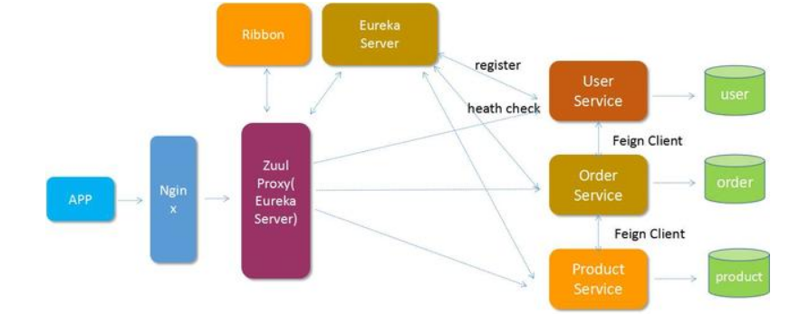
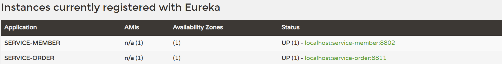

# SpringCloud

* [1、微服务概念](#1、微服务概念)
* [2、注册中心](#2、注册中心)
* [3、负载均衡及客户端调用工具](#3、负载均衡及客户端调用工具)
* [4、接口网关](#4、接口网关)
* [5、分布式配置文件中心](#5、分布式配置文件中心)
* [6、服务雪崩](#6、服务雪崩)

### 1、微服务概念 ###

* 微服务的架构：分布式，即将一个大的项目拆分成N个子项目，每个项目的功能模块又可以拆分成N个服务，每个服务都可以单独部署，单独运行，并通过 RPC 相互调用。
* 每一个微服务对外提供自己的接口，即一个服务就是一个接口项目。
* 每一个微服务都有自己的数据库。
* 作用：解决高可用问题，可解耦。
* 分布式固有的复杂度：事务、网络实时性、容错性、接口调用成本。
* RPC 远程调用框架：SpringCloud、dubbo、HttpClient
* 通信方式： http协议 + restful风格 + json 
* 接口只允许在内网进行访问，和外网接口进行对接则使用https

> 微服务主要的优势

	1、降低复杂度
	
	将原来偶合在一起的复杂业务拆分为单个服务，规避了原本复杂度无止境的积累。每一个微服务专注于单一功能，并通过定义良好的接口清晰表述服务边界。每个服务开发者只专注服务本身，通过使用缓存、DAL等各种技术手段来提升系统的性能，而对于消费方来说完全透明。
	
	2、可独立部署
	
	由于微服务具备独立的运行进程，所以每个微服务可以独立部署。当业务迭代时只需要发布相关服务的迭代即可，降低了测试的工作量同时也降低了服务发布的风险。
	
	3、容错
	
	在微服务架构下，当某一组件发生故障时，故障会被隔离在单个服务中。 通过限流、熔断等方式降低错误导致的危害，保障核心业务正常运行。
	
	4、扩展
	
	单块架构应用也可以实现横向扩展，就是将整个应用完整的复制到不同的节点。当应用的不同组件在扩展需求上存在差异时，微服务架构便体现出其灵活性，因为每个服务可以根据实际需求独立进行扩展。

> springCloud 和 springBoot的关系

	springCloud 是一套微服务框架的解决方案 -- RPC 远程调用
	springBoot 目的是简化xml 配置，快速整合框架。
	springCloud依赖接口【SpringMVC】，而springBoot提供接口【SpringMVC】

	版本对应
	Release Train	Boot Version

	Greenwich		2.1.x
	
	Finchley		2.0.x
	
	Edgware			1.5.x
	
	Dalston			1.5.x

	 <parent>
	    <groupId>org.springframework.boot</groupId>
	    <artifactId>spring-boot-starter-parent</artifactId>
	    <version>1.5.13.RELEASE</version>
	  </parent>
	  <dependencyManagement>
	    <dependencies>
	      <dependency>
	        <groupId>org.springframework.cloud</groupId>
	        <artifactId>spring-cloud-dependencies</artifactId>
	        <version>Edgware.SR3</version>
	        <type>pom</type>
	        <scope>import</scope>
	      </dependency>
	    </dependencies>
	  </dependencyManagement>

	<parent>
	    <groupId>org.springframework.boot</groupId>
	    <artifactId>spring-boot-starter-parent</artifactId>
	    <version>2.0.0.RELEASE</version>
	    <relativePath/>
	  </parent>
	
	  <dependencyManagement>
	    <dependencies>
	      <dependency>
	        <groupId>org.springframework.cloud</groupId>
	        <artifactId>spring-cloud-dependencies</artifactId>
	        <version>Finchley.RELEASE</version>
	        <type>pom</type>
	        <scope>import</scope>
	      </dependency>
	    </dependencies>
	  </dependencyManagement>

> SpringCloud特点

	1. 约定优于配置

	2. 开箱即用、快速启动
	
	3. 适用于各种环境
	
	4. 轻量级的组件
	
	5. 组件支持丰富，功能齐全

> spring cloud子项目包括：

	Spring Cloud Config：
		配置管理开发工具包，可以让你把配置放到远程服务器，目前支持本地存储、Git以及Subversion。
	
	Spring Cloud Bus：
		事件、消息总线，用于在集群（例如，配置变化事件）中传播状态变化，可与Spring Cloud Config联合实现热部署。
	
	Spring Cloud Netflix：
		针对多种Netflix组件提供的开发工具包，其中包括Eureka、Hystrix、Zuul、Archaius等。
	
	Netflix Eureka：
		云端负载均衡，一个基于 REST 的服务，用于定位服务，以实现云端的负载均衡和中间层服务器的故障转移。
	
	Netflix Hystrix：
		容错管理工具，旨在通过控制服务和第三方库的节点，从而对延迟和故障提供更强大的容错能力。
	
	Netflix Zuul：
		边缘服务工具，是提供动态路由，监控，弹性，安全等的边缘服务。
	
	Netflix Archaius：
		配置管理API，包含一系列配置管理API，提供动态类型化属性、线程安全配置操作、轮询框架、回调机制等功能。
	
	Spring Cloud for Cloud Foundry：
		通过Oauth2协议绑定服务到CloudFoundry，CloudFoundry是VMware推出的开源PaaS云平台。
	
	Spring Cloud Sleuth：
		日志收集工具包，封装了Dapper,Zipkin和HTrace操作。
	
	Spring Cloud Data Flow：
		大数据操作工具，通过命令行方式操作数据流。
	
	Spring Cloud Security：
		安全工具包，为你的应用程序添加安全控制，主要是指OAuth2。
	
	Spring Cloud Consul：
		封装了Consul操作，consul是一个服务发现与配置工具，与Docker容器可以无缝集成。
	
	Spring Cloud Zookeeper：
		操作Zookeeper的工具包，用于使用zookeeper方式的服务注册和发现。
	
	Spring Cloud Stream：
		数据流操作开发包，封装了与Redis,Rabbit、Kafka等发送接收消息。
	
	Spring Cloud CLI：
		基于 Spring Boot CLI，可以让你以命令行方式快速建立云组件。

### spring cloud 组件 ###

> spring cloud 组件 ：

	rest、feign 客户端调用工具，调用接口  
	ribbon 负载均衡，默认轮询方式  
	zuul 接口网关  
	eureka 服务注册  

	所有请求都统一通过 API 网关（Zuul）来访问内部服务。
	网关接收到请求后，从注册中心（Eureka）获取可用服务。
	由 Ribbon 进行均衡负载后，分发到后端的具体实例。
	微服务之间通过 Feign 进行通信处理业务。

### 注册中心 ###

> 可选的注册中心，服务发现

	1. Eureka	支持效果最好，目前已经闭源
	2. Zookeeper
	3. Consul

> 流程

	1. 配置注册中心 eureka
	2. 将服务A 注册到注册中心
	3. 将服务B 注册到注册中心
	4. 服务B 调用服务A的原理：通过服务调用A 的注册名，注册中心解析注册名并解析为真实ip地址和端口，再通过httpClient来调用URL。
	5. 服务都要注册到注册中心才可以调用或者被调用。

	【注】
	注册时，eureka服务端将eureka 客户端提交的注册服务名和客户端的真实ip+端口映射在一起。
	多个客户端可以注册同一个一个服务名。
	访问时由客户端的负载均衡进行调用具体哪一个客户端服务。

> eureka 角色

	@EnableEurekaServer  表示注册中心 eureka 服务端
	@EnableEurekaClient  表示注册中心 eureka 客户端

> pom.xml

	<dependency>
      <groupId>org.springframework.cloud</groupId>
      <artifactId>spring-cloud-starter-netflix-eureka-server</artifactId>
    </dependency>

> eureka是一个高可用的组件，它没有后端缓存，每一个实例注册之后需要向注册中心发送心跳（因此可以在内存中完成），在默认情况下 erureka server也是一个eureka client ,必须要指定一个 server。  
> 配置文件 application.yml

	server:
	  port: 8880
	eureka:
	  instance:
	    hostname: localhost
	  client:
	    registerWithEureka: false    # 是否将eureka自身作为应用注册到eureka注册中心
	    fetchRegistry: false         # 为true时，搜索服务时是否搜索该服务
		# 注册中心 URL
	    serviceUrl:
	      defaultZone: http://${eureka.instance.hostname}:${server.port}/eureka/

	【注】
	通过 eureka.client.registerWithEureka：false 和 fetchRegistry：false 来表明自己是一个eureka server。
	即服务本身不应该自我注册和搜索。

> 启动一个服务注册中心

	只需要一个注解 @EnableEurekaServer，这个注解需要在springboot工程的启动application类上加。

	比如:
	@SpringBootApplication
	@EnableEurekaServer
	public class CloudMain {
	
	    /** springBoot的标准入口*/
	    public static void main(String[] args) {
	        SpringApplication.run(CloudMain.class,args);
	    }
	}

> eureka server 是有界面的，启动工程,打开浏览器访问

	访问注册中心：http://localhost:8880/

> eureka 自我保护机制

	心跳检测：
		Eureka客户端默认情况下每30秒会向Eureka服务器发送一个心跳检测请求，Eureka服务器则会知道该Eureka客户端还存活，继续保持该客户端的服务列表。
		服务器在收到最后一次心跳之后等待的持续时间【默认90s】内还没有收到心跳包，则从其注册表中删除实例。

	防止客户端和服务端 因网络问题，导致服务端收不到心跳包而将 EurekaClient 服务进行删除。

	在短时间内丢失大量的服务实例心跳时，EurekaServer 自动开启自我保护机制，不会删除暂时无法通讯的 EurekaClient

	自我保护机制默认打开状态。

	自我保护行为的配置：

	客户端
		eureka.instance.lease-renewal-interval-in-seconds = 30
			表示客户端向服务器发送心跳的频率，不建议更改此值，因为自我保护假设始终以30秒的间隔接收心跳。
		
		eureka.instance.lease-expiration-duration-in-seconds = 90
			指示 eureka 服务端在收到最后一次心跳之后等待的持续时间，然后才能从其注册表中删除客户端实例。
			该值应大于 lease-renewal-interval-in-seconds。
			此值设置过长会影响每分钟实际心跳的精确性，因为注册表的活力取决于这个值。将此值设置过小可能会使系统无法容忍临时网络故障。
		
	服务端
		eureka.server.eviction-interval-timer-in-ms = 60000
			定时清除无效注册实例，间隔多少毫秒清除无效客户端
		
		eureka.server.renewal-percent-threshold = 0.85
			此值用于计算每分钟的预期心跳。
			
		eureka.server.renewal-threshold-update-interval-ms = 15 * 60 * 1000
			调度程序以此频率运行，计算每分钟的预期心跳。
		
		eureka.server.enable-self-preservation = true
			禁用自我保护。

	eureka:
	  server:
	    enable-self-preservation: false       #关闭自我保护机制
	    eviction-interval-timer-in-ms: 20000  # 间隔多少毫秒清除无效客户端

	eureka:
	  client:
	    serviceUrl:
	      defaultZone: http://localhost:8880/eureka/
	  instance:
	      lease-renewal-interval-in-seconds: 5      # 5s 一次心跳
	      lease-expiration-duration-in-seconds: 10  # 10S后无心跳即可通知服务端将其删除
	logging:
	  level:
	    com.netflix: DEBUG	#显示日志

	服务端定时器 20000ms + 客户端心跳 5s + 客户端最后一次心跳间隔 10s = 35s 
	客户端关闭后，服务端将会在 35s 后将其删除。

	【注】
	开发环境下不要开启自我保护机制，避免不可用服务不能及时删除。
	线上服务可以开启，线上环境下不会频繁重启。

> 注册中心集群

	通过运行多个实例并请求他们相互注册，可以使Eureka更具弹性和可用性。

	// application1.yml

	server:
	  port: 8880
	eureka:
	  instance:
	    hostname: localhost
	  client:
	    registerWithEureka: true    # 是否将eureka自身作为应用注册到eureka注册中心
	    fetchRegistry: true         # 为true时，搜索服务时是否搜索该服务
	    serviceUrl:
	      defaultZone: http://${eureka.instance.hostname}:8881/eureka/

	// application2.yml

	server:
	  port: 8881
	eureka:
	  instance:
	    hostname: localhost
	  client:
	    registerWithEureka: true    # 是否将eureka自身作为应用注册到eureka注册中心
	    fetchRegistry: true         # 为true时，搜索服务时是否搜索该服务
	    serviceUrl:
	      defaultZone: http://${eureka.instance.hostname}:8880/eureka/

	相互注册，相互搜索。

#### 创建一个服务提供者 (eureka client) ####

	当client向server注册时，它会提供一些元数据，例如主机和端口，URL，主页等。
	Eureka server 从每个client实例接收心跳消息。 
	如果心跳超时，则通常将该实例从注册server中删除。

> pom.xml

	<dependencies>
        <dependency>
            <groupId>org.springframework.cloud</groupId>
            <artifactId>spring-cloud-starter-netflix-eureka-client</artifactId>
        </dependency>

        <dependency>
            <groupId>org.springframework.boot</groupId>
            <artifactId>spring-boot-starter-web</artifactId>
        </dependency>

		<!-- 健康检测依赖 -->
	    <dependency>
	      <groupId>org.springframework.boot</groupId>
	      <artifactId>spring-boot-starter-actuator</artifactId>
	      <version>1.5.4.RELEASE</version>
	    </dependency>
    </dependencies>

> 在配置文件中声明注册中心的地址

	// 配置文件 application.yml
	server:
	  port: 8802	# 该客户端服务端口
	spring:
	  application:
	    name: service-member  # 注册在注册中心的服务名称
	eureka:
	  client:
	    serviceUrl:
	      defaultZone: http://localhost:8880/eureka/	# 注册中心地址

> 创建服务方法

	@RestController
	public class MemberApp {
	
	    @Value("${server.port}")
	    private String serverPort;
	
	    int count;
	
	    @GetMapping(value = "/getMembers")
	    public List<String> service(){
	        
	        List<String> members = new ArrayList<>();
	        members.add("alex");
	        members.add("kevin");
	        members.add("serverPort:" + serverPort);
	        return members;
	    }
	
	}

> 启动服务，向注册中心注册服务

	通过注解@EnableEurekaClient 表明自己是一个eurekaclient。
	
	@SpringBootApplication
	@EnableEurekaClient
	public class MemberMain {
	    public static void main(String[] args) {
	        SpringApplication.run(MemberMain.class,args);
	    }
	}

	
	访问注册中心，可以看到客户端服务以及注册到注册中心了。
	
	查看客户端监控状态
	客户端URL/health
	
	比如：
	http://localhost:8802/health
	
	// {"description":"Composite Discovery Client","status":"UP"}

	【注】
	@EnableEurekaClient			// 仅支持注册中心是 eureka
	@EnableDiscoveryClient		// 可以支持其他注册中心
	
		作用都一样，都是标记为注册中心客户端。
		如果选用的注册中心是eureka，那么就推荐@EnableEurekaClient，如果是其他的注册中心，那么推荐使用@EnableDiscoveryClient。

### 负载均衡及客户端调用工具 ###

> 服务调用

	服务在本地客户端通过 注册中心获取调用其他服务的真实地址后，由本地调用其他服务的方法。

> RestTemplate 客户端调用工具使用【比较少用】

	1. 初始化 RestTemplate
	2. 向注册中心注册两个服务 member、order
	3. 这些服务间使用 RestTemplate 相互调用其他服务的方法。
	
	// 初始化客户端调用工具时，添加负载均衡注解
	
	@SpringBootApplication(scanBasePackages = "com.cloud")
	@EnableEurekaClient
	public class OrderMain {
	    public static void main(String[] args) {
	        SpringApplication.run(OrderMain.class,args);
	    }
	
	    @Bean
	    @LoadBalanced  //支持负载均衡
	    RestTemplate restTemplate(){
	        return new RestTemplate();
	    }
	}

	// order服务调用 member服务的方法

	@Service
	public class OrderService {
	
	    @Resource
	    private RestTemplate restTemplate;
	
		// service-member 为 member服务在注册中心的注册名称
	    private String memberUrl = "http://service-member/";

		// 调用 member服务的 getMembers方法
	    public List getOrder(){
	        return restTemplate.getForObject(memberUrl + "getMembers",List.class);
	    }
	
	}

	@RestController
	public class OrderApp {
	
	    @Resource
	    private OrderService orderService;
	
	    @GetMapping("/getOrder")
	    public List getOrder(){
	        return orderService.getOrder();
	    }
	
	}

	【注】
	URI需要使用虚拟主机名（即服务名称，而不是主机名）。
	
> ribbon 客户端负载平衡器

	Ribbon是一个客户端负载平衡器，可以很好地控制HTTP和TCP客户端的行为。
	默认轮询方式 。

	Ribbon客户端用于根据服务名称创建完整的物理地址。
	ribbon 是在客户端本身进行负载均衡，而 nginx 是在服务端本身进行负载均衡。

	需要添加如下依赖：

	<dependency>
	    <groupId>org.springframework.cloud</groupId>
	    <artifactId>spring-cloud-starter-ribbon</artifactId>
	</dependency> 

	【注】
	如果是使用 eureka 作为注册中心，则不需要添加 ribbon 依赖，eureka 本身就包含了ribbon依赖。

> feign 客户端调用工具使用【常用】

	Feign是一个声明式的伪Http客户端，它使得写Http客户端变得更简单。
	使用Feign，只需要创建一个接口并注解。

	它具有可插拔的注解特性，可使用Feign 注解和JAX-RS注解。
	Feign支持可插拔的编码器和解码器。

	Feign默认集成了Ribbon，并和Eureka结合，默认实现了负载均衡的效果。标注 @FeignClient() 注解时，它自动开启负载均衡。

	简而言之：
	
	Feign 采用的是基于接口的注解。
	Feign 整合了ribbon，具有负载均衡的能力，不用添加 @LoadBalanced。
	整合了Hystrix，具有熔断的能力。
	

> 添加依赖

	<dependencies>
        <dependency>
            <groupId>org.springframework.cloud</groupId>
            <artifactId>spring-cloud-starter-netflix-eureka-client</artifactId>
        </dependency>
        <dependency>
            <groupId>org.springframework.boot</groupId>
            <artifactId>spring-boot-starter-web</artifactId>
        </dependency>
        <dependency>
            <groupId>org.springframework.cloud</groupId>
            <artifactId>spring-cloud-starter-feign</artifactId>
        </dependency>
    </dependencies>

> 配置文件 application.yml 中可以添加 ribbon 超时属性

	server:
	  port: 8811
	spring:
	  application:
	    name: service-order
	eureka:
	  client:
	    serviceUrl:
	      defaultZone: http://localhost:8880/eureka/
	
	#请求处理的超时时间
	ribbon:
	  ReadTimeout: 120000
	#请求连接的超时时间
	  ConnectTimeout: 3000

> 定义一个feign接口，通过 @FeignClient（“服务名”），来指定调用哪个服务。

	使用接口的方式来调用其他服务的方法，接口的属性和调用的服务方法向对应。
	需要标注 @FeignClient() 注解

	@FeignClient(name = "service-member")	//调用service-member 服务
	public interface FeignServer {
	
	    @GetMapping("/getMembers")	// 调用service-member 服务的getMembers请求
	    List<MemberInfo> members();

		@GetMapping("/getMember/{id}")
    	MemberInfo getMember(@PathVariable("id") Long id);
	}

	【注】
	service-member 为 会员服务在注册中心的注册名称。

> 创建控制类

	@RestController
	public class OrderApp {
	
	    @Autowired
	    FeignServer feignServer;
	
	    @GetMapping("/getOrder")
	    public List<MemberInfo> getOrderToMember(){
	        return feignServer.members();
	    }

		@GetMapping("/getOrderMemeber/{id}")
	    public MemberInfo getOrderMemeber(@PathVariable("id") Long id){
	        return feignServer.getMember(id);
	    }

		@GetMapping("/info")
	    public String getInfo(){
	        return "这是订单服务";
	    }
	}

> 在启动类中加上 @EnableFeignClients 注解开启Feign的功能：

	@SpringBootApplication(scanBasePackages = "com.cloud")
	@EnableEurekaClient
	@EnableFeignClients(basePackages = "com.cloud.service")
	public class OrderMain {
	    public static void main(String[] args) {
	        SpringApplication.run(OrderMain.class,args);
	    }
	}

> 服务B 本地客户端访问 负载均衡，由负载均衡调用后端负载的服务A1-A...

> Feign 请求或响应GZIP压缩

	启用针对您的Feign请求的请求或响应GZIP压缩。

	// application.yml
	feign.compression.response.enabled=true
	feign.compression.request.enabled=true
	feign.compression.request.mime-types=text/xml,application/xml,application/json
	feign.compression.request.min-request-size=2048

> Feign 日志记录

	为每个创建的Feign客户端创建一个记录器。默认情况下，记录器的名称是用于创建Feign客户端的接口的完整类名。

	// application.yml
	logging.level.[feign客户端接口全限类名]: DEBUG

	需要注入feign日志等级bean，为每个客户端配置的Logger.Level对象告诉Feign记录多少日志。
	有4个feign日志等级:
		NONE:	不发送日志。
		BASIC:	仅记录请求方法和URL以及响应状态代码和执行时间。
		HEADERS:记录基本信息以及请求和响应标头。
		FULL:	记录请求和响应的标题，正文和元数据。

	比如：
		logging:
		  level:
		    com.cloud.service.FeignServer: DEBUG

		// 添加 支持 feign 日志的bean

		import feign.Logger;
	
		@Configuration
		public class OrderConfig {
		    @Bean
		    Logger.Level feignLoggerLevel(){
		        return Logger.Level.HEADERS;
		    }
		}

### 4、接口网关 -- Zuul ###

> 接口网关的作用

	拦截所有请求，类似 nginx，作为统一的请求拦截器。  
	任何请求都先交给接口网关，然后再由网关进行转发，类似nginx的反向代理。

> Zuul的主要功能是 路由转发和过滤器。

	路由功能是微服务的一部分，比如／api/user转发到到user服务，/api/shop转发到到shop服务。
	zuul默认和Ribbon结合实现了负载均衡的功能。

> 添加依赖：

	<dependencies>
        <dependency>
            <groupId>org.springframework.cloud</groupId>
            <artifactId>spring-cloud-starter-netflix-eureka-client</artifactId>
        </dependency>
        <dependency>
            <groupId>org.springframework.boot</groupId>
            <artifactId>spring-boot-starter-web</artifactId>
        </dependency>
        <dependency>
            <groupId>org.springframework.cloud</groupId>
            <artifactId>spring-cloud-starter-netflix-zuul</artifactId>
        </dependency>
    </dependencies>

> application.yml

	server:
	  port: 8821
	spring:
	  application:
	    name: service.zuul
	eureka:
	  client:
	    serviceUrl:
	      defaultZone: http://localhost:8880/eureka/
	zuul:
	  routes:
	    api-a:							#名称可以自定义
	      path: /api-member/**    		# api-member 开头的url就跳转到 service.member 服务
	      service-id: service.member	# 注册中心的服务名
	    api-b:
	      path: /api-order/**
	      service-id: service.order

	【注】
	路由路径使用正则表达式

> 启动接口网关，启动类加上注解 @EnableZuulProxy，开启zuul的功能：

	@SpringBootApplication
	@EnableZuulProxy   
	@EnableEurekaClient
	public class ZuulMain {
	    public static void main(String[] args) {
	        SpringApplication.run(ZuulMain.class,args);
	    }
	}

> zuul 路由配置

	zuul:
  	  ignoredServices: '*'	# 忽略其他所有的服务

	路由可以匹配 service-id ，也可以使用url 。
	需要使用ip时记得添加配置 eureka.instance.prefer-ip-address = true
	
> 禁用Zuul过滤器

	Spring Cloud的Zuul在代理和服务器模式下默认启用了多个ZuulFilter bean。

	如果要禁用它，只需设置zuul.<SimpleClassName>.<filterType>.disable=true。
	按照惯例，filters之后的包是Zuul过滤器类型。
	例如，禁用 org.springframework.cloud.netflix.zuul.filters.post.SendResponseFilter 设置zuul.SendResponseFilter.post.disable=true。

### 5、分布式配置文件中心(Spring Cloud Config) ###

> 简介

	在分布式系统中，由于服务数量巨多，为了方便服务配置文件统一管理，实时更新，所以需要分布式配置中心组件。
	在Spring Cloud中，有分布式配置中心组件spring cloud config ，它支持配置服务放在配置服务的内存中（即本地），也支持放在远程Git仓库中。

	在spring cloud config 组件中，分两个角色：
		config-server【服务端】，负责管理配置信息 。
		config-client【客户端】，负责调用config-server 服务暴露的接口获取配置信息。

> 逻辑

	将多环境配置信息上传到 git中，通过配置文件服务config-server【服务端】 来缓存git中的配置信息，其他服务【客户端】则通过读取config-server服务来获取对应的配置信息。

	在git上修改配置文件内容后，重启客户端即可获取最新的数据。   

	将config-server【服务端】、config-client【客户端】都注册到注册中心【eureka】，进行统一管理。 
	
> 区分环境

	测试环境 -- dev
	预发布 -- pre
	正式生产环境 -- prd
  
> 通过服务端访问配置文件：  

	http请求地址和资源文件命名格式映射如下:

	/{application}/{profile}/[label]
	/{application}-{profile}.yml
	/{label}/{application}-{profile}.yml
	/{application}-{profile}.properties
	/{label}/{application}-{profile}.properties

	其中{application}是配置文件前缀，{profile}是环境标志，{label}是指分支，默认是master。

#### 搭建配置文件中心 ####

> 创建测试环境的配置文件 config-client-dev.properties，并将其上传到 git  
> 对应不同的三个环境，该配置文件的命名规则是：{application}-{profile}.properties

	jdbc.driverClassName=com.mysql.jdbc.Driver
	jdbc.url=jdbc:mysql://127.0.0.1:3306/hdc?useUnicode=true&characterEncoding=utf8&autoReconnect=true
	jdbc.username=web
	jdbc.password=root

#### 搭建配置文件服务端 config-server ####

> 1、添加依赖 pom.xml

	<dependency>
        <groupId>org.springframework.cloud</groupId>
        <artifactId>spring-cloud-config-server</artifactId>
    </dependency>

> 2、添加配置信息 application.yml

	server:
	  port: 8831
	spring:
	  application:
	    name: config-server
	  cloud:
	    config:
	      server:
	        git:
	          uri:  https://gitee.com/hdc918/configuration_file_center.git  # 配置git 仓库地址
	          searchPaths: config-respo     # 配置文件仓库路径,如果配置文件放置在Git存储库的根目录下，则无需使用searchPaths参数
	          username: hdc918            	# 访问git仓库的用户名
	          password: chang918          	# 访问git仓库的密码
			#  basedir: config				# 将配置信息保存到本地
	      label: master                   	# 配置仓库的分支
	eureka:
	  client:
	    serviceUrl:
	      defaultZone: http://localhost:8880/eureka/  # 注册中心URL

> 3、开启服务，@EnableConfigServer 表示开启配置中心server端

	@SpringBootApplication
	@EnableEurekaClient
	@EnableConfigServer     
	public class ConfigServerMain {
	    public static void main(String[] args) {
	        SpringApplication.run(ConfigServerMain.class,args);
	    }
	}

> 4、读取获取的环境的配置信息  
	
	格式：URL/{application}/{profile}

	访问 http://localhost:8831/config-client/dev

	{"name":"config-client","profiles":["dev"],"label":null,"version":"7e8c4088e60428479ebdd3efed2f367ebda3be46","state":null,"propertySources":[{"name":"https://gitee.com/hdc918/configuration_file_center.git/config-respo/config-client-dev.properties","source":{"jdbc.url":"jdbc:mysql://127.0.0.1:3306/hdc?useUnicode=true&characterEncoding=utf8&autoReconnect=true","jdbc.username":"web","jdbc.password":"root","jdbc.driverClassName":"com.mysql.jdbc.Driver"}}]

> 【注】 对于密码等敏感数据可以经 RSA加密后再上传。

#### 搭建配置文件客户端 config-client ####

> 1、添加依赖 pom.xml

	 	<!--配置中心客户端-->
        <dependency>
            <groupId>org.springframework.cloud</groupId>
            <artifactId>spring-cloud-starter-config</artifactId>
        </dependency>

		<!--使用属性读取配置信息-->
        <dependency>
            <groupId>org.springframework.boot</groupId>
            <artifactId>spring-boot-configuration-processor</artifactId>
            <optional>true</optional>
        </dependency>

> 2、添加配置信息 bootstrap.yml

	server:
	  port: 8832
	spring:
	  application:
	    name: config-client
	  cloud:
	      config:
	        label: master
	        profile: dev	#测试环境，也可换其他环境
			#uri: http://localhost:8831/	#通过url 访问config-server的功能
	        discovery:
	          enabled: true   #开启通过服务来访问config-server的功能
	          service-id: config-server
	eureka:
	  client:
	    serviceUrl:
	      defaultZone: http://localhost:8880/eureka/

> 3、添加属性model获取配置信息

	@Component
	@ConfigurationProperties(prefix = "jdbc",ignoreUnknownFields = false)
	public class ConfigProperties {
	
	    private String username;
	
	    private String password;
	
	    private String url;
	
	    private String driverClassName;
	
	    public String getUsername() {
	        return username;
	    }
	
	    public void setUsername(String username) {
	        this.username = username;
	    }
	
	    public String getPassword() {
	        return password;
	    }
	
	    public void setPassword(String password) {
	        this.password = password;
	    }
	
	    public String getUrl() {
	        return url;
	    }
	
	    public void setUrl(String url) {
	        this.url = url;
	    }
	
	    public String getDriverClassName() {
	        return driverClassName;
	    }
	
	    public void setDriverClassName(String driverClassName) {
	        this.driverClassName = driverClassName;
	    }
	}

> 4、添加控制类

	@RestController
	public class ConfigClientController {
	
	    @Resource
	    private ConfigProperties configProperties = new ConfigProperties();
	
	    @GetMapping("/getUserName")
	    public String config() {
	        return configProperties.getUrl() + " / " + configProperties.getUsername();
	    }
	}

> 5、开启服务

	@SpringBootApplication
	@EnableEurekaClient
	@EnableConfigurationProperties(value = ConfigProperties.class)	#开启配置信息属性读取
	public class ConfigClientMain {
	    public static void main(String[] args) {
	        SpringApplication.run(ConfigClientMain.class,args);
	    }
	}

> 6、测试  

	访问 http://localhost:8832/getUserName

	jdbc:mysql://127.0.0.1:3306/hdc?useUnicode=true&characterEncoding=utf8&autoReconnect=true&allowMultiQueries=true / web

### 6、服务雪崩 ###

> tomcat默认并发是150个
> 服务雪崩效应  
> 超时机制  
> 服务降级：服务调用接口时，如果发生错误或者超时，不让调用接口，则调用本地的fallback回调接口。  
> 熔断机制：解决高并发，一旦达到规定请求，就熔断报错。  
> 隔离机制：每个服务接口相互隔开。  
> 限流机制：

#### 熔断机制 ####

> 断路器：Hystrix

	Netflix开源了 Hystrix组件，实现了断路器模式，SpringCloud对这一组件进行了整合。
	当对特定的服务的调用的不可用达到一个阀值（Hystric 是5秒20次） 断路器将会被打开，则进行丢弃服务，避免连锁服务中断。
	当被保护的服务发生错误时，不让调用接口，则调用本地的fallback回调接口，进行信息回显。
	
	在 被保护的方法使用  @HystrixCommand 注解保卫，并指定错误时的回调方法。
		@HystrixCommand(fallbackMethod = "回调方法名"）

	比如：
		@Component
		public class StoreIntegration {
		
		    @HystrixCommand(fallbackMethod = "defaultStores")
		    public Object getStores(Map<String, Object> parameters) {
		        //do stuff that might fail
		    }
		
		    public Object defaultStores(Map<String, Object> parameters) {
		        return /* something useful */;
		    }
		}

> 添加依赖

	<dependency>
        <groupId>org.springframework.boot</groupId>
        <artifactId>spring-cloud-starter-netflix-hystrix</artifactId>
    </dependency>

	<!-- 健康检测依赖 -->
	<dependency>
        <groupId>org.springframework.boot</groupId>
        <artifactId>spring-boot-starter-actuator</artifactId>
    </dependency>

> 服务

	@HystrixCommand(fallbackMethod = "error")
    public String getOrder(){
        return restTemplate.getForObject(memberUrl + "getOrders",String.class);
    }

    public String error(){
        return "获取订单服务失败";
    }

> 在程序的启动类加 @EnableHystrix 注解开启Hystrix

	@SpringBootApplication(scanBasePackages = "com.cloud")
	@EnableEurekaClient
	@EnableHystrix
	public class MemberMain {
	    public static void main(String[] args) {
	        SpringApplication.run(MemberMain.class,args);
	    }
	
	    @Bean
	    @LoadBalanced   //支持负载均衡
	    RestTemplate restTemplate(){
	        return new RestTemplate();
	    }
	}

> Feign + Hystrix支持

	Feign是自带断路器的。

	启动断路器：feign.hystrix.enabled=true，此时 Feign将用断路器包装所有方法。

	全局禁用 Hystrix: feign.hystrix.enabled=false

	单个feign 客户端禁用	Hystrix，而不是全局禁用，需要添加配置信息bean
	因为Feign.Builder feignBuilder 默认是采用 HystrixFeign.Builder。即支持Hystrix。

		@Configuration
		public class FooConfiguration {
		    @Bean
			@Scope("prototype")
			public Feign.Builder feignBuilder() {
				return Feign.builder();
			}
		}
	
	

	Feign请求超时问题

		Hystrix默认的超时时间是1秒，如果超过这个时间尚未响应，将会进入 fallback【回退】代码。
		而首次请求往往会比较慢（因为Spring的懒加载机制，要实例化一些类），这个响应时间可能就大于1秒了。

	解决方案有三种，以feign为例。
		
		1. hystrix.command.default.execution.isolation.thread.timeoutInMilliseconds: 5000
			让Hystrix的超时时间改为5秒
		
		2. hystrix.command.default.execution.timeout.enabled: false
			禁用Hystrix的超时时间
		
		3. feign.hystrix.enabled: false
			禁用feign的hystrix。

> Feign Hystrix回退 fallback

	当电路断开或出现错误时执行的默认代码路径。
	要为给定的 @FeignClient 启用回退，请将fallback属性设置为实现回退的类名。

	// 在配置文件中开启熔断及超时时间
	server:
	  port: 8812
	spring:
	  application:
	    name: service-order2
	eureka:
	  client:
	    serviceUrl:
	      defaultZone: http://localhost:8880/eureka/
	
	#请求处理的超时时间
	ribbon:
	  ReadTimeout: 120000
	#请求连接的超时时间
	  ConnectTimeout: 3000

	# 熔断机制
	feign:
	  hystrix:
	    enabled: true
	hystrix:
	    command:
	      default:
	        execution:
	          iolation:
	            thread:
	              timeoutInMilliseconds: 10000

	// Feign 接口
	@FeignClient(name = "service-member", configuration = OrderConfig.class, fallback = OrderServiceFallbackImpl.class)
	public interface OrderService {
	
	    @GetMapping("/getMember/{id}")
	    MemberInfo getMember(@PathVariable("id") Long id);
	
	    @GetMapping("/getMembers")
	    List<MemberInfo> getMembers();
	}

	// Feign Hystrix回退，即feign的接口实现类
	@Component
	public class OrderServiceFallbackImpl implements OrderService {
	
	    @Override
	    public MemberInfo getMember(Long id) {
	        return new MemberInfo();
	    }
	
	    @Override
	    public List<MemberInfo> getMembers() {
	        MemberInfo memberInfo = new MemberInfo();
	        List<MemberInfo> memberInfoList = new ArrayList<>();
	        memberInfoList.add(memberInfo);
	        return memberInfoList;
	    }
	}

	// 控制类
	@RestController
	public class OrderController {
	
	    @Resource
	    private OrderService orderServer;
	
	    @GetMapping("/getOrderMember/{id}")
	    public MemberInfo getOrderMember(@PathVariable("id") Long id){
	        return orderServer.getMember(id);
	    }
	
	    @GetMapping("/getOrderMembers")
	    public List<MemberInfo> getOrderMembers(){
	        return orderServer.getMembers();
	    }
	}

	// 开启服务
	@SpringBootApplication(scanBasePackages = "com.cloud")
	@EnableEurekaClient
	@EnableFeignClients(basePackages = "com.cloud.server")
	@EnableHystrix
	public class Application {
	    public static void main(String[] args) {
	        SpringApplication.run(Application.class,args);
	    }
	}

	
	【说明】
	启动订单服务，当会员服务正常时访问 http://localhost:8812/getOrderMember/1 会返回 正常的会员信息。
	关闭会员服务，即会员服务已发生故障时再次访问，会触发 Hystrix 的回退机制，即访问回退类【OrderServiceFallbackImpl】的对应方法。

	如果需要访问导致回退触发的原因，可以使用 @FeignClient 内的fallbackFactory属性。

	@FeignClient(name = "service-member", configuration = OrderConfig.class, fallbackFactory = OrderFallbackFactoryImpl.class)
	
	// 回退工厂类
	@Component
	public class OrderFallbackFactoryImpl implements FallbackFactory<OrderService> {
	
		private final static Logger logger = LoggerFactory.getLogger(OrderFallbackFactoryImpl.class);
	    /**
	     *
	     * @param throwable 导致回退的原因
	     * @return
	     */
	    @Override
	    public OrderService create(Throwable throwable) {

			logger.info("异常信息：{}", throwable.getMessage());

	        return new OrderService() {
	            @Override
	            public MemberInfo getMember(Long id) {
	                return new MemberInfo();
	            }
	
	            @Override
	            public List<MemberInfo> getMembers() {
	                return null;
	            }
	        };
	    }
	}
