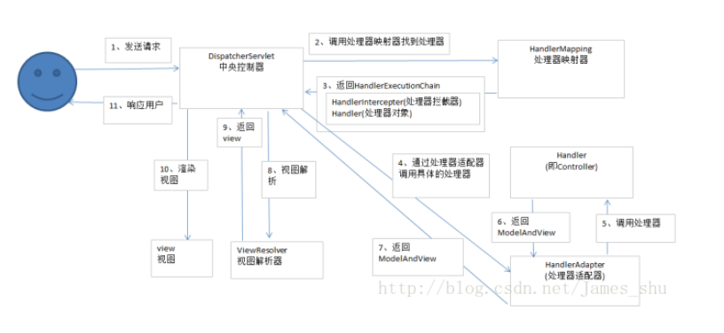
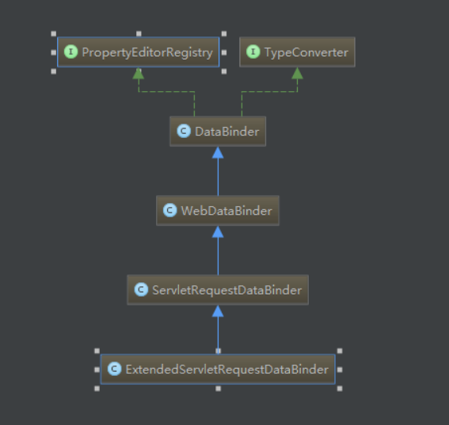

# SpringMVC #

* [1、SpringMVC简介](#1、SpringMVC简介)
* [2、核心架构](#2、核心架构)
* [3、初始化源码分析](#3、初始化源码分析)
* [4、REST、Ant风格](#4、REST、Ant风格)
* [5、常用注解](#5、常用注解)
* [6、配置文件选项说明](#6、配置文件选项说明)
* [7、数据回显说明](#7、数据回显说明)
* [8、过滤器、拦截器](#8、过滤器、拦截器)
* [9、异常处理机制](#9、异常处理机制)
* [10、POJO数据校验【JSR303】](#10、POJO数据校验【JSR303】)
* [11、文件上传下载](#11、文件上传下载)
* [12、本地化和国际化](#12、本地化和国际化)

### 1、SpringMVC简介 ###
	
- SpringMVC是一种基于Java的实现了Web MVC设计模式的请求驱动类型的轻量级Web框架，即使用了MVC架构模式的思想，将web层进行职责解耦，基于请求驱动指的就是使用**请求-响应模型**。
- 框架的目的就是帮助我们简化开发，Spring Web MVC也是要简化我们日常Web开发的。

> 优点

	SpringMVC相对Struts2更为精简，且基于spring框架，可直接使用IOC,AOP等特性。
	SpringMVC支持REST、Ant风格的URL请求
	自动获取参数
	自动进行常见类型转换
	同一个处理器可以处理多个请求
	支持多种视图
	和spring框架更易于集成

### 2、核心架构 ###

> 2.1、具体流程

	1. Tomcat 启动，对 DispatcherServlet 进行实例化，然后调用它的 init() 方法进行初始化，在这个初始化过程中完成了：
		
		对 web.xml 中初始化参数的加载；建立 WebApplicationContext (SpringMVC的IOC容器)；进行组件的初始化；

	2. 客户端发出请求，由 Tomcat 接收到这个请求，如果匹配 DispatcherServlet 在 web.xml 中配置的映射路径，Tomcat 就将请求转交给 DispatcherServlet 处理；

		DispatcherServlet 收到请求后自己不处理，而是交给其他的解析器进行处理，作为统一访问点，进行全局的流程控制【入口方法 doDispatch() 】；	
		
		门面模式。
	
	3. DispatcherServlet 从容器中取出所有 HandlerMapping 实例（每个实例对应一个 HandlerMapping 接口的实现类）并遍历；
		
		每个 HandlerMapping 会根据请求信息，通过自己实现类中的方式去找到处理该请求的 Handler (执行程序，如Controller中的方法)。
		将这个 Handler 与一堆 HandlerInterceptor (拦截器) 封装成一个 HandlerExecutionChain 对象进行返回。
		一旦有一个 HandlerMapping 找到匹配的 Handler 则退出循环；
	
		HandlerMapping 作用：建立 request 到 Handler 的映射关系。

		protected HandlerExecutionChain getHandler(HttpServletRequest request) throws Exception {
			for (HandlerMapping hm : this.handlerMappings) {
				
				HandlerExecutionChain handler = hm.getHandler(request);
				if (handler != null) {
					return handler;
				}
			}
			return null;
		}

	4. DispatcherServlet 取出 HandlerAdapter 处理器适配器
	
		根据已经找到的 Handler，再从 HandlerAdapter列表中找到支持处理该 Handler 的 HandlerAdapter 对象；

		protected HandlerAdapter getHandlerAdapter(Object handler) throws ServletException {
			for (HandlerAdapter ha : this.handlerAdapters) {
				
				if (ha.supports(handler)) {
					return ha;
				}
			}
			throw new ServletException("No adapter for handler [" + handler +
					"]: The DispatcherServlet configuration needs to include a HandlerAdapter that supports this handler");
		}
	
	5. HandlerAdapter 调用HandlerExecutionChain对象传过来的 Handler 对象，执行具体的方法；

		执行 HandlerExecutionChain 中所有拦截器的 preHandler() 方法，然后再利用 HandlerAdapter 执行 Handler ，执行完成得到 ModelAndView，再依次调用拦截器的 postHandler() 方法；

		HandlerAdapter : 具体执行 URL 映射的方法【handlerMethod、Controller、Servlet、HttpRequestHandler】，通过URL 即可定位获取controller 的请求方法信息，完成真正的调用，返回一个 ModelAndView 对象给 DispatcherServlet。
	
	6. DispatcherServlet 将 ModelAndView 对象传给 ViewResolver视图解析器解析；
	
	调用中置拦截器 mappedHandler.applyPostHandle(processedRequest, response, mv); --> interceptor.postHandle(request, response, this.handler, mv);
	
	7. ViewResolver视图解析器解析后返回具体的 View；
	
	8. DispatcherServlet 将返回的 View 进行视图渲染【将模型数据填写到视图中】；
	
	调用后置拦截器 mappedHandler.triggerAfterCompletion(request, response, (Exception)null); -->  interceptor.afterCompletion(request, response, this.handler, ex);
	
	9. DispatcherServlet 将响应返回给用户，到此一个流程结束。

> 流程图

> 2.2、核心开发步骤： 
> 2.2.1.导入SpringMVC所需jar包；

	<dependency>
      <groupId>org.springframework</groupId>
      <artifactId>spring-core</artifactId>
      <version>4.3.11.RELEASE</version>
    </dependency>
    <dependency>
      <groupId>org.springframework</groupId>
      <artifactId>spring-beans</artifactId>
      <version>4.3.11.RELEASE</version>
    </dependency>
    <dependency>
      <groupId>org.springframework</groupId>
      <artifactId>spring-context</artifactId>
      <version>4.3.11.RELEASE</version>
    </dependency>
    <dependency>
      <groupId>org.springframework</groupId>
      <artifactId>spring-web</artifactId>
      <version>4.3.11.RELEASE</version>
    </dependency>
    <dependency>
      <groupId>org.springframework</groupId>
      <artifactId>spring-webmvc</artifactId>
      <version>4.3.11.RELEASE</version>
    </dependency>

> 2.2.2.在web.xml 中配置(初始化) springMVC核心 DispatcherServlet【调度servlet，前置拦截器等】，从而拦截请求到 SpringMVC;  
> web.xml

	<?xml version="1.0" encoding="UTF-8"?>
	<web-app xmlns:xsi="http://www.w3.org/2001/XMLSchema-instance" xmlns="http://java.sun.com/xml/ns/javaee" xsi:schemaLocation="http://java.sun.com/xml/ns/javaee http://java.sun.com/xml/ns/javaee/web-app_3_0.xsd" id="WebApp_ID" version="3.0">

	  <display-name>SpringMVC</display-name>
	
		<!-- 配置 DispatcherServlet -->
		<servlet>
			<servlet-name>springDispatcherServlet</servlet-name>
			<servlet-class>org.springframework.web.servlet.DispatcherServlet</servlet-class>
			<!-- 配置DispatcherServlet 的一个初始化参数：配置springmvc配置文件的位置和名称 -->
			<!-- 也可以不通过 contextConfigLocation 来配置springmvc.xml的配置文件，而是使用默认的配置文件
				默认的配置文件为：/WEB-INF/<servlet-name>-servlet.xml
			-->
			
			<!-- <init-param>
				<param-name>contextConfigLocation</param-name>
				<param-value>classpath:springmvc.xml</param-value>
			</init-param> -->
			<!-- 容器加载时自动启动 -->
			<load-on-startup>1</load-on-startup>
		</servlet>
	
		<servlet-mapping>
			<servlet-name>springDispatcherServlet</servlet-name>
			<url-pattern>/</url-pattern>
		</servlet-mapping>
	</web-app>

> 2.2.3.创建 SpringMVC 配置文件 -- springmvc.xml或者 /WEB-INF/<servlet-name>-servlet.xml【根据 DispatcherServlet】；  
> /WEB-INF/springDispatcherServlet-servlet.xml 或者 springmvc.xml

	<beans  
	    xmlns="http://www.springframework.org/schema/beans"  
	    xmlns:xsi="http://www.w3.org/2001/XMLSchema-instance"  
	    xmlns:tx="http://www.springframework.org/schema/tx"  
	    xmlns:context="http://www.springframework.org/schema/context"     
	    xmlns:mvc="http://www.springframework.org/schema/mvc"     
	    xsi:schemaLocation="http://www.springframework.org/schema/beans    
	    http://www.springframework.org/schema/beans/spring-beans.xsd    
	    http://www.springframework.org/schema/tx    
	    http://www.springframework.org/schema/tx/spring-tx.xsd   
	    http://www.springframework.org/schema/context   
	    http://www.springframework.org/schema/context/spring-context.xsd   
	    http://www.springframework.org/schema/mvc   
	    http://www.springframework.org/schema/mvc/spring-mvc.xsd">  
	
		<!-- 使用注解开发，避免中文乱码 -->
	    <mvc:annotation-driven>
		    <mvc:message-converters>
		        <bean class="org.springframework.http.converter.StringHttpMessageConverter">
		            <constructor-arg value="UTF-8"/>
		        </bean>
		    </mvc:message-converters>
		</mvc:annotation-driven>
		
		<!-- 配置自动扫描注解所在的包 -->
		<context:component-scan base-package="com.hdc.springmvc"/>
	
		<!-- 
			配置视图解析器ViewResolver：如何把handler 方法返回值解析为实际的物理视图 
			实际的视图地址为：/success.jsp 【前缀+返回值+后缀】
		-->
		<bean class="org.springframework.web.servlet.view.InternalResourceViewResolver">
			<property name="prefix" value="/"></property>
			<property name="suffix" value=".jsp"></property>
		</bean>
	
	</beans>

> 2.2.4.编写控制器 ，从而进行功能处理;  
> 2.2.5.编写JSP页面。  

> springMVC 的 Handler方法可以接受 ServletAPI 类型的参数
	
	HttpServletRequest
	HttpServletResponse
	HttpSession
	Locale
	InputStream
	OutputStream
	Reader
	Writer

### 3、初始化源码分析 ###

> 通过继承关系将 request 请求传入 springMVC 框架中处理， DispatcherServlet 间接继承了 HttpServlet【 Servlet 容器】 

	public class DispatcherServlet extends FrameworkServlet
	public abstract class FrameworkServlet extends HttpServletBean implements ApplicationContextAware
	public abstract class HttpServletBean extends HttpServlet implements EnvironmentCapable, EnvironmentAware

> request 传入SpringMVC 前要先初始化。  
> 初始化 是在 HttpServletBean 中的 init() 方法，参数来源于 xml 的 <init-param>，因为 HttpServletBean 是servlet 容器中传入的参数，最终目的是初始化 Bean 信息。

	public final void init() throws ServletException {

		// 将配置文件中的init-param标签参数封装到 PropertyValues
        PropertyValues pvs = new HttpServletBean.ServletConfigPropertyValues(this.getServletConfig(), this.requiredProperties);
        if (!pvs.isEmpty()) {
            try {
            	//  bw 属性编辑器，控制 ServletConfig 属性
				// 使用BeanWrapper 构造 DispatcherServlet
                BeanWrapper bw = PropertyAccessorFactory.forBeanPropertyAccess(this);

                ResourceLoader resourceLoader = new ServletContextResourceLoader(this.getServletContext());

                bw.registerCustomEditor(Resource.class, new ResourceEditor(resourceLoader, this.getEnvironment()));

                this.initBeanWrapper(bw);

				// 将属性设置到 DispatcherServlet
                bw.setPropertyValues(pvs, true);

            } catch (BeansException var4) {

                throw var4;
            }
        }

        // 模板方法，在子类 FrameworkServlet 中具体实现，初始化bean
        initServletBean();

        if (this.logger.isDebugEnabled()) {
            this.logger.debug("Servlet '" + this.getServletName() + "' configured successfully");
        }
    }

> 在 FrameworkServlet 类中 初始化 Bean 信息，首先要初始化 springMVC 自己的上下文initWebApplicationContext()

	protected final void initServletBean() throws ServletException {

        try {

        	// 初始化 WebApplicationContext 构造 springMVC 自己的上下文【webApplicationContext】
			// 将 Servlet 和 Spring 容器关联
            this.webApplicationContext = this.initWebApplicationContext();
            this.initFrameworkServlet();

        } catch (ServletException var5) {
            this.logger.error("Context initialization failed", var5);
            throw var5;
        } catch (RuntimeException var6) {
            this.logger.error("Context initialization failed", var6);
            throw var6;
        }

    }

   
> 初始化 WebApplicationContext 构造 springMVC 自己的上下文的具体实现【onRefresh(wac);】

	protected WebApplicationContext initWebApplicationContext() {

		// 首先获取根上下文环境
        WebApplicationContext rootContext = WebApplicationContextUtils.getWebApplicationContext(this.getServletContext());
        
       	// springMVC 的web 上下文
        WebApplicationContext wac = null;

        if (this.webApplicationContext != null) {
            wac = this.webApplicationContext;
            if (wac instanceof ConfigurableWebApplicationContext) {
                ConfigurableWebApplicationContext cwac = (ConfigurableWebApplicationContext)wac;
                if (!cwac.isActive()) {
                    if (cwac.getParent() == null) {
                        cwac.setParent(rootContext);
                    }

                    this.configureAndRefreshWebApplicationContext(cwac);
                }
            }
        }

        if (wac == null) {
            wac = this.findWebApplicationContext();
        }

        if (wac == null) {
            wac = this.createWebApplicationContext(rootContext);
        }

        if (!this.refreshEventReceived) {

        	// 就是根据刷新事件触发这个事件，构造上下文的时间点
            this.onRefresh(wac);
        }

        if (this.publishContext) {
            String attrName = this.getServletContextAttributeName();
            this.getServletContext().setAttribute(attrName, wac);
            if (this.logger.isDebugEnabled()) {
                this.logger.debug("Published WebApplicationContext of servlet '" + this.getServletName() + "' as ServletContext attribute with name [" + attrName + "]");
            }
        }

        return wac;
    }

> WebApplicationContext 初始化完成后就跳转到子类 DispatcherServlet 来具体实现

	protected void onRefresh(ApplicationContext context) {
		// 初始化 SpringMVC 上下文的九大组件
        this.initStrategies(context);
    }

    protected void initStrategies(ApplicationContext context) {
        this.initMultipartResolver(context);
        this.initLocaleResolver(context);
        this.initThemeResolver(context);
        this.initHandlerMappings(context);
        this.initHandlerAdapters(context);
        this.initHandlerExceptionResolvers(context);	// 异常处理器
        this.initRequestToViewNameTranslator(context);
        this.initViewResolvers(context);
        this.initFlashMapManager(context);
    }

> initHandlerMappings 方法

	initHandlerMappings() 方法从 SpringMVC 的容器及 Spring 的容器中查找所有的 HandlerMapping 实例，并把它们放入到 handlerMappings 这个 list 中。
	这个方法并不是对 HandlerMapping 实例的创建，HandlerMapping 实例是在上面 WebApplicationContext 容器初始化，即 SpringMVC 容器初始化的时候创建的。

	List<HandlerMapping> handlerMappings

	Map<String, HandlerMapping> matchingBeans =
					BeanFactoryUtils.beansOfTypeIncludingAncestors(context, HandlerMapping.class, true, false);

	如果没有 HandlerMapping，则加载默认的。

> initHandlerAdapters

	从 SpringMVC 的容器及 Spring 的容器中查找所有的 initHandlerAdapters 实例，并把它们放入到 handlerAdapters 这个 list 中。

	List<HandlerAdapter> handlerAdapters;

	Map<String, HandlerAdapter> matchingBeans =
					BeanFactoryUtils.beansOfTypeIncludingAncestors(context, HandlerAdapter.class, true, false);
	

	如果没有 HandlerAdapter，则加载默认的。

> 初始化到此完成。  

> SpringMVC 初始化流程:
	
	继承关系
	HttpServletBean【init()】--> FrameworkServlet【initWebApplicationContext()】--> DispatcherServlet【初始化 SpringMVC 上下文的九大组件】

	1. HttpServletBean 作用

		主要做一些初始化的工作，将 web.xml 中配置的参数设置到Servlet容器中。
		比如servlet标签的子标签 init-param 标签中配置的参数。

	2. FrameworkServlet 作用
	
	　　将Servlet与Spring容器上下文关联。
		即初始化 FrameworkServlet的属性 webApplicationContext，这个属性代表SpringMVC上下文，它有个父类上下文，就是 web.xml中配置的 ContextLoaderListener 监听器初始化的 容器上下文。
	
	3. DispatcherServlet 作用
	
	　　初始化各个功能的实现类。
		比如异常处理、视图处理、请求映射处理等。

> service 流程：

	FrameworkServlet【doService()】--> DispatcherServlet 【doDispatch()】

> doService() 方法

	DispatcherServlet 的 doService() 方法主要是设置一些 request 属性，并调用 doDispatch() 方法进行请求分发处理。

> doDispatch()

	doDispatch() 方法的主要过程
		1. 通过 HandlerMapping 获取 Handler；
		2. 再找到能用于执行该Handler的 HandlerAdapter，执行 Handler 后得到 ModelAndView 。
		3. ModelAndView 是连接“业务逻辑层”与“视图展示层”的桥梁，接下来就要通过 ModelAndView 获得 View；
		4. 再通过它的 Model 对 View 进行渲染。

	protected void doDispatch(HttpServletRequest request, HttpServletResponse response) throws Exception {
	    HttpServletRequest processedRequest = request;
	    HandlerExecutionChain mappedHandler = null;
	    boolean multipartRequestParsed = false;

	    // 获取当前请求的WebAsyncManager，如果没找到则创建并与请求关联
	    WebAsyncManager asyncManager = WebAsyncUtils.getAsyncManager(request);
	    try {
	        ModelAndView mv = null;
	        Exception dispatchException = null;
	        try {

	            // 检查是否有 Multipart，有则将请求转换为 Multipart 请求
	            processedRequest = checkMultipart(request);
	            multipartRequestParsed = (processedRequest != request);

	            // 遍历所有的 HandlerMapping 找到与请求对应的 Handler，并将其与一堆拦截器封装到 HandlerExecution 对象中。
	            mappedHandler = getHandler(processedRequest);
	            if (mappedHandler == null || mappedHandler.getHandler() == null) {
	                noHandlerFound(processedRequest, response);
	                return;
	            }

	            // 遍历所有的 HandlerAdapter，找到可以处理该 Handler 的 HandlerAdapter
	            HandlerAdapter ha = getHandlerAdapter(mappedHandler.getHandler());

	            // 处理 last-modified 请求头 
	            String method = request.getMethod();
	            boolean isGet = "GET".equals(method);
	            if (isGet || "HEAD".equals(method)) {
	                long lastModified = ha.getLastModified(request, mappedHandler.getHandler());
	                if (new ServletWebRequest(request, response).checkNotModified(lastModified) && isGet) {
	                    return;
	                }
	            }

	            // 遍历拦截器，执行它们的 preHandle() 方法
	            if (!mappedHandler.applyPreHandle(processedRequest, response)) {
	                return;
	            }

	            try {
	                // 执行实际的处理程序
	                mv = ha.handle(processedRequest, response, mappedHandler.getHandler());
	            } finally {
	                if (asyncManager.isConcurrentHandlingStarted()) {
	                    return;
	                }
	            }
	            applyDefaultViewName(request, mv);

	            // 遍历拦截器，执行它们的 postHandle() 方法
	            mappedHandler.applyPostHandle(processedRequest, response, mv);
	        } catch (Exception ex) {
	            dispatchException = ex;
	        }
	        // 处理执行结果，是一个 ModelAndView 或 Exception，然后进行渲染
	        processDispatchResult(processedRequest, response, mappedHandler, mv, dispatchException);
	    } 
		...
	}  

#### HandlerMapping ####

	作用：
		根据当前请求找到对应的 Handler，并将 Handler（执行程序）与一堆 HandlerInterceptor（拦截器）封装到 HandlerExecutionChain 对象中。

	在 HandlerMapping 接口的内部只有一个方法：
		HandlerExecutionChain getHandler(HttpServletRequest request);

	HandlerMapping 是由 DispatcherServlet 调用，DispatcherServlet 会从容器中取出所有 HandlerMapping 实例并遍历，让 HandlerMapping 实例根据自己实现类的方式去尝试查找 Handler。

	// DispatcherServlet 遍历调用 HandlerMapping
	protected HandlerExecutionChain getHandler(HttpServletRequest request) throws Exception {
	    // 这些 HandlerMapping 在容器初始化时创建，在 initHandlerMappings 时放入集合中
	    for (HandlerMapping hm : this.handlerMappings) {
	        HandlerExecutionChain handler = hm.getHandler(request);
	        if (handler != null) {
	            return handler;
	        }
	    }
	    return null;
	}

	HandlerMapping 实现类有两个分支，分别继承自 AbstractHandlerMethodMapping（得到 HandlerMethod）和 AbstractUrlHandlerMapping（得到 HttpRequestHandler、Controller 或 Servlet），它们又统一继承于 AbstractHandlerMapping。

> AbstractHandlerMapping

	它实现了 HandlerMapping 接口中的 getHandler() 方法。

	public final HandlerExecutionChain getHandler(HttpServletRequest request) throws Exception {
	    // 根据请求获取执行程序，具体的获取方式由子类决定，getHandlerInternal() 是抽象方法
	    Object handler = getHandlerInternal(request);
	    if (handler == null) {
	        handler = getDefaultHandler();
	    }
	    if (handler == null) {
	        return null;
	    }
	    // Bean name or resolved handler?
	    if (handler instanceof String) {
	        String handlerName = (String) handler;
	        handler = getApplicationContext().getBean(handlerName);
	    }
	    // 将 Handler 与一堆拦截器包装到 HandlerExecutionChain 对象中
	    return getHandlerExecutionChain(handler, request);
	}

	在这个方法中又调用了 getHandlerInternal() 方法获取到了 Handler 对象，而 Handler 对象具体内容是由它的子类去定义的。

> 分支1 -- AbstractUrlHandlerMapping

	作用：
		这个分支获取的 Handler 的类型实际就是一个 Controller 类，所以一个 Controller 只能对应一个请求。

	// 源码
	protected Object getHandlerInternal(HttpServletRequest request) throws Exception {
	    // 根据当前请求获取“查找路径”
	    String lookupPath = getUrlPathHelper().getLookupPathForRequest(request);

	    // 根据路径获取 Handler（即Controller），先尝试直接匹配，再尝试模式匹配
	    Object handler = lookupHandler(lookupPath, request);
	    if (handler == null) {
	       // We need to care for the default handler directly, since we need to
	        // expose the PATH_WITHIN_HANDLER_MAPPING_ATTRIBUTE for it as well.
	        Object rawHandler = null;
	        if ("/".equals(lookupPath)) {
	            rawHandler = getRootHandler();
	        }
	        if (rawHandler == null) {
	            rawHandler = getDefaultHandler();
	        }
	        if (rawHandler != null) {
	            // Bean name or resolved handler?
	            if (rawHandler instanceof String) {
	                String handlerName = (String) rawHandler;
	                rawHandler = getApplicationContext().getBean(handlerName);
	            }
	            validateHandler(rawHandler, request);
	            handler = buildPathExposingHandler(rawHandler, lookupPath, lookupPath, null);
	        }
	    }
	    return handler;
	}

> AbstractUrlHandlerMapping 实现类及使用

	1. BeanNameUrlHandlerMapping
	
		利用 BeanName 来作为 URL 使用。

		<!-- 注册 HandlerMapping -->
		<bean class="org.springframework.web.servlet.handler.BeanNameUrlHandlerMapping" />
		<!-- 注册 Handler -->
		<bean id="/test.do" class="com.controller.TestController" />

	2. SimpleUrlHandlerMapping
	
		可以将 URL 与处理器的定义分离，还可以对 URL 进行统一的映射管理。

		<!-- 注册 HandlerMapping -->
		<bean class="org.springframework.web.servlet.handler.SimpleUrlHandlerMapping">
		    <property name="mappings">
		        <props>
		            <prop key="/test.do">testController</prop>
		            <prop key="/hello.do">testController</prop>
		        </props>
		    </property>
		</bean>

		<!-- 注册 Handler -->
		<bean id="testController" class="com.controller.TestController" />

	3. AbstractDetectingUrlHandlerMapping

> 分支2 -- AbstractHandlerMethodMapping

	作用：
		这个分支获取的 Handler 的类型是 HandlerMethod，即这个 Handler 是一个方法。
		它保存了方法的信息（如Method），这样一个 Controller 类就可以处理多个请求了。
		处理 请求与 HandlerMethod 映射关系。

	// 源码如下所示
	@Override
	protected HandlerMethod getHandlerInternal(HttpServletRequest request) throws Exception {
	    // 根据当前请求获取“查找路径”
	    String lookupPath = getUrlPathHelper().getLookupPathForRequest(request);
	    
		// 获取当前请求最佳匹配的处理方法（即Controller类的方法中）
	    HandlerMethod handlerMethod = lookupHandlerMethod(lookupPath, request);
	    
		return (handlerMethod != null ? handlerMethod.createWithResolvedBean() : null);
	}

	【注】
	上述代码中 lookupHandlerMethod() 方法主要工作是在 Map<T, HandlerMethod> handlerMethods 中找到 HandlerMethod，这里的 T 就是 RequestMappingInfo，它封装了 @RequestMapping 信息

	// 创建 HandlerMethods
	protected void initHandlerMethods() {
	    // 从ApplicationContext 中获取所有 Bean 的名称，detectHandlerMethodsInAncestorContexts 默认false，不从父容器中查找
	    //即默认只查找 SpringMVC 的 IOC 容器，不查找它的父容器 Spring 的 IOC 容器
	    String[] beanNames = (this.detectHandlerMethodsInAncestorContexts ?
	        BeanFactoryUtils.beanNamesForTypeIncludingAncestors(getApplicationContext(), Object.class) :
	        getApplicationContext().getBeanNamesForType(Object.class));
	    for (String beanName : beanNames) {

	        // 这里的 isHandler()方法由子类实现，判断是否拥有 @Controller 注解或 @RequestMapping 注解
	        if (!beanName.startsWith(SCOPED_TARGET_NAME_PREFIX) && isHandler(getApplicationContext().getType(beanName))){

	            // 利用反射得到 Bean 中的 Method 并包装成 HandlerMethod 对象，然后放入 Map 中
	            detectHandlerMethods(beanName);
	        }
	    }
	    handlerMethodsInitialized(getHandlerMethods());
	}

	// detectHandlerMethods() 将 Bean (handler) 的方法转换为 HandlerMethod 对象
	protected void detectHandlerMethods(final Object handler) {

		// 获取这个 Bean 的 Class 对象
		Class<?> handlerType = (handler instanceof String ?
				getApplicationContext().getType((String) handler) : handler.getClass());

		// 获取被代理前的原始类型
		final Class<?> userType = ClassUtils.getUserClass(handlerType);

		// 获取所有的 Method 
		Map<Method, T> methods = MethodIntrospector.selectMethods(userType,
				new MethodIntrospector.MetadataLookup<T>() {
					@Override
					// 这里的 T 就是 RequestMappingInfo，它封装了 @RequestMapping 信息
					public T inspect(Method method) {
						// 根据 Method 和它的 @RequestMapping 注解，创建 RequestMappingInfo 对象。
						return getMappingForMethod(method, userType);
					}
				});

		for (Map.Entry<Method, T> entry : methods.entrySet()) {

			// 根据 Methods 的键 和它的 @RequestMapping 注解 获取对应的 Method 对象
			Method invocableMethod = AopUtils.selectInvocableMethod(entry.getKey(), userType);
			T mapping = entry.getValue();

			// 注册 Method 映射到容器中，RequestMappingInfo 储存着映射信息
			// 将 RequestMappingInfo 作为 key，把 Method 包装成 HandlerMethod 作为 value 添加到了 Map<T, HandlerMethod> handlerMethods 中。

			registerHandlerMethod(handler, invocableMethod, mapping);
		}
	}

	// 创建 RequestMappingInfo 对象
	@Override
	protected RequestMappingInfo getMappingForMethod(Method method, Class<?> handlerType) {
		RequestMappingInfo info = createRequestMappingInfo(method);
		if (info != null) {
			RequestMappingInfo typeInfo = createRequestMappingInfo(handlerType);
			if (typeInfo != null) {
				info = typeInfo.combine(info);
			}
		}
		return info;
	}

> RequestMappingInfo类：

	Spring3.1版本之后引入的。 
	是一个封装了各种 请求映射条件 并实现了 RequestCondition 接口的类。

　　RequestCondition 实现类属性，patternsCondition，methodsCondition，paramsCondition，headersCondition，consumesCondition以及producesCondition，分别代表http请求的路径模式、方法、参数、头部等信息。

>  AbstractHandlerMethodMapping 实现类及使用

	只有一个实现类【间接继承】 RequestMappingHandlerMapping

	public abstract class RequestMappingInfoHandlerMapping extends AbstractHandlerMethodMapping<RequestMappingInfo> 

	public class RequestMappingHandlerMapping extends RequestMappingInfoHandlerMapping

#### HandlerAdapter ####

> 作用

	根据 Handler 来找到支持它的 HandlerAdapter，通过 HandlerAdapter 执行这个 Handler 获取 ModelAndView 对象。
		
> HandlerAdapter 接口中的方法

	1. boolean supports(Object handler); 
		
		当前 HandlerAdapter 是否支持这个 Handler

	2. ModelAndView handle(HttpServletRequest req, HttpServletResponse res, Object handler); 
	
		利用给定的 Handler 去处理请求

	3. long getLastModified(HttpServletRequest request, Object handler);

		给定处理程序的 lastModified值

> 子类抽象类 AbstractHandlerMethodAdapter  

	可以执行 HadnlerMethod 类型的 Handler 。

	@Override
	public final ModelAndView handle(HttpServletRequest request, HttpServletResponse response, Object handler)
			throws Exception {

		return handleInternal(request, response, (HandlerMethod) handler);
	}

> 子类 RequestMappingHandlerAdapter

	上面说过，利用 RequestMappingHandlerMapping 获取的 Handler 是 HadnlerMethod 类型，它代表 Controller 类中要执行的方法，而 RequestMappingHandlerAdapter 可以执行 HandlerMethod 对象。

	1. RequestMappingHandlerAdapter 的 handle() 方法是在它的父类 AbstractHandlerMethodAdapter 类中实现的。

	
	2. handleInternal() 方法是由 RequestMappingHandlerAdapter 自己来实现的

	@Override
	protected ModelAndView handleInternal(HttpServletRequest request, HttpServletResponse response, HandlerMethod handlerMethod) throws Exception {
	    
		ModelAndView mav;
		checkRequest(request);

	    // 是否需要在 synchronize 块中执行
	    if (this.synchronizeOnSession) {
			HttpSession session = request.getSession(false);
			if (session != null) {
				Object mutex = WebUtils.getSessionMutex(session);
				synchronized (mutex) {

					// 执行 HandlerMethod，得到 ModelAndView
					mav = invokeHandlerMethod(request, response, handlerMethod);
				}
			}
			else {
				// No HttpSession available -> no mutex necessary
				mav = invokeHandlerMethod(request, response, handlerMethod);
			}
		}
		else {
			// No synchronization on session demanded at all...
			mav = invokeHandlerMethod(request, response, handlerMethod);
		}

		// 是否通过 @SessionAttributes 注释声明了 session 属性。
		if (!response.containsHeader(HEADER_CACHE_CONTROL)) {
			if (getSessionAttributesHandler(handlerMethod).hasSessionAttributes()) {
				applyCacheSeconds(response, this.cacheSecondsForSessionAttributeHandlers);
			}
			else {
				prepareResponse(response);
			}
		}

	    return mav;
	}

	private ModelAndView invokeHandleMethod(HttpServletRequest request,
	        HttpServletResponse response, HandlerMethod handlerMethod) throws Exception {

		// 数据绑定
	    WebDataBinderFactory binderFactory = getDataBinderFactory(handlerMethod);
	    ModelFactory modelFactory = getModelFactory(handlerMethod, binderFactory);

	    // 绑定参数，执行方法
	    ServletInvocableHandlerMethod requestMappingMethod = createRequestMappingMethod(handlerMethod, binderFactory);

	    // 创建模型和视图容器
	    ModelAndViewContainer mavContainer = new ModelAndViewContainer();

>  子类 HttpRequestHandlerAdapter

	HttpRequestHandlerAdapter 可以执行 HttpRequestHandler 类型的 Handler。
	
	@Override
	public ModelAndView handle(HttpServletRequest request, HttpServletResponse response, Object handler) throws Exception {
	    ((HttpRequestHandler) handler).handleRequest(request, response);
	    return null;
	}

> 子类 SimpleControllerHandlerAdapter

	SimpleControllerHandlerAdapter 可以执行 Controller 类型的 Handler，源码如下

	@Override
	public ModelAndView handle(HttpServletRequest request, HttpServletResponse response, Object handler) throws Exception {
	    return ((Controller) handler).handleRequest(request, response);
	}

> 子类 SimpleServletHandlerAdapter 

	SimpleServletHandlerAdapter 可以执行 Servlet 类型的 Handler，源码如下
	
	@Override
	public ModelAndView handle(HttpServletRequest request, HttpServletResponse response, Object handler) throws Exception {
	    ((Servlet) handler).service(request, response);
	    return null;
	}

### 4、REST、Ant风格 ###

> 4.1、Ant风格资源地址支持3种通配符：

	1. ？ 匹配文件名中的有且仅有一个字符
	2. *  匹配文件名中的0个或多个任意字符
	3. ** 匹配多层路径

> 4.2、REST – REpresentational State Transfer（表现层状态转移）的缩写。通俗来讲就是：资源在网络中以某种表现形式进行状态转移。

	分解开来就是： 
		1、Resource：资源，即数据。比如newsfeed，friends等；
		2、Representatioanal：某种表现形式，比如用JSON，XML，JPEG等；
		3、State Transfer：状态变化。通过HTTP动词实现（GET、POST、PUT、DELETE）。

	对于REST与 RESTful的关系，因为REST指的是一组架构约束条件和原则，
	因此可以简单理解为，如果一个架构符合REST原则和约束，就称它为RESTful架构。

> REST的基础知识
	
	REST 是面向资源的，强调描述应用程序的事物和名词;
	REST 就是将资源的状态以最适合客户端或服务端的形式从服务器端转移到客户端（或者反过来）;
	在REST中，资源通过URL进行识别和定位。

> RESTful架构：

	1. 每一个URI代表一种资源；
	2. 客户端和服务器之间，传递这种资源的某种表现层；
	3. 客户端通过四个HTTP动词，对服务器端的资源进行操作，实现“资源表现层状态转化”。
		GET		用来获取资源，具有幂等性;
		POST 	用来新建资源（也可以用于更新资源），不具有幂等性;
		PUT		用来更新资源，具有幂等性;
		DELETE	用来删除资源，具有幂等性。

> 幂等性

	每次 HTTP 请求相同的参数，相同的URI，获取的结果都是一样的。

> RESTful 风格 --> URL的设计
 
	传统的URL：
		localhost:8080/usersys/delete.action?id=100
		
	RESTful 风格:

		value="/{参数1名词}/{参数2名词}",method=请求方式
		@RequestMapping(value="/system/{id}/{type}",method = RequestMethod.GET)

		localhost:8080/usersys/100 	GET/POST/DELETE/PUT
		优点：更安全高效，传递的信息更多

> SpringMVC 中如何使用 Restful 资源

	借助 RestTemplate，Spring应用能够方便地使用 Restful 资源 ，Spring的 RestTemplate访问使用了模版方法的设计模式。
	模版方法将过程中与特定实现相关的部分委托给接口，而这个接口的不同实现定义了接口的不同行为。
	使用 RestTemplate 可以调用 Restful  API 。

	<bean id="restTemplate" class="org.springframework.web.client.RestTemplate">
	    <property name="messageConverters">
	        <list>
	            <bean class="org.springframework.http.converter.xml.MappingJackson2XmlHttpMessageConverter"/>
	        </list>
	    </property>
	</bean>

> RestTemplate 定义了 11 个独立的操作，而每一个都有重载，从而形成36个与REST资源交互的方法，其中的大多数都对应于HTTP的方法。

	delete()			在特定的URL上对资源执行HTTP DELETE操作；
	exchange() 			在URL上执行特定的HTTP方法，返回包含对象的 ResponseEntity，这个对象是从响应体中映射得到的；
	execute() 			在URL上执行特定的HTTP方法，返回一个从响应体映射得到的对象；
	getForEntity() 		发送一个HTTP GET请求，返回的 ResponseEntity 包含了响应体所映射成的对象；
						通过 ResponseEntity 这个对象可以获取到HTTP状态码、响应头。
	getForObject() 		发送一个HTTP GET请求，返回的请求体将映射为一个对象；
						只返回所请求类型的对象【通过HTTP消息转换器将其转换为java对象】；
	postForEntity() 	POST 数据到一个URL，返回包含一个对象的 ResponseEntity，这个对象是从响应体中映射得到的；
	postForObject() 	POST 数据到一个URL，返回根据响应体匹配形成的对象；
	postForLocation() 	POST 数据到一个URL，返回新创建资源的URL；
	headForHeaders() 	发送HTTP HEAD请求，返回包含特定资源URL的HTTP头；
	optionsForAllow() 	发送HTTP OPTIONS请求，返回对特定URL的Allow头信息；
	put() 				PUT提交资源到特定的URL；

### 5、常用注解 ###

> @Controller

	用于标识该类是控制器类，action类。
	控制器Controller 负责处理由DispatcherServlet 分发的请求，它把用户请求的数据经过业务处理层处理之后封装成一个Model ，然后再把该Model 返回给对应的View 进行展示。
	需要在SpringMVC 的配置文件中告诉Spring 该到哪里去找标记为@Controller 的Controller 控制器。
	<context:component-scan base-package = "" />	

> @RequestMapping

	用来处理请求地址映射的注解，可用于类或方法上。
	用于类上，表示类中的所有响应请求的方法都是以该地址作为父路径。
	RequestMapping注解有六个属性
			1、 value， method
				value：   指定请求的实际地址
				method：  指定请求的method类型， GET、POST、PUT、DELETE等
			2、consumes，produces
				consumes： 指定处理请求的提交内容类型（Content-Type），例如application/json, text/html;
				produces:  指定返回的内容类型，仅当request请求头中的(Accept)类型中包含该指定类型才返回；
			3、params，headers
				params： 指定request中必须包含某些参数值是，才让该方法处理。
				headers： 指定request中必须包含某些指定的header值，才能让该方法处理请求
		
	@RequestMapping("/testModel") ==> url="localhost:8080/<项目名称>/testModel"

> @Resource 和 @Autowired
		
	都是做bean的注入时使用
	两者都可以写在字段和setter方法上。两者如果都写在字段上，那么就不需要再写setter方法。
	不同点:
		@Autowired
			@Autowired为Spring提供的注解，需要导入包org.springframework.beans.factory.annotation.Autowired;
			只按照byType注入，默认情况下它要求依赖对象必须存在，如果允许null值，可以设置它的required属性为false;
			如果我们想使用按照名称（byName）来装配，可以结合 @Qualifier 注解一起使用;
			public class TestServiceImpl {
			    @Autowired
			    @Qualifier("userDao")
			    private UserDao userDao; 
			}
			public class TestServiceImpl {
			    // 下面两种@Autowired只要使用一种即可
			    @Autowired
			    private UserDao userDao; // 用于字段上
			    
			    @Autowired
			    public void setUserDao(UserDao userDao) { // 用于属性的方法上
			        this.userDao = userDao;
			    }
			}

		@Resource
			默认按照ByName自动注入，由J2EE提供，需要导入包javax.annotation.Resource;
			@Resource有两个重要的属性：name和type，而Spring将@Resource注解的name属性解析为bean的名字，而type属性则解析为bean的类型;
			如果使用name属性，则使用byName的自动注入策略，而使用type属性时则使用byType自动注入策略。如果既不制定name也不制定type属性，这时将通过反射机制使用byName自动注入策略;
			public class TestServiceImpl {
			    // 下面两种@Resource只要使用一种即可
			    @Resource(name="userDao")
			    private UserDao userDao; // 用于字段上
			    
			    @Resource(name="userDao")
			    public void setUserDao(UserDao userDao) { // 用于属性的setter方法上
			        this.userDao = userDao;
			    }
			}

> @RequestParam
		
	请求参数到处理器功能处理方法的方法参数上的绑定。
	GET和POST请求传的参数会自动转换赋值到@RequestParam 所注解的变量上【方法中的形参】。
	@RequestParam 所注解的变量值和前端表单的name值一致。
	也可以不使用@RequestParam，直接接收，此时要求controller方法中的参数名称要跟form中name名称一致。
	
	主要用于在SpringMVC后台控制层获取参数，类似一种是request.getParameter("name")
	有三个常用参数:
		defaultValue: 表示设置默认值
		required: 通过 boolean 设置是否是必须要传入的参数，默认是true【参数在URL中】
		value: 值表示接受的传入的参数名

	
	@RequestMapping("/testRequestParam")
	public String testRequestParam(@RequestParam(value="age",required=false) Integer age){
		System.out.println(age="+age);
		return "success";
	}

	@RequestMapping("/testRequestParam")
	public String testRequestParam(Integer age){ // 参数名称和前端表单的name值一致
		System.out.println(age="+age);
		return "success";
	}

	@RequestParam 用来处理Content-Type: 为 application/x-www-form-urlencoded编码的内容。
	提交方式为get或post。（Http协议中，如果不指定Content-Type，则默认传递的参数就是application/x-www-form-urlencoded类型）

	RequestParam实质是将Request.getParameter() 中的Key-Value参数Map利用Spring的转化机制ConversionService配置，转化成参数接收对象或字段。
	get方式中query String的值，和post方式中body data的值都会被Servlet接受到并转化到 Request.getParameter()参数集中，所以@RequestParam可以获取的到。

> @PathVariable
		
	用于将请求URL中的模板变量映射到功能处理方法的参数上，即取出 URI 模板中的变量作为参数。
		/*
		 * @PathVariable
		 * 获取URL中的变量 ，{id} 占位
		 * 
		 */
		@RequestMapping("/{id}/testdelete")
		public String delete(@PathVariable("id") Integer id){
			System.out.println("id="+id);
			return "success";
		}

> @ResponseBody
		 
	该注解用于将Controller的方法返回的对象，通过适当的 HttpMessageConverter转换为指定格式后，写入到Response对象的body数据区作为返回值使用，不会被解析成视图路径进行跳转。

	通常用来返回JSON数据或者是XML 数据格式。
	Springmvc默认用MappingJacksonHttpMessageConverter对json数据进行转换，需要加入jackson的。

	<properties>
		<jackson.version>2.8.8</jackson.version>
	</properties>

	<!-- jackson -->
	<dependency>
		<groupId>com.fasterxml.jackson.core</groupId>
		<artifactId>jackson-core</artifactId>
		<version>${jackson.version}</version>
	</dependency>
	<dependency>
		<groupId>com.fasterxml.jackson.core</groupId>
		<artifactId>jackson-databind</artifactId>
		<version>${jackson.version}</version>
	</dependency>
	<dependency>
		<groupId>com.fasterxml.jackson.core</groupId>
		<artifactId>jackson-annotations</artifactId>
		<version>${jackson.version}</version>
	</dependency>

	采用 fastjson 作为json转换器

	<dependency>
	    <groupId>com.alibaba</groupId>
	    <artifactId>fastjson</artifactId>
	    <version>x.x.x</version>
	</dependency>

	springmvc.xml配置
	
	<mvc:annotation-driven >
		<mvc:message-converters register-defaults="false">
			<!-- 配置Fastjson支持 -->
			<bean class="com.alibaba.fastjson.support.spring.FastJsonHttpMessageConverter">
				<property name="supportedMediaTypes">
					<list>
						<value>text/html;charset=UTF-8</value>
						<value>application/json;charset=UTF-8</value>
					</list>
				</property>
				<property name="features">
					<list>
						<value>WriteMapNullValue</value>
						<value>QuoteFieldNames</value>
					</list>
				</property>
			</bean>
		</mvc:message-converters>
	</mvc:annotation-driven>

	FastJsonHttpMessageConverter属性：features 
		QuoteFieldNames			输出key时是否使用双引号,默认为true 
		WriteMapNullValue		是否输出值为null的字段,默认为false 
		WriteNullNumberAsZero	数值字段如果为null,输出为0,而非null 
		WriteNullListAsEmpty	List字段如果为null,输出为[],而非null 
		WriteNullStringAsEmpty	字符类型字段如果为null,输出为"",而非null 
		WriteNullBooleanAsFalse	Boolean字段如果为null,输出为false,而非null
	
> @RequestBody
		
	@RequestBody 将HTTP请求正文转换为适合的 HttpMessageConverter对象；
	该注解用于读取Request请求的body部分数据，使用系统默认配置的HttpMessageConverter进行解析，然后把相应的数据绑定到要返回的对象上；
	再把 HttpMessageConverter返回的对象数据绑定到 controller中方法的参数上。

	一般用于接收json格式的数据，并将其转换成对应的数据类型。
		
	根据 request header Content-Type的值来判断
		1. application/x-www-form-urlencoded， 可选（即非必须，因为这种情况的数据@RequestParam, @ModelAttribute也可以处理，当然@RequestBody也能处理）；
		2. multipart/form-data, 不能处理（即@RequestBody不能处理这种格式的数据）；
		3. 其他格式， 必须（其他格式包括application/json, application/xml等这些格式的数据，必须使用@RequestBody来处理）；

	@RequestBody 处理 HttpEntity 传递过来的数据，一般用来处理非Content-Type: application/x-www-form-urlencoded编码格式的数据。
	
	GET请求中，因为没有HttpEntity，所以 @RequestBody并不适用。
	POST请求中，通过 HttpEntity 传递的参数，必须要在请求头中声明数据的类型Content-Type。
		SpringMVC通过使用 HandlerAdapter 配置的 HttpMessageConverters来解析HttpEntity中的数据，然后绑定到相应的bean上。

	例子:
		请求参数是JSON字符串，Content-Type="application/json; charset=utf-8"

		@RequestMapping(value = "/login",method = RequestMethod.POST)
	    @ResponseBody
	    public String testPost(@RequestBody String jsonStr){
	        ObjectMapper objectMapper = new ObjectMapper();
	        String username = null;
	        String passwd = null;
	        try {
	            JsonNode node = objectMapper.readValue(jsonStr,JsonNode.class);
	            JsonNode nameNode = node.get("username");
	            username = nameNode.asText();
	            JsonNode passwdNode = node.get("passwd");
	            passwd = passwdNode.asText();
	        } catch (JsonProcessingException e) {
	            e.printStackTrace();
	        } catch (IOException e) {
	            e.printStackTrace();
	        }
	        if (username.equals("alex")&&passwd.equals("123456")){
	            return "success";
	        }else{
	            return "fail";
	        }
	    }

	【注】
	@RequestBody用于post请求，不能用于get请求。

> @ControllerAdvice

	作用一：
		拦截异常并统一处理。
		在spring 3.2中，新增了@ControllerAdvice 注解，可以用于定义@ExceptionHandler、@InitBinder、@ModelAttribute，并应用到所有@RequestMapping中，拦截异常并统一处理。

	作用二：	
		该注解使用@Component注解，这样的话当我们使用<context:component-scan>扫描时也能扫描到。
		结合 ResponseBodyAdvice 统一处理返回值/响应体。
		
		ControllerAdvice 负责拦截响应体，ResponseBodyAdvice 负责处理响应体。
		ResponseBodyAdvice是spring4.1的新特性，其作用是在响应体写出之前做一些处理；比如，修改返回值、加密等。

> @ControllerAdvice 注解源码

	package org.springframework.web.bind.annotation;
	
	import java.lang.annotation.Annotation;
	import java.lang.annotation.Documented;
	import java.lang.annotation.ElementType;
	import java.lang.annotation.Retention;
	import java.lang.annotation.RetentionPolicy;
	import java.lang.annotation.Target;
	import org.springframework.core.annotation.AliasFor;
	import org.springframework.stereotype.Component;
	
	@Target({ElementType.TYPE})
	@Retention(RetentionPolicy.RUNTIME)
	@Documented
	@Component
	public @interface ControllerAdvice {
	    @AliasFor("basePackages")
	    String[] value() default {};
	
	    @AliasFor("value")
	    String[] basePackages() default {};
	
	    Class<?>[] basePackageClasses() default {};
	
	    Class<?>[] assignableTypes() default {};
	
	    Class<? extends Annotation>[] annotations() default {};
	}

> ResponseBodyAdvice 接口源码：

	package org.springframework.web.servlet.mvc.method.annotation;
	import org.springframework.core.MethodParameter;
	import org.springframework.http.MediaType;
	import org.springframework.http.converter.HttpMessageConverter;
	import org.springframework.http.server.ServerHttpRequest;
	import org.springframework.http.server.ServerHttpResponse;

	public interface ResponseBodyAdvice {
	    /**
	     * Whether this component supports the given controller method return type
	     * and the selected {@code HttpMessageConverter} type.
	     * @param returnType the return type
	     * @param converterType the selected converter type
	     * @return {@code true} if {@link #beforeBodyWrite} should be invoked, {@code false} otherwise
	     */

	    boolean supports(MethodParameter returnType, Class> converterType);
	
	    /**
	     * Invoked after an {@code HttpMessageConverter} is selected and just before
	     * its write method is invoked.
	     * @param body the body to be written
	     * @param returnType the return type of the controller method
	     * @param selectedContentType the content type selected through content negotiation
	     * @param selectedConverterType the converter type selected to write to the response
	     * @param request the current request
	     * @param response the current response
	     * @return the body that was passed in or a modified, possibly new instance
	     */

	    T beforeBodyWrite(T body, MethodParameter returnType, MediaType selectedContentType,
	            Class> selectedConverterType,
	            ServerHttpRequest request, ServerHttpResponse response);
	}

> 实例

	import org.springframework.web.bind.annotation.ControllerAdvice;
	import org.springframework.web.servlet.mvc.method.annotation.ResponseBodyAdvice;

	@ControllerAdvice
	public class MyResponseBodyAdvice implements ResponseBodyAdvice{
	
	    @Override
	    public Object beforeBodyWrite(Object returnValue, MethodParameter methodParameter,
	            MediaType mediaType, Class clas, ServerHttpRequest serverHttpRequest,
	            ServerHttpResponse serverHttpResponse) {
	        
			//通过 ServerHttpRequest的实现类ServletServerHttpRequest 获得HttpServletRequest  
	        ServletServerHttpRequest sshr = (ServletServerHttpRequest) serverHttpRequest;

	        //此处获取到request 是为了取到在拦截器里面设置的一个对象 是我项目需要,可以忽略
	        HttpServletRequest request = sshr.getServletRequest();
	
	        //将返回值 returnValue 转成我需要的类型Message<?>  方便统一修改其中的某个属性  
	        // Messages是我自定义的一个类
	       Messages<?> msg=(Messages<?>) returnValue;

	        //统一修改返回值/响应体
	        msg.setXXX("测试修改返回值");
	        //返回修改后的值
	        return msg;
	    }
	
	    @Override
	    public boolean supports(MethodParameter methodParameter, Class clas) {
	        //获取当前处理请求的controller的方法
	        String methodName=methodParameter.getMethod().getName(); 
	        // 不拦截/不需要处理返回值 的方法
	        String method= "loginCheck"; //如登录
	        //不拦截
	        return !method.equals(methodName);
	    }
	}
	
> @ModelAttribute
		
	传递和保存数据，将参数绑定到 Model 对象。

	有 @ModelAttribute 标记的方法，会在每个目标方法执行之前被 SpringMVC 调用。
	
    属性名称可以使用 @ModelAttribute("attributeName") 在标记方法的时候指定，若未指定，则使用返回类型的类名称（首字母小写）作为属性名称。

	该注解有两个用法:

		1. 用于方法上:
		
			通常用来在处理 @RequestMapping 之前，为请求绑定需要从后台查询的Model;
			
			@ModelAttribute
			public void getUsers(@RequestParam(value="userId",required=false) 
			Integer userid ,Map<String,Object> map){
				if(userid!=null){
					//模拟从数据库中获取对象
					Users user=new Users(1,"alex","123456",23);
					System.out.println("从数据库中取出 Users: "+user);
					
					map.put("user", user);
				}
				
			}
			
			/**
			 * 运行流程：
			 * 1. 执行@ModelAttribute 注解修饰的方法：从数据库中取出对象，将其放到Map中，键为：user
			 * 2.SpringMVC 从Map中取出 Users对象，并将表单的请求参数赋给Users 对象的对应属性
			 * 3.SpringMVC 把上述对象传入目标方法的参数
			 * 
			 */
			
			@RequestMapping("/testModelAttribute")
			public String testModelAttribute(Users user){
				System.out.println("修改： "+ user);
				return "success";
			}

		2. 用于参数上:
		
			用来通过名称对应，把相应名称的值绑定到注解的参数bean上。

			要绑定的值来源于：
				1. @ModelAttribute 用于方法上时指定要绑定的model对象；
				2. @SessionAttributes 启用的attribute 对象上；
				3. 上述两种情况都没有时，new 一个需要绑定的bean对象，然后把request中按名称对应的方式把值绑定到bean中。

			@RequestMapping(value="/modelAttributeTest", method = RequestMethod.POST)
		    public String modelAttributeTest(@ModelAttribute User user){

		        System.out.println("userid: " + user.getUserId());
		        System.out.println("username: " + user.getUserName());
		        System.out.println("userpwd: " + user.getUserPwd());
		        return "hello";
		    }

				
> @SessionAttributes
		
	传递和保存数据，在 session 中。
	用于声明session级别存储的属性，放置在处理器类上。
	@SessionAttributes(value={"user"},types={String.class})
	该注解有value、types两个属性，可以通过名字和类型指定要使用的attribute 对象。

	/*
	 * @SessionAttributes 
	 * 除了可以通过属性名指定需要放到会话中的属性外【使用的是value属性值】，
	 * 还可以通过模型属性的对象类型指定哪些模型属性需要方法会话中【使用的是type属性值】
	 * 
	 * 该user不仅会在request域中，也会自动的放到session 域中。
	 * 【注意】@SessionAttributes 只能放在类定义处，不能放在方法处。
	 */
	@RequestMapping("/testSessionAttributes")
	public String testSessionAttributes(Map<String,Object> map){
		Users user=new Users(1,"alex","123456",23);
		map.put("user", user);
		
		return "success";
	}
	
> @Repository
		
	用于注解dao层，在dao接口实现类上面注解。

> @InitBinder
		
	作用：
		解决类型转换问题。
		同属性区分问题，binder 绑定前缀。

	表单中的日期字符串和JavaBean的Date类型的转换，而SpringMVC默认不支持这个格式的转换，所以需要手动配置，自定义数据的绑定才能解决这个问题。
	在需要日期转换的Controller中使用SpringMVC的注解 @InitBinder 和Spring自带的 WebDateBinder类【网页数据绑定器】来操作。

	DataBinder类

		public class DataBinder implements PropertyEditorRegistry, TypeConverter
		实现 PropertyEditorRegistry、TypeConverter 接口的类。
		支持类型转换，参数验证，数据绑定等功能。

	WebDataBinder

		public class WebDataBinder extends DataBinder
		DataBinder的子类，主要是针对Web请求的数据绑定。

	WebDataBinder 是用来绑定请求参数到指定的属性编辑器，由属性编辑器对请求参数进行转换以及格式化。用于完成由表单字段到 JavaBean 属性的绑定。
	由前台传到controller里的值是String类型的，当往Model里set这个值的时候，如果set的这个属性是个对象，Spring就会去找到对应的属性编辑器进行类型转换，然后再set进去。
	
	使用
	@InitBinder  
	public void initBinder(WebDataBinder binder) {  
	    SimpleDateFormat dateFormat = new SimpleDateFormat("yyyy-MM-dd");  
	    dateFormat.setLenient(false);  //指定日期/时间解析是否不严格
	    binder.registerCustomEditor(Date.class, new CustomDateEditor(dateFormat, true));  
	}

	配置类型转换器
	<mvc:annotation-driven>
	    <mvc:message-converters>
	        <bean class="org.springframework.http.converter.StringHttpMessageConverter">
	            <constructor-arg value="UTF-8"/>
	        </bean>
	    </mvc:message-converters>
	</mvc:annotation-driven>

	springMVC 在绑定表单之前，都会先注册这些编辑器，Spring自己提供了大量的实现类，诸如CustomDateEditor ，CustomBooleanEditor，CustomNumberEditor等许多，基本上够用。
	@InitBinder 注解的方法可以对 WebDateBinder 对象进行初始化。
	@InitBinder 注解的方法不能有返回值，即声明为 void;
	@InitBinder 注解的方法参数通常是 WebDateBinder。
	

	使用时调用 WebDataBinder 的父类方法 registerCustomEditor。
		
		public void registerCustomEditor(Class<?> requiredType, PropertyEditor propertyEditor) {
			getPropertyEditorRegistry().registerCustomEditor(requiredType, propertyEditor);
		}

		参数1：requiredType是需要转化的类型。
		参数2：PropertyEditor是属性编辑器，它是个接口。
		
	以上提到的如CustomDateEditor等都是继承了 PropertyEditorSupport 类，而PropertyEditorSupport 则实现了 PropertyEditor 接口。

	自定义属性编辑器：
		import org.springframework.beans.propertyeditors.PropertiesEditor;

		public class DoubleEditor extends PropertyEditorSupport {
		    @Override
		    public void setAsText(String text) throws IllegalArgumentException {
		        if (text == null || text.equals("")) {
		            text = "0";
		        }
		        setValue(Double.parseDouble(text));
		    }
		
		    @Override
		    public String getAsText() {
		        return getValue().toString();
		    }
		}
	
> @InitBinder结构

> @NumberFormat【数字格式化】

	java.lang.Number 格式化为 String，实现通用样式的格式化/解析为字符串;
	需要 <mvc:annotation-drivern/>;

	需要标注格式在 POJO的属性上；
	属性：
		1、 pattern: 自定义样式，# 表示任意数字。 @NumberFormat(pattern="###.##")
		2、 style

> @DateTimeFormt【日期格式化】

	java.util.Date 格式化为 String,实现日期的格式化/解析为字符串;
	需要 <mvc:annotation-drivern/>;

	需要标注格式标注在 POJO的属性上；
	属性：
		1、pattern ：类型为字符串，指定解析/格式化字段数据的模式。如“yyyy-MM-dd HH:mm:ss”
		2、iso
		3、style
			

### 6、配置文件选项说明 ###

> 6.1、自动扫描含注解的包
	
	< context:component-scan base-package = "" />
		提供了两个子标签:
			1. <context:include-filter> //指定扫描的路径
			2. <context:exclude-filter> //排除扫描的路径
		
	use-default-filters属性:
		属性默认为true,表示会扫描指定包下的全部的标有@Component的类，并注册成bean.也就是@Component的子注解@Service,@Reposity等;

	如果你只想扫描指定包下面的Controller或其他内容，则设置use-default-filters属性为false，表示不再按照scan指定的包扫描，而是按照<context:include-filter>指定的包扫描。
		<context:component-scan base-package="com.tan" use-default-filters="false">
	        <context:include-filter type="regex" expression="com.tan.*"/>//注意后面要写.*
		</context:component-scan>

> 6.2、加载静态资源
	
	方法一:
		location元素表示webapp目录下的static包下的所有文件；
		mapping元素表示以/static开头的所有请求路径;
		DispatcherServlet不会拦截以/static开头的所有请求路径，并当作静态资源交由Servlet处理。
		<mvc:resources location="/static/" mapping="/static/**"/>

	方法二：
		springmvc不处理静态资源，都交给默认的servlet处理器处理。
		<mvc:default-servlet-handler/>

> 6.3、常用的视图解析器【ViewResolver】：

	1. InternalResourceViewResolver
	
		将逻辑视图名字解析为一个路径；
		如果当前classpath 中有 jstl 的 jar 包时则使用 JstlView 作为 view 来渲染。

		<bean id="viewResolver" class="org.springframework.web.servlet.view.InternalResourceViewResolver">
		       <property name="prefix" value="/WEB-INF/jsp/" />
		       <property name="suffix" value=".jsp" />
		</bean>

	2. BeanNameViewResolver
	
		将逻辑视图名字解析为 bean 的Name属性，从而根据name属性，获取对应的bean【view对象】；

		比如：
		// 设置视图名称 queryExcelView
		new ModelAndView("queryExcelView", modelData);

		// 容器中定义 queryExcelView 的bean
		<bean name="queryExcelView" class="com.taihaoli.util.QueryExcelView"/>
	
		将该视图交给该bean的类进行处理。

	3. ResourceBundleResolver
	
		定义的视图bean都在一个properties文件中，用这个类进行加载这个properties文件。

		根据 views.properties 文件来解析视图，这个文件位于 classpath 路径下，使用方式如下：

		<bean class="org.springframework.web.servlet.view.ResourceBundleViewResolver">  
		    <!-- 设定属性文件名为views -->  
		    <property name="basename" value="views"></property>  
		</bean>  

	
	4. XmlViewResolver 
		
		定义的view-bean在一个xml文件中，用这个类来加载xml文件。

		<bean class="org.springframework.web.servlet.view.XmlViewResolver">
		    <property name="location">
		        <value>/WEB-INF/spring-views.xml</value>
		    </property>
		</bean>

> 当我们需要多个 viewResolver时，Spring 框架为我们提供了很好的支持，我们只要在springMVC配置文件中定义多个 ViewResolver 即可。如：

	<!-- 定义JSP视图解析器-->  
	<bean id="jspViewResolver" class="org.springframework.web.servlet.view.InternalResourceViewResolver">
	    <property name="prefix" value="/WEB-INF/"></property>
	    <property name="suffix" value=".jsp"></property>
	</bean>
	
	<bean id="excelViewResolver" class="org.springframework.web.servlet.view.XmlViewResolver">
	    <property name="order" value="1"/>
	    <property name="location" value="classpath:conf/manage/manage-views.xml"/>
	</bean>

> DispatcherServlet会加载所有的viewResolver到一个list中，并按照优先级进行解析。

	1. order中的值越小，优先级越高。
	2. id为 viewResolver 的 viewResolver 的优先级是最低的。

> 同一资源，多种表述我们使用ContentNegotiatingViewResolver就可以做到，这个视图解析器允许你用同样的内容数据来呈现不同的view。  
> ContentNegotiatingViewResolver 本身不会解析，他会分配其他的 viewResolver 去解析，并选择一个客户端请求需要返回的一种 View 返回。  
> 描述资源的三种形式

    1. 使用扩展名

		http://localhost:8080/test/user.xml   	以xml格式呈现
		http://localhost:8080/test/user.json  	以json格式呈现
		http://localhost:8080/test/user     	以默认视图呈现，如jsp

    2. 使用http request header的Accept

		GET /user HTTP/1.1
		Accept:application/xml   请求时设置返回形式是xml，如使用ajax请求，则需要设置contentType:application/xml
	
		GET /user HTTP/1.1
		Accept:application/json  请求时设置返回形式是json，如使用ajax请求，则需要设置contentType:application/json

    3. 使用参数

		http://localhost:8080/test/user?format=json
		http://localhost:8080/test/user?format=xml
 
> 上面了解了同一种资源的三种呈现方式，即json、xml、jsp，那么我们要如何使用 ContentNegotiatingViewResolver 类配置，使客户端请求的方式不同，返回同一种资源的三种方式。  
> 在配置默认的jsp解析器的时候也可以照下面的配置方式，

    <bean class="org.springframework.web.servlet.view.ContentNegotiatingViewResolver">

        <!--这里是解析器的执行顺序，如果有多个的话，配置的数值越小，则越早执行-->
        <property name="order" value="1" />

        <!--这里是是否启用扩展名支持，默认就是true。例如  /user/{userid}.json -->
        <property name="favorPathExtension" value="true"/>
 
        <!--这里是是否启用参数支持，默认就是true。例如  /user/{userid}?format=json-->
        <property name="favorParameter" value="false"/>

        <!--这里是否忽略掉accept header，默认就是false。例如 GET /user HTTP/1.1 Accept:application/json -->
        <property name="ignoreAcceptHeader" value="true"/>

        <!-- 这里是扩展名到MIME Type的映射。例如 /user/{userid}.json中的.json就会映射到application/json-->
        <property name="mediaTypes">
            <map>
                <entry key="json" value="application/json" />
                <entry key="xml" value="application/xml" />        
            </map>
        </property>
        
        <!--多个视图解析器-->
        <property name="viewResolvers">
            <list>
				<!--处理 xls 视图-->
                <bean id="excelViewResolver" class="org.springframework.web.servlet.view.XmlViewResolver">
				    <property name="order" value="1"/>
				    <property name="location" value="classpath:conf/manage/manage-views.xml"/>
				</bean>

				<!--处理 json视图-->
                <bean class="org.springframework.web.servlet.view.json.MappingJackson2JsonView"/>

				<bean class="org.springframework.web.servlet.view.BeanNameViewResolver" />

			  	<bean class="org.springframework.web.servlet.view.InternalResourceViewResolver">
			        <property name="prefix" value="/WEB-INF/jsp/"></property>
			        <property name="suffix" value=".jsp"></property>
			        <property name="viewClass" value="org.springframework.web.servlet.view.JstlView" />
			    </bean>
		    </list>
		</property>

		<!-- 默认视图 -->
        <property name="defaultViews">
            <list>

            	<!--xml视图-->
                <bean class="org.springframework.web.servlet.view.xml.MarshallingView"
                    <constructor-arg>
                        <bean class="org.springframework.oxm.jaxb.Jaxb2Marshaller">
                            <property name="classesToBeBound">
                                <list>
                                    <value>com.cn.my.entity.Course</value>
                                    <value>com.cn.my.entity.CourseList</value>
                                </list>
                            </property>
                        </bean>
                    </constructor-arg>
                </bean>

            </list>
        </property>
    </bean>

> ContentNegotiatingViewResolver  属性：

	1. order：如果存在多个 viewResolver 则order值小的被使用，如果没有合适的viewResolver则会使用另外的；

	2. favorPathExtension：是否支持扩展名，默认为true（支持），扩展名指的xxx.json、xxx.xml等形式；

	3. favorParameter：是否启用参数支持，默认为true（支持），即xxx?format=json、xxx?format=xml等形式，这里的参数名默认为format，可以通过配置改变；

	4. ignoreAcceptHeader：是否忽略accept header，默认是false（不忽略），即请求时指定的contentType:application/json等，由于我这里要使用扩展名的形式返回，所以把另外两项都关闭了，可视不同情况，使用不同设置；

	5. mediaTypes：配置扩展名到mimeType的映射，这里配置了json和xml的映射；

	6. defaultViews：配置视图，这里配置了json和xml的视图，json使用的jackson；

	7. viewResolvers：配置视图解析器，可以使用 list 节点配置多个视图解析器。

> 例子

	<!-- 请求的URL地址到视图名字的自动转换器定义 -->
    <bean id="viewNameTranslator"
          class="org.springframework.web.servlet.view.DefaultRequestToViewNameTranslator"/>

    <bean id="contentNegotiationManager" class="org.springframework.web.accept.ContentNegotiationManagerFactoryBean">
        <property name="mediaTypes">
            <value>
                xls=application/vnd.ms-excel
                json=application/json
                xml=application/xml
                html=text/html
            </value>
        </property>
    </bean>

    <!-- 视图解析器定义 -->
    <bean class="org.springframework.web.servlet.view.ContentNegotiatingViewResolver">
        <property name="order" value="1"/>
        <property name="contentNegotiationManager" ref="contentNegotiationManager"/>
        <property name="viewResolvers">
            <list>

                <bean id="excelViewResolver" class="org.springframework.web.servlet.view.XmlViewResolver">
                    <property name="order" value="1"/>
                    <property name="location" value="classpath:conf/manage/manage-views.xml"/>
                </bean>

                <bean class="org.springframework.web.servlet.view.BeanNameViewResolver"/>

                <bean class="org.springframework.web.servlet.view.InternalResourceViewResolver">
                    <property name="viewClass" value="org.springframework.web.servlet.view.JstlView"/>
                    <property name="prefix" value="/WEB-INF/jsp/"/>
                    <property name="suffix" value=".jsp"/>
                    <property name="exposedContextBeanNames">
                        <list>
                            <value>i18n</value>
                            <value>htmlGrid</value>
                        </list>
                    </property>
                </bean>

            </list>
        </property>

        <property name="defaultViews">
            <list>
                <bean class="org.springframework.web.servlet.view.json.MappingJackson2JsonView"/>
            </list>
        </property>
    </bean>

	// manage-views.xml
	<?xml version="1.0" encoding="UTF-8"?>
	<beans xmlns="http://www.springframework.org/schema/beans"
	       xmlns:xsi="http://www.w3.org/2001/XMLSchema-instance"
	       xsi:schemaLocation="
			http://www.springframework.org/schema/beans
			http://www.springframework.org/schema/beans/spring-beans.xsd">

		<!-- 对 xls 格式的文件进行处理的方法 -->
	    <bean name="normalExcelView" class="com.sungness.manage.support.view.NormalExcelView"/>
	    <bean name="queryExcelView" class="com.taihaoli.platform.context.stats.utils.queryExcelView"/>
	</beans>

### 7、数据回显说明 ###

> 7.1. 数据回显【三种方式】

	本质都是 request.setAttribute(key,value) 的方式保存。

	1. 通过 ModelAndView ，回显的数据自动保存在 requestScope【request域】 中，还可以指定跳转的视图；
	
		@Controller
		public class TestController {

			@RequestMapping("/testModelAndView")
			public ModelAndView testModelAndView(){
		
				ModelAndView modelAndView=new ModelAndView();
		
				Map<String,Object> map=new HashMap<String, Object>();
				map.put("name", "alex");
				map.put("age", 23);
						
				//添加模型数据【键值对的格式】到 ModelAndView中
				modelAndView.addObject("time",new Date());
				
				//或者直接添加一个map类型的模型数据到 ModelAndView中
				modelAndView.addAllObjects(map);
				
				//给ModelAndView 设置视图名
				modelAndView.setViewName("hello");
				
				//回显数据
				return modelAndView;
			}
		}

	2. 通过 ModelMap、Model回显数据，需要在处理方法上声明一个ModelMap、Model 类型的参数，不能指定跳转的视图；
	
		@RequestMapping("/testModelMap")
		public String testModelMap(ModelMap modelMap){
			Map<String,Object> map=new HashMap<String, Object>();
			map.put("name", "alex");
			map.put("age", 23);
			modelMap.addAttribute("age",23);
		    	modelMap.addAllAttributes(map);
			return "hello";
		}
		
		@RequestMapping("/testModel")
		public String testModel(Model model){
			Map<String,Object> map=new HashMap<String, Object>();
			map.put("name", "alex");
			map.put("age", 23);
			model.addAttribute("age",23);
		    	model.addAllAttributes(map);
			return "hello";
		}

	ModelAndView 和 ModelMap 的区别：
		共同点：都能回显结果数据
		不同点：ModelAndView 可以指定跳转的视图，而ModelMap 只能回显数据。

	3. 通过ServletAPI【转发、重定向】 来回显数据，在处理方法的参数上可以声明ServletAPI 对象。
	
		@RequestMapping("/testServletAPI")
	    public String testServletAPI(HttpServletRequest request
	                                ,HttpServletResponse response
	                                ,HttpSession session){
	        request.setAttribute("time",new Date());
	        session.setAttribute("name", "alex");
	        return "hello";
	    }

> 7.2、结果返回类型【3种】

	1. 返回结果类型为 ModelAndView ，最终通过视图解析器来解析到相应视图执行
	
		1.1. 返回 ModelAndView 如果不指定视图名称时，将会以请求方法名作为视图名进行返回；
		1.2. 返回 null 时，在处理方法中可以通过 ServletAPI 来进行视图展示，不通过视图解析器。

		@RequestMapping("/testServletAPI")
		public ModelAndView testServletAPI(HttpServletRequest request
										,HttpServletResponse response) 
										throws ServletException, IOException{
			
			request.getRequestDispatcher("/WEB-INF/page/hello.jsp").forward(request, response);
			return null;
		}

	2. 返回 void 类型
	
		2.1. 返回 void ，且没有使用 ServletAPI进行返回，那么将会以请求方法名作为视图名进行视图解析;
		2.2. 返回 void ，通过 ServletAPI 来进行返回。

		@RequestMapping("/voidServletAPI")
		public void voidServletAPI(HttpServletRequest request
								,HttpServletResponse response) 
								throws ServletException, IOException{
			
			request.getRequestDispatcher("/WEB-INF/page/hello.jsp").forward(request, response);
		}

	3. 返回String 类型
	
		3.1. 返回类型为String时，会将返回值作为视图名，进行视图解析；

		@RequestMapping("/testString")
		public String testString(ModelMap modelMap){
			modelMap.addAttribute("name","alex");
			return "hello";
		}

		3.2. 返回类型为String时，为返回结果加前缀 "forward:" 或者 "redirect" 分别表示转发和重定向，则不会进行视图解析。

		@RequestMapping("/testString")
		public String testString(ModelMap modelMap){
			modelMap.addAttribute("name","alex");
			return "forward:/WEB-INF/page/hello.jsp";
			
			//重定向到 findAllUser 这个url
			//return "redirect:findAllUser";
		}

> 7.3、URL 重定向： 使用RedirectAttributes【继承 Model】来带参数。

	带参数可使用 RedirectAttributes参数进行传递

		1. 使用 RedirectAttributes 的 addAttribute() 方法传递会将参数自动拼接到 URL中，如http:/index.action?a=a

		2. 使用 addFlashAttribute() 方法参数不会出现在URL后面，会把该参数值暂时保存于 session，待重定向url获取该参数后从session中移除，即再次刷新的话值就不存在了。
			这里的redirect必须是方法映射路径，jsp无效。
			你会发现 redirect后的 jsp页面中b只会出现一次，刷新后b再也不会出现了，这验证了上面说的，b被访问后就会从session中移除。对于重复提交可以使用此来完成。
	
		@RequestMapping(value="/redirect",method=RequestMethod.GET)  
		public String testRedirect(RedirectAttributes attr){  
		     attr.addAttribute("a", "a");  
		     attr.addFlashAttribute("b", "b");  
		     return "redirect:/index.action";  
		}  

	另外，如果使用了 RedirectAttributes 作为参数，但是没有进行 redirect呢？这种情况下不会将RedirectAttributes参数传递过去，默认传forward对应的model，官方的建议是：

		<bean class="org.springframework.web.servlet.mvc.method.annotation.RequestMappingHandlerAdapter">
	        <property name="ignoreDefaultModelOnRedirect" value="true"/>
	    </bean>
		
		设置下RequestMappingHandlerAdapter 的 ignoreDefaultModelOnRedirect属性，这样可以提高效率，避免不必要的检索。

		采用return redirect  url跳转到其它占点，在跳转之前调用 Model的 addAttribute添加参数，跳转的URL会自动把 Model的attribute参数追加到后面，导致URL异常。
		设置 ignoreDefaultModelOnRedirect 属性为true时，即在redirect时忽略掉这些默认的参数。

	在重定向的页面是可以用 EL 取数据的，但是在重定向到的controller（action）怎么获取数据呢？

		方法一：利用 httpServletRequest   
		
			 public String test2(HttpServletRequest request) {
			 	 Map<String,?> map = RequestContextUtils.getInputFlashMap(request); 
			 	 System.out.println(map.get("test").toString()); 
			 	 return "/test/hello"; 
			 	 }     
		
		方法二：利用SpringMVC提供的标签 @ModelAttribute 
		
			public String test2(@ModelAttribute("test") String str) { 
				System.out.println(str); 
				return "/test/hello"; 
				}

### 8、过滤器、拦截器 ###

> 过滤器

	HiddenHttpMethodFilter
		org.springframework.web.filter.HiddenHttpMethodFilter
		可以过滤所有的请求，并且将请求细分为 GET/POST/PUT/DELETE;
		浏览器 form 只支持 get/post请求，而 put/delete则不支持。
		当前端的表单的 method="post",此时该过滤器就会寻找请求参数，查找请求URL中是否有 method这个请求，如果有，就将method 转换为 请求URL 的method,如果没有，则method 就是post；
		不过滤 method="get"。

> 拦截器

	springmvc中拦截器的实现有2中方法：
		1. 实现 HandlerInterceptor 接口；
		2. 继承 HandlerInterceptorAdapter 类。

	HandlerInterceptor 接口有3个回调方法

		1. preHandle：预处理回调方法
			
			public boolean preHandle(HttpServletRequest httpServletRequest, 
					 				HttpServletResponse httpServletResponse, 
					 				Object o) throws Exception {
			    	return false;
			}

			实现处理器的预处理（如登录检查），第三个参数为响应的处理器；
			返回值：
				true	表示继续流程（如调用下一个拦截器或处理器）；
				false	表示流程中断（如登录检查失败），不会继续调用其他的拦截器或处理器，此时我们需要通过 response 转发或者 request 重定向来产生响应；
			
				response.sendRedirect("login.jsp");
				request.getRequestDispatcher("login.jsp").forward(request, response);

			
		2. postHandle：后处理回调方法【在渲染视图之前】
			
			@Override
			public void postHandle(HttpServletRequest httpServletRequest, 
									HttpServletResponse httpServletResponse, 
									Object o, 
									ModelAndView modelAndView) throws Exception {
			
			}

			实现处理器的后处理（但在渲染视图之前），此时可以通过modelAndView（模型和视图对象）对模型数据进行处理或对视图进行处理，modelAndView也可能为null。

		3. afterCompletion：整个请求处理完毕回调方法，即在视图渲染完毕时回调
			
			如性能监控中我们可以在此记录结束时间并输出消耗时间，还可以进行一些资源清理，类似于try-catch-finally中的finally，但仅调用处理器执行链中preHandle返回true的拦截器的afterCompletion。

			@Override
			public void afterCompletion(HttpServletRequest httpServletRequest, 
									HttpServletResponse httpServletResponse, 
									Object o, 
									Exception e) throws Exception {
			
			}

> 使用拦截器  

	/*
	 * 自定义拦截器
	 */
	package com.hdc.springmvc.myinterceptor;
	
	import javax.servlet.http.HttpServletRequest;
	import javax.servlet.http.HttpServletResponse;
	
	import org.springframework.web.servlet.HandlerInterceptor;
	import org.springframework.web.servlet.ModelAndView;
	
	public class MyInterceptor implements HandlerInterceptor {
	
		/**
		 * 在渲染视图之后执行
		 * 清理，释放
		 */
		@Override
		public void afterCompletion(HttpServletRequest arg0,
				HttpServletResponse arg1, Object arg2, Exception arg3)
				throws Exception {
			// TODO Auto-generated method stub
			System.out.println("调用了afterCompletion");
	
		}
	
		/**
		 * 在处理器处理方法执行之后，在渲染视图之前执行
		 * 一般用于处理业务方法的收尾工作，比如：释放资源
		 */
		@Override
		public void postHandle(HttpServletRequest arg0, HttpServletResponse arg1,
				Object arg2, ModelAndView arg3) throws Exception {
			// TODO Auto-generated method stub
			System.out.println("调用了postHandle");
		}
		
	
		/**
		 * 在处理器的处理方法执行之前执行preHandle 方法，一般可以用于初始化，实例化
		 * 做一些业务处理的准备工作，该方法返回true 则继续执行处理器的业务方法
		 * 返回false则不会继续执行
		 */
		@Override
		public boolean preHandle(HttpServletRequest request, HttpServletResponse response,
				Object handlerMethod) throws Exception {
			
			// 获取请求的方法和类名
			String methodName = handlerMethod.getMethod().getName();
			String className = handlerMethod.getBean().getClass().getSimpleName();

			if(StringUtils.equals(className,"UserManageController") && StringUtils.equals(methodName,"login")){
	            log.info("权限拦截器拦截到请求,className:{},methodName:{}",className,methodName);
	            //如果是拦截到登录请求，直接放行
	            return true;
	        }

			//解析参数，具体的参数key以及value是什么，我们打印日志
	        StringBuffer requestParamBuffer = new StringBuffer();
	        Map paramMap = request.getParameterMap();
	        Iterator it = paramMap.entrySet().iterator();
	        while (it.hasNext()){
	            Map.Entry entry = (Map.Entry)it.next();
	            String mapKey = (String)entry.getKey();
	
	            String mapValue = StringUtils.EMPTY;
	
	            //request这个参数的map，里面的value返回的是一个String[]
	            Object obj = entry.getValue();
	            if(obj instanceof String[]){
	                String[] strs = (String[])obj;
	                mapValue = Arrays.toString(strs);
	            }
	            requestParamBuffer.append(mapKey).append("=").append(mapValue);
	        }

			log.info("权限拦截器拦截到请求,className:{},methodName:{},param:{}",className,methodName,requestParamBuffer.toString());

			//获取session
			HttpSession session = request.getSession();
	        String username = (String) session.getAttribute("username");
	        
	        if(username!=null){
	        	//已经登录过了，放行
	        	return true;
	        }
	        else{
	        	//没有登录过，返回登录页面
	        	request.getRequestDispatcher("login.jsp").forward(request, response);
	        	return false;
	        }
		}
	}

	【说明】

	request这个参数的map，里面的value返回的是一个String[]。
	需要Arrays.toString(value)转为字符串显示

> 在springmvc 的配置文件配置拦截器【定义拦截器的地址及拦截的请求url】
			
	<!-- 配置拦截器 -->
	<mvc:interceptors>
		<!-- 配置单个拦截器 -->
		<mvc:interceptor>

			<!-- 指定被该拦截器拦截的URL -->
			<mvc:mapping path="/**"/>

			<!-- 指定排除拦截的请求，也可以在拦截器中指定 -->
			<!--<mvc:exclude-mapping path="/manage/user/login"/>-->

			<!-- 指定拦截器的全类名 -->
			<bean class="com.hdc.springmvc.myinterceptor.MyInterceptor"/>
		</mvc:interceptor>
	</mvc:interceptors>

	【说明】
	<mvc:mapping path=" " />

	/** 表示拦截所有路径请求，包括子路径
	/ 	表示拦截web根目录请求
	/* 	表示拦截当前路径请求，不包括子路径
		/user/* 表示拦截/user下的所有请求,比如 /user/login,但不能拦截 /user/sys/login,除非是有/user/**

> 配置拦截器时不拦截静态文件
	
	方法一：	
		由于使用“/”作为映射，即默认拦截所有请求【包括静态资源】;
		在 web.xml 中在dispatcherServlet之前需要添加一个default，这个是在dispatcherServlet之前要执行的servlet。
		即不拦截的servlet路径。

	<servlet-mapping>
		<servlet-name>default</servlet-name>
		<url-pattern>*.js</url-pattern>
		<url-pattern>*.css</url-pattern>
		<url-pattern>/images/*</url-pattern>
	</servlet-mapping>

	方法二：	
		在springMVC的配置文件中设置。
			<mvc:resources location="/js/" mapping="/js/**"/>
			<mvc:resources location="/image/" mapping="/image/**"/>
		或者
			<mvc:default-servlet-handler/>

		使用<mvc:default-servlet-handler/>将静态资源交给默认的servlet 进行加载处理，而不使用当前的servlet 容器处理。

> 多个同名name提交与后台参数解析

	springMVC 会根据后端接收的类型将传入的值进行转换。

	1. 后端接收的类型：String
		将对个name相同的值加 ","进行隔开封装为一个字符串;

	2. 后端接收的类型：String[]
		将多个name 相同的值 自动封装为字符串数组。

### 9、异常处理机制 ###

> HandlerExceptionResolver 接口

	public interface HandlerExceptionResolver {

	    ModelAndView resolveException(HttpServletRequest var1, HttpServletResponse var2, Object var3, Exception var4);
	}

	使用：
		定义一个全局异常处理类，实现该接口，再将该类作为一个bean 注册到spring 配置文件中。

	作用：
		SpringMVC异常处理核心接口，负责处理异常的类，负责根据异常来设置 ModelAndView，然后 渲染界面。
		根据不同的异常，返回不同的异常视图。

	HandlerExecptionResolver 接口中只有一个方法 resolveException 。
	
> AbstractHandlerExceptionResolver 抽象类

	public abstract class AbstractHandlerExceptionResolver implements HandlerExceptionResolver, Ordered

	实现了 HandlerExceptionResolver 和 Ordered 接口的抽象类。

> AbstractHandlerMethodExceptionResolver 抽象类

	public abstract class AbstractHandlerMethodExceptionResolver extends AbstractHandlerExceptionResolver

	继承AbstractHandlerExceptionResolver抽象类的抽象类。 
	该类主要就是为 HandlerMethod 类服务，即 handler参数是 HandlerMethod 类型。

	该类重写了shouldApplyTo方法：
	
	@Override
	protected boolean shouldApplyTo(HttpServletRequest request, Object handler) {
		if (handler == null) {
			return super.shouldApplyTo(request, handler);
		}
		else if (handler instanceof HandlerMethod) {

			HandlerMethod handlerMethod = (HandlerMethod) handler;
			handler = handlerMethod.getBean();
			return super.shouldApplyTo(request, handler);
		}
		else {
			return false;
		}
	}

> ExceptionHandlerExceptionResolver 类

	public class ExceptionHandlerExceptionResolver extends AbstractHandlerMethodExceptionResolver
		implements ApplicationContextAware, InitializingBean {

	继承自 AbstractHandlerMethodExceptionResolver，该类主要处理 Controller中用@ExceptionHandler 注解定义的方法。

	该类也是 <annotation-driven/> 配置中定义的HandlerExceptionResolver实现类之一，大多数异常处理都是由该类操作。

	处理过程：
		根据用户调用Controller中相应的方法得到 HandlerMethod，之后构造ExceptionHandlerMethodResolver。
		构造ExceptionHandlerMethodResolver有2种选择：
			1. 通过 HandlerMethod 拿到 Controller，找出Controller中带有@ExceptionHandler 注解的方法(局部) 
			2. 找到 @ControllerAdvice 注解配置的类中的 @ExceptionHandler 注解的方法(全局)。
		这2种方式构造的 ExceptionHandlerMethodResolver 中都有1个key为Throwable，value为 Method的缓存。
			 
		之后通过发生的异常找出对应的 Method，然后调用这个方法进行处理。
		这里异常还有个优先级的问题，比如发生的是NullPointerException，但是声明的异常有Throwable和Exception，这时候ExceptionHandlerMethodResolver找Method的时候会根据异常的最近继承关系找到继承深度最浅的那个异常，即Exception。

> DefaultHandlerExceptionResolver 类

	继承自 AbstractHandlerExceptionResolver 抽象类。
	<annotation-driven/>配置中定义的 HandlerExceptionResolver实现类之一。

	该类的 doResolveException 方法中主要对一些特殊的异常进行处理，比如:
	NoSuchRequestHandlingMethodException、HttpRequestMethodNotSupportedException、HttpMediaTypeNotSupportedException、HttpMediaTypeNotAcceptableException等。

> ResponseStatusExceptionResolver 类

	继承自 AbstractHandlerExceptionResolver 抽象类。
	<annotation-driven/>配置中定义的 HandlerExceptionResolver实现类之一。　　

	该类的 doResolveException 方法主要在异常及异常父类中找到 @ResponseStatus 注解，然后使用这个注解的属性进行处理。

	// 查找异常类的 @ResponseStatus注解
	ResponseStatus responseStatus = AnnotatedElementUtils.findMergedAnnotation(ex.getClass(), ResponseStatus.class);

	找到的话就将该注解中的 HttpStaus 枚举类型中的 value 属性，状态码(code)以及reason字段响应给请求。

> 方法一：在web.xml中进行如下配置，就会拦截错误，然后跳转到指定的错误页面或者请求。

	<error-page>
	    <error-code>500</error-code>
	    <location>/500.jsp</location>
	</error-page>

	<error-page>
	    <error-code>404</error-code>
	    <location>/Not-Found</location>
	</error-page>

> 方法二：实现springMVC 的 HandlerExceptionResolver 接口来捕获所有的异常

	public class SpringExceptionResolver implements HandlerExceptionResolver {
	
	    @Override
	    public ModelAndView resolveException(HttpServletRequest request, HttpServletResponse response, Object handler, Exception ex) {
	        String url = request.getRequestURL().toString();
	        ModelAndView mv;
	        String defaultMsg = "System error";
	
	        // 这里我们要求项目中所有请求json数据，都使用.json结尾
	        if (url.endsWith(".json")) {
	            if (ex instanceof PermissionException || ex instanceof ParamException) {
	                JsonData result = JsonData.fail(ex.getMessage());
	                mv = new ModelAndView("jsonView", result.toMap());
	            } else {
	                log.error("unknown json exception, url:" + url, ex);
	                JsonData result = JsonData.fail(defaultMsg);
	                mv = new ModelAndView("jsonView", result.toMap());
	            }
	        }
	        // 这里我们要求项目中所有请求page页面，都使用.page结尾
	        else if (url.endsWith(".page")){ 
	            log.error("unknown page exception, url:" + url, ex);
	            JsonData result = JsonData.fail(defaultMsg);
	            mv = new ModelAndView("exception", result.toMap());
	        } else {
	            log.error("unknow exception, url:" + url, ex);
	            JsonData result = JsonData.fail(defaultMsg);
	            mv = new ModelAndView("jsonView", result.toMap());
	        }
	
	        return mv;
	    }
	}

### 10、POJO数据校验【JSR303】###

- POJO数据校验： Hibernate Validator 【 JSR303 】
- Hibernate Validator 是 Bean Validation 的参考实现。
- Hibernate Validator提供了JSR303规范中所有内置constraint的实现。
- 需要Hibernate-Validator、validation-api 两个jar包。
- 在 POJO 的属性上进行标注，可以设置校验规则，提示信息。

> pom.xml

	<!-- JSR303-->
	<dependency>
	   <groupId>javax.validation</groupId>
	   <artifactId>validation-api</artifactId>
	   <version>1.1.0.Final</version>
	</dependency>
	<!-- hibernate validator-->
	<dependency>
	   <groupId>org.hibernate</groupId>
	   <artifactId>hibernate-validator</artifactId>
	   <version>5.2.0.Final</version>
	</dependency>

> JSR303 是一套JavaBean参数校验的标准，它定义了很多常用的校验注解，我们可以直接将这些注解加在我们JavaBean的属性上面，就可以在需要校验的时候进行校验了。  
	
|注解|说明|
|:-|:--|
|@Null | 被注释的元素必须为 null |
|@NotNull | 被注释的元素必须不为 null|
|@AssertTrue | 被注释的元素必须为 true|
|@AssertFalse | 被注释的元素必须为 false|
|@Min(value) | 被注释的元素必须是一个数字，其值必须大于等于指定的最小值|
|@Max(value) | 被注释的元素必须是一个数字，其值必须小于等于指定的最大值|
|@DecimalMin(value) | 被注释的元素必须是一个数字，其值必须大于等于指定的最小值|
|@DecimalMax(value) | 被注释的元素必须是一个数字，其值必须小于等于指定的最大值|
|@Size(max, min) | 被注释的元素的大小必须在指定的范围内|
|@Digits (integer, fraction) | 被注释的元素必须是一个数字，其值必须在可接受的范围内|
|@Past | 被注释的元素必须是一个过去的日期|
|@Future | 被注释的元素必须是一个将来的日期|
|@Pattern(regx) | 被注释的元素必须符合指定的正则表达式|

> **Hibernate validator** 在JSR303的基础上对校验注解进行了扩展

|注解|说明|
|:--|:--|
|@NotBlank(message =) | 验证字符串非null，且长度必须大于0|
|@Email |被注释的元素必须是电子邮箱地址|
|@Length(min=,max=) | 被注释的字符串的大小必须在指定的范围内|
|@NotEmpty | 被注释的字符串的必须非空|
|@Range(min=,max=,message=) | 被注释的元素必须在合适的范围内|

> 在方法中使用 @Valid 指定校验的对象，BindingResult result 指定校验结果

	Boolean flag = result.hasErrors()  //判断是否有错误信息
	int num = result.getFieldErrorCount()	  //获取错误信息个数
	List<FieldError> errorInfo = result.getFieldErrors();   //获取字段错误信息

	public Result save_add_emp(@Valid Employee employee, BindingResult result){
		//创建map用来存放错误信息
		Map<String,String> map = new HashMap<String,String>();
		
		if(result.hasErrors()){
			List<FieldError> errorInfo = result.getFieldErrors();
			for(FieldError ferror:errorInfo){
				//错误的字段名,返回错误信息
				System.out.println(ferror.getDefaultMessage());
				System.out.println(ferror.getField());
				map.put(ferror.getField(),ferror.getDefaultMessage());
			}
			return Result.fail().add("error", map);
		}
		else{
			emp.insertSelective(employee);
			return Result.success();
		}
	}

> 例子【在 POJO 的属性上进行标注】
		
	public class ValidateInfoBean {

	    @NotNull(message = "姓名不能为空!")
	    @Min(value = 1, message = "Id只能大于等于1，小于等于10")
	    @Max(value = 10, message = "Id只能大于等于1，小于等于10")
	    private Integer id;
	
	    @NotNull(message = "姓名不能为空!")
	    @Size(min = 2, max = 4, message = "姓名长度必须在{min}和{max}之间")
	    @Pattern(regexp = "[\u4e00-\u9fa5]+", message = "名称只能输入是中文字符")
	    private String userName;
	
	    @NotNull(message = "密码不能为空!")
	    @Size(min = 6, max = 12, message = "密码长度必须在{min}和{max}之间")
	    private String passWord;
	
	    @NotNull(message = "日期不能为空!")
	    @Past(message = "你只能输入过去的日期")
	    private Date birthday;
	
	    @NotNull(message = "邮件不能为空!")
	    @Email(message = "邮件格式不正确")
	    private String email;
	
	    get/set...
	}

> 另一种验证方式【不使用 @Valid 指定校验的对象】：

	//自定义校验器，实现Validator 接口
	@Component
	public class UserInfoValidator implements Validator {
	
	    @Override
	    public boolean supports(Class<?> aClass) {
	        return UserInfo.class.isAssignableFrom(aClass);
	    }
	
	    @Override
	    public void validate(Object o, Errors errors) {
	        ValidationUtils.rejectIfEmptyOrWhitespace(
	                errors,"username","UserInfo.username.error","username is required");
	        ValidationUtils.rejectIfEmptyOrWhitespace(
	                errors,"password","UserInfo.password.error","password is required");
	    }
	}

	【注】Class.isAssignableFrom() 是用来判断一个类Class1和另一个类Class2是否相同或是另一个类的子类或接口。   
		格式为：Class1.isAssignableFrom(Class2)   
	    调用者和参数都是java.lang.Class类型。 

	@Controller
	public class UserController {
	
		@RequestMapping("/validator")
	    public String save( UserInfo userInfo, BindingResult result) throws ServletException {
	
	        //指定校验的对象，将校验后的结果存放到 result 中
	        userInfoValidator.validate(userInfo, result);
	
	        List<FieldError> fieldErrors = result.getFieldErrors();
	        for (FieldError fe:fieldErrors
	             ) {
	            System.out.println("错误对象名"+fe.getObjectName()); //错误对象名userInfo
	            System.out.println("错误默认信息"+fe.getDefaultMessage());  //错误默认信息password is required
	            System.out.println("错误字段"+fe.getField());  //错误字段password
	        }
	        return "hello";
	    }
	}

### 11、文件上传下载 ###

> MultipartResolver

	MultipartResolver 用于处理文件上传。
	当收到请求时 DispatcherServlet 的 checkMultipart() 方法会调用 MultipartResolver 的 isMultipart() 方法判断请求中是否包含文件。

	如果请求数据中包含文件，则调用 MultipartResolver 的 resolveMultipart() 方法对请求的数据进行解析，然后将文件数据解析成 MultipartFile 并封装在 MultipartHttpServletRequest (继承了 HttpServletRequest) 对象中，最后传递给 Controller。

> MultipartResolver 接口中有如下方法：

	boolean isMultipart(HttpServletRequest request); 
		是否是 multipart

	MultipartHttpServletRequest resolveMultipart(HttpServletRequest request); 
		将给定的HTTP请求解析为 MultipartFile 和参数，并将请求包装在MultipartHttpServletRequest对象中，该对象提供对文件描述符的访问，并使包含的参数可通过标准ServletRequest方法访问。

	void cleanupMultipart(MultipartHttpServletRequest request);
		清除用于多部分处理的所有资源，例如上载文件的存储。

> MultipartFile

	MultipartFile 封装了请求数据中的文件，此时这个文件存储在内存中或临时的磁盘文件中，需要将其转存到一个合适的位置，因为请求结束后临时存储将被清空。
	通过 transferTo() 方法还可以将文件存储到硬件中。 
	

> MultipartFile提供了获取上传文件内容、文件名等方法。  

|常用方法|方法说明|
|:--|:--|
|byte[] getBytes()       | 获取文件数据|
|String getContentType[] | 获取文件MIME类型，如image/jpeg等|
|InputStream getInputStream() |	获取文件流|
|String getName()        | 获取表单中文件组件的名字|
|String getOriginalFilename() | 获取上传文件的原名|
|Long getSize()          | 获取文件的字节大小，单位为byte|
|boolean isEmpty()       | 是否有上传文件|
|void transferTo(File dest) | 将上传文件保存到一个指定文件中|

> MultipartResolver 是一个接口，它的实现类分为 CommonsMultipartResolver 类和 StandardServletMultipartResolver 类。

	1. CommonsMultipartResolver 使用 commons Fileupload 来处理 multipart 请求，所以在使用时，必须要引入相应的 jar 包；
	
	2. StandardServletMultipartResolver 是基于 Servlet 3.0来处理 multipart 请求的，所以不需要引用其他 jar 包，但是必须使用支持 Servlet 3.0的容器才可以，以tomcat为例，从 Tomcat 7.0.x的版本开始就支持 Servlet 3.0了。

> 文件上传 -- 使用 CommonsMultipartResolver
	
	1. 导入jar 包 commons-fileupload-1.3.3.jar,commons-io-2.5.jar以及springmvc 所需的jar包;
	
	2. 配置SpringMVC配置文件
	
	<!-- 定义文件上传解析器 -->
	<bean id="multipartResolver" class="org.springframework.web.multipart.commons.CommonsMultipartResolver">
	    
		<!-- 设定默认编码 -->
	    <property name="defaultEncoding" value="UTF-8"/>

	    <!-- 设定文件上传的最大值为5MB，5*1024*1024 -->
	    <property name="maxUploadSize" value="5242880"/>

	    <!-- 设定文件上传时写入内存的最大值，如果小于这个参数不会生成临时文件，默认为10240 -->
	    <property name="maxInMemorySize" value="40960"/>

	    <!-- 上传文件的临时路径 -->
	    <property name="uploadTempDir" value="fileUpload/temp"/>

	    <!-- 延迟文件解析 -->
	    <property name="resolveLazily" value="true"/>
	</bean>
		 
	3. 编写控制器【流的方式】

		@Controller
		public class UploadController {

			@RequestMapping("/upload")
			public String upload(@RequestParam("file")CommonsMultipartFile file,
					HttpServletRequest request) throws IOException{
				
				//获得上传路径
				String path = request.getSession().getServletContext().getRealPath("/upload");
				
				//获取文件名
				String filename = file.getOriginalFilename();
				
				//获得数据流
				InputStream is = file.getInputStream();
				OutputStream os = new FileOutputStream(new File(path,filename));
				
				int len = 0;
				byte[] buffer = new byte[1024];
				
				while((len = is.read(buffer)) != -1){
					os.write(buffer, 0, len);
				}
				
				os.close();
				is.close();
				
				return "success";
			}
		}

	3. 编写控制器【文件的方式】
	
		@Controller
		public class UploadController {

			@RequestMapping("/upload")
			public String upload(@RequestParam("file")CommonsMultipartFile file,
					HttpServletRequest request) throws IOException{
				
				//获取上传路径
				String path = request.getSession().getServletContext().getRealPath("/upload");
				
				//获取文件名
				String fileName = file.getOriginalFilename();
				File newFile = new File(path,fileName);
				
				//判断路径是否存在，如果不存在就创建一个
				if(!newFile.getParentFile().exists()){
					newFile.getParentFile().mkdir();
				}
				
				//将上传文件保存到一个目标文件当中
				try {
					file.transferTo(new File(path + File.separator + fileName));
				} catch (IOException e) {
					e.printStackTrace();
				}
				
				return "success";
			}
		}

	4. 上传表单

		要在 form 标签中加入 enctype="multipart/form-data" 表示该表单要提交文件。
	
	<form action="file-upload" method="post" enctype="multipart/form-data">
	     <input type="file" name="file">
	     <input type="submit" value="提交">
	</form>
	 

> 文件上传 -- 使用 StandardServletMultipartResolver

	1. 配置文件

	<bean id="multipartResolver" class="org.springframework.web.multipart.support.StandardServletMultipartResolver">
	</bean>

	这里并没有配置文件大小等参数，这些参数的配置在 web.xml 中

	<servlet>
	    <servlet-name>springmvc</servlet-name>
	    <servlet-class>org.springframework.web.servlet.DispatcherServlet</servlet-class>
	    <load-on-startup>1</load-on-startup>

	    <multipart-config>
	        <!-- 临时文件的目录 -->
	        <location>d:/</location>
	        <!-- 上传文件最大2M -->
	        <max-file-size>2097152</max-file-size>
	        <!-- 上传文件整个请求不超过4M -->
	        <max-request-size>4194304</max-request-size>
	    </multipart-config>
	</servlet>

	2. 上传表单

	要在 form 标签中加入 enctype="multipart/form-data" 表示该表单要提交文件。
	
	<form action="${pageContext.request.contextPath}/test/file-upload.do" method="post" enctype="multipart/form-data">
	     <input type="file" name="file">
	     <input type="submit" value="提交">
	</form>

	3. 处理文件

	@RequestMapping("/file-upload")
	public ModelAndView upload(@RequestParam(value = "file", required = false) MultipartFile file, 
	　　　　　　HttpServletRequest request, HttpSession session) {
	    // 文件不为空
	    if(!file.isEmpty()) {
	        // 文件存放路径
	        String path = request.getServletContext().getRealPath("/");
	        // 文件名称
	        String name = String.valueOf(new Date().getTime()+"_"+file.getOriginalFilename());
	        File destFile = new File(path,name);
	        // 转存文件
	        try {
	            file.transferTo(destFile);
	        } catch (IllegalStateException | IOException e) {
	            e.printStackTrace();
	        }
	        // 访问的url
	        String url = request.getScheme() + "://" + request.getServerName() + ":" + request.getServerPort()
	　　　　　　+ request.getContextPath() + "/" + name; 
	    }        
	    ModelAndView mv = new ModelAndView();
	    mv.setViewName("other/home");
	    return mv;
	}

> 一次上传多张图片,使用数组

	@RequestMapping("/threeFile")  
	public String threeFileUpload(  
			@RequestParam("file") CommonsMultipartFile files[],  
			HttpServletRequest request, ModelMap model) {  
	  
		List<String> list = new ArrayList<String>();  
		// 获得项目的路径  
		ServletContext sc = request.getSession().getServletContext();  
		// 上传位置  
		String path = sc.getRealPath("/img") + "/"; // 设定文件保存的目录  
		File f = new File(path);  
		if (!f.exists())  
			f.mkdirs();  
	  
		for (int i = 0; i < files.length; i++) {  
			// 获得原始文件名  
			String fileName = files[i].getOriginalFilename();  
			System.out.println("原始文件名:" + fileName);  
			// 新文件名  
			String newFileName = UUID.randomUUID() + fileName;  
			if (!files[i].isEmpty()) {  
				try {  
					FileOutputStream fos = new FileOutputStream(path  
							+ newFileName);  
					InputStream in = files[i].getInputStream();  
					int b = 0;  
					while ((b = in.read()) != -1) {  
						fos.write(b);  
					}  
					fos.close();  
					in.close();  
				} catch (Exception e) {  
					e.printStackTrace();  
				}  
			}  
			System.out.println("上传图片到:" + path + newFileName);  
			list.add(path + newFileName);  
	  
		} 
 
		// 保存文件地址，用于JSP页面回显  
		model.addAttribute("fileList", list);  
		return "fileUpload2";  
	}  

		
> 文件下载：  

	@RequestMapping("/downFile")  
	public void downFile(HttpServletRequest request,  
			HttpServletResponse response) {  
		
			// 得到要下载的文件名  
			String fileName = request.getParameter("filename");  

			try {  
				//解决中文名称乱码问题
				fileName = new String(fileName.getBytes("ISO-8859-1"), "UTF-8");  
			  
				// 获取上传文件的目录  
				String fileSaveRootPath = request.getSession().getServletContext().getRealPath("/img");   
				 
				System.out.println(fileSaveRootPath + "\\" + fileName);  
				// 得到要下载的文件  
				File file = new File(fileSaveRootPath + "\\" + fileName);  
				  
				// 如果文件不存在  
				if (!file.exists()) {  
					request.setAttribute("message", "您要下载的资源已被删除！！");  
					System.out.println("您要下载的资源已被删除！！");  
					return;  
				}  
			
			// 设置响应头，告诉浏览器要下载该文件，而不是打开该文件
            //Content-Disposition 属性是作为对下载文件的一个标识字段
            response.setHeader("content-disposition","attachment;filename="+fileName);  

			// 读取要下载的文件，保存到文件输入流  
			FileInputStream in = new FileInputStream(fileSaveRootPath + "\\" + fileName);  

			// 创建输出流  
			OutputStream out = response.getOutputStream();  

			// 创建缓冲区  
			byte buffer[] = new byte[1024];  
			int len = 0;  

			// 循环将输入流中的内容读取到缓冲区当中  
			while ((len = in.read(buffer)) > 0) {  
				// 输出缓冲区的内容到浏览器，实现文件下载  
				out.write(buffer, 0, len);  
			}  

			// 关闭文件输入流  
			in.close();  
			// 关闭输出流  
			out.close();  
		} catch (Exception e) {  
	  
		}  
	}  
	
	
	/**
     * download处理方法接收页面传递的文件名filename后，使用Apache Commons FileUpload组件的FileUtils读取项目的上传文件，
     * 并将其构建成 ResponseEntity 对象返回客户端下载。
     * 使用ResponseEntity对象，可以很方便的定义返回的HttpHeaders和HttpStatus
     * @param request
     * @param filename
     * @param model
     * @return
     * @throws Exception
     */
    @RequestMapping(value="/download")
    public ResponseEntity<byte[]> download(HttpServletRequest request,
                                           @RequestParam("filename") String filename, 
											Model model)throws Exception {
        //下载文件路径
        String path = request.getSession().getServletContext().getRealPath("/upload/");
        File file = new File(path + "/" + filename);

        HttpHeaders headers = new HttpHeaders();

        //下载显示的文件名，解决中文名称乱码问题
        String downloadFileName = new String(filename.getBytes("UTF-8"),"iso-8859-1");

        //通知浏览器以attachment（下载方式）打开图片
        headers.setContentDispositionFormData("attachment", downloadFileName);

        //application/octet-stream ： 二进制流数据（最常见的文件下载）
        headers.setContentType(MediaType.APPLICATION_OCTET_STREAM);
        
        return new ResponseEntity<byte[]>(FileUtils.readFileToByteArray(file),
                headers, HttpStatus.CREATED);
    }

### 12、本地化和国际化 ###

> 概念

	DispatcherServlet使你能够动态的通过客户端的本地语言进行配置，通过LocaleResolver完成。

	当一个请求到达，DispatcherServlet就会寻找LocaleResolver，如果找到就会试图通过它进行本地化。
	通过 RequestContext.getLocale() 方法我们可以得到locale resolver解释的本地化语言。
	Locale resolvers和拦截器定义在org.springframework.web.servlet.i18n包中，并且可以在application context中进行配置。

	在Spring MVC应用程序中，用户的区域是通过区域解析器来识别的，它必须实现LocaleResolver 接口。
	Spring MVC提供了几个LocaleResolver实现，让你可以按照不同的条件来解析区域。除此之外，你还可以实现这个接口，创建自己的区域解析器。

	要定义一个区域解析器，只需在web应用程序上下文中注册一个LocaleResolver类型的Bean就可以了。
	你必须将区域解析器的 Bean 名称设置为 【解析器 + localeResolver】 的格式，这样DispatcherServlet才能自动侦测到它。

	【注】每DispatcherServlet只能注册一个区域解析器。

#### Spring MVC提供的区域解析器 ####

> 1、按HTTP请求头部解析区域【默认区域解析器】

	用 AcceptHeaderLocaleResolver 解析区域。
	它通过检验HTTP请求的 accept-language 头部来解析区域，通常这个头信息包含客户端操作信息的本地标示。
	这个头部是由用户的web浏览器根据底层操作系统的区域设置进行设定。

	【注】这个区域解析器无法改变用户的区域，因为它无法修改用户操作系统的区域设置。

> 2、按会话属性解析区域

	用 SessionLocaleResolver 解析区域。它通过检验用户会话中预置的属性来解析区域。
	

	<bean id="localeResolver" class="org.springframewrok.web.servlet.i18n.SessionLocaleResolver">  
	    <property name="defaultLocale" value="zh_CN"/>  
	</bean>  
 
	如果该会话属性不存在，可以为这个解析器设置 defaultLocale属性。
	如果该会话属性不存在且没有设置 defaultLocale属性，它会根据accept-language HTTP头部确定默认区域。

	【注】通过修改保存该区域的会话属性，这个区域解析器可以改变用户的区域设置。

> 3、按Cookie解析区域

	用 CookieLocaleResolver 来解析区域。通过检验用户浏览器中的Cookie。
	
	<bean id="localeResolver" class="org.springframework.web.servlet.i18n.CookieLocaleResolver">
        <property name="defaultLocale" value="zh_CN"/>
    </bean>

	这个区域解析器所采用的Cookie可以通过 cookieName 和 cookieMaxAge 属性进行定制。
	cookieMaxAge属性表示这个Cookie应该持续多少秒，-1表示这个Cookie在浏览器关闭之后就失效。 

	<bean id="localeResolver" class="org.springframework.web.servlet.i18n.CookieLocaleResolver">  
	    <property name="cookieName" value="language"/>  
	    <property name="cookieMaxAge" value="3600"/>  
	    <property name="defaultLocale" value="en"/>  
	</bean> 
    
	如果用户浏览器中不存在该Cookie，你也可以为这个解析器设置 defaultLocale属性。
	如果该Cookie属性不存在且没有设置 defaultLocale属性，它会根据 accept-language HTTP头部确定默认区域。

	【注】通过修改保存该区域的Cookie，这个区域解析器能够改变用户的区域。

> 4、修改用户的区域

	除了显式调用 LocaleResolver.setLocale() 来修改用户的区域之外，还可以将 LocaleChangeInterceptor 拦截器应用到处理程序映射中，它会检测请求中的参数并且改变地区信息。
	其中的参数名称可以通过拦截器的 paramName 属性值进行自定义，默认的 paramName 属性值为 locale。
	如果这种参数出现在当前请求中，拦截器就会根据参数值来改变用户的区域。

		<bean id="localeChangeInterceptor" class="org.springframework.web.servlet.i18n.LocaleChangeInterceptor">  
	        <property name="paramName" value="language"/>  
	    </bean>  

	现在，利用language参数，可以通过任意URL修改用户的区域。

		例如，下面两个URL分别将用户的区域语言改成了美式英语和汉语。

		http://localhost:8080/court/welcome.htm?language=en_US  
		http://localhost:8080/court/welcome.htm?language=zh_CN  
	
	或者
		<bean id="localeChangeInterceptor" class="org.springframework.web.servlet.i18n.LocaleChangeInterceptor"/> 
	
		http://localhost:8080/court/welcome.htm?locale=zh_CN  

	将该拦截器 localeChangeInterceptor 添加到 SpringMVC 的拦截器配置中即可。

		<mvc:interceptors>
	        <bean id="localeChangeInterceptor" class="org.springframework.web.servlet.i18n.LocaleChangeInterceptor"/>
	        ...
	    </mvc:interceptors>