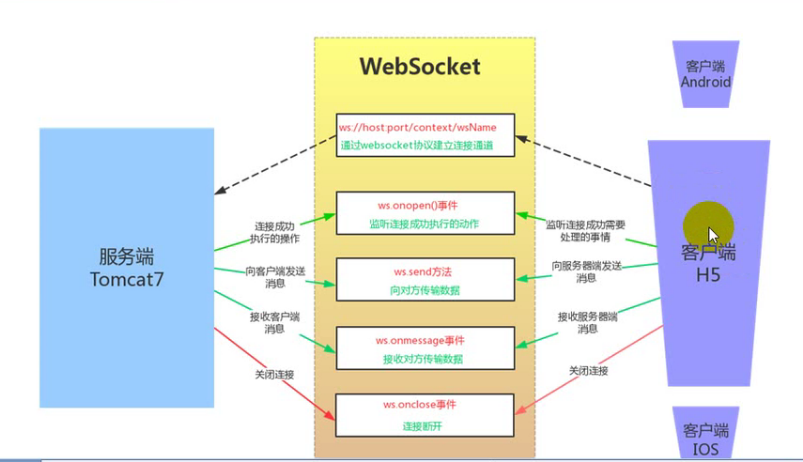

# WebSocket #

* [1、WebSocket简介](#1、WebSocket简介)
* [2、WebSocket特点](#2、WebSocket特点)
* [3、客户端API](#3、客户端API)

- 在BIO中，等待客户端发数据这个过程是阻塞的，这样就造成了一个线程只能处理一个请求的情况，而机器能支持的最大线程数是有限的，这就是为什么BIO不能支持高并发的原因。
- 而NIO中，当一个Socket建立好之后，Thread并不会阻塞去接受这个Socket，而是将这个请求交给Selector，Selector会不断的去遍历所有的Socket，一旦有一个Socket建立完成，他会通知Thread，然后Thread处理完数据再返回给客户端——这个过程是阻塞的，这样就能让一个Thread处理更多的请求了。
- BIO，同步阻塞IO，阻塞整个步骤，如果连接少，他的延迟是最低的，因为一个线程只处理一个连接，适用于少连接且延迟低的场景，比如说数据库连接。
- NIO，同步非阻塞IO，阻塞业务处理但不阻塞数据接收，适用于高并发且处理简单的场景，比如聊天软件。

### 1、WebSocket简介 ###

- WebSocket【B/S通信】 是基于Http协议的一种长连接协议，有了这种协议，我们就可以实现服务端主动往客户端发送消息的功能。
- 是HTML5新增的一种全双工通信协议，目前所有的主流浏览器都支持。
- WebSocket 连接允许客户端和服务器之间进行全双工通信，以便任一方都可以通过建立的连接将数据推送到另一端。
- WebSocket 只需要建立一次连接，就可以一直保持连接状态。这相比于轮询方式的不停建立连接显然效率要大大提高。
- 它的最大特点就是，服务器可以主动向客户端推送信息，客户端也可以主动向服务器发送信息，是真正的双向平等对话，属于服务器推送技术的一种。

> 结构

### 2、WebSocket特点 ###

> 协议标识符是ws（如果加密，则为wss），服务器网址就是 URL -->  ws://example.com:80/some/path

> http 的一次请求过程：

	1. 建立连接；
	2. 发送 request 请求 ；
	3. 返回 response 响应；
	4. 关闭连接。

	短连接，性能消耗大，每次请求都要建立连接。

> websocket

	1. 只需要建立一次连接，就可以一直保持连接状态；
	2. 服务端主动向客户端发送数据 / 客户端主动向服务端发送数据【可以发起多次请求】；  
	3. 关闭连接。

	websocket 请求过程：
		1. 创建 WS 对象及通道：客户端建立 WebSocket 对象并连接服务器对象；
		2. 通道建立成功需要执行的动作： onopen 事件；
		3. 发送消息： send 方法；
		4. 接收消息： onmessage 事件；
		5. 关闭通道： onclose 事件；
		6. 错误处理： onerror 事件；
		7. 主动关闭通道：close() 方法。

	websocket 协议的目的就是使客户端浏览器具备像 C/S 架构下的桌面系统的实时通讯能力【B/S】。
	浏览器通过 JavaScript 向服务器发出建立 websocket 连接的请求，连接建立后，客户端和服务端就可以通过 TCP 连接直接交换数据。
	【TCP 协议：面向连接的，可靠的，基于字节流的传输层的通讯协议。】

> 两者的区别：

	1. 请求发起者：
		HTTP 客户端主动发起请求，服务端不能主动发起请求；
		WebSocket 的客户端和服务端都可以主动向对方发起请求，全双工通讯；

	2. 资源开销：
		HTTP 每次请求-应答都需要客户端和服务端建立连接，性能消耗大；
		WebSocket 一旦建立连接后，后续的数据都以帧序列的形式传输，不需要客户端和服务端再次发起连接请求。
		节省了网络带宽资源的消耗，且客户端发送和接收消息是在同一连接上发起的，实时性更好。

	3. 连接次数：
		HTTP 每次通信都需要建立连接；
		WebSocket 只需要建立一次 HTTP 握手连接，连接成功后可以进行多次数据通信。

### 3、客户端API ###

	1. WebSocket 构造函数

		WebSocket 对象作为一个构造函数，用于新建 WebSocket 实例。

		var ws = new WebSocket('ws://localhost:8080');
		执行上面语句之后，客户端就会与服务器进行连接。
		申请一个WebSocket对象，参数是需要连接的服务器端的地址，同http协议使用http://开头一样，WebSocket协议的URL使用ws://开头，另外安全的WebSocket协议使用wss://开头。

	2. webSocket.readyState

		readyState属性返回实例对象的当前状态，共有四种。

		CONNECTING：值为0，表示正在连接。
		OPEN：值为1，表示连接成功，可以通信了。
		CLOSING：值为2，表示连接正在关闭。
		CLOSED：值为3，表示连接已经关闭，或者打开连接失败。

	3. webSocket.onopen

		实例对象的onopen属性，用于指定连接成功后的回调函数。当websocket创建成功时，即会触发onopen事件。

		ws.onopen = function () {
		  	ws.send('Hello Server!');
		}

		如果要指定多个回调函数，可以使用addEventListener方法。

		ws.addEventListener('open', function (event) {
		  ws.send('Hello Server!');
		});

	4. webSocket.onclose

		实例对象的onclose属性，用于指定连接关闭后的回调函数。
		当客户端收到服务端发送的关闭连接的请求时，触发onclose事件。
		
		ws.onclose = function(event) {
		  var code = event.code;
		  var reason = event.reason;
		  var wasClean = event.wasClean;
		  // handle close event
		};

		ws.addEventListener("close", function(event) {
		  var code = event.code;
		  var reason = event.reason;
		  var wasClean = event.wasClean;
		  // handle close event
		});

   5. webSocket.onmessage

		实例对象的onmessage属性，用于指定收到服务器数据后的回调函数。
		当客户端收到服务端发来的消息时，会触发onmessage事件，参数evt.data中包含server传输过来的数据。
		
		ws.onmessage = function(event) {
		  var data = event.data;
		  // 处理数据
		};

		ws.addEventListener("message", function(event) {
		  var data = event.data;
		  // 处理数据
		});
		
		【注意】服务器数据可能是文本，也可能是二进制数据（blob对象或Arraybuffer对象）。
		
		ws.onmessage = function(event){
		  if(typeof event.data === String) {
		    console.log("Received data string");
		  }

		  if(event.data instanceof ArrayBuffer){
		    var buffer = event.data;
		    console.log("Received arraybuffer");
		  }
		}
		
		除了动态判断收到的数据类型，也可以使用binaryType属性，显式指定收到的二进制数据类型。

		// 收到的是 blob 数据
		ws.binaryType = "blob";
		ws.onmessage = function(e) {
		  console.log(e.data.size);
		};

		// 收到的是 ArrayBuffer 数据
		ws.binaryType = "arraybuffer";
		ws.onmessage = function(e) {
		  console.log(e.data.byteLength);
		};

	6. webSocket.onerror

		实例对象的onerror属性，用于指定报错时的回调函数。
		如果出现连接，处理，接收，发送数据失败的时候就会触发 onerror 事件。

		socket.onerror = function(event) {
		  // handle error event
		};

		socket.addEventListener("error", function(event) {
		  // handle error event
		});

	7. webSocket.bufferedAmount

		实例对象的bufferedAmount属性，表示还有多少字节的二进制数据没有发送出去。它可以用来判断发送是否结束。

		var data = new ArrayBuffer(10000000);
		socket.send(data);

		if (socket.bufferedAmount === 0) {
		  // 发送完毕
		} else {
		  // 发送还没结束
		}

    8. webSocket.send()

		实例对象的 send() 方法用于向服务器发送数据。

		发送文本的例子。
				ws.send('your message');

		发送 Blob 对象的例子。

			var file = document
			  .querySelector('input[type="file"]')
			  .files[0];
			ws.send(file);

		发送 ArrayBuffer 对象的例子。

			var img = canvas_context.getImageData(0, 0, 400, 320);
			var binary = new Uint8Array(img.data.length);
			for (var i = 0; i < img.data.length; i++) {
			  binary[i] = img.data[i];
			}
			ws.send(binary.buffer);

     9. webSocket.close()

 		实例对象的 close() 方法用于 客户端主动关闭 websocket 连接。

 		function closeWebSocket() {
	        ws.close();
	    }

> maven 包：

	<dependency>
      <groupId>javax.websocket</groupId>
      <artifactId>javax.websocket-api</artifactId>
      <version>1.1</version>
    </dependency>