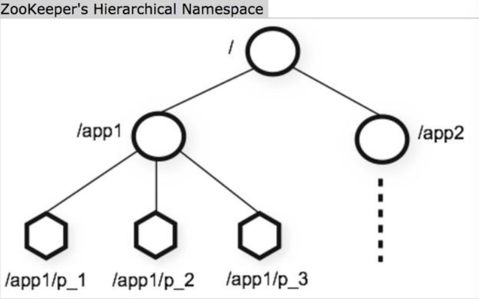
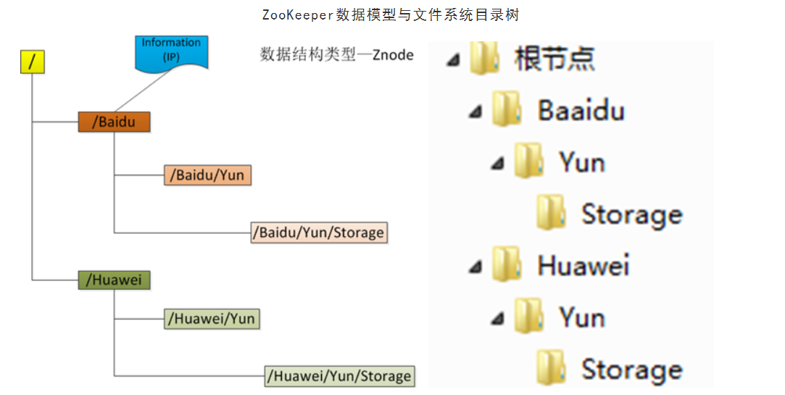
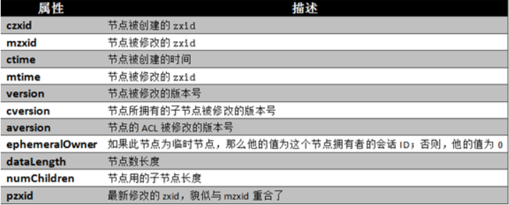
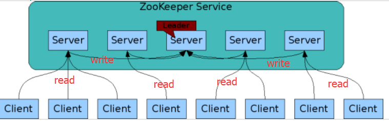
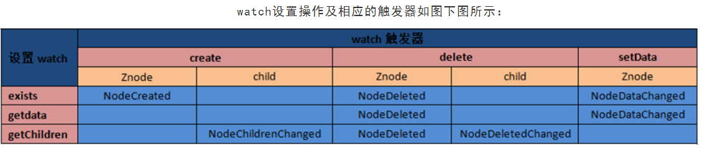
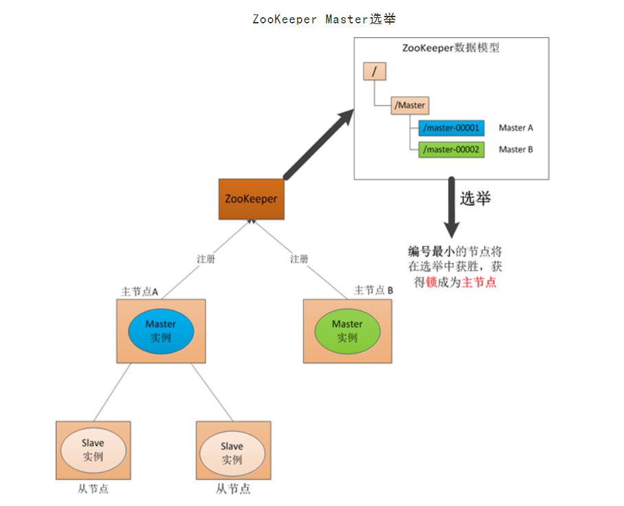
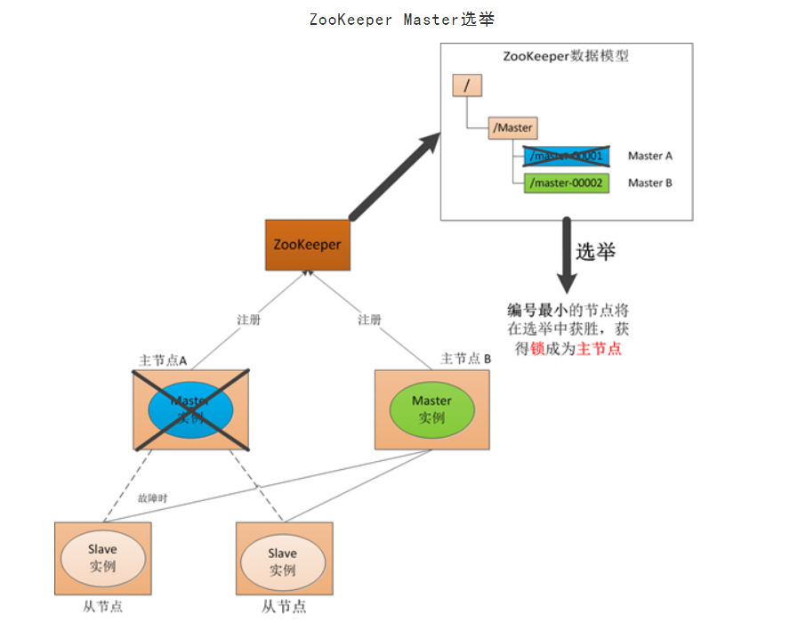
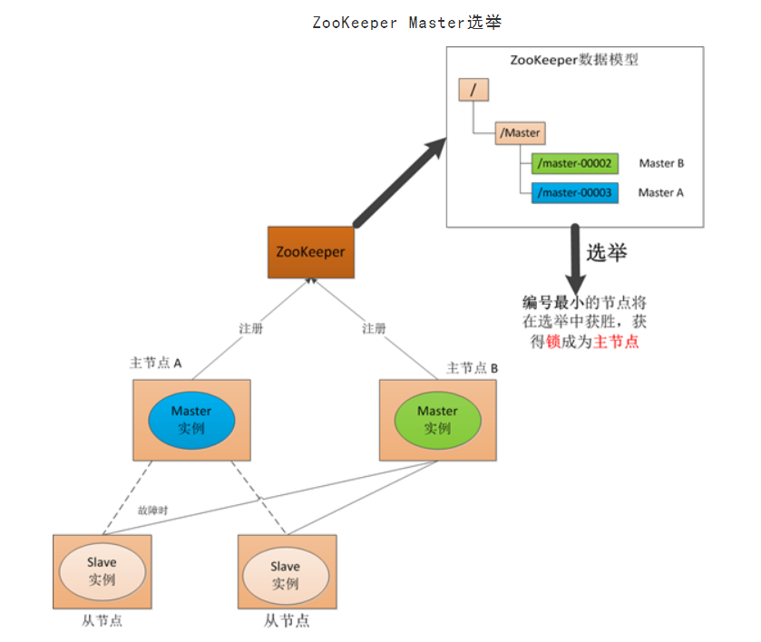
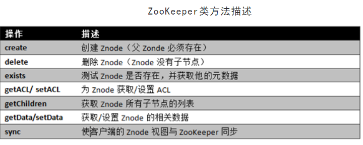
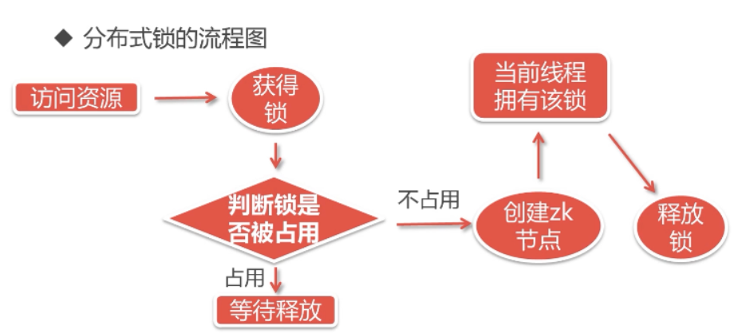

# Zookeeper

* [1、ZooKeeper概述](#1、ZooKeeper概述)
* [2、搭建方式](#2、搭建方式)
* [3、单机模式](#3、单机模式)
* [4、伪集群模式](#4、伪集群模式)
* [5、zookeeper 配置说明](#5、zookeeper配置说明)
* [6、zookeeper 客户端操作](#6、zookeeper客户端操作)
* [7、ZooKeeper数据模型](#7、ZooKeeper数据模型)
* [8、Watch触发器](#8、Watch触发器)
* [9、ACL 操作](#9、ACL操作)
* [10、zookeeper应用场景](#10、zookeeper应用场景)
* [11、ZooKeeper API操作](#11、ZooKeeperAPI操作)

### 1、ZooKeeper概述 ###

[zookeeper官方文档](http://zookeeper.apache.org/doc/r3.4.13/zookeeperAdmin.html)

* ZooKeeper是一种为**分布式**应用所设计的高可用、高性能且一致的开源**协调服务**，它提供了一项基本服务：分布式锁服务。

* 由于ZooKeeper的开源特性，后来我们的开发者在分布式锁的基础上，摸索了出了其他的使用方法：配置维护、组服务、分布式消息队列、分布式通知/协调等。提供的功能包括：**配置文件维护、命名服务、分布式同步、集群管理**等。

* ZooKeeper 为了实现这些服务，设计了一种特殊的**数据结构 -- Znode**【一个主动的、能够在某个外部事件发生时修改数据项状态的数据结构】,并在其基础上定义了一些操作，同时由于服务间是通过网络的形式发送给分布式应用程序的，故还需要一个**通知机制 -- Watcher 机制**。

* 那么总结一下，ZooKeeper所提供的服务主要是通过：**数据结构 + 操作 + watcher机制**，三个部分来实现的。

### 2、搭建方式 ###

> Zookeeper安装方式有三种: 单机模式、集群模式、伪集群模式。  

	单机模式：Zookeeper只运行在一台服务器上，适合测试环境；

	伪集群模式：就是在一台物理机上运行多个Zookeeper 实例；

	集群模式：Zookeeper运行于一个集群上，适合生产环境，这个计算机集群被称为一个“集合体”（ensemble）

> Zookeeper通过复制来实现高可用性，只要集合体中半数以上的机器处于可用状态，它就能够保证服务继续。  
> 为什么一定要超过半数呢？

	这跟Zookeeper的复制策略有关：zookeeper确保对znode 树的每一个修改都会被复制到集合体中超过半数的机器上。  

	通过选举机制进行 leader 的确认，使用心跳机制进行 master/slave 节点的通信。
	所以配置文件中有 心跳端口【2287】和选举端口【3387】。
		server.0=127.0.0.1:2287:3387 

### 3、单机模式 ###

> 1、下载ZooKeeper

	http://zookeeper.apache.org/releases.html

> 2、提取tar文件

	tar xzf zookeeper-3.4.12.tar.gz -C /usr/local/
	cd /usr/local
	mv zookeeper-3.4.12 zookeeper
	cd zookeeper
	#内存数据库快照的存放位置
	mkdir data

> 3、创建配置文件

	使用命令 vim conf/zoo.cfg 和所有以下参数设置为起点，打开名为 conf/zoo.cfg 的配置文件。
	cp  conf/zoo_sample.cfg  conf/zoo.cfg

	vim conf/zoo.cfg

		# 时间单元【每个tick的毫秒数:2000毫秒】
		tickTime = 2000
		# 内存数据库快照的存放位置
		dataDir =  /usr/local/zookeeper/data
		# 数据日志
		dataLogDir = /usr/local/zookeeper/dataLog
		# 客户端监听端口
		clientPort = 2181
		# Follower 初始化限制时间
		initLimit = 5
		# 心跳响应延迟时间，用于主节点和从节点的通信
		syncLimit = 2

	添加环境变量：
	export PATH=/usr/local/zookeeper/bin:$PATH

	生效： source /etc/profile

	默认日志在 conf 目录下：zookeeper.out

> 4、添加客户端连接的防火墙：

	-A INPUT -m state --state NEW -m tcp -p tcp --dport 2181 -j ACCEPT

> 5、启动ZooKeeper服务器

	bin/zkServer.sh start

	执行此命令后，你将收到以下响应

		JMX enabled by default
		Using config: /Users/../zookeeper-3.4.6/bin/../conf/zoo.cfg
		Starting zookeeper ... STARTED

> 6、启动CLI 【ZooKeeper命令行界面】

	bin/zkCli.sh

	执行后将连接到ZooKeeper服务器，你应该得到以下响应。

		Connecting to localhost:2181
		................
		................
		................
		Welcome to ZooKeeper!
		................
		................
		WATCHER::
		WatchedEvent state:SyncConnected type: None path:null
		[zk: localhost:2181(CONNECTED) 0]

> 7、停止ZooKeeper服务器

	zkServer.sh stop

### 4、伪集群模式 ###

> 在集群为分布 式模式下对Zookeeper的操作却和集群模式下没有本质的区别。  
> 最少有3个节点  
> 在一台机器上部署了3个server，需要注意的是在集群为分布式模式下我们使用的每个配置文档模拟一台机器，也就是说单台机器及上运行多个Zookeeper实例。  
> 必须保证每个配置文档的各个端口号不能冲突，除了clientPort不同之外，dataDir也不同。  
> 另外，还要在**dataDir所对应的目录中**创建myid文件来指定对应的Zookeeper服务器实例。

	clientPort：
		如果在1台机器上部署多个server，那么每台机器都要不同的 clientPort。
		比如 server1是2181,server2是2182，server3是2183。

	dataDir 和 dataLogDir：
		dataDir和dataLogDir也需要区分下，将数据文件和日志文件分开存放，同时每个server的这两变量所对应的路径都是不同的。

	server.X 和 myid： 
		server.X 这个数字X就是对应data/myid文件中的数字。
		在3个server的myid文件中分别写入了0，1，2，那么每个server中的zoo.cfg都配 server.0，server.1，server.2就行了。
 
	因为在同一台机器上，后面连着的2个端口，3个server都不要一样，否则端口冲突。比如：
		server.0=127.0.0.1:2287:3387
		server.1=l27.0.0.1:2288:3388
		server.2=127.0.0.1:2289:3389

	【说明】
	server.A=B:C:D

		A：其中 A 是一个数字，表示这个是服务器的编号；
		B：是这个服务器的 ip 地址；
		C：Leader/Follower服务器之间的心跳通信端口;
		D：Leader选举的端口。

> 1、下面是我所配置的集群伪分布模式，分别通过 zoo-0.cfg、zoo-1.cfg、zoo-2.cfg 来模拟由三台机器的Zookeeper集群  
> vim zoo-0.cfg

	tickTime=2000  
	initLimit=10
	syncLimit=5
	dataDir=/usr/local/zookeeper/data
	clientPort=2181

	server.0=127.0.0.1:2287:3387
	server.1=l27.0.0.1:2288:3388
	server.2=127.0.0.1:2289:3389

> vim zoo-1.cfg

	tickTime=2000
	initLimit=10
	syncLimit=5
	dataDir=/usr/local/zookeeper/data_1
	clientPort=2182

	server.0=127.0.0.1:2287:3387
	server.1=l27.0.0.1:2288:3388
	server.2=127.0.0.1:2289:3389

> vim zoo-2.cfg

	tickTime=2000
	initLimit=10
	syncLimit=5
	dataDir=/usr/local/zookeeper/data_2
	clientPort=2183

	server.0=127.0.0.1:2287:3387
	server.1=l27.0.0.1:2288:3388
	server.2=127.0.0.1:2289:3389

> 2、在 dataDir 所对应的目录中创建 myid 文件来指定对应的 Zookeeper 服务器实例：

	Server0 机器的内容为：0
	Server1 机器的内容为：1
	Server2 机器的内容为：2

	echo 0 > /usr/local/zookeeper/data/myid
	echo 1 > /usr/local/zookeeper/data_1/myid
	echo 2 > /usr/local/zookeeper/data_2/myid

	myid 这个文件里面就有一个数据就是 A 的值，Zookeeper 启动时会读取这个文件，将里面的数据与 zoo.cfg 里面的配置信息【server.X】比较从而判断到底是那个 server。

> 3、添加防火墙

	-A INPUT -m state --state NEW -m tcp -p tcp --dport 2181 -j ACCEPT
	-A INPUT -m state --state NEW -m tcp -p tcp --dport 2182 -j ACCEPT
	-A INPUT -m state --state NEW -m tcp -p tcp --dport 2183 -j ACCEPT

> 4、 启动

	./zkServer.sh start zoo-0.cfg
	./zkServer.sh start zoo-1.cfg
	./zkServer.sh start zoo-2.cfg

	在运行完第一条指令之后，会出现一些错误异常，产生异常信息的原因是由于Zookeeper服务的每个实例都拥有全局配置信息，他们在启动的时候会随时随地的进行Leader选举操作。
	此时，第一个启动的Zookeeper需要和另外两个Zookeeper实例进行通信。
	但是，另外两个Zookeeper实例还没有启动起来，因此就产生了这的异样信息。
	我们直接将其忽略即可，其他Zookeeper实例启动起来之后，相应的异常信息自然会消失。

> 5、查询运行状态

	 ./zkServer.sh status zoo-0.cfg
	 ./zkServer.sh status zoo-1.cfg
	 ./zkServer.sh status zoo-2.cfg

> 6、启动Zookeeper服务之后，才可以启动 客户端连接服务，如下：

	./zkCli.sh -server localhost:2181  
	./zkCli.sh -server localhost:2182  
	./zkCli.sh -server localhost:2183

### 5、zookeeper 配置说明 ###

> Zookeeper 默认配置文件 zoo.conf

	# The number of milliseconds of each tick
	# 时间单元【每个tick的毫秒数:2000毫秒】
	tickTime=2000

	# The number of ticks that the initial 
	# synchronization phase can take
	# Follower 初始化限制时间
	initLimit=10

	# The number of ticks that can pass between 
	# sending a request and getting an acknowledgement
	# 心跳响应延迟时间
	syncLimit=5

	# the directory where the snapshot is stored.
	# do not use /tmp for storage, /tmp here is just 
	# example sakes.
	# 内存数据库快照的存放位置
	dataDir=/usr/local/zookeeper/data

	# the port at which the clients will connect
	# 客户端监听端口
	clientPort=2181

	# the maximum number of client connections.
	# increase this if you need to handle more clients
	# 限制连接到Zookeeper的客户端数量
	#maxClientCnxns=60
	#
	# Be sure to read the maintenance section of the 
	# administrator guide before turning on autopurge.
	#
	# http://zookeeper.apache.org/doc/current/zookeeperAdmin.html#sc_maintenance
	#
	# The number of snapshots to retain in dataDir
	#autopurge.snapRetainCount=3
	# Purge task interval in hours
	# Set to "0" to disable auto purge feature
	#autopurge.purgeInterval=1

	# 日志目录
	dataLogDir=/usr/local/zookeeper/data/log

> minSessionTimeout和maxSessionTimeout

	即最小的会话超时和最大的会话超时时间。  
	在默认情况下，minSession=2*tickTime;maxSession=20*tickTime。

> 集群配置
> initLimit

	此配置表示，允许follower(相对于Leaderer而言的“客户端”)连接并同步到Leader的初始化连接时间，以tickTime为单位。当初始化连接时间超过该值，则表示连接失败。

> syncLimit

	此配置项表示Leader与Follower之间发送消息时，请求和应答时间长度。如果follower在设置时间内不能与leader通信，那么此follower将会被丢弃。心跳响应时间。

> server.A=B：C：D

	A：其中 A 是一个数字，表示这个是服务器的编号；
	B：是这个服务器的 ip 地址；
	C：Zookeeper服务器之间的通信端口；
	D：Leader选举的端口。
	
> myid

	集群模式下还要配置一个文件 myid，这个文件在 dataDir 目录下，myid 有一个数据就是 A 的值，Zookeeper 启动时会读取这个文件，将里面的数据与 zoo.cfg 里面的配置信息【server.X】比较从而判断到底是那个 server。

### 6、zookeeper 客户端操作 ###

> 启动客户端

	启动zookeeper 服务后，使用命令 ./zkCli.sh 启动zookeeper客户端连接服务，就可以使用客户端命令来操作zookeeper。

> 连接zookeeper服务端

	ZooKeeper -server host:port cmd args

> 操作命令 help

    stat path [watch] 	// 检查状态【状态描述指定的znode的数据。它包含时间戳，版本号，ACL，数据长度和子znode等细项。】

    set path data [version]	// 设置数据，根据版本号实现乐观锁锁住数据。

    ls path [watch]    		// 列出和显示znode的子项  ls /FirstZnode

    delquota [-n|-b] path
    ls2 path [watch]		// 列出和显示znode的子项详细信息，包括状态数据。
    setAcl path acl
    setquota -n|-b val path
    history 
    redo cmdno
    printwatches on|off
    delete path [version]	// 可以根据版本号进行安全删除
    sync path
    listquota path
    rmr path  				// 移除/删除znode
    get path [watch]  		// 获取数据,也可以添加监视，当指定的znode或znode的子数据更改时，监视器会显示通知
    create [-s] [-e] path data  	// 创建znode
    addauth scheme auth		// 添加对应 schme机制的认证账号 auth
    quit 
    getAcl path				// 获取某个节点的ACL权限信息
    close 
    connect host:port

	比如：
		get /images watch

> zk四字命令[The Four Letter Words] 

[具体命令信息](http://zookeeper.apache.org/doc/r3.4.13/zookeeperAdmin.html#sc_zkCommands)

	zk 可以通过它自身提供的简写命令来和服务器进行交互，以查看相应信息。
	在客户端中可以使用 nc 或者 telnet 命令来连接服务端。
	安装 yum install -y nc

	echo [commond] | nc [ip] [port]
		每个命令[commond]都是四个字母。

	比如：
	echo stat | nc localhost 2181	// 显示zk服务器的状态
	echo conf | nc localhost 2181	// 显示zk服务器的配置

	默认是不可以使用"wchp" 和 "wchc" 这两个命令的。
	在 zoo.cfg 中添加  4lw.commands.whitelist=* 就可以使用所有的4字命令。
	重启 zk。
	
	wchs:	列出服务器中被watcher的简明信息
	wchc:	按会话列出有关服务器watcher的详细信息。

### 7、ZooKeeper数据模型

> 1、zookeeper 数据结构 -- 节点 Znode

- 结构如图：

- 所有的Znode构成一个层次化的命名空间。一种自然的建立组成员列表的方式就是利用这种层次结构，创建一个以组名为节点名的Znode作为父节点，然后以组成员名（服务器名）为节点名来创建作为子节点的Znode，即树形层次结构。

- ZooKeeper的数据模型的节点间由斜杠(/)进行分割的路径，就是一个ZNode，每个ZNode上除了保存自己的数据内容，还保存一系列属性信息；

- 可以将 ZooKeeper 看作一个具有高可用性的文件系统。但这个文件系统中没有文件和目录，而是统一使用“节点”的概念，称为Znode【数据单元】。

> 节点引用方式

	Zonde 通过路径引用，如同Unix中的文件路径。
	路径必须是绝对的，因此 Zonde 必须由斜杠字符来开头。
	除此以外，Zonde 必须是唯一的，也就是说每一个路径只有一个表示，因此这些路径不能改变。
	ZooKeeper机制规定：同一个Znode下只能有一个唯一的子Znode。

> Znode结构

	Znode 既可以作为保存数据的容器【文件】，也可以作为保存其他Znode的容器【目录】。
	既像文件一样维护着数据、元信息、ACL、时间戳等数据结构，又像目录一样可以作为路径标识的一部分。

	每个Znode由3部分组成:

		stat：此为状态信息, 描述该Znode的版本, 权限等信息

		data：与该Znode关联的数据
		
		children：该Znode下的子节点

	【注】 关联的数据一般都是很小的数据，通常以KB为单位，它用来管理调度数据，比如分布式应用中的配置文件信息、状态信息、汇集位置等等。
	ZooKeeper的服务器和客户端都被设计为严格检查并限制每个Znode的数据大小至多1M。

> 数据访问

	ZooKeeper中的每个节点存储的数据要被原子性的操作。
	也就是说读操作将获取与节点相关的所有数据，写操作也将替换掉节点的所有数据。
	另外，每一个节点都拥有自己的ACL(访问控制列表)，这个列表规定了用户的权限，即限定了特定用户对目标节点可以执行的操作。
		
> 节点类型

	ZooKeeper中的节点有两大类:临时节点和永久节点。节点的类型在创建时即被确定，并且不能改变。
	
	1. 临时节点：该节点的生命周期依赖于创建它们的会话。
		一旦会话(Session)结束，临时节点将被自动删除，当然可以也可以手动删除。
		虽然每个临时的Znode都会绑定到一个客户端会话，但他们对所有的客户端还是可见的。
		另外，ZooKeeper的临时节点不允许拥有子节点。
	
	2. 永久节点【默认】：该节点的生命周期不依赖于会话。
		只有在客户端显示执行删除操作的时候，他们才能被删除，否则节点会一直保存在ZooKeeper上；  

	四种类型：临时节点、顺序临时节点、持久节点、顺序持久节点。

> 顺序节点

	当创建Znode的时候，用户可以请求在ZooKeeper的路径结尾添加一个递增的计数。
	这个计数对于此节点的父节点来说是唯一的，它的格式为"%10d"(10位数字，没有数值的数位用0补充，例如"0000000001")。
	当计数值大于232-1时，计数器将溢出。

> 创建Znodes

	用给定的路径创建一个znode。flag参数指定创建的znode的类型。默认情况下，所有znode都是持久的。
	临时节点（flag：-e）
	顺序节点（flag：-s）保证znode路径将是唯一的,ZooKeeper集合将向znode路径填充10位序列号。
		例如，znode路径 /myapp 将转换为/myapp0000000001，下一个序列号将为/myapp0000000002。

	要访问顺序节点，必须输入znode的完整路径。

		get /FirstZnode0000000023

> 观察

	客户端可以在节点上设置 Watch【监视器】。
	当节点状态发生改变时(Znode的增、删、改)将会触发watch所对应的操作。
	当watch被触发时，ZooKeeper将会向客户端发送且仅发送一条通知，因为watch只能被触发一次，这样可以减少网络流量。

> 会话

	会话就是一个客户端与服务器之间的一个TCP长连接。客户端和服务器的一切交互都是通过这个长连接进行的；
	
	会话会在客户端与服务器断开链接后，如果经过了设点的sessionTimeout时间内没有重新链接后失效。

> 版本号

	对节点的每一个操作都将致使这个节点的版本号增加。每个节点维护着三个版本号，他们分别为：

		1.version：节点数据版本号
		2.cversion：子节点版本号
		3.aversion：节点所拥有的ACL版本号

> ZooKeeper节点属性

	使ZooKeeper节点状态改变的每一个操作都将使节点接收到一个Zxid格式的时间戳，并且这个时间戳全局有序。
	即每个对节点的改变都将产生一个唯一的Zxid。

> 集群角色

	ZooKeeper中包含Leader【领导者】、Follower【跟随者】和 Observer【观察者】三个角色；
	
	通过一次选举过程，被选举的机器节点被称为Leader，Leader机器为客户端提供读和写服务；
	
	Follower 和 Observer是集群中的其他机器节点，唯一的区别就是：Observer不参与Leader的选举过程，也不参与写操作的过半写成功策略。

> 一个典型的ZooKeeper集群如下：

	当 leader 挂掉后，选举出新的 leader，当挂掉的leader 恢复时，新的leader 不变，恢复的leader 状态就变成了 follower。

### 8、Watch触发器 ###

> watch概述

	ZooKeeper可以为所有的读操作设置watch，这些读操作包括：exists()、getData()及getChildren()。
	watch事件是一次性的触发器，当watch的对象状态发生改变时，将会触发此对象上watch所对应的事件。
	watch事件将被异步地发送给客户端，并且ZooKeeper为 watch机制 提供了有序的一致性保证。
	理论上，客户端接收watch事件的时间要快于其看到watch对象状态变化的时间。

> watch类型  

	ZooKeeper所管理的watch可以分为两类：

		1.数据 watch(data  watches)：getData和exists负责设置数据watch

		2.子节点 watch(child watches)：getChildren负责设置子节点watch

	我们可以通过操作返回的数据来设置不同的watch：
	
		1.getData和exists：返回关于节点的数据信息

		2.getChildren：返回子节点列表
	
	因此
		1.一个成功的setData操作将触发Znode的数据watch
		
		2.一个成功的create操作将触发Znode的数据watch以及子节点watch
		
		3.一个成功的delete操作将触发Znode的数据watch以及子节点watch

> watch注册与触发

	1. exists操作上的watch，在被监视的Znode创建、删除或数据更新时被触发。

	2. getData操作上的watch，在被监视的Znode删除或数据更新时被触发。在被创建时不能被触发，因为只有Znode存在，getData操作才会成功。

	3. getChildren操作上的watch，在被监视的Znode的子节点创建或删除，或是这个Znode自身被删除时被触发。

	可以通过查看watch事件类型来区分是Znode，还是他的子节点被删除：NodeDelete表示Znode被删除，NodeDeletedChanged表示子节点被删除。
	
	Watch由客户端所连接的ZooKeeper服务器在本地维护，因此watch可以非常容易地设置、管理和分派。
	当客户端连接到一个新的服务器时，任何的会话事件都将可能触发watch。
	另外，当从服务器断开连接的时候，watch将不会被接收。
	但是，当一个客户端重新建立连接的时候，任何先前注册过的watch都会被重新注册。

	给目录 /images 添加监控事件
	get /images watch
	这样当该目录变化或者被删除时将会触发事件【NodeDataChanged、NodeDeleted】。

> Zookeeper的watch实际上要处理两类事件：

	1. 连接状态事件(type=None, path=null)
	
		这类事件不需要注册，也不需要我们连续触发，我们只要处理就行了。
	
	2. 节点事件
	
		节点的建立，删除，数据的修改。它是one time trigger，我们需要不停的注册触发，还可能发生事件丢失的情况。

	上面2类事件都在Watch中处理，也就是重载的process(Event event)

	节点事件的触发，通过函数exists，getData或getChildren来处理这类函数，有双重作用：

		1. 注册触发事件
		
		2. 函数本身的功能
	
	函数的本身的功能又可以用异步的回调函数来实现,重载processResult()过程中处理函数本身的的功能。

> Watcher 接口只有一个方法

	public void process(WatcherEvent event);

> watcher 使用场景

	1. 统一资源配置
		分布式中，一个主机节点更新配置文件，就会触发 watcher的 NodeDataChanged 事件，当收到该事件时就会更新其他客户端的配置。

### 9、ACL 操作 ###

	对路径的访问进行权限设置

> acl 命令行

	getAcl /path		// 读取路径的acl
	setAcl /path acl	// 给路径设置acl 

> acl 的构成

	zk 的acl 通过【 scheme:id:permissions】来构成权限列表。
		scheme: 代表采用的某种权限机制
		id:		代表允许访问的用户
		permissions: 权限组合的字符串

> scheme 权限机制

	1. world【默认】

		代表任何人都可以，world 下只有一个id，即只有一个用户【anyone】。
		组合写法：	world:anyone:[permissions]
		默认的权限组合 cdrwa 【创建，删除，读，写，设置】

		比如：
			setAcl /images world:anyone:cdrwa

	2. auth

		代表认证登录，需要注册用户有权限才可以。
		组合写法：	auth:username:password:[permissions]
		密码为 明文。
		例子： 
			//	添加认证用户 alex:123456，digest表示密码为密文保存
			addauth digest alex:123456	
			setAcl /images auth:alex:123456:cdrwa

		当需要访问加密路径时，需要登录才可以访问。
		比如：
			addauth digest alex:123456	// 登录
			get /images

	3. digest

		需要对密码加密才可以访问。
		组合写法：	digest:username:BASE64(SHA1(password)):[permissions]
		密码为 密文。
		例子：
			addauth digest alex:123456	
			setAcl /images auth:alex:[加密密码]:cdrwa

	4. ip

		当设置为ip指定的ip地址时，表示限制 ip 进行访问。
		组合写法:	ip:192.168.1.1:[permissions]

	5. super

		代表超级管理员，拥有所有的权限。
		一般只给运维使用。
		5.1. 修改 zKServer.sh 添加 super 管理员；
			在 nohup 中添加 
			"-Dzookeeper.DigestAuthenticationProvider.superDigest=admin:123456"

			【说明】
			在源码 DigestAuthenticationProvider.java 中。

		5.2. 重启 zKServer.sh

### 10、zookeeper应用场景 ###

> 解决单点故障中由于网络故障所引起的 双Master 的问题。ZooKeeper虽然不能避免网络故障，但它能够保证每时每刻只有一个Master。

> Master启动

	在引入了Zookeeper以后我们启动了两个主节点，"主节点-A"和"主节点-B"他们启动以后，都向ZooKeeper去注册一个节点。
	我们假设"主节点-A"锁注册地节点是"master-00001"，"主节点-B"注册的节点是"master-00002"，注册完以后进行选举，编号最小的节点将在选举中获胜获得锁成为主节点，也就是我们的"主节点-A"将会获得锁成为主节点，然后"主节点-B"将被阻塞成为一个备用节点。那么，通过这种方式就完成了对两个Master进程的调度。

> Master故障

	如果"主节点-A"挂了，这时候他所注册的节点将被自动删除，ZooKeeper会自动感知节点的变化，然后再次发出选举，这时候"主节点-B"将在选举中获胜，替代"主节点-A"成为主节点。

> Master 恢复
	
	如果主节点恢复了，他会再次向ZooKeeper注册一个节点，这时候他注册的节点将会是"master-00003"，ZooKeeper会感知节点的变化再次发动选举，这时候"主节点-B"在选举中会再次获胜继续担任"主节点"，"主节点-A"会担任备用节点。

### 11、ZooKeeper API操作 ###

#### ZK原生 API 基本操作 ####

	更新ZooKeeper操作是有限制的。
	delete或setData必须明确要更新的Znode的版本号，我们可以调用exists找到。
	如果版本号不匹配，更新将会失败。

	更新ZooKeeper操作是非阻塞式的。

    API源码位于 org.apache.zookeeper.Zookeeper

> pom.xml

	<dependency>
      <groupId>org.apache.zookeeper</groupId>
      <artifactId>zookeeper</artifactId>
      <version>3.4.6</version>
    </dependency>

> 连接 ZK 服务器 

	连接到ZooKeeper集合，然后返回 ZooKeeper 对象。
    客户端和ZK服务端连接是一个异步的过程。
    当连接成功后，客户端会收到一个 watch 通知。
           
	new ZooKeeper(String connectionString, int sessionTimeout, Watcher watcher)
		1. connectionString - ZooKeeper集合主机。
	    	单机模式：connectionString = 192.168.1.30:2181
	     	集群模式：connectionString = 192.168.1.30:2181,192.168.1.30:2182,192.168.1.30:2183

			【注】单机模式时，若端口是默认的 2181，可以省略不写。

	    2. sessionTimeout - 会话超时（以毫秒为单位）。
	    
	    3. watcher - 实现“监视器”界面的对象。
	    	ZooKeeper集合通过监视器对象返回连接状态。
	     	Watcher对象接收来自于ZooKeeper的回调，以获得各种事件的通知。
	     	如果不使用就设置为 null 即可。
	     
	public class ZKConnection {
	
	    private ZooKeeper zooKeeper;
	    final CountDownLatch countDownLatch = new CountDownLatch(1);
	
	    /**
	     * CountDownLatch类来阻止使用新建的ZooKeeper对象，直到这个ZooKeeper对象已经准备就绪。
	     */
	    public ZooKeeper connect(String host) throws IOException, InterruptedException {
	        zooKeeper = new ZooKeeper(host, 5000, new Watcher() {
	            /**
	             * 客户端已经与ZooKeeper建立连接后，Watcher的process()方法会被调用，参数是一个表示该连接的事件。
	             *  此时才将 ZooKeeper返回，避免返回一个未连接的 ZooKeeper
	             */
	            @Override
	            public void process(WatchedEvent watchedEvent) {
	                if (watchedEvent.getState() == Event.KeeperState.SyncConnected){
	                    countDownLatch.countDown();
	                }
	            }
	        });
	        countDownLatch.await();
	        return zooKeeper;
	    }
	
	    /**
	     * 关闭连接
	     */
	    public void close() throws InterruptedException {
	        zooKeeper.close();
	    }
	}

> 创建节点 Znode

	create(String path, byte[] data, List<ACL> acl, CreateMode createMode)
	 
		1. path - Znode路径。
			例如，/myapp1，/myapp2，/myapp1/mydata1，myapp2/mydata1/myanothersubdata

		2. data - 要存储在指定znode路径中的字节数组数据 byte[]
	
		3. acl - 要创建的节点的访问权限列表。
			ZooKeeper API提供了一个静态接口 ZooDefs.Ids 来获取一些基本的acl列表。
			例如，ZooDefs.Ids.OPEN_ACL_UNSAFE 返回打开 Znode的acl列表[ world:anyone:cdrwa]。
	
		4. createMode - 节点的类型，即临时，顺序或两者。这是一个枚举。

			PERSISTENT (0, false, false),			// 持久节点
		    PERSISTENT_SEQUENTIAL (2, false, true),	// 持久顺序节点
		    EPHEMERAL (1, true, false),				// 临时节点
		    EPHEMERAL_SEQUENTIAL (3, true, true);	// 临时顺序节点

		比如：
	    private static ZooKeeper zooKeeper;
		private static ZKConnection zkConnection;

	    public static void create(String path, byte[] data) throws KeeperException, InterruptedException {
	        zooKeeper.create(path,data, ZooDefs.Ids.OPEN_ACL_UNSAFE, CreateMode.PERSISTENT);
	    }

	public static void main(String[] args) {
        String path = "/ThreeZnode";
        byte[] data = "this is test".getBytes();
        zkConnection = new ZKConnection();
        try {
            zooKeeper = zkConnection.connect("192.168.1.30:2181,192.168.1.30:2182,192.168.1.30:2183");
            create(path,data);
        } catch (IOException|InterruptedException|KeeperException e) {
            e.printStackTrace();
        } finally {
            try {
                zkConnection.close();
            } catch (InterruptedException e) {
                e.printStackTrace();
            }
        }
    }

> 检查Znode的存在

	如果指定的znode存在，则返回一个znode的元数据。

	exists(String path, boolean watcher)
		path：		Znode路径
		watcher：	布尔值，用于指定是否监视指定的Znode

	比如：
	private static ZooKeeper zooKeeper;

    public static Stat Znode_exist(String path,boolean watcher)
            throws KeeperException, InterruptedException {
        return zooKeeper.exists(path,watcher);
    }

	public static void main(String[] args) {
        ZKConnection connection = new ZKConnection();
        try {
            zooKeeper = connection.connect("192.168.1.30");
            String path = "/SecondZnode";
            Stat stat = zooKeeper.exists(path, true);
            if (stat != null){
                System.out.println("版本号="+stat.getAversion());
                System.out.println("数据长度="+stat.getDataLength());
            }else{
                System.out.println("该节点"+path+"不存在");
            }
        } catch (Exception e) {
            e.printStackTrace();
        }
    }

> 修改节点数据

	ZooKeeper类提供 setData 方法来修改指定znode中附加的数据。

	setData(String path, byte[] data, int version)
		path：		Znode路径
		data：		要存储在指定znode路径中的数据。
		version：	znode的当前版本。每当数据更改时，ZooKeeper会更新znode的版本号。

	比如：
	public class ZKSetData {
	    private static ZooKeeper zooKeeper;
	    private static ZKConnection zkConnection;
	
		// zooKeeper.exists(path,true).getVersion() 获取当前版本号
	    public static  void update(String path, byte[] data) throws KeeperException, InterruptedException {
	        zooKeeper.setData(path,data,zooKeeper.exists(path,true).getVersion());
	    }
	
	    public static void main(String[] args) {
	        String path = "/SecondZnode";
	        byte[] data = "this is set test".getBytes();
	
	        zkConnection = new ZKConnection();
	        try {
	            zooKeeper = zkConnection.connect("192.168.1.30");
	            update(path,data);
	
	        } catch (IOException|InterruptedException|KeeperException e) {
	            e.printStackTrace();
	        }
	
	    }
	}

> 删除节点

	ZooKeeper类提供了 delete 方法来删除指定的znode。

	delete(String path, int version)
		path：		Znode路径。
		version：	znode的当前版本。

	public class ZKDelete {
	
	    private static ZooKeeper zooKeeper;
	    private static ZKConnection zkConnection;
	
	    public static void delete(String path) throws KeeperException, InterruptedException {
	        zooKeeper.delete(path,zooKeeper.exists(path,true).getVersion());
	    }
	
	    public static void main(String[] args) {
	        String path = "/ThZnode";
	        zkConnection = new ZKConnection();
	        try {
	            zooKeeper = zkConnection.connect("192.168.1.30");
	            delete(path);
	        } catch (IOException|InterruptedException|KeeperException e) {
	            e.printStackTrace();
	        }
	    }
	}

> 获取节点数据

	获取附加在指定znode中的数据及其状态。
	先判断节点是否存在，再去获取节点数据。

	getData(String path, Watcher watcher, Stat stat)

		path：		Znode路径。
		watcher：	监视器类型的回调函数。
					当指定的znode的数据改变时，ZooKeeper集合将通过监视器回调进行通知。
					这是一次性通知。
		stat：		存放获取的znode的状态数据。Stat stat = new Stat();

	public class ZKGetData implements Watcher{
	
	    private static Logger log = LoggerFactory.getLogger(ZKGetData.class);
	    private static ZooKeeper zooKeeper;
	    private final static String host = "192.168.1.30:2181,192.168.1.30:2182,192.168.1.30:2183";
	
	    public static ZooKeeper init() throws IOException, InterruptedException {
	        ZKConnection zkConnection = new ZKConnection();
	        zooKeeper =  zkConnection.connect(host);
	        return zooKeeper;
	    }
	
	    public static Stat znode_exists(String path) throws KeeperException, InterruptedException, IOException {
	        init();
	        return zooKeeper.exists(path,true);
	    }
	
	    public static void znode_getData(String path) throws KeeperException, InterruptedException, IOException {
	        init();
	        Stat stat = znode_exists(path);
	        // 判断节点是否存在
	        if (stat != null){
	            byte[] data = zooKeeper.getData(path, true, null);
	            log.info("节点数据，{}",new String(data,"UTF-8"));
      			log.info("节点状态，{}", stat);
	        }else {
	            log.info("该节点不存在");
	        }
	    }
	
	    public static void create(String path, byte[] data) throws KeeperException, InterruptedException, IOException {
	        init();
	        zooKeeper.create(path,data, ZooDefs.Ids.OPEN_ACL_UNSAFE, CreateMode.PERSISTENT);
	    }
	
	    @Override
	    public void process(WatchedEvent watchedEvent) {
	
	        if (Event.KeeperState.SyncConnected == watchedEvent.getState()) {
	            if (Event.EventType.NodeCreated == watchedEvent.getType()) {
	                log.info("success create znode");
	
	            } else if (Event.EventType.NodeDataChanged == watchedEvent.getType()) {
	                log.info("success change znode: " + watchedEvent.getPath());
	
	            } else if (Event.EventType.NodeDeleted == watchedEvent.getType()) {
	                log.info("success delete znode");
	
	            } else if (Event.EventType.NodeChildrenChanged == watchedEvent.getType()) {
	                log.info("NodeChildrenChanged");
	            }
	        }
	    }
	
	    public static void main(String[] args) {
	        String path = "/ThZnode";
	        byte[] data = "this is three test".getBytes();
	        try {
	            create(path,data);
	            znode_getData(path);
	        } catch (IOException|InterruptedException|KeeperException e) {
	            e.printStackTrace();
	        }
	    }
	}	

> 获取子节点数据

	ZooKeeper类提供 getChildren 方法来获取特定znode的所有子节点。

	getChildren(String path, Watcher watcher)
		path:		Znode路径。
		watcher:	监视器类型的回调函数。
				当指定的znode被删除或znode下的子节点被创建/删除时，ZooKeeper集合将进行通知。
				这是一次性通知。

	public class ZKGetChildren {
	
	    private static Logger log = LoggerFactory.getLogger(ZKGetChildren.class);
	    private static ZooKeeper zooKeeper;
	    private static ZKConnection zkConnection;
	
	    public static Stat znode_exists(String path) throws KeeperException, InterruptedException {
	        return zooKeeper.exists(path,true);
	    }
	
	    public static void main(String[] args) {
	        String path = "/SecondZnode";
	        zkConnection = new ZKConnection();
	        try {
	            zooKeeper = zkConnection.connect("192.168.1.30");
	            Stat stat = znode_exists(path);
	            if (stat != null){
	                List<String> childrens = zooKeeper.getChildren(path, false);
	                if (childrens.size() >0){
	                    for (String children:childrens
	                            ) {
	                        byte[] childrenData = zooKeeper.getData(path + "/" + children, false, stat);
                        	log.info("子节点数据: {}", new String(childrenData,"UTF-8"));
	
	                    }
	                }else{
	                    log.info("该节点不存在子节点");
	                }
	
	            }else{
	                log.info("该节点不存在");
	            }
	        } catch (IOException|InterruptedException|KeeperException e) {
	            e.printStackTrace();
	        }
	    }
	}

> 自定义 ACL 用户权限

	public static void create(String path, byte[] data) throws Exception {
        List<ACL> acls = new ArrayList<>();
        Id admin = new Id("digest", AclUtils.getDigestUserPwd("admin:123456"));
        Id alex = new Id("digest", AclUtils.getDigestUserPwd("alex:123456"));
        acls.add(new ACL(ZooDefs.Perms.ALL,admin));
        acls.add(new ACL(ZooDefs.Perms.READ,alex));
        zooKeeper.create(path,data, acls, CreateMode.PERSISTENT);
    }

	// 格式化认证账号
	public class AclUtils {
	
	    public static String getDigestUserPwd(String id) throws Exception {
	        return DigestAuthenticationProvider.generateDigest(id);
	    }
	
	    public static void main(String[] args) throws Exception {
	        String id = "admin:123456";
	        String idDigested = getDigestUserPwd(id);
	        System.out.println(idDigested);
	    }
	}

> zk 原生API的不足

	1. 超时重连，不支持指定，需要手动重连；
	2. Watch 注册一次后就失效；
	3. 不支持递归创建节点

#### Apache curator 客户端 ####

> Apache curator

	Apache 的开源项目
	解决 ZK 原生API 的不足。
	提供简洁方便的 API

	使用 Apache curator客户端【CuratorFramework实例】 去操作 zookeeper服务端。

> curator 连接 ZK 服务端的重试策略

	重试策略都是实现了该接口 RetryPolicy

    1. ExponentialBackoffRetry
			baseSleepTimeMs：初始sleep的时间，默认 2147483647 ms
			maxRetries：最大重试次数
			maxSleepMs：最大重试时间
	
		RetryPolicy retryPolicy = new ExponentialBackoffRetry(1000, 5);

	2. RetryNTimes【推荐】
			n：重试的次数
			sleepMsBetweenRetries：每次重试间隔的时间

        RetryPolicy retryPolicy = new RetryNTimes(3, 5000);

	3. RetryOneTime
			sleepMsBetweenRetry:每次重试间隔的时间
	
		RetryPolicy retryPolicy2 = new RetryOneTime(3000);

	4. RetryForever
        	永远重试，不推荐使用

		RetryPolicy retryPolicy3 = new RetryForever(retryIntervalMs)

	5. RetryUntilElapsed
			maxElapsedTimeMs:最大重试时间
			sleepMsBetweenRetries:每次重试间隔
			重试时间超过maxElapsedTimeMs后，就不再重试

		RetryPolicy retryPolicy4 = new RetryUntilElapsed(2000, 3000);

> curator 客户端开启

	public class Curator2ZK {
	
	    private final static Logger logger = LoggerFactory.getLogger(Curator2ZK.class);
	    public CuratorFramework client = null;
	    private final static String ZK_SERVER_HOST = "192.168.1.30:2181";
	    public String PROJECT_PATH = "workspace";
	
	    RetryPolicy retryPolicy = new RetryNTimes(3, 5000);
	
	    /**
	     *  实例化 ZK 客户端连接
	     *  同步创建zk示例，原生api是异步的
	     *  使用 CuratorFrameworkFactory 工厂创建 curator 客户端，并配置相关参数
	     */
	    public Curator2ZK() {
	        client = CuratorFrameworkFactory.builder()
	                .connectString(ZK_SERVER_HOST)
	                .sessionTimeoutMs(5000)
	                .retryPolicy(retryPolicy)
	                // 重试策略
	                .retryPolicy(retryPolicy)
	                // 根目录
	                .namespace(PROJECT_PATH)
	                .build();
	
	        // 客户端开启
	        client.start();
	    }
	
	    /**
	     *  关闭ZK 客户端连接
	     */
	    public void closeZKClient(){
	        if (client != null){
	            client.close();
	        }
	    }
	}

> 创建节点

	public void createZnode(CuratorFramework client,String nodePath,byte[] nodeData) throws Exception {

        CuratorFrameworkState clientState = client.getState();
        logger.info("当前客户的状态：{}", clientState.name());

        client.create()
                // 可以递归创建节点
                .creatingParentsIfNeeded()
                .withMode(CreateMode.PERSISTENT)
                .withACL(ZooDefs.Ids.OPEN_ACL_UNSAFE)
                // 指定创建的节点路径，并给路径添加数据
                .forPath(nodePath,nodeData);
    }

> 判断节点是否存在

	public Stat existZnode(CuratorFramework client,String nodePath) throws Exception {
        return client.checkExists().forPath(nodePath);
    }

> 删除节点

	public void deleteZnode(CuratorFramework client,String nodePath,Stat stat) throws Exception {
        client.delete()
                // 如果删除失败，那么在后端还是继续会删除，直到成功
                .guaranteed()
                // 如果有子节点，也要递归删除子节点
                .deletingChildrenIfNeeded()
                // 节点的当前版本
                .withVersion(stat.getVersion())
                .forPath(nodePath);
    }

> 更新节点数据

	public void updateZnode(CuratorFramework client,String nodePath,byte[] nodeData,Stat stat) throws Exception {
        client.setData()
                .withVersion(stat.getVersion())
                .forPath(nodePath,nodeData);
    }

> 读取节点数据

	public byte[] getZnode(CuratorFramework client,String nodePath,Stat stat) throws Exception {
         return client.getData()
                // 将节点的状态数据保存到stat 中
                .storingStatIn(stat)
                .forPath(nodePath);
    }

> 读取子节点数据

	public List<String> getChildrenZnode(CuratorFramework client,String nodePath,Stat stat) throws Exception {
		return client.getChildren()
                .storingStatIn(stat)
                .forPath(nodePath);
    }

> 给节点添加 watch 事件

	使用 NodeCache 监听数据节点的变更，只要节点数据发生变化就会触发事件。
	只需要注册一次 watch 事件，就可以多次监听。

	public void watchAlways(CuratorFramework client,String nodePath) throws Exception {

		final NodeCache nodeCache = new NodeCache(client, nodePath);

		// buildInitial : 初始化的时候获取 node的值并缓存
		nodeCache.start(true);
		if (nodeCache.getCurrentData() != null) {
			logger.info("节点初始化数据为：{}", new String(nodeCache.getCurrentData().getData()));
		} else {
            logger.info("节点初始化数据为空...");
		}

		// 添加 NodeCacheListener 监听
		nodeCache.getListenable().addListener(new NodeCacheListener() {
			@Override
            public void nodeChanged() throws Exception {
				if (nodeCache.getCurrentData() == null) {
                    logger.info("当前节点数据为空");
				}else{
                    String data = new String(nodeCache.getCurrentData().getData());
                    logger.info("节点 " + nodeCache.getCurrentData().getPath() + " 的数据：" + data);
                }
			}
		});
    }

> 给子节点添加 watch 事件

	PathChildrenCache: 监听数据节点的增删改，会触发事件。
	
	StartMode: 初始化方式
         POST_INITIALIZED_EVENT：异步初始化，初始化之后会触发事件
         NORMAL：异步初始化，不触发事件
         BUILD_INITIAL_CACHE：同步初始化
         
	public void watchChildAlways(CuratorFramework client,String childNodePath) throws Exception {

		// cacheData: 设置缓存节点的数据状态
        final PathChildrenCache childrenCache = new PathChildrenCache(client, childNodePath, true);
        
        childrenCache.start(PathChildrenCache.StartMode.BUILD_INITIAL_CACHE);

        List<ChildData> childDataList = childrenCache.getCurrentData();
        for (ChildData cd : childDataList) {
            String childData = new String(cd.getData());
            logger.info("当前数据节点的子节点数据列表：{}" , childData);
        }

        childrenCache.getListenable().addListener(new PathChildrenCacheListener() {
            @Override
            public void childEvent(CuratorFramework client, PathChildrenCacheEvent event) throws Exception {
                if(event.getType().equals(PathChildrenCacheEvent.Type.INITIALIZED)){
                    logger.info("子节点初始化ok...");
                } else if(event.getType().equals(PathChildrenCacheEvent.Type.CHILD_ADDED)){
                    logger.info("添加子节点:" + event.getData().getPath());
                    logger.info("子节点数据:" + new String(event.getData().getData()));
                }else if(event.getType().equals(PathChildrenCacheEvent.Type.CHILD_REMOVED)){
                    logger.info("删除子节点:" + event.getData().getPath());
                }else if(event.getType().equals(PathChildrenCacheEvent.Type.CHILD_UPDATED)){
                    logger.info("修改子节点路径:" + event.getData().getPath());
                    logger.info("修改子节点数据:" + new String(event.getData().getData()));
                }
            }
        });
    }

> 执行操作

	public class App {
	
	    private final static Logger logger = LoggerFactory.getLogger(App.class);
	
	    public static void main(String[] args) {
	        Curator2ZK curator2ZK = new Curator2ZK();
	        CuratorFramework client = curator2ZK.client;
	        CuratorOperatorZnode curatorOperatorZnode = new CuratorOperatorZnode();
	        String nodePath = "/test/1";
	        byte[] nodeData = "this is test".getBytes();
	        try {
	            /*Stat stat = curatorOperatorZnode.existZnode(client,nodePath);
	            logger.info("节点版本：{}", stat.getVersion());*/
	//            curatorOperatorZnode.createZnode(client,nodePath,nodeData);
	
	            /*curatorOperatorZnode.deleteZnode(client,nodePath,stat);
	            if (curatorOperatorZnode.existZnode(client,nodePath) == null){
	                logger.info("该节点 " + curator2ZK.PROJECT_PATH + nodePath +" 删除成功");
	            }*/
	
	            /*byte[] newNodeData = "this is update data".getBytes();
	            curatorOperatorZnode.updateZnode(client,nodePath,newNodeData,stat);*/
	
	            Stat newStat = new Stat();
	            /*byte[] znode = curatorOperatorZnode.getZnode(client, nodePath, newStat);
	            logger.info(curator2ZK.PROJECT_PATH + nodePath + " 数据：{}",
	                    new String(znode,"UTF-8"));
	            logger.info(curator2ZK.PROJECT_PATH + nodePath + " 版本号：{}",newStat.getVersion());*/
	
	            /*String parentNodePath = "/test";
	            List<String> childrenNodes = curatorOperatorZnode.getChildrenZnode(client, parentNodePath, newStat);
	            logger.info("父节点版本号：{}", newStat.getVersion());
	            for (String childrenNode : childrenNodes) {
	                Stat childStat = new Stat();
	                byte[] znode = curatorOperatorZnode.getZnode(client, parentNodePath + "/" + childrenNode , childStat);
	                logger.info("子节点名称：{}", childrenNode);
	                logger.info("子节点数据：{}", new String(znode,"UTF-8"));
	                logger.info("子节点版本号：{}", childStat.getVersion());
	            }*/
	
	            /*curatorOperatorZnode.watchAlways(client,nodePath);*/
	
	            String parentNodePath = "/imooc";
	            curatorOperatorZnode.watchChildAlways(client,parentNodePath);
	
	            Thread.sleep(10000);
	            /*curator2ZK.closeZKClient();
	            logger.info("当前客户的状态：{}", client.getState().name());*/
	
	            Curator2ZK curator2ZKAcl = new Curator2ZK("admin:123456");
	            List<ACL> acls = new ArrayList<>();
	            Id imooc1 = new Id("digest", AclUtils.getDigestUserPwd("imooc1:123456"));
	            Id imooc2 = new Id("digest", AclUtils.getDigestUserPwd("imooc2:123456"));
	            acls.add(new ACL(ZooDefs.Perms.ALL, imooc1));
	            acls.add(new ACL(ZooDefs.Perms.READ, imooc2));
	            acls.add(new ACL(ZooDefs.Perms.DELETE | ZooDefs.Perms.CREATE, imooc2));
	
	            curatorOperatorZnode.createZnodeWithACL(curator2ZKAcl.client,nodePath,nodeData,acls);
	
	        } catch (Exception e) {
	            e.printStackTrace();
	        }
	    }
	}

### ZK分布式锁 ###

	处理分布式系统中数据不一致的问题。

	创建分布式锁，利用的是 ZK 节点创建的唯一性。
	创建节点成功 --》 加锁成功
	删除节点成功 --》 解锁成功

	【注】
	该节点必须为临时节点。
	锁应该跟着会话的状态，当会话断掉后，锁也应该被释放，即节点要自动删除。

