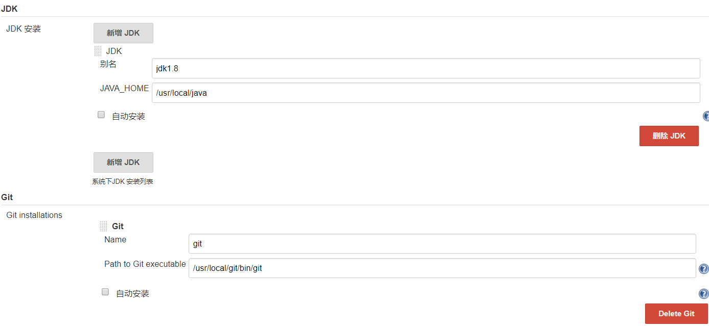

# jenkins自动化部署 #

* [1、jenkins安装配置](#1、jenkins安装配置)
* [2、应用部署服务器准备](#2、应用部署服务器准备)
* [3、应用部署服务器](#3、应用部署服务器)

### 1、jenkins安装配置 ###

- Linux下的Jenkins+Tomcat+Maven+Git+Shell环境的搭建使用（jenkins自动化部署）

> 1、下载jenkins

	官网：https://jenkins.io/download/
	选择 .war的下载。

> 2、配置tomcat-jenkins

	<Context crossContext="true"
            docBase="/usr/local/website/jenkins" path="" reloadable="true">
        </Context>

	配置Jenkins项目存放地址。

	mkdir /usr/local/website/jenkins
	cp jenkins.war /usr/local/website/jenkins/
	unzip /usr/local/website/jenkins/jenkins.war

	启动tomcat。
	Jenkins默认端口是8080,需要配置防火墙开放端口。
	
> 3、登录Jenkins

	http://192.168.1.31:8080
	
	提示输入管理员密码
	密码存放地址：
	cat /root/.jenkins/secrets/initialAdminPassword
	9e3971e177cc4ee5847a1351fa6dce0d

	登入后出现自定义Jenkins，选择安装推荐的插件即可，系统会自动安装插件；
	插件安装好后会提示创建第一个管理员用户--admin；
	实例配置，配置Jenkins的URL；
	配置完成。

	异常：
		该Jenkins实例似乎已离线。

	处理：
		 vim /root/.jenkins/hudson.model.UpdateCenter.xml
			将<url>https://updates.jenkins.io/update-center.json</url>修改为<url>http://updates.jenkins.io/update-center.json</url>
		即使用非ssl方式。

	重启tomcat，刷新页面。

> 4、安装插件

	安装 Rebuilder和Safe Restart。
	登录后进入系统管理-->插件管理--> 可选插件,在过滤中分别输入Rebuilder和Safe Restart，现在直接安装即可。

	添加 Git Parameter 插件

		目的：实现tag或分支的选择性构建。

		安装好后在新的任务中的参数化构建过程里选项添加参数，选择Git Parameter。

	添加参数插件【Build With Parameters】
		目的：实现Jenkins参数化构建。

> 5、添加用户/组

	添加用户:
		系统管理 --> 用户管理
	授权用户：
		系统管理 --> 全局安全配置 --> 授权策略 --> 安全矩阵 --> 添加用户/组

### 2、应用部署服务器准备 ###

> 安装 Maven 

	下载maven的tar包
	http://mirrors.hust.edu.cn/apache/maven/maven-3/3.5.4/binaries/apache-maven-3.5.4-bin.tar.gz

	解压tar包
	tar -xvf apache-maven-3.5.2-bin.tar.gz -C /usr/local

	配置环境变量
	vim /etc/profile

		export MAVEN_HOME=/usr/local/apache-maven-3.5.4
		export PATH=$MAVEN_HOME/bin:$PATH

	环境变量生效
	source /etc/profile

	测试
	mvn -version
		Apache Maven 3.5.4 (1edded0938998edf8bf061f1ceb3cfdeccf443fe; 2018-06-17T11:33:14-07:00)
		Maven home: /usr/local/apache-maven-3.5.4
		Java version: 1.8.0_92, vendor: Oracle Corporation, runtime: /usr/local/jdk1.8.0_92/jre
		Default locale: zh_CN, platform encoding: UTF-8
		OS name: "linux", version: "4.4.135-1.el6.elrepo.x86_64", arch: "amd64", family: "unix"

	安装成功。

> 安装 Git

	1. 下载 git 最新版本
		wget http://www.codemonkey.org.uk/projects/git-snapshots/git/git-latest.tar.xz

	2. 编译安装
		xz -d git-latest.tar.xz
		tar -xvf git-latest.tar
		autoconf
		./configure --prefix=/usr/local/git
		make && make install

	3. 配置环境变量
		export GIT_HOME=/usr/local/git
		export PATH=$PATH:$GIT_HOME/bin

		source /etc/profile

	4. 测试
		git --version

> 配置 Git

	git config --global user.name "alex"
	git config --global user.email "changfish918@163.com"

	//生成公私密钥保存在/root/.ssh
	ssh-keygen -t rsa -C "changfish918@163.com" 

	将生成的公钥配置到github上。

	测试linux和github连接：
	ssh git@github.com
	提示：Hi chang918! You've successfully authenticated 即成功。

> 配置Tomcat【省略】  

> 配置工具

	系统管理 --> 全局工具配置

### 3、应用部署服务器 ###

> 将linux注册到jenkins上
> 添加节点【节点即部署项目的服务器】

	系统管理 --> 节点管理 --> 新建节点
	输入节点名称，勾选固定节点

> 配置节点

	如上图，输入远程工作目录，启动方式，主机【linux服务器主机IP，由于是本机，所以输入了localhost】。
	点击Add,输入 linux服务器的账号密码，保存后在选择框中选择。
	如果SSH的端口不是默认端口，可以在 高级那里输入ssh的端口。
	保存后到节点管理启动该节点的代理，连接linux服务器。
	日志显示[SSH] 认证成功即连接成功。

> 新建任务验证Jenkins任务可以远程运行在Linux上。

	配置任务时，需要勾选限制项目的运行节点，输入允许的节点。
	添加构建，选择执行shell,输入linux命令，保存。
	回到任务页面，选择立即构建即可。
	到构建历史的控制台输出可以看到日志信息。

> 新建Git任务

	新建任务 --> 输入一个任务名称，选择任务类型
	在源码管理中勾选Git,在Respository URL中输入github的项目git地址，点击add添加认证。

	可以选择发布还是仅打包。
	

	
	Local subdirectory for repo中输入项目名称，即PROJ_NAME

	Kind中选择 SSH Username with private key
	key 里面存放私钥，与github的公钥对应。

	在构建选项选择执行shell,输入shell命令如下
	
	BUILD_ID=DONTKILLME

	source /etc/profile
	
	#配置运行参数
	export PROJ_PATH=`pwd`
	export TOMCAT_APP_PATH=/usr/local/website/wakelist
	export TOMCAT_HOME_PATH=/usr/local/tomcat-wakelist
	export PROJ_NAME=wakelist
	export TOMCAT_HOME_NAME=tomcat-wakelist
	export deploy=$deploy
	sh /home/hdc/deploy.sh

	【说明】
		“=” 不可以带空格。
		运行后PROJ_PATH=/root/.jenkins/workspace/tomcat-wakelist
       	/root/.jenkins 为节点设置的远程工作目录；
		tomcat-wakelist	为任务名称

		生成的war包地址
		/root/.jenkins/workspace/tomcat-wakelist/wakelist/target/wakelist.war

> 该脚本目的是安全重启tomcat,解压war包并将其保存到项目目录中
> vim deploy.sh

	#!/bin/bash

	# 在jenkins中需要设置的参数
	# export PROJ_PATH=`pwd`
	# export TOMCAT_APP_PATH=/usr/local/website/wakelist
	# export TOMCAT_HOME_PATH=/usr/local/tomcat-wakelist
	# export PROJ_NAME=wakelist
	# export TOMCAT_HOME_NAME=tomcat-wakelist
	
	killTomcat()
	{
	
	  pid=`ps -ef|grep $TOMCAT_HOME_NAME|grep -v grep|awk '{print $2}'`
	  if [ "$pid" = "" ]; then
	    echo "no tomcat pid alive"
	  else
	    cd $TOMCAT_HOME_PATH
	    sh bin/shutdown.sh
	
	  fi
	
	  sleep 5
	
	  rpid=`ps -ef|grep $TOMCAT_HOME_NAME|grep -v grep|awk '{print $2}'`
	  if [ "$rpid" = "" ]; then
	    echo "no tomcat pid alive"
	  else
	    echo "tomcat id list:$rpid"
	    for tempId in $rpid
	    do
	      kill -9 $tempId
	    done
	    echo "tomcat id list:$rpid"
	  fi
	}
	
	cd $PROJ_PATH/$PROJ_NAME

	#清除产生的项目并安装jar包
	mvn clean install

	# 是否选择发布
	if [ "$deploy" = "true" ];then

	  #停止tomcat
	  killTomcat
	
	  # 删除原有工程
	  rm -rf $TOMCAT_HOME_PATH/webapps/$PROJ_NAEM.war
	  rm -rf $TOMCAT_APP_PATH/*
	
	  #复制新的工程
	  cp $PROJ_PATH/$PROJ_NAME/target/$PROJ_NAME.war $TOMCAT_APP_PATH/
	
	  cd $TOMCAT_APP_PATH/
	  unzip $PROJ_NAME.war
	
	  #启动tomcat
	  cd $TOMCAT_HOME_PATH/
	  sh bin/startup.sh
	fi

> 保存，点击Build with Parameters，选择参数，开始构建

> 查看记录

	

