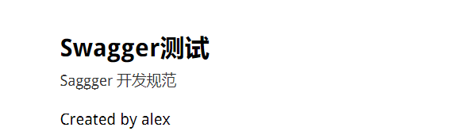
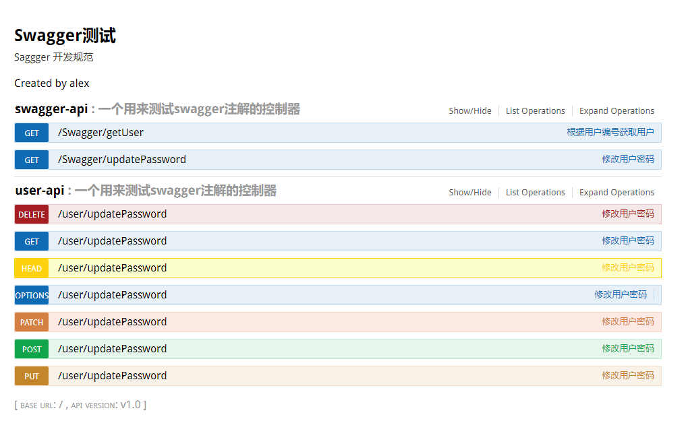
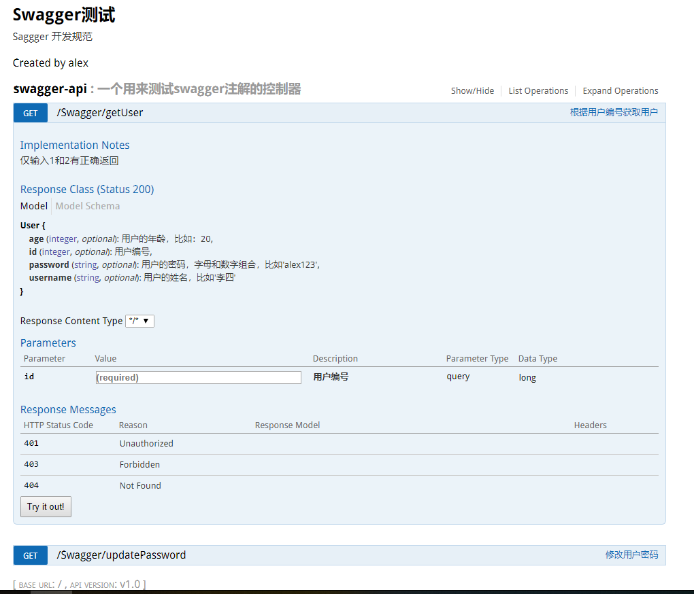
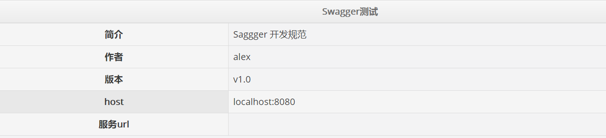
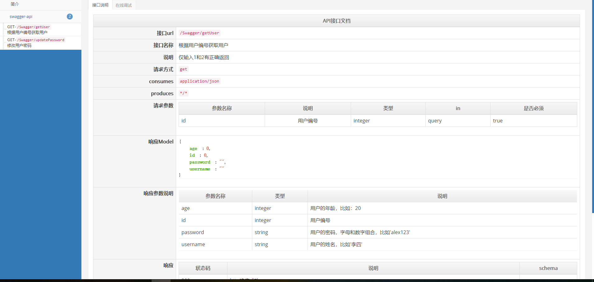

# Swagger #

* [1、swagger概述](#1、swagger概述)
* [2、SpringBoot+Swagger使用](#2、SpringBoot+Swagger使用)

### 1、swagger概述 ###

- Swagger 是一个规范和完整的框架，用于生成、描述、调用和可视化 RESTful 风格的 Web 服务。 
- 总体目标是使客户端和文件系统作为服务器以同样的速度来更新。 
- 文件的方法/参数/模型紧密集成到服务器端的代码，允许API来始终保持同步。
- Swagger 让部署管理和使用功能强大的API从未如此简单。
 
> 作用：

    1. 接口的文档在线自动生成。

    2. 功能测试。

> Swagger是一组开源项目，其中主要要项目如下：

	1. Swagger-tools:提供各种与Swagger进行集成和交互的工具。例如模式检验、Swagger 1.2文档转换成Swagger 2.0文档等功能。
	
	2. Swagger-core: 用于Java/Scala的的Swagger实现。与JAX-RS(Jersey、Resteasy、CXF...)、Servlets和Play框架进行集成。
	
	3. Swagger-js: 用于JavaScript的Swagger实现。
	
	4. Swagger-node-express: Swagger模块，用于node.js的Express web应用框架。
	
	5. Swagger-ui：一个无依赖的HTML、JS和CSS集合，可以为Swagger兼容API动态生成优雅HTML文档。
	
	6. Swagger-codegen：一个模板驱动引擎，通过分析用户Swagger资源声明以各种语言生成客户端代码。

### 2、SpringBoot+Swagger使用 ###

> 1、添加maven依赖,版本根据情况制定

    <!--配置swagger-->
    <properties>
        ...
        <swagger.version>2.7.0</swagger.version>
        ...
    </properties>

    <dependency>
        <groupId>io.springfox</groupId>
        <artifactId>springfox-swagger2</artifactId>
        <version>${swagger.version}</version>
    </dependency>
    <dependency>
        <groupId>io.springfox</groupId>
        <artifactId>springfox-swagger-ui</artifactId>
        <version>${swagger.version}</version>
    </dependency>

> 2、添加swagger配置类,使用注解

	import org.springframework.beans.factory.annotation.Value;
	import org.springframework.context.annotation.Bean;
	import org.springframework.context.annotation.Configuration;
	
	import springfox.documentation.builders.ApiInfoBuilder;
	import springfox.documentation.builders.PathSelectors;
	import springfox.documentation.builders.RequestHandlerSelectors;
	import springfox.documentation.service.ApiInfo;
	import springfox.documentation.spi.DocumentationType;
	import springfox.documentation.spring.web.plugins.Docket;
	import springfox.documentation.swagger2.annotations.EnableSwagger2;
	
	/**
	 * Swagger2配置类
	 * 通过@Configuration注解，让Spring来加载该类配置。
	 * 再通过@EnableSwagger2注解来启用Swagger2。
	 */
	@Configuration
	@EnableSwagger2
	public class Swagger2 {
	
	    @Value("${swagger.basePackage}")
	    private String basePackage;       
	
	    @Value("${swagger.title}")
	    private String title;           
	
	    @Value("${swagger.description}")
	    private String description;         
	
	    @Value("${swagger.auth}")
	    private String auth;         
	
	    @Value("${swagger.version}")
	    private String version;         
	   
	
	    /**
	     * 创建API应用
	     * apiInfo() 增加API相关信息
	     * 通过select()函数返回一个ApiSelectorBuilder实例,用来控制哪些接口暴露给Swagger来展现，
	     * 本例采用指定扫描的包路径来定义指定要建立API的目录。
	     * paths 指定扫描包下的路径
	     */
	    @Bean
	    public Docket createRestApi() {
	        return new Docket(DocumentationType.SWAGGER_2)
	                .apiInfo(apiInfo())
	                .select()
	                .apis(RequestHandlerSelectors.basePackage(basePackage))	// controller接口所在的包
	                .paths(PathSelectors.any())
	                .build();
	    }
	
	    /**
	     * 创建描述该API的基本信息（这些基本信息会展现在文档页面中）
	     * 访问地址：http://项目实际地址/swagger-ui.html
	     * 
	     */
	    private ApiInfo apiInfo() {
	        return new ApiInfoBuilder()
	                .title(title)					// 当前文档的标题
	                .description(description)		// 当前文档的详细描述
	                .contact(auth)					// 当前文档的作者
	                .version(version)				// 当前文档的版本
	                .build();
	    }
	}

> 添加swagger的配置信息 application.yml

	# 配置Swagger
	swagger:
	  basePackage: com.test.controller
	  title: Swagger测试
	  description: Saggger 开发规范
	  auth: alex
	  version: v1.0

> 整合 Springmvc，时需要在配置类上添加 @EnableWebMvc

	<bean id="sysProperties" class="org.springframework.beans.factory.config.PropertiesFactoryBean">
        <property name="location" value="classpath:e-shop.properties"/>
        <property name="fileEncoding" value="UTF-8"/>
    </bean>

	@Configuration
	@EnableSwagger2
	@EnableWebMvc
	public class Swagger2 {
	
	    @Autowired
	    private Properties sysProperties;
	
	
	    /**
	     * 创建API应用
	     * apiInfo() 增加API相关信息
	     * 通过select()函数返回一个ApiSelectorBuilder实例,用来控制哪些接口暴露给Swagger来展现，
	     * 本例采用指定扫描的包路径来定义指定要建立API的目录。
	     * paths 指定扫描包下的路径
	     */
	    @Bean
	    public Docket createRestApi() {
	        return new Docket(DocumentationType.SWAGGER_2)
	                .apiInfo(apiInfo())
	                .select()
	                .apis(RequestHandlerSelectors.basePackage(sysProperties.getProperty("swagger.basePackage")))
	                .paths(PathSelectors.any())
	                .build();
	    }
	
	    /**
	     * 创建描述该API的基本信息（这些基本信息会展现在文档页面中）
	     * 访问地址：http://项目实际地址/swagger-ui.html
	     *
	     */
	    private ApiInfo apiInfo() {
	        return new ApiInfoBuilder()
	                .title(sysProperties.getProperty("swagger.title"))
	                .description(sysProperties.getProperty("swagger.description"))
	                .contact(new Contact(sysProperties.getProperty("swagger.auth"),"",""))
	                .version(sysProperties.getProperty("swagger.version"))
	                .build();
	    }
	}

> 通过createRestApi函数创建Docket的Bean之后，apiInfo()用来创建该Api的基本信息（这些基本信息会展现在文档页面中）。

> 在API中添加文档内容

	在完成了上述配置后，其实已经可以生产文档内容，但是这样的文档主要针对请求本身，描述的主要来源是函数的命名，对用户并不友好，我们通常需要自己增加一些说明来丰富文档内容。

### Swagger使用的注解及其说明 ###

> @Api：标注一个Controller类做为swagger文档资源，以及描述该Controller
		
	@Api(value = "Swagger-API",description = "一个用来测试swagger注解的控制器")

		value: 			该文档简介；
		description：	对api资源的详细描述。
	
> @ApiOperation：标注在方法上，描述API接口资源
		
	@ApiOperation(value="根据用户编号获取用户", notes="仅输入1和2有正确返回")
	
		value: 		接口操作简介；
		notes：		接口描述；
		produces：	接口入参的格式，默认是所有，可以显示指定"application/json;charset=UTF-8"
	
> @ApiImplicitParam：用在方法上描述单个入参信息。
		
	@ApiImplicitParam(paramType = "query",name = "userId", value = "用户ID", required = true, dataType = "int")

|属性名称|说明|例子|
|:--|:--|:--|
|paramType|指定参数放在哪个地方|header：请求参数放置于Request Header，使用@RequestHeader获取;query：请求参数放置于请求地址，使用@RequestParam获取;path：（用于restful接口）-->请求参数的获取：@PathVariable;body：（不常用）;form（不常用）|
|name|参数名||
|dataType|参数类型|int、long、string等基本类型|
|required|参数是否必须传|true/false|
|value|说明参数的意思||
|defaultValue|参数的默认值||

> @ApiImplicitParams : 用在方法上包含一组参数说明。

	@ApiImplicitParams({
        @ApiImplicitParam(paramType = "query",name = "userId", value = "用户ID", required = true, dataType = "int"),
        @ApiImplicitParam(paramType = "query",name = "password", value = "旧密码", required = true, dataType = "String"),
        @ApiImplicitParam(paramType = "query",name = "newPassword", value = "新密码", required = true, dataType = "String")
	})

> @ApiResponses：用于表示一组响应  
	
> @ApiResponse：用在@ApiResponses中，一般用于表达一个错误的响应信息
	
	    code：		数字，例如400
		message：	信息，例如"请求参数没填好"
		response：	抛出异常的类   
	
> @ApiModel：对model中某字段属性的描述（一般用在请求参数无法使用@ApiImplicitParam注解进行描述的时候）
	
		@ApiModelProperty(value = "用户的姓名，比如'李四'")
    	private String username;
	
### 文档编写规范建议 ###

> model的描述

	@ApiModelProperty(value = “用户姓名”,required = true) 
	private String name; 
	
	对字段的描述
		value：实体类中字段的描述以及可选的取值。例如sex表示用户性别1:男，0:女 
		required：该字段是否必填，不清楚情况下，建议不要填写，或者required=false

> controller的描述

	@Api(value = "User-API", description = “用户接口详情”) 

	对controler类的描述
		value:如果controller类名为UserController，那么此处该名称叫User-API。 
		description：接口详细描述，建议不要超过25个字。

> @ApiOperation(value = “获取用户详细信息”, notes = “根据url的id来获取用户详细信息，返回User类型用户信息的实体”) 

	对该方法的描述
		value:接口操作简介，建议不超过15个字。 
		notes：
			1. 输出结果代表的意义;
			2. 实现的功能。若输出结果为基本类型（类似：int,string）需要指名是什么类型，如果有异常信息，需要指明异常信息的类型。

> @ApiImplicitParam(name = “id”, value = “用户ID”, required = true, dataType = “String”) 

	对参数的描述，如果多个参数需要用@ApiImplicitParams对其进行包裹

	name:		跟方法名中的参数保持一致。 
	value：		对参数的简单描述，说明该参数的意义。 
	required:	该参数是否必填写。 
	dataType:	入参的类型，可以为类名，也可以为基本类型（int,string..），加包名，如果都不是则不翻译 
	paramType：	如果在路径中提取参数用path，比如:在／A／{XXX}路径中得到XXX的值，候选址参数query, body,header。

> User.java

	public class User {

    @ApiModelProperty(value = "用户编号")
    private Long id;

    @ApiModelProperty(value = "用户的姓名，比如'李四'")
    private String username;

    @ApiModelProperty(value = "用户的年龄，比如：20")
    private int age;

    @ApiModelProperty(value = "用户的密码，字母和数字组合，比如'alex123'")
    private String password;

	...set/get

> 例子

	import com.test.model.User;
	import io.swagger.annotations.*;
	import org.springframework.util.StringUtils;
	import org.springframework.web.bind.annotation.*;
	
	import java.util.ArrayList;
	import java.util.List;
	
	/**
	 * 一个用来测试swagger注解的控制器
	 * 
	 */
	@RestController
	@RequestMapping("/Swagger")
	@Api(value = "Swagger-API",description = "一个用来测试swagger注解的控制器")
	public class SwaggerController {
	
	    private List<User> getUsers(){
	        User user = new User(1L,"alex",23,"alex123");
	        User user2 = new User(2L,"alex",23,"alex123");
	        List<User> users = new ArrayList<>();
	        users.add(user);
	        users.add(user2);
	        return users;
	    }

	    @GetMapping("/getUser")
	    @ApiOperation(value="根据用户编号获取用户", notes="仅输入1和2有正确返回")
	    @ApiImplicitParam(paramType = "query",name = "id", value = "用户编号",required = true, dataType = "long")
	    public User getUserName(@RequestParam Long id){
	        for (User user:getUsers()
	             ) {
	            if (user.getId().equals(id)){
	                return user;
	            }
	        }
	        return null;
	    }
	
	
	    @GetMapping("/updatePassword")
	    @ApiOperation(value="修改用户密码", notes="根据用户id修改密码")
	    @ApiImplicitParams({
	            @ApiImplicitParam(paramType = "query",name = "userId", value = "用户ID", required = true, dataType = "int"),
	            @ApiImplicitParam(paramType = "query",name = "password", value = "旧密码", required = true, dataType = "String"),
	            @ApiImplicitParam(paramType = "query",name = "newPassword", value = "新密码", required = true, dataType = "String")
	    })
	    public String updatePassword(@RequestParam(value="userId") Integer userId, @RequestParam(value="password") String password,
	                                 @RequestParam(value="newPassword") String newPassword){
	        if(userId <= 0 || userId > 2){
	            return "未知的用户";
	        }
	        if(StringUtils.isEmpty(password) || StringUtils.isEmpty(newPassword)){
	            return "密码不能为空";
	        }
	        if(password.equals(newPassword)){
	            return "新旧密码不能相同";
	        }
	        return "密码修改成功!";
	    }
	}

> **【注意】**方法上的url注解需要标注请求方式，否则默认列出所有的请求方式

	import io.swagger.annotations.*;
	import org.springframework.util.StringUtils;
	import org.springframework.web.bind.annotation.*;

	@RestController
	@RequestMapping("/user")
	@Api(value = "User-API",description = "一个用来测试swagger注解的控制器")
	public class UserController {
	
	    @RequestMapping("/updatePassword")
	    @ApiOperation(value="修改用户密码", notes="根据用户id修改密码")
	    @ApiImplicitParams({
	            @ApiImplicitParam(paramType = "query",name = "userId", value = "用户ID", required = true, dataType = "int"),
	            @ApiImplicitParam(paramType = "query",name = "password", value = "旧密码", required = true, dataType = "String"),
	            @ApiImplicitParam(paramType = "query",name = "newPassword", value = "新密码", required = true, dataType = "String")
	    })
	    public String updatePassword(@RequestParam(value="userId") Integer userId, @RequestParam(value="password") String password,
	                                 @RequestParam(value="newPassword") String newPassword){
	        if(userId <= 0 || userId > 2){
	            return "未知的用户";
	        }
	        if(StringUtils.isEmpty(password) || StringUtils.isEmpty(newPassword)){
	            return "密码不能为空";
	        }
	        if(password.equals(newPassword)){
	            return "新旧密码不能相同";
	        }
	        return "密码修改成功!";
	    }
	}

> 完成上述代码添加上，启动Spring Boot程序，访问：http://localhost:8080/swagger-ui.html
> 浏览该地址，访问sagger专有JsonAPI： http://localhost:8080/v2/api-docs

	{"swagger":"2.0","info":{"description":"Saggger 开发规范","version":"v1.0","title":"Swagger测试","contact":{"name":"alex"},"license":{}},"host":"localhost:8080","basePath":"/","tags":[{"name":"swaggercontroller|一个用来测试swagger注解的控制器","description":"SwaggerController|一个用来测试swagger注解的控制器"}],"paths":{"/Swagger/getUser":{"get":{"tags":["swaggercontroller|一个用来测试swagger注解的控制器"],"summary":"根据用户编号获取用户","description":"仅输入1和2有正确返回","operationId":"getUserNameUsingGET","consumes":["application/json"],"produces":["*/*"],"parameters":[{"name":"id","in":"query","description":"用户编号","required":true,"type":"integer","format":"int64"}],"responses":{"200":{"description":"OK","schema":{"$ref":"#/definitions/User"}},"401":{"description":"Unauthorized"},"403":{"description":"Forbidden"},"404":{"description":"Not Found"}}}},"/Swagger/updatePassword":{"get":{"tags":["swaggercontroller|一个用来测试swagger注解的控制器"],"summary":"修改用户密码","description":"根据用户id修改密码","operationId":"updatePasswordUsingGET","consumes":["application/json"],"produces":["*/*"],"parameters":[{"name":"userId","in":"query","description":"用户ID","required":true,"type":"integer","format":"int32"},{"name":"password","in":"query","description":"旧密码","required":true,"type":"string"},{"name":"newPassword","in":"query","description":"新密码","required":true,"type":"string"}],"responses":{"200":{"description":"OK","schema":{"type":"string"}},"401":{"description":"Unauthorized"},"403":{"description":"Forbidden"},"404":{"description":"Not Found"}}}}},"definitions":{"User":{"properties":{"age":{"type":"integer","format":"int32","description":"用户的年龄，比如：20"},"id":{"type":"integer","format":"int64","description":"用户编号"},"password":{"type":"string","description":"用户的密码，字母和数字组合，比如'alex123'"},"username":{"type":"string","description":"用户的姓名，比如'李四'"}}}}}

> 输入参数后可以测试该接口，点击 Try it out 可以看到输出结果。

### 替换默认的显示页面 ###
> 使用 beautiful UI替换默认的UI页面，更显得美观

    <dependency>
       <groupId>com.github.xiaoymin</groupId>
       <artifactId>swagger-bootstrap-ui</artifactId>
       <version>1.6</version>
    </dependency>

> 访问： http://localhost:8080/doc.html

> 页面更整洁