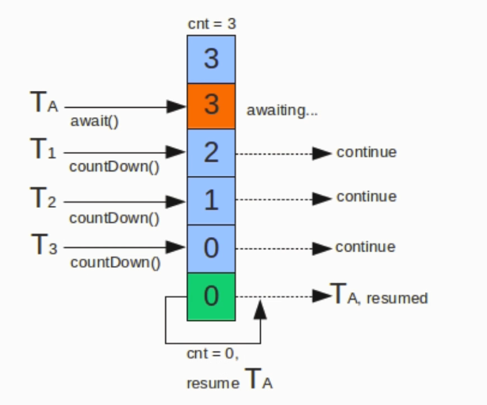
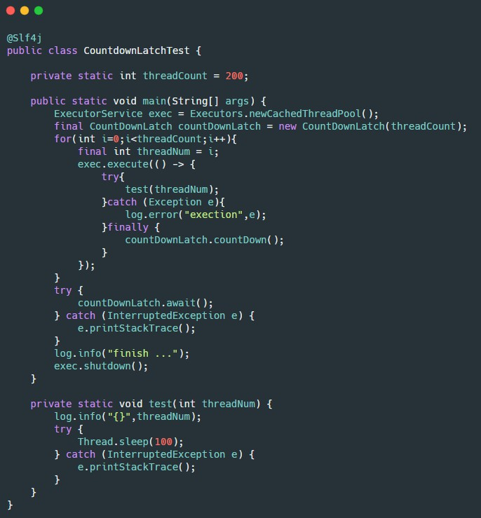
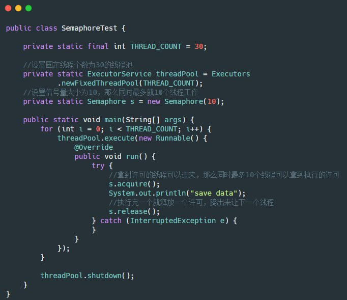
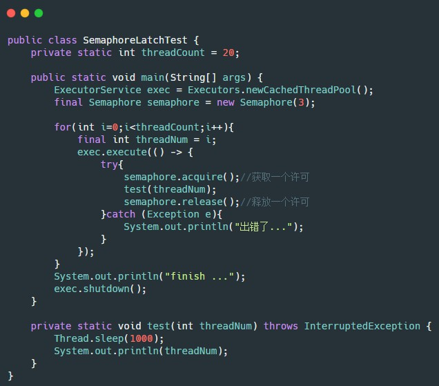
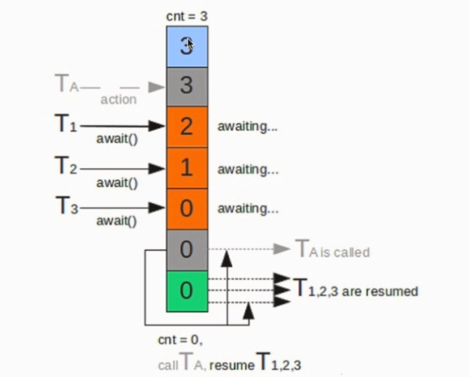
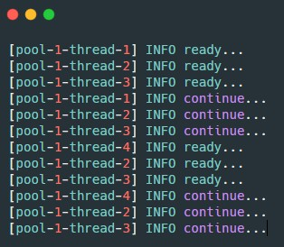
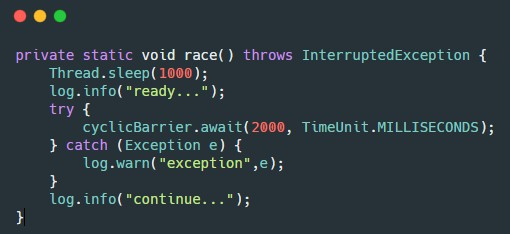
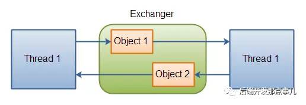
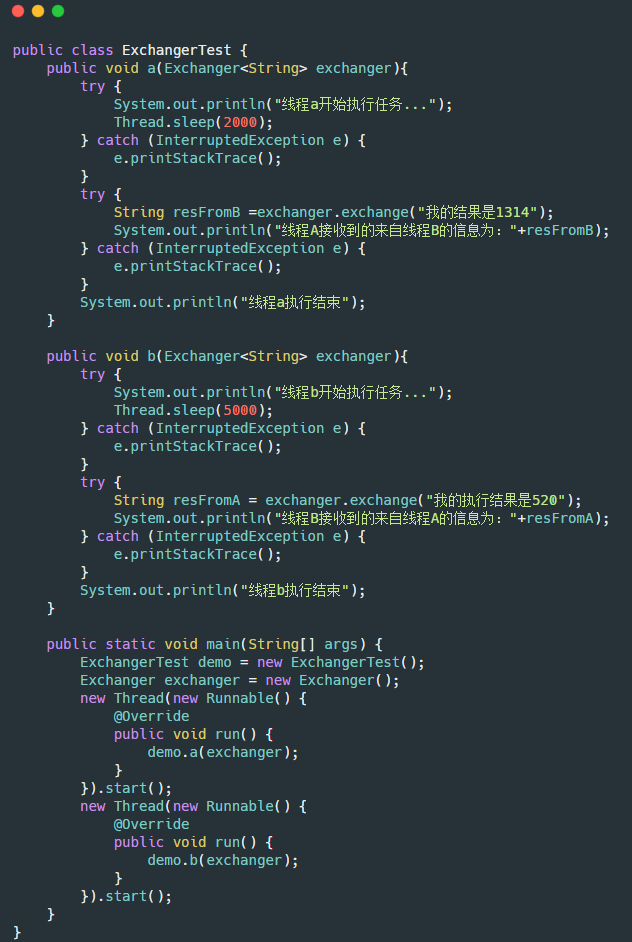
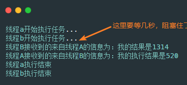

## title: AQS实现的一些并发工具类 tag: java多线程

在前面我们已经深入了解了AQS原理，本节介绍几个常用的基于AQS实现的并发工具类。

## 一、CountDownLatch

计数器减到0，处于等待的线程才会继续执行。只能用一次，不能重置。

比如有一个运算量很大的任务，我们可以将它拆分为多个子任务，等所有子任务全部完成之后，再执行最后的汇总工作。

[](https://camo.githubusercontent.com/989c5c2864a6774b1f99eb54c955ecaf3a2bb84a/687474703a2f2f626c6f6768656c6c6f2e6f7572736e61696c2e636e2f436f756e74446f776e4c617463682e706e67)

下面用一个实例来看看它是如何使用的：

[](https://camo.githubusercontent.com/c21c33cf63d3e6d75b2e5644e792d18634bf5c68/687474703a2f2f626c6f6768656c6c6f2e6f7572736e61696c2e636e2f74687265616431322d312e6a7067)

运行结果，截取了最后一点：

[](https://camo.githubusercontent.com/818d915056ce27007fd33e2b9680a658a611f041/687474703a2f2f626c6f6768656c6c6f2e6f7572736e61696c2e636e2f74687265616431322d322e6a7067)

我们可以看到，主程序等待所有的子程序执行完毕，再执行，它是通过`await()`阻塞等待，直到计数器的值减到0为止。

那如果是这种场景呢：计算若干个子任务，给定一个时间，超过这个时间的话，就把这个任务放弃掉。

```
countDownLatch.await(10, TimeUnit.MILLISECONDS);
```

## 二、Semaphore

能控制同一时间并发线程的数目

> Semaphore（信号量）是用来控制同时访问特定资源的线程数量，它通过协调各个线程，以保证合理的使用公共资源。很多年以来，我都觉得从字面上很难理解Semaphore所表达的含义，只能把它比作是控制流量的红绿灯，比如XX马路要限制流量，只允许同时有一百辆车在这条路上行使，其他的都必须在路口等待，所以前一百辆车会看到绿灯，可以开进这条马路，后面的车会看到红灯，不能驶入XX马路，但是如果前一百辆中有五辆车已经离开了XX马路，那么后面就允许有5辆车驶入马路，这个例子里说的车就是线程，驶入马路就表示线程在执行，离开马路就表示线程执行完成，看见红灯就表示线程被阻塞，不能执行。

[](https://camo.githubusercontent.com/ba1cb4cf66174fca91ba633054c8bb05d07bfe4e/687474703a2f2f626c6f6768656c6c6f2e6f7572736e61696c2e636e2f31382d352d31342f31363639303832372e6a7067)

`Semaphore`可以用于做流量控制，特别公用资源有限的应用场景，比如数据库连接。假如有一个需求，要读取几万个文件的数据，因为都是IO密集型任务，我们可以启动几十个线程并发的读取，但是如果读到内存后，还需要存储到数据库中，而数据库的连接数只有10个，这时我们必须控制只有十个线程同时获取数据库连接保存数据，否则会报错无法获取数据库连接。这个时候，我们就可以使用`Semaphore`来做流控，代码如下：

[](https://camo.githubusercontent.com/8d14789394a5308e5a826a40a7bc9d46a00a7b99/687474703a2f2f626c6f6768656c6c6f2e6f7572736e61696c2e636e2f74687265616431322d332e6a7067)

再来一个例子：

[](https://camo.githubusercontent.com/5bd174d63ec88625f8380243d815f790b615c741/687474703a2f2f626c6f6768656c6c6f2e6f7572736e61696c2e636e2f74687265616431322d342e6a7067)

> 这里是一个线程获取一个许可，那么同一时间，可以有三个线程进来一起工作。那如果我改成一个线程获取三个许可呢？就像一个人同时占三个坑位，那么只有等这个人拉完了才能轮到下一个人了，那么此时就变成跟单线程一样了。

```
semaphore.acquire(3);
test(threadNum);
semaphore.release(3);
```

考虑这个场景：并发太高了，就算是控制线程数量，也比较棘手；一个厕所三个坑位，外面人太多了，让三个人进来，其他的都给轰走。如何做到呢？

```
if(semaphore.tryAcquire()){//尝试获取一个许可
    test(threadNum);
    semaphore.release();
}
```

输出结果：只有三条信息打印出来，其他的线程就都被丢弃了。

也可以给他一个超时时间，这里是5000毫秒。每个命令需要运行1000毫秒，那么程序等1000毫秒之后会打印三条；然后再等1000毫秒，又可以拿到新的三个许可，再打印三条；直到5000毫秒用完。可能会打印3*5条记录。剩下的5条记录由于已经超时，全部被放弃掉。

## 三、CyclicBarrier

> `CyclicBarrier`也是一个同步辅助类 , 它允许一组线程相互等待 , 直到到达某个公共的屏障点 , 通过它可以完成多个线程之间相互等待 ,只有当每个线程都准备好之后, 才能各自继续往下执行后续的操作, 和 `CountDownLatch`相似的地方就是, 它也是通过计数器来实现的. 当某个线程调用了 `await()`方法之后, 该线程就进入了等待状态 . 而且计数器就进行 -1 操作 , 当计数器的值达到了我们设置的初始值0的时候 , 之前调用了`await()` 方法而进入等待状态的线程会被唤醒继续执行后续的操作. 因为 `CyclicBarrier`释放线程之后可以重用, 所以又称之为循环屏障 . `CyclicBarrier` 使用场景和 `CountDownLatch` 很相似 , 可以用于多线程计算数据, 最后合并计算结果的应用场景 .

[](https://camo.githubusercontent.com/3f81cec5b61a39993eeac71655bf8de895107866/687474703a2f2f626c6f6768656c6c6f2e6f7572736e61696c2e636e2f31382d352d31342f36353738343632382e6a7067)

两者的区别：

- `CountDownLatch`的计数器只能使用一次 , 而 `CyclicBarrier` 的计数器可以使用 `reset`重置 循环使用
- `CountDownLatch` 主要是 1 个 或者 n 个线程需要等待其它线程完成某项操作之后才能继续往下执行 , 其描述的是 1 个 或者 n 个线程与其它线程的关系 ; CyclicBarrier 主要是实现了 1 个或者多个线程之间相互等待,直到所有的线程都满足条件之后, 才执行后续的操作 , 其描述的是内部各个线程相互等待的关系 .

`CyclicBarrier` 假如有 5 个线程都调用了 `await()` 方法 , 那这个 5 个线程就等着 , 当这 5 个线程都准备好之后, 它们有各自往下继续执行 , 如果这 5 个线程在后续有一个计算发生错误了 , 这里可以重置计数器 , 并让这 5 个线程再执行一遍 .

[](https://camo.githubusercontent.com/92eef75854b6fd5773ba78b71223b94cfec092ee/687474703a2f2f626c6f6768656c6c6f2e6f7572736e61696c2e636e2f74687265616431322d352e6a7067)

运行效果：先每隔一秒执行`race`方法打印出`ready`,等3个线程打印完毕，立即都将阻塞的`log.info("continue...");`全部打印出来。

[](https://camo.githubusercontent.com/b914e0ba1de948a36a4ca8d832ccd45bfaeb375d/687474703a2f2f626c6f6768656c6c6f2e6f7572736e61696c2e636e2f74687265616431322d362e6a7067)

也可以设定超时时间，超过时间了就不等了。

[](https://camo.githubusercontent.com/dafa7cfecc54af2f4ae425223f5437a8e2441040/687474703a2f2f626c6f6768656c6c6f2e6f7572736e61696c2e636e2f74687265616431322d372e6a7067)

如果在大家已经都准备好了的时候，可以先做一件事情，即初始化执行一个线程，可以在声明`CyclicBarrier`后面增加一个线程来执行。

就像开会，人都到齐了之后，我们喊一声，人都到齐，我们现在开始开会了啊。下面就开始正式开会。

```
private static CyclicBarrier cyclicBarrier = new CyclicBarrier(5,() -> {
    log.info("callback is running...");
});
```

## 四、Exchanger

`Exchanger` 类表示一种会合点，两个线程可以在这里交换对象。两个线程各自调用` exchange` 方法进行交换，当线程 `A`调用 `Exchange` 对象的 `exchange` 方法后，它会陷入阻塞状态，直到线程 `B` 也调用了 `exchange` 方法，然后以线程安全的方式交换数据，之后线程 `A` 和 `B` 继续运行。

[](https://camo.githubusercontent.com/855a2ac74117cea9f76a0fea97f2f1dbffa74042/687474703a2f2f626c6f6768656c6c6f2e6f7572736e61696c2e636e2f74687265616431322d382e706e67)

`exchange` 方法有两个重载实现，在交换数据的时候还可以设置超时时间。如果一个线程在超时时间内没有其他线程与之交换数据，就会抛出 `TimeoutException` 超时异常。如果没有设置超时时间，则会一直等待。

```
//交换数据，并设置超时时间
public V exchange(V x, long timeout, TimeUnit unit)
throws InterruptedException, TimeoutException
//交换数据
public V exchange(V x) throws InterruptedException
```

下面看一个小例子：

[](https://camo.githubusercontent.com/e6664ed9ff9bd4f5e8dd9096b023947cac174ae1/687474703a2f2f626c6f6768656c6c6f2e6f7572736e61696c2e636e2f74687265616431322d392e706e67)

我们要注意，交换的时候两个线程要同时到达一个汇合点才会继续执行，即这里的a线程拿到b线程的值并且b拿到a的值，程序才会继续执行。

[](https://camo.githubusercontent.com/19d0e402c8a87ae0b57124083e67ec755ebb6c02/687474703a2f2f626c6f6768656c6c6f2e6f7572736e61696c2e636e2f74687265616431322d31302e706e67)

例子很简单，当两个线程都到达调用`exchange`方法的同步点的时候，两个线程就能交换彼此的数据。