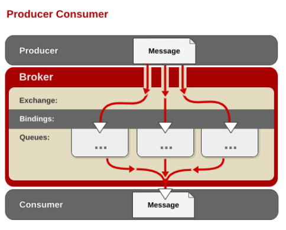

# RabbitMQ

* [1、RabbitMQ 特点](#1、RabbitMQ特点)
* [2、RabbitMQ 基本概念](#2、RabbitMQ基本概念)
* [3、RabbitMQ 安装](#3、RabbitMQ安装)
* [4、RabbitMQ 集群](#4、RabbitMQ集群)
* [5、Spring+RabbitMQ](#5、Spring+RabbitMQ)
* [6、ActiveMQ RabbitMQ KafKa对比](6、ActiveMQRabbitMQKafKa对比)

[RabbitMQ官网](http://www.rabbitmq.com/)

### 1、RabbitMQ 特点 ###

- RabbitMQ 是一个由 Erlang 语言开发的 AMQP 的开源实现。

- AMQP ：Advanced Message Queue Prototal，高级消息队列协议。它是应用层协议的一个开放标准，为面向消息的中间件设计，基于此协议的客户端与消息中间件可传递消息，并不受产品、开发语言等条件的限制。
- RabbitMQ 最初起源于金融系统，用于在分布式系统中存储转发消息，在易用性、扩展性、高可用性等方面表现不俗。
- 具体特点包括：
> 1.可靠性（Reliability）

	RabbitMQ 使用一些机制来保证可靠性，如持久化、传输确认、发布确认。

> 2.灵活的路由（Flexible Routing）

	在消息进入队列之前，通过 Exchange 来路由消息的。
	对于典型的路由功能，RabbitMQ 已经提供了一些内置的 Exchange 来实现。
	针对更复杂的路由功能，可以将多个 Exchange 绑定在一起，也通过插件机制实现自己的 Exchange 。

> 3.消息集群（Clustering）

	多个 RabbitMQ 服务器可以组成一个集群，形成一个逻辑 Broker 。

> 4.高可用（Highly Available Queues）

	队列可以在集群中的机器上进行镜像，使得在部分节点出问题的情况下队列仍然可用。

> 5.多种协议（Multi-protocol）
	
	RabbitMQ 支持多种消息队列协议，比如 STOMP、MQTT 等等。

> 6.多语言客户端（Many Clients）

	RabbitMQ 几乎支持所有常用语言，比如 Java、.NET、Ruby 等等。

> 7.管理界面（Management UI）
	
	RabbitMQ 提供了一个易用的用户界面，使得用户可以监控和管理消息 Broker 的许多方面。

> 8.跟踪机制（Tracing）

	如果消息异常，RabbitMQ 提供了消息跟踪机制，使用者可以找出发生了什么。

> 9.插件机制（Plugin System）

	RabbitMQ 提供了许多插件，来从多方面进行扩展，也可以编写自己的插件。

### 2、RabbitMQ 基本概念 ###

> rabbitmq 内部结构

> rabbitMQ关键字  
> Message

	消息，它由消息头和消息体组成。
	消息体是不透明的，而消息头则由一系列的可选属性组成。
	这些属性包括routing-key（路由键）、priority（相对于其他消息的优先权）、delivery-mode（发送消息的模式）等。
	
	消息体类型：

		String（含json字符串类型）
			通过String类的构造函数接收byte[]类型的消息数据，获得jsonStr后可以转换成其它类，然后再进行相关操作。

			String body = new String(message.getBody(), "UTF-8");
            logger.info("接收到的消息：{}" , body);

> Publisher
 
    消息的生产者，也是一个向交换器发布消息的客户端应用程序。

> Exchange

	交换器，用来接收生产者发送的消息并将这些消息路由给服务器中的队列。
	类型【下面有介绍】：
		1. fanout	广播模式
		2. topic	和路由键模式匹配，组播方式
		3. direct	和路由键完全匹配、单播的模式
		4. headers  很少用

> Binding

	绑定，用于 消息队列 和 交换器 之间的关联。
	一个绑定就是基于路由键【routeKey】将交换器【Exchange】和消息队列【Queue】连接起来的路由规则，所以可以将交换器理解成一个由绑定构成的路由表。

> Queue

	消息队列，用来保存消息直到发送给消费者。
	它是消息的容器，也是消息的终点。一个消息可放入一个或多个队列。
	消息一直在队列里面，等待消费者连接到这个队列将其取走。

> Connection

	网络连接，比如一个TCP连接。

> Channel

	信道，多路复用连接中的一条独立的双向数据流通道。
	信道是建立在真实的TCP连接内的虚拟连接，AMQP 命令都是通过信道发出去的，不管是发布消息、订阅队列还是接收消息，这些动作都是通过信道完成。
	因为对于操作系统来说建立和销毁 TCP 都是非常昂贵的开销，所以引入了信道的概念，以复用一条 TCP 连接。

> Consumer

	消息的消费者，表示一个从消息队列中取得消息的客户端应用程序。

> Virtual Host

	虚拟主机，表示一批交换器、消息队列和相关对象。
	虚拟主机是共享相同的身份认证和加密环境的独立服务器域。
	每个 vhost 本质上就是一个 mini 版的 RabbitMQ 服务器，拥有自己的队列、交换器、绑定和权限机制。
	vhost 是 AMQP 概念的基础，必须在连接时指定，RabbitMQ 默认的 vhost 是 / 。

> Broker

	表示消息队列服务器实体。

#### AMQP 中的消息路由 ####

- AMQP 中消息的路由过程和 Java 开发者熟悉的 JMS 存在一些差别，AMQP 中增加了 Exchange 和 Binding 的角色。
- 生产者把消息发布到 Exchange 上，消息最终到达队列并被消费者接收，而 Binding 决定交换器的消息应该发送到那个队列。

> AMQP 的消息路由过程

#### Exchange 类型 ####

- Exchange分发消息时根据类型的不同分发策略有区别，目前共四种类型：**direct、fanout、topic、headers** 。
- headers 匹配 AMQP 消息的 header 而不是路由键，此外 headers 交换器和 direct 交换器完全一致，但性能差很多，目前几乎用不到了，所以直接看另外三种类型：

> 1、direct 交换器

	
	它是完全匹配、单播的模式。
	消息中的路由键（routing key）如果和 Binding 中的 binding key 一致， 交换器就将消息发到对应的队列中。
	路由键与队列名完全匹配，如果一个队列绑定到交换机要求路由键为"dog"，则只转发 routing key 标记为"dog"的消息，不会转发"dog.puppy"，也不会转发"dog.guard"等等。

> 2、fanout 交换器

	fanout 类型转发消息是最快的，它是广播的模式。
	每个发到 fanout 类型交换器的消息都会分到所有绑定的队列上去。
	fanout 交换器不处理路由键，只是简单的将队列绑定到交换器上，每个发送到交换器的消息都会被转发到与该交换器绑定的所有队列上。

> 3、topic 交换器

	topic 交换器通过模式匹配分配消息的路由键属性，将路由键和某个模式进行匹配，此时队列需要绑定到一个模式上。
	它将路由键和绑定键的字符串切分成单词，这些单词之间用点隔开。
	它同样也会识别两个通配符："#" 和 "*"。
		"#" 匹配0个或多个单词，比如：order.# 可以匹配 order.test,order.test.user;
		"*" 匹配一个单词，比如：order.* 只可以匹配 order.test。
	可以理解为组播方式。

> 消息发送确认 与 消息接收确认（ACK）

	默认情况下如果一个 Message 被消费者所正确接收则会被从 Queue 中移除。

	如果一个 Queue 没被任何消费者订阅，那么这个 Queue 中的消息会被 Cache（缓存），当有消费者订阅时则会立即发送，当 Message 被消费者正确接收时，就会被从 Queue 中移除。

	消息发送确认
		
		1. ConfirmCallback 	确认消息
		通过实现 ConfirmCallback 接口的 confirm 方法，消息发送到 Broker 后触发回调，确认消息是否到达 Broker 服务器，也就是只确认是否正确到达 Exchange 中，并不确定到 Queue。
		需要配置 publisher-confirms="true"

			<rabbit:connection-factory ... publisher-confirms="true" />

			rabbitTemplate.setConfirmCallback(new RabbitTemplate.ConfirmCallback() {
	            @Override
	            public void confirm(CorrelationData correlationData, boolean ack, String cause) {
	                if (ack) {
	                    logger.info("消息确认成功到达交换机");
	                } else {
	                    //处理丢失的消息（nack）
	                    logger.info("消息确认没有到达交换机");
	                }
	            }
	        });

		2. ReturnCallback	返回消息
		通过实现 ReturnCallback 接口的 returnedMessage 方法，启动消息失败返回，比如路由不到队列时触发回调。
		需要配置 mandatory="true" 和  publisher-returns="true"

			<rabbit:template id="rabbitTemplate" connection-factory="connectionFactory"
                     exchange="order.direct.exchange" message-converter="fastJsonMessageConverter" mandatory="true">
		    </rabbit:template>
			
			<rabbit:connection-factory ... publisher-returns="true" />

			rabbitTemplate.setReturnCallback(new RabbitTemplate.ReturnCallback() {
	            @Override
	            public void returnedMessage(Message message, int replyCode, String replyText,
	                                        String exchange, String routingKey) {
	                
	                logger.info("返回错误码：{}", String.valueOf(replyCode));
	                logger.info("返回错误信息：{}", replyText);
	
	            }
	        });

	

	消息接收确认

		消息通过 ACK 确认是否被正确接收，每个 Message 都要被确认（acknowledged），可以手动去 ACK 或自动 ACK。

	消息确认模式有：
		AcknowledgeMode.NONE：	自动确认【默认】
		AcknowledgeMode.AUTO：	根据情况确认
		AcknowledgeMode.MANUAL：手动确认

		默认情况下消息消费者是自动 ack （确认）消息的，如果要手动 ack（确认）则需要修改确认模式为 manual。

> AMQP 事务机制

	事务方法：
		txSelect  	将当前channel设置为transaction模式
		txCommit  	提交当前事务
		txRollback  事务回滚

	channel.txSelect(); 	// 开启事务
	channel.txCommit(); 	// 提交事务
	channel.txRollback(); 	// 回滚事务
	

### 3、RabbitMQ 安装 ###

- 一般来说安装 RabbitMQ 之前要安装 Erlang ，可以去Erlang官网下载。
- 接着去RabbitMQ官网下载安装包，之后解压缩即可。

> 1、安装编译工具

	yum -y install make gcc gcc-c++ kernel-devel m4 ncurses-devel openssl-devel

> 2、安装Erlang  

	官方下载地址：http://erlang.org/download/otp_src_19.3.tar.gz
	
	tar xvfz otp_src_19.3.tar.gz
	cd otp_src_19.3
	./configure --prefix=/usr/local/erlang  --without-javac 
	make && make install

	#配置erlang环境变量
	vim /etc/profile
	
	export ERLANG_HOME=/usr/local/erlang
	export PATH=$ERLANG_HOME/bin:$PATH
	
	#使环境变量生效
	source /etc/profile
	
	#输入命令检验是否安装成功
	erl

	#显示如下则安装成功
	Erlang/OTP 19 [erts-8.3] [source] [64-bit] [async-threads:10] [hipe] [kernel-poll:false]

	Eshell V8.3  (abort with ^G)
	1> 

> 3、安装RabbitMQ【如果是generic包，直接解压到指定目录下就可以】

	官方下载地址http://www.rabbitmq.com/releases/rabbitmq-server/v3.6.1/rabbitmq-server-generic-unix-3.6.15.tar.xz

	tar xvf rabbitmq-server-generic-unix-3.6.15.tar.xz -C /usr/local/
	mv /usr/local/rabbitmq_server-3.6.15 /usr/local/rabbitmq

	#配置erlang环境变量
	vim /etc/profile
	
	export RABBITMQ_HOME=/usr/local/rabbitmq
	export PATH=$RABBITMQ_HOME/sbin:$PATH
	
	#使环境变量生效
	source /etc/profile

#### 修改配置 ####

- 设置文件夹结构
- 1、RabbitMQ的日志文件夹
- 2、Mnesia数据库文件夹，RabbitMQ使用Mnesia数据库存储服务器信息，比如队列元数据、虚拟主机。

> 创建mq的日志存放目录，数据存放位置 

	mkdir /usr/local/rabbitmq/log
	mkdir /usr/local/rabbitmq/mnesia

> 修改日志文件和数据库文件存放路经

	vim /usr/local/rabbitmq/sbin/rabbitmq-defaults

	LOG_BASE=/usr/local/rabbitmq/log
	MNESIA_BASE=/usr/local/rabbitmq/mnesia

	【注】在LOG_BASE目录下会自动生成2个日志文件：一个带sasl，一个不带，带sasl的记录erlang的相关信息。

> 修改端口号

	vim /usr/local/rabbitmq/sbin/rabbitmq-env  
	
	DEFAULT_NODE_IP_ADDRESS=auto
	DEFAULT_NODE_PORT=5672

	WEB管理端口：15672
	集群间通信端口: 5672

> 添加防火墙

	vim /etc/sysconfig/iptables
	
		-A INPUT -m state --state NEW -m tcp -p tcp --dport 15672 -j ACCEPT
		-A INPUT -m state --state NEW -m tcp -p tcp --dport 5672 -j ACCEPT

> 启动rabbitmq
	
	#启动命令，该命令ctrl+c后会关闭服务
	rabbitmq-server
	
	#后台启动Rabbit
	rabbitmq-server &

> 关闭 RabbitMQ 节点

	我们知道 RabbitMQ 是用 Erlang 语言写的，在Erlang 中有两个概念：节点和应用程序。
	节点就是 Erlang 虚拟机的每个实例，而多个 Erlang 应用程序可以运行在同一个节点之上。
	节点之间可以进行本地通信（不管他们是不是运行在同一台服务器之上）。比如一个运行在节点A上的应用程序可以调用节点B上应用程序的方法，就好像调用本地函数一样。
	如果应用程序由于某些原因奔溃，Erlang 节点会自动尝试重启应用程序。

	如果要关闭整个 RabbitMQ 节点可以用参数 stop ：
	rabbitmqctl stop

	它会和本地节点通信并指示其干净的关闭，也可以指定关闭不同的节点，包括远程节点，只需要传入参数 -n ：
	rabbitmqctl -n rabbit@server stop 

	-n node 默认 node 名称是 rabbit@server ，如果你的主机名是 server.example.com ，那么 node 名称就是 rabbit@server。

> 关闭 RabbitMQ 应用程序

	#如果只想关闭应用程序，同时保持 Erlang 节点运行则可以用 stop_app。
	rabbitmqctl stop_app

> 启动 RabbitMQ 应用程序

	rabbitmqctl start_app

> 重置 RabbitMQ 节点

	rabbitmqctl reset	#该命令将清除所有的队列。

> 查看已声明的队列

	rabbitmqctl list_queues

> 查看交换器

	rabbitmqctl list_exchanges

> 该命令还可以附加参数，比如列出交换器的名称、类型、是否持久化、是否自动删除：

	rabbitmqctl list_exchanges name type durable auto_delete

> 查看绑定

	rabbitmqctl list_bindings

> 查看服务器状态：

	rabbitmqctl status

	该命令将输出服务器的很多信息，比如 RabbitMQ 和 Erlang 的版本、OS 名称、内存等等。

> 创建用户并授权

	cd /usr/local/rabbitmq/sbin/

	#添加用户 rabbitmqctl add_user Username Password
	rabbitmqctl add_user admin admin

	#授权
	rabbitmqctl set_permissions  admin ".*" ".*" ".*"
	
	#分配用户标签 rabbitmqctl set_user_tags User Tag,[administrator]:管理员标签
	rabbitmqctl set_user_tags admin administrator

	# 查看用户
	[root@hdc2 sbin]# rabbitmqctl  list_users
	Listing users ...
	admin   [administrator]
	guest   [administrator]    guest只能localhost访问

> 添加可视化插件 

	cd /usr/local/rabbitmq/sbin/
	rabbitmq-plugins enable rabbitmq_management 

> 访问 Rabbitmq的管理

	http://192.168.1.31:15672/

	由于guest用户只能本机(localhost或127.0.0.1)访问，还需要配置添加一个其他的用户名，以及对该用户名进行授权，才可以用web 的方式进行访问。

> 插件管理

      rabbitmq-plugins enable xxx	#开启某个插件

      rabbitmq-plugins disablexxx	#关闭某个插件

      【注意】重启服务器后生效。

> virtual_host管理

      rabbitmqctl add_vhost  xxx		#新建virtual_host

      rabbitmqctl delete_vhost xxx		#撤销virtual_host

> 用户管理

      rabbitmqctl add_user xxxpwd	#新建用户

      rabbitmqctl delete_user xxx	#删除用户

      rabbimqctl change_password {username} {newpassword}	#修改密码

      rabbitmqctl set_user_tags {username} {tag ...}			#设置用户角色：Tag可以为 administrator,monitoring, management

> 权限管理

    set_permissions [-pvhostpath] {user} {conf} {write} {read} 	#权限设置

		Vhostpath:Vhost路径
		user:用户名
		Conf:一个正则表达式match哪些配置资源能够被该用户访问。
		Write:一个正则表达式match哪些配置资源能够被该用户读。
		Read:一个正则表达式match哪些配置资源能够被该用户访问。

### 4、RabbitMQ 集群 ###

- RabbitMQ 最优秀的功能之一就是内建集群，这个功能设计的目的是允许消费者和生产者在节点崩溃的情况下继续运行，以及通过添加更多的节点来线性扩展消息通信吞吐量。
- RabbitMQ 内部利用 Erlang 提供的分布式通信框架 OTP 来满足上述需求，使客户端在失去一个 RabbitMQ 节点连接的情况下，还是能够重新连接到集群中的任何其他节点继续生产、消费消息。

#### RabbitMQ 集群中的一些概念 ####
> RabbitMQ 四种类型的内部元数据：

	1. 队列元数据。包括队列名称和它们的属性，比如是否可持久化，是否自动删除。
	2. 交换器元数据。交换器名称、类型、属性。
	3. 绑定元数据。内部是一张表格记录如何将消息路由到队列。
	4. vhost 元数据。为 vhost 内部的队列、交换器、绑定提供命名空间和安全属性。

- 在单一节点中，RabbitMQ 会将所有这些信息存储在内存中，同时将标记为可持久化的队列、交换器、绑定存储到硬盘上。存到硬盘上可以确保队列和交换器在节点重启后能够重建。而在集群模式下同样也提供两种选择：存到硬盘上（独立节点的默认设置），存在内存中。

- 如果在集群中创建队列，集群只会在单个节点而不是所有节点上创建完整的队列信息（元数据、状态、内容）。结果是只有队列的所有者节点知道有关队列的所有信息，因此当集群节点崩溃时，该节点的队列和绑定就消失了，并且任何匹配该队列的绑定的新消息也丢失了。还好RabbitMQ 2.6.0之后提供了镜像队列以避免集群节点故障导致的队列内容不可用。

- RabbitMQ 集群中可以共享 user、vhost、exchange等，所有的数据和状态都是必须在所有节点上复制的，例外就是上面所说的消息队列。RabbitMQ 节点可以动态的加入到集群中。

- 当在集群中声明队列、交换器、绑定的时候，这些操作会直到所有集群节点都成功提交元数据变更后才返回。集群中有内存节点和磁盘节点两种类型，内存节点虽然不写入磁盘，但是它的执行比磁盘节点要好。内存节点可以提供出色的性能，磁盘节点能保障配置信息在节点重启后仍然可用，那集群中如何平衡这两者呢？

- RabbitMQ 只要求集群中至少有一个磁盘节点，所有其他节点可以是内存节点，当节点加入或离开集群时，它们必须要将该变更通知到至少一个磁盘节点。如果只有一个磁盘节点，刚好又是该节点崩溃了，那么集群可以继续路由消息，但不能创建队列、创建交换器、创建绑定、添加用户、更改权限、添加或删除集群节点。换句话说集群中的唯一磁盘节点崩溃的话，集群仍然可以运行，但直到该节点恢复，否则无法更改任何东西。

#### RabbitMQ 集群配置和启动 ####

- 如果是在一台机器上同时启动多个 RabbitMQ 节点来组建集群的话，只用上面介绍的方式启动，第二、第三个节点将会因为节点名称和端口冲突导致启动失败。所以在每次调用 rabbitmq-server 命令前，设置环境变量 RABBITMQ_NODENAME 和 RABBITMQ_NODE_PORT 来明确指定唯一的节点名称和端口。
- 下面的例子端口号从5672开始，每个新启动的节点都加1，节点也分别命名为test_rabbit_1、test_rabbit_2、test_rabbit_3。

> 启动第1个节点：
	
	vim /usr/local/rabbitmq/sbin/rabbitmq-env 
	
	RABBITMQ_NODENAME=test_rabbit_1 
	RABBITMQ_NODE_PORT=5672 

	rabbitmq-server -detached

> 启动第2个节点：

	vim /usr/local/rabbitmq2/sbin/rabbitmq-env 

	RABBITMQ_NODENAME=test_rabbit_2 
	RABBITMQ_NODE_PORT=5673 

	cd /usr/local/rabbitmq2
	sbin/rabbitmq-server -detached

	启动第2个节点前建议将 RabbitMQ 默认激活的插件关掉，否则会存在使用了某个插件的端口号冲突，导致节点启动不成功。

> 现在第2个节点和第1个节点都是独立节点，它们并不知道其他节点的存在。集群中除第一个节点外后加入的节点需要获取集群中的元数据，所以要先停止 Erlang 节点上运行的 RabbitMQ 应用程序，并重置该节点元数据，再加入并且获取集群的元数据，最后重新启动 RabbitMQ 应用程序。

> 停止第2个节点的应用程序：

	rabbitmqctl -n test_rabbit_2 stop_app

> 重置第2个节点元数据：

	rabbitmqctl -n test_rabbit_2 reset

> 第2节点加入第1个节点组成的集群：

	rabbitmqctl -n test_rabbit_2 join_cluster test_rabbit_1@hdc2

> 启动第2个节点的应用程序

	rabbitmqctl -n test_rabbit_2 start_app

> 第3个节点的配置过程和第2个节点类似：

	vim /usr/local/rabbitmq3/sbin/rabbitmq-env 

	RABBITMQ_NODENAME=test_rabbit_3 
	RABBITMQ_NODE_PORT=5674 

	cd /usr/local/rabbitmq3
	sbin/rabbitmq-server -detached

	rabbitmqctl -n test_rabbit_3 stop_app
	
	rabbitmqctl -n test_rabbit_3 reset
	
	rabbitmqctl -n test_rabbit_3 join_cluster test_rabbit_1@hdc2
	
	rabbitmqctl -n test_rabbit_3 start_app

> 停止某个指定的节点，比如停止第2个节点：

	rabbitmqctl -n test_rabbit_2 stop 

> 查看节点3的集群状态：

	rabbitmqctl -n test_rabbit_3 cluster_status

### 5、Spring+RabbitMQ ###

> CachingConnectionFactory

	CachingConnectionFactory实现支持对这些通道进行缓存，并根据通道是否为事务性为通道维护单独的缓存。
	在创建CachingConnectionFactory的实例时，可以通过构造函数提供主机名。还应提供用户名和密码属性。
	如果要配置通道缓存的大小（默认值为25），也可以在此处调用setChannelCacheSize（）方法。

	<bean id="connectionFactory"
	      class="org.springframework.amqp.rabbit.connection.CachingConnectionFactory">
	    <constructor-arg value="somehost"/>
	    <property name="username" value="guest"/>
	    <property name="password" value="guest"/>
		<property name="channelCacheSize" value="50"/>
	</bean>

	也可以使用命名空间，默认创建的实例是 CachingConnectionFactory
	<rabbit:connection-factory id="multiHost" virtual-host="/bar" 
		addresses="host1:1234,host2,host3:4567"
    	channel-cache-size="50" username="user" password="password" />

	或者
	<rabbit:connection-factory
      id="connectionFactory" connection-factory="rabbitConnectionFactory"/>

> 消息持久化

	声明交换器时，设置 durable="true" 表示消息持久化【默认】。

	<rabbit:fanout-exchange id="order.fanout" name="order.fanout" durable="true">
	        <rabbit:bindings>
	            <rabbit:binding queue="queue2"/>
	        </rabbit:bindings>
	    </rabbit:fanout-exchange>

> pom.xml

	<properties>
	    <project.build.sourceEncoding>UTF-8</project.build.sourceEncoding>
	    <maven.compiler.source>1.7</maven.compiler.source>
	    <maven.compiler.target>1.7</maven.compiler.target>
	    <spring.version>4.3.11.RELEASE</spring.version>
	</properties>

	<dependencies>
	
	    <dependency>
	      <groupId>com.rabbitmq</groupId>
	      <artifactId>amqp-client</artifactId>
	      <version>3.6.5</version>
	    </dependency>
	    <dependency>
	      <groupId>org.springframework.amqp</groupId>
	      <artifactId>spring-rabbit</artifactId>
	      <version>1.6.0.RELEASE</version>
	    </dependency>

	    <!--Spring 核心包-->
	    <!-- 关闭spring-core中的commons-logging，绑定slfj和log4j12 -->
	    <dependency>
	      <groupId>org.springframework</groupId>
	      <artifactId>spring-core</artifactId>
	      <version>${spring.version}</version>
	      <exclusions>
	        <exclusion>
	          <groupId>commons-logging</groupId>
	          <artifactId>commons-logging</artifactId>
	        </exclusion>
	      </exclusions>
	    </dependency>
	    <dependency>
	      <groupId>org.springframework</groupId>
	      <artifactId>spring-beans</artifactId>
	      <version>${spring.version}</version>
	    </dependency>
	    <dependency>
	      <groupId>org.springframework</groupId>
	      <artifactId>spring-tx</artifactId>
	      <version>${spring.version}</version>
	    </dependency>
	    <dependency>
	      <groupId>org.springframework</groupId>
	      <artifactId>spring-context</artifactId>
	      <version>${spring.version}</version>
	    </dependency>
	    <dependency>
	      <groupId>org.springframework</groupId>
	      <artifactId>spring-web</artifactId>
	      <version>${spring.version}</version>
	    </dependency>
	    <dependency>
	      <groupId>org.springframework</groupId>
	      <artifactId>spring-test</artifactId>
	      <version>${spring.version}</version>

	</dependencies>

> rabbitmq.peoperties

	rabbitmq.addresses=192.168.1.31
	rabbitmq.username=admin
	rabbitmq.password=admin
	rabbitmq.port=5672
	rabbitmq.virtual-host=/
	rabbitmq.connection-timeout=15000
	
	#队列
	rabbitmq.queue1=order.queue.1
	rabbitmq.queue2=order.queue.2
	rabbitmq.queue3=order.queue.3
	
	#路由键
	rount.order.key=order*
	rount.log.key=log*
	rount.user.key=user*

> 生产者和消费者的共同配置属性  
> spring-rabbitmq.xml

	<?xml version="1.0" encoding="UTF-8"?>
	<beans xmlns="http://www.springframework.org/schema/beans"
	       xmlns:xsi="http://www.w3.org/2001/XMLSchema-instance"
	       xmlns:rabbit="http://www.springframework.org/schema/rabbit"
	       xmlns:context="http://www.springframework.org/schema/context"
	       xsi:schemaLocation="http://www.springframework.org/schema/beans
	       http://www.springframework.org/schema/beans/spring-beans.xsd
	       http://www.springframework.org/schema/rabbit
	       http://www.springframework.org/schema/rabbit/spring-rabbit.xsd
	       http://www.springframework.org/schema/context
	       http://www.springframework.org/schema/context/spring-context.xsd">
	
	    <context:property-placeholder ignore-unresolvable="true" location="classpath:rabbitmq.properties"/>
	
	    <!--注入rabbitMQ属性文件-->
	    <bean id="rabbitMQProps" class="org.springframework.beans.factory.config.PropertiesFactoryBean">
	        <property name="location" value="rabbitmq.properties"/>
	        <property name="fileEncoding" value="UTF-8"/>
	    </bean>
	
	    <!--rabbitMQ 服务器连接参数-->
	    <rabbit:connection-factory id="connectionFactory" host="${rabbitmq.addresses}"
	                               port="${rabbitmq.port}" username="${rabbitmq.username}" password="${rabbitmq.password}"
	                               virtual-host="${rabbitmq.virtual-host}" channel-cache-size="50"/>
	
	    <rabbit:admin connection-factory="connectionFactory"/>
	
	    <!--定义消息队列-->
	    <rabbit:queue id="queue1" name="${rabbitmq.queue1}" durable="true" auto-delete="false"/>
	    <rabbit:queue id="queue2" name="${rabbitmq.queue2}" durable="true" auto-delete="false"/>
	    <rabbit:queue id="queue3" name="${rabbitmq.queue3}" durable="true" auto-delete="false"/>
	
	    <!--声明fanout交换器并绑定队列，durable="true" 持久化-->
	    <rabbit:fanout-exchange id="order.fanout" name="order.fanout" durable="true">
	        <rabbit:bindings>
	            <rabbit:binding queue="queue2"/>
	        </rabbit:bindings>
	    </rabbit:fanout-exchange>
	
	    <!--声明topic类型交换器并绑定队列-->
	    <rabbit:topic-exchange id="order.topic.exchange" name="order.topic.exchange" >
	        <rabbit:bindings>
	            <!--路由键 order*-->
	            <rabbit:binding pattern="order*" queue="queue1"/>
	            <rabbit:binding pattern="log*" queue="queue2"/>
	            <rabbit:binding pattern="user*" queue="queue3"/>
	        </rabbit:bindings>
	    </rabbit:topic-exchange>
	
	    <!--声明direct类型交换器并绑定队列-->
	    <rabbit:direct-exchange id="order.direct.exchange" name="order.direct.exchange" durable="true" auto-delete="false" >
	        <rabbit:bindings>
	            <!--路由键 order-->
	            <rabbit:binding queue="queue1" key="order"/>
	        </rabbit:bindings>
	    </rabbit:direct-exchange>
	
	</beans>

> 生产者配置文件  
> spring-publisher.xml

	<?xml version="1.0" encoding="UTF-8"?>
	<beans xmlns="http://www.springframework.org/schema/beans"
	       xmlns:xsi="http://www.w3.org/2001/XMLSchema-instance"
	       xmlns:rabbit="http://www.springframework.org/schema/rabbit"
	       xmlns:context="http://www.springframework.org/schema/context"
	       xsi:schemaLocation="http://www.springframework.org/schema/beans
	       http://www.springframework.org/schema/beans/spring-beans.xsd
	       http://www.springframework.org/schema/rabbit
	       http://www.springframework.org/schema/rabbit/spring-rabbit.xsd
	       http://www.springframework.org/schema/context
	       http://www.springframework.org/schema/context/spring-context.xsd">
	
	    <context:component-scan base-package="com.hdc.spring" use-default-filters="false">
	        <context:include-filter type="regex" expression=".*.service.*"/>
	    </context:component-scan>
	
	    <import resource="spring-rabbitmq.xml"/>

	    <!--创建消息队列模板-->
	    <rabbit:template id="rabbitTemplate" connection-factory="connectionFactory"
	                     exchange="order.topic.exchange" message-converter="fastJsonMessageConverter">
	    </rabbit:template>
	
	    <!--
	    spring amqp默认采用jackson 进行数据格式转换，目的将生产者生产的数据转换为json存入消息队列，
	    由于fastjson的速度快于jackson，这里替换为fastjson的一个实现
	    -->
	    <!--<bean id="jsonMessageConverter" class="org.springframework.amqp.support.converter.JsonMessageConverter"/>-->
	    <bean id="fastJsonMessageConverter" class="com.hdc.spring.handler.FastJsonMessageConverter"/>
	
	</beans>

> 消息转换为JSON格式发送

	import com.alibaba.fastjson.JSONObject;
	import org.slf4j.Logger;
	import org.slf4j.LoggerFactory;
	import org.springframework.amqp.core.Message;
	import org.springframework.amqp.core.MessageProperties;
	import org.springframework.amqp.support.converter.AbstractMessageConverter;
	import org.springframework.amqp.support.converter.MessageConversionException;
	
	import java.io.UnsupportedEncodingException;
	
	/**
	 * 将消息转换为fastjson的json格式
	 */
	public class FastJsonMessageConverter extends AbstractMessageConverter {
	
	    private static Logger log = LoggerFactory.getLogger(FastJsonMessageConverter.class);
	
	    public static final String DEFAULT_CHARSET = "UTF-8";
	
	    private volatile String defaultCharset = DEFAULT_CHARSET;
	
	    public FastJsonMessageConverter() {
	        super();
	    }
	
	    public void setDefaultCharset(String defaultCharset) {
	        this.defaultCharset = (defaultCharset != null) ? defaultCharset
	                : DEFAULT_CHARSET;
	    }
	
	    public Object fromMessage(Message message)
	            throws MessageConversionException {
	        return null;
	    }
	
	    public <T> T fromMessage(Message message,T t) {
	        String json = "";
	        try {
	            json = new String(message.getBody(),defaultCharset);
	        } catch (UnsupportedEncodingException e) {
	            e.printStackTrace();
	        }
	        return (T) JSONObject.parseObject(json, t.getClass());
	    }
	
	
	    protected Message createMessage(Object objectToConvert,
	                                    MessageProperties messageProperties)
	            throws MessageConversionException {
	        byte[] bytes = null;
	        try {
	            String jsonString = JSONObject.toJSONString(objectToConvert);
	            bytes = jsonString.getBytes(this.defaultCharset);
	        } catch (UnsupportedEncodingException e) {
	            throw new MessageConversionException(
	                    "Failed to convert Message content", e);
	        }
	        messageProperties.setContentType(MessageProperties.CONTENT_TYPE_JSON);
	        messageProperties.setContentEncoding(this.defaultCharset);
	        if (bytes != null) {
	            messageProperties.setContentLength(bytes.length);
	        }
	        return new Message(bytes, messageProperties);
	
	    }
	}

> 生产者生产发送消费服务

	import com.hdc.spring.model.Order;
	import org.slf4j.Logger;
	import org.slf4j.LoggerFactory;
	import org.springframework.amqp.rabbit.core.RabbitTemplate;
	import org.springframework.beans.factory.annotation.Autowired;
	import org.springframework.stereotype.Service;
	
	import java.util.Properties;

	@Service
	public class OrderPublisher{
	
	    private final Logger logger = LoggerFactory.getLogger(this.getClass());
	
	    @Autowired
	    private Properties rabbitMQProps;
	
	    @Autowired
	    private RabbitTemplate rabbitTemplate;
	
	
	    public void send(Order order) throws InterruptedException {
	
	        String rount_key = rabbitMQProps.getProperty("rount.order.key");

	        //把消息体对象放入 ROUNT_KEY 对应的队列当中去
	        rabbitTemplate.convertAndSend(rount_key, order);
	        logger.info("发送消息!");
	    }
	
	    public void sendStr(String message) throws InterruptedException {
	
	        String rount_key = rabbitMQProps.getProperty("rount.order.key");

	        //把消息体对象放入 ROUNT_KEY 对应的队列当中去
	        rabbitTemplate.convertAndSend(rount_key, message);
	        logger.info("发送消息!");
	    }
	
	}

> 消费者配置文件  
> spring-consumer.xml

	<?xml version="1.0" encoding="UTF-8"?>
	<beans xmlns="http://www.springframework.org/schema/beans"
	       xmlns:xsi="http://www.w3.org/2001/XMLSchema-instance"
	       xmlns:rabbit="http://www.springframework.org/schema/rabbit"
	       xsi:schemaLocation="http://www.springframework.org/schema/beans
	       http://www.springframework.org/schema/beans/spring-beans.xsd
	       http://www.springframework.org/schema/rabbit
	       http://www.springframework.org/schema/rabbit/spring-rabbit.xsd">
	
	    <import resource="spring-rabbitmq.xml"/>
	
	    <rabbit:listener-container connection-factory="connectionFactory">
			<!--关联相关方法监听相关队列-->
	        <rabbit:listener ref="orderReceiveHandler" method="onMessage"
	                         queues="queue1,queue2,queue3"/>
	    </rabbit:listener-container>
	
	    <!--监听消息接收服务-->
	    <bean id="orderReceiveHandler" class="com.hdc.spring.handler.OrderReceiveHandler"/>
	
	</beans>

> 监听消息接收服务

	import org.slf4j.Logger;
	import org.slf4j.LoggerFactory;
	import org.springframework.amqp.core.Message;
	import org.springframework.amqp.core.MessageListener;
	
	import java.io.UnsupportedEncodingException;
	
	public class OrderReceiveHandler implements MessageListener {
	
	    private final Logger logger = LoggerFactory.getLogger(this.getClass());
	
	    @Override
	    public void onMessage(Message message) {
	        try {
	            String body = new String(message.getBody(), "UTF-8");
	            logger.info("接收到的消息：{}" , body);
	        } catch (UnsupportedEncodingException e) {
	            e.printStackTrace();
	        }
	    }
	}

> 生产者消息发送测试

	import com.hdc.spring.model.Order;
	import com.hdc.spring.service.OrderPublisher;
	import org.junit.Test;
	import org.junit.runner.RunWith;
	import org.springframework.beans.factory.annotation.Autowired;
	import org.springframework.test.context.ContextConfiguration;
	import org.springframework.test.context.junit4.SpringJUnit4ClassRunner;
	
	@RunWith(SpringJUnit4ClassRunner.class)
	@ContextConfiguration(locations = "classpath:config/spring-publisher.xml")
	public class ApplicationTest {
	
	    @Autowired
	    private OrderPublisher orderPublisher;
	
	    @Test
	    public void testSend() throws InterruptedException {
	
	        Order order = new Order();
	        order.setId("2");
	        order.setMessageId("12");
	        order.setName("kevin");
	        orderPublisher.send(order);
	        orderPublisher.sendStr("this is test");
	    }
	
	}

> 消费者接受消息测试

	public class OrderReceiveMain {
	    public static void main(String[] args) {
	        new ClassPathXmlApplicationContext("config/spring-consumer.xml");
	    }
	}

> 浏览器查看队列信息

	http://192.168.1.31:15672/#/queues

> 添加logback.xml 日志

	<appender name="AMQP" class="org.springframework.amqp.rabbit.logback.AmqpAppender">
	    <layout>
	        <pattern><![CDATA[ %d %p %t [%c] - <%m>%n ]]></pattern>
	    </layout>
	    <addresses>foo:5672,bar:5672</addresses>
	    <abbreviation>36</abbreviation>
	    <includeCallerData>false</includeCallerData>
	    <applicationId>myApplication</applicationId>
	    <routingKeyPattern>%property{applicationId}.%c.%p</routingKeyPattern>
	    <generateId>true</generateId>
	    <charset>UTF-8</charset>
	    <durable>false</durable>
	    <deliveryMode>NON_PERSISTENT</deliveryMode>
	    <declareExchange>true</declareExchange>
	</appender>

### 6、ActiveMQ RabbitMQ KafKa对比 ###

> 1、TPS比较：

	Kafka最高，RabbitMq 次之， ActiveMq 最差。

> 吞吐量对比：

	kafka 具有很高的吞吐量，内部采用消息的批量处理，zero-copy机制，数据的存储和获取是 本地磁盘 顺序批量操作，具有O(1)的复杂度，消息处理的效率很高。
	
	rabbitMQ 在吞吐量方面稍逊于kafka，rabbitMQ支持对消息的可靠的传递，支持事务，不支持批量的操作；基于存储的可靠性的要求存储可以采用 内存或者硬盘。

> 在架构模型方面：

	RabbitMQ 遵循AMQP协议。
	RabbitMQ的 broker由 Exchange,Binding,queue组成，其中exchange和binding组成了消息的路由键；
	客户端 Producer 通过连接 channel 和server进行通信；
	Consumer 从 queue获取消息进行消费（长连接，queue有消息会推送到consumer端，consumer循环从输入流读取数据）。
	rabbitMQ 以 broker 为中心；
	有消息的确认机制。

	kafka 遵从一般的 MQ 结构，分别由producer，broker，consumer 构成，以consumer为中心。
	消息的消费信息保存的客户端consumer上，consumer根据消费的offset位置，从broker 上批量pull数据；
	无消息确认机制。

> 在集群负载均衡方面，

	rabbitMQ 的负载均衡需要单独的 loadbalancer 进行支持。

	kafka 采用zookeeper对集群中的broker、consumer进行管理，可以注册topic到zookeeper上；
	通过zookeeper的协调机制，producer保存对应topic的broker信息，可以随机或者轮询发送到broker上；
	并且producer可以基于语义指定分片，消息发送到broker的某分片上。

> 综合对比：

	ActiveMQ: 
		历史悠久的开源项目，已经在很多产品中得到应用，实现了JMS1.1规范，可以和spring-jms轻松融合，实现了多种协议，不够轻巧（源代码比RocketMQ多），支持持久化到数据库，对队列数较多的情况支持不好。

	RabbitMq：
		它比kafka成熟，支持AMQP事务处理，在可靠性上，RabbitMq超过kafka，在性能方面超过ActiveMQ。

	Kafka：
		Kafka设计的初衷就是处理日志的，不支持AMQP事务处理，可以看做是一个日志系统，针对性很强，所以它并没有具备一个成熟MQ应该具备的特性。
		Kafka的性能（吞吐量、tps）比RabbitMq要强，如果用来做大数据量的快速处理是比RabbitMq有优势的。

	

