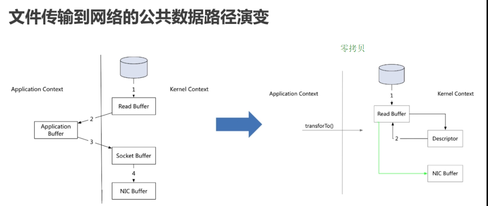

# Kafka #

* [1、kafka简介](#1、kafka简介)
* [2、安装及部署](#2、安装及部署)
* [3、搭建集群](#3、搭建集群)
* [4、kafka使用](#4、kafka使用)
* [5、spring+kafka](#5、spring+kafka)

### 1、kafka简介 ###
- Kafka是最初由Linkedin公司开发，是一个分布式、支持分区的（partition）、多副本的（replica），基于zookeeper协调的分布式消息系统，它的最大的特性就是可以实时的处理大量数据以满足各种需求场景：比如基于hadoop的批处理系统、低延迟的实时系统、storm/Spark流式处理引擎，web/nginx日志、访问日志，消息服务等等，用scala语言编写，Linkedin于2010年贡献给了Apache基金会并成为顶级开源项目。

> Kafka的特性:

	1. 高吞吐量、低延迟
		kafka每秒可以处理几十万条消息，它的延迟最低只有几毫秒，每个topic可以分多个partition, consumer group 对partition进行消费操作。

	2. 可扩展性
		kafka集群支持热扩展。

	3. 持久性、可靠性
		消息被持久化到本地磁盘，并且支持数据备份防止数据丢失。

	4. 容错性
		允许集群中节点失败（若副本数量为n，则允许n-1个节点失败）。

	5. 高并发
		支持数千个客户端同时读写。

> Kakfa Broker Leader的选举

	Kakfa Broker集群受Zookeeper管理。
	所有的 Kafka Broker节点一起去Zookeeper上注册一个 临时节点，因为只有一个Kafka Broker会注册成功，其他的都会失败，所以这个成功在Zookeeper上注册临时节点的这个Kafka Broker会成为 Leader，其他的Kafka broker叫 follower。（这个过程叫 Leader 在ZooKeeper注册Watch）。

	这个 Leader 会监听其他的Kafka Broker的所有信息，如果 Leader 宕机了，在zookeeper上面的那个临时节点就会消失，此时所有的kafka broker又会一起去Zookeeper上注册一个临时节点竞争 Leader。

> Consumergroup

	各个consumer（consumer 线程）可以组成一个组（Consumer group ）。
	在一个group中，每个分区至多只能绑定到一个消费者上，即一个消费者可以消费多个分区，一个分区只能被一个消费者消费。
	对于一个group而言，消费者的数量应该 小于 分区的数量。
	若一个group中的消费者数量大于分区数量的话，多余的消费者将不会收到任何消息，就造成了资源的浪费。

	同一个partition可以被不同的group 中的comsumer 消费。

	如果想同时对一个 partition 做消费的话，启动多个consumer group就可以了。
	但是要注意的是，这里的多个consumer的消费都必须是 顺序读取 partition里面的message。
	新启动的consumer默认从partition队列 最头端最新的地方开始阻塞的读message。

	由于 consumer 都是按顺序处理 message，故同一个消息肯定会被重复处理。
	所以一般都是两个不同的业务逻辑，才会使用两个 consumer group 来处理同一个 partition 的消息。

> Consumer

	Consumer 处理partition里面的message的时候是 顺序读取的，所以必须维护着上一次读到 offset 信息。
	kafka使用 offset 来记录当前消费的位置。

	如果 producer 的流量增大，当前的topic的parition数量=consumer数量，这时候的应对方式就是很想扩展：增加topic下的partition，同时增加这个consumer group下的consumer。
	
> Delivery Mode

	Kafka producer 发送message不用维护message的offsite信息，因为这个时候，offsite就相当于一个自增id，producer就尽管发送message就好了。

> Topic & Partition

	Topic相当于传统消息系统MQ中的一个队列queue。
	producer端发送的message必须指定是发送到哪个topic，但是不需要指定topic下的哪个partition，因为kafka会把收到的message进行load balance，均匀的分布在这个topic下的不同的partition上【 hash(message) % [broker数量]  】。
	也可以具体指定把消息发到哪个partition。

	物理上存储上，这个topic会分成一个或多个partition，每个partiton相当于是一个子queue。
	每个partition对应一个物理的目录（文件夹），文件夹命名是[topicname]_[partition]_[序号]，一个topic可以有无数多的partition，根据业务需求和数据量来设置。
	在kafka配置文件中可随时更高 num.partitions 参数来配置更改 topic的partition数量，也可以在创建Topic时通过参数指定 parittion数量。Topic创建之后通过Kafka提供的工具也可以修改partiton数量。
		1. 一个Topic的Partition数量大于等于Broker的数量，可以提高吞吐率。
		2. 同一个Partition的Replica尽量分散到不同的机器，高可用。

	 添加新的 partition时，partition里面的message不会重新进行分配，原来的partition里面的message数据不会变，新加的这个partition刚开始是空的，随后进入这个topic的message就会重新参与所有partition的load balance。

> Partition Replica

	每个partition可以在其他的kafka broker节点上存副本，以便某个kafka broker节点宕机不会影响这个kafka集群，整个kafka内数据依然是完整的。
	存replica副本的方式是按照kafka broker的顺序存。
	replica副本数目不能大于kafka broker节点的数目，否则报错。
	
	replica副本数越高，系统虽然越稳定，但是回来带资源和性能上的下降；
	replica副本少的话，也会造成系统丢数据的风险。

> 消息传送

	producer先把 message发送到 partition leader，再由leader发送给其他partition follower。
	在向Producer发送ACK前需要保证有多少个Replica已经收到该消息：根据ack配的个数而定。

> Partition leader 与 follower

	leader是主partition，producer写kafka的时候先写partition leader，再由partition leader push给其他的partition follower。
    partition leader与follower的信息受Zookeeper控制，一旦partition leader所在的broker节点宕机，zookeeper会冲其他的broker的partition follower上选择follower变为parition leader。

> Topic分配partition和partition replica的算法

	1. 将Broker（size=n）和待分配的Partition排序。
	2. 将第i个Partition分配到第（i%n）个Broker上。
	3. 将第i个Partition的第j个Replica分配到第（(i + j) % n）个Broker上。

> 消息投递可靠性

	只要 Leader 确认收到消息就算投递成功。
	
	1. At most once			消息可能会丢，绝对不会重复传输；
	2. At least once【默认】 消息绝对不会丢，但是可能会重复传输；
	3. Exactly once			每条信息肯定会被传输一次且仅传输一次，这是用户想要的。

> Partition acks

	应答模式，发送确认，请求是否成功发送到kafka。
		0：不应答；
		1：leader应答即可；
		all：leader和所有的follwer都应答。
			"all" 将会阻塞消息，这种设置性能最低，但是是最可靠的。
	
> Message

	状态：
		消息的状态维持在 consumer中，只记录一个offset值（指向partition中下一个要被消费的消息位置）。

	持久化：
		kafka 是将消息按顺序持久化到硬盘上，所以速度非常快，也是高吞吐量的原因。
		由于message的写入持久化是顺序写入的，因此message在被消费的时候也是按顺序被消费的，保证partition的message是顺序消费的。
		一般的机器，单机每秒100k条数据。

	有效期：
		Kafka会长久保留其中的消息，以便consumer可以多次消费。

		我们可以设定消息的过期时间，只有过期的数据才会被自动清除以释放磁盘空间。
			
> Kafka集群中broker之间的关系：

	不是主从关系，各个broker在集群中地位一样，我们可以随意的增加或删除任何一个broker节点。

> 同步异步
	
	Producer采用 异步push 方式，极大提高Kafka系统的吞吐率。
	可以通过参数控制是采用同步还是异步方式。

[kafka原理介绍总结](https://blog.csdn.net/YChenFeng/article/details/74980531)

> kafka零拷贝  zero-copy

	零拷贝就是一种避免 CPU 将数据从一个存储空间拷贝到另外一个存储空间的技术。

	Java Nio channel.transforTo() 方法
	Linux sendfile 系统调用
	内核空间和用户空间的数据拷贝次数为0，即无需转换空间，减少上下文切换的消耗。
	数据传送始终只发生在kernel space【内核空间】。

> 传统文件传输到网络的公共数据路径
	
	1. 操作系统将数据从磁盘读入到内核空间的页缓存；
	2. 应用程序将数据从内核空间读入到用户空间缓存中；
	3. 应用程序将数据从用户空间写回到内核空间的socket缓存中；
	4. 操作系统将数据从socket缓冲区复制到网卡缓冲区，以便将数据经网络传输。

	共产生了4次拷贝，2次空间转换，但没有对文件内容做任何修改，那么在内核空间和用户空间来回拷贝数据无疑就是一种浪费，而零拷贝主要就是为了解决这种低效性。

> 零拷贝过程

	1. 操作系统将数据从磁盘读入到内核空间的页缓存；
	2. 将数据的位置和长度的信息的描述符添加到内核空间的socket缓冲区；
	3. 操作系统将数据从内核空间的页缓冲区拷贝到网卡缓冲区，以便将数据经网络传输。

### 2、安装及部署 ###

> 2.1、下载

	在kafka官网 http://kafka.apache.org/downloads下载到最新的kafka安装包

	http://mirrors.hust.edu.cn/apache/kafka/1.1.1/kafka_2.11-1.1.1.tgz

> 2.2、 安装

	首先确保你的机器上安装了jdk，kafka需要java运行环境，以前的kafka还需要zookeeper，新版的kafka已经内置了一个zookeeper环境，所以我们可以直接使用。

	将kafka压缩包解压到/usr/local/目录即可。

	tar xzf kafka_2.11-1.1.1.tgz -C /usr/local/
	ln -s /usr/local/kafka_2.11-1.1.1 /usr/local/kafka

> 2.3、Kafka目录介绍

	/bin 操作kafka的可执行脚本，还包含windows下脚本

	/config 配置文件所在目录

	/libs 依赖库目录

	/logs 日志数据目录，目录kafka把server端日志分为5种类型，分为:server,request,state,log-cleaner,controller

> 2.4、配置

	在kafka解压目录下有一个config的文件夹，里面放置的是我们的配置文件。

	consumer.properites：消费者配置，这个配置文件用于配置开启的消费者，此处我们使用默认的即可。

	producer.properties：生产者配置，这个配置文件用于配置开启的生产者，此处我们使用默认的即可。

	server.properties：kafka服务器的配置，此配置文件用来配置kafka服务器。server.properties最为重要三个配置依次为：broker.id、log.dir、zookeeper.connect。

> server.properties配置属性说明

	1. broker.id：申明当前kafka服务器在集群中的唯一ID，需配置为integer,并且集群中的每一个kafka服务器的id都应是唯一的，我们这里采用默认配置即可。

	2. listeners: 申明此kafka服务器需要监听的端口号，如果是在本机上跑虚拟机运行可以不用配置本项，默认会使用localhost的地址，如果是在远程服务器上运行则必须配置。
	例如：
	listeners=PLAINTEXT://192.168.180.128:9092。并确保服务器的9092端口能够访问。

	advertised.listeners=PLAINTEXT://39.108.108.189:9092	//对外提供开放访问

	3. 配置kafka日志路径
	log.dirs=/usr/local/kafka/logs

	4. zookeeper.connect：申明kafka所连接的zookeeper的地址 ，需配置为zookeeper的地址，由于本次使用的是kafka高版本中自带zookeeper，使用默认配置即可。
	zookeeper.connect=localhost:2181

	【单机状态下可以都采用默认配置】

> 2.5、启动

	1. 启动zookeeper
		cd进入kafka解压目录，后台启动zookeeper

		cd /usr/local/kafka
		bin/zookeeper-server-start.sh config/zookeeper.properties &

		启动zookeeper成功后会看到如下的输出
		[2018-08-25 14:51:56,763] INFO binding to port 0.0.0.0/0.0.0.0:2181 (org.apache.zookeeper.server.NIOServerCnxnFactory)

	2. 启动Kafka

		cd /usr/local/kafka	
		bin/kafka-server-start.sh config/server.properties &

		启动kafka成功后会看到如下的输出
		[2018-08-25 14:58:38,091] INFO [KafkaServer id=0] started (kafka.server.KafkaServer)

		检测2181与9092端口

		netstat -tnlp|egrep "(2181|9092)"
		tcp        0      0 :::9092                     :::*                        LISTEN      11216/java          
		tcp        0      0 :::2181                     :::*                        LISTEN      10189/java  

		【说明】
		Kafka默认端口为9092，zookeeper默认端口2181

> 2.6、开启防火墙

	-A INPUT -m state --state NEW -m tcp -p tcp --dport 2181 -j ACCEPT
	-A INPUT -m state --state NEW -m tcp -p tcp --dport 9092 -j ACCEPT

> 2.7、单机连通性测试

	1. 创建一个topic

		Kafka通过topic对同一类的数据进行管理，同一类的数据使用同一个topic可以在处理数据时更加的便捷。

		创建一个名为test的topic【一个副本，一个分区，指定zookeeper】
		cd /usr/local/kafka	
		bin/kafka-topics.sh --create --zookeeper localhost:2181 --replication-factor 1 --partitions 1 --topic test

		【说明】
		--zookeeper localhost:2181 	依赖的zookeeper服务地址；
		--replication-factor 1 		每个分区的副本数
		--partitions 1 				topic 的分区数，分为几个区【文件夹】
		--topic test				topic的名字

		在创建topic后可以通过输入
		bin/kafka-topics.sh --list --zookeeper localhost:2181
		来查看已经创建的topic。

	2. 创建一个消息消费者

		cd /usr/local/kafka	
		bin/kafka-console-consumer.sh --bootstrap-server localhost:9092 --topic test --from-beginning

		可以创建一个用于消费topic为test的消费者。
		消费者创建完成之后，因为还没有发送任何数据，因此这里在执行后没有打印出任何数据。

	3. 创建一个消息生产者

		开启另一个终端
		cd /usr/local/kafka	
		bin/kafka-console-producer.sh --broker-list localhost:9092 --topic test

		在执行完毕后会进入的编辑器页面，即消息发送页面，发送后消费者终端就打印出了我们刚才发送的消息
		> hello world

	测试成功！在zookeeper中可以看到绑定的kafka的信息。

> kafka配置说明

	############################# System #############################
	#唯一标识在集群中的ID，要求是正数。
	broker.id=0
	#服务端口，默认9092
	port=9092
	#监听地址，不设为所有地址
	host.name=debugo01
	
	
	# 处理网络请求的最大线程数
	num.network.threads=2
	# 处理磁盘I/O的线程数
	num.io.threads=8
	# 一些后台线程数
	background.threads = 4
	# 等待IO线程处理的请求队列最大数
	queued.max.requests = 500
	
	
	#  socket的发送缓冲区（SO_SNDBUF）
	socket.send.buffer.bytes=1048576
	# socket的接收缓冲区 (SO_RCVBUF) 
	socket.receive.buffer.bytes=1048576
	# socket请求的最大字节数。为了防止内存溢出，message.max.bytes必然要小于
	socket.request.max.bytes = 104857600
	
	
	############################# Topic #############################
	# 每个topic的分区个数，更多的partition会产生更多的segment file
	num.partitions=2
	# 是否允许自动创建topic ，若是false，就需要通过命令创建topic
	auto.create.topics.enable =true
	# 一个topic ，默认分区的replication个数 ，不能大于集群中broker的个数。
	default.replication.factor =1
	# 消息体的最大大小，单位是字节
	message.max.bytes = 1000000
	
	
	############################# ZooKeeper #############################
	# Zookeeper quorum设置。如果有多个使用逗号分割
	zookeeper.connect=debugo01:2181,debugo02,debugo03
	# 连接zk的超时时间
	zookeeper.connection.timeout.ms=1000000
	# ZooKeeper集群中leader和follower之间的同步实际
	zookeeper.sync.time.ms = 2000
	
	
	############################# Log #############################
	#日志存放目录，多个目录使用逗号分割
	log.dirs=/var/log/kafka
	
	
	# 当达到下面的消息数量时，会将数据flush到日志文件中。默认10000
	#log.flush.interval.messages=10000
	# 当达到下面的时间(ms)时，执行一次强制的flush操作。interval.ms和interval.messages无论哪个达到，都会flush。默认3000ms
	#log.flush.interval.ms=1000
	# 检查是否需要将日志flush的时间间隔
	log.flush.scheduler.interval.ms = 3000
	
	
	# 日志清理策略（delete|compact）
	log.cleanup.policy = delete
	# 日志保存时间 (hours|minutes)，默认为7天（168小时）。超过这个时间会根据policy处理数据。bytes和minutes无论哪个先达到都会触发。
	log.retention.hours=168
	# 日志数据存储的最大字节数。超过这个时间会根据policy处理数据。
	#log.retention.bytes=1073741824
	
	
	# 控制日志segment文件的大小，超出该大小则追加到一个新的日志segment文件中（-1表示没有限制）
	log.segment.bytes=536870912
	# 当达到下面时间，会强制新建一个segment
	log.roll.hours = 24*7
	# 日志片段文件的检查周期，查看它们是否达到了删除策略的设置（log.retention.hours或log.retention.bytes）
	log.retention.check.interval.ms=60000
	
	
	# 是否开启压缩
	log.cleaner.enable=false
	# 对于压缩的日志保留的最长时间
	log.cleaner.delete.retention.ms = 1 day
	
	
	# 对于segment日志的索引文件大小限制
	log.index.size.max.bytes = 10 * 1024 * 1024
	#y索引计算的一个缓冲区，一般不需要设置。
	log.index.interval.bytes = 4096
	
	
	############################# replica #############################
	# partition management controller 与replicas之间通讯的超时时间
	controller.socket.timeout.ms = 30000
	# controller-to-broker-channels消息队列的尺寸大小
	controller.message.queue.size=10
	# replicas响应leader的最长等待时间，若是超过这个时间，就将replicas排除在管理之外
	replica.lag.time.max.ms = 10000
	# 是否允许控制器关闭broker ,若是设置为true,会关闭所有在这个broker上的leader，并转移到其他broker
	controlled.shutdown.enable = false
	# 控制器关闭的尝试次数
	controlled.shutdown.max.retries = 3
	# 每次关闭尝试的时间间隔
	controlled.shutdown.retry.backoff.ms = 5000
	
	
	# 如果relicas落后太多,将会认为此partition relicas已经失效。而一般情况下,因为网络延迟等原因,总会导致replicas中消息同步滞后。如果消息严重滞后,leader将认为此relicas网络延迟较大或者消息吞吐能力有限。在broker数量较少,或者网络不足的环境中,建议提高此值.
	replica.lag.max.messages = 4000
	#leader与relicas的socket超时时间
	replica.socket.timeout.ms= 30 * 1000
	# leader复制的socket缓存大小
	replica.socket.receive.buffer.bytes=64 * 1024
	# replicas每次获取数据的最大字节数
	replica.fetch.max.bytes = 1024 * 1024
	# replicas同leader之间通信的最大等待时间，失败了会重试
	replica.fetch.wait.max.ms = 500
	# 每一个fetch操作的最小数据尺寸,如果leader中尚未同步的数据不足此值,将会等待直到数据达到这个大小
	replica.fetch.min.bytes =1
	# leader中进行复制的线程数，增大这个数值会增加relipca的IO
	num.replica.fetchers = 1
	# 每个replica将最高水位进行flush的时间间隔
	replica.high.watermark.checkpoint.interval.ms = 5000
	 
	# 是否自动平衡broker之间的分配策略
	auto.leader.rebalance.enable = false
	# leader的不平衡比例，若是超过这个数值，会对分区进行重新的平衡
	leader.imbalance.per.broker.percentage = 10
	# 检查leader是否不平衡的时间间隔
	leader.imbalance.check.interval.seconds = 300
	# 客户端保留offset信息的最大空间大小
	offset.metadata.max.bytes = 1024
	
	
	#############################Consumer #############################
	# Consumer端核心的配置是group.id、zookeeper.connect
	# 决定该Consumer归属的唯一组ID，By setting the same group id multiple processes indicate that they are all part of the same consumer group.
	group.id
	# 消费者的ID，若是没有设置的话，会自增
	consumer.id
	# 一个用于跟踪调查的ID ，最好同group.id相同
	client.id = <group_id>
	 
	# 对于zookeeper集群的指定，必须和broker使用同样的zk配置
	zookeeper.connect=debugo01:2182,debugo02:2182,debugo03:2182
	# zookeeper的心跳超时时间，查过这个时间就认为是无效的消费者
	zookeeper.session.timeout.ms = 6000
	# zookeeper的等待连接时间
	zookeeper.connection.timeout.ms = 6000
	# zookeeper的follower同leader的同步时间
	zookeeper.sync.time.ms = 2000
	# 当zookeeper中没有初始的offset时，或者超出offset上限时的处理方式 。
	# smallest ：重置为最小值 
	# largest:重置为最大值 
	# anything else：抛出异常给consumer
	auto.offset.reset = largest
	
	
	# socket的超时时间，实际的超时时间为max.fetch.wait + socket.timeout.ms.
	socket.timeout.ms= 30 * 1000
	# socket的接收缓存空间大小
	socket.receive.buffer.bytes=64 * 1024
	#从每个分区fetch的消息大小限制
	fetch.message.max.bytes = 1024 * 1024
	 
	# true时，Consumer会在消费消息后将offset同步到zookeeper，这样当Consumer失败后，新的consumer就能从zookeeper获取最新的offset
	auto.commit.enable = true
	# 自动提交的时间间隔
	auto.commit.interval.ms = 60 * 1000
	 
	# 用于消费的最大数量的消息块缓冲大小，每个块可以等同于fetch.message.max.bytes中数值
	queued.max.message.chunks = 10
	
	
	# 当有新的consumer加入到group时,将尝试reblance,将partitions的消费端迁移到新的consumer中, 该设置是尝试的次数
	rebalance.max.retries = 4
	# 每次reblance的时间间隔
	rebalance.backoff.ms = 2000
	# 每次重新选举leader的时间
	refresh.leader.backoff.ms
	 
	# server发送到消费端的最小数据，若是不满足这个数值则会等待直到满足指定大小。默认为1表示立即接收。
	fetch.min.bytes = 1
	# 若是不满足fetch.min.bytes时，等待消费端请求的最长等待时间
	fetch.wait.max.ms = 100
	# 如果指定时间内没有新消息可用于消费，就抛出异常，默认-1表示不受限
	consumer.timeout.ms = -1
	
	
	#############################Producer#############################
	# 核心的配置包括：
	# metadata.broker.list
	# request.required.acks
	# producer.type
	# serializer.class
	
	
	# 消费者获取消息元信息(topics, partitions and replicas)的地址,配置格式是：host1:port1,host2:port2，也可以在外面设置一个vip
	metadata.broker.list
	 
	#消息的确认模式
	# 0：不保证消息的到达确认，只管发送，低延迟但是会出现消息的丢失，在某个server失败的情况下，有点像TCP
	# 1：发送消息，并会等待leader 收到确认后，一定的可靠性
	# -1：发送消息，等待leader收到确认，并进行复制操作后，才返回，最高的可靠性
	request.required.acks = 0
	 
	# 消息发送的最长等待时间
	request.timeout.ms = 10000
	# socket的缓存大小
	send.buffer.bytes=100*1024
	# key的序列化方式，若是没有设置，同serializer.class
	key.serializer.class
	# 分区的策略，默认是取模
	partitioner.class=kafka.producer.DefaultPartitioner
	# 消息的压缩模式，默认是none，可以有gzip和snappy
	compression.codec = none
	# 可以针对默写特定的topic进行压缩
	compressed.topics=null
	# 消息发送失败后的重试次数
	message.send.max.retries = 3
	# 每次失败后的间隔时间
	retry.backoff.ms = 100
	# 生产者定时更新topic元信息的时间间隔 ，若是设置为0，那么会在每个消息发送后都去更新数据
	topic.metadata.refresh.interval.ms = 600 * 1000
	# 用户随意指定，但是不能重复，主要用于跟踪记录消息
	client.id=""
	 
	# 异步模式下缓冲数据的最大时间。例如设置为100则会集合100ms内的消息后发送，这样会提高吞吐量，但是会增加消息发送的延时
	queue.buffering.max.ms = 5000
	# 异步模式下缓冲的最大消息数，同上
	queue.buffering.max.messages = 10000
	# 异步模式下，消息进入队列的等待时间。若是设置为0，则消息不等待，如果进入不了队列，则直接被抛弃
	queue.enqueue.timeout.ms = -1
	# 异步模式下，每次发送的消息数，当queue.buffering.max.messages或queue.buffering.max.ms满足条件之一时producer会触发发送。
	batch.num.messages=200

### 3、搭建集群 ###

> 搭建一个多个broker的伪集群

	刚才只是启动了单个broker，现在启动有3个broker组成的集群，这些broker节点也都是在本机上。

> 为每一个broker提供配置文件

	server0.properties配置信息：

		broker.id=0
		listeners=PLAINTEXT://:9092
		port=9092
		host.name=192.168.1.30
		num.network.threads=4
		num.io.threads=8
		socket.send.buffer.bytes=102400
		socket.receive.buffer.bytes=102400
		socket.request.max.bytes=104857600
		log.dirs=/tmp/kafka-logs
		num.partitions=5
		num.recovery.threads.per.data.dir=1
		log.retention.hours=168
		log.segment.bytes=1073741824
		log.retention.check.interval.ms=300000
		log.cleaner.enable=false
		zookeeper.connect=192.168.1.30:2181
		zookeeper.connection.timeout.ms=6000
		queued.max.requests =500
		log.cleanup.policy = delete

	【说明】

	broker.id为集群中唯一的标注一个节点，因为在同一个机器上，所以必须指定不同的端口和日志文件，避免数据被覆盖。

> 根据上面的配置文件，提供2个broker的配置文件：

	server1.properties:
	
	server2.properties:
	
		broker.id=2
		listeners=PLAINTEXT://:9094
		port=9094
		host.name=192.168.1.181
		num.network.threads=4
		num.io.threads=8
		socket.send.buffer.bytes=102400
		socket.receive.buffer.bytes=102400
		socket.request.max.bytes=104857600
		log.dirs=/tmp/kafka-logs2
		num.partitions=5
		num.recovery.threads.per.data.dir=1
		log.retention.hours=168
		log.segment.bytes=1073741824
		log.retention.check.interval.ms=300000
		log.cleaner.enable=false
		zookeeper.connect=192.168.1.181:2181
		zookeeper.connection.timeout.ms=6000
		queued.max.requests =500
		log.cleanup.policy = delete

> 启动所有的broker

	bin/kafka-server-start.sh config/server0.properties &   #启动broker0
	bin/kafka-server-start.sh config/server1.properties & 	#启动broker1
	bin/kafka-server-start.sh config/server2.properties & 	#启动broker2
	
	查看2181、9092、9093、9094端口

	netstat -tunlp|egrep "(2181|9092|9093|9094)"
	tcp        0      0 :::9093                     :::*                        LISTEN      29725/java          
	tcp        0      0 :::2181                     :::*                        LISTEN      19787/java          
	tcp        0      0 :::9094                     :::*                        LISTEN      29800/java          
	tcp        0      0 :::9092                     :::*                        LISTEN      29572/java  

	一个zookeeper在2181端口上监听，3个kafka cluster(broker)分别在端口9092,9093,9094监听。

> 创建topic

	bin/kafka-topics.sh --create --topic topic_1 --partitions 1 --replication-factor 3  \--zookeeper localhost:2181
	
	bin/kafka-topics.sh --create --topic topic_2 --partitions 1 --replication-factor 3  \--zookeeper localhost:2181
	
	bin/kafka-topics.sh --create --topic topic_3 --partitions 1 --replication-factor 3  \--zookeeper localhost:2181

	查看topic创建情况：

	bin/kafka-topics.sh --list --zookeeper localhost:2181
	test
	topic_1
	topic_2
	topic_3

	bin/kafka-topics.sh --describe --zookeeper localhost:2181

	Topic:test	PartitionCount:1	ReplicationFactor:1	Configs:
		Topic: test	Partition: 0	Leader: 0	Replicas: 0	Isr: 0
	Topic:topic_1	PartitionCount:1	ReplicationFactor:3	Configs:
		Topic: topic_1	Partition: 0	Leader: 2	Replicas: 2,1,0	Isr: 2,1,0
	Topic:topic_2	PartitionCount:1	ReplicationFactor:3	Configs:
		Topic: topic_2	Partition: 0	Leader: 1	Replicas: 1,2,0	Isr: 1,2,0
	Topic:topic_3	PartitionCount:1	ReplicationFactor:3	Configs:
		Topic: topic_3	Partition: 0	Leader: 0	Replicas: 0,2,1	Isr: 0,2,1

> 模拟客户端发送，接受消息

	发送消息

	bin/kafka-console-producer.sh --topic topic_1 --broker-list 192.168.1.181:9092,192.168.1.181:9093,192.168.1.181:9094

	接收消息
	
	bin/kafka-console-consumer.sh --topic topic_1 --zookeeper 192.168.1.181:2181 --from-beginning
	需要注意，此时producer将topic发布到了3个broker中，现在就有点分布式的概念了。

> kill some broker

	kill broker(id=0)

	首先，我们根据前面的配置，得到broker(id=0)应该在9092监听,这样就能确定它的PID了。
	
	broker0没kill之前topic在kafka cluster中的情况
	
	bin/kafka-topics.sh --describe --zookeeper localhost:2181

	Topic:test	PartitionCount:1	ReplicationFactor:1	Configs:
		Topic: test	Partition: 0	Leader: 0	Replicas: 0	Isr: 0
	Topic:topic_1	PartitionCount:1	ReplicationFactor:3	Configs:
		Topic: topic_1	Partition: 0	Leader: 2	Replicas: 2,1,0	Isr: 2,1,0
	Topic:topic_2	PartitionCount:1	ReplicationFactor:3	Configs:
		Topic: topic_2	Partition: 0	Leader: 1	Replicas: 1,2,0	Isr: 1,2,0
	Topic:topic_3	PartitionCount:1	ReplicationFactor:3	Configs:
		Topic: topic_3	Partition: 0	Leader: 2	Replicas: 0,2,1	Isr: 2,1,0
	kill之后，再观察，做下对比。很明显，主要变化在于Isr，以后再分析
	
	bin/kafka-topics.sh --describe --zookeeper localhost:2181

	Topic:test	PartitionCount:1	ReplicationFactor:1	Configs:
	Topic: test	Partition: 0	Leader: -1	Replicas: 0	Isr: 
	Topic:topic_1	PartitionCount:1	ReplicationFactor:3	Configs:

	Topic: topic_1	Partition: 0	Leader: 2	Replicas: 2,1,0	Isr: 2,1
	Topic:topic_2	PartitionCount:1	ReplicationFactor:3	Configs:
	Topic: topic_2	Partition: 0	Leader: 1	Replicas: 1,2,0	Isr: 1,2
	Topic:topic_3	PartitionCount:1	ReplicationFactor:3	Configs:
	Topic: topic_3	Partition: 0	Leader: 2	Replicas: 0,2,1	Isr: 2,1
	测试下，发送消息，接受消息，是否收到影响。
	
	发送消息
	bin/kafka-console-producer.sh --topic topic_1 --broker-list 192.168.1.181:9092,192.168.1.181:9093,192.168.1.181:9094

	接收消息
	bin/kafka-console-consumer.sh --topic topic_1 --zookeeper 192.168.1.181:2181 --from-beginning

	可见，kafka的分布式机制，容错能力还是挺好的~

### 4、kafka使用 ###

> pom.xml

	<!--kafka start-->
    <dependency>
      <groupId>org.apache.kafka</groupId>
      <artifactId>kafka-clients</artifactId>
      <version>0.11.0.1</version>
    </dependency>
    <dependency>
      <groupId>org.apache.kafka</groupId>
      <artifactId>kafka-streams</artifactId>
      <version>0.11.0.1</version>
    </dependency>

> 生产者

	通过创建Properties 对象设置kafka的生产者属性。
		1. bootstrap.servers：kafka指定broker,也可以是集群的地址，以逗号隔开。
		2. acks：应答模式,发送确认，请求是否成功发送到kafka。
			0：不应答；
			1：leader应答；
			all：leader和所有的follwer都应答。“all”将会阻塞消息，这种设置性能最低，但是是最可靠的。
		3. retries： 请求失败，生产者会自动重试，指定是0次。如果启用重试，则会有重复消息的可能性。
		4. batch.size：缓存的大小。
		5. linger.ms：逗留毫秒数。
		6. buffer.memory：控制生产者可用的缓存总量，如果消息发送速度比其传输到服务器的快，将会耗尽这个缓存空间。
			当缓存空间耗尽，其他发送调用将被阻塞，阻塞时间的阈值通过max.block.ms设定，之后它将抛出一个TimeoutException。
		7. key.serializer：对消息键的序列化方式。
		8. value.serializer：对消息值的序列化方式。

	生产者对象：
		根据生产者属性进行数据分区
		KafkaProducer<String, String> producer = new KafkaProducer<>(properties);  

		方法：
			// 发送消息【record生产者记录对象,callback异步返回结果】
			send(ProducerRecord<K, V> record);
			send(ProducerRecord<K, V> record, Callback callback);

			send方法是异步的，添加消息到缓冲区等待发送，并立即返回，所有发送完成并不表示发送成功。生产者将单个的消息批量在一起发送来提高效率。

			异步返回结果中包含一个RecordMetadata  对象。
				RecordMetadata  对象：发送的结果，它指定了消息发送的分区，分配的offset和消息的时间戳,比如 topic-test3-0@120，topic为topic-test3，分区为0，offset为120。

			producer.send(producerRecord, new Callback() {
                @Override
                public void onCompletion(RecordMetadata recordMetadata, Exception e) {
                    if (e != null) e.printStackTrace();
                    System.out.println(recordMetadata);
                }
            });

			// 关闭连接
			void close();
			
	生产者记录对象：
		为消息缓冲区，指定生产者发送消息的消息主题，消息键值
		ProducerRecord<String, String> producerRecord = new ProducerRecord<>(TOPIC, key, data);	

		public ProducerRecord(String topic, V value);
		public ProducerRecord(String topic, K key, V value); 
		public ProducerRecord(String topic, Integer partition, K key, V value);
		
	方法：
		public String topic();
		public K key();
		public V value();
		public Long timestamp();
		public Integer partition();	
		

> SimpleKafkaProducer.java

	package com.hdc.publisher;

	import org.apache.kafka.clients.producer.KafkaProducer;
	import org.apache.kafka.clients.producer.ProducerRecord;
	
	import java.util.Properties;

	public class SimpleKafkaProducer {
	
	    private static KafkaProducer<String, String> producer;
	    private final static String TOPIC = "topic-test3";
	
	    public SimpleKafkaProducer(){
	        Properties properties = new Properties();
	        properties.put("bootstrap.servers", "192.168.1.30:9092");
	        properties.put("acks", "all");
	        properties.put("retries", 0);
	        properties.put("batch.size", 16384);
	        properties.put("linger.ms", 1);
	        properties.put("buffer.memory", 33554432);
	        properties.put("key.serializer", "org.apache.kafka.common.serialization.StringSerializer");
	        properties.put("value.serializer", "org.apache.kafka.common.serialization.StringSerializer");

	        producer = new KafkaProducer<>(properties);
	    }
	
	    public void produce(){
	        for (int i = 10;i<40;i++){
	            String key = "key"+ Integer.toString(i);
	            String data = "hello kafka message：" + Integer.toString(i);
	            ProducerRecord<String, String> producerRecord = new ProducerRecord<>(TOPIC, key, data);
	            producer.send(producerRecord, new Callback() {
	                @Override
	                public void onCompletion(RecordMetadata recordMetadata, Exception e) {
	                    if (e != null) e.printStackTrace();
	                    System.out.println(recordMetadata);
	                }
	            });
	        }
	        producer.close();
	    }
	
	    public static void main(String[] args) {
	        new SimpleKafkaProducer().produce();
	    }
	}

> 消费者

	通过创建Properties 对象设置kafka的消费者属性。
		1. bootstrap.servers：kafka指定broker,也可以是集群的地址，以逗号隔开。
		2. group.id: 在zookeeper中给每个消费者分配一个独立的组号。
		3. enable.auto.commit：如果value合法，则自动提交偏移量。
		4. auto.commit.interval.ms：设置多久一次更新被消费消息的偏移量。
		5. session.timeout.ms：设置会话响应的时间，超过这个时间kafka可以选择放弃消费或者消费下一条消息。
		6. auto.offset.reset ：自动重置offset。
			earliest
	 			当各分区下有已提交的offset时，从提交的offset开始消费；无提交的offset时，从头开始消费。
			latest
				当各分区下有已提交的offset时，从提交的offset开始消费；无提交的offset时，消费新产生的该分区下的数据
			none
				topic各分区都存在已提交的offset时，从offset后开始消费；只要有一个分区不存在已提交的offset，则抛出异常
		7. key.deserializer：对消息键的反序列化方式。
		8. value.deserializer：对消息值的反序列化方式。

	消费者对象：
		KafkaConsumer<String, String> consumer = new KafkaConsumer<>(props);

		方法：
			// 订阅主题
			subscribe(Collection<String> topics)
			subscribe(Collection<String> topics, ConsumerRebalanceListener listener)
			subscribe(Pattern pattern, ConsumerRebalanceListener listener)

			订阅主题列表topic，subscribe动态分配分区
	        consumer.subscribe(Arrays.asList(TOPIC));

			// 获取消息
			public ConsumerRecords<K, V> poll(long timeout);

			// 订阅主题的指定分区
			public void assign(Collection<TopicPartition> partitions);

			// 消费者手动控制分区的偏移量的位置
			public void seek(TopicPartition partition, long offset);
			public void seekToBeginning(Collection<TopicPartition> partitions);

			// 暂停消费指定分配的分区
			public void pause(Collection<TopicPartition> partitions);

			// 重新开始指定暂停的分区
			public void resume(Collection<TopicPartition> partitions);
			
			// 线程安全
			public void wakeup();

	TopicPartition
	  // 构造函数
	  public TopicPartition(String topic, int partition);  

	消费者记录对象：
		获取队列中的数据
		ConsumerRecords<String, String> records = consumer.poll(1000);
			poll：将消费者加入到消费者组中，会产生阻塞。
			消费者需要向服务器定时发送心跳, 如果消费者崩溃或者无法在session.timeout.ms配置的时间内发送心跳，则消费者被视为死亡，并且将其分区被重新分配。

		// 读取队列中所有的数据
		for (ConsumerRecord<String, String> record : records){
            String result = String.format("offset = %d, key = %s, value = %s",record.offset(), record.key(), record.value());
            System.out.println(result);
	     }

		// 按分区读取数据
        for (TopicPartition partition: records.partitions()) {
            List<ConsumerRecord<String, String>> partitionRecords = records.records(partition);
            for (ConsumerRecord<String, String> record: partitionRecords) {
                System.out.printf("offset = %d, key = %s, value= %s%n", record.offset(), record.key(), record.value());
            }
        }

            
> SimpleKafkaConsumer.java

	import org.apache.kafka.clients.consumer.ConsumerRecord;
	import org.apache.kafka.clients.consumer.ConsumerRecords;
	import org.apache.kafka.clients.consumer.KafkaConsumer;
	import java.util.Arrays;
	import java.util.Properties;
	
	public class SimpleKafkaConsumer {
	
	    private static KafkaConsumer<String, String> consumer;
	    private final static String TOPIC = "topic-test3";
	
	    public SimpleKafkaConsumer(){
	        Properties props = new Properties();
	        props.put("bootstrap.servers", "192.168.1.30:9092");        
	        props.put("group.id", "test3");	        
	        props.put("enable.auto.commit", "true");        
	        props.put("auto.commit.interval.ms", "1000");	        
	        props.put("session.timeout.ms", "30000");
	        props.put("auto.offset.reset","earliest");
	        props.put("key.deserializer",
	                "org.apache.kafka.common.serialization.StringDeserializer");
	        props.put("value.deserializer",
	                "org.apache.kafka.common.serialization.StringDeserializer");
	        consumer = new KafkaConsumer<>(props);
	    }
	
	    public void consume(){
	        consumer.subscribe(Arrays.asList(TOPIC));
	        while (true) {
	            //阻塞获取队列中的数据
	            ConsumerRecords<String, String> records = consumer.poll(1000);

	            for (ConsumerRecord<String, String> record : records){
	                String result = String.format("offset = %d, key = %s, value = %s",record.offset(), record.key(), record.value());
	                System.out.println(result);
	            }
	        }
	    }
	
	    public static void main(String[] args) {
	        new SimpleKafkaConsumer().consume();
	    }
	
	}

> 先运行消费者SimpleKafkaConsumer，再运行生产者SimpleKafkaProducer, 当生产者发送消息的时候，消费者就能收到消息。

### 消息序列化 ###
> kafka 消息的key和value支持以下类型，但是不支持对象，为了让kafka发送的消息为对象类型，需要自定义对象的序列化和对象的反序列化。

	org.apache.kafka.common.serialization.ByteArraySerializer
	org.apache.kafka.common.serialization.ByteBufferSerializer
	org.apache.kafka.common.serialization.BytesSerializer
	org.apache.kafka.common.serialization.DoubleSerializer
	org.apache.kafka.common.serialization.IntegerSerializer
	org.apache.kafka.common.serialization.LongSerializer
	org.apache.kafka.common.serialization.StringSerializer/StringDeserializer

> 对象序列化 ObjectSerializer

	/**
	 * 对象序列化
	 */
	public class ObjectSerializer implements Serializer<Object>{
	    public void configure(Map<String, ?> map, boolean b) {
	
	    }
	
	    public byte[] serialize(String topic, Object object) {
	        byte[] bytes = null;
	        ByteArrayOutputStream byteArrayOutputStream = null;
	        ObjectOutputStream objectOutputStream = null;
	        try {
	            byteArrayOutputStream = new ByteArrayOutputStream();
	            objectOutputStream = new ObjectOutputStream(byteArrayOutputStream);
	            objectOutputStream.writeObject(object);
	            bytes = byteArrayOutputStream.toByteArray();
	        } catch (IOException e) {
	            e.printStackTrace();
	        }finally {
	            try {
	                if(byteArrayOutputStream!=null){
	                    byteArrayOutputStream.close();
	                }
	                if(objectOutputStream!=null){
	                    objectOutputStream.close();
	                }
	            } catch (IOException e) {
	                e.printStackTrace();
	            }
	        }
	        return bytes;
	    }
	
	    public void close() {
	
	    }
	}

> 对象反序列化 ObjectDeserializer

	/**
	 * 对象反序列化
	 */
	public class ObjectDeserializer implements Deserializer<Object>{
	    public void configure(Map<String, ?> map, boolean b) {
	
	    }
	
	    public Object deserialize(String topic, byte[] bytes) {
	        Object object = null;
	        ByteArrayInputStream byteArrayInputStream = null;
	        ObjectInputStream objectInputStream = null;
	        try {
	            byteArrayInputStream =new ByteArrayInputStream(bytes);
	            objectInputStream =new ObjectInputStream(byteArrayInputStream);
	            object = objectInputStream.readObject();
	        } catch (Exception e) {
	            e.printStackTrace();
	        }finally {
	            try {
	                if(byteArrayInputStream!=null){
	                    byteArrayInputStream.close();
	                }
	                if(objectInputStream!=null){
	                    objectInputStream.close();
	                }
	            } catch (IOException e) {
	                e.printStackTrace();
	            }
	        }
	
	        return object;
	    }
	
	    public void close() {
	
	    }
	}

### 5、spring+kafka ###

> pom.xml

	<properties>
	    <project.build.sourceEncoding>UTF-8</project.build.sourceEncoding>
	    <maven.compiler.source>1.7</maven.compiler.source>
	    <maven.compiler.target>1.7</maven.compiler.target>
	    <spring.version>4.3.0.RELEASE</spring.version>
	</properties>

	<dependencies>
	    <dependency>
	      <groupId>junit</groupId>
	      <artifactId>junit</artifactId>
	      <version>4.12</version>
	      <scope>test</scope>
	    </dependency>
	
	    <!-- spring -->
	    <dependency>
	      <groupId>org.springframework</groupId>
	      <artifactId>spring-beans</artifactId>
	      <version>${spring.version}</version>
	    </dependency>
	    <dependency>
	      <groupId>org.springframework</groupId>
	      <artifactId>spring-context</artifactId>
	      <version>${spring.version}</version>
	    </dependency>
	    <dependency>
	      <groupId>org.springframework</groupId>
	      <artifactId>spring-core</artifactId>
	      <version>${spring.version}</version>
	    </dependency>
	    <dependency>
	      <groupId>org.springframework</groupId>
	      <artifactId>spring-jdbc</artifactId>
	      <version>${spring.version}</version>
	    </dependency>
	    <dependency>
	      <groupId>org.springframework</groupId>
	      <artifactId>spring-web</artifactId>
	      <version>${spring.version}</version>
	    </dependency>
	    <dependency>
	      <groupId>org.springframework</groupId>
	      <artifactId>spring-webmvc</artifactId>
	      <version>${spring.version}</version>
	    </dependency>
	    <dependency>
	      <groupId>org.springframework</groupId>
	      <artifactId>spring-test</artifactId>
	      <version>${spring.version}</version>
	    </dependency>
	    <dependency>
	      <groupId>org.springframework.kafka</groupId>
	      <artifactId>spring-kafka</artifactId>
	      <version>2.1.6.RELEASE</version>
	    </dependency>

	</dependencies>

> 生产者配置属性  
> kafka-publisher.properties

	bootstrap.servers=192.168.1.30:9092
	group.id=GroupA
	retries=0
	batch.size=16384
	linger.ms=1
	buffer.memory=33554432
	acks=all
	key.serializer=org.apache.kafka.common.serialization.StringSerializer
	value.serializer=org.apache.kafka.common.serialization.StringSerializer

> 生产者配置文件  
> publisher.xml

	<?xml version="1.0" encoding="UTF-8"?>
	<beans xmlns="http://www.springframework.org/schema/beans"
	       xmlns:xsi="http://www.w3.org/2001/XMLSchema-instance"
	       xmlns:context="http://www.springframework.org/schema/context"
	       xsi:schemaLocation="http://www.springframework.org/schema/beans
	       http://www.springframework.org/schema/beans/spring-beans.xsd
	       http://www.springframework.org/schema/context
	       http://www.springframework.org/schema/context/spring-context.xsd">
	
	    <context:property-placeholder location="classpath:kafka-publisher.properties" ignore-unresolvable="true"/>
	
	    <!-- 1. 定义producer的参数 -->
	    <bean id="producerProperties" class="java.util.HashMap">
	        <constructor-arg>
	            <map>
	                <entry key="bootstrap.servers" value="${bootstrap.servers}" />
	                <entry key="group.id" value="${group.id}" />
	                <entry key="retries" value="${retries}" />
	                <entry key="batch.size" value="${batch.size}" />
	                <entry key="linger.ms" value="${linger.ms}" />
	                <entry key="buffer.memory" value="${buffer.memory}" />
	                <entry key="acks" value="${acks}" />
	                <entry key="key.serializer" value="${key.serializer}" />
	                <entry key="value.serializer" value="${value.serializer}" />
	            </map>
	        </constructor-arg>
	    </bean>
	
	    <!-- 2. 生产者工厂 -->
	    <bean id="producerFactory"
	          class="org.springframework.kafka.core.DefaultKafkaProducerFactory">
	        <constructor-arg ref="producerProperties"/>
	    </bean>
	
	    <!-- 3. kafkaTemplate -->
	    <bean id="kafkaTemplate" class="org.springframework.kafka.core.KafkaTemplate">
	        <constructor-arg ref="producerFactory" />
	        <constructor-arg name="autoFlush" value="true" />
	        <property name="defaultTopic" value="default" />
	    </bean>
	
	</beans>

> 消费者配置属性  
> kafka-consumer.properties

	bootstrap.servers=192.168.1.30:9092
	group.id=GroupA
	enable.auto.commit=true
	session.timeout.ms=30000
	auto.offset.reset=earliest
	key.deserializer=org.apache.kafka.common.serialization.StringDeserializer
	value.deserializer=org.apache.kafka.common.serialization.StringDeserializer
	concurrency=5
	topic.test=test
	topic.test2=test2

> 消费者配置文件  
> consumer.xml

	<?xml version="1.0" encoding="UTF-8"?>
	<beans xmlns="http://www.springframework.org/schema/beans"
	       xmlns:xsi="http://www.w3.org/2001/XMLSchema-instance"
	       xmlns:context="http://www.springframework.org/schema/context"
	       xsi:schemaLocation="http://www.springframework.org/schema/beans
	       http://www.springframework.org/schema/beans/spring-beans.xsd
	       http://www.springframework.org/schema/context
	       http://www.springframework.org/schema/context/spring-context.xsd">
	
	    <context:property-placeholder location="classpath:kafka-consumer.properties" ignore-unresolvable="true"/>
	
	    <!-- 1. 定义consumer的参数 -->
	    <bean id="consumerProperties" class="java.util.HashMap">
	        <constructor-arg>
	            <map>
	                <entry key="bootstrap.servers" value="${bootstrap.servers}" />
	                <entry key="group.id" value="${group.id}" />
	                <entry key="enable.auto.commit" value="${enable.auto.commit}" />
	                <entry key="session.timeout.ms" value="${session.timeout.ms}" />
	                <entry key="auto.offset.reset" value="${auto.offset.reset}"/>
	                <entry key="key.deserializer" value="${key.deserializer}" />
	                <entry key="value.deserializer" value="${value.deserializer}" />
	            </map>
	        </constructor-arg>
	    </bean>
	
	    <!-- 2. 消费者工厂 -->
	    <bean id="consumerFactory" class="org.springframework.kafka.core.DefaultKafkaConsumerFactory" >
	        <constructor-arg ref="consumerProperties"/>
	    </bean>
	
	    <!-- 3. 定义消费监听服务 -->
	    <bean id="consumerListenerService" class="com.hdc.spring.ConsumerListenerService" />
	
	    <!-- 4. 消费者容器配置信息 -->
	    <bean id="containerProperties" class="org.springframework.kafka.listener.config.ContainerProperties">
	        <!-- topic -->
	        <constructor-arg name="topics">
	            <list>
	                <value>${topic.test}</value>
	                <value>${topic.test2}</value>
	            </list>
	        </constructor-arg>
	        <property name="messageListener" ref="consumerListenerService" />
	    </bean>
	
	    <!-- 5. 消费者并发消息监听容器，执行doStart()方法 -->
	    <bean id="messageListenerContainer" class="org.springframework.kafka.listener.ConcurrentMessageListenerContainer" init-method="doStart" >
	        <constructor-arg ref="consumerFactory" />
	        <constructor-arg ref="containerProperties" />
	        <property name="concurrency" value="${concurrency}" />
	    </bean>
	
	</beans>

> 定义消费者监听服务

	import org.apache.kafka.clients.consumer.ConsumerRecord;
	import org.slf4j.Logger;
	import org.slf4j.LoggerFactory;
	import org.springframework.kafka.listener.MessageListener;
	
	/**
	 *
	 * 定义消费监听服务
	 * Create By HuangDongChang On 2018/9/1
	 */
	public class ConsumerListenerService implements MessageListener<String, String> {
	
	    private static final Logger logger = LoggerFactory.getLogger(ConsumerListenerService.class);
	
	    @Override
	    public void onMessage(ConsumerRecord<String, String> consumerRecord) {
	        if(consumerRecord == null){
	            logger.info("record is null");
	            return;
	        }
	        logger.info("收到一条消息:{}" ,consumerRecord.toString());
	
	    }
	}

> 启动消费者服务

	public class consumerMain {

	    public static void main(String[] args) {
	        new ClassPathXmlApplicationContext("classpath:config/consumer.xml");
	    }
	}

> 定义消费者发送服务

	import com.hdc.spring.ConsumerListenerService;
	import org.junit.Test;
	import org.junit.runner.RunWith;
	import org.slf4j.Logger;
	import org.slf4j.LoggerFactory;
	import org.springframework.beans.factory.annotation.Autowired;
	import org.springframework.kafka.core.KafkaTemplate;
	import org.springframework.kafka.support.SendResult;
	import org.springframework.test.context.ContextConfiguration;
	import org.springframework.test.context.junit4.SpringJUnit4ClassRunner;
	import org.springframework.util.concurrent.FailureCallback;
	import org.springframework.util.concurrent.ListenableFuture;
	import org.springframework.util.concurrent.SuccessCallback;

	@RunWith(SpringJUnit4ClassRunner.class)
	@ContextConfiguration(locations = "classpath:config/publisher.xml")
	public class KafkaTestDemo {
	
	    private final Logger logger = LoggerFactory.getLogger(this.getClass());
	
	    @Autowired
	    private KafkaTemplate kafkaTemplate;
	
	    @Test
	    public void testProducer(){
	
	        for (int i = 10; i < 20; i++) {
	            ListenableFuture<SendResult<String, String>> listenableFuture =
	                    kafkaTemplate.send("test", 0,"key1","data123");
	
	            //发送成功回调
	            SuccessCallback<SendResult<String, String>> successCallback = new SuccessCallback<SendResult<String, String>>() {
	                @Override
	                public void onSuccess(SendResult<String, String> result) {
	                    //成功业务逻辑
	                    logger.info("发送成功");
	                    logger.info("发送消息的结果={}" , result.getProducerRecord().toString());
	                }
	            };
	
	            //发送失败回调
	            FailureCallback failureCallback = new FailureCallback() {
	                @Override
	                public void onFailure(Throwable ex) {
	                    ex.printStackTrace();
	                    //失败业务逻辑
	                    logger.info("发送失败");
	                }
	            };
	
	            listenableFuture.addCallback(successCallback, failureCallback);
	        }
	    }
	}

