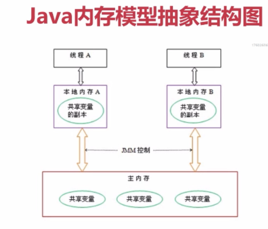
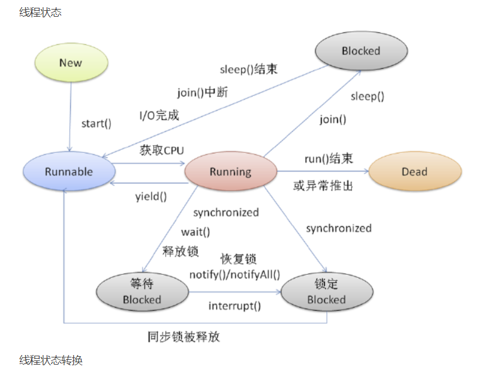

# 线程 #

### Java内存模型 ###

> JMM【Java Memory Model】构成

	1. 堆【heap】：公共对象
	
	2. 栈【stack】：基本类型和对象的引用
	
	3. 方法区：存放静态变量，常量，加载的类信息
		1. 运行时常量池：存放编译期的字面量和字符引用
		
	4. 程序计数器：用于存放下一条指令所在单元的地址的地方

### 线程 ###

- 线程是程序中一个单一的顺序控制流程。
- 进程内一个相对独立的、可调度的执行单元，是系统独立调度和分派CPU的基本单位指运行中的程序的调度单位，包含一个或多个线程。
- 一个线程不能独立的存在，它必须是进程的一部分。
	
> 一个线程的生命周期
		
	1. 新建状态
		使用 new 关键字和 Thread 类或其子类建立一个线程对象后，该线程对象就处于新建状态。
		它保持这个状态直到程序 start() 这个线程。

	2. 就绪状态
		当线程对象调用了start()方法之后，该线程就进入就绪状态。
		就绪状态的线程处于就绪队列中，要等待JVM里线程调度器的调度。

	3. 运行状态
		如果就绪状态的线程获取 CPU 资源，就可以执行 run()，此时线程便处于运行状态。
		处于运行状态的线程最为复杂，它可以变为阻塞状态、就绪状态和死亡状态。

	4. 阻塞状态
		如果一个线程执行了sleep（睡眠）、wait（挂起等待）等方法，失去所占用资源之后，该线程就从运行状态进入阻塞状态。
		在睡眠时间已到或获得设备资源后可以重新进入就绪状态。
		可以分为三种：
			1. 等待阻塞：运行状态中的线程执行 wait() 方法，使线程进入到等待阻塞状态。
			2. 同步阻塞：线程在获取 synchronized 同步锁失败(因为同步锁被其他线程占用)。
			3. 其他阻塞：通过调用线程的 sleep() 或 join() 发出了 I/O 请求时，线程就会进入到阻塞状态。
				当sleep() 状态超时，join() 等待线程终止或超时，或者 I/O 处理完毕，线程重新转入就绪状态。

	5. 死亡状态
		一个运行状态的线程完成任务或者其他终止条件发生时，该线程就切换到终止状态。

> 示意图

	
> 线程的优先级

	每一个 Java 线程都有一个优先级，这样有助于操作系统确定线程的调度顺序。
	Java 线程的优先级是一个整数，其取值范围是 1 （Thread.MIN_PRIORITY ） - 10 （Thread.MAX_PRIORITY ）。
	默认情况下，每一个线程都会分配一个优先级 NORM_PRIORITY（5）。
	具有较高优先级的线程对程序更重要，并且应该在低优先级的线程之前分配处理器资源
	但是，线程优先级不能保证线程执行的顺序，而且非常依赖于平台。
	启动线程的目的就是为了执行它的run()方法，而Thread类中默认的run()方法没有任何可操作代码，故用Thread类创建的的线程不能完成任何任务。为了让创建的线程完成特定的任务，必须重新定义run()方法

> 创建线程的方式

	1、继承 Thread 类

	2、实现 Runnable 接口【 无返回值】

	3、实现 Callable 接口【 有Future 类型的返回值】

> 创建一个线程
	
	通过继承 Thread 类本身；
	单继承，然后重写run() 方法
			
> 例子
				
	//创建新的线程
	//继承Thread类（线程类），并通过Thread子类声明线程对象。
	 public class Test1 extends Thread {
		Test1(){}					//声明Test1构造方法
		/* Test1(String Name){	//声明Test1带参数的构造方法
			super(Name);			//调用父类的构造方法
		}	
		*/
		//重载run方法
		public void run(){
			for(int count=1;count<10;count++){
				for(int i=0;i<count;i++){
					System.out.print('*');
				}
				System.out.println();
			}	
		}
		public static void main(String args[]){
			Test1 t=new Test1();	//创建并初始化Test()类型对象t
			t.start();				//调用start()方法启动一个新的线程，执行自己的run方法。
		}
	}
				
	public class Test extends Thread {
	
		//重载run方法
		public void run(){
			for(int count=1;count<10;count++){
				for(int i=0;i<count;i++){
					System.out.print('*');
				}
				System.out.println();
			}	
		}
		public static void main(String args[]){
		//创建并初始化Test()类型对象t
			Test t1=new Test();		
			Test t2=new Test();
	
			//调用start()方法启动一个新的线程
			t1.start();				
			
			while (t1.isAlive()){
			//通过isAlice不断查询第一个线程的状态，等待第一个线程的终止，然后执行第二个线程
	            try {
	                Thread.sleep(100);
	            } catch (InterruptedException e) {
	                e.printStackTrace();
	            }
	        }
			
	//        try {
	//            t1.join();
	//        } catch (InterruptedException e) {
	//            e.printStackTrace();
	//        }
	
				//执行第二个线程
			t2.start();
		}
	}
		
> 通过实现 Runnable 接口；
			
	多实现，然后实现 run 方法
			
> 例子
				
	public class Test implements Runnable{	//创建一个实现Runnable接口的类Test
		//重载run方法
		public void run(){
			for(int i=1;i<10;i++){
				for(int j=0;j<i;j++){
					System.out.print('*');
				}
				System.out.println();
			}
		}
		public static void main(String args[]){
			Test r=new Test();			//创建并初始化Test对象r
			Thread t=new Thread(r);		//通过Thread创建线程
			//Thread t=new Thread(new Test());
			t.start();
		}
	}
	
	//创建3个新的线程
	public class Test implements Runnable{
		//重载run方法
		public void run(){
			for(int i=1;i<10;i++){
				for(int j=0;j<i;j++){
					System.out.print('*');
				}
				System.out.println();
			}
		}
		public static void main(String args[]){
			Test r1=new Test();		//创建并初始化Test对象r
			Test r2=new Test();
			Test r3=new Test();
			Thread t1=new Thread(r1);		//通过Thread创建线程
			Thread t2=new Thread(r2);
			Thread t3=new Thread(r3);
			t1.start();
			t2.start();
			t3.start();
		}
	}
	
> Thread 类
		
	public class Thread extends Object implements Runnable
		
	构造方法
		Thread() 
		Thread(Runnable target)
		Thread(Runnable target, String name) 
		Thread(String name) 
		分配新的 Thread 对象
		
	方法
		long getId()  返回该线程的标识符

		String getName() 返回该线程的名称。

		int getPriority() 返回线程的优先级

		Thread.State getState() 返回该线程的状态

		ThreadGroup getThreadGroup()  返回该线程所属的线程组。

		void interrupt()  中断线程

		static boolean interrupted()  测试当前线程是否已经中断

		boolean isInterrupted()  测试线程是否已经中断

		boolean isAlive() 测试线程是否处于活动状态

		void join()  等待该线程终止【即优先执行调用了join方法的线程，其他线程进入等待】

		void join(long millis) 等待该线程终止的时间最长为 millis 毫秒

		void setName(String name) 改变线程名称，使之与参数 name 相同

		static void sleep(long millis) 在指定的毫秒数内让当前正在执行的线程休眠（暂停执行）

		void run()  如果该线程是使用独立的 Runnable 运行对象构造的，则调用该 Runnable 对象的 run 方法；否则，该方法不执行任何操作并返回。

		void start()  使该线程开始执行；Java 虚拟机调用该线程的 run 方法。

		String toString()  返回该线程的字符串表示形式，包括线程名称、优先级和线程组

		static void yield()  暂停当前正在执行的线程对象，并执行其他线程。

		boolean isDaemon()	测试该线程是否为守护线程

> 接口 Runnable

	public interface Runnable
	由于只有一个方法，所有需要通过Thread类来包装 Runnable接口的实现类实例

	void run() 
		使用实现接口 Runnable 的对象创建一个线程时，启动该线程将导致在独立执行的线程中调用对象的 run 方法
		通过实例化某个 Thread 实例并将自身作为运行目标，就可以运行实现 Runnable 的类而无需创建 Thread 的子类。
		大多数情况下，如果只想重写 run() 方法，而不重写其他 Thread 方法，那么应使用 Runnable 接口。
	
> 例子--单线程
	
	public class RunnableDemo1 implements Runnable{
	
	    //只需重写run()方法
	    @Override
	    public void run() {
	        for (int i = 0; i < 10; i++) {
	            for (int j = 0; j < i; j++) {
	                System.out.print("#");
	            }
	            System.out.println();
	        }
	    }
	
	    public static void main(String[] args) {
	        //实例化
	        RunnableDemo1 runnableDemo1 = new RunnableDemo1();
	        //使用Thread 来包装 接口实现类的实例化对象
	        Thread thread = new Thread(runnableDemo1);
	        //启动线程
	        thread.start();
	    }
	}
	
> 类 Object
		
	boolean equals(Object obj)  
		 指示其他某个对象是否与此对象“相等”。

	Class<?> getClass() 
		返回此 Object 的运行时类

	int hashCode()  
		返回该对象的哈希码值

	void notify()  
		唤醒在此对象监视器上等待的单个线程

	void notifyAll()  
		唤醒在此对象监视器上等待的所有线程

	void wait()  
		在其他线程调用此对象的 notify() 方法或 notifyAll() 方法前，导致当前线程等待。

	void wait(long timeout)  
		在其他线程调用此对象的 notify() 方法或 notifyAll() 方法，或者超过指定的时间量前，导致当前线程等待
	
	String toString()  
		返回该对象的字符串表示

> wait()、sleep()、join() 
		
	1. 线程自动调用 wait()【挂起等待】方法，进入阻塞状态，等待某种条件的发生。wait()方法会释放对象的“锁标志”
		当其他线程调用notify()/notifyall()后，处于等待状态的线程获得锁之后才会被唤醒
		
	2. sleep()需要指定时间，线程调用sleep()方法进入阻塞状态，在一定时间后会进入就绪状态。
		但是sleep()方法不会释放“锁标志”，也就是说如果有synchronized同步块，其他线程仍然不能访问共享数据。 
		
	3. join()方法会使当前线程等待另一个调用 join() 方法的线程结束后才能继续执行
	等待/通知机制（wait/notify），等待通知使用wait()方法，通知消费生产使用notify()或者notifyall()方法。
	
> sleep方法和wait方法有什么区别

	1、sleep()方法是属于Thread类中的。而wait()方法，则是属于Object类中的。

	2、最主要是sleep方法没有释放锁，而wait方法释放了锁。

	3、wait，notify和notifyAll只能在同步控制方法或者同步控制块里面使用，而sleep可以在任何地方使用。

	4、sleep必须捕获异常，而wait，notify和notifyAll不需要捕获异常。

	 sleep指线程被调用时，占着CPU不工作，形象地说明为“占着CPU睡觉”，此时，系统的CPU部分资源被占用，其他线程无法进入，会增加时间限制。wait指线程处于进入等待状态，形象地说明为“等待使用CPU”，此时线程不占用任何资源，不增加时间限制。

> 线程之间的通信

	共享内存【隐式通信】

	消息传递【显式通信】，wait/notify/notifyAll 

> start()方法 和 run()方法的区别

	只有调用了start()方法，才会表现出多线程的特性，不同线程的run()方法里面的代码交替执行。
	如果只是调用run()方法，那么代码还是同步执行的，必须等待一个线程的run()方法里面的代码全部执行完毕之后，另外一个线程才可以执行其run()方法里面的代码。

	通过调用Thread类的start()方法来启动一个线程， 这时此线程是处于就绪状态， 并没有运行。 
	通过此Thread类调用方法run()来完成其运行操作的， 这里方法run()称为线程体，它包含了要执行的这个线程的内容，run方法运行结束， 此线程终止。然后CPU再调度其它线程。

	run()方法当作普通方法的方式调用。程序还是要顺序执行，要等待run方法体执行完毕后，才可继续执行下面的代码； 
	程序中只有主线程这一个线程， 其程序执行路径还是只有一条， 这样就没有达到写线程的目的。

	记住：多线程就是分时利用CPU，宏观上让所有线程一起执行 ，也叫并发。

> Java中如何获取到线程dump文件

	死循环、死锁、阻塞、页面打开慢等问题，打线程dump是最好的解决问题的途径。
	Thread类提供了一个getStackTrace()方法也可以用于获取线程堆栈。

> 所谓线程dump也就是线程堆栈，获取到线程堆栈有两步：

	1、获取到线程的pid，可以通过使用jps命令，在Linux环境下还可以使用ps -ef | grep java

	2、打印线程堆栈，可以通过使用jstack pid命令，在Linux环境下还可以使用kill -3 pid

### 多线程 ###
		
> 并行与并发

	并行：多个CPU同时运行多个线程。
	并发：单个CPU中的同一时间段内交替运行了多个线程，线程交替使用CPU时间片段。
	高并发：能够同时并行处理多个请求的过程。
		
> 并发编程中的三个概念:
		
	1. 原子性
		即一个操作或者多个操作 要么全部执行并且执行的过程不会被任何因素打断，要么就都不执行。
		对基本数据类型的变量的读取和赋值操作是原子性操作。

		实现方式：
			1. 使用 Atomic包【CAS算法在Java中的应用】的类，利用指针类 Unsafe.compareAndSwapXxx，使代码具有原子性。
				1. CAS有3个操作数，内存值V，旧的预期值A，要修改的新值B。
				2. 当且仅当预期值A和内存值V相同时，将内存值V修改为B，否则什么都不做。
			2. synchronized
			3. Lock

		对比：
			1. Atomic：竞争激烈时能维持常态，比lock性能好，但只能同步一个值；
			2. Lock：可中断锁，多样化同步，竞争激烈时能维持常态；
			3. synchronized：不可中断锁，适合竞争不激烈，可读性好。

	2. 可见性
		指当多个线程访问同一个变量时，一个线程修改了这个变量的值，其他线程能够立即看得到修改的值。
		
		volatile 关键字可保证可见性。
			通过内存屏障和禁止重排序保证可见性。

		通过 synchronized 和 Lock 也能够保证可见性。
			1. 线程解锁前，必须把共享变量的最新值刷新到主内存；
			2. 线程加锁时，清空工作内存中共享变量值，使用共享变量值时需要从主内存中重新读取最新的值。

	3. 有序性
		即程序执行的顺序按照代码的先后顺序执行。
		在Java内存模型中，允许编译器和处理器对指令进行重排序，但是重排序过程不会影响到单线程程序的执行，却会影响到多线程并发执行的正确性。

		synchronized 和 Lock 保证每个时刻是有一个线程执行同步代码，相当于是让线程顺序执行同步代码，自然就保证了有序性。
	
		happen-before 原则
			程序次序规则：一个线程内，安装代码顺序，书写在前面的操作先行发生于书写在后面的操作。
			volatile变量规则：对一个变量的写操作先行发生于后面对这个变量的读操作。
			锁定规则：一个 unlock 操作先行发生于后面对同一个锁的 lock 操作。
			传递规则：如果操作A先行发生于操作B，而操作B又先行发生于操作C，则可以得出操作A先行发生于操作C。
			线程启动规则：
			线程中断规则：
			线程终止规则：
			对象终止规则：

		如果不满足 happen-before原则，jvm可以对其进行重排序。

> volatile 关键字

	作用：
		1. 禁止指令重排序；
		2. 变量可见性；

	使用 volatile 关键字修饰的变量，保证了其在多线程之间的可见性，即每次读取到 volatile 变量，一定是最新的数据。
	原理：volatile 变量每次修改后都会自动 保存并刷新 到主内存中；
	它会强制共享变量修改的值会立即被更新到主内存，当有其他线程需要读取时，会去主内存中读取新值。
	
	现实中，为了获取更好的性能JVM可能会对指令进行重排序，多线程下可能会出现一些意想不到的问题。使用volatile则会对禁止语义重排序，当然这也一定程度上降低了代码执行效率。

	应用场景：
		1. 状态标识量【保证线程间的变量可见性】；
		2. 双重检测【禁止重排序避免线程不安全】；

> 多线程的作用

	1. 发挥多核CPU的优势
	2. 防止阻塞

> 多线程的风险

	1. 死锁；
	2. 上下文切换；
	3. 线程安全问题。

> 死锁必要条件

	1. 互斥条件；
	2. 请求和保持条件；
	3. 不剥夺条件；
	4. 环路等待条件。需要获取多个锁。

	线程A 获得了锁A，正在请求锁B，而线程B 获得了锁B，正在请求锁A。
	这样就形成 环路等待条件，造成死锁。
	
> 什么是线程安全

	当多个线程访问某个对象时，不管运行时环境采用何种调度方式或者交替运行，并且不需要任何额外的同步或协同，都可以获得正确的结果，则这个对象就是线程安全的。

> 线程同步

	线程同步机制让多个线程有序的访问共享资源，而不是同时操作共享资源，以实现共享数据的一致性。
	非线程安全是指多线程操作同一个对象可能会出现问题。而线程安全则是多线程操作同一个对象不会有问题。
	每个线程进入共享代码之前获得锁，否则不能进入共享代码区【共享空间】，并在退出共享代码之前释放锁，解决了多个代码竞争共享代码的情况，达到线程同步的目的。

> 多线程特点

	指的是这个程序（一个进程）同时运行多个线程完成不同的工作，充分利用CPU。
	多线程可以使得一个程序可同时执行多个任务。线程是相互独立的。
	多线程中，每个线程都通过代码实现线程的行为，并将数据提供给代码操作。
	避免出现cpu赛跑的现象，即等待线程终止才运行下一个线程：isAlive() ,join()
			
	public class Test extends Thread {

		//重载run方法
		public void run(){
			for(int count=1;count<10;count++){
				for(int i=0;i<count;i++){
					System.out.print('*');
				}
				System.out.println();
			}	
		}
		public static void main(String args[]){
		//创建并初始化Test()类型对象t
			Test t1=new Test();		
			Test t2=new Test();
	
			//调用start()方法启动一个新的线程
			t1.start();				
			
			while (t1.isAlive()){
			//通过isAlice不断查询第一个线程的状态，等待第一个线程的终止，然后执行第二个线程
	            try {
	                Thread.sleep(100);
	            } catch (InterruptedException e) {
	                e.printStackTrace();
	            }
	        }
			
	//        try {
	//            t1.join();
	//        } catch (InterruptedException e) {
	//            e.printStackTrace();
	//        }
	
				//执行第二个线程
			t2.start();
		}
	}

> 线程安全也是有几个级别的：  
> 1、不可变对象

	1. 对象创建后其状态就不可改变；
	2. 对象所有域都是 final 类型；
	3. 对象是正确创建的【创建期间，this引用没有逸出】
	比如：String、Integer、Long这些，都是final类型的类。
	任何一个线程都改变不了它们的值，要改变除非新创建一个，因此这些不可变对象不需要任何同步手段就可以直接在多线程环境下使用。

	final 关键字: 类，方法，变量
		1. 修饰类：不能被继承；
		2. 修饰方法：锁定方法不被继承类修改；
		3. 修饰变量：基本数据类型变量，引用类型变量

> 2、绝对线程安全

	不管运行时环境如何，调用者都不需要额外的同步措施。
	要做到这一点通常需要付出许多额外的代价，Java中标注自己是线程安全的类，实际上绝大多数都不是线程安全的。
	不过绝对线程安全的类，Java中也有【并发容器】CopyOnWriteArrayList、CopyOnWriteArraySet。

> 3、相对线程安全

	相对线程安全也就是我们通常意义上所说的线程安全，像Vector这种，add、remove方法都是原子操作，不会被打断，但也仅限于此。
	如果有个线程在遍历某个Vector、有个线程同时在add这个Vector，99%的情况下都会出现ConcurrentModificationException，也就是fail-fast机制。
	vector、Stack、HashTable、ConcurrentHashMap、StringBuffer、DateTimeFormatter
	Collections.SynchronizedXxx(List/Map/Set)	//将集合类转为同步的类

> 4、线程非安全

	比如 ArrayList、LinkedList、HashMap、HashSet、StringBuilder、SimpleDateFormat 等都是线程非安全的类。

	特点1：先检查再执行【非原子性】

> 线程封闭

	1. 堆栈封闭：
		声明局部变量，无并发问题。

	2. ThreadLocal：
		空间换时间，给每个线程创建一个共享对象的副本。

		private final static ThreadLocal<Long> threadLocal = new ThreadLocal<>();

		//使用 ThreadLocalMap存放线程和该线程下的共享对象值副本
		Thread t = Thread.currentThread();
        ThreadLocalMap map = getMap(t);		
		
### J.U.C ###

	同步操作

	1. aotmic		【AtomicInterget/AtomicLong/...】
	2. collections 	【Collections.SynchronizedXxx(List/Map/Set) 同步集合】
	3. locks		【锁】
	4. tools 		【同步工具】
	5. executor 	【线程池】

### 锁机制 ###

> AbstractQueuedSynchronizer 【AQS】

	双向 Node 链表数据结构 【Sync queue 】
	使用 Node 实现 FIFO 队列【Sync queue、Condition queue】
	利用了一个 int类型表示锁的状态 -- volatile int state
	子类通过继承并实现它的方法管理其状态 -- acquire(i)/release(i)/tryAcquire() ...
	可以同时实现排它锁和共享锁
			
> synchronized 【内置锁】

	实现方法：在共享代码之前加入synchronized 关键字，该方法即为同步方法。
	每个具有同步代码的对象都有唯一的一把锁。
	同步方法
		synchronized 方法声明{
		//需要进行同步的方法
		}

	当多个线程访问对象时，只有取得锁的线程才可以进入同步方法，其他访问共享对象的线程则在对象外等待。
					
> 例子	
	
	/**
	 * 同步方法
	 * 需要同步的资源
	 */
	public class Source {
	
	    synchronized void method1(){
	        System.out.println("进入method1方法，获得锁");
	        try {
	            Thread.sleep(100);
	        } catch (InterruptedException e) {
	            e.printStackTrace();
	        }
	        System.out.println("执行method1完毕，释放锁");
	    }
	    synchronized void method2(){
	        System.out.println("进入method2方法，获得锁");
	        try {
	            Thread.sleep(100);
	        } catch (InterruptedException e) {
	            e.printStackTrace();
	        }
	        System.out.println("执行method2完毕，释放锁");
	    }
	}

	
	/**
	 * 执行多线程同步
	 */
	public class ThreadDemo2 extends Thread{
	    private String name;
	    private Source source;
	
	    ThreadDemo2(String name,Source source){
	        this.name = name;
	        this.source = source;
	    }
	
	    @Override
	    public void run() {
	        if (name.equals("method1")){
	            source.method1();
	        }else if (name.equals("method2")){
	            source.method2();
	        }
	    }
	
	    public static void main(String[] args) {
	        Source source = new Source();
	        ThreadDemo2 threadDemo2 = new ThreadDemo2("method1",source);
	        ThreadDemo2 threadDemo21 = new ThreadDemo2("method2",source);
	        threadDemo2.start();
	        threadDemo21.start();
	    }
	}

						
	只有method1/method2线程执行完毕后释放锁了，method2/method1线程才可以执行同步方法。
	锁是所属对象source的锁，source下的同步方法都不能被获得锁以外的线程访问。

				
> 同步块
					
	public void method(){
		Object obj=new Object();	//资源对象
		public void test(){
		synchronized(obj){		//同步块
			//需要进行同步的方法
			}
	  	}
	}
					
	synchronized获得的是参数中的对象锁，必须获得obj这个对象的锁才能执行同步块，否则只能等待获得锁。
			
> lock 【显式锁】
				
	Lock是一个接口，定义了一些抽象的所操作。
	与内部锁机制不同，Lock提供了无条件，可轮询，定时的，可中断的锁获取操作，所有加锁和解锁的方法都是显式的。
	锁必须在finally块中释放。
				
	Lock接口源码
	public interface Lock {
	    //加锁    
	    void lock();
	
	    //可中断的锁，打算线程的等待状态，即A线程已经获取该锁，B线程又来获取，但是A线程会通知B，来打算B线程的等待。   void lockInterruptibly() throws InterruptedException;  
	
	    //尝试去获取锁，失败返回False    
	    boolean tryLock();
	
	    //超时机制获取锁    
	    boolean tryLock(long time, TimeUnit unit) throws InterruptedException;
	
	    //释放锁    
	    void unlock();
	
	    Condition newCondition();
	
	}
				
> ReentranLock 【可重入锁】
					
	ReentranLock实现了Lock接口，提供了与synchronized相同的互斥和内存可见性的保证。
	获得ReentrantLock的锁与进入synchronized块有着相同内存含义，释放ReentrantLock锁与退出synchronized块有着相同内存含义。
	
	默认是非公平锁，也可以指定为公平锁。
	public ReentrantLock(boolean fair) {
        sync = fair ? new FairSync() : new NonfairSync();
    }

	提供了一个 Condition 类，可以分组唤醒需要唤醒的线程。
	能够提供中断等待锁的线程的机制， lock.lockInterruptibly()
	利用CAS 实现锁

	【注】
	内部有个继承 AbstractQueuedSynchronizer 的静态抽象类 Sync
	Condition 类 通过 sync.newCondition() 提供。
	ReentranLock 底层 都是通过 Sync 来完成。

	public Condition newCondition() {
        return sync.newCondition();
    }

	public boolean tryLock() {
        return sync.nonfairTryAcquire(1);
    }
	public void lock() {
        sync.lock();
    }
	public void unlock() {
        sync.release(1);
    }

> ReentranLock 和 synchronized 的区别

	synchronized 可以完成的 ReentranLock 都能完成，反之不成立。

	锁的实现
		1. synchronized 是通过 jvm 实现的，由编译器来控制，隐式锁【锁的开启和释放由编译器控制】
		2. ReentranLock 是通过 jdk 实现的，可由开发者控制，显式锁【故需要记得释放锁】

	线程的唤醒
		1. synchronized 只能通过 notify()/notifyAll() 随机唤醒一个或者唤醒全部线程；
		2. ReentranLock 可以通过 Condition 类选择性的唤醒线程。

	锁的中断
		1. synchronized 不可以中断等待锁的线程
		2. ReentranLock 可以中断等待锁的线程

	synchronized 	隐式锁，可重入锁，锁的是对象
	lock			显式锁
	reentranlock 	显式锁，可重入锁

	可重入锁中包含有一个锁计数器，加锁一次，计数器就会加一，只有当计数器为0时才会真正的释放锁，可重入锁针对的递归特性或者锁中有锁的特性。	

	显式锁的加锁和释放锁都需要显式的指定，释放锁最好放在 finally中。
	隐式锁的加锁和释放锁由 JVM 操作，无需手动操作。
		 
		
> ReadWriteLock 【读写锁】

	暴露了2个Lock对象，一个用来读，另一个用来写。
	读取ReadWriteLock锁守护的数据，你必须首先获得读取的锁，当需要修改ReadWriteLock守护的数据，你必须首先获得写入锁。
					
	public interface ReadWriteLock {

	    Lock readLock();
	
	    Lock writeLock();
	}

				
> ReentrantReadWriteLock 【可重入读写锁】
					
	它是继承了ReadWriteLock，扩展了ReadWriteLock。
	
	写锁是悲观锁，只要有读操作就没法写入。

> Runnable接口 和 Callable接口的区别

	Runnable接口中的 run() 方法的返回值是void，它做的事情只是纯粹地去执行run()方法中的代码而已；

	Callable接口中的 call() 方法是有返回值的，是一个泛型，和Future、FutureTask【间接继承Future】配合可以用来获取异步执行的结果。

	加入线程池运行，Runnable使用ExecutorService的execute方法，Callable使用submit方法。
	线程池的execute 只接收Runnable接口参数，所以没有返回值；
	submit 接收 Callable接口的参数，有返回值。

		<T> Future<T> submit(Callable<T> task);
		<T> Future<T> submit(Runnable task, T result);
		Future<?> submit(Runnable task);

	多线程充满着未知性，某条线程是否执行了？某条线程执行了多久？某条线程执行的时候我们期望的数据是否已经赋值完毕？无法得知，我们能做的只是等待这条多线程的任务执行完毕而已。
	而 Callable+Future/FutureTask 却可以获取多线程运行的结果，可以在等待时间太长没获取到需要的数据的情况下取消该线程的任务，真的是非常有用。

> Future 接口

    Future就是对于具体的Runnable或者Callable任务的执行结果进行取消、查询是否完成、获取结果。
	必要时可以通过get方法获取执行结果，该方法会阻塞直到任务返回结果。

    Future<V>接口是用来获取异步计算结果的，即对具体的Runnable或者Callable对象任务执行的结果进行获取(get())，取消(cancel())，判断是否完成等操作。

	public interface Future<V> {
	    boolean cancel(boolean mayInterruptIfRunning);
	    boolean isCancelled();
	    boolean isDone();
	    V get() throws InterruptedException, ExecutionException;
	    V get(long timeout, TimeUnit unit)
	        throws InterruptedException, ExecutionException, TimeoutException;
	}

	Future提供了三种功能：

		1. 判断任务是否完成/取消；isDone()、isCancelled()
		
		2. 能够中断任务；cancel()
		
		3. 能够获取任务执行结果。get()

	因为Future只是一个接口，所以是无法直接用来创建对象使用的，因此就有了下面的 FutureTask。

> FutureTask

	public class FutureTask<V> implements RunnableFuture<V>

	public interface RunnableFuture<V> extends Runnable, Future<V> {
	    void run();
	}

	FutureTask 间接继承了 Runnable、Future 接口,它既可以作为Runnable被线程执行，又可以作为Future得到Callable的返回值。

	构造函数
		public FutureTask(Callable<V> callable) { ... }
		public FutureTask(Runnable runnable, V result) { ... }		

	FutureTask 方法执行状态：
		1. get()方法
			1. 当FutureTask处于未启动或已启动状态时，如果此时我们执行FutureTask.get()方法将导致调用线程阻塞；
			2. 当FutureTask处于已完成状态时，执行FutureTask.get()方法将导致调用线程立即返回结果或者抛出异常。

		2. cancel()方法
			1. 当FutureTask处于未启动状态时，执行FutureTask.cancel()方法将导致此任务永远不会执行。
			2. 当FutureTask处于已启动状态时，执行cancel(true)方法将以中断执行此任务线程的方式来试图停止任务。
				1. 如果任务取消成功，cancel(...)返回true；
				2. 但如果执行cancel(false)方法将不会对正在执行的任务线程产生影响(让线程正常执行到完成)，此时cancel(...)返回false。
			3. 当任务已经完成，执行cancel(...)方法将返回false。

### 同步工具 ###

> 1、CountDownLatch   

	CountDownLatch 是一个同步辅助类，通过它可以完成类似于阻塞当前线程的功能，即：让一个线程或多个线程一直等待，直到其他线程执行的操作完成。
	CountDownLatch 用一个给定的计数器来初始化，该计数器的操作是原子操作，即同时只能有一个线程去操作该计数器。
	调用该类 await 方法的线程会一直处于阻塞状态，直到其他线程调用 countDown 方法使当前计数器的值变为零，每次调用 countDown 计数器的值减1。
	当计数器值减至零时，所有因调用await()方法而处于等待状态的线程就会继续往下执行。
	这种现象只会出现一次，因为计数器不能被重置，即CountDownLatch不可重用。

	await() 也可以指定等待时间，超时后就不再等待，直接运行await()后面的操作，此时阻塞的线程依旧在进行处理。

	【注】
	内部有个继承 AbstractQueuedSynchronizer 的静态抽象类 Sync
	CountDownLatch 的底层都是由 Sync 来完成。
	线程的个数 getCount()，线程的等待await()，线程释放countDown() 等都是通过 Sync 来完成。

> 使用场景

	在某些业务场景中，程序执行需要等待某个条件完成后才能继续执行后续的操作；
	典型的应用如并行计算，当某个处理的运算量很大时，可以将该运算任务拆分成多个子任务，等待所有的子任务都完成之后，父任务再拿到所有子任务的运算结果进行汇总。

	public void redisCachePool() throws InterruptedException {
        final int NUM = 10;
        final ThreadPoolExecutor threadPoolExecutor = new ThreadPoolExecutor(NUM, NUM + 2, 60, TimeUnit.SECONDS, new LinkedBlockingDeque<Runnable>());

        //发令枪
        final CountDownLatch start = new CountDownLatch(1);
        //NUM 个线程
        final CountDownLatch end = new CountDownLatch(NUM);

        //模拟NUM 个线程
        for (int i = 0; i <NUM; i++) {
            threadPoolExecutor.execute(new Runnable() {
                @Override
                public void run() {
                    try {
                        //模拟NUM 个线程并发
                        start.await();
                        query();  
                    } catch (InterruptedException e) {
                        e.printStackTrace();
                    }
                    //NUM 个线程减一
                    end.countDown();
                }
            });
        }

        start.countDown();
        end.await();
        System.out.println("主线程"+Thread.currentThread().getName()+"工作");
        threadPoolExecutor.shutdown();
    }

    public void query(){
        String key = "name";
        Random random = new Random();
        int time = random.nextInt(30);
        String username = (String) redisTemplate.opsForValue().get(key);
        if (username != null){
            logger.info("{}",username);
        }else{
            /*
            二次缓存
             */
            synchronized (this){
                username = (String) redisTemplate.opsForValue().get(key);
                if (username != null){
                    logger.info("{}",username);
                }else{
                    redisTemplate.opsForValue().set(key,"alex",time, TimeUnit.SECONDS);
                }
            }
        }
    }

> 2、CycliBarrier 【内存栅栏】

	CyclicBarrier也是一个同步辅助类，它允许一组线程相互等待，直到到达某个公共屏障点（common barrier point）。
	通过它可以完成多个线程之间相互等待，只有当每个线程都准备就绪后，才能各自继续往下执行后面的操作。
	类似于CountDownLatch，它也是通过计数器来实现的。
	当某个线程调用await方法时，该线程进入等待状态，且计数器加1，当计数器的值达到设置的初始值时，所有因调用await进入等待状态的线程被唤醒，继续执行后续操作。
	因为CycliBarrier在释放等待线程后可以重用，所以称为 循环barrier。
	CycliBarrier 支持一个可选的Runnable，在计数器的值到达设定值后（但在释放所有线程之前），该Runnable运行一次。
	【注】Runnable在每个屏障点只运行一个。
	
> 使用场景

	比如去聚餐，每个人相当于一个线程，先到的人等后到的人，只有都到齐了才开始吃饭，吃饭前可以玩个游戏什么的。即所有的线程相互等待，当所有线程都就绪后才可以执行await 后面的代码。

> 3、Semaphore 【信号量】

	Semaphore就是一个信号量，它的作用是限制某段代码块的并发数。
	Semaphore有一个构造函数，可以传入一个int型整数n，表示某段代码最多只有n个线程可以访问，如果超出了n，那么请等待，等到某个线程执行完毕这段代码块，下一个线程再进入。
	由此可以看出如果Semaphore构造函数中传入的int型整数n=1，相当于变成了一个synchronized了。

	Semaphore 实例化时默认是非公平锁，也可以设置为公平锁
	sync = new NonfairSync(permits); 

	//实例化对象，permits初始信号量大小
	final Semaphore semaphore = new Semaphore(permits);

	方法：
		semaphore.tryAcquire();	//尝试获取许可，可以设置个数、超时时间
		semaphore.acquire();	//获取一个许可，可以设置获取个数
		semaphore.release();	//释放一个许可，可以设置释放个数

	【注】
	内部有个继承 AbstractQueuedSynchronizer 的静态抽象类 Sync
	Semaphore 的底层都是由 Sync 来完成。

> 使用场景

	买票窗口
	permits即窗口数量，当窗口满的时候就不能 acquire()来处理，只能等 release()释放窗口才可以继续处理。

> BlockingQueue 阻塞队列

	队列满时，入队列将会阻塞；put()
	队列空时，出队列将会阻塞。	take()

	不接受 null 元素，试图 add、put 或 offer 一个 null 元素时，某些实现会抛出 NullPointerException。

	可以是限定容量的。没有任何内部容量约束的 BlockingQueue 总是报告Integer.MAX_VALUE 的剩余容量。
	
	实现主要用于生产者-使用者队列，但它另外还支持 Collection 接口。
	
	实现是线程安全的。所有排队方法都可以使用内部锁或其他形式的并发控制来自动达到它们的目的。

> BlockingQueue 具有 4 组不同的方法用于插入、移除以及对队列中的元素进行检查。

|方法 |抛出异常   |特殊值    |阻塞    |超时|
|:-- |:--|:--|:--|
|插入| add(e)   | offer(e)|	put(e) | offer(e, time, unit)|
|移除| remove() | poll()  |	take() | poll(time, unit)|
|检查| element()| peek()  |	不可用 |	不可用|

> 四组不同的行为方式解释:

	1. 异常
	
		如果试图的操作无法立即执行，抛一个异常。
	
	2. 特定值 
	
		如果试图的操作无法立即执行，返回一个特定的值(常常是 true / false)。
	
	3. 阻塞 
	
		如果试图的操作无法立即执行，该方法调用将会发生阻塞，直到能够执行。
	
	4. 超时 
	
		如果试图的操作无法立即执行，该方法调用将会发生阻塞，直到能够执行，但等待时间不会超过给定值。
		返回一个特定值以告知该操作是否成功(典型的是 true / false)。

> 几种常见的 BlockingQueue：

	SynchronousQueue【直接提交队列】：
		没有容量，所以提交的任务不能保存，总是将任务交给空闲线程。
		如果没有空闲线程，就创建线程，一旦达到 maximumPoolSize 就执行拒绝策略。
	
	ArrayBlockingQueue【有界任务队列】：
		当线程池的数量小于 corePoolSize 时，当有新的任务时，创建线程；
		达到 corePoolSize 后，则将任务存到 ArrayBlockingQueue中，直到线程数超过 maximumPoolSize 。
		ArrayBlockingQueue满时，则会使用拒绝策略 RejectedExecutionHandler 处理满了的任务，默认是AbortPolicy。
	
	LinkedBlockingQueue【无界任务队列】：
		除非系统资源耗尽，否则不存在任务队列入队失败的情况。
		继续添加任务到阻塞队列中等待执行，因为LinkedBlockingQueue可以近乎认为是一个无穷大的队列，可以无限存放任务；
		
	PriorityBlockingQueue【优先任务队列】：
		带有优先级的队列，特殊的无界队列,理论上来说不是先入先出的，是根据任务的优先级来确定执行顺序
	
	DelayQueue【延迟队列】：
		执行定时任务，将任务按延迟时间长短放入队列中，延迟时间最短的最先被执行，存放在队列头部的是延迟期满后保存时间最长的任务

### 线程池 ###

> 好处

	1. 重用存在的线程，减少对象的创建、销毁的开销，性能好；
	2. 可有效控制最大并发线程数，提高系统资源利用率，同时可避免过多资源竞争，避免阻塞；
	3. 提供定时执行、定期执行、单线程、并发数控制等功能

> ThreadPoolExecutor

	1. corePoolSize：	核心线程数量
	2. maximumPoolSize：	线程池最大线程数
	3. workQueue：		阻塞任务队列，存放等待执行的任务
		1. ArrayBlockingQueue;
		2. LinkedBlockingQueue;
		3. SynchronousQueue;
		
	4. keepAliveTime：	线程没有任务执行是最多保持多久时间终止
	5. unit:			keepAliveTime的时间单位
	6. threadFactory:	线程工厂，用来创建线程，默认 DefaultThreadFactory
	7. rejectHandler:	当拒绝处理任务时的策略，默认 AbortPolicy
		1. AbortPolicy:			丢弃任务，并抛出RejectedExecutionException异常。 
		2. DiscardPolicy：		丢弃任务，但是不抛出异常。 
		3. DiscardOldestPolicy：丢弃队列中最老的任务，然后重新尝试执行任务（重复此过程）
		4. CallerRunsPolicy：	由调用线程处理该任务 

> ThreadPoolExecutor【继承自 AbstractExecutorService 】 4个构建函数 

	public ThreadPoolExecutor(int corePoolSize,
                              int maximumPoolSize,
                              long keepAliveTime,
                              TimeUnit unit,
                              BlockingQueue<Runnable> workQueue) {
        this(corePoolSize, maximumPoolSize, keepAliveTime, unit, workQueue,
             Executors.defaultThreadFactory(), defaultHandler);
    }

	public ThreadPoolExecutor(int corePoolSize,
                              int maximumPoolSize,
                              long keepAliveTime,
                              TimeUnit unit,
                              BlockingQueue<Runnable> workQueue,
                              ThreadFactory threadFactory) {
        this(corePoolSize, maximumPoolSize, keepAliveTime, unit, workQueue,
             threadFactory, defaultHandler);
    }

	public ThreadPoolExecutor(int corePoolSize,
                              int maximumPoolSize,
                              long keepAliveTime,
                              TimeUnit unit,
                              BlockingQueue<Runnable> workQueue,
                              RejectedExecutionHandler handler) {
        this(corePoolSize, maximumPoolSize, keepAliveTime, unit, workQueue,
             Executors.defaultThreadFactory(), handler);
    }

	public ThreadPoolExecutor(int corePoolSize,
                              int maximumPoolSize,
                              long keepAliveTime,
                              TimeUnit unit,
                              BlockingQueue<Runnable> workQueue,
                              ThreadFactory threadFactory,
                              RejectedExecutionHandler handler){ ... }

> ThreadPoolExecutor 方法

	execute()		提交任务，交给线程池执行
	submit()		提交任务，能够返回执行结果 execute + Future
	shutdown()		等待任务都执行完毕后关闭线程池
	shutdownNow()	直接关闭线程池，不等待任务都执行完毕

	getQueue() 				获取当前的任务队列
	getPoolSize() 			线程池当前的线程数量
	getTaskCount()			线程池已执行和未执行的任务总数
	getActiveCount()		当前线程池中正在执行任务的线程数
	getCompletedTaskCount()	已完成的任务数量

> 使用Executors类中提供的静态方法来创建线程池：

	Executors.newCachedThreadPool();        //创建一个线程池，线程池容量大小为Integer.MAX_VALUE
	Executors.newSingleThreadExecutor();   	//创建容量为1的线程池
	Executors.newFixedThreadPool(int);    	//创建固定容量大小的线程池
	Executors.newScheduledThreadPool(int)	//创建定时任务的线程池

> 配置线程池大小

	如果是CPU密集型任务，就需要尽量压榨CPU，参考值可以设为 NCPU+1

	如果是IO密集型任务，参考值可以设置为2*NCPU

	当然，这只是一个参考值，具体的设置还需要根据实际情况进行调整，比如可以先将线程池大小设置为参考值，再观察任务运行情况和系统负载、资源利用率来进行适当调整。

> 多线程并发实践

	1. 使用本地变量
	2. 使用不可变类
	3. 最小化锁的作用域
	4. 使用线程池的 Executor ，而不是直接 new Thread()执行
	5. 宁可使用同步也不要使用线程的 wait()/notify()，优先使用同步工具【CountDownLatch...】
	6. 使用 BlockingQueue 实现生产-消费模式
	7. 使用并发集合【hashTable/ConcurrentHashMap】而不是加了锁的同步集合【Collections.SynchronizedXxx(List/Map/Set)】
	8. 使用 Semaphore 创建有界的访问
	9. 宁可使用同步代码块，也不要使用同步的方法
	10. 避免使用静态变量

### 分布式锁 ###

> 在分布式锁服务中，有一种最典型应用场景，就是通过对集群进行Master选举，来解决分布式系统中的单点故障。  
> 分布式系统中的单点故障：通常分布式系统采用主从模式，就是一个主控机连接多个处理节点。  
> 主节点负责分发任务，从节点负责处理任务，当我们的主节点发生故障时，那么整个系统就都瘫痪了，那么我们把这种故障叫作单点故障。

> mysql 加解锁：  
> 加锁

	利用mysql的行级锁或者是唯一索引锁
	mysql 的悲观锁

> 解锁

	删除锁的记录

> redis 加解锁操作：  

	通过以下原子性操作来完成
		setnx
		getset	
		del
		expire

	SETNX key value
		将 key 的值设为 value ，当且仅当 key 不存在。
		若给定的 key 已经存在，则 SETNX 不做任何动作。
		设置成功，返回 1 ，获取锁成功。
		设置失败，返回 0 ，获取锁失败。

	GETSET key value

		将给定 key 的值设为 value ，并返回 key 的旧值。
		当 key 没有旧值时，即 key 不存在时，返回 nil 。

		通过旧值判断是否可以获得锁，没有旧值即可获得锁。

	SET key value NX PX 3000

	redis2.6 为SET命令增加了一系列选项:

		EX seconds-- 设置键key的过期时间，单位时秒
		PX milliseconds -- 设置键key的过期时间，单位时毫秒
		NX -- 只有键key不存在的时候才会设置key的值
		XX --只有键key存在的时候才会设置key的值
	
	【注意】 
	由于SET命令加上选项已经可以完全取代 SETNX, SETEX, PSETEX 的功能，所以在将来的版本中，redis可能会不推荐使用并且最终抛弃这几个命令。

> 加锁

	通过setnx 向特定的key 写入一个随机值，并同时设置失效时间，写值成功即加锁成功。
	 
		
	Long setnxResult = jedis.setnx(lock_key,timeout);
    if(setnxResult != null && setnxResult.intValue() == 1){
        //如果返回值是1，代表设置成功，获取锁
        // TODO
    }else{
        log.info("没有获得分布式锁");
    }
	

	【注意】
	1. 必须给锁设置一个失效时间 -- 避免死锁；
	2. 加锁时，每个节点产生一个随机字符串 -- 避免锁误删；
	3. 写入随机值和设置失效时间必须是同时的 -- 保证加锁是原子性的。

	
> 解锁 expire del

	匹配随机值，删除redis上的特定key值：
		1、要保证获取到数据；
		2、判断数据的一致性【每个节点都有自己的随机值】；
		3、删除数据或者设置短暂有效期。
	这3个操作要保证是原子性的，即保证解锁也是原子性的。

> 例子-- 可以防止死锁

	public void orderTask(){
		long lockTimeout = Long.parseLong(PropertiesUtil.getProperty("lock.timeout","5000"));
	        Long setnxResult = RedisShardedPoolUtil.setnx(Const.REDIS_LOCK.CLOSE_ORDER_TASK_LOCK,String.valueOf(System.currentTimeMillis()+lockTimeout));
	        if(setnxResult != null && setnxResult.intValue() == 1){
	            closeOrder(Const.REDIS_LOCK.CLOSE_ORDER_TASK_LOCK);
	        }else{

	            //未获取到锁，继续判断，判断时间戳，看是否可以重置并获取到锁
	            String lockValueStr = RedisShardedPoolUtil.get(Const.REDIS_LOCK.CLOSE_ORDER_TASK_LOCK);
	            if(lockValueStr != null && System.currentTimeMillis() > Long.parseLong(lockValueStr)){
	                String getSetResult = RedisShardedPoolUtil.getSet(Const.REDIS_LOCK.CLOSE_ORDER_TASK_LOCK,String.valueOf(System.currentTimeMillis()+lockTimeout));

	                //再次用当前时间戳getset。
	                //返回给定的key的旧值，->旧值判断，是否可以获取锁
	                //当key没有旧值时，即key不存在时，返回null ->获取锁
	                //这里我们set了一个新的value值，获取旧的值。
	                if(getSetResult == null || StringUtils.equals(lockValueStr,getSetResult)){
	                    //真正获取到锁
	                    closeOrder(Const.REDIS_LOCK.CLOSE_ORDER_TASK_LOCK);
	                }else{
	                    log.info("没有获取到分布式锁:{}",Const.REDIS_LOCK.CLOSE_ORDER_TASK_LOCK);
	                }
	            }else{
	                log.info("没有获取到分布式锁:{}",Const.REDIS_LOCK.CLOSE_ORDER_TASK_LOCK);
	            }
	        }
		}

	private void closeOrder(String lockName){
        RedisShardedPoolUtil.expire(lockName,5);	//有效期5秒，防止死锁
        log.info("获取{},ThreadName:{}",Const.REDIS_LOCK.CLOSE_ORDER_TASK_LOCK,Thread.currentThread().getName());
        int hour = Integer.parseInt(PropertiesUtil.getProperty("close.order.task.time.hour","2"));
        iOrderService.closeOrder(hour);
        RedisShardedPoolUtil.del(Const.REDIS_LOCK.CLOSE_ORDER_TASK_LOCK);
        log.info("释放{},ThreadName:{}",Const.REDIS_LOCK.CLOSE_ORDER_TASK_LOCK,Thread.currentThread().getName());
        log.info("===============================");
    }

> zookeeper 加解锁

	利用zookeeper 的节点唯一性

### redisson 管理分布式锁 ###

[https://redisson.org](https://redisson.org "redisson官网")

[https://github.com/redisson/redisson/wiki](https://github.com/redisson/redisson/wiki "redisson文档")

[https://github.com/redisson/redisson](https://github.com/redisson/redisson "redisson源码")

- Redisson是一个在Redis的基础上实现的Java驻内存数据网格。
- 它不仅提供了一系列的分布式的Java常用对象，还提供了许多分布式服务。
- Redisson提供了使用Redis的最简单和最便捷的方法。
- Redisson的宗旨是促进使用者对Redis的关注分离，从而让使用者能够将精力更集中地放在处理业务逻辑上。
- Redisson底层采用的是Netty 框架。支持Redis 2.8以上版本，支持Java1.6+以上版本。

> redisson.xml

	 <!--<redisson:client id="redissonClient">
        <redisson:single-server address="192.168.1.30:7000"/>
    </redisson:client>-->

	<redisson:client id="redissonClient">
        <redisson:cluster-servers>
            <redisson:node-address value="redis://192.168.1.30:7000"/>
            <redisson:node-address value="redis://192.168.1.30:7001"/>
            <redisson:node-address value="redis://192.168.1.30:7002"/>
        </redisson:cluster-servers>
    </redisson:client>

> 加解锁

	@Autowired
    private RedissonClient redissonClient;

	RLock lock = redisson.getLock("锁名");

	// 加锁以后10秒钟自动解锁
	// 无需调用unlock方法手动解锁
	lock.lock(10, TimeUnit.SECONDS);
	
	// 尝试加锁，最多等待100秒，上锁以后10秒自动解锁
	boolean res = lock.tryLock(100, 10, TimeUnit.SECONDS);
	...
	lock.unlock();

	【注】
	底层还是使用redis 的锁。

### 高并发 ###

> 缓存  
> 消息队列  
> 应用拆分
> 服务限流、降级和熔断

### 高可用 ###

> 任务调度系统分布式： elastic-job + zookeeper

