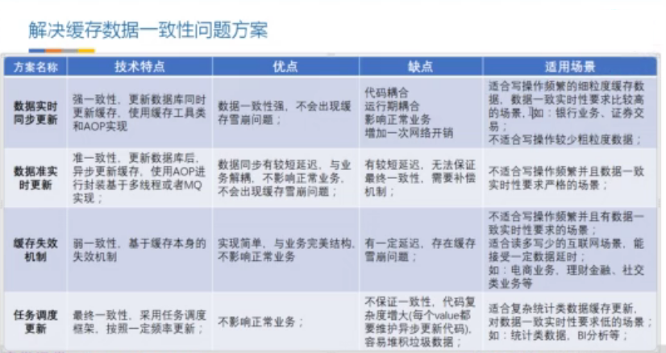
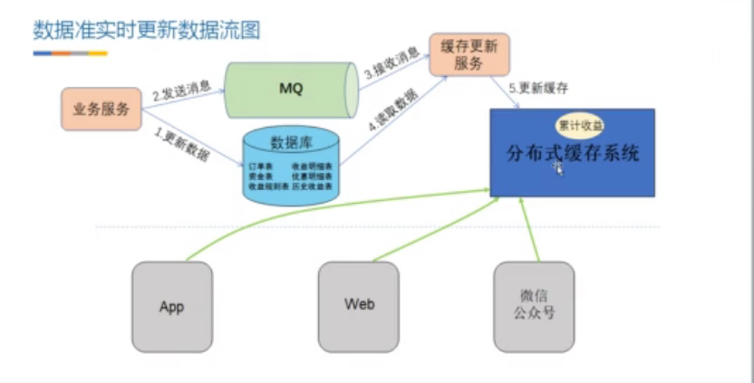

# Java 缓存

* [1、缓存穿透](#1、缓存穿透)
* [2、缓存击穿](#2、缓存击穿)
* [3、缓存雪崩](#3、缓存雪崩)
* [4、缓存数据一致性](#4、缓存数据一致性)

### 1、缓存穿透 ###

> 什么是缓存穿透

	指查询一个一定不存在的数据，由于缓存是不命中时被动写的，并且出于容错考虑，如果从存储层查不到数据则不写入缓存，这将导致这个不存在的数据每次请求都要到存储层去查询，失去了缓存的意义。
	在流量大时，可能DB就挂掉了，要是有人利用不存在的key频繁攻击我们的应用，这就是漏洞。

> 解决方法

	1、最常见的则是采用布隆过滤器【bloom Filter】，将所有可能存在的数据哈希到一个足够大的bitmap中，一个一定不存在的数据会被 这个bitmap拦截掉，从而避免了对底层存储系统的查询压力。默认误伤率是 3%，也可以在创建的时候自定义。BloomFilter.create() ，使用工程模式创建。

	2、另外也有一个更为简单粗暴的方法（我们采用的就是这种），如果一个查询返回的数据为空（不管是数 据不存在，还是系统故障），我们仍然把这个空结果进行缓存，但它的过期时间会很短，最长不超过五分钟。

### 2、缓存击穿 ###

> 什么是缓存击穿

	对于一些设置了过期时间的key，如果这些key可能会在某些时间点被超高并发地访问，是一种非常“热点”的数据。
	这个时候，需要考虑一个问题：缓存被“击穿”的问题，这个和缓存雪崩的区别在于这里针对某一key缓存，前者则是很多key。
	缓存在某个时间点过期的时候，恰好在这个时间点对这个Key有大量的并发请求过来，这些请求发现缓存过期一般都会从后端DB加载数据并回设到缓存，这个时候大并发的请求可能会瞬间把后端DB压垮。

> 解决方法

	将缓存失效时间分散开，比如我们可以在原有的失效时间基础上增加一个随机值，比如1-5分钟随机，这样每一个缓存的过期时间的重复率就会降低，就很难引发集体失效的事件。

### 3、缓存雪崩 ###

> 什么是缓存雪崩

	指在我们设置缓存时采用了相同的过期时间，导致缓存在某一时刻同时失效，请求全部转发到DB，DB瞬时压力过重雪崩。

> 解决方法

	将缓存失效时间分散开，比如我们可以在原有的失效时间基础上增加一个随机值，比如1-5分钟随机，这样每一个缓存的过期时间的重复率就会降低，就很难引发集体失效的事件。

> 创建模板方法

	/**
     * 创建模板
     * 使用JSON 字符串的形式保存在redis 中
     * @param key 缓存键
     * @param expire 缓存失效时间
     * @param unit 缓存失效时间单位
     * @param clazz 缓存的类型
     * @param cacheLoadable 缓存中没有数据时，如何获取数据
     * @param <T> 缓存的泛型
     * @return
     */
    public <T> T findCache(String key,
                           long expire,
                           TimeUnit unit,
                           TypeReference<T> clazz,
                           CacheLoadable<T> cacheLoadable){

        String json = String.valueOf(redisTemplate.opsForValue().get(key));
        if (!StringUtils.isEmpty(json) && !json.equalsIgnoreCase("null") ){
            logger.info(Thread.currentThread().getName()+" 从缓存中取数据A,{}",json);
            return JSON.parseObject(json,clazz);
        }
        synchronized (this){
            json = String.valueOf(redisTemplate.opsForValue().get(key));
            if (!StringUtils.isEmpty(json) && !json.equalsIgnoreCase("null") ){
                logger.info(Thread.currentThread().getName()+" 从缓存中取数据B,{}",json);
                return JSON.parseObject(json,clazz);
            }
            logger.info(Thread.currentThread().getName()+" 从数据库取数据");

            //TODO 核心业务
            T result = cacheLoadable.load();

            redisTemplate.opsForValue().set(key,JSON.toJSONString(result),expire,unit);
            return result;
        }
    }

    /**
     * 模板方法
     * 只需要编写业务核心方法即可
     */
    public void queryTemplate(){
        String key = "list";
        Random random = new Random();
        //过期时间设置为随机数
        int time = random.nextInt(30);
        cacheTemplateService.findCache(
                key,
                time,
                TimeUnit.SECONDS,
                new TypeReference<List<String>>(){},
                new CacheLoadable<List<String>>() {
                    //核心业务方法
                    @Override
                    public List<String> load() {
                        List<String> list = new ArrayList<>();
                        list.add("alex");
                        list.add("age");
                        return list;
                    }
                });
	    }

### 4、缓存数据一致性 ###

> 缓存信息的本质就是硬盘数据的副本，是一种用空间换时间的技术，数据的一致性问题不可避免。   
> 导致缓存数据不一致的情况：

	1、更新数据库成功，更新缓存失败；
	2、更新缓存成功，更新数据库失败；
	3、更新数据库成功，缓存失效失败。

> 常用方法是采用设置缓存失效时间。