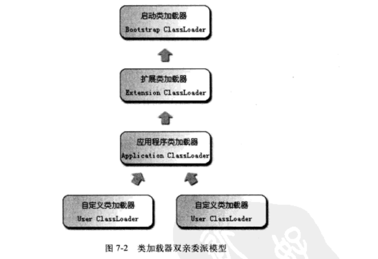
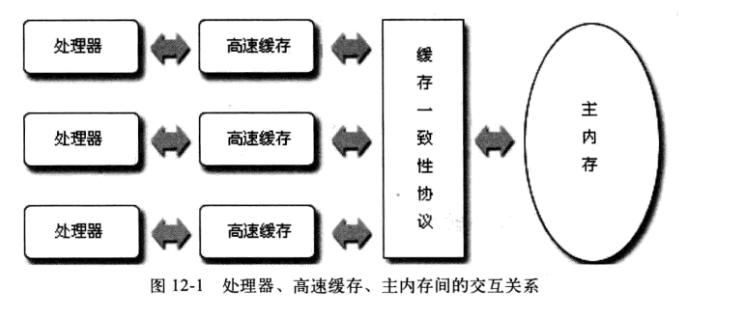
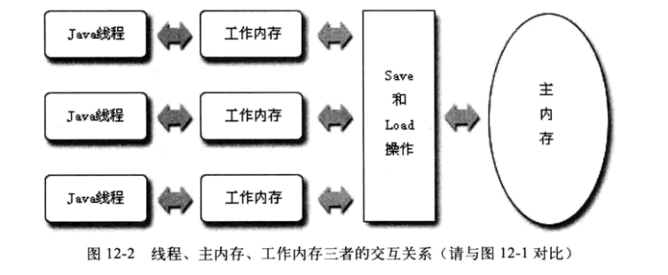

### 手写代码 ###
> 写SQL很常考察group by、内连接和外连接。  
> group by  

	对数据根据哪个字段进行分组。

	常用聚合函数
		count() 计数
		sum() 求和
		avg() 平均数
		max() 最大值
		min() 最小值

	对teacher 表的数据按 age字段进行分组，COUNT(age)进行计数
	select t_name,COUNT(age) as count from teacher group by age;

	HAVING 作为对分组后的数据进行筛选
	select t_name,COUNT(age) as count from teacher group by age HAVING COUNT(age)>1;

	
> 内连接  

	表1：t1;表2：t2
	select * from t1 inner join t2 on t1.id=t2.id and t1.id=2;

> 外连接  

	表1：t1;表2：t2
	select * from t1 left join t2 on t1.id=t2.id and t1.id=2;
	select * from t1 right join t2 on t1.id=t2.id and t1.id=2;

> 手写代码一般考单例、排序、线程、消费者生产者。  
> 单例

	public class Single {

	    /**
	     * 饿汉模式
	     */
	    public static Single single1 = new Single();
	
	    public Single getInstance1(){
	        return single1;
	    }
	
	    /**
	     * 懒汉模式
	     */
	    private Single single2 = null;
	
	    public Single getInstace2(){
	        if (single2 == null) { 
	            synchronized(Single.class){
	                if (single2 == null) {
	                    single2 = new Single();
	                }
	            }
	        }
	        return single2;
	    }
	}

> 排序

	public class Sort{

		 private int[] arr = {1,0,78,56,3,8};

		/**
	     * 冒泡排序
	     * @return
	     */
	    public static int[] sort(){
	        int temp;
	        for (int i = 0; i < arr.length -1 ; i++) {
	            for (int j = 0; j < arr.length -1 -i;j++) {
	                if (arr[j] > arr[j +1 ]) {
	                    temp = arr[j];
	                    arr[j] = arr[j+1];
	                    arr[j + 1] = temp;
	                }
	            }
	        }
	        return arr;
	    }

		/**
	     * 选择排序
	     */
	    public int[] selectSort(){
	        int temp;
	        for(int i=0; i< arr.length; i++){
	            int min = arr[i];
	            int minIndex = i;
	            for(int j = i+1; j< arr.length; j++) {
	                if (min > arr[j]) {
	                    min = arr[j];
	                    minIndex = j;
	                }
	            }
	            temp = arr[i];
	            arr[i] = arr[minIndex];
	            arr[minIndex] = temp;
	        }
	        return arr;
	    }
	}

> 线程

	public class Sort extends Thread{

	    @Override
	    public void run(){
	        System.out.println("hello");
	    }
	
	    public static void main(String[] args) {
	        Sort sort = new Sort();
	        sort.start();
	    }
	}

	public class Sort implements Runnable{

	    @Override
	    public void run(){
	        System.out.println("hello");
	    }
	
	    public static void main(String[] args) {
	        Sort sort = new Sort();
	        Thread thread = new Thread(sort);
	        thread.start();
	    }
	}

> 消费者生产者

	思路：
		1. 生产者生产资源到资源池中，消费者从资源池中消费资源；
		2. 若资源池已满，则生产者线程阻塞等待，通知消费者线程进行消费资源；
		3. 若资源池已空，则消费者线程阻塞等待，通知生产者线程进行生产资源。

> 方式一：synchronized、wait和notify         

	package com.hdc.producerconsumer;

	/**
	 * 生产和消费的资源
	 *
	 */
	public class Resource {
	
	    /** 当前资源的容量 */
	    private int num = 0;
	    /** 资源的最大容量 */
	    private int size = 10;
	
	    /**
	     * 向资源池中添加资源
	     */
	    public synchronized void add(){
	
	        if(num < size) {
	            num ++ ;
	            System.out.println("生产者" + Thread.currentThread().getName() +"正在生产资源，目前资源数为" + num + "个");

	            // 唤醒阻塞的消费者来消费
	            notifyAll();
	        }else{
	            // 资源池已满，生产者进入等待
	            try {
	                wait();
	                System.out.println("生产者" + Thread.currentThread().getName() + "线程进入等待");
	            } catch (InterruptedException e) {
	                e.printStackTrace();
	            }
	        }
	    }
	
	    /**
	     * 向资源池中取出资源
	     */
	    public synchronized void remove(){
	
	        if (num > 0){
	            num --;
	            System.out.println("消费者" + Thread.currentThread().getName() + "正在消费资源，目前资源还有" + num + "个");

	            // 唤醒阻塞的生产者来生产
	            notifyAll();
	        }else{
	            // 没有资源了，消费者进入等待
	            try {
	                wait();
	                System.out.println("消费者" + Thread.currentThread().getName() + "线程进入等待");
	            } catch (InterruptedException e) {
	                e.printStackTrace();
	            }
	        }
	    }
	}

	/**
	 * 生产者
	 */
	public class ProducerThread extends Thread{

	    private Resource resource;
	
	    public ProducerThread(Resource resource) {
	        this.resource = resource;
	    }
	
	    @Override
	    public void run() {
	        while (true) {
	            try {
	                Thread.sleep(1000);
	            } catch (InterruptedException e) {
	                e.printStackTrace();
	            }
	            // 生产资源
	            resource.add();
	        }
	    }
	}

	/**
	 * 消费者
	 */
	public class ConsumerThread extends Thread{
	
	    private Resource resource;
	
	    public ConsumerThread(Resource resource) {
	        this.resource = resource;
	    }
	
	    @Override
	    public void run() {
	        while (true){
	            try {
	                Thread.sleep(1000);
	            } catch (InterruptedException e) {
	                e.printStackTrace();
	            }
	            // 消费资源
	            resource.remove();
	        }
	    }
	}

	//测试
	public class Main {
	    public static void main(String[] args) {
	        Resource resource = new Resource();
	        ProducerThread p1 = new ProducerThread(resource);
	        ProducerThread p2 = new ProducerThread(resource);
	        ProducerThread p3 = new ProducerThread(resource);
	        ConsumerThread c1 = new ConsumerThread(resource);
	        ConsumerThread c2 = new ConsumerThread(resource);
	        ConsumerThread c3 = new ConsumerThread(resource);
	        p1.start();
	        p2.start();
	        p3.start();
	        c1.start();
	        c2.start();
	        c3.start();
	    }
	}

> 方式二：BlockingQueue   

	public class QueueResource {

	    private int size = 10;
	
	    private BlockingQueue blockingQueue = new LinkedBlockingQueue(size);
	
	    public void add(){
	
	        blockingQueue.offer(1);
	        System.out.println("生产者" + Thread.currentThread().getName() +"正在生产资源，目前资源数为"
	                + blockingQueue.size() + "个");
	    }
	
	    public void remove(){
	        blockingQueue.poll();
	        System.out.println("消费者" + Thread.currentThread().getName() +"正在消费资源，目前资源数为"
	                + blockingQueue.size() + "个");
	    }
	}

[各大公司Java后端开发面试题总结](https://blog.csdn.net/sinat_35512245/article/details/59056120)  
[关于Java面试，你应该准备这些知识点](https://www.jianshu.com/p/1b2f63a45476)

### JVM相关问题 ###

> 介绍下垃圾收集机制

	在对象没有引用链相连时，垃圾收集器会对该对象进行回收。
	
> Java 中的4种引用

	判定对象是否存活都和引用有关。

	希望一类对象再内存足够时还能保留在内存中，只有当内存紧张时才会抛弃这些对象。	

	1. 强引用：
		类似 Object obj = new Object(); 这类引用。
		只要强引用还存在，垃圾收集器永远不会回收这些被引用的对象。

	2. 软引用：
		用来描述一些还有用，但并非必须的对象。
		只有当虚拟机的内存准备溢出时，才会将这些引用对象进行第二次回收。

		软引用可用来实现内存敏感的高速缓存。

	3. 弱引用：
		用来描述非必需的对象，比软引用更弱。
		该引用的对象只能生存到下一次垃圾回收发生之前，即无论内存是否足够，该引用对象都会被回收。

	4. 虚引用：
		最弱的引用。
		一个对象是否用虚引用，完全不会影响其生存时间，也无法通过虚引用来获取对象实例。
		该引用的唯一目的：希望能在该对象被回收时收到一个系统通知。

> 内存模型以及分区，需要详细到每个区放什么

	内存的5个主要分区：
	1. 程序计数器：
	
		代表当期线程所执行的字节码的行号指示器。
		属于线程私有内存。
		每个线程都有独立的计数器，确保线程切换后能恢复到正确的执行位置。
		由于需要的内存空间很小，所有该区域是唯一一个在JVM中没有 OutOfMemoryError 的区域。

	2. Java虚拟机栈

		属于线程私有。
		生命周期和线程相同。
		每个方法被执行时都会同时创建一个栈帧【方法运行期的基础数据结构】，用来储存局部变量表等信息。
		每个方法被调用直至执行完成的过程就是一个栈帧在虚拟机栈中从入栈到出栈的过程。
		
		该区域的两种异常情况：
		1. 若线程请求的栈深度大于虚拟机所允许的深度，就会抛出 StackOverflowError 异常；
		2. 若虚拟机栈可以动态扩展，当扩展时无法申请到足够的内存时，即需要的内存大于虚拟机的最大内存时，就会抛出 OutOfMemoryError 异常。

	3. 本地方法栈

		和Java虚拟机栈很类似。
		区别：虚拟机栈为虚拟机执行 Java方法【字节码】服务，本地方法栈在是为虚拟机使用到的 Native 方法服务。
		也会抛出 StackOverflowError 和 OutOfMemoryError 异常。

		有的虚拟机直接将本地方法栈和 Java虚拟机栈 合二为一，比如Sun HotSpot 虚拟机。

	4. Java 堆

		该区域是 Java虚拟机所管理的内存中最大的一块区域。
		属于线程共享的内存区域。
		唯一目的就是存放对象实例。
		Java 堆 也是垃圾收集器管理的主要区域，GC堆。
		Java 堆可以处于物理上不连续的内存空间，只要在逻辑上是连续的即可，类似硬盘空间。
		可通过 -Xmx 和 -Xms控制内存的扩展。
		内存不足时会抛出 OutOfMemoryError 异常。

	5. 方法区

		属于线程共享的内存区域。
		用来存放被虚拟机加载的类信息、常量、静态变量等数据。
		内存不足时会抛出 OutOfMemoryError 异常。

		Java 虚拟机规范对该区域的限制很宽松，致使垃圾收集行为在该区域很少出现。
		垃圾收集行为的目标主要是针对 常量池 的回收。

	5.1 运行时常量池

		是方法区的一部分。
		用来存放编译期生成的符号引用和各种字面量。
			int i = 1;	把整数1赋值给int型变量i，整数1就是Java字面量，
			同样，String s = "abc";	中的abc也是字面量。

> 堆里面的分区：Eden，survival from to，老年代，各自的特点。

	Eden【新生代】
		对象优先在新生代【Eden】区中分配。
		当 Eden 区没有足够的空间时，JVM将发起一次 Minor GC。
		里面的对象大多是朝生夕灭，所以 Minor GC 很频繁，回收速度也快。

	老年代：
		当没有足够的内存时，发起 Major GC，经常伴随着 Minor GC动作。
		Major GC 一般比 Minor GC 速度慢10倍以上。

		大对象【需要大量连续内存空间的Java对象】直接进入老年代。

		长期存活的对象将进入老年代，一般默认为15岁即可进入。
		每熬过一次 Minor GC 就增加一岁。

> 对象创建方法，对象的内存分配，对象的访问定位。

	Object obj = new Object(); 进行对象创建
	
	根据 具体类型 以及 虚拟机实现的对象内存分布 进行内存大小的分配。
	对象优先在新生代【Eden】区中分配。

	主流的访问方式：
		1. 使用句柄【常用】：
			在Java堆中划分一块内存作为句柄池，引用中存储的就是对象的句柄地址，比如Object obj。
			优点：当对象呗移动时只需要修改句柄的指针，对象的引用本身不需要被修改。
 
		2. 直接指针：
			引用中存储的就是对象的地址。
			优点：速度快，节省一次指针定位的时间开销。

> 判定对象是否存活。

	根搜索算法

		通过一系列名为"GC Roots" 的对象作为起始点，从这些节点开始向下搜索，搜索走过的路径称为 引用链【Reference Chain】，当一个对象到 GC Roots 都没有任何引用链相连时，则证明该对象是不可用的。
		不可用的对象即被判定位可回收对象。

		可作为 GC Roots 的对象：
			1. 虚拟机栈中引用的对象；
			2. 方法区中静态变量引用的对象；
			3. 方法区中常量引用的对象；
			4. 本地方法栈找那个引用的对象。

> GC的三种收集方法：标记清除、标记整理、复制算法的原理与特点，分别用在什么地方，如果让你优化收集方法，有什么思路？

	1. 标记 - 清除算法

		首先标记处所有需要回收的对象，在标记完成后统一回收掉所有被标记的对象。
		缺点：
			1. 效率低；
			2. 会产生大量不连续的内存空间。
			
	2. 复制算法

		将可用内存按容量划分为大小相等的两块，每次只使用一块。
		当这一块准备用完时，将还存活的对象复制到另一块上，然后一次性清理已使用的内存空间。

		少量对象存活时，效率高；大量存活时效率就低下了。
		缺点：浪费一半的空间。

	3. 标记 - 整理算法

		标记过程和 “标记 - 清除”算法一样，但标记后不是直接对可回收对象进行清理，而是让所有存活的对象都向一端移动，然后清理掉边界以外的内存。

	4. 分代收集算法

		根据对象的存活周期的不同，将内存划分为几块。
		将Java堆分为新生代和老年代，根据年代的特点进行适当的回收算法。
		比如，在新生代中只有少量存活，可以使用 复制算法进行回收；
		老年代中有大量存活，则必须使用 “标记-清理” 或者 “标记-整理”算法进行回收。

> GC收集器有哪些？CMS收集器与G1收集器的特点。

	CMS收集器：
		是一种以最短回收停顿时间为目标的收集器。
		基于 “标记 - 清除” 算法实现的收集器
	
	G1收集器 比 CMS收集器 有了2个显著改进：
	1. G1收集器是基于 “标记 - 整理” 算法实现的收集器，即不会产生空间碎片。
	2. 可以精确的控制停顿，减少在垃圾收集上的时间消化。

> Minor GC与Full GC分别在什么时候发生？

	Minor GC 发生在新生代；
	Full GC 发生在老年代。

> 几种常用的内存调试工具：

	jps: 显示指定系统内所有的虚拟机进程状况；

	jstat: 显示虚拟机统计信息
	
	jstack:	显示虚拟机的线程快照，用于跟踪Java堆栈，定位线程出现长时间停顿的原因；

	jmap: 生成虚拟机的内存存储快照【heapdump文件】

	jinfo: 显示虚拟机配置信息

	jconsole：JDK的可视化工具，Java监视和管理控制台

> 类加载的过程：

	1. 加载
	
		1. 通过一个类的全限定名来获取定义该类的二进制字节流；
		2. 将该字节流所代表的静态存储结构转为方法区的运行时数据结构【栈帧】；
		3. 在Java堆中生成一个代表该类的 java.lang.Class 对象，作为方法区中这些数据的访问入口。

		可以由JVM的类加载器加载，也可以由自定义的类加载器加载。
		
	2. 验证
	
		目的：确保Class 文件的字节流中包含的信息符合当前虚拟机的要去，不会危害虚拟机自身安全。
		大致验证过程：
			1. 文件格式验证；
			2. 元数据验证；
			3. 字节码验证；
			4. 符号引用验证。
	3. 准备

		为静态变量分配内存，并设置静态变量初始值。
		【注】只是设置初始值，并没有进行赋值。
			通常情况下，初始值是数据类型的零值。

		比如： public static int value = 123;
		该阶段过后的value的初始值为0，而不是123。

	4. 解析

		虚拟机将常量池内的符号引用替换为直接引用的过程。
			即将符号转为实际的入口地址。

		1. 符号引用：
			以一组符号来描述所引用的目标，符号可以是任何形式的字面量，只要使用时能无歧义的定位到目标即可。
			符号引用和JVM实现的内存布局无关，引用的目标并不一定已经加载到内存中。

			在Java中，一个Java类将会编译成一个class文件。
			在编译时，Java类并不知道所引用的类的实际地址，因此只能使用符号引用来代替。
			包括了如下三种类型的常量：

				1. 类和接口的全限定名
				2. 字段名称和描述符
				3. 方法名称和描述符

		2. 直接引用：
			可以是直接指向目标的指针、相对偏移量、能间接定位到目标的句柄。
			和JVM实现的布局相关，引用的目标一定已经加载到内存中。
			实际入口地址。

		解析动作主要是针对类或接口、字段、类方法、接口方法这四类符号引用。

	5. 初始化

		开始执行类中定义的Java字节码，对变量进行赋值等操作。

> 类加载器

	作用：通过一个类的全限定名来获取描述该类的二进制字节流。

	虚拟机的类加载机制：
		虚拟机把描述类的数据从Class文件【一串二进制字节流】中加载到内存，并对数据进行校验、转换解析和初始化，最终形成可以被虚拟机直接使用的 Java 类型。

	确定加载的类的唯一性：需要由加载它的类加载器和该类本身一起确认。
		
	比较两个类是否相等，前提是这两个类都是由同一个类加载器加载。
	否则即使是同一个类不同的类加载器加载后，也会不相等。

	Java虚拟机主要有两种类加载器：启动类加载器、用户自定义类加载器。
	
	用户自定义的类加载器是普通的Java对象，该类必须派生自java.lang.ClassLoader 类。
	ClassLoader类提供了访问类加载器的接口 loadClass。
	
> 双亲委派模型：

	将类的加载动作交给自己的父类进行完成，除非父类无法完成这个加载请求【没有找到所需的类】时，子加载器才会自己去加载。

	确保java的核心类都是由启动类加载器加载。	

	启动类加载器【Bootstrap ClassLoader】
		负责加载$JAVA_HOME/lib下的jar包和class文件

	扩展类加载器【Extension ClassLoader】
		负责加载$JAVA_HOME/lib/ext下的jar包和class文件

	应用程序类加载器【ApplicationClassLoader】
		负责加载classpath下的jar包和class文件

> 能不能自己写一个类叫java.lang.String

	不能，由于双亲委托机制，使得String的加载交给了父类加载器【启动类加载器】

> 分派：静态分派与动态分派

	体现了多态的特性--重载、重写。

	静态分派

		指的是所有依赖静态类型来定位方法执行版本的分派动作。
		最典型的应用就是 方法重载 overload；

		发生在编译阶段

	动态分派

		指的是运行期根据实际类型确定方法执行版本的分派动作。
		最典型的应用就是 方法重写 override。

推荐书籍：《深入理解java虚拟机》

### 线程相关问题 ###

> Java内存模型 -- Java Memory Model,JMM

	主要目标：定义程序中各个变量的访问规则，即在虚拟机中将变量存储到内存和从内存中取出变量这样的底层细节。

	1. 主内存
		规定所有的变量都存储在主内存中。

	2. 工作内存
		每个线程都有自己的工作内存，用于存放被该线程使用到的变量的主内存副本。
		线程对变量的所有操作都必须在工作内存中进行，不能直接读写主内存的变量。
	
	不同线程间无法直接访问对方的工作内存中的变量，只能通过主内存来完成工作内存间的变量的传递。

 

	主内存主要对应于Java 堆中对象的实例数据部分，工作内存则对应于虚拟机栈中的部分区域。
	或者说，
	主内存就是硬件的内容，工作内存则存储于寄存器和高速缓存中。

	内存间交互操作【JMM定义了八种操作来完成】：
		
		1. lock【加锁】
			作用于主内存的变量，把一个变量标识为一个线程独占的状态。

		2. unlock【解锁】
			作用于主内存的变量，把处于加锁状态的变量释放，这样才可以被其他线程加锁。
			
		3. read【读取】
			作用于主内存的变量，把变量的值从主内存传到线程的工作内存中。

		4. load【载入】
			作用于工作内存的变量，将read操作得到的变量值载入工作内存的变量副本中。

		5. use【使用】
			作用于工作内存的变量，将工作内存的一个变量的值传递给执行引擎。

		6. assign【赋值】
			作用于工作内存的变量，将一个从执行引擎接收到的值赋给工作内存的变量。

		7. store【存储】
			作用于工作内存的变量，把工作内存中的一个变量的值传送给主内存。

		8. write【写入】
			作用于主内存的变量，把从store操作获取的变量值写入主内存的变量中。

	【注】
	1. 对一个变量进行 lock 操作前，将会清空工作内存中该变量的值，确保该变量值是从主内存获取到的值；
	2. 对一个变量进行 unlock 操作前，必须先把该变量同步回主内存中【执行store和write操作】。
	3. JMM 要求这八种操作都是原子性的。

> 创建线程的3种方式

	1. 继承 Thread 类
	2. 实现 Runnable 接口
	3. 实现 Callable 接口

> 什么是线程安全

	当多个线程访问一个对象时，不需要进行额外的同步或者协调操作，都可以获取正确的结果，则这个对象就是线程安全的。

> Runnable接口和Callable接口的区别

	Runnable 接口中的 run() 方法的返回值是void，它做的事情只是纯粹地去执行run()方法中的代码而已；

	Callable 接口中的 call() 方法是有返回值的，是一个泛型，和Future、FutureTask【间接继承Future】配合可以用来获取异步执行的结果。

> wait方法和sleep方法的区别

	1. sleep()方法是属于Thread类中的，而wait()方法，则是属于Object类中的。

	2. 最主要是sleep()方法没有释放锁，而wait()方法释放了锁。

	3. wait，notify和notifyAll只能在同步控制方法或者同步控制块里面使用，而sleep可以在任何地方使用。

	4. sleep()必须捕获异常，而wait，notify和notifyAll不需要捕获异常。

	sleep() 指线程被调用时，占着CPU不工作，形象地说明为“占着CPU睡觉”，此时，系统的CPU部分资源被占用，其他线程无法进入，会增加时间限制。
	wait() 指线程处于进入等待状态，形象地说明为“等待使用CPU”，此时线程不占用任何资源，不增加时间限制。

> 自旋锁和自适应自旋

	自旋锁： 
		为了让线程等待，让线程执行一个忙循环【自旋】。
		JDK1.6后默认处于开启状态。
		由于自旋占用处理器时间，所以自旋等待时间需要有个度，默认自旋次数为10次。

	自适应自旋：
		自旋的时间不再固定，而是由前一次在同一个锁上的自旋时间和锁的拥有者的状态来决定。

> synchronized、Lock、ReentrantLock、ReadWriteLock

	synchronized 	隐式锁
	Lock 			

		显示锁
		Lock是一个接口，定义了一些抽象的所操作。
		与内部锁机制不同，Lock提供了无条件，可轮询，定时的，可中断的锁获取操作，所有加锁和解锁的方法都是显式的。
		锁必须在finally块中释放。

	ReentrantLock 	
	
		可重入锁，默认是非公平锁，也可以指定为公平锁。
		ReentranLock实现了Lock接口，提供了与synchronized相同的互斥和内存可见性的保证。
		获得ReentrantLock的锁与进入synchronized块有着相同内存含义，释放ReentrantLock锁与退出synchronized块有着相同内存含义。
		
	ReadWriteLock 	

		读写锁
		synchronized 可以完成的 ReentranLock 都能完成，反之不成立。

> 介绍下CAS(无锁技术)。

	比较并交换 - compare and swap
	CAS 需要三个操作数：内存地址，旧的预期值，新值。

	执行过程：
		当且仅当 内存地址 中的值为 旧的预期值 时，处理器才会使用 新值 更换内存地址中的值，否则不执行更换。
		但是不管是否更换值，都会返回 内存地址 的旧值。

	CAS 的执行过程是一个原子操作。

	缺点："ABA"问题。

> ThreadLocal

	线程本地存储，无须同步也能保证线程安全。

	使用 ThreadLocal 类来实现线程本地存储的功能。
	每个线程的 Thread 对象都有一个 ThreadLocalMap 对象，该对象以 ThreadLocal.threadLocalHashCode 为键，以本地线程变量为值。

	ThreadLocal 对象就是当期线程的 ThreadLocalMap 的访问入口，通过唯一的 threadLocalHashCode 值就可以获取 本地线程变量。

	将共享的变量拷贝到每个线程的工作内存的变量副本，这样就不会产生竞争问题了，使用空间换时间的思路。

> 创建线程池的4种方式

	Executors.newCachedThreadPool();        //创建一个线程池，线程池容量大小为Integer.MAX_VALUE

	Executors.newSingleThreadExecutor();   	//创建容量为1的线程池

	Executors.newFixedThreadPool(int);    	//创建固定容量大小的线程池

	Executors.newScheduledThreadPool(int)	//创建定时任务的线程池

> ThreadPoolExecutor的内部工作原理

	1. 查看当前运行状态，如果不是RUNNING状态，将直接拒绝新任务。
		否则进入步骤2。
	
	2. 查看当前运行线程的数量，如果数量少于核心线程数，将直接创建新的线程执行该任务。
		否则进入步骤3。
	
	3. 将该任务添加到阻塞队列，等待核心线程执行完上一个任务再来获取。
		如果添加到阻塞队列失败，进入步骤4。
	
	4. 尝试创建一个非核心线程执行该任务，前提是线程的数量少于等于最大线程数。
		如果失败，拒绝该任务。

> 分布式环境下，怎么保证线程安全

	通过 mysql、redis、zookeeper 处理分布式锁。

> 分布式session存储解决方案

### 设计模式相关问题 ###

> 先问你熟悉哪些设计模式，然后再具体问你某个设计模式具体实现和相关扩展问题。

### 集合相关问题 ###

> HashMap、LinkedHashMap、ConcurrentHashMap、ArrayList、LinkedList的底层实现。

> ArrayList 

	动态扩展的数组，默认初始容量为10。
	ArrayList定义只定义类两个私有属性：
		Object[] elementData；	// 存储ArrayList内的元素
		int size;				// 表示它包含的元素的数量

> LinkedList的本质是双向链表

	1. LinkedList继承于AbstractSequentialList，并且实现了Dequeue接口。 
	2. LinkedList包含两个重要的成员：header 和 size。
	
	header 是双向链表的表头，它是双向链表节点所对应的类 Entry 的实例。
		Entry中包含成员变量： previous, next, element。
			previous	是该节点的上一个节点
			next		是该节点的下一个节点
			element		是该节点所包含的值。 

	size是双向链表中节点的个数。

	既然是双向链表，那么它的顺序访问会非常高效，而随机访问效率比较低。

	由于继承了List 接口，那也可以通过索引来获取值。
	如何把 双向链表 和 索引值联系起来？
		就是通过一个计数索引值来实现的。
		比如，获取get(index)。将index 和 链表的1/2 作比较，若前者大的话，就从链表头部开始查找，否则从尾部查找。

> ArrayList、LinkedList、Vector的区别。

	线程安全：
		ArrayList、LinkedList 非线程安全，Vector线程安全。

	存储结构：
		ArrayList、Vector 基于动态数组，存在容量不足的问题，需要扩容；
		LinkedList 基于链表，不存在容量不足的问题。

	数组扩容：
		Vector 扩容100%，ArrayList扩容50% + 1，如果设置后的新容量还不够，则直接新容量设置为传入的参数（也就是所需的容量）。

	查找数据：
		遍历数据时，ArrayList、Vector 基于下标获取数据，时间复杂度为O(1)。
		LinkedList 需要每个数据进行遍历，时间复杂度为 O(n)。

	添加、删除数据：
		操作数据时，ArrayList要对数据进行移位操作，时间消耗大 O(n)。
		LinkedList 移动一个指定位置的数据所花费的时间为 O(1)。
		

> HashMap 和 Hashtable 的区别

	1. 线程安全方面：
		HashMap 非线程安全，而 Hashtable 线程安全。

	2. 键值方面
		HashMap 允许null 键值，而 Hashtable 不允许null 键值 。

	3. 数组初始容量方面
		HashMap 初始容量为16 ，扩容时扩大2倍；而 Hashtable 初始容量为11，扩容时扩大2倍+1。

	4. hash值方面
		HashMap 的 hash值 经过重新计算，hash = (h = key.hashCode()) ^ (h >>> 16)；
		而 Hashtable 的hash值 直接使用 hashcode，hash = key.hashcode。

> HashMap 和 ConcurrentHashMap 的区别

	1. 线程安全方面
		HashMap 非线程安全，而 ConcurrentHashMap 线程安全。

	2. 键值方面
		HashMap 允许null 键值，而 ConcurrentHashMap 不允许null 键值 。

	3. 获取值方面
		HashMap 直接 tab[index] 获取，而 ConcurrentHashMap 经过 CAS的 tabAt(tab,index);方法，保证了每次拿到数据都是最新的。

> HashMap 和 LinkedHashMap 的区别

	LinkedHashMap 继承自 HashMap，LinkedHashMap = HashMap + 双向链表。

	1. 数据顺序方面
		HashMap 中的数据是无序的；而 LinkedHashMap 的数据是有序的。
		
> TreeMap、LindedHashMap 的区别

	1. 顺序结构方面
		TreeMap 是按照key 进行的升序排序，也可以指定排序的比较器；
		而 LinkedHashMap 是根据数据的插入顺序【默认】或者访问顺序进行排序。

	2. 存储结构方面
		TreeMap基于 红黑树 实现，而 LinkedHashMap 是基于 数组 + 链表 + 红黑树 实现的。
	
> ConcurrentHashMap是怎么实现线程安全的

	利用 CAS + Synchronized 来保证并发更新的安全，底层采用 Node数组 + 链表 + 红黑树 的存储结构。
	而对于锁的粒度，调整为对每个数组元素加锁（Node）。
	ConcurrentHashMap 利用 红黑树 加强了并发能力。

> Collection 包结构，与Collections 的区别

	Collection 是最基本的集合接口，有2个构造函数：无参构造函数、有Collection参构造函数。
	Collections 是一个集合的静态方法工具类，提供了操作集合的各种方法。

### 数据库相关问题，针对Mysql ###

> Mysql索引的数据结构

	使用 B+树 作为Mysql索引的数据结构。

> SQL怎么进行优化

	涉及 慢查询、索引、拆分表。

	一、慢查询

		SQL优化的一般步骤：
			先查询 Mysql数据库运行状况，然后定位慢查询，再分析sql的执行过程，然后进行优化。

		1. 使用 show status 查询数据库的运行状况。
			#显示数据库运行状态
			SHOW STATUS
	
			#显示数据库运行总时间
			SHOW STATUS LIKE 'uptime'
	
			#显示连接的次数
			SHOW STATUS LIKE 'connections'
	
			#显示执行CRUD的次数
			SHOW STATUS LIKE 'com_select'
			SHOW STATUS LIKE 'com_insert'
			SHOW STATUS LIKE 'com_update'
			SHOW STATUS LIKE 'com_delete'
	
		2. 定位慢查询sql。
			
			1. 开启慢查询
				默认情况下，mysql的慢查询是关闭的。
				要开启这个功能，需要修改MySQL的配置文件。
				windows下修改my.ini，Linux下修改my.cnf
	
					slow_query_log=1
	
			2. 修改慢查询时间
				mysql设置的默认的慢查询时间为10s。
	
				#显示慢查询次数
				SHOW STATUS LIKE 'slow_queries'
	
				#显示慢查询时间，默认为10s
				SHOW VARIABLES LIKE 'long_query_time'
	
				在配置文件中修改配置
				#慢查询的文件路径
				slow_query_log_file="D:/Program Files/MySQL/Log/mysql-slow.log"
	
				#慢查询时间。默认为10秒，可以根据具体需求修改,通常改为1s。
				long_query_time=10
	
			3. 分析慢查询
	
				在实际生产环境中，可能因为开发写了不正确的SQL语句，索引优化的不好，或其他查询操作而导致数据库整体性能下降。
	
				#查看是否启用慢日志记录和状态
				show variables like "%slow%";
		
				可以使用mysql自带的慢查询日志分析工具mysqldumpslow进行分析。
		
				mysqldumpslow -s r -t 10 /data/dbdata/frem-slow.log
	
		3. 使用explain分析sql执行过程

	二、索引
		索引是数据库优化中最常用也最重要的手段之一，通过索引可以解决大多数的sql性能问题。

		B+树索引：

			我们通常在讨论索引的时候，如果没有特别指明，通常说的就是 B+树 索引。
			MyISAM 和 InnoDB 存储引擎的表默认创建的都是 B+树 索引。
			B+Tree索引 中的B不代表二叉树(binary)，而是代表平衡树(balanced)。
			B+Tree索引 并不是一颗二叉树，而是一颗多路平衡树。

		索引的注意点：
			1. 索引会占用存储空间。
			2. 适合添加索引的字段。
				
				1. 频繁作为查询条件的字段应该创建索引，也就是where后面的字段
				2. 唯一性太差的字段不适合单独创建索引，比如 性别 字段
				3. 频繁变化的字段不应该创建索引，比如 count 字段

	1. 索引优化
	2. SQL语句优化
		1. 保证不查询多余的列和行，避免使用 select *；
		2. 使用联合查询代替子查询。
		3. 尽量避免使用!=或<>操作符。
			在where语句中使用 != 或 <>，引擎将放弃使用索引而进行全表扫描。
		4. 在 where 子句中使用 or 来连接条件，引擎将放弃使用索引而进行全表扫描。可以使用 union all 代替。

	3. 索引列上缺少相应的统计信息，或者统计信息过期
	4. 库表数据过大
		库表的拆分

	
> SQL关键字的执行顺序

	from -> on -> join -> where -> group by -> having -> select -> distinct -> union -> order by

	from:		需要从哪个数据表检索数据 
	where:		过滤表中数据的条件 
	group by:	如何将上面过滤出的数据分组 
	having:		对上面已经分组的数据进行过滤的条件  
	select:		查看结果集中的哪个列，或列的计算结果 
	order by :	按照什么样的顺序来查看返回的数据 

> 有哪几种索引

	普通索引	index

	唯一索引	unique
	
	主键索引 primary key

> 什么时候该（不该）建索引
> Explain包含哪些列

| 数据项 | 含义 |
|:------|:------|
| id | SELECT识别符，SELECT的查询序列号； |
| select_type | SELECT类型。可以是SIMPLE（简单查询）、PRIMARY（最外面的select），UNION(UNION中的第二个或后面的查询语句)，等； |
| table |用到的表 |
| type | 表示表的连接类型 |
|possible_keys| 可用的索引列|
|key |实际用到的索引列|
|key_len| 列显示了在索引字段中可能的最大长度|
|ref | 使用哪个列或const常数与key一起从表中选择行|
|rows | 检查的行数|
|Extra | 该列包含MySQL解决查询的详细信息|

> Explain的Type列有哪几种值

	1. ALL：全表扫描。

	2. index：只遍历索引树

		explain select t_id from teacher 

	3. range：索引范围扫描，对索引的扫描开始于某一点，返回匹配值域的行。
	
		比如 带有between或者where子句里带有<, >查询。
		explain select * from teacher where t_id > 1

	4.  ref：使用非唯一索引扫描或者唯一索引的前缀扫描，返回匹配某个单独值的记录行。

		// age 为索引
		explain select * from teacher where age = 20

	5.  eq_ref：使用的索引是唯一索引，对于每个索引键值，表中只有一条记录匹配，即多表连接中使用primary key或者 unique key作为关联条件。

		explain select teacher.age from teacher,user where t_id = id

	6.  const：当MySQL对查询某部分进行优化，并转换为一个常量时，使用这些类型访问。
	
		如将主键置于where列表中，MySQL就能将该查询转换为一个常量。
		explain select * from teacher where t_id=1

	7.  system：system是const类型的特例，当查询的表只有一行的情况下，使用system。

	8.  null：MySQL在优化过程中分解语句，执行时甚至不用访问表或索引。
	
		例如从一个索引列里选取最小值可以通过单独索引查找完成。
		explain select * from teacher where t_id = (select min(id) from `user`)

### 框架相关问题 ###

> Hibernate 和 Mybatis 的区别。

	Hibernate 是全自动的 ORM，笨重；而 Mybatis 是半自动的 ORM，其中的SQL语句可以由开发者编写，灵活性强。

> Spring MVC 和 Struts2 的区别。

	Spring MVC 比 Struts2 轻便，和spring 的兼容性更好。

> Spring用了哪些设计模式。

> Spring中AOP主要用来做什么。

	事务管理

> Spring注入bean的方式。

	@Autowired
	@Resource

> 什么是IOC，什么是依赖注入。

	IOC 控制反转，将创建和管理bean 的权力交给spring 。
	DI 依赖注入，调用者和被调用者关系解耦，它们的依赖关系由Spring 注入。

> Spring是单例还是多例，怎么修改。

	默认是单例的

> Spring事务隔离级别和传播性。

> 介绍下Mybatis的缓存机制。

	分为一级缓存和二级缓存。

> Mybatis的mapper文件中#和$的区别。

	# 会将变量进行预编译处理，安全性高；
	$ 不会进行预编译处理，而是直接使用，存在注入漏洞。

> Mybatis的mapper文件中resultType和resultMap的区别

	resultType 表示返回值的具体类型；
	resultMap 表示返回的对象的POJO 类。

> Mybatis中DAO层接口没有写实现类，Mapper中的方法和DAO接口方法是怎么绑定到一起的，其内部是怎么实现的

	Mapper 中的方法id 就对应这 DAO接口的方法。
	Mybatis 在运行期使用 JDK 动态代理方法对 DAO接口的方法进行代理，获取代理对象mapperProxy，代理对象获取DAO 接口的方法，进而获取了 Mapper 中的方法id，就可以获取对应的SQL语句进行执行。

### 其他 ###

> 介绍下栈和队列

	栈是先进后出的数据存储结构；
	队列是先进先出的数据存储结构。

> IO和NIO的区别

	IO 是阻塞模式
	NIO 是非阻塞的多路复用模式。

> 接口和抽象类的区别

	1. 抽象类中的方法可以有方法体，能实现方法的具体功能，但是接口中的方法没有方法体。
	
	2. 抽象类中的成员变量可以是各种类型的，而接口中的成员变量只能是 public static final 类型的。
	
	3. 接口中不能含有静态代码块以及静态方法，而抽象类是可以有静态代码块和静态方法。

	4. 一个类只能继承一个抽象类，而一个类却可以实现多个接口。

> int和Integer的自动拆箱/装箱相关问题

	基础数据类型和引用数据类型。integer是int的包装类。
	自动拆装箱是jdk1.5及之后的新特性。

	自动装箱：
		自动将数值转成integer类型的数据。
		Integer b = 88;	
	
	自动拆箱：
		把integer这个包装类型的数据转换成int类型的基本数据类型。
		int d = b;
	
	自动拆装箱：	
		Integer b = 88; 
		int d = b;

	
	【注】
	Integer a = 1024;	<==> Integer a1 = new Integer(1024);
	Integer b = 1024;
	System.out.println(a == b);		// false

	Integer a = 66;
    Integer b = 66;
    System.out.println(a == b);		// true

	integer自动拆装箱这里还有一个知识点就是:
	a 和 b的取值只要在-128到127之间【2的7次方】，那么他们指的就是同一个，即使 == 比较的是两者的引用，两者也是相同的。
	因为-128到127这些数字是使用频率比较高的，就产生了一个整型常量池，这些数字会存放在这里，有相同的数字则不会再次创建，所以a和b指的是同一个，因此两者相同，当然如果是在这个范围之外的数字，那结果就是false了

> 常量池相关问题

	Java中的常量池：静态常量池、运行时常量池。

	静态常量池：
		即*.class文件中的常量池。
		class文件中的常量池不仅仅包含字符串(数字)字面量，还包含类、方法的信息，占用class文件绝大部分空间。
		主要用于存放两大类常量：字面量和符号引用量。

	运行时常量池：
		JVM 虚拟机在完成类加载操作后，将class文件中的常量池载入到内存中，并保存在方法区中。
		用来存放编译期生成的符号引用和字面量。
		我们常说的常量池，就是指方法区中的运行时常量池。

	运行时常量池 具备动态性。
	Java语言并不要求常量一定只有编译期才能产生，也就是并非预置入CLass文件中常量池的内容才能进入方法区运行时常量池，运行期间也可能将新的常量放入池中，这种特性被开发人员利用比较多的就是String类的intern()方法。
	String的intern()方法会查找在常量池中是否存在一份equal相等的字符串，如果有则返回该字符串的引用，如果没有则添加自己的字符串进入常量池。

	程序运行时，除非手动向常量池中添加常量(比如调用intern方法)，否则jvm不会自动添加常量到常量池。

	常量池的好处
		避免频繁的创建和销毁对象而影响系统性能，其实现了对象的共享。

	例如字符串常量池，在编译阶段就把所有的字符串文字放到一个常量池中。
	（1）节省内存空间：常量池中所有相同的字符串常量被合并，只占用一个空间。
	（2）节省运行时间：比较字符串时，==比equals()快。
		对于两个引用变量，只用==判断引用是否相等，也就可以判断实际值是否相等。

> ==和equals的区别

	== 只能进行基本数据类型的比较时，比较的是对象的地址是否相等。

	equals 	进行基本数据类型的比较时，比较的是对象的地址是否相等。
			进行引用数据类型的比较时，由于引用数据类型对equals进行了重写，比较的是对象的值是否相等。

	如果没有对 equals 方法进行覆盖的话，调用的仍然是Object类中的方法，而Object中的 equals 方法返回的却是 == 的判断。

> 重载和重写的区别

	覆盖/重写(Override):
		重写是子类对父类的允许访问的方法的实现过程进行重新编写，返回值和形参都不能改变。即外壳不变，核心重写！
		子类方法不能缩小父类方法的访问权限。
		例如：如果父类的一个方法被声明为public，那么在子类中重写该方法就不能声明为protected。
		
	重载(Overload):
		重载(overloading) 是在一个类里面，方法名字相同，只有它们的参数列表不同,返回类型可以相同也可以不同。
		由于方法名称相同，即根据参数类型和参数数量来决定要调用哪个方法。
		不同的参数列表：
			参数类型不同;
			参数数量不同;
			参数次序不同。

		与控制访问修饰符和返回类型无关(public static int)
			被重载的方法可以改变返回类型；
			被重载的方法可以改变访问修饰符；
			被重载的方法可以声明新的或更广的检查异常；
		
	方法的重写和重载是java多态性的不同表现，重写是父类与子类之间多态性的一种表现，重载可以理解成多态的具体表现形式。

> String和StringBuilder、StringBuffer的区别

	String 类是不可改变的【final】，一旦创建了 String 对象，那它的值【堆的对象】就无法改变了，但它的引用【栈的对象】可以改变。

	StringBuilder、StringBuffer：
		可变的String，使用 append(string)/remove(string) ，添加删除字符串字段。
		StringBuilder 	是非线程安全的，效率高。
		StringBuffer 	是线程安全的，效率受影响。

> 静态变量、实例变量、局部变量线程安全吗，为什么。 

	静态变量 非线程安全，由于是线程共享的，所以存在线程竞争。
	实例变量、局部变量线程安全

> try、catch、finally都有return语句时执行哪个

	finally语句总会执行。 
		任何执行try 或者catch中的return语句之前，都会先执行finally语句。
	
	如果finally中有return语句，那么程序就return了，所以finally中的return是一定会被return的。

> 介绍下B树、二叉树

	二叉树：
		1. 排序二叉树：
			每个节点下有两个叶子节点，节点的顺序是左节点<根节点<右节点。
			缺点：树的深度没法控制。当插入的数据都是有序时，二叉树会退化为链表。

		2. 平衡二叉树：
			平衡二叉树是二叉排序树的基础上，对树的深度进行了限制，从而减少了查找比较的次数。
			左子树与右子树的深度差在-1、0、1内，否则对子树进行旋转调整平衡，避免深度过深。
			缺点：当插入的数据都是有序时，二叉树会退化为链表。

		3. 红黑树：
			也属于平衡二叉树。
			避免二叉树由于插入的数都是有序而退化为链表，依然保持二叉树结构。
			缺点：在数据量大的时候，深度也很大。

	B树：
		属于多路平衡查找树，相对于二叉树，其父节点的子节点数不再局限于2个。
		可以在不增加树的深度的前提下，保存更多的数据。
		缺点：
			1. 父节点和叶子节点都存放数据，当查找的数据位于叶子节点时，父节点的数据是浪费的；
			2. 叶子节点间互不相连，当需要范围查找时，需要跨层查找，效率低。
		
	B+树：
		在B树的基础上进行改进。
		数据存放在叶子节点，父节点用于存放索引。
		叶子节点间使用指针进行相连形成链表，当范围查找时可以通过链表进行范围获取。

> ajax的4个字母分别是什么意思

	Asynchronous JavaScript and XML 的缩写，异步的JavaScript和XML。
	在不重新加载整个页面的情况下 ，AJAX 与服务器交换数据并更新部分网页。

> xml全称是什么

	XML(Extensible Markup Language)就是可扩展标记语言。
	Xml是Internet环境中跨平台的，依赖于内容的技术，是当前处理结构化文档信息的有力工具。

> 九种基本数据类型的大小，以及他们的封装类。

	boolean, byte, char, short,  int, long, float, double, void

	封装类
	Boolean, Byte, Character, Short, Integer, Long, Float, Double, Void

	基本数据类型只能按值传递，而封装类按引用传递。
	基本类型在堆栈中创建；而对象类型，对象在堆中创建，对象的引用在堆栈中创建。
	基本类型由于在堆栈中，效率会比较高，但是可能会存在内存泄漏的问题。

	nt是基本数据类型，Integer是int的封装类，是引用类型。int默认值是0，而Integer默认值是null，所以Integer能区分出0和null的情况。

> Switch能否用string做参数？

	jdk1.7后可以用string类型作为switch参数。
	通过调用switch中 string.hashCode，将string转换为int，所以可以支持。

> Object有哪些公用方法？

	getClass、toString、wait、notify、notifyAll、equals、hashcode

> Hashcode的作用

	hashCode方法实际上返回的就是对象存储的物理地址。

> Excption与Error包结构。OOM你遇到过哪些情况，SOF你遇到过哪些情况。

> Java面向对象的三个特征与含义。

	封装
	继承
	多态

> Static class 与non static class的区别

	静态变量：可以通过类名直接访问。
	实例变量：需要通过实例化对象来访问。

> java多态的实现原理。

	一个行为在不同环境下的多种表现。

> 锁的等级：方法锁、对象锁、类锁。

	锁的粒度不同

> foreach与正常for循环效率对比

	需要循环数组结构的数据时，建议使用普通for循环。
		因为for循环采用下标访问，对于数组结构的数据来说，采用下标访问比较好。 

	需要循环链表结构的数据时，建议使用 foreach 循环，使用的是迭代器。

> 反射的作用于原理。

	程序可以在运行过程中动态的获取类的方法以及动态调用类的方法。

> 泛型常用特点

	List<String>能否转为List<Object>？ 不可以

> 解析XML的几种方式的原理与特点：

	DOM、SAX、PULL。

> Java1.7与1.8新特性。

	java1.8 多了 stream 流操作和 Lambda表达式。

### 操作系统 ###

> 进程和线程的区别。

	一个进程可以包含多条线程。

> 死锁的必要条件，怎么处理死锁。

	1. 互斥条件
	2. 请求和保持条件
	3. 不剥夺条件
	4. 环路等待条件

3. Window内存管理方式：段存储，页存储，段页存储。

4. 进程的几种状态。

5. IPC几种通信方式。

6. 什么是虚拟内存。

7. 虚拟地址、逻辑地址、线性地址、物理地址的区别。

推荐书籍：《深入理解现代操作系统》

### TCP/IP ###

	TCP协议对应于传输层，而HTTP协议对应于应用层。

> TCP与UDP的区别。

	TCP: 传输控制协议，提供的是面向连接、可靠的字节流服务。

	UDP：用户数据报协议，是一个简单的面向数据报的运输层协议。

> TCP的三次握手与四次挥手过程

	TCP建立连接需要三次握手：

		1. 建立连接时，客户端发送syn包（syn=j）到服务器，并进入 SYN_SENT 状态，等待服务器确认；
				SYN：同步序列编号（Synchronize Sequence Numbers）。

		2. 服务器收到syn包，必须确认客户的SYN（ack=j+1），同时自己也发送一个SYN包（syn=k），即SYN + ACK 包，此时服务器进入 SYN_RECV 状态【半连接状态】；
		
		3. 客户端收到服务器的 SYN + ACK 包，向服务器发送确认包ACK(ack=k+1），此包发送完毕。
			客户端和服务器进入ESTABLISHED（TCP连接成功）状态，完成三次握手。

	TCP断开连接需要四次挥手：

		1. 客户端A发送一个FIN，用来关闭客户A到服务器B的数据传送。
		
		2. 服务器B收到这个FIN，它发回一个ACK，确认序号为收到的序号加1。和SYN一样，一个FIN将占用一个序号。
		
		3. 服务器B关闭与客户端A的连接，发送一个FIN给客户端A。

		4. 客户端A发回ACK报文确认，并将确认序号设置为收到序号加1。

> Http的报文结构

	HTTP报文：
		它是HTTP应用程序之间发送的数据块。
		这些数据块以一些文本形式的元信息开头，这些信息描述了报文的内容及含义，后面跟着可选的数据部分。
		这些报文都是在客户端、服务器和代理之间流动。

	HTTP报文的流动方向：
		一次HTTP请求，HTTP报文会从“客户端”流到“代理”再流到“服务器”，在服务器工作完成之后，报文又会从“服务器”流到“代理”再流到“客户端”。

	所有的HTTP报文都可以分为两类：请求报文、响应报文。

	结构：起始行、头部、主体。

> Http的状态码含义

	1xx:	信息
	2xx:	响应成功
	3xx:	跳转、重定向
	4xx:	客户端错误
	5xx:	服务端错误

> Http request的几种类型

	1. OPTIONS：允许客户端查看服务器的性能。

	2. HEAD：类似于get请求，只不过返回的响应中没有具体的内容，用于获取报头。
	
	3. GET：向特定的资源发出请求。
	
	4. POST：向指定资源提交数据进行处理请求（例如提交表单或者上传文件）。
			数据被包含在请求体中。POST请求可能会导致新的资源的创建和/或已有资源的修改。
	
	5. PUT：向指定资源位置上传其最新内容。
	
	6. DELETE：请求服务器删除Request-URI所标识的资源。
	
	7. TRACE：回显服务器收到的请求，主要用于测试或诊断。
	
	8. CONNECT：HTTP/1.1协议中预留给能够将连接改为管道方式的代理服务器。

> Http1.1和Http1.0的区别

	HTTP/1.0和HTTP/1.1都把TCP作为底层的传输协议。

	HTTP 1.1 支持长连接（PersistentConnection）和请求的流水线（Pipelining）处理。
			增加host字段
			还提供了与身份认证、状态管理和Cache缓存等机制相关的请求头和响应头。

	HTTP 1.0 规定浏览器与服务器只保持短暂的连接。
		浏览器的每次请求都需要与服务器建立一个TCP连接，服务器完成请求处理后立即断开TCP连接，服务器不跟踪每个客户也不记录过去的请求。

	一次完整的请求过程：

　　		1. 域名解析

　　		2. 建立TCP连接，三次握手

　　		3. Web浏览器向Web服务端发送HTTP请求报文

　　		4. 服务器响应HTTP请求

　　		5. 浏览器解析HTML代码，并请求HTML代码中的资源（JS，CSS，图片）（这是自动向服务器请求下载的）

　　		6. 浏览器对页面进行渲染呈现给客户

　　		7. 断开TCP连接

> Http怎么处理长连接

	在HTTP1.0和HTTP1.1协议中都有对长连接的支持。
	其中HTTP1.0需要在request中增加“Connection： keep-alive” header才能够支持，而HTTP1.1默认支持.

	http1.0请求与服务端的交互过程:

		1. 客户端发出带有包含一个header：“Connection： keep-alive”的请求；

		2. 服务端接收到这个请求后，根据http1.0和“Connection： keep-alive” 判断出这是一个长连接，就会在response的header中也增加“Connection： keep-alive”，同时不会关闭已建立的tcp连接；

		3. 客户端收到服务端的response后,发现其中包含“Connection： keep-alive”，就认为是一个长连接，不关闭这个连接。
			并用该连接再发送request。

	http1.1请求与服务端的交互过程:

		1. 客户端发出http1.1的请求；

		2. 服务端收到http1.1后就认为这是一个长连接，会在返回的response设置“Connection： keep-alive”，同时不会关闭已建立的连接；

		3. 客户端收到服务端的response后，发现其中包含“Connection： keep-alive”，就认为是一个长连接，不关闭这个连接。
			并用该连接再发送request。

> Cookie 与 Session 的作用原理

	Cookie 保存在客户端浏览器
	Session 保存在服务端。默认有效时间30分。

> C/S模式下使用socket通信，几个关键函数
	
	1. socket	创建一个套接字用于通信
	2. bind		绑定一个本地地址到套接字
	3. listen	将套接字用于监听进入的连接
	4. accept	将套接字用于接受进入的连接
	5. connect	建立一个连接至addr所指定的套接字

网络其实大体分为两块，一个TCP协议，一个HTTP协议，只要把这两块以及相关协议搞清楚，一般问题不大。

推荐书籍：《TCP/IP协议族》

### 数据结构与算法 ###

1. 链表与数组。

2. 队列和栈，出栈与入栈。

3. 链表的删除、插入、反向。

4. 字符串操作。

5. Hash表的hash函数，冲突解决方法有哪些。

6. 各种排序：冒泡、选择、插入、希尔、归并、快排、堆排、桶排、基数的原理、平均时间复杂度、最坏时间复杂度、空间复杂度、是否稳定。

7. 快排的partition函数与归并的Merge函数。

8. 对冒泡与快排的改进。

9. 二分查找，与变种二分查找。

10. 二叉树、B+树、AVL树、红黑树、哈夫曼树。

11. 二叉树的前中后续遍历：递归与非递归写法，层序遍历算法。

### 项目 ###

> 关于项目，这部分每个人的所做的项目不同，所以不能具体的讲。项目不再与好与不好，在于你会不会包装，有时候一个很low的项目也能包装成比较高大上的项目，多用一些专业名词，突出关键字，能使面试官能比较容易抓住重点。在聊项目的过程中，其实你的整个介绍应该是有一个大体的逻辑，这个时候是在考验你的表达与叙述能力，所以好好准备很重要。

	面试官喜欢问的问题无非就几个点：
	
	1. XXX（某个比较重要的点）是怎么实现的？
	
	2. 你在项目中遇到的最大的困难是什么，怎么解决的？
	
	3. 项目某个部分考虑的不够全面，如果XXXX，你怎么优化？
	
	4. XXX（一个新功能）需要实现，你有什么思路？
	
	其实你应该能够预料到面试官要问的地方，请提前准备好，如果被问到没有准备到的地方，也不要紧张，一定要说出自己的想法，对不对都不是关键，主要是有自己的想法，另外，你应该对你的项目整体框架和你做的部分足够熟悉。

### 你应该问的问题 ###

> 最后面完之后一般面试官都会问你，你有没有什么要问他的。其实这个问题是有考究的，问好了其实是有加分的，一般不要问薪资，主要应该是：关于公司的、技术和自身成长的。

	以下是我常问的几个问题，如果需要可以参考：
	
	1. 贵公司一向以XXX著称，能不能说明一下公司这方面的特点？
	
	2. 贵公司XXX业务发展很好，这是公司发展的重点么？
	
	3. 对技术和业务怎么看？
	
	4. 贵公司一般的团队是多大，几个人负责一个产品或者业务？
	
	5. 贵公司的开发中是否会使用到一些最新技术？
	
	6. 对新人有没有什么培训，会不会安排导师？
	
	7. 对Full Stack怎么看？
	
	8. 你觉得我有哪些需要提高的地方？

> 陕旅版英语教育APP

	数据结构简洁，便于数据的统计处理。
	由于代码中使用了大量的集合类进行处理数据，所以可以使用 stream 流来处理数据集合，简化了流程。	

> 讲师端

	班级-教师关系表
	班级-学生关系表

	教师和学生没有直接的关联，都是通过班级进行关联。
	这样就是教师管理班级，班级管理学生。

	1. 个人中心【个人信息及关联班级信息】
	2. 班级管理

		1. 主页：

		上下册根据学期变化，点击不更换本次登陆不再提示，下次登陆到布置作业页面时再次提示；
		
		班级升级：
			1. 当前是下册；
			2. 班级创建时间 小于 新年级开始时间，且当前时间 大于 新年级开始时间，小于 新年级结束时间。
				即班级创建时间早于新年级开始时间，当前时间位于新年级时间内。

		更换课本：
			1. 当前是上册；
			2. 班级创建时间早于新年级开始时间，当前时间位于新年级时间内。

		通过一个 学期时间边界类 来存放每个学期的时间范围，以便是否更换课本或者升级年级。
		将 是否需要更换课本、年级的状态 保存到 session 中。

		2. 创建班级：

			参数： 班级信息，教师信息。
			
			根据班级信息获取对应年级的教材信息列表；
			根据教师id和班级对应的年级获取获取该教师在这个年级所有的班级信息列表；
			根据班级信息列表获取班级编号列表。

			页面展示信息：
				1. 班级编号列表；
				2. 教材信息列表；
				3. 班级信息；
				4. 年级枚举列表；
				5. 班级枚举列表；
				6. 班级类型枚举列表。
			
		3. 保存班级：
		
			参数： 班级信息，教师信息。

			保存班级后，相应的也要在其关联的库中添加该班级信息对象，比如教师关班级关系、教材班级关系。

		4. 删除班级

			参数： 班级id，教师信息。
		
			根据班级id 和 教师uid 删除相应班级。
			uid 的目的是判断教师是否有该班级。
			根据班级id 删除 班级、学生班级关系、教师班级关系对象。

		5. 根据班级id 获取学生列表

			参数： 班级id，教师信息。

			在学生班级关系中根据班级id获取该班级学生的uid，加入班级时间。
			在学生信息中根据uid 加入对应的加入班级时间。

		6. 根据班级id 删除学生

			参数： 班级id，学生uid，教师信息。

			教师信息 的目的是判断教师是否有该班级。
			根据班级id和学生uid，在学生班级关系中将该 班级学生关系对象 删除。

		7. 班级转让

			参数：班级id，目标教师的手机号码和姓名，转让人信息。

			在教师班级关系中，根据转让人的uid和班级id 判断该转让人是否拥有该班级。
			
			根据目标教师的手机号码和姓名 判断该教师是否存在。
		
			转让班级时，根据id 获取班级信息。
			根据转让人的uid和班级id 获取 教师班级关系对象，并将该对象的教师的uid 更新为目标教师的 uid，以及更新时间。
			同时更新该班级的教师uid 为目标教师的uid。

		8. 是否升级年级【从低年级升高年级】

			参数： 升级状态【不升级/升级/暂不升级】，教师信息。
			默认是暂不升级。

			根据教师uid 升级年级信息：
				1. 若升级条件满足，则将班级的年级属性+1，将班级id添加到旧班级id属性中。
					1. 删除旧的班级信息列表；
					2. 当升级的年级小于等于6年级时，将旧的班级信息列表添加到班级历史表中，同时添加新的班级信息列表。
					
				2. 更新对应关系表
					1. 将原来的班级教师关系删除，并存入班级教室历史关系，添加新的班级教室关系；
					2. 将原来的班级学生关系删除，并存入班级学生历史关系，添加新的班级学生关系；
					3. 将原来的班级教材关系删除，并存入班级教材历史关系，添加新的班级教材关系；

			升级后就将状态改为不升级存入session 中，以便主页使用。
			

		9. 是否更换上下册

			参数： 更换状态【不更换/更换/暂不更换】，教师信息。

			根据教师uid 获取班级信息列表：
				1. 遍历班级信息列表，获取需要更换教材的班级id列表；
				2. 根据班级id列表获取班级教材关系列表，并将其加入班级教材历史关系列表中，再删除班级教材关系列表；
				3. 删除对应的作业信息；
				4. 更新 班级教材关系列表 的教材id和更新时间，并添加到新的班级教材关系。

	3. 首页管理

			首页、登录、注册、更新密码、退出

	4. 扫码登录

		调用微信的扫码登录接口，需要使用到微信的API。

	5. 作业管理
		
		1. 最新作业主页

		2. 布置作业和预习作业：

			参数：作业信息、教师信息

			使用枚举进行作业和预习作业区分。

			获取同年级的班级信息：

				年级默认是3年级。
				1. 通过教师uid获取该教师所有的班级列表；
				2. 由于教师可能带领不同年级的学生，所以需要通过作业信息中的年级属性获取对应年级的班级信息列表。

			初始化作业信息：
				
				1. 根据教师uid和班级id获取未布置的作业；
				2. 给未布置的作业添加班级编码属性；
				3. 给未布置的作业添加年级编码属性；
				4. 返回未布置的作业信息。

			上述获得了同年级同班级未布置的作业信息。

			获取题库：
				1. 通过教材班级关系对象获取对应班级的教材信息；
				2. 将教材的上下册信息添加到班级信息中进行返回；
				3. 通过教材id获取所有单元目录的id；
				4. 根据 选择的单元目录 id 列表获取所对应的所有题库，将题库封装到Model。

			将作业信息封装到model 进行展示。

		3. 添加作业题目

			只是添加作业，还没进行布置。

		4. 确认布置作业

			参数：班级ids、教师信息
			
			提交布置作业后，将相关信息通过队列分别发送给学生和其家长。

		5. 检查某个班级作业和预习作业：

			参数：作业id，班级id，教师信息。

			根据教师信息获取班级信息，判断教师是否拥有该班级。

			返回 作业详情列表、班级信息。
			详情中包括用时，准确率，学生数，作业评语，未完成列表。
			

		6. 检查单个同学作业详情：

			根据作业点评列表，学生信息列表，未完成学生列表，得到完成作业和未完成学生。

			1. 通过作业信息找到对应班级的所有学生信息；
			2. 通过作业评语信息找到所有该班级的该作业的评语；
			3. 根据所有的作业评语列表分析出每个学生的准确率，平均准确率，完成数，平均用时。
			4. 将答题情况进行封装，分别存放当前学生的作业情况和同班同学的作业情况。
			
		7. 写评语，并把作业记录设为检查：

			参数：作业评语ids，评语，作业id，教师信息

			根据ids 获取评语列表，根据教师信息获取班级id列表；
			根据评语列表获取对应的班级id，当和上面班级id相同时，该教师才可以插入评语。
			获取未检查的学生id，批量写评语，将记录设为已检查，更新作业信息，并将作业信息发送给对应学生的家长。

	6. 测验管理
		
			方法逻辑和作业管理一样。
> API

	入参是JSON 格式的数据，出参是结果类。
	解析入参，获取对应参数，针对相关的数据表进行数据库的操作，获取对应数据进行封装到结果类进行返回。

	URL 格式：RESTFUL 的格式。

	定义Api的返回结果类：

	public class ApiResult<E> {
	    /** 结果状态，0-成功，其他为失败 */
	    private int code;

	    /** 错误描述 */
	    private String msg;

	    /** 返回结果对象 */
	    private E result;

	    /** 会话token */
	    private String token;

	    /** 是否需要加密，默认加密 */
	    private boolean secret;

		public ApiResult() {
        	this.secret = true;
	    }
	
	    public ApiResult(boolean secret) {
	        this.secret = secret;
	    }

		/**
	     * 设置错误信息，将ApiErrorEnum枚举设置到相应字段中
	     * @param apiErrorEnum ApiErrorEnum 错误枚举对象
	     */
	    public void setError(ApiErrorEnum apiErrorEnum) {
	        this.code = apiErrorEnum.getValue();
	        this.msg = apiErrorEnum.getDescription();
	    }
	
	    /**
	     * 设置错误信息，将ApiException设置到相应字段中
	     * @param e ApiException API处理异常对象
	     */
	    public void setError(ApiException e) {
	        if (e.getCode() != null && e.getCode() != 0) {
	            this.code = e.getCode();
	        } else {
	            this.code = ApiErrorEnum.SYSTEM_ERROR.getValue();
	        }
	        this.msg = e.getMessage();
	    }

	
	安全性：
		入参和出参都是经过 AES 加密的。

		所以入参要在第一时间进行解密处理才可以给后面代码使用。

		入参解密：
		
		使用spring security 的登录成功处理类，解密body中的加密JSON数据对象，并保存到当前用户的当前会话中。
		request.setAttribute("jsonData", jsonData);

		或者 
		使用 SpeingMVC 的拦截器功能。
		使用拦截器继承HandlerInterceptorAdapter 抽象类，实现前置拦截的方法 preHandle() 进行数据的拦截。
		解密body中的加密JSON数据对象，并保存到当前用户的当前会话中。
		request.setAttribute("jsonData", jsonData);

		出参加密：

		使用 ResponseBody 处理器，针对需要加密的 ApiResult 进行加密处理，从当前会话中提取加密用的key。

		@ControllerAdvice + ResponseBodyAdvice<Object>接口

		实现 ResponseBodyAdvice<Object>接口 beforeBodyWrite 方法，在结果返回前进行数据加密的处理。

> 教师端的API

	URL 格式：/api/teacher/'具体方法'

	参数：JSON格式的相关数据，教师信息。

	解析相关数据：
		Map<String, String> dataMap = GsonUtils.toStrStrMap(jsonData);
	
	1. 班级信息
	2. 信息反馈
		1. 使用到FDS进行反馈的图片的保存。

	3. 作业信息
	4. 版本信息
	5. 教材信息
	6. 教师信息
		个人信息管理
		
	7. 账户信息
		登录注册等接口

	8. 验证码管理
		1. 使用赛邮云通信进行短信的发送。

> 其他相关的API

	URL 格式：/版本号/'具体分类'/'具体方法'

	参数：JSON格式的相关数据，学生信息。

	解析相关数据：
		Map<String, String> dataMap = GsonUtils.toStrStrMap(jsonData);

	1. 作业信息
		1. 作业列表；
		2. 作业详情；
		3. 题库中的作业列表；
		4. 未完成的作业
		5. 提交作业；
		6. 提交题库作业；
		
	2. 题库收藏信息
		1. 添加/删除单个收藏题目；
		2. 删除整个收藏题库；
		3. 获取学生收藏本列表；
		
	3. 测验提交信息
	4. 测验信息
	

> 相关数据表结构

	字符集使用了 utf8mb4 ，相比 utf8 字符范围更广。
	主要使用了外链接连表查询。left join ... on ...

	1. data 数据库
	
		1. 班级信息表
		2. 班级信息历史表
		3. 班级、教师关联表
		4. 班级、教师关联历史表
		5. 班级、学生关联表
		6. 班级、学生关联历史表
		7. 班级、教材关联表
		8. 班级、教材关联历史表
		9. 作业/测试信息表
		10. 作业/测试点评表
		11. 错题本信息表
		12. 题库收藏题信息表
		13. 教师用户每日新增信息表
		14. 变更年级课本临界时间表
		15. 作业到期通知信息表
		16. 作业统计信息表
		17. 班级作业统计信息表(计划任务，半小时更新一次数据)

	2. resource 资源库

		1. 教材信息表
		2. 课本目录表
		3. 题库表

	3. user 用户库

		1. 用户基本信息表
			1. 如果是微信、QQ、微博等第三方登录，则username保存用户的openid(unionid)，password为空；
			2. 如果是公众号关注登录，则username保存用户的unionid，当绑定手机号时，将username替换为mobile。

		2. 微信登录用户信息表(教师)
		3. 教师端扩展信息表
		4. 老师、学校关联表
		5. 老师、学校关联历史表

> 自定义权限注解

	1. 菜单
		用于标注在 Controller 类上，管理模块

		@Target({ElementType.TYPE})
		@Retention(RetentionPolicy.RUNTIME)
		@Documented
		@Component
		public @interface Menu {
		    String code() default "";
		
		    String value() default "";
		
		    String icon() default "";
		
		    int order() default 0;
		
		    boolean enable() default true;
		
		    boolean allowAccessAuthenticated() default false;
		}

	2. 模块
		用于标注在 Controller 类上。

		@Target({ElementType.TYPE})
		@Retention(RetentionPolicy.RUNTIME)
		@Documented
		@Component
		public @interface Module {
		    String code() default "";
		
		    String value() default "";
		
		    String icon() default "";
		
		    int order() default 0;
		
		    boolean enable() default true;
		
		    boolean hideInMenu() default false;
		
		    boolean allowAccessAuthenticated() default false;
		}
			
	3. 命令
		用于标注在 RequestMapping 上。

		@Target({ElementType.METHOD})
		@Retention(RetentionPolicy.RUNTIME)
		@Documented
		@Component
		public @interface Command {
		    String code() default "";
		
		    String value() default "";
		
		    int order() default 0;
		
		    boolean enable() default true;
		
		    boolean isInlet() default false;
		
		    boolean showInMenu() default false;
		
		    String alias() default "";
		
		    String icon() default "";
		
		    boolean trace() default true;
		
		    boolean allowAccessAuthenticated() default false;
		}

	在 HTML 中使用 <sec:authorize access="hasPermission(#commandInfo.module, 'edit')"> 判断使用有该权限。

	通过实现 PermissionEvaluator接口的 hasPermission(Authentication authentication, Object targetDomainObject, Object permission); 方法判断使用拥有权限。

	用于确定用户是否具有给定域对象的权限或权限。
		1. authentication		需要验证的用户
		2. targetDomainObject	应检查权限的域对象
		3. permission			表达式系统提供的权限对象的表示形式

	ManagePermissionEvaluator implements PermissionEvaluator

	public boolean hasPermission(Authentication authentication, Object targetObj, Object permission) {
        ManageUserDetails manageUserDetails = (ManageUserDetails)authentication.getPrincipal();
        if (targetObj instanceof MenuInfo) {
            return manageUserDetails.hasPermission((MenuInfo)targetObj);

        } else if (targetObj instanceof CommandInfo) {
			// 判断命令注解
            return manageUserDetails.hasPermission((CommandInfo)targetObj);

        } else {

			// 判断模块注解下的对应命令注解
            ModuleInfo moduleInfo = (ModuleInfo)targetObj;
            String commandStr = (String)permission;
            if (StringUtils.isBlank(commandStr)) {

				// 说明模块注解下没有命令注解
                return manageUserDetails.hasPermission(moduleInfo);
            } else {
                CommandInfo targetCommand = null;

				// 获取该模块注解下的命令注解列表
                Iterator var8 = moduleInfo.getCommandList().iterator();

				// command 的path末尾就是对应的权限
                while(var8.hasNext()) {
                    CommandInfo command = (CommandInfo)var8.next();
                    if (command.getPath().endsWith(commandStr)) {
                        targetCommand = command;
                        break;
                    }
                }

                if (targetCommand == null) {
                    log.warn("命令 (" + commandStr + ") 不在模块 " + moduleInfo.getValue() + " 中, 请确认是否配置了正确的目标命令");
                    return false;
                } else {
                    return manageUserDetails.hasPermission(targetCommand);
                }
            }
        }
    }

	// privilegeKeySet 所有权限的set集合
	public boolean hasPermission(MenuInfo menuInfo) {
        return this.isAdmin() || menuInfo != null && this.privilegeKeySet.contains(menuInfo.getMenuKey());
    }

	public String getMenuKey() {
        return String.format("%s-%s", ItemTypeEnum.MENU.getValue(), this.id);
    }

	security.xml中添加配置【security表达式处理器】

	<!-- sec标签中 模块、命令权限校验 hasPermission -->
    <bean id="managePermissionEvaluator"
          class="com.sungness.manage.support.security.ManagePermissionEvaluator"/>

    <bean id="expressionHandler"
          class= "org.springframework.security.web.access.expression.DefaultWebSecurityExpressionHandler">
        <property name="permissionEvaluator" ref="managePermissionEvaluator"/>
    </bean>

	定义一个listen，当程序初始化或者刷新的时候就重新加载自定义的注解
	实现 ApplicationListener<ContextRefreshedEvent> 接口，并实现 ContextRefreshedEvent 上下文刷新实现方法。
	重新加载注解后，将注解的信息持久化【添加或者更新】到数据库。

	// 模块注解初始化监听器
	public class TeacherModuleInitializeListener extends AbstractModuleInitializeListener

	public abstract class AbstractModuleInitializeListener implements ApplicationListener<ContextRefreshedEvent>

	通过 applicationContext 获取注解 Menu 和 Module 信息的bean 集合。

	ApplicationContext context = contextRefreshedEvent.getApplicationContext();
	Map<String, Object> menuBeansMap = context.getBeansWithAnnotation(Menu.class);
	log.debug("Load Menu beans: " + menuBeansMap.size());
	this.buildMenus(menuBeansMap);
    Map<String, Object> moduleBeansMap = context.getBeansWithAnnotation(Module.class);
    log.debug("Load Module beans：" + moduleBeansMap.size());
    this.buildModuleAndCommand(moduleBeansMap);

	// 遍历bean集合，通过 AnnotationUtils 获取注解 Menu信息
	Class<?> menuType = menuBeansMap.get(key).getClass();
    String packageName = menuType.getPackage().getName();
    oldMenuMap.remove(packageName);
    if (!menuMap.containsKey(packageName)) {
        Menu menu = (Menu)AnnotationUtils.findAnnotation(menuType, Menu.class);
		menuInfo.setPkgName(packageName);
        menuInfo.setPath("");
        menuMap.put(menuInfo.getPkgName(), menuInfo);
    }

	this.saveMenu(menuInfo);
	this.saveModule(moduleInfo);
	this.saveCommand(commandInfo);

	在XML 配置文件中注入自定义的listen
	<!-- 管理模块注解初始化监听器 -->
    <bean id="moduleTree" class="com.sungness.framework.web.support.model.ModuleTree"/>
    <bean id="moduleInitializeListener"
          class="com.taihaoli.platform.teacher.listener.TeacherModuleInitializeListener">
        <property name="moduleTree" ref="moduleTree" />
    </bean>