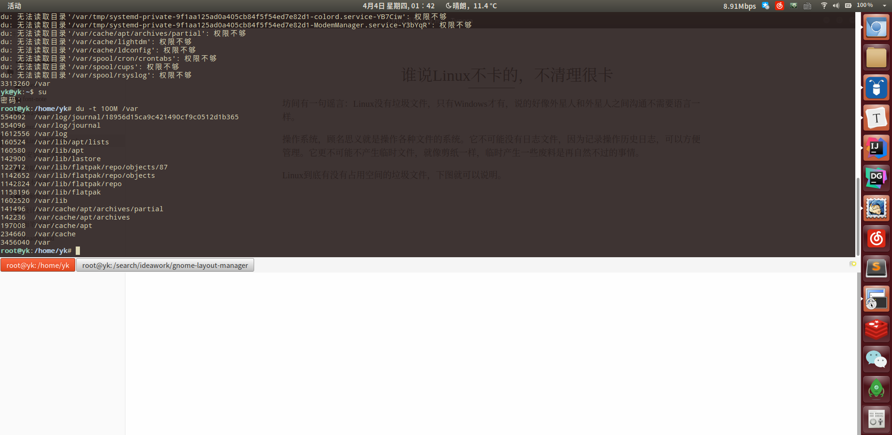

## 	谁说Linux不卡的，不清理很卡

坊间有一句谣言：Linux没有垃圾文件，只有Windows才有，说的好像外星人和外星人之间沟通不需要语言一样。

操作系统，顾名思义就是操作各种文件的系统。它不可能没有日志文件，因为记录操作历史日志，可以方便管理。它更不可能不产生临时文件，就像剪纸一样，临时产生一些废料是再自然不过的事情。

Linux到底有没有占用空间的垃圾文件，下图就可以说明。

### 清理/分区的文件

未清理前发现硬盘根分区空间告急，用`du -t 100M /var`或`journalctl --disk-usage`命令一查，发现/var/log/journal日志文件占用了近3G空间，每个日志文件体积高达128M，这些日志文件记录了很长时间以来的systemd情况，毫无价值，用`journalctl --vacuum-size=10M`命令将其清理之后，腾出了2.7G的空间。用`df`命令一查，／根分区果然宽敞了很多。

### 清理~/.cache

1，找到日期大于365天的文件，直接删除之，命令：`find ~/.cache/ -type f -atime +365 -delete`

2，找到大于10M的文件，命令：`find ~/.cache/ -size +10M`，然后酌情清理之。

3，列出体积大于100M的目录，命令`du ~/.cache -t 100M` ，然后酌情清理之。

不过，这样手动清理效果不仅折腾人，而且效果也不是很完美。现在看来，Linux根本不是没有垃圾文件，而是没有这360安全卫士那样简单而又得力的垃圾清理工具啊！